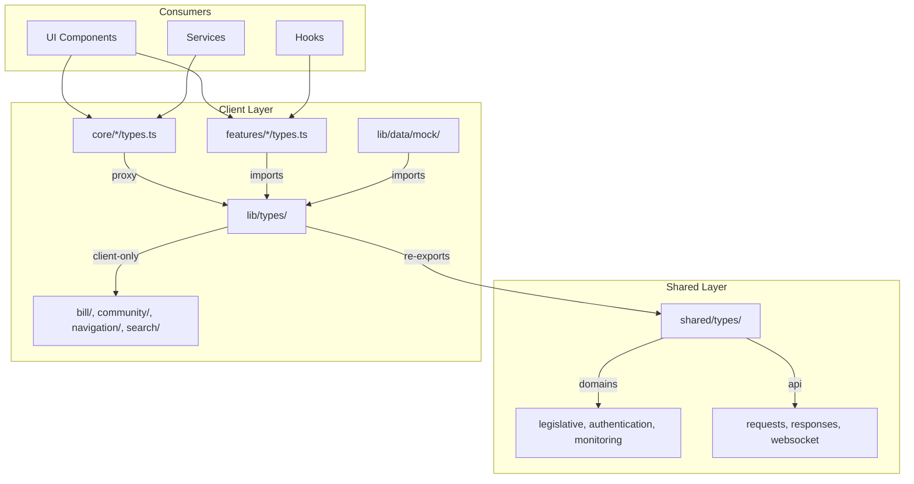
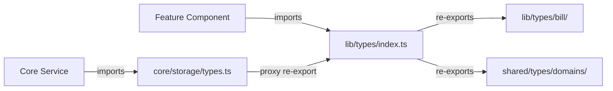
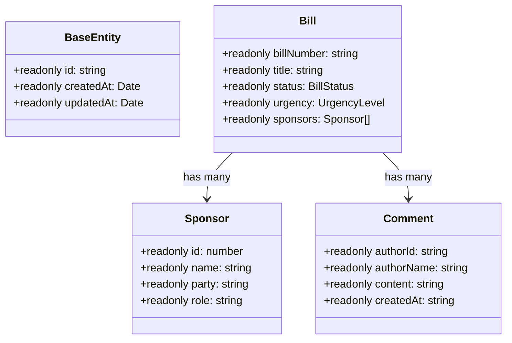

# Design Document

## Overview

### Current State Challenges
The Chanuka client codebase has fragmented type definitions across multiple locations:
- `@types/` (root-level ambient declarations - legacy)
- `client/src/lib/types/` (intended source of truth)
- `client/src/features/*/types.ts` (feature-local definitions)
- `shared/types/` (server-client common types)

This fragmentation causes:
- ~1000+ TypeScript compilation errors
- Conflicting interface definitions (e.g., `Bill`, `Sponsor`, `User`)
- Import path confusion
- Maintenance overhead

### Architectural Vision
Establish a **two-tier type system**:
1. **Shared Types** (`shared/types/`) → Server-client common entities
2. **Client Types** (`client/src/lib/types/`) → Client-only enriched types

All feature modules import from `lib/types/` which re-exports from `shared/` where appropriate.

## Architecture

### Type System Hierarchy



### Module Import Pattern



## Component Specifications

### 1. Central Type Gateway (`lib/types/index.ts`)

**Purpose:** Single entry point for all client type imports.

**Interface:**
```typescript
// Re-export client-specific types
export * from './bill';
export * from './community';
export * from './navigation';
export * from './search';
export * from './security';
export * from './analytics';

// Re-export shared types with aliases where needed
export type {
  Committee,
  BillPriority,
  Chamber,
} from '@shared/types/domains/legislative';

export type {
  User as AuthUser,
  UserProfile,
} from '@shared/types/domains/authentication';
```

**Key Features:**
- Barrel exports for each domain
- Explicit re-exports from shared (no wildcard to avoid conflicts)
- Type aliases where naming conflicts exist

### 2. Bill Type Module (`lib/types/bill/`)

**Purpose:** Complete bill-related type definitions.

**Structure:**
```
lib/types/bill/
├── index.ts        # Barrel exports
├── bill-base.ts    # Core Bill interface, enums
└── bill-analytics.ts # Engagement, tracking types
```

**Core Interface:**
```typescript
export interface Bill {
  readonly id: number;
  readonly billNumber: string;
  readonly title: string;
  readonly summary: string;
  readonly status: BillStatus;
  readonly urgency: UrgencyLevel;
  readonly complexity: ComplexityLevel;
  readonly introducedDate: string;
  readonly lastActionDate: string;
  readonly sponsors: readonly Sponsor[];
  readonly tags: readonly string[];
  readonly policyAreas: readonly string[];
  readonly trackingCount?: number;
  readonly viewCount?: number;
  readonly commentCount?: number;
  readonly constitutionalIssues?: readonly string[];
}
```

### 3. Core Module Proxies (`core/*/types.ts`)

**Purpose:** Maintain stable module boundaries while centralizing definitions.

**Pattern:**
```typescript
// core/storage/types.ts
export type {
  StorageConfig,
  CacheEntry,
  SessionInfo,
} from '@client/lib/types/storage';
```

**Benefits:**
- Consumers import from module (`@client/core/storage`)
- Definitions centralized in `lib/types/`
- Module API stability during migration

## Data Models

### Type Hierarchy



### Enum Definitions

```typescript
export enum BillStatus {
  INTRODUCED = 'introduced',
  COMMITTEE = 'committee',
  FLOOR_DEBATE = 'floor_debate',
  PASSED = 'passed',
  FAILED = 'failed',
  SIGNED = 'signed',
  VETOED = 'vetoed',
}

export enum UrgencyLevel {
  LOW = 'low',
  MEDIUM = 'medium',
  HIGH = 'high',
  CRITICAL = 'critical',
}
```

## Error Handling Strategy

### Compile-Time Enforcement
- `strict: true` in tsconfig
- `noImplicitAny: true`
- No `export type` for enums used as values

### Import Resolution Errors
| Error | Cause | Resolution |
|-------|-------|------------|
| TS2307 | Missing module | Check path alias in tsconfig |
| TS2305 | Missing export | Add to barrel export |
| TS2339 | Missing property | Verify interface definition |
| TS2300 | Duplicate identifier | Remove duplicate declaration |

## Testing Strategy

### Type Validation
```bash
# Full type check
npx tsc --noEmit

# Count errors
npx tsc --noEmit 2>&1 | grep "error TS" | wc -l

# Check specific file
npx tsc --noEmit | grep "bills.ts"
```

### Regression Prevention
- Run `tsc` before each commit
- Track error count in MIGRATION_LOG.md
- Type contracts documented in CODEBASE_CONTEXT.md

## Migration Strategy

### Phase 1: Foundation (Complete)
- [x] Create `lib/types/index.ts` as gateway
- [x] Establish `@client` and `@shared` aliases
- [x] Create bill, community, navigation type modules

### Phase 2: Core Modules (In Progress)
- [x] Proxy `core/storage/types.ts`
- [x] Proxy `core/security/types.ts`
- [x] Proxy `core/monitoring/types.ts`
- [ ] Verify all core imports resolved

### Phase 3: Mock Data Alignment
- [x] Fix `bill-base.ts` duplicate properties
- [ ] Update `lib/data/mock/bills.ts` imports
- [ ] Verify mock data conforms to interfaces

### Phase 4: Verification
- [ ] Achieve <100 tsc errors
- [ ] Update MIGRATION_LOG.md
- [ ] Archive completed spec

## Success Criteria

1. `npx tsc --noEmit` exits with code 0 (or <100 errors)
2. All feature modules import from `lib/types/`
3. No duplicate type definitions across codebase
4. Mock data passes type checking
5. MIGRATION_LOG.md updated with completion status
