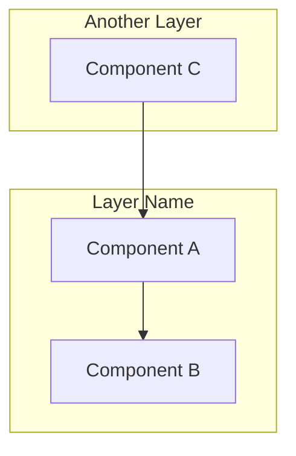
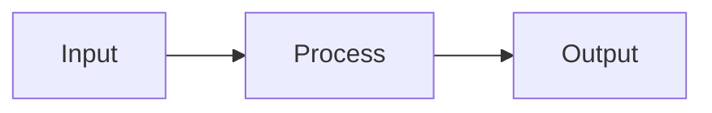
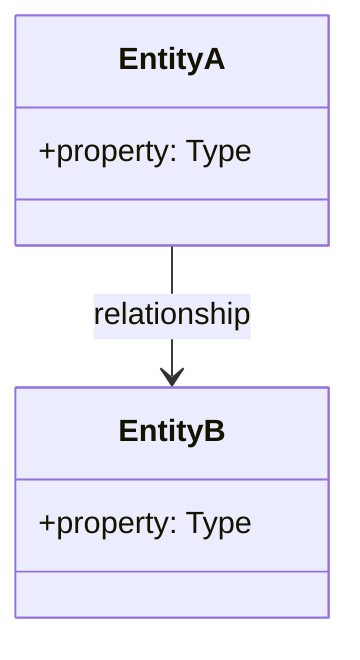

# Design Document Template

## Overview

### Current State Challenges
[Describe the problems, pain points, and technical debt being addressed]

### Architectural Vision
[Describe the target state and strategic direction]

## Architecture

### System Diagram



### Data Flow



## Component Specifications

### Component 1: [Name]

**Purpose:** [What this component does]

**Interface:**
```typescript
export interface ComponentConfig {
  readonly property: Type;
}
```

**Key Features:**
- Feature 1
- Feature 2

**Integration Points:**
- Integrates with [other component]

### Component 2: [Name]

[Repeat pattern...]

## Data Models

### Entity Relationships



### Key Interfaces

```typescript
export interface Entity {
  readonly id: string;
  readonly name: string;
}
```

## Error Handling Strategy

### Error Hierarchy
| Error Type | Cause | Resolution |
|------------|-------|------------|
| ErrorA | Condition | Action |

### Recovery Mechanisms
[Describe how the system recovers from failures]

## Testing Strategy

### Unit Testing
- [What to test at unit level]

### Integration Testing
- [What to test at integration level]

### Performance Testing
- [Performance criteria and benchmarks]

## Migration Strategy

### Phase 1: [Name]
- [ ] Task 1
- [ ] Task 2

### Phase 2: [Name]
- [ ] Task 1
- [ ] Task 2

### Rollback Plan
[How to revert if migration fails]

## Success Criteria

1. [Measurable criterion 1]
2. [Measurable criterion 2]
3. [Measurable criterion 3]
