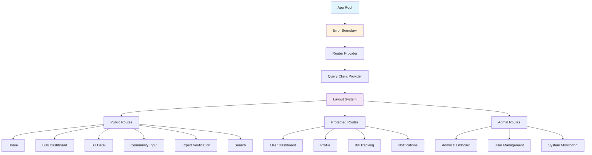

# Design Document

## Overview

This design addresses critical app rendering issues in the Chanuka Legislative Transparency Platform and creates an optimized user journey through improved information architecture, navigation patterns, and error handling. The solution focuses on fixing immediate rendering problems while establishing a scalable navigation structure that guides users efficiently through legislative data, analysis tools, and community features.

## Architecture

### Current Issues Analysis

**Rendering Problems Identified:**
1. HTML viewport meta tag contains `maximum-scale=1` which violates accessibility standards
2. Lazy-loaded components may fail without proper error boundaries
3. Database connection failures can cause app crashes
4. Missing fallback states for API failures
5. Inconsistent error handling across components

**Navigation Structure Issues:**
1. Flat routing structure without clear hierarchical relationships
2. Missing contextual navigation between related features
3. No clear user journey paths for different user types
4. Inconsistent navigation patterns across sections

### Solution Architecture



## Components and Interfaces

### 1. Error Handling System

**Enhanced Error Boundary Component:**
```typescript
interface ErrorBoundaryState {
  hasError: boolean;
  error: Error | null;
  errorInfo: ErrorInfo | null;
  retryCount: number;
}

interface ErrorFallbackProps {
  error: Error;
  resetError: () => void;
  context: 'page' | 'component' | 'api';
}
```

**Graceful Degradation Strategy:**
- API failures → Show cached data or demo mode
- Component failures → Show simplified fallback UI
- Database failures → Continue with read-only sample data

### 2. Navigation Architecture

**Primary Navigation Structure:**
```
├── Home (/)
├── Legislative Data
│   ├── Bills Dashboard (/bills)
│   ├── Bill Detail (/bills/:id)
│   ├── Bill Analysis (/bills/:id/analysis)
│   └── Sponsorship Analysis (/bill-sponsorship-analysis)
├── Community
│   ├── Community Input (/community)
│   ├── Expert Verification (/expert-verification)
│   └── Comments (/comments)
├── User Features (Protected)
│   ├── Dashboard (/dashboard)
│   ├── Profile (/profile)
│   ├── User Profile (/user-profile)
│   └── Onboarding (/onboarding)
├── Tools
│   └── Search (/search)
└── Admin (Role-based)
    └── Admin Panel (/admin)
```

**Navigation Context System:**
```typescript
interface NavigationContext {
  currentSection: 'legislative' | 'community' | 'user' | 'admin';
  breadcrumbs: BreadcrumbItem[];
  relatedPages: RelatedPage[];
  userRole: 'public' | 'authenticated' | 'admin';
}

interface RelatedPage {
  title: string;
  path: string;
  description: string;
  relevanceScore: number;
}
```

### 3. User Journey Optimization

**User Flow Mapping:**

**New User Journey:**
1. Home → Bills Dashboard → Bill Detail → Community Input
2. Home → Search → Bill Detail → Analysis
3. Home → Expert Verification → Community Input

**Returning User Journey:**
1. Dashboard → Bill Tracking → Bill Detail → Analysis
2. Profile → Notifications → Bill Detail
3. Dashboard → Search → Bill Analysis

**Admin User Journey:**
1. Admin Dashboard → System Monitoring → User Management
2. Admin Dashboard → Bill Management → Community Moderation

### 4. Responsive Navigation System

**Mobile Navigation Component:**
```typescript
interface MobileNavProps {
  isOpen: boolean;
  onToggle: () => void;
  currentPath: string;
  userRole: UserRole;
}

interface NavigationItem {
  label: string;
  path: string;
  icon: LucideIcon;
  requiresAuth: boolean;
  adminOnly: boolean;
  children?: NavigationItem[];
}
```

**Desktop Navigation Layout:**
- Persistent sidebar for main sections
- Contextual breadcrumbs
- Related page suggestions
- Quick action buttons

## Data Models

### Navigation State Management

```typescript
interface AppState {
  navigation: {
    currentPath: string;
    previousPath: string;
    breadcrumbs: BreadcrumbItem[];
    sidebarOpen: boolean;
    mobileMenuOpen: boolean;
  };
  user: {
    isAuthenticated: boolean;
    role: UserRole;
    preferences: NavigationPreferences;
  };
  system: {
    isOnline: boolean;
    databaseConnected: boolean;
    apiHealth: ApiHealthStatus;
  };
}

interface NavigationPreferences {
  defaultLandingPage: string;
  favoritePages: string[];
  recentlyVisited: RecentPage[];
  compactMode: boolean;
}
```

### Page Relationship Mapping

```typescript
interface PageRelationship {
  pageId: string;
  relatedPages: {
    [key: string]: {
      type: 'parent' | 'child' | 'sibling' | 'related';
      weight: number;
      context: string;
    };
  };
}

// Example relationships
const billDetailRelationships = {
  '/bills/:id': {
    '/bills/:id/analysis': { type: 'child', weight: 1.0, context: 'analysis' },
    '/bills': { type: 'parent', weight: 0.8, context: 'listing' },
    '/bill-sponsorship-analysis': { type: 'related', weight: 0.7, context: 'sponsorship' },
    '/community': { type: 'related', weight: 0.6, context: 'discussion' }
  }
};
```

## Error Handling

### Comprehensive Error Strategy

**1. HTML/Viewport Issues:**
- Remove `maximum-scale=1` from viewport meta tag
- Add proper accessibility attributes
- Implement responsive design without scale restrictions

**2. Component Error Boundaries:**
```typescript
class PageErrorBoundary extends Component<Props, State> {
  static getDerivedStateFromError(error: Error): State {
    return {
      hasError: true,
      error,
      retryCount: 0
    };
  }

  componentDidCatch(error: Error, errorInfo: ErrorInfo) {
    // Log error to monitoring service
    this.logError(error, errorInfo);
  }

  render() {
    if (this.state.hasError) {
      return <ErrorFallback 
        error={this.state.error}
        resetError={this.resetError}
        context="page"
      />;
    }
    return this.props.children;
  }
}
```

**3. API Error Handling:**
```typescript
interface ApiErrorHandler {
  onNetworkError: () => void;
  onServerError: (status: number) => void;
  onTimeoutError: () => void;
  fallbackData?: any;
}

const useApiWithFallback = (endpoint: string, fallbackData?: any) => {
  const { data, error, isLoading } = useQuery({
    queryKey: [endpoint],
    queryFn: () => fetchWithFallback(endpoint, fallbackData),
    retry: (failureCount, error) => {
      if (error.status === 404) return false;
      return failureCount < 3;
    }
  });
};
```

**4. Database Connection Fallbacks:**
- Implement demo mode with sample data
- Cache successful API responses
- Provide offline-first functionality for critical features

## Testing Strategy

### Error Handling Tests
1. **Component Error Boundaries:**
   - Test error boundary catches and displays fallback UI
   - Verify error logging and reporting
   - Test error recovery mechanisms

2. **API Failure Scenarios:**
   - Network disconnection handling
   - Server error responses (4xx, 5xx)
   - Timeout handling
   - Fallback data presentation

3. **Navigation Flow Tests:**
   - User journey completion rates
   - Navigation accessibility compliance
   - Mobile navigation functionality
   - Cross-browser compatibility

### Performance Testing
1. **Page Load Performance:**
   - Initial page load under 2 seconds
   - Lazy loading effectiveness
   - Bundle size optimization

2. **Navigation Performance:**
   - Route transition speed
   - Component mounting/unmounting efficiency
   - Memory usage during navigation

### User Experience Testing
1. **Navigation Usability:**
   - Task completion rates for common user journeys
   - Navigation discoverability
   - Mobile touch target accessibility

2. **Error Recovery:**
   - User ability to recover from errors
   - Clarity of error messages
   - Effectiveness of retry mechanisms

## Implementation Phases

### Phase 1: Critical Fixes
- Fix HTML viewport meta tag
- Implement comprehensive error boundaries
- Add API fallback mechanisms
- Establish demo mode for database failures

### Phase 2: Navigation Enhancement
- Implement new navigation architecture
- Add contextual page relationships
- Create responsive navigation components
- Establish user journey tracking

### Phase 3: Optimization
- Performance optimization
- Advanced error recovery
- User preference persistence
- Analytics integration

This design ensures the Chanuka platform provides a reliable, accessible, and intuitive user experience while maintaining robust error handling and optimal navigation flows.