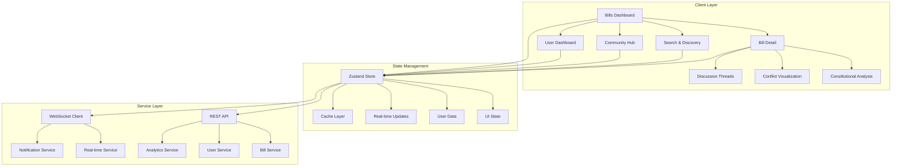

# Chanuka Client UI Upgrade - Design Document

## Overview

The Chanuka client UI upgrade transforms the platform into a sophisticated civic engagement system through three foundational design principles:

1. **Progressive Disclosure Architecture** - Information reveals itself based on user need and context
2. **Unified Civic Workflow** - Discovery, analysis, and action integrate into coherent experiences  
3. **Transparent Intelligence Layer** - AI and algorithmic systems make their reasoning visible and contestable

The design leverages modern web technologies optimized for performance, accessibility, and civic engagement at scale.

## Architecture

### System Architecture



### Technology Stack

- **Frontend Framework:** React 18 with TypeScript in strict mode
- **Build Tool:** Vite for fast development and optimized production builds
- **Styling:** Tailwind CSS with custom design system tokens
- **State Management:** Zustand with normalized data structures
- **Routing:** React Router with code splitting and lazy loading
- **Component Library:** shadcn/ui for accessible, customizable components
- **Real-time:** WebSocket middleware for live updates
- **Testing:** Jest and React Testing Library with accessibility testing

## Components and Interfaces

### Core Layout Components

#### AppShell
- **Purpose:** Root layout with navigation, auth state, and error boundaries
- **Features:** Responsive navigation, theme switching, error recovery
- **Accessibility:** Skip links, landmark regions, keyboard shortcuts

#### NavigationBar
- **Purpose:** Primary navigation with search, notifications, user menu
- **Features:** Responsive collapse, search integration, notification badges
- **Mobile:** Hamburger menu with slide-out drawer

### Bills Dashboard Components

#### BillsDashboard
- **Layout:** Statistics overview, filter panel, bills grid, pagination
- **Responsive:** 3-column desktop, 2-column tablet, 1-column mobile
- **Performance:** Virtual scrolling for large datasets, lazy loading

#### StatsOverview
- **Metrics:** Total bills, urgent count, constitutional flags, trending
- **Updates:** Real-time via WebSocket with smooth animations
- **Visualization:** Progress indicators, trend arrows, color coding

#### BillCard
- **Information:** Title, summary, status, urgency, engagement metrics
- **Interactions:** Hover actions (save, share, comment), keyboard navigation
- **Visual Design:** Color-coded borders, urgency badges, constitutional flags

#### FilterPanel
- **Categories:** Bill type, policy areas, sponsors, timeframe, urgency
- **Interface:** Desktop sidebar, mobile bottom sheet
- **Features:** Active filter chips, result counts, URL synchronization

### Bill Detail Components

#### BillDetailView
- **Structure:** Header, quick actions, tabbed content, progressive navigation
- **Tabs:** Overview, Full Text, Analysis, Sponsors, Community, Related
- **Performance:** Lazy tab loading, content caching, prefetching

#### ProgressiveNavigation
- **Features:** Reading progress, complexity indicators, section jumps
- **Mobile:** Dropdown selector with smooth scrolling
- **Accessibility:** Keyboard navigation, screen reader announcements

#### ConstitutionalAnalysisPanel
- **Content:** Expert analysis, severity indicators, legal precedents
- **Interactions:** Expandable sections, expert verification display
- **Actions:** Civic guidance, contact representatives, join campaigns

#### ConflictVisualization
- **Technology:** D3.js network graphs with accessibility fallbacks
- **Data:** Financial exposure, organizational connections, voting patterns
- **Interactions:** Node selection, zoom/pan, keyboard navigation

### Community Components

#### DiscussionThread
- **Structure:** Nested comments (5 levels), voting, moderation
- **Real-time:** Live comment updates, typing indicators
- **Moderation:** Community reporting, transparent actions

#### ExpertBadge
- **Types:** Official Expert (gold), Domain Expert (silver), Verified (blue)
- **Information:** Credentials, credibility score, specializations
- **Interactions:** Expandable details, verification history

#### EngagementAnalytics
- **Metrics:** Participation rates, sentiment analysis, expert consensus
- **Visualization:** Real-time charts, trend indicators
- **Personalization:** Individual civic scores, contribution tracking

## Data Models

### Core Entities

#### Bill
```typescript
interface Bill {
  id: string;
  billNumber: string;
  title: string;
  summary: string;
  fullText: string;
  status: BillStatus;
  urgencyLevel: UrgencyLevel;
  introducedDate: Date;
  lastUpdated: Date;
  
  // Relationships
  sponsors: Sponsor[];
  committees: Committee[];
  amendments: Amendment[];
  relatedBills: string[];
  
  // Analysis
  constitutionalFlags: ConstitutionalFlag[];
  pretextDetection: PretextAnalysis | null;
  impactAssessment: ImpactAssessment;
  
  // Engagement
  viewCount: number;
  saveCount: number;
  commentCount: number;
  shareCount: number;
  
  // Metadata
  policyAreas: string[];
  geographicScope: GeographicScope;
  complexity: ComplexityLevel;
  readingTime: ReadingTime;
}
```

#### Expert
```typescript
interface Expert {
  userId: string;
  verificationType: "official" | "domain" | "identity";
  credentials: Credential[];
  affiliations: Affiliation[];
  specializations: string[];
  credibilityScore: number;
  contributionCount: number;
  avgCommunityRating: number;
  verified: boolean;
  verificationDate: Date;
}
```

#### ConstitutionalFlag
```typescript
interface ConstitutionalFlag {
  id: string;
  severity: "critical" | "high" | "moderate" | "low";
  category: string;
  description: string;
  affectedProvisions: BillProvision[];
  constitutionalReference: ConstitutionalReference[];
  expertAnalysis: ExpertAnalysis[];
  communityDiscussion: string;
}
```

## Error Handling

### Hierarchical Error Management

#### Error Types
- **Critical:** App cannot function (authentication failure)
- **High:** Feature unavailable (WebSocket disconnection)
- **Medium:** Degraded experience (slow API response)
- **Low:** Minor issue (image loading failure)

#### Recovery Strategies
- **Network Errors:** Automatic retry with exponential backoff
- **Authentication Errors:** Redirect to login with context preservation
- **Validation Errors:** Inline feedback with correction guidance
- **Server Errors:** Graceful degradation with cached content

#### Error Boundaries
- **Global:** Catches unhandled errors, provides recovery options
- **Feature:** Isolates component failures, maintains app stability
- **Route:** Handles navigation errors, provides fallback content

## Testing Strategy

### Testing Pyramid

#### Unit Tests
- Component behavior and props handling
- State management and reducers
- Utility functions and helpers
- API service methods

#### Integration Tests
- User workflows (bill discovery, detail viewing)
- Real-time updates and WebSocket integration
- Authentication and authorization flows
- Filter and search functionality

#### Accessibility Tests
- WCAG 2.1 AA compliance verification
- Keyboard navigation testing
- Screen reader compatibility
- Color contrast validation

#### Performance Tests
- Core Web Vitals measurement
- Bundle size monitoring
- Memory usage profiling
- Network request optimization

### Testing Tools
- **Jest:** Unit testing framework
- **React Testing Library:** Component testing
- **Playwright:** End-to-end testing
- **axe-core:** Accessibility testing
- **Lighthouse CI:** Performance monitoring

## Performance Optimization

### Loading Strategy
- **Critical Path:** Above-fold content loads first
- **Code Splitting:** Route-based bundles with lazy loading
- **Resource Hints:** DNS prefetch, preconnect, preload
- **Service Worker:** Maintain existing caching strategy with background sync

### Bundle Optimization
- **Main Bundle:** Maintain < 100KB gzipped
- **Route Bundles:** Keep < 50KB per route
- **Vendor Splitting:** React, UI components, charts separate
- **Tree Shaking:** Eliminate unused code

### Runtime Performance
- **Virtual Scrolling:** Large lists with windowing
- **Memoization:** Expensive computations cached
- **Debouncing:** Search and filter inputs
- **Web Workers:** Heavy processing off main thread

## Security Implementation

### Content Security Policy
```typescript
const cspDirectives = {
  "default-src": ["'self'"],
  "script-src": ["'self'", "'nonce-{NONCE}'", "https://cdn.chanuka.ke"],
  "style-src": ["'self'", "'unsafe-inline'", "https://cdn.chanuka.ke"],
  "img-src": ["'self'", "data:", "https:", "blob:"],
  "connect-src": ["'self'", "https://api.chanuka.ke", "wss://ws.chanuka.ke"],
  "frame-ancestors": ["'none'"],
  "base-uri": ["'self'"]
};
```

### Input Validation
- **Client-side:** Zod schemas for runtime validation
- **Sanitization:** DOMPurify for HTML content
- **CSRF Protection:** Token-based validation
- **XSS Prevention:** Content Security Policy enforcement

### Authentication Security
- **Password Requirements:** 12+ characters, complexity rules
- **Session Management:** HttpOnly cookies, SameSite attributes
- **Two-Factor Auth:** TOTP-based with backup codes
- **Rate Limiting:** Login attempts and API requests

## Accessibility Features

### WCAG 2.1 AA Compliance

#### Keyboard Navigation
- **Tab Order:** Logical sequence through interactive elements
- **Focus Management:** Clear indicators, trapped focus in modals
- **Shortcuts:** Skip links, application shortcuts
- **Custom Controls:** ARIA patterns for complex widgets

#### Screen Reader Support
- **Semantic HTML:** Proper heading hierarchy, landmark regions
- **ARIA Labels:** Descriptive labels for complex interactions
- **Live Regions:** Dynamic content announcements
- **Alternative Text:** Meaningful descriptions for images

#### Visual Accessibility
- **Color Contrast:** 4.5:1 for normal text, 3:1 for large text
- **Color Independence:** Information not conveyed by color alone
- **Text Scaling:** Readable at 200% zoom
- **Motion Preferences:** Respect prefers-reduced-motion

## Mobile Optimization

### Responsive Design
- **Breakpoints:** 320px (mobile), 768px (tablet), 1024px (desktop)
- **Touch Targets:** Minimum 44px for interactive elements
- **Gestures:** Swipe navigation, pull-to-refresh
- **Viewport:** Proper scaling, orientation handling

### Mobile-Specific Patterns
- **Bottom Sheets:** Filter panels, action menus
- **Tab Bars:** Primary navigation on small screens
- **Sticky Actions:** Important buttons remain accessible
- **Progressive Disclosure:** Collapsible content sections

## Real-time Features

### Extension of Existing WebSocket Client for Civic Features
- **Connection Management:** Leverage existing automatic reconnection with exponential backoff
- **Message Handling:** Extend current type-safe message processing for civic workflows
- **Subscription Model:** Utilize existing bill-specific and user-specific channels
- **Fallback Strategy:** Maintain current polling fallback when WebSocket unavailable

### Live Updates
- **Bill Status:** Real-time status changes with animations
- **Comments:** New comments appear without refresh
- **Engagement Metrics:** Live participation counters
- **Notifications:** In-app alerts for relevant events

## Monitoring and Analytics

### Performance Monitoring
- **Core Web Vitals:** LCP, FID, CLS tracking
- **User Experience:** Error rates, conversion funnels
- **Resource Usage:** Bundle sizes, API response times
- **Real User Monitoring:** Actual user performance data

### User Analytics
- **Engagement Tracking:** Feature usage, time spent
- **Conversion Metrics:** Bill saves, comment posts, shares
- **User Journeys:** Navigation patterns, drop-off points
- **A/B Testing:** Feature effectiveness measurement

## Deployment Strategy

### Environment Configuration
- **Development:** Local API, debug tools enabled
- **Staging:** Production-like environment for testing
- **Production:** Optimized builds, monitoring enabled

### Build Process
- **Quality Gates:** Linting, type checking, testing
- **Bundle Analysis:** Size monitoring, dependency auditing
- **Performance Budgets:** Automated threshold enforcement
- **Security Scanning:** Vulnerability detection

### Rollout Strategy
- **Feature Flags:** Gradual feature enablement
- **Canary Deployment:** Limited user exposure initially
- **Monitoring:** Real-time error and performance tracking
- **Rollback Plan:** Quick reversion capability

This design provides a comprehensive foundation for building a world-class civic engagement platform that balances sophisticated functionality with accessibility, performance, and user experience excellence.