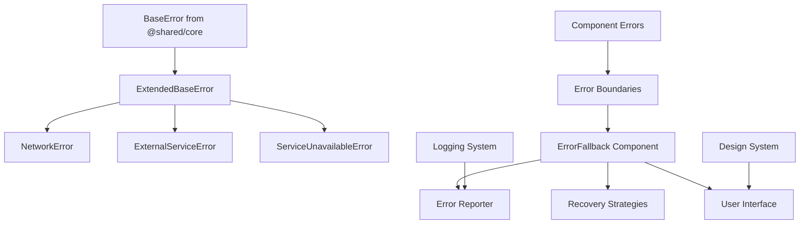

# Design Document

## Overview

This design document outlines the approach for fixing critical client-side error handling issues in the Chanuka Legislative Transparency Platform. The primary focus is resolving TypeScript compilation errors in the ErrorFallback component while maintaining robust error handling capabilities.

## Architecture

### Error Handling System Architecture



### Type System Integration

The error handling system integrates with the existing BaseError class from the shared core module, ensuring type safety and consistency across the application.

## Components and Interfaces

### 1. ExtendedBaseError Class

**Purpose:** Provide a wrapper around BaseError that maintains compatibility with existing error handling code.

**Key Features:**
- Proper constructor parameter handling
- Metadata access through BaseError's built-in properties
- User-friendly message generation
- Context preservation

**Implementation Strategy:**
```typescript
class ExtendedBaseError extends BaseError {
  constructor(
    message: string, 
    code: string, 
    domain: ErrorDomain, 
    severity: ErrorSeverity = ErrorSeverity.MEDIUM, 
    context?: any
  ) {
    super(message, {
      code,
      domain,
      severity,
      context
    });
  }
}
```

### 2. Error Reporter System

**Purpose:** Provide consistent error reporting and feedback collection.

**Key Features:**
- Error report generation
- Recovery option suggestions
- Feedback submission
- Error correlation

**Implementation Strategy:**
```typescript
interface ErrorReporter {
  generateReport(error: BaseError): ErrorReport;
  generateRecoveryOptions(error: BaseError): RecoveryOption[];
  submitFeedback(errorId: string, feedback: string): Promise<void>;
}
```

### 3. Specialized Error Classes

**Purpose:** Provide domain-specific error types with appropriate defaults.

**Key Features:**
- NetworkError for connection issues
- ExternalServiceError for third-party service failures
- ServiceUnavailableError for system unavailability

### 4. Error Fallback Components

**Purpose:** Provide user-friendly error displays with recovery options.

**Key Features:**
- Contextual error messages
- Recovery action buttons
- Error reporting integration
- Responsive design

## Data Models

### ErrorReport Interface

```typescript
interface ErrorReport {
  id: string;
  timestamp: string;
  error: string;
  code: string;
  domain: ErrorDomain;
  context?: any;
  userMessage?: string;
  technicalDetails?: string;
  recoveryOptions?: RecoveryOption[];
}
```

### RecoveryOption Interface

```typescript
interface RecoveryOption {
  label: string;
  action: string;
  description?: string;
}
```

### ErrorFallbackProps Interface

```typescript
interface ErrorFallbackProps {
  error: Error;
  resetError: () => void;
  context?: string;
  retryCount?: number;
  errorType?: string;
  errorSeverity?: ErrorSeverity;
  canRecover?: boolean;
  onReportError?: () => void;
}
```

## Error Handling

### Error Classification Strategy

1. **Domain-based Classification:** Errors are classified by domain (network, system, validation, etc.)
2. **Severity-based Handling:** Different UI and recovery strategies based on severity
3. **Context-aware Messaging:** Error messages adapt to the context where they occur

### Recovery Mechanisms

1. **Automatic Recovery:** For transient errors with retry strategies
2. **User-initiated Recovery:** For errors requiring user action
3. **Fallback Strategies:** For critical errors that cannot be recovered

### Error Boundary Integration

Error boundaries catch component errors and route them through the standardized error handling system, ensuring consistent error display and reporting.

## Testing Strategy

### Unit Testing

1. **Error Class Testing:** Verify proper constructor behavior and property access
2. **Error Reporter Testing:** Validate report generation and feedback submission
3. **Component Testing:** Test error fallback rendering and user interactions

### Integration Testing

1. **Error Boundary Testing:** Verify error catching and fallback rendering
2. **Recovery Testing:** Test error recovery mechanisms
3. **Logging Integration:** Validate error logging and monitoring

### Error Scenario Testing

1. **Network Errors:** Test connection failure scenarios
2. **Component Errors:** Test React component error scenarios
3. **System Errors:** Test system-level error scenarios

## Implementation Phases

### Phase 1: Type System Fixes
- Fix BaseError constructor calls
- Update metadata access patterns
- Resolve TypeScript compilation errors

### Phase 2: Error Reporter Enhancement
- Implement missing error reporter methods
- Add proper error report generation
- Integrate feedback submission

### Phase 3: Component Integration
- Update error fallback components
- Integrate with design system
- Add recovery mechanisms

### Phase 4: Testing and Validation
- Add comprehensive error tests
- Validate error scenarios
- Performance testing for error handling

## Performance Considerations

1. **Error Object Creation:** Minimize overhead in error object creation
2. **Stack Trace Capture:** Optimize stack trace capture for performance
3. **Error Logging:** Implement efficient error logging without blocking UI
4. **Memory Management:** Prevent memory leaks in error handling code

## Security Considerations

1. **Sensitive Data:** Sanitize error logs to prevent sensitive data exposure
2. **Error Messages:** Ensure error messages don't reveal system internals
3. **Error Reporting:** Validate error reports before submission
4. **Context Data:** Filter context data to remove sensitive information