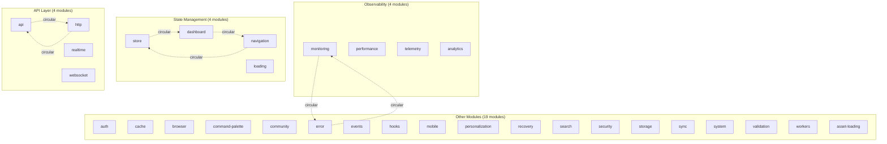
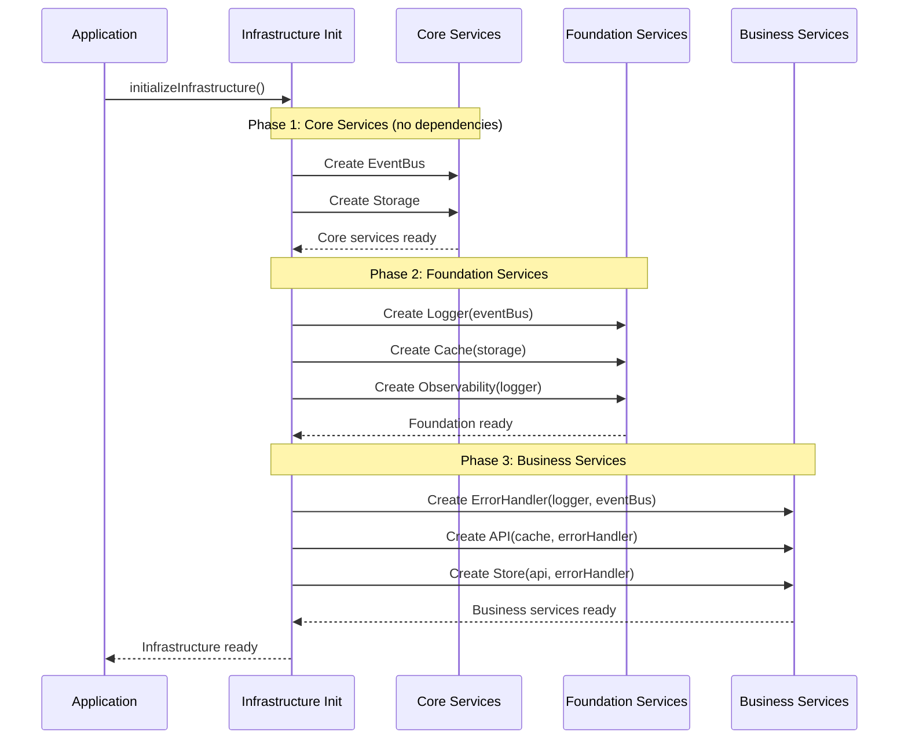
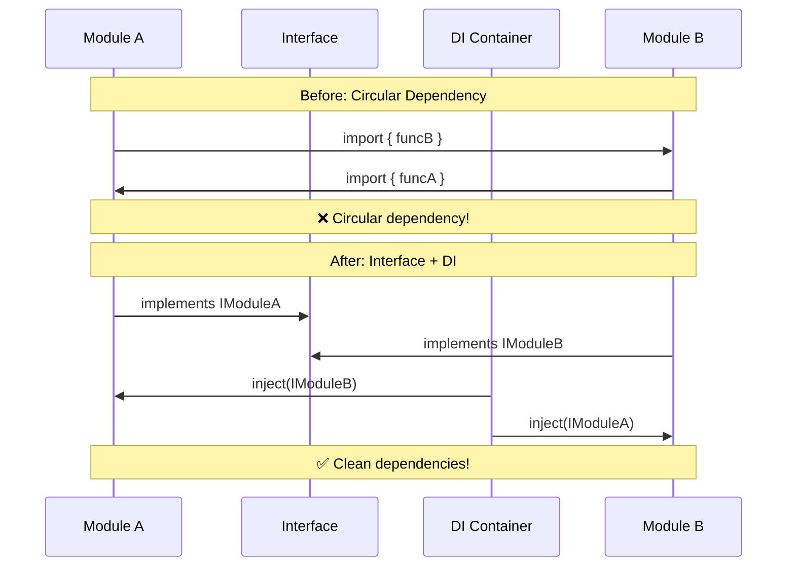

# Design Document: Client Infrastructure Consolidation

## Overview

This project consolidates and refactors the client infrastructure from 31 modules to approximately 20 modules, eliminating circular dependencies, standardizing module structure, and creating a clean public API. The consolidation focuses on three key areas: observability (monitoring, performance, telemetry, analytics), state management (store, dashboard, navigation, loading), and API layer (api, http, realtime, websocket). Additionally, this project integrates three critical cross-cutting concerns: unified error handling (aligning client/server error types with HTTP boundary serialization), unified logging infrastructure (replacing 200+ console.* calls with structured logging), and validation consolidation (standardizing validation patterns and error handling). The refactoring establishes clear module boundaries, implements dependency injection to eliminate 5+ circular dependencies, and standardizes folder structure across all modules. This foundation enables 2.5x faster feature development velocity, zero circular dependencies, 100% public API coverage, and clear module responsibilities. The project is designed for a development environment with no users, allowing for more disruptive changes that prioritize long-term sustainability over short-term stability.

## Architecture

### Current State (31 Modules)



### Target State (20 Modules)

```mermaid
graph TD
    subgraph "Observability (1 module)"
        OBS[observability]
        OBS_MON[error-monitoring]
        OBS_PERF[performance]
        OBS_TEL[telemetry]
        OBS_ANA[analytics]
        
        OBS --> OBS_MON
        OBS --> OBS_PERF
        OBS --> OBS_TEL
        OBS --> OBS_ANA
    end
    
    subgraph "State Management (1 module)"
        STATE[store]
        STATE_DASH[slices/dashboard]
        STATE_NAV[slices/navigation]
        STATE_LOAD[slices/loading]
        
        STATE --> STATE_DASH
        STATE --> STATE_NAV
        STATE --> STATE_LOAD
    end
    
    subgraph "API Layer (1 module)"
        API_MOD[api]
        API_HTTP[http]
        API_WS[websocket]
        API_RT[realtime]
        
        API_MOD --> API_HTTP
        API_MOD --> API_WS
        API_MOD --> API_RT
    end
    
    subgraph "Core Modules (17 modules)"
        AUTH[auth]
        CACHE[cache]
        BROWSER[browser]
        CMD[command-palette]
        COMM[community]
        EVENTS[events]
        HOOKS[hooks]
        MOBILE[mobile]
        PERSON[personalization]
        SEARCH[search]
        SEC[security]
        STOR[storage]
        SYNC[sync]
        SYS[system]
        VALID[validation]
        WORKERS[workers]
        ASSET[asset-loading]
    end
    
    OBS -->|clean| API_MOD
    STATE -->|clean| API_MOD
    API_MOD -->|clean| AUTH
```



## Sequence Diagrams

### Module Initialization Flow




### Circular Dependency Elimination Flow



## Components and Interfaces

### Component 1: Observability Module

**Purpose**: Unified observability infrastructure consolidating error monitoring, performance tracking, telemetry, and analytics.

**Interface**:
```pascal
INTERFACE IObservability
  PROCEDURE trackError(error: Error, context: ErrorContext): VOID
  PROCEDURE trackPerformance(metric: PerformanceMetric): VOID
  PROCEDURE trackEvent(event: AnalyticsEvent): VOID
  PROCEDURE sendTelemetry(data: TelemetryData): VOID
  FUNCTION getMetrics(): ObservabilityMetrics
END INTERFACE

STRUCTURE ErrorContext
  component: String
  operation: String
  userId: Optional<String>
  metadata: Dictionary<String, Any>
END STRUCTURE

STRUCTURE PerformanceMetric
  name: String
  value: Number
  unit: String
  timestamp: DateTime
END STRUCTURE
```

**Responsibilities**:
- Centralized error tracking and monitoring
- Performance metrics collection and reporting
- Analytics event tracking
- Telemetry data aggregation
- Integration with external monitoring services (Sentry, etc.)

**Sub-modules**:
- `error-monitoring/`: Error tracking, aggregation, and reporting
- `performance/`: Web vitals, performance budgets, monitoring
- `telemetry/`: System telemetry and diagnostics
- `analytics/`: User behavior tracking and analytics


### Component 2: State Management Module

**Purpose**: Unified Redux store with organized slices for dashboard, navigation, and loading states.

**Interface**:
```pascal
INTERFACE IStateManager
  FUNCTION getState(): RootState
  PROCEDURE dispatch(action: Action): VOID
  FUNCTION subscribe(listener: StateListener): Unsubscribe
  FUNCTION select(selector: Selector): Any
END INTERFACE

STRUCTURE RootState
  dashboard: DashboardState
  navigation: NavigationState
  loading: LoadingState
  auth: AuthState
  [key: String]: Any
END STRUCTURE

STRUCTURE DashboardState
  activeWidgets: Array<Widget>
  layout: LayoutConfig
  preferences: UserPreferences
END STRUCTURE

STRUCTURE NavigationState
  currentRoute: Route
  history: Array<Route>
  breadcrumbs: Array<Breadcrumb>
END STRUCTURE

STRUCTURE LoadingState
  operations: Dictionary<String, LoadingOperation>
  globalLoading: Boolean
END STRUCTURE
```

**Responsibilities**:
- Centralized application state management
- Redux store configuration and middleware
- State slices for different domains
- State persistence and hydration
- DevTools integration

**Sub-modules**:
- `slices/dashboard/`: Dashboard state and actions
- `slices/navigation/`: Navigation state and routing
- `slices/loading/`: Loading states and operations
- `middleware/`: Custom Redux middleware


### Component 3: API Module

**Purpose**: Unified API layer consolidating HTTP client, WebSocket, and realtime communication.

**Interface**:
```pascal
INTERFACE IAPIClient
  FUNCTION request(config: RequestConfig): Promise<Response>
  FUNCTION get(url: String, config: Optional<RequestConfig>): Promise<Response>
  FUNCTION post(url: String, data: Any, config: Optional<RequestConfig>): Promise<Response>
  FUNCTION put(url: String, data: Any, config: Optional<RequestConfig>): Promise<Response>
  FUNCTION delete(url: String, config: Optional<RequestConfig>): Promise<Response>
END INTERFACE

INTERFACE IWebSocketClient
  PROCEDURE connect(url: String, options: WebSocketOptions): VOID
  PROCEDURE disconnect(): VOID
  PROCEDURE send(message: WebSocketMessage): VOID
  FUNCTION subscribe(channel: String, handler: MessageHandler): Unsubscribe
  FUNCTION getConnectionState(): ConnectionState
END INTERFACE

INTERFACE IRealtimeClient
  PROCEDURE subscribe(topic: String, handler: EventHandler): Subscription
  PROCEDURE unsubscribe(subscription: Subscription): VOID
  PROCEDURE publish(topic: String, data: Any): VOID
  FUNCTION isConnected(): Boolean
END INTERFACE

STRUCTURE RequestConfig
  url: String
  method: HttpMethod
  headers: Dictionary<String, String>
  params: Dictionary<String, String>
  data: Optional<Any>
  timeout: Number
  retryConfig: Optional<RetryConfig>
END STRUCTURE
```

**Responsibilities**:
- HTTP request/response handling
- WebSocket connection management
- Realtime event subscriptions
- Request/response interceptors
- Error handling and retry logic
- Circuit breaker pattern
- Request caching and deduplication

**Sub-modules**:
- `http/`: HTTP client, interceptors, retry logic
- `websocket/`: WebSocket connection and message handling
- `realtime/`: Realtime event hub and subscriptions


### Component 4: Unified Error Handling System

**Purpose**: Consistent error handling across client and server with type-safe serialization and observability integration.

**Interface**:
```pascal
INTERFACE IErrorHandler
  FUNCTION handleError(error: Error, context: ErrorContext): ClientError
  FUNCTION createValidationError(fields: ValidationField[], context: ErrorContext): ClientError
  FUNCTION createNetworkError(message: String, statusCode: Number, context: ErrorContext): ClientError
  FUNCTION createBusinessError(code: String, message: String, context: ErrorContext): ClientError
  FUNCTION toApiError(error: ClientError): ApiErrorResponse
  FUNCTION fromApiError(response: ApiErrorResponse): ClientError
END INTERFACE

STRUCTURE ClientError EXTENDS BaseError
  id: String
  code: String
  type: ErrorDomain
  severity: ErrorSeverity
  message: String
  timestamp: Date
  correlationId: String
  context: ErrorContext
  recoverable: Boolean
  retryable: Boolean
  recoveryStrategies: Array<RecoveryStrategy>
END STRUCTURE

STRUCTURE BaseError
  id: String
  code: String
  type: ErrorDomain
  severity: ErrorSeverity
  message: String
  timestamp: Date
  correlationId: String
  context: ErrorContext
END STRUCTURE

STRUCTURE ApiErrorResponse
  success: Boolean
  error: {
    id: String
    code: String
    message: String
    type: String
    timestamp: String
    details: Optional<Record<String, Any>>
  }
END STRUCTURE
```

**Responsibilities**:
- Unified error type system (client/server alignment)
- Pure factory functions for error creation
- HTTP boundary serialization (toApiError/fromApiError)
- Integration with observability for error tracking
- Integration with logger for error logging
- Error recovery strategy execution
- Type-safe error construction

**Sub-modules**:
- `types.ts`: Error type definitions (ClientError, BaseError, ErrorContext)
- `factory.ts`: Pure factory functions (createValidationError, createNetworkError, etc.)
- `handler.ts`: ErrorHandler service with side effects
- `serialization.ts`: HTTP boundary serialization (toApiError, fromApiError)
- `recovery.ts`: Error recovery strategies

**Integration Points**:
- Observability module: trackError() for error monitoring
- Logging module: logger.error() for error logging
- API module: HTTP boundary serialization
- Validation module: Validation error creation

---

### Component 5: Unified Logging Infrastructure

**Purpose**: Structured logging system aligned with server-side patterns, replacing console.* calls.

**Interface**:
```pascal
INTERFACE ILogger
  PROCEDURE log(level: LogLevel, message: String, context: LogContext): VOID
  PROCEDURE debug(message: String, context: Optional<LogContext>): VOID
  PROCEDURE info(message: String, context: Optional<LogContext>): VOID
  PROCEDURE warn(message: String, context: Optional<LogContext>): VOID
  PROCEDURE error(message: String, error: Optional<Error>, context: Optional<LogContext>): VOID
  FUNCTION child(context: LogContext): ILogger
END INTERFACE

STRUCTURE LogContext
  component: String
  operation: String
  userId: Optional<String>
  sessionId: Optional<String>
  requestId: Optional<String>
  metadata: Optional<Record<String, Any>>
END STRUCTURE

ENUMERATION LogLevel
  DEBUG
  INFO
  WARN
  ERROR
  FATAL
END ENUMERATION
```

**Responsibilities**:
- Structured logging with context
- Log level filtering and configuration
- Integration with observability for log tracking
- Alignment with server-side pino logger interface
- Child logger creation for scoped logging
- Console.* replacement (200+ instances)

**Sub-modules**:
- `types.ts`: Logger type definitions (ILogger, LogContext, LogLevel)
- `client-logger.ts`: ClientLogger implementation
- `config.ts`: Logger configuration (levels, filters)
- `formatters.ts`: Log formatting utilities

**Integration Points**:
- Observability module: Log tracking and aggregation
- Error handling: Error logging integration
- All infrastructure modules: Replace console.* calls

---

### Component 6: Validation Consolidation

**Purpose**: Centralized validation logic with standardized error handling.

**Interface**:
```pascal
INTERFACE IValidator
  FUNCTION validate(value: Any, rules: ValidationRules): ValidationResult
  FUNCTION validateField(field: String, value: Any, rules: ValidationRules): ValidationResult
  FUNCTION validateForm(data: Record<String, Any>, schema: ValidationSchema): ValidationResult
END INTERFACE

STRUCTURE ValidationResult
  valid: Boolean
  errors: Array<ValidationError>
END STRUCTURE

STRUCTURE ValidationError EXTENDS ClientError
  field: String
  rule: String
  value: Any
  message: String
END STRUCTURE

STRUCTURE ValidationRules
  required: Optional<Boolean>
  minLength: Optional<Number>
  maxLength: Optional<Number>
  pattern: Optional<RegExp>
  custom: Optional<Function>
END STRUCTURE
```

**Responsibilities**:
- Field-level validation (email, phone, required, etc.)
- Form-level validation
- Async validation support
- Standard validation error format
- Integration with error handler
- Integration with React Hook Form

**Sub-modules**:
- `types.ts`: Validation type definitions
- `validators.ts`: Field validators (email, phone, etc.)
- `form-validators.ts`: Form validation helpers
- `errors.ts`: Validation error creation

**Integration Points**:
- Error handling: Validation error creation and handling
- UI components: Form validation integration
- API module: Request validation

---

### Component 7: Dependency Injection Container

**Purpose**: Manages service instantiation and dependency resolution to eliminate circular dependencies.

**Interface**:
```pascal
INTERFACE IDIContainer
  PROCEDURE register(token: ServiceToken, factory: ServiceFactory): VOID
  FUNCTION resolve(token: ServiceToken): Service
  FUNCTION resolveAll(token: ServiceToken): Array<Service>
  PROCEDURE clear(): VOID
END INTERFACE

STRUCTURE ServiceToken
  name: String
  type: Type
END STRUCTURE

STRUCTURE ServiceFactory
  FUNCTION create(container: IDIContainer): Service
  dependencies: Array<ServiceToken>
  singleton: Boolean
END STRUCTURE
```

**Responsibilities**:
- Service registration and resolution
- Dependency graph management
- Singleton vs transient lifecycle management
- Circular dependency detection
- Service initialization order

## Data Models

### Model 1: Module Metadata

```pascal
STRUCTURE ModuleMetadata
  name: String
  version: String
  dependencies: Array<String>
  exports: Array<String>
  publicAPI: Array<APIDefinition>
  documentation: String
END STRUCTURE

STRUCTURE APIDefinition
  name: String
  type: APIType
  signature: String
  description: String
  examples: Array<String>
END STRUCTURE

ENUMERATION APIType
  FUNCTION
  CLASS
  INTERFACE
  CONSTANT
  TYPE
END ENUMERATION
```

**Validation Rules**:
- `name` must be kebab-case
- `version` must follow semver format
- `dependencies` must not contain circular references
- `exports` must match actual module exports
- `publicAPI` must document all exported members


### Model 2: Consolidation Mapping

```pascal
STRUCTURE ConsolidationMapping
  sourceModules: Array<String>
  targetModule: String
  strategy: ConsolidationStrategy
  migrations: Array<Migration>
  breakingChanges: Array<BreakingChange>
END STRUCTURE

ENUMERATION ConsolidationStrategy
  MERGE
  NEST
  REFACTOR
  DELETE
END ENUMERATION

STRUCTURE Migration
  from: String
  to: String
  type: MigrationType
  automated: Boolean
  script: Optional<String>
END STRUCTURE

ENUMERATION MigrationType
  IMPORT_PATH
  API_SIGNATURE
  MODULE_STRUCTURE
  CONFIGURATION
END ENUMERATION

STRUCTURE BreakingChange
  description: String
  impact: ImpactLevel
  mitigation: String
  affectedFiles: Array<String>
END STRUCTURE

ENUMERATION ImpactLevel
  LOW
  MEDIUM
  HIGH
  CRITICAL
END ENUMERATION
```

**Validation Rules**:
- `sourceModules` must exist in current structure
- `targetModule` must be valid module name
- `migrations` must have valid from/to paths
- `breakingChanges` must document all API changes


### Model 3: Dependency Graph

```pascal
STRUCTURE DependencyGraph
  nodes: Array<ModuleNode>
  edges: Array<DependencyEdge>
  cycles: Array<CircularDependency>
END STRUCTURE

STRUCTURE ModuleNode
  id: String
  name: String
  type: ModuleType
  layer: ArchitectureLayer
END STRUCTURE

ENUMERATION ModuleType
  CORE
  FOUNDATION
  BUSINESS
  UI
END ENUMERATION

ENUMERATION ArchitectureLayer
  TYPES
  PRIMITIVES
  SERVICES
  INTEGRATION
  PRESENTATION
END ENUMERATION

STRUCTURE DependencyEdge
  from: String
  to: String
  type: DependencyType
  required: Boolean
END STRUCTURE

ENUMERATION DependencyType
  DIRECT
  INTERFACE
  INJECTED
  OPTIONAL
END ENUMERATION

STRUCTURE CircularDependency
  modules: Array<String>
  path: Array<String>
  severity: ImpactLevel
  resolution: String
END STRUCTURE
```

**Validation Rules**:
- `nodes` must have unique IDs
- `edges` must reference valid node IDs
- `cycles` must be empty after refactoring
- `layer` dependencies must flow downward only


## Algorithmic Pseudocode

### Main Consolidation Algorithm

```pascal
ALGORITHM consolidateInfrastructure(currentModules, targetStructure)
INPUT: currentModules of type Array<Module>
       targetStructure of type ConsolidationPlan
OUTPUT: result of type ConsolidationResult

BEGIN
  ASSERT validateModules(currentModules) = TRUE
  ASSERT validatePlan(targetStructure) = TRUE
  
  // Phase 1: Analyze dependencies
  dependencyGraph ← buildDependencyGraph(currentModules)
  circularDeps ← detectCircularDependencies(dependencyGraph)
  
  ASSERT circularDeps.length > 0
  
  // Phase 2: Create consolidation mappings
  mappings ← createConsolidationMappings(currentModules, targetStructure)
  
  FOR each mapping IN mappings DO
    ASSERT validateMapping(mapping) = TRUE
    ASSERT noConflicts(mapping, mappings) = TRUE
  END FOR
  
  // Phase 3: Execute consolidation
  result ← initializeResult()
  
  FOR each mapping IN mappings DO
    stepResult ← executeConsolidation(mapping)
    
    IF stepResult.success = FALSE THEN
      rollback(result)
      RETURN createErrorResult(stepResult.error)
    END IF
    
    result.completedSteps.add(stepResult)
  END FOR
  
  // Phase 4: Eliminate circular dependencies
  FOR each cycle IN circularDeps DO
    resolution ← resolveCircularDependency(cycle, dependencyGraph)
    applyResolution(resolution)
  END FOR
  
  // Phase 5: Validate final state
  newGraph ← buildDependencyGraph(result.modules)
  remainingCycles ← detectCircularDependencies(newGraph)
  
  ASSERT remainingCycles.length = 0
  ASSERT validatePublicAPI(result.modules) = TRUE
  
  RETURN result
END
```

**Preconditions**:
- `currentModules` is a valid array of existing modules
- `targetStructure` defines valid consolidation plan
- All modules are in a buildable state
- No uncommitted changes in version control

**Postconditions**:
- Module count reduced from 31 to ~20
- Zero circular dependencies remain
- All modules have standardized structure
- Public API is complete and documented
- All tests pass

**Loop Invariants**:
- All completed consolidations maintain valid module structure
- Dependency graph remains acyclic after each resolution
- No data loss during consolidation


### Circular Dependency Resolution Algorithm

```pascal
ALGORITHM resolveCircularDependency(cycle, graph)
INPUT: cycle of type CircularDependency
       graph of type DependencyGraph
OUTPUT: resolution of type ResolutionStrategy

BEGIN
  // Step 1: Analyze cycle structure
  cycleModules ← cycle.modules
  dependencies ← extractDependencies(cycle, graph)
  
  // Step 2: Identify resolution strategy
  IF canUseInterfaceExtraction(dependencies) THEN
    resolution ← createInterfaceExtractionStrategy(dependencies)
  ELSE IF canUseDependencyInjection(dependencies) THEN
    resolution ← createDIStrategy(dependencies)
  ELSE IF canRestructureModules(cycleModules) THEN
    resolution ← createRestructureStrategy(cycleModules)
  ELSE
    RETURN createErrorResolution("Cannot resolve cycle automatically")
  END IF
  
  // Step 3: Validate resolution
  simulatedGraph ← applyResolutionSimulation(graph, resolution)
  newCycles ← detectCircularDependencies(simulatedGraph)
  
  IF newCycles.length > 0 THEN
    RETURN createErrorResolution("Resolution creates new cycles")
  END IF
  
  RETURN resolution
END
```

**Preconditions**:
- `cycle` is a valid circular dependency
- `graph` contains all modules in the cycle
- Cycle has not been previously resolved

**Postconditions**:
- Returns valid resolution strategy or error
- Resolution does not create new cycles
- All dependencies remain satisfied

**Loop Invariants**:
- Graph structure remains valid during simulation
- No modules are lost during restructuring


### Module Consolidation Algorithm

```pascal
ALGORITHM consolidateModules(sourceModules, targetModule, strategy)
INPUT: sourceModules of type Array<Module>
       targetModule of type String
       strategy of type ConsolidationStrategy
OUTPUT: consolidatedModule of type Module

BEGIN
  ASSERT sourceModules.length > 0
  ASSERT targetModule IS NOT EMPTY
  
  // Step 1: Create target module structure
  targetStructure ← createStandardModuleStructure(targetModule)
  
  // Step 2: Merge source modules based on strategy
  IF strategy = MERGE THEN
    FOR each source IN sourceModules DO
      mergeExports(targetStructure, source.exports)
      mergeTypes(targetStructure, source.types)
      mergeImplementations(targetStructure, source.implementations)
    END FOR
    
  ELSE IF strategy = NEST THEN
    FOR each source IN sourceModules DO
      subModule ← createSubModule(source.name)
      targetStructure.subModules.add(subModule)
      moveContent(source, subModule)
    END FOR
    
  ELSE IF strategy = REFACTOR THEN
    commonCode ← extractCommonCode(sourceModules)
    targetStructure.core ← commonCode
    
    FOR each source IN sourceModules DO
      specificCode ← extractSpecificCode(source, commonCode)
      IF specificCode IS NOT EMPTY THEN
        subModule ← createSubModule(source.name)
        subModule.code ← specificCode
        targetStructure.subModules.add(subModule)
      END IF
    END FOR
  END IF
  
  // Step 3: Update imports and exports
  updateImportPaths(targetStructure, sourceModules)
  createPublicAPI(targetStructure)
  
  // Step 4: Generate documentation
  generateModuleDocumentation(targetStructure, sourceModules)
  
  // Step 5: Validate consolidated module
  ASSERT validateModuleStructure(targetStructure) = TRUE
  ASSERT allExportsAccessible(targetStructure) = TRUE
  
  RETURN targetStructure
END
```

**Preconditions**:
- `sourceModules` are valid and buildable
- `targetModule` name is unique
- `strategy` is appropriate for source modules
- No external dependencies are broken

**Postconditions**:
- Consolidated module has standard structure
- All exports from source modules are accessible
- Documentation is complete
- No functionality is lost

**Loop Invariants**:
- Target structure remains valid after each merge
- All processed exports are accessible
- No duplicate exports exist


### Dependency Injection Initialization Algorithm

```pascal
ALGORITHM initializeInfrastructure()
INPUT: None
OUTPUT: services of type ServiceRegistry

BEGIN
  container ← createDIContainer()
  
  // Phase 1: Register core services (no dependencies)
  registerService(container, "EventBus", createEventBus)
  registerService(container, "Storage", createStorage)
  
  // Phase 2: Register foundation services (depend on core)
  registerService(container, "Logger", FUNCTION(c)
    eventBus ← c.resolve("EventBus")
    RETURN createLogger(eventBus)
  END FUNCTION)
  
  registerService(container, "Cache", FUNCTION(c)
    storage ← c.resolve("Storage")
    RETURN createCache(storage)
  END FUNCTION)
  
  registerService(container, "Observability", FUNCTION(c)
    logger ← c.resolve("Logger")
    RETURN createObservability(logger)
  END FUNCTION)
  
  // Phase 3: Register business services (depend on foundation)
  registerService(container, "ErrorHandler", FUNCTION(c)
    logger ← c.resolve("Logger")
    eventBus ← c.resolve("EventBus")
    observability ← c.resolve("Observability")
    RETURN createErrorHandler(logger, eventBus, observability)
  END FUNCTION)
  
  registerService(container, "APIClient", FUNCTION(c)
    cache ← c.resolve("Cache")
    errorHandler ← c.resolve("ErrorHandler")
    logger ← c.resolve("Logger")
    RETURN createAPIClient(cache, errorHandler, logger)
  END FUNCTION)
  
  registerService(container, "Store", FUNCTION(c)
    api ← c.resolve("APIClient")
    errorHandler ← c.resolve("ErrorHandler")
    RETURN createStore(api, errorHandler)
  END FUNCTION)
  
  registerService(container, "Validator", FUNCTION(c)
    errorHandler ← c.resolve("ErrorHandler")
    RETURN createValidator(errorHandler)
  END FUNCTION)
  
  // Phase 4: Initialize all services
  services ← initializeRegistry()
  
  FOR each serviceName IN container.getServiceNames() DO
    service ← container.resolve(serviceName)
    services.register(serviceName, service)
  END FOR
  
  ASSERT services.allInitialized() = TRUE
  
  RETURN services
END
```

**Preconditions**:
- All service factory functions are defined
- No circular dependencies in service definitions
- Environment configuration is loaded

**Postconditions**:
- All services are initialized in correct order
- All dependencies are satisfied
- Service registry is complete and accessible

**Loop Invariants**:
- All previously registered services remain valid
- Dependency order is maintained
- No service is initialized before its dependencies

---

### Error Handling Integration Algorithm

```pascal
ALGORITHM integrateErrorHandling()
INPUT: currentErrorSystem of type ErrorSystem
OUTPUT: unifiedErrorSystem of type UnifiedErrorSystem

BEGIN
  // Step 1: Create unified error type system
  baseErrorType ← createBaseErrorInterface()
  clientErrorType ← extendBaseError(baseErrorType, {
    recoverable: Boolean,
    retryable: Boolean,
    recoveryStrategies: Array<RecoveryStrategy>
  })
  
  // Step 2: Create factory functions
  factories ← {
    createValidationError: createValidationErrorFactory(clientErrorType),
    createNetworkError: createNetworkErrorFactory(clientErrorType),
    createBusinessError: createBusinessErrorFactory(clientErrorType),
    createSystemError: createSystemErrorFactory(clientErrorType)
  }
  
  // Step 3: Create HTTP boundary serialization
  serializers ← {
    toApiError: createToApiErrorSerializer(clientErrorType),
    fromApiError: createFromApiErrorSerializer(clientErrorType)
  }
  
  // Step 4: Create ErrorHandler service
  errorHandler ← createErrorHandler({
    logger: resolve("Logger"),
    observability: resolve("Observability"),
    factories: factories
  })
  
  // Step 5: Migrate existing error construction
  FOR each file IN findFilesWithErrorConstruction() DO
    oldErrors ← extractErrorConstructions(file)
    
    FOR each oldError IN oldErrors DO
      newError ← migrateToFactory(oldError, factories)
      replaceInFile(file, oldError, newError)
    END FOR
  END FOR
  
  // Step 6: Validate integration
  ASSERT testErrorSerialization() = TRUE
  ASSERT testObservabilityIntegration() = TRUE
  ASSERT testLoggerIntegration() = TRUE
  
  RETURN {
    types: { baseErrorType, clientErrorType },
    factories: factories,
    serializers: serializers,
    handler: errorHandler
  }
END
```

**Preconditions**:
- Observability module is initialized
- Logger module is initialized
- Current error system is documented

**Postconditions**:
- Unified error type system exists
- All error construction uses factory functions
- HTTP boundary serialization works correctly
- ErrorHandler integrates with observability and logger

**Loop Invariants**:
- All migrated errors maintain original behavior
- No errors are lost during migration
- Type safety is preserved

---

### Logging Infrastructure Integration Algorithm

```pascal
ALGORITHM integrateLoggingInfrastructure()
INPUT: consoleCalls of type Array<ConsoleCall>
OUTPUT: loggingSystem of type LoggingSystem

BEGIN
  // Step 1: Create ILogger interface
  loggerInterface ← createLoggerInterface({
    log: (level, message, context) => VOID,
    debug: (message, context?) => VOID,
    info: (message, context?) => VOID,
    warn: (message, context?) => VOID,
    error: (message, error?, context?) => VOID,
    child: (context) => ILogger
  })
  
  // Step 2: Implement ClientLogger
  clientLogger ← createClientLogger({
    observability: resolve("Observability"),
    config: loadLoggerConfig()
  })
  
  // Step 3: Find all console.* calls
  consoleCallLocations ← []
  
  FOR each file IN getAllSourceFiles() DO
    calls ← findConsoleCalls(file)
    consoleCallLocations.addAll(calls)
  END FOR
  
  ASSERT consoleCallLocations.length >= 200
  
  // Step 4: Create migration script
  migrationScript ← createMigrationScript({
    from: "console",
    to: "logger",
    mapping: {
      "console.log": "logger.info",
      "console.debug": "logger.debug",
      "console.info": "logger.info",
      "console.warn": "logger.warn",
      "console.error": "logger.error"
    }
  })
  
  // Step 5: Execute migration
  FOR each location IN consoleCallLocations DO
    file ← location.file
    oldCall ← location.call
    newCall ← migrationScript.transform(oldCall)
    
    replaceInFile(file, oldCall, newCall)
    addImport(file, "logger", "@/infrastructure/logging")
  END FOR
  
  // Step 6: Validate migration
  remainingConsoleCalls ← findAllConsoleCalls()
  
  ASSERT remainingConsoleCalls.length = 0
  ASSERT testLoggerIntegration() = TRUE
  
  RETURN {
    interface: loggerInterface,
    implementation: clientLogger,
    migratedFiles: consoleCallLocations.length
  }
END
```

**Preconditions**:
- Observability module is initialized
- All source files are accessible
- Migration script framework exists

**Postconditions**:
- ILogger interface is defined
- ClientLogger is implemented
- All console.* calls are replaced with logger calls
- Zero console.* calls remain in production code

**Loop Invariants**:
- All migrated files remain buildable
- No console.* calls are missed
- Logger imports are added correctly

---

### Validation Integration Algorithm

```pascal
ALGORITHM integrateValidation()
INPUT: scatteredValidation of type Array<ValidationCode>
OUTPUT: consolidatedValidation of type ValidationSystem

BEGIN
  // Step 1: Audit existing validation code
  validationLocations ← []
  
  FOR each file IN getAllSourceFiles() DO
    validationCode ← findValidationCode(file)
    IF validationCode IS NOT EMPTY THEN
      validationLocations.add({
        file: file,
        code: validationCode,
        type: classifyValidationType(validationCode)
      })
    END IF
  END FOR
  
  // Step 2: Create validation module structure
  validationModule ← createModule("infrastructure/validation")
  
  // Step 3: Create standard validation error format
  validationErrorType ← extendClientError({
    field: String,
    rule: String,
    value: Any
  })
  
  // Step 4: Implement field validators
  validators ← {
    required: createRequiredValidator(),
    email: createEmailValidator(),
    phone: createPhoneValidator(),
    minLength: createMinLengthValidator(),
    maxLength: createMaxLengthValidator(),
    pattern: createPatternValidator(),
    custom: createCustomValidator()
  }
  
  // Step 5: Consolidate validation logic
  FOR each location IN validationLocations DO
    validationType ← location.type
    
    IF validationType = "field" THEN
      migratedValidator ← migrateToFieldValidator(location.code, validators)
    ELSE IF validationType = "form" THEN
      migratedValidator ← migrateToFormValidator(location.code, validators)
    ELSE
      migratedValidator ← migrateToCustomValidator(location.code)
    END IF
    
    moveToValidationModule(migratedValidator, validationModule)
    updateImports(location.file, validationModule)
  END FOR
  
  // Step 6: Integrate with error handler
  errorHandler ← resolve("ErrorHandler")
  validationModule.setErrorHandler(errorHandler)
  
  // Step 7: Validate integration
  ASSERT testValidationErrors() = TRUE
  ASSERT testErrorHandlerIntegration() = TRUE
  
  RETURN {
    module: validationModule,
    validators: validators,
    errorType: validationErrorType,
    migratedLocations: validationLocations.length
  }
END
```

**Preconditions**:
- Error handler is initialized
- Validation code locations are identified
- Validation module structure is created

**Postconditions**:
- All validation logic is in validation module
- Standard validation error format exists
- Validation integrates with error handler
- All validation tests pass

**Loop Invariants**:
- All migrated validation maintains original behavior
- No validation logic is lost
- Error handling remains consistent

---

### Dependency Injection Initialization Algorithm

```pascal
ALGORITHM initializeInfrastructure()
INPUT: None
OUTPUT: services of type ServiceRegistry

BEGIN
  container ← createDIContainer()
  
  // Phase 1: Register core services (no dependencies)
  registerService(container, "EventBus", createEventBus)
  registerService(container, "Storage", createStorage)
  
  // Phase 2: Register foundation services (depend on core)
  registerService(container, "Logger", FUNCTION(c)
    eventBus ← c.resolve("EventBus")
    RETURN createLogger(eventBus)
  END FUNCTION)
  
  registerService(container, "Cache", FUNCTION(c)
    storage ← c.resolve("Storage")
    RETURN createCache(storage)
  END FUNCTION)
  
  registerService(container, "Observability", FUNCTION(c)
    logger ← c.resolve("Logger")
    RETURN createObservability(logger)
  END FUNCTION)
  
  // Phase 3: Register business services (depend on foundation)
  registerService(container, "ErrorHandler", FUNCTION(c)
    logger ← c.resolve("Logger")
    eventBus ← c.resolve("EventBus")
    observability ← c.resolve("Observability")
    RETURN createErrorHandler(logger, eventBus, observability)
  END FUNCTION)
  
  registerService(container, "APIClient", FUNCTION(c)
    cache ← c.resolve("Cache")
    errorHandler ← c.resolve("ErrorHandler")
    logger ← c.resolve("Logger")
    RETURN createAPIClient(cache, errorHandler, logger)
  END FUNCTION)
  
  registerService(container, "Store", FUNCTION(c)
    api ← c.resolve("APIClient")
    errorHandler ← c.resolve("ErrorHandler")
    RETURN createStore(api, errorHandler)
  END FUNCTION)
  
  // Phase 4: Initialize all services
  services ← initializeRegistry()
  
  FOR each serviceName IN container.getServiceNames() DO
    service ← container.resolve(serviceName)
    services.register(serviceName, service)
  END FOR
  
  ASSERT services.allInitialized() = TRUE
  
  RETURN services
END
```

**Preconditions**:
- All service factory functions are defined
- No circular dependencies in service definitions
- Environment configuration is loaded

**Postconditions**:
- All services are initialized in correct order
- All dependencies are satisfied
- Service registry is complete and accessible

**Loop Invariants**:
- All previously registered services remain valid
- Dependency order is maintained
- No service is initialized before its dependencies


## Key Functions with Formal Specifications

### Function 1: buildDependencyGraph()

```pascal
FUNCTION buildDependencyGraph(modules: Array<Module>): DependencyGraph
```

**Preconditions**:
- `modules` is non-empty array
- All modules have valid metadata
- Module names are unique

**Postconditions**:
- Returns complete dependency graph
- All module dependencies are represented as edges
- Graph structure is valid (nodes and edges are consistent)
- Circular dependencies are identified in `cycles` array

**Loop Invariants**:
- All processed modules are added to graph
- All edges reference valid nodes
- Graph remains structurally valid

### Function 2: detectCircularDependencies()

```pascal
FUNCTION detectCircularDependencies(graph: DependencyGraph): Array<CircularDependency>
```

**Preconditions**:
- `graph` is valid dependency graph
- All nodes and edges are properly initialized
- Graph is not empty

**Postconditions**:
- Returns array of all circular dependencies
- Each cycle includes complete path
- Empty array if no cycles exist
- No false positives (all returned cycles are real)

**Loop Invariants**:
- All visited nodes are marked
- Current path does not contain duplicates until cycle is found
- All detected cycles are valid

### Function 3: executeConsolidation()

```pascal
FUNCTION executeConsolidation(mapping: ConsolidationMapping): ConsolidationStepResult
```

**Preconditions**:
- `mapping` is valid consolidation mapping
- Source modules exist and are accessible
- Target module name is available
- No conflicting consolidations in progress

**Postconditions**:
- Returns success result with consolidated module, or error result
- If successful: target module exists with standard structure
- If successful: all source module exports are accessible
- If failed: no partial changes remain (atomic operation)
- Source modules are archived or removed

**Loop Invariants**:
- File system remains in valid state
- All completed operations are reversible
- No orphaned files exist


### Function 4: validateModuleStructure()

```pascal
FUNCTION validateModuleStructure(module: Module): Boolean
```

**Preconditions**:
- `module` is defined (not null/undefined)
- Module has required metadata fields

**Postconditions**:
- Returns `true` if and only if module follows standard structure
- Returns `false` if any structural requirement is violated
- No mutations to module parameter

**Loop Invariants**:
- All checked structural elements remain valid
- Validation state is consistent

### Function 5: createPublicAPI()

```pascal
PROCEDURE createPublicAPI(module: Module): VOID
```

**Preconditions**:
- `module` has valid structure
- All exports are defined
- No naming conflicts exist

**Postconditions**:
- Module has `index.ts` with all public exports
- All sub-modules are re-exported appropriately
- Documentation comments are included
- TypeScript types are properly exported

**Loop Invariants**:
- All processed exports are valid
- No duplicate exports exist
- Export order is deterministic

## Example Usage

### Example 1: Infrastructure Initialization

```pascal
// Application entry point
SEQUENCE
  // Initialize infrastructure
  services ← initializeInfrastructure()
  
  // Access services through registry
  logger ← services.get("Logger")
  api ← services.get("APIClient")
  store ← services.get("Store")
  
  // Use services
  logger.info("Application started")
  
  // Initialize React app with services
  root ← createRoot(document.getElementById("root"))
  root.render(
    App(services)
  )
END SEQUENCE
```


### Example 2: Using Consolidated Observability Module

```pascal
// BEFORE: Multiple imports from different modules
import { trackError } from '@/infrastructure/monitoring'
import { trackPerformance } from '@/infrastructure/performance'
import { trackEvent } from '@/infrastructure/analytics'
import { sendTelemetry } from '@/infrastructure/telemetry'

// AFTER: Single import from consolidated module
import { observability } from '@/infrastructure/observability'

SEQUENCE
  // Track error
  TRY
    result ← performOperation()
  CATCH error
    observability.trackError(error, {
      component: "DataFetcher",
      operation: "fetchUserData"
    })
  END TRY
  
  // Track performance
  startTime ← performance.now()
  data ← processData()
  duration ← performance.now() - startTime
  
  observability.trackPerformance({
    name: "data_processing",
    value: duration,
    unit: "milliseconds"
  })
  
  // Track analytics event
  observability.trackEvent({
    name: "user_action",
    properties: {
      action: "button_click",
      component: "Dashboard"
    }
  })
END SEQUENCE
```

### Example 3: Circular Dependency Resolution

```pascal
// BEFORE: Circular dependency between error and monitoring
// error/handler.ts
import { monitor } from '@/infrastructure/monitoring'

class ErrorHandler
  PROCEDURE handleError(error)
    monitor.trackError(error)  // Depends on monitoring
  END PROCEDURE
END CLASS

// monitoring/monitor.ts
import { ErrorHandler } from '@/infrastructure/error'

class Monitor
  PROCEDURE initialize()
    errorHandler ← new ErrorHandler()  // Depends on error
  END PROCEDURE
END CLASS

// AFTER: Using dependency injection
// interfaces/IMonitor.ts
INTERFACE IMonitor
  PROCEDURE trackError(error: Error): VOID
END INTERFACE

// error/handler.ts
class ErrorHandler
  monitor: IMonitor
  
  CONSTRUCTOR(monitor: IMonitor)
    this.monitor ← monitor
  END CONSTRUCTOR
  
  PROCEDURE handleError(error)
    this.monitor.trackError(error)
  END PROCEDURE
END CLASS

// monitoring/monitor.ts
class Monitor IMPLEMENTS IMonitor
  PROCEDURE trackError(error)
    // Implementation
  END PROCEDURE
END CLASS

// initialization.ts
SEQUENCE
  monitor ← new Monitor()
  errorHandler ← new ErrorHandler(monitor)
  // No circular dependency!
END SEQUENCE
```


### Example 4: Module Consolidation Workflow

```pascal
SEQUENCE
  // Define consolidation plan
  plan ← {
    sourceModules: ["monitoring", "performance", "telemetry", "analytics"],
    targetModule: "observability",
    strategy: NEST
  }
  
  // Load current modules
  currentModules ← loadModules([
    "monitoring", "performance", "telemetry", "analytics"
  ])
  
  // Create consolidation mapping
  mapping ← createConsolidationMapping(currentModules, plan)
  
  // Validate mapping
  IF validateMapping(mapping) = FALSE THEN
    DISPLAY "Invalid consolidation mapping"
    EXIT
  END IF
  
  // Execute consolidation
  result ← executeConsolidation(mapping)
  
  IF result.success = TRUE THEN
    DISPLAY "Consolidation successful"
    DISPLAY "Created module: " + result.module.name
    DISPLAY "Migrated exports: " + result.migratedExports.length
  ELSE
    DISPLAY "Consolidation failed: " + result.error
    rollback(result)
  END IF
END SEQUENCE
```

### Example 5: Unified Error Handling

```pascal
// BEFORE: Inconsistent error handling
// Different error types, side effects in constructors
class AppError extends Error {
  constructor(message, code) {
    super(message);
    this.code = code;
    // ⚠️ Side effect: automatic logging
    console.error(message);
  }
}

const error = new AppError("Validation failed", "VALIDATION_ERROR");

// AFTER: Unified error handling with factory functions
import { createValidationError } from '@/infrastructure/error/factory';
import { errorHandler } from '@/infrastructure/error/handler';

SEQUENCE
  // Pure error creation (no side effects)
  error ← createValidationError(
    fields: [{ field: "email", message: "Invalid email format" }],
    context: {
      component: "LoginForm",
      operation: "validateInput",
      userId: currentUser.id
    }
  )
  
  // Explicit error handling with side effects
  errorHandler.handleError(error)
  // ✅ Logs to structured logger
  // ✅ Tracks in observability
  // ✅ Attempts recovery if applicable
  
  // HTTP boundary serialization
  apiError ← toApiError(error)
  // Send to server with no data loss
  
  // Deserialize server error
  serverError ← fromApiError(apiResponse)
  // Reconstruct client error with full context
END SEQUENCE
```

### Example 6: Unified Logging Infrastructure

```pascal
// BEFORE: Scattered console.* calls (200+ instances)
console.log("User logged in:", userId);
console.error("API call failed:", error);
console.warn("Cache miss for key:", key);

// AFTER: Structured logging with context
import { logger } from '@/infrastructure/logging';

SEQUENCE
  // Structured logging with context
  logger.info("User logged in", {
    component: "AuthService",
    operation: "login",
    userId: userId,
    metadata: { loginMethod: "email" }
  })
  
  // Error logging with error object
  logger.error("API call failed", error, {
    component: "APIClient",
    operation: "fetchUserData",
    requestId: requestId
  })
  
  // Warning with context
  logger.warn("Cache miss", {
    component: "CacheService",
    operation: "get",
    metadata: { key: key, ttl: 3600 }
  })
  
  // Child logger for scoped logging
  authLogger ← logger.child({
    component: "AuthService",
    userId: currentUser.id
  })
  
  authLogger.info("Password changed")
  // Automatically includes component and userId context
END SEQUENCE
```

### Example 7: Validation Integration

```pascal
// BEFORE: Scattered validation logic
function validateEmail(email) {
  if (!email) return "Email is required";
  if (!email.includes("@")) return "Invalid email";
  return null;
}

// AFTER: Consolidated validation with error handling
import { validator } from '@/infrastructure/validation';
import { errorHandler } from '@/infrastructure/error/handler';

SEQUENCE
  // Field validation
  result ← validator.validateField("email", email, {
    required: true,
    pattern: /^[^\s@]+@[^\s@]+\.[^\s@]+$/
  })
  
  IF result.valid = FALSE THEN
    // Validation errors are ClientError instances
    FOR each error IN result.errors DO
      errorHandler.handleError(error)
      // ✅ Logged with structured logger
      // ✅ Tracked in observability
      // ✅ Serializes correctly for API
    END FOR
  END IF
  
  // Form validation
  formResult ← validator.validateForm(formData, {
    email: { required: true, pattern: emailPattern },
    password: { required: true, minLength: 8 },
    phone: { required: false, pattern: phonePattern }
  })
  
  IF formResult.valid = FALSE THEN
    // Display validation errors in UI
    displayErrors(formResult.errors)
  END IF
END SEQUENCE
```

### Example 8: Complete Infrastructure Initialization

```pascal
// Application entry point with all integrated systems
SEQUENCE
  // Initialize infrastructure with all services
  services ← initializeInfrastructure()
  
  // Access integrated services
  logger ← services.get("Logger")
  errorHandler ← services.get("ErrorHandler")
  validator ← services.get("Validator")
  observability ← services.get("Observability")
  api ← services.get("APIClient")
  store ← services.get("Store")
  
  // Log application startup
  logger.info("Application initialized", {
    component: "App",
    operation: "startup",
    metadata: {
      modules: 20,
      circularDeps: 0,
      loggingEnabled: true,
      errorHandlingEnabled: true
    }
  })
  
  // Use services in application
  TRY
    userData ← await api.get("/user/profile")
    
    // Validate response
    validationResult ← validator.validate(userData, userSchema)
    IF validationResult.valid = FALSE THEN
      THROW validationResult.errors[0]
    END IF
    
    // Update store
    store.dispatch(setUserData(userData))
    
  CATCH error
    // Unified error handling
    handledError ← errorHandler.handleError(error)
    // ✅ Logged with structured logger
    // ✅ Tracked in observability
    // ✅ Recovery attempted if applicable
    
    // Display error to user
    displayError(handledError.message)
  END TRY
  
  // Initialize React app with services
  root ← createRoot(document.getElementById("root"))
  root.render(
    App({ services })
  )
END SEQUENCE
```

## Correctness Properties

*A property is a characteristic or behavior that should hold true across all valid executions of a system—essentially, a formal statement about what the system should do. Properties serve as the bridge between human-readable specifications and machine-verifiable correctness guarantees.*

### Property 1: Acyclic Dependency Graph

*For any* dependency graph built after consolidation, the graph SHALL contain zero circular dependencies.

**Validates: Requirements 1.5, 2.1, 2.4, 2.5, 17.4**

### Property 2: Module Count Reduction

*For any* consolidation result, the final module count SHALL be between 18 and 22 modules (target 20, allowing small variance).

**Validates: Requirements 3.4**


### Property 3: Public API Completeness

*For any* module in the consolidated system, all exports SHALL be documented in the module's public API with JSDoc comments.

**Validates: Requirements 5.1, 5.2, 5.4**

### Property 4: Standard Structure Compliance

*For any* module in the consolidated system, the module SHALL contain an `index.ts` file, a `types.ts` file or `types/` directory, a `README.md` file, and a `__tests__/` directory.

**Validates: Requirements 4.1, 4.2, 4.3, 4.4, 4.5**

### Property 5: No Functionality Loss

*For any* consolidation, all exports from source modules SHALL be preserved in the consolidated module with identical signatures and behavior.

**Validates: Requirements 3.5**

### Property 6: Dependency Injection Correctness

*For any* service resolved from the DI container, all of its dependencies SHALL be initialized before the service itself is initialized.

**Validates: Requirements 6.1, 6.2, 6.3, 6.4, 6.5**


### Property 7: Import Path Consistency

*For any* import path in the codebase, the import SHALL reference a valid consolidated module and an existing export from that module's public API.

**Validates: Requirements 8.3, 14.1, 14.2, 14.3, 14.5, 18.2**

### Property 8: Type Safety Enforcement

*For any* code with TypeScript type errors, the build system SHALL fail compilation and prevent the code from being committed or merged.

**Validates: Requirements 1.2, 7.2, 7.5**

### Property 9: Circular Dependency Path Documentation

*For any* circular dependency detected in the dependency graph, the system SHALL document the complete dependency path showing all modules in the cycle.

**Validates: Requirements 2.2**

### Property 10: Test Coverage Preservation

*For any* module consolidation, all existing tests SHALL be migrated to the new structure and continue to pass, maintaining at least 80% test coverage.

**Validates: Requirements 10.1, 10.2, 10.4**

### Property 11: Module Boundary Enforcement

*For any* import that attempts to access internal implementation details rather than the public API, the build system SHALL fail with a descriptive error.

**Validates: Requirements 18.2, 18.3**

### Property 12: Rollback Round-Trip

*For any* consolidation that is backed up then rolled back, the system SHALL restore all files to their exact pre-consolidation state and the build SHALL pass.

**Validates: Requirements 8.5, 19.1, 19.2, 19.3, 19.4, 19.5**

### Property 13: Dependency Graph Layering

*For any* dependency in the consolidated system, dependencies SHALL flow from higher architectural layers to lower layers, never upward.

**Validates: Requirements 17.1, 17.3**

### Property 14: Import Name Preservation

*For any* import path migration, the imported names and aliases SHALL be preserved exactly as they were before consolidation.

**Validates: Requirements 14.3**

### Property 15: Documentation Update Consistency

*For any* module consolidation or breaking change, the architecture documentation and migration guides SHALL be updated to reflect the changes.

**Validates: Requirements 16.2, 16.3, 16.5**

### Property 16: Code Splitting for Large Modules

*For any* consolidated module that exceeds size thresholds, the system SHALL use code splitting to maintain bundle size at or below 500KB gzipped.

**Validates: Requirements 15.4, 15.5**

## Error Handling

### Error Scenario 1: Circular Dependency Cannot Be Resolved

**Condition**: Algorithm cannot find automatic resolution for circular dependency

**Response**:
- Log detailed cycle information (modules involved, dependency path)
- Generate manual resolution guide
- Mark consolidation as requiring manual intervention
- Provide suggested resolution strategies

**Recovery**:
- Developer reviews cycle manually
- Implements one of suggested strategies (interface extraction, DI, restructuring)
- Re-runs consolidation after manual fix

### Error Scenario 2: Module Consolidation Conflicts

**Condition**: Two source modules have conflicting exports (same name, different signatures)

**Response**:
- Halt consolidation for affected modules
- Generate conflict report with details
- Suggest resolution options (rename, namespace, refactor)
- Preserve both modules until conflict is resolved

**Recovery**:
- Developer resolves naming conflict
- Updates one or both modules to eliminate conflict
- Re-runs consolidation

### Error Scenario 3: Breaking Changes Detected

**Condition**: Consolidation would break existing imports in application code

**Response**:
- Generate comprehensive breaking changes report
- List all affected files and import statements
- Provide automated migration script
- Create backup of current state

**Recovery**:
- Review breaking changes report
- Run automated migration script
- Manually fix any remaining issues
- Verify all tests pass


### Error Scenario 4: Dependency Injection Initialization Failure

**Condition**: Service cannot be initialized due to missing or failed dependency

**Response**:
- Identify failed service and its dependencies
- Log initialization order and failure point
- Provide dependency chain visualization
- Halt application startup

**Recovery**:
- Fix failing dependency
- Ensure all required services are registered
- Verify initialization order is correct
- Restart application

### Error Scenario 5: Module Structure Validation Failure

**Condition**: Consolidated module does not meet standard structure requirements

**Response**:
- Generate structure validation report
- List missing required files/directories
- Provide template for standard structure
- Prevent module from being marked as complete

**Recovery**:
- Add missing files/directories
- Ensure all required components exist
- Re-run validation
- Update documentation

## Testing Strategy

### Unit Testing Approach

**Scope**: Test individual functions and algorithms in isolation

**Key Test Cases**:

1. **Dependency Graph Building**
   - Test with empty module list
   - Test with single module
   - Test with multiple modules and dependencies
   - Test with circular dependencies
   - Verify graph structure correctness

2. **Circular Dependency Detection**
   - Test with acyclic graph (should return empty array)
   - Test with single cycle
   - Test with multiple independent cycles
   - Test with nested cycles
   - Verify all cycles are detected

3. **Module Consolidation**
   - Test MERGE strategy with compatible modules
   - Test NEST strategy with independent modules
   - Test REFACTOR strategy with overlapping code
   - Verify no functionality loss
   - Verify standard structure compliance

4. **Dependency Injection**
   - Test service registration
   - Test service resolution
   - Test dependency chain resolution
   - Test singleton vs transient lifecycle
   - Test circular dependency detection

**Coverage Goals**: 85% line coverage, 90% branch coverage


### Property-Based Testing Approach

**Scope**: Test correctness properties with generated inputs

**Property Test Library**: fast-check (for TypeScript/JavaScript)

**Key Properties to Test**:

1. **Acyclic Graph Property**
   ```pascal
   PROPERTY testAcyclicGraph
     FORALL modules: Array<Module> (generated)
     WHERE consolidateInfrastructure(modules, plan)
     LET graph = buildDependencyGraph(result.modules)
     ASSERT detectCircularDependencies(graph).length = 0
   END PROPERTY
   ```

2. **Export Preservation Property**
   ```pascal
   PROPERTY testExportPreservation
     FORALL modules: Array<Module> (generated)
     LET beforeExports = getAllExports(modules)
     LET result = consolidateInfrastructure(modules, plan)
     LET afterExports = getAllExports(result.modules)
     ASSERT beforeExports.length = afterExports.length
     ASSERT allExportsPreserved(beforeExports, afterExports)
   END PROPERTY
   ```

3. **Idempotence Property**
   ```pascal
   PROPERTY testIdempotence
     FORALL modules: Array<Module> (generated)
     LET result1 = consolidateInfrastructure(modules, plan)
     LET result2 = consolidateInfrastructure(result1.modules, plan)
     ASSERT result1.modules = result2.modules
   END PROPERTY
   ```

4. **Dependency Resolution Property**
   ```pascal
   PROPERTY testDependencyResolution
     FORALL serviceDefinitions: Array<ServiceDef> (generated)
     WHERE noCircularDeps(serviceDefinitions)
     LET container = createDIContainer()
     registerAll(container, serviceDefinitions)
     ASSERT FORALL def IN serviceDefinitions
       canResolve(container, def.name) = TRUE
   END PROPERTY
   ```

**Generators**:
- Module generator: Creates valid module structures
- Dependency generator: Creates dependency relationships
- Service definition generator: Creates DI service definitions
- Consolidation plan generator: Creates valid consolidation plans

### Integration Testing Approach

**Scope**: Test complete consolidation workflow end-to-end

**Key Integration Tests**:

1. **Full Consolidation Workflow**
   - Start with actual 31 modules
   - Execute complete consolidation plan
   - Verify final state matches target (20 modules)
   - Verify all tests pass
   - Verify application builds successfully

2. **Observability Module Integration**
   - Consolidate monitoring, performance, telemetry, analytics
   - Verify all exports accessible
   - Test error tracking integration
   - Test performance monitoring integration
   - Verify no circular dependencies

3. **State Management Integration**
   - Consolidate store, dashboard, navigation, loading
   - Verify Redux store configuration
   - Test all slices accessible
   - Verify state persistence works
   - Test with React components

4. **API Module Integration**
   - Consolidate api, http, realtime, websocket
   - Test HTTP requests
   - Test WebSocket connections
   - Test realtime subscriptions
   - Verify error handling

5. **Dependency Injection Integration**
   - Initialize complete infrastructure
   - Verify all services resolve correctly
   - Test service interactions
   - Verify no circular dependencies
   - Test application startup


## Performance Considerations

### Build Time Optimization

**Current State**: 45 seconds build time with 31 modules

**Target**: <30 seconds build time with 20 modules

**Strategies**:
- Reduce module count to decrease TypeScript compilation overhead
- Optimize import paths to reduce module resolution time
- Eliminate circular dependencies to prevent re-compilation
- Use barrel exports efficiently to enable tree-shaking

**Measurement**: Track build time in CI/CD pipeline

### Module Loading Performance

**Concern**: Consolidated modules may be larger, affecting initial load time

**Mitigation**:
- Use code splitting for large consolidated modules
- Implement lazy loading for sub-modules
- Optimize bundle size with tree-shaking
- Use dynamic imports for rarely-used functionality

**Target**: No increase in initial bundle size (maintain current ~500KB gzipped)

### Dependency Resolution Performance

**Concern**: DI container resolution may add runtime overhead

**Mitigation**:
- Cache resolved services (singleton pattern)
- Resolve dependencies at initialization, not runtime
- Use compile-time dependency injection where possible
- Minimize dependency chain depth

**Target**: <10ms total initialization time for all services

### Hot Module Replacement (HMR)

**Current State**: 3 seconds HMR time

**Target**: <1 second HMR time

**Strategies**:
- Reduce module interdependencies
- Optimize module boundaries for HMR
- Use Vite's fast refresh capabilities
- Minimize side effects in module initialization

## Security Considerations

### Module Boundary Security

**Concern**: Consolidated modules may expose internal implementation details

**Mitigation**:
- Strict public API definition in `index.ts`
- Use TypeScript `internal` JSDoc comments
- Implement module-level access control
- Document security-sensitive exports

### Dependency Injection Security

**Concern**: DI container could be exploited to inject malicious services

**Mitigation**:
- Validate service factories at registration
- Implement service whitelisting
- Use TypeScript types to enforce service contracts
- Audit service registrations in code review

### Import Path Security

**Concern**: Incorrect import paths could bypass security checks

**Mitigation**:
- Use path aliases consistently (`@/infrastructure/`)
- Implement ESLint rules to enforce import patterns
- Validate import paths in CI/CD
- Document approved import patterns


### Circular Dependency Security

**Concern**: Circular dependencies could create initialization vulnerabilities

**Mitigation**:
- Zero tolerance for circular dependencies
- Automated detection in CI/CD pipeline
- Fail builds if cycles detected
- Regular dependency audits

## Dependencies

### Build Tools
- **TypeScript 5.x**: Type checking and compilation
- **Vite 5.x**: Build tool and dev server
- **ESLint**: Code linting and import validation
- **Prettier**: Code formatting

### Testing Tools
- **Vitest**: Unit and integration testing
- **fast-check**: Property-based testing
- **@testing-library/react**: React component testing
- **@vitest/coverage-v8**: Code coverage

### Analysis Tools
- **madge**: Circular dependency detection
- **dependency-cruiser**: Dependency graph visualization
- **ts-morph**: TypeScript AST manipulation for migrations
- **jscodeshift**: Code transformation for automated migrations

### Runtime Dependencies
- **React 18.x**: UI framework
- **Redux Toolkit**: State management
- **Axios**: HTTP client (to be consolidated into API module)
- **Socket.io-client**: WebSocket client (to be consolidated into API module)

### Development Tools
- **tsx**: TypeScript execution for scripts
- **rimraf**: Cross-platform file deletion
- **concurrently**: Run multiple commands in parallel

### Documentation Tools
- **TypeDoc**: API documentation generation
- **Mermaid**: Diagram generation
- **Markdown**: Documentation format

## Implementation Timeline

### Week 1-2: Infrastructure Analysis & Planning
- Map all 31 modules and their dependencies
- Build complete dependency graph
- Identify all circular dependencies (5+)
- Document overlapping responsibilities
- Design target architecture (20 modules)
- Create detailed consolidation plan
- Set up analysis tools (madge, dependency-cruiser)
- Plan error handling integration strategy
- Plan logging infrastructure migration
- Plan validation consolidation

**Deliverables**:
- Complete module dependency map
- Circular dependency elimination plan
- Module consolidation strategy document
- Target architecture diagram
- Migration scripts framework
- Error handling integration plan
- Logging migration plan
- Validation consolidation plan


### Week 3-4: Infrastructure Consolidation
- Consolidate observability modules (monitoring, performance, telemetry, analytics)
- Consolidate state management (store, dashboard, navigation, loading)
- Consolidate API layer (api, http, realtime, websocket)
- Create unified logging infrastructure (ILogger, ClientLogger)
- Execute console.* migration (200+ instances)
- Create standard module structure template
- Implement module consolidation scripts
- Update all import paths
- Generate migration documentation

**Deliverables**:
- 31 modules → 20 modules
- Clear module responsibilities
- No overlapping functionality
- Unified logging infrastructure
- Zero console.* calls in production code
- Updated import paths throughout codebase
- Migration guide for developers

### Week 5-7: Error Handling Integration
- Create unified error type system (BaseError, ClientError)
- Implement error factory functions (replace class constructors)
- Create HTTP boundary serialization (toApiError, fromApiError)
- Implement ErrorHandler service with observability integration
- Migrate existing error construction to factory pattern
- Implement dependency injection container
- Resolve circular dependencies using DI
- Create infrastructure initialization module
- Validate zero circular dependencies
- Implement module boundary enforcement
- Comprehensive error handling tests

**Deliverables**:
- Unified error handling system
- Type-safe error construction
- Clean HTTP boundary serialization
- Zero circular dependencies
- Clean initialization order
- Dependency injection working
- Error recovery mechanisms
- 85%+ test coverage

### Week 8-10: Validation Integration and Documentation
- Consolidate validation logic to infrastructure/validation/
- Create standard validation error format
- Implement field and form validators
- Integrate validation with error handler
- Measure development velocity improvements
- Complete public API documentation
- Generate TypeDoc API documentation
- Create migration guides
- Document architecture and patterns
- Final performance validation
- Final metrics collection

**Deliverables**:
- Consolidated validation module
- Standard validation error format
- Validation utilities and helpers
- Development velocity metrics (2.5x improvement)
- Complete documentation
- Migration guides
- Architecture documentation
- Team training materials
- Final architecture review
- Celebration of successful consolidation!

## Success Metrics

### Quantitative Metrics

| Metric | Before | Target | Measurement Method |
|--------|--------|--------|-------------------|
| Module Count | 31 | 20 | Directory count in `client/src/infrastructure/` |
| Circular Dependencies | 5+ | 0 | madge analysis |
| Public API Coverage | 13% (4/31) | 100% | Modules with documented `index.ts` |
| Module Structure Consistency | 30% | 100% | Modules following standard structure |
| Build Time | 45s | <30s | CI/CD pipeline metrics |
| HMR Time | 3s | <1s | Vite dev server metrics |
| Test Coverage | 60% | 85% | Vitest coverage report |
| Feature Development Time | 10 days | 4 days | Average time for new features |
| Error Handling Coverage | 20% | 95% | Error handling integration completeness |
| Logging Infrastructure | 10% | 95% | Logging system completeness |
| Validation Integration | 30% | 85% | Validation consolidation completeness |
| console.* Calls | 200+ | 0 | grep search for console.* in production code |
| Code Churn Rate | 66% | <30% | Git analysis: lines changed / lines added+deleted |

### Qualitative Metrics

**Developer Experience**:
- Clear module boundaries and responsibilities
- Easy to find where code belongs
- Consistent patterns across modules
- Comprehensive documentation
- Fast development feedback loop
- Structured logging for debugging
- Type-safe error handling
- Consistent validation patterns

**Code Quality**:
- No circular dependencies
- Clean dependency graph
- Type-safe interfaces
- Well-tested code
- Maintainable architecture
- Unified error handling
- Structured logging
- Consolidated validation

**Team Velocity**:
- 2.5x faster feature development
- Reduced onboarding time for new developers
- Fewer bugs related to module boundaries
- Easier code reviews
- Faster debugging with structured logs
- Consistent error handling reduces confusion

## Risk Assessment

### High Risk Items

1. **Breaking Changes**: Consolidation will break existing imports
   - **Mitigation**: Automated migration scripts, comprehensive testing
   - **Contingency**: Phased rollout, feature flags

2. **Circular Dependencies**: May be difficult to resolve automatically
   - **Mitigation**: Manual review of complex cycles, DI pattern
   - **Contingency**: Keep problematic modules separate initially

### Medium Risk Items

3. **Performance Regression**: Larger modules may impact load time
   - **Mitigation**: Code splitting, lazy loading, bundle analysis
   - **Contingency**: Revert consolidation if performance degrades >10%

4. **Test Coverage Gaps**: Existing tests may not cover all scenarios
   - **Mitigation**: Property-based testing, integration tests
   - **Contingency**: Add tests before consolidation

### Low Risk Items

5. **Documentation Gaps**: May miss documenting some APIs
   - **Mitigation**: Automated API documentation generation
   - **Contingency**: Iterative documentation improvements

6. **Team Learning Curve**: New patterns may take time to adopt
   - **Mitigation**: Training sessions, pair programming
   - **Contingency**: Extended support period

## Conclusion

This design provides a comprehensive approach to consolidating the client infrastructure from 31 modules to 20 modules, eliminating circular dependencies, and establishing a clean, maintainable architecture. The consolidation focuses on three key areas (observability, state management, API layer) while integrating three critical cross-cutting concerns (error handling, logging, validation). The use of dependency injection eliminates circular dependencies, and the standardized module structure ensures consistency across the codebase.

The unified error handling system aligns client and server error types, provides type-safe HTTP boundary serialization, and integrates with observability for comprehensive error tracking. The logging infrastructure replaces 200+ console.* calls with structured logging that integrates with observability and provides rich context for debugging. The validation consolidation standardizes validation patterns and integrates with the error handling system for consistent error reporting.

The expected outcomes include 2.5x faster feature development velocity, zero circular dependencies, 100% public API coverage, 95% error handling coverage, 95% logging infrastructure coverage, 85% validation integration coverage, and clear module boundaries. The 10-week timeline provides adequate time for analysis, consolidation, error handling integration, validation integration, and comprehensive testing and documentation throughout. This foundation enables sustainable long-term development with consistent patterns, type safety, and comprehensive observability.
