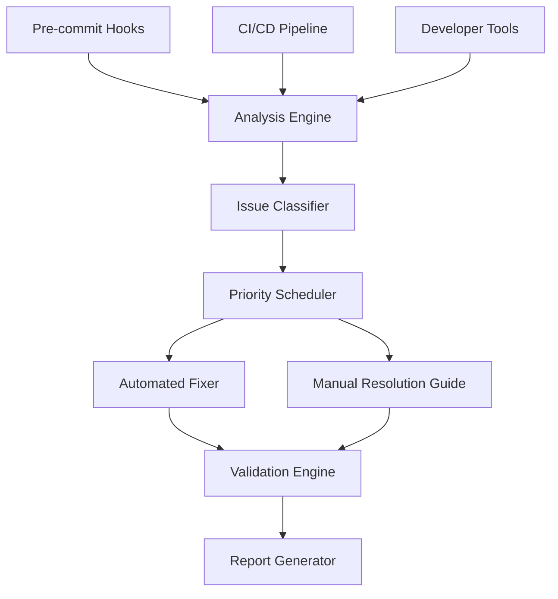

# Design Document

## Overview

The Codebase Health Remediation system is designed to systematically resolve 2,197 import/export mismatches and 1,617 type inconsistencies identified in the export analysis. The solution employs a multi-phase approach with automated tooling, prioritized remediation, and comprehensive validation to ensure sustainable code quality improvements.

## Architecture

### Core Components



### System Layers

1. **Detection Layer**: Identifies import/export mismatches and type inconsistencies
2. **Classification Layer**: Categorizes issues by severity and impact
3. **Resolution Layer**: Applies automated fixes and guides manual interventions
4. **Validation Layer**: Ensures fixes don't introduce new issues
5. **Prevention Layer**: Integrates checks into development workflow

## Components and Interfaces

### Analysis Engine

**Purpose**: Scans codebase to identify import/export and type issues

**Interface**:
```typescript
interface AnalysisEngine {
  scanCodebase(options: ScanOptions): Promise<AnalysisResult>
  validateImports(filePath: string): ImportValidationResult
  checkTypeConsistency(filePath: string): TypeConsistencyResult
  detectCircularDependencies(): CircularDependencyResult[]
}

interface ScanOptions {
  includePatterns: string[]
  excludePatterns: string[]
  strictMode: boolean
  followSymlinks: boolean
}

interface AnalysisResult {
  importExportMismatches: ImportExportIssue[]
  typeInconsistencies: TypeIssue[]
  circularDependencies: CircularDependency[]
  summary: AnalysisSummary
}
```

### Issue Classifier

**Purpose**: Categorizes issues by severity and determines resolution strategy

**Interface**:
```typescript
interface IssueClassifier {
  classifyIssue(issue: CodeIssue): IssueClassification
  prioritizeIssues(issues: CodeIssue[]): PrioritizedIssue[]
  determineResolutionStrategy(issue: CodeIssue): ResolutionStrategy
}

interface IssueClassification {
  severity: 'critical' | 'high' | 'medium' | 'low'
  category: 'build-blocking' | 'runtime-error' | 'type-safety' | 'maintainability'
  impact: 'high' | 'medium' | 'low'
  automatable: boolean
}

enum ResolutionStrategy {
  AUTOMATED_FIX = 'automated',
  GUIDED_MANUAL = 'guided_manual',
  MANUAL_REVIEW = 'manual_review',
  ARCHITECTURAL_CHANGE = 'architectural'
}
```

### Automated Fixer

**Purpose**: Applies automated fixes for common patterns

**Interface**:
```typescript
interface AutomatedFixer {
  fixImportExportMismatch(issue: ImportExportIssue): FixResult
  addMissingExports(filePath: string, missingExports: string[]): FixResult
  updateImportPaths(oldPath: string, newPath: string): FixResult
  addExplicitReturnTypes(functions: AsyncFunction[]): FixResult
  replaceAnyTypes(issues: AnyTypeIssue[]): FixResult
}

interface FixResult {
  success: boolean
  changes: FileChange[]
  warnings: string[]
  requiresManualReview: boolean
}

interface FileChange {
  filePath: string
  oldContent: string
  newContent: string
  changeType: 'import' | 'export' | 'type' | 'refactor'
}
```

### Validation Engine

**Purpose**: Ensures fixes don't introduce new issues

**Interface**:
```typescript
interface ValidationEngine {
  validateFix(fix: FixResult): ValidationResult
  runBuildTest(): BuildTestResult
  checkTypeScript(): TypeScriptValidationResult
  detectNewIssues(beforeState: AnalysisResult, afterState: AnalysisResult): IssueComparison
}

interface ValidationResult {
  isValid: boolean
  buildPasses: boolean
  typeCheckPasses: boolean
  newIssuesIntroduced: CodeIssue[]
  issuesResolved: CodeIssue[]
}
```

## Data Models

### Core Issue Types

```typescript
interface ImportExportIssue extends CodeIssue {
  type: 'missing_export' | 'incorrect_import' | 'path_mismatch'
  sourceFile: string
  targetFile: string
  importedName: string
  expectedExport?: string
  suggestedFix?: string
}

interface TypeIssue extends CodeIssue {
  type: 'missing_return_type' | 'any_type_usage' | 'non_null_assertion' | 'circular_dependency'
  functionName?: string
  variableName?: string
  currentType: string
  suggestedType?: string
}

interface CircularDependency extends CodeIssue {
  cycle: string[]
  depth: number
  breakingPoints: BreakingPoint[]
}

interface BreakingPoint {
  filePath: string
  suggestion: 'extract_types' | 'dependency_injection' | 'lazy_loading' | 'merge_modules'
  effort: 'low' | 'medium' | 'high'
}
```

### Configuration Models

```typescript
interface RemediationConfig {
  priorities: PriorityConfig
  automation: AutomationConfig
  validation: ValidationConfig
  reporting: ReportingConfig
}

interface PriorityConfig {
  criticalPatterns: string[]
  coreInfrastructurePaths: string[]
  maxAutomatedChangesPerRun: number
  requireReviewThreshold: number
}

interface AutomationConfig {
  enabledFixers: FixerType[]
  safetyChecks: SafetyCheck[]
  backupStrategy: 'git_stash' | 'backup_files' | 'branch_creation'
}
```

## Error Handling

### Error Categories

1. **Analysis Errors**: File access issues, parsing failures
2. **Fix Application Errors**: Write permission issues, syntax errors introduced
3. **Validation Errors**: Build failures, type check failures
4. **Integration Errors**: Git conflicts, CI/CD pipeline failures

### Error Recovery Strategies

```typescript
interface ErrorHandler {
  handleAnalysisError(error: AnalysisError): RecoveryAction
  handleFixError(error: FixError): RecoveryAction
  handleValidationError(error: ValidationError): RecoveryAction
}

enum RecoveryAction {
  RETRY = 'retry',
  SKIP = 'skip',
  MANUAL_INTERVENTION = 'manual',
  ROLLBACK = 'rollback',
  ABORT = 'abort'
}

interface ErrorRecovery {
  createBackup(): BackupResult
  rollbackChanges(backupId: string): RollbackResult
  generateErrorReport(errors: CodeError[]): ErrorReport
}
```

## Testing Strategy

### Unit Testing

- **Analysis Engine**: Test file parsing, issue detection accuracy
- **Issue Classifier**: Verify correct categorization and prioritization
- **Automated Fixer**: Test fix generation for various issue patterns
- **Validation Engine**: Ensure validation catches regressions

### Integration Testing

- **End-to-End Workflow**: Full remediation cycle from analysis to validation
- **CI/CD Integration**: Test pipeline integration and reporting
- **Git Integration**: Test backup and rollback mechanisms
- **Performance Testing**: Large codebase analysis and fix application

### Test Data Strategy

```typescript
interface TestScenarios {
  importExportMismatches: {
    missingExports: TestCase[]
    incorrectPaths: TestCase[]
    typeOnlyImports: TestCase[]
  }
  typeInconsistencies: {
    missingReturnTypes: TestCase[]
    anyTypeUsage: TestCase[]
    nonNullAssertions: TestCase[]
  }
  circularDependencies: {
    simpleCircles: TestCase[]
    complexCircles: TestCase[]
    typeOnlyCircles: TestCase[]
  }
}

interface TestCase {
  name: string
  inputFiles: Record<string, string>
  expectedIssues: CodeIssue[]
  expectedFixes: FixResult[]
  validationCriteria: ValidationCriteria
}
```

### Validation Criteria

1. **Correctness**: Fixes resolve the intended issues
2. **Safety**: No new issues introduced
3. **Completeness**: All automatable issues are fixed
4. **Performance**: Analysis completes within acceptable time limits
5. **Reliability**: Consistent results across multiple runs

## Implementation Phases

### Phase 1: Foundation (Analysis & Classification)
- Implement Analysis Engine with TypeScript AST parsing
- Build Issue Classifier with severity and priority logic
- Create basic reporting infrastructure
- Establish test framework with sample issues

### Phase 2: Automated Remediation
- Implement Automated Fixer for common patterns
- Add Validation Engine with build and type checking
- Create backup and rollback mechanisms
- Integrate with Git workflow

### Phase 3: Integration & Prevention
- Add pre-commit hooks and CI/CD integration
- Implement comprehensive error handling
- Create developer tools and IDE extensions
- Add performance monitoring and optimization

### Phase 4: Advanced Features
- Machine learning for fix suggestion improvement
- Advanced circular dependency resolution
- Custom rule configuration
- Team collaboration features

## Performance Considerations

### Scalability Requirements

- **Large Codebase Support**: Handle 10,000+ files efficiently
- **Incremental Analysis**: Only analyze changed files when possible
- **Parallel Processing**: Utilize multiple CPU cores for analysis
- **Memory Management**: Stream processing for large files

### Optimization Strategies

```typescript
interface PerformanceOptimizations {
  caching: {
    analysisResults: CacheStrategy
    typeInformation: CacheStrategy
    dependencyGraphs: CacheStrategy
  }
  parallelization: {
    fileAnalysis: ParallelStrategy
    fixApplication: ParallelStrategy
    validation: ParallelStrategy
  }
  incrementalProcessing: {
    changeDetection: ChangeDetectionStrategy
    affectedFileAnalysis: AffectedAnalysisStrategy
  }
}
```

## Security Considerations

### Code Safety

- **Backup Strategy**: Always create backups before applying fixes
- **Validation Gates**: Multiple validation layers before committing changes
- **Permission Checks**: Verify write permissions before attempting fixes
- **Rollback Capability**: Quick rollback mechanism for failed fixes

### Access Control

- **Configuration Security**: Secure storage of remediation configurations
- **Audit Logging**: Track all changes made by the system
- **User Permissions**: Role-based access to different remediation features
- **Integration Security**: Secure integration with Git and CI/CD systems

This design provides a comprehensive foundation for systematically addressing the codebase health issues while ensuring safety, reliability, and maintainability of the remediation process.