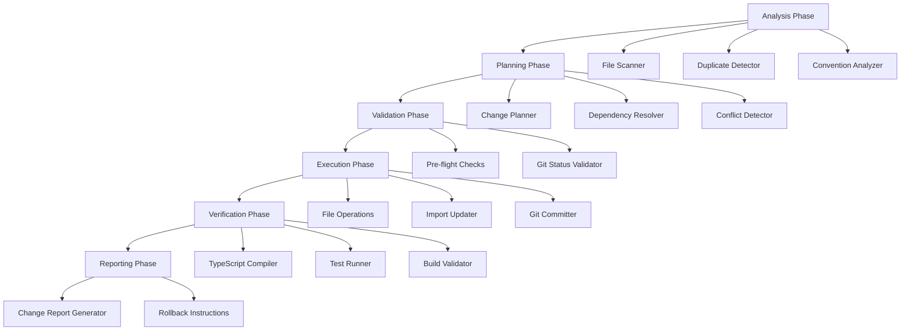

# Design Document: Codebase Standardization and Consolidation

## Overview

This design document specifies a comprehensive refactoring system that systematically addresses inconsistencies across the codebase. The system provides automated tooling to standardize file naming conventions, consolidate duplicate files and directories, enforce consistent feature module structures, organize test files, deduplicate configuration, correct file extensions, remove debug artifacts, and consolidate documentation.

The refactoring system is designed as a multi-phase migration tool with dry-run capabilities, interactive confirmation, automated execution, comprehensive validation, and rollback mechanisms. The architecture prioritizes safety through extensive pre-flight checks, atomic operations, and round-trip validation to ensure zero functional regressions.

### Key Design Principles

1. **Safety First**: All operations are reversible with comprehensive validation before and after changes
2. **Incremental Migration**: Changes are grouped into logical categories that can be applied independently
3. **Transparency**: Detailed logging and reporting for every operation
4. **Idempotency**: Running the tool multiple times produces the same result
5. **Git Integration**: Leverages git for history preservation and rollback capabilities

## Architecture

The refactoring system follows a pipeline architecture with distinct phases:



### Core Components

1. **Refactoring Engine**: Orchestrates the entire refactoring pipeline
2. **File System Analyzer**: Scans codebase and builds dependency graph
3. **Change Planner**: Generates ordered list of refactoring operations
4. **Safe File Operations**: Atomic file system operations with rollback
5. **Import Resolver**: Updates import statements across the codebase
6. **Validation Suite**: Comprehensive checks for correctness
7. **Report Generator**: Produces human-readable change summaries

## Components and Interfaces

### 1. Refactoring Engine

The central orchestrator that manages the refactoring workflow.

```typescript
interface RefactoringEngine {
  // Execute refactoring with specified mode
  execute(config: RefactoringConfig): Promise<RefactoringResult>;
  
  // Generate plan without executing
  dryRun(config: RefactoringConfig): Promise<RefactoringPlan>;
  
  // Execute with interactive confirmation
  executeInteractive(config: RefactoringConfig): Promise<RefactoringResult>;
  
  // Rollback to previous state
  rollback(commitHash: string): Promise<void>;
}

interface RefactoringConfig {
  mode: 'dry-run' | 'interactive' | 'automated';
  categories: RefactoringCategory[];
  workspaceRoot: string;
  gitEnabled: boolean;
  validationLevel: 'strict' | 'normal' | 'permissive';
}

type RefactoringCategory = 
  | 'file-naming'
  | 'duplicate-directories'
  | 'duplicate-files'
  | 'feature-structure'
  | 'migration-naming'
  | 'source-separation'
  | 'manifest-consolidation'
  | 'test-organization'
  | 'config-deduplication'
  | 'extension-correction'
  | 'debug-removal'
  | 'documentation-consolidation';
```

### 2. File System Analyzer

Scans the codebase and builds a comprehensive model of the file structure.

```typescript
interface FileSystemAnalyzer {
  // Scan workspace and build file tree
  analyze(root: string): Promise<FileTree>;
  
  // Find files matching pattern
  findFiles(pattern: string | RegExp): Promise<FileNode[]>;
  
  // Build dependency graph
  buildDependencyGraph(): Promise<DependencyGraph>;
  
  // Detect duplicate files
  findDuplicates(): Promise<DuplicateSet[]>;
}

interface FileTree {
  root: FileNode;
  allFiles: Map<string, FileNode>;
  allDirectories: Map<string, DirectoryNode>;
}

interface FileNode {
  path: string;
  relativePath: string;
  name: string;
  extension: string;
  size: number;
  contentHash: string;
  imports: ImportStatement[];
  exports: ExportStatement[];
  containsJSX: boolean;
}

interface DirectoryNode {
  path: string;
  relativePath: string;
  name: string;
  children: (FileNode | DirectoryNode)[];
  isEmpty: boolean;
}
```

### 3. Duplicate Detector

Identifies duplicate files and directories using multiple strategies.

```typescript
interface DuplicateDetector {
  // Find duplicate files by content hash
  findDuplicatesByContent(): Promise<DuplicateSet[]>;
  
  // Find duplicate files by similar names
  findDuplicatesByName(): Promise<DuplicateSet[]>;
  
  // Find duplicate directories
  findDuplicateDirectories(): Promise<DirectoryDuplicateSet[]>;
  
  // Determine canonical version
  selectCanonical(duplicates: FileNode[]): FileNode;
}

interface DuplicateSet {
  canonical: FileNode;
  duplicates: FileNode[];
  similarity: number; // 0-1
  reason: 'identical-content' | 'similar-name' | 'similar-content';
}

interface DirectoryDuplicateSet {
  canonical: DirectoryNode;
  duplicates: DirectoryNode[];
  reason: 'singular-plural' | 'similar-name';
}
```

### 4. Convention Analyzer

Analyzes files for naming convention violations.

```typescript
interface ConventionAnalyzer {
  // Check file naming conventions
  analyzeNaming(file: FileNode): NamingViolation[];
  
  // Check feature structure conventions
  analyzeFeatureStructure(feature: DirectoryNode): StructureViolation[];
  
  // Check migration naming conventions
  analyzeMigrationNaming(migration: FileNode): MigrationViolation[];
  
  // Suggest corrections
  suggestCorrection(violation: Violation): Correction;
}

interface NamingViolation {
  file: FileNode;
  expected: string;
  actual: string;
  convention: 'kebab-case' | 'camelCase' | 'PascalCase';
  category: 'page' | 'hook' | 'asset' | 'component';
}

interface StructureViolation {
  feature: DirectoryNode;
  missingDirectories: string[];
  misplacedFiles: FileNode[];
  expectedStructure: FeatureStructure;
}

interface MigrationViolation {
  migration: FileNode;
  expectedFormat: 'timestamp' | 'sequential';
  issue: 'duplicate-prefix' | 'duplicate-description' | 'wrong-format';
}
```

### 5. Change Planner

Generates an ordered plan of refactoring operations.

```typescript
interface ChangePlanner {
  // Generate complete refactoring plan
  plan(analysis: AnalysisResult): Promise<RefactoringPlan>;
  
  // Order operations to avoid conflicts
  orderOperations(operations: Operation[]): Operation[];
  
  // Detect conflicts between operations
  detectConflicts(operations: Operation[]): Conflict[];
  
  // Resolve conflicts
  resolveConflicts(conflicts: Conflict[]): Resolution[];
}

interface RefactoringPlan {
  operations: Operation[];
  estimatedDuration: number;
  riskLevel: 'low' | 'medium' | 'high';
  affectedFiles: number;
  categories: RefactoringCategory[];
}

interface Operation {
  id: string;
  type: OperationType;
  category: RefactoringCategory;
  description: string;
  source?: string;
  destination?: string;
  dependencies: string[]; // operation IDs
  reversible: boolean;
}

type OperationType =
  | 'rename-file'
  | 'move-file'
  | 'delete-file'
  | 'create-directory'
  | 'delete-directory'
  | 'merge-files'
  | 'update-imports'
  | 'update-config';
```

### 6. Safe File Operations

Provides atomic file system operations with rollback capability.

```typescript
interface SafeFileOperations {
  // Rename file and update all imports
  renameFile(source: string, destination: string): Promise<OperationResult>;
  
  // Move file and update all imports
  moveFile(source: string, destination: string): Promise<OperationResult>;
  
  // Delete file after verifying no references
  deleteFile(path: string): Promise<OperationResult>;
  
  // Merge multiple files into one
  mergeFiles(sources: string[], destination: string): Promise<OperationResult>;
  
  // Create directory structure
  createDirectory(path: string): Promise<OperationResult>;
  
  // Begin transaction
  beginTransaction(): Transaction;
  
  // Commit transaction
  commitTransaction(transaction: Transaction): Promise<void>;
  
  // Rollback transaction
  rollbackTransaction(transaction: Transaction): Promise<void>;
}

interface Transaction {
  id: string;
  operations: CompletedOperation[];
  timestamp: Date;
  reversible: boolean;
}

interface CompletedOperation {
  operation: Operation;
  success: boolean;
  error?: Error;
  rollbackData?: RollbackData;
}

interface RollbackData {
  originalPath?: string;
  originalContent?: string;
  affectedImports?: ImportUpdate[];
}
```

### 7. Import Resolver

Updates import statements across the codebase when files are moved or renamed.

```typescript
interface ImportResolver {
  // Find all imports of a file
  findImports(filePath: string): Promise<ImportReference[]>;
  
  // Update import statement
  updateImport(reference: ImportReference, newPath: string): Promise<void>;
  
  // Update all imports for a moved file
  updateAllImports(oldPath: string, newPath: string): Promise<ImportUpdate[]>;
  
  // Verify all imports resolve
  verifyImports(): Promise<UnresolvedImport[]>;
}

interface ImportReference {
  importingFile: string;
  importedPath: string;
  importStatement: string;
  lineNumber: number;
  isRelative: boolean;
}

interface ImportUpdate {
  file: string;
  oldImport: string;
  newImport: string;
  lineNumber: number;
}

interface UnresolvedImport {
  file: string;
  importPath: string;
  lineNumber: number;
  reason: string;
}
```

### 8. Validation Suite

Comprehensive validation to ensure refactoring correctness.

```typescript
interface ValidationSuite {
  // Run all validations
  validate(): Promise<ValidationResult>;
  
  // Validate TypeScript compilation
  validateTypeScript(): Promise<TypeScriptValidation>;
  
  // Validate import resolution
  validateImports(): Promise<ImportValidation>;
  
  // Validate test discovery
  validateTests(): Promise<TestValidation>;
  
  // Validate build success
  validateBuild(): Promise<BuildValidation>;
  
  // Compare before/after state
  validateRoundTrip(before: Snapshot, after: Snapshot): Promise<RoundTripValidation>;
}

interface ValidationResult {
  success: boolean;
  typescript: TypeScriptValidation;
  imports: ImportValidation;
  tests: TestValidation;
  build: BuildValidation;
  roundTrip?: RoundTripValidation;
  errors: ValidationError[];
}

interface TypeScriptValidation {
  success: boolean;
  errors: CompilationError[];
  warnings: CompilationWarning[];
}

interface ImportValidation {
  success: boolean;
  unresolvedImports: UnresolvedImport[];
  circularDependencies: CircularDependency[];
}

interface TestValidation {
  success: boolean;
  discoveredTests: number;
  failedTests: TestFailure[];
}

interface BuildValidation {
  success: boolean;
  buildTime: number;
  errors: BuildError[];
}

interface RoundTripValidation {
  success: boolean;
  identicalBehavior: boolean;
  unexpectedChanges: UnexpectedChange[];
}
```

### 9. Report Generator

Generates comprehensive reports of refactoring operations.

```typescript
interface ReportGenerator {
  // Generate summary report
  generateSummary(result: RefactoringResult): string;
  
  // Generate detailed report
  generateDetailed(result: RefactoringResult): string;
  
  // Generate rollback instructions
  generateRollbackInstructions(result: RefactoringResult): string;
  
  // Generate migration log
  generateMigrationLog(operations: CompletedOperation[]): string;
}

interface RefactoringResult {
  success: boolean;
  plan: RefactoringPlan;
  completedOperations: CompletedOperation[];
  validation: ValidationResult;
  duration: number;
  gitCommits: string[];
  rollbackCommit?: string;
}
```

## Data Models

### File System Model

```typescript
// Core file system entities
interface FileSystemEntity {
  path: string;
  relativePath: string;
  name: string;
  exists: boolean;
  metadata: FileMetadata;
}

interface FileMetadata {
  size: number;
  created: Date;
  modified: Date;
  permissions: string;
  gitTracked: boolean;
}

// TypeScript/JavaScript specific
interface SourceFile extends FileSystemEntity {
  extension: '.ts' | '.tsx' | '.js' | '.jsx';
  contentHash: string;
  ast: AST;
  imports: ImportStatement[];
  exports: ExportStatement[];
  containsJSX: boolean;
  isTest: boolean;
  isConfig: boolean;
}

interface ImportStatement {
  source: string;
  specifiers: ImportSpecifier[];
  isTypeOnly: boolean;
  isRelative: boolean;
  resolvedPath?: string;
}

interface ImportSpecifier {
  name: string;
  alias?: string;
  isDefault: boolean;
  isNamespace: boolean;
}

interface ExportStatement {
  specifiers: ExportSpecifier[];
  isDefault: boolean;
  isReexport: boolean;
  source?: string;
}

interface ExportSpecifier {
  name: string;
  alias?: string;
}
```

### Dependency Graph Model

```typescript
interface DependencyGraph {
  nodes: Map<string, DependencyNode>;
  edges: DependencyEdge[];
  cycles: CircularDependency[];
}

interface DependencyNode {
  file: string;
  imports: string[];
  importedBy: string[];
  depth: number;
  isLeaf: boolean;
  isRoot: boolean;
}

interface DependencyEdge {
  from: string;
  to: string;
  importStatement: ImportStatement;
}

interface CircularDependency {
  cycle: string[];
  severity: 'error' | 'warning';
}
```

### Feature Structure Model

```typescript
interface FeatureStructure {
  name: string;
  path: string;
  directories: FeatureDirectory[];
  files: FeatureFile[];
  conformsToStandard: boolean;
  violations: StructureViolation[];
}

interface FeatureDirectory {
  name: 'api' | 'hooks' | 'pages' | 'services' | 'ui' | 'types';
  required: boolean;
  exists: boolean;
  files: FileNode[];
}

interface FeatureFile {
  name: 'types.ts' | 'index.ts' | 'README.md';
  required: boolean;
  exists: boolean;
  path?: string;
}

const STANDARD_FEATURE_STRUCTURE: FeatureStructure = {
  directories: [
    { name: 'api', required: false },
    { name: 'hooks', required: false },
    { name: 'pages', required: false },
    { name: 'services', required: false },
    { name: 'ui', required: false },
  ],
  files: [
    { name: 'types.ts', required: true },
    { name: 'index.ts', required: true },
    { name: 'README.md', required: true },
  ],
};
```

### Migration Model

```typescript
interface Migration {
  file: FileNode;
  prefix: string;
  description: string;
  format: 'timestamp' | 'sequential' | 'epoch';
  timestamp?: Date;
  sequenceNumber?: number;
  order: number;
}

interface MigrationSet {
  migrations: Migration[];
  duplicatePrefixes: Migration[][];
  duplicateDescriptions: Migration[][];
  formatInconsistencies: Migration[];
}

// Target format: YYYYMMDDHHMMSS_description.sql
interface StandardizedMigration {
  timestamp: string; // YYYYMMDDHHMMSS
  description: string;
  originalFile: string;
  newFile: string;
}
```

### Change Tracking Model

```typescript
interface ChangeLog {
  timestamp: Date;
  category: RefactoringCategory;
  operations: LoggedOperation[];
  gitCommit?: string;
}

interface LoggedOperation {
  operation: Operation;
  status: 'pending' | 'in-progress' | 'completed' | 'failed' | 'rolled-back';
  startTime: Date;
  endTime?: Date;
  error?: Error;
  affectedFiles: string[];
  importUpdates: ImportUpdate[];
}

interface ChangeReport {
  summary: ChangeSummary;
  categories: CategoryReport[];
  validation: ValidationResult;
  rollbackInstructions: string;
}

interface ChangeSummary {
  totalOperations: number;
  successfulOperations: number;
  failedOperations: number;
  filesRenamed: number;
  filesMoved: number;
  filesDeleted: number;
  directoriesCreated: number;
  directoriesDeleted: number;
  importsUpdated: number;
  duration: number;
}

interface CategoryReport {
  category: RefactoringCategory;
  operations: CompletedOperation[];
  success: boolean;
  impact: string;
}
```

### Naming Convention Model

```typescript
interface NamingConvention {
  pattern: RegExp;
  format: (name: string) => string;
  validate: (name: string) => boolean;
  examples: string[];
}

const NAMING_CONVENTIONS: Record<string, NamingConvention> = {
  'kebab-case': {
    pattern: /^[a-z0-9]+(-[a-z0-9]+)*$/,
    format: (name) => name.toLowerCase().replace(/[^a-z0-9]+/g, '-'),
    validate: (name) => /^[a-z0-9]+(-[a-z0-9]+)*$/.test(name),
    examples: ['user-profile', 'api-client', 'use-auth'],
  },
  'camelCase': {
    pattern: /^[a-z][a-zA-Z0-9]*$/,
    format: (name) => name.charAt(0).toLowerCase() + name.slice(1),
    validate: (name) => /^[a-z][a-zA-Z0-9]*$/.test(name),
    examples: ['userProfile', 'apiClient', 'useAuth'],
  },
  'PascalCase': {
    pattern: /^[A-Z][a-zA-Z0-9]*$/,
    format: (name) => name.charAt(0).toUpperCase() + name.slice(1),
    validate: (name) => /^[A-Z][a-zA-Z0-9]*$/.test(name),
    examples: ['UserProfile', 'ApiClient', 'AuthProvider'],
  },
};

interface FileTypeConvention {
  fileType: 'page' | 'hook' | 'asset' | 'component' | 'service' | 'config';
  convention: NamingConvention;
  extensionRule?: (hasJSX: boolean) => '.ts' | '.tsx';
}
```


## Algorithm Designs

### 1. Duplicate Detection Algorithm

The duplicate detection algorithm uses multiple strategies to identify duplicate files and directories.

```typescript
function detectDuplicates(fileTree: FileTree): DuplicateSet[] {
  const duplicates: DuplicateSet[] = [];
  
  // Strategy 1: Exact content match (hash-based)
  const byHash = groupBy(fileTree.allFiles.values(), f => f.contentHash);
  for (const [hash, files] of byHash) {
    if (files.length > 1) {
      const canonical = selectCanonicalByLocation(files);
      duplicates.push({
        canonical,
        duplicates: files.filter(f => f !== canonical),
        similarity: 1.0,
        reason: 'identical-content',
      });
    }
  }
  
  // Strategy 2: Similar names (Levenshtein distance)
  const byName = groupBySimilarNames(fileTree.allFiles.values());
  for (const group of byName) {
    if (group.length > 1) {
      const canonical = selectCanonicalByLocation(group);
      duplicates.push({
        canonical,
        duplicates: group.filter(f => f !== canonical),
        similarity: calculateSimilarity(group),
        reason: 'similar-name',
      });
    }
  }
  
  // Strategy 3: Similar content (fuzzy hash)
  const bySimilarContent = groupBySimilarContent(fileTree.allFiles.values());
  for (const group of bySimilarContent) {
    if (group.length > 1 && calculateContentSimilarity(group) > 0.9) {
      const canonical = selectCanonicalByLocation(group);
      duplicates.push({
        canonical,
        duplicates: group.filter(f => f !== canonical),
        similarity: calculateContentSimilarity(group),
        reason: 'similar-content',
      });
    }
  }
  
  return deduplicateSets(duplicates);
}

function selectCanonicalByLocation(files: FileNode[]): FileNode {
  // Priority order for canonical selection:
  // 1. Files in more specific directories (deeper path)
  // 2. Files in feature-specific locations over generic lib/
  // 3. Files with more descriptive parent directory names
  // 4. Alphabetically first as tiebreaker
  
  return files.sort((a, b) => {
    const aDepth = a.relativePath.split('/').length;
    const bDepth = b.relativePath.split('/').length;
    
    // Prefer deeper paths (more specific)
    if (aDepth !== bDepth) return bDepth - aDepth;
    
    // Prefer feature directories over lib
    const aInFeature = a.relativePath.includes('/features/');
    const bInFeature = b.relativePath.includes('/features/');
    if (aInFeature !== bInFeature) return aInFeature ? -1 : 1;
    
    // Prefer specific subdirectories (status/ over root)
    const aParent = path.dirname(a.relativePath);
    const bParent = path.dirname(b.relativePath);
    const aParentDepth = aParent.split('/').length;
    const bParentDepth = bParent.split('/').length;
    if (aParentDepth !== bParentDepth) return bParentDepth - aParentDepth;
    
    // Alphabetical tiebreaker
    return a.relativePath.localeCompare(b.relativePath);
  })[0];
}
```

### 2. Import Update Algorithm

When files are moved or renamed, all import statements must be updated.

```typescript
function updateImportsForMove(
  oldPath: string,
  newPath: string,
  dependencyGraph: DependencyGraph
): ImportUpdate[] {
  const updates: ImportUpdate[] = [];
  const node = dependencyGraph.nodes.get(oldPath);
  
  if (!node) return updates;
  
  // Find all files that import the moved file
  for (const importingFile of node.importedBy) {
    const sourceFile = parseSourceFile(importingFile);
    
    for (const importStmt of sourceFile.imports) {
      if (importStmt.resolvedPath === oldPath) {
        // Calculate new relative import path
        const newImportPath = calculateRelativeImport(
          importingFile,
          newPath,
          importStmt.isRelative
        );
        
        // Generate new import statement
        const newImportStmt = updateImportPath(importStmt, newImportPath);
        
        updates.push({
          file: importingFile,
          oldImport: importStmt.source,
          newImport: newImportPath,
          lineNumber: importStmt.lineNumber,
        });
      }
    }
  }
  
  return updates;
}

function calculateRelativeImport(
  fromFile: string,
  toFile: string,
  shouldBeRelative: boolean
): string {
  if (!shouldBeRelative) {
    // Absolute import (e.g., @/features/...)
    return toFile.replace(/^client\/src\//, '@/');
  }
  
  // Calculate relative path
  const fromDir = path.dirname(fromFile);
  const relativePath = path.relative(fromDir, toFile);
  
  // Remove extension
  const withoutExt = relativePath.replace(/\.(ts|tsx|js|jsx)$/, '');
  
  // Ensure starts with ./ or ../
  return withoutExt.startsWith('.') ? withoutExt : `./${withoutExt}`;
}
```

### 3. Safe Rename Algorithm

Renaming files requires careful coordination to avoid breaking imports.

```typescript
async function safeRename(
  source: string,
  destination: string,
  operations: SafeFileOperations,
  resolver: ImportResolver
): Promise<OperationResult> {
  // Step 1: Validate preconditions
  if (!fs.existsSync(source)) {
    throw new Error(`Source file does not exist: ${source}`);
  }
  
  if (fs.existsSync(destination)) {
    throw new Error(`Destination already exists: ${destination}`);
  }
  
  // Step 2: Find all imports
  const imports = await resolver.findImports(source);
  
  // Step 3: Begin transaction
  const transaction = operations.beginTransaction();
  
  try {
    // Step 4: Update all import statements
    const importUpdates = await resolver.updateAllImports(source, destination);
    
    // Step 5: Rename the file
    await fs.promises.rename(source, destination);
    
    // Step 6: Verify imports still resolve
    const unresolved = await resolver.verifyImports();
    if (unresolved.length > 0) {
      throw new Error(`Unresolved imports after rename: ${unresolved.length}`);
    }
    
    // Step 7: Commit transaction
    await operations.commitTransaction(transaction);
    
    return {
      success: true,
      operation: {
        type: 'rename-file',
        source,
        destination,
      },
      affectedFiles: [source, destination, ...importUpdates.map(u => u.file)],
    };
  } catch (error) {
    // Rollback on any error
    await operations.rollbackTransaction(transaction);
    throw error;
  }
}
```

### 4. Feature Structure Standardization Algorithm

Ensures all feature modules follow the standard structure.

```typescript
function standardizeFeatureStructure(
  feature: DirectoryNode,
  standardStructure: FeatureStructure
): Operation[] {
  const operations: Operation[] = [];
  const featurePath = feature.path;
  
  // Step 1: Create missing directories
  for (const dir of standardStructure.directories) {
    const dirPath = path.join(featurePath, dir.name);
    if (!fs.existsSync(dirPath)) {
      operations.push({
        id: generateId(),
        type: 'create-directory',
        category: 'feature-structure',
        description: `Create ${dir.name}/ directory in ${feature.name}`,
        destination: dirPath,
        dependencies: [],
        reversible: true,
      });
      
      // Add .gitkeep if directory would be empty
      operations.push({
        id: generateId(),
        type: 'create-file',
        category: 'feature-structure',
        description: `Create .gitkeep in ${dir.name}/`,
        destination: path.join(dirPath, '.gitkeep'),
        dependencies: [operations[operations.length - 1].id],
        reversible: true,
      });
    }
  }
  
  // Step 2: Create missing required files
  for (const file of standardStructure.files) {
    if (file.required) {
      const filePath = path.join(featurePath, file.name);
      if (!fs.existsSync(filePath)) {
        operations.push({
          id: generateId(),
          type: 'create-file',
          category: 'feature-structure',
          description: `Create ${file.name} in ${feature.name}`,
          destination: filePath,
          dependencies: [],
          reversible: true,
        });
      }
    }
  }
  
  // Step 3: Move misplaced files
  const misplacedFiles = findMisplacedFiles(feature, standardStructure);
  for (const file of misplacedFiles) {
    const correctLocation = determineCorrectLocation(file, standardStructure);
    operations.push({
      id: generateId(),
      type: 'move-file',
      category: 'feature-structure',
      description: `Move ${file.name} to ${correctLocation}`,
      source: file.path,
      destination: path.join(featurePath, correctLocation, file.name),
      dependencies: [],
      reversible: true,
    });
  }
  
  return operations;
}

function determineCorrectLocation(
  file: FileNode,
  structure: FeatureStructure
): string {
  // Heuristics for determining correct subdirectory
  if (file.name.endsWith('.test.ts') || file.name.endsWith('.test.tsx')) {
    return '__tests__';
  }
  
  if (file.name.startsWith('use-') || file.name.includes('Hook')) {
    return 'hooks';
  }
  
  if (file.name.includes('Service') || file.name.includes('service')) {
    return 'services';
  }
  
  if (file.name.includes('Page') || file.name.endsWith('-page.tsx')) {
    return 'pages';
  }
  
  if (file.name.includes('Api') || file.name.includes('api')) {
    return 'api';
  }
  
  // Default to ui/ for components
  return 'ui';
}
```

### 5. Migration Naming Standardization Algorithm

Converts migration files to timestamp-based naming while preserving order.

```typescript
function standardizeMigrationNames(migrations: Migration[]): StandardizedMigration[] {
  // Step 1: Sort by current order
  const sorted = [...migrations].sort((a, b) => a.order - b.order);
  
  // Step 2: Assign timestamps preserving order
  const baseTimestamp = new Date('2024-01-01T00:00:00Z');
  const standardized: StandardizedMigration[] = [];
  
  for (let i = 0; i < sorted.length; i++) {
    const migration = sorted[i];
    
    // Calculate timestamp: base + (i * 1 hour)
    const timestamp = new Date(baseTimestamp.getTime() + i * 60 * 60 * 1000);
    const timestampStr = formatTimestamp(timestamp); // YYYYMMDDHHMMSS
    
    // Clean description
    const description = cleanDescription(migration.description);
    
    // Handle duplicate descriptions
    const duplicateCount = standardized.filter(
      s => s.description === description
    ).length;
    const finalDescription = duplicateCount > 0
      ? `${description}_${duplicateCount + 1}`
      : description;
    
    standardized.push({
      timestamp: timestampStr,
      description: finalDescription,
      originalFile: migration.file.path,
      newFile: `${timestampStr}_${finalDescription}.sql`,
    });
  }
  
  return standardized;
}

function formatTimestamp(date: Date): string {
  const year = date.getFullYear();
  const month = String(date.getMonth() + 1).padStart(2, '0');
  const day = String(date.getDate()).padStart(2, '0');
  const hours = String(date.getHours()).padStart(2, '0');
  const minutes = String(date.getMinutes()).padStart(2, '0');
  const seconds = String(date.getSeconds()).padStart(2, '0');
  
  return `${year}${month}${day}${hours}${minutes}${seconds}`;
}

function cleanDescription(description: string): string {
  return description
    .toLowerCase()
    .replace(/[^a-z0-9]+/g, '_')
    .replace(/^_+|_+$/g, '');
}
```

### 6. Conflict Detection Algorithm

Detects conflicts between planned operations.

```typescript
function detectConflicts(operations: Operation[]): Conflict[] {
  const conflicts: Conflict[] = [];
  
  // Build operation graph
  const graph = buildOperationGraph(operations);
  
  // Check for file conflicts
  for (let i = 0; i < operations.length; i++) {
    for (let j = i + 1; j < operations.length; j++) {
      const op1 = operations[i];
      const op2 = operations[j];
      
      // Same source file
      if (op1.source === op2.source) {
        conflicts.push({
          type: 'same-source',
          operations: [op1, op2],
          severity: 'error',
          message: `Both operations target source file: ${op1.source}`,
        });
      }
      
      // Same destination file
      if (op1.destination === op2.destination) {
        conflicts.push({
          type: 'same-destination',
          operations: [op1, op2],
          severity: 'error',
          message: `Both operations write to: ${op1.destination}`,
        });
      }
      
      // Circular dependency
      if (hasDependencyCycle(op1, op2, graph)) {
        conflicts.push({
          type: 'circular-dependency',
          operations: [op1, op2],
          severity: 'error',
          message: `Circular dependency between operations`,
        });
      }
      
      // Move then delete
      if (op1.type === 'move-file' && op2.type === 'delete-file' &&
          op1.destination === op2.source) {
        conflicts.push({
          type: 'move-then-delete',
          operations: [op1, op2],
          severity: 'warning',
          message: `Moving file that will be deleted`,
        });
      }
    }
  }
  
  return conflicts;
}

interface Conflict {
  type: 'same-source' | 'same-destination' | 'circular-dependency' | 'move-then-delete';
  operations: Operation[];
  severity: 'error' | 'warning';
  message: string;
}
```

### 7. Operation Ordering Algorithm

Orders operations to respect dependencies and avoid conflicts.

```typescript
function orderOperations(operations: Operation[]): Operation[] {
  // Build dependency graph
  const graph = new Map<string, Set<string>>();
  const inDegree = new Map<string, number>();
  
  for (const op of operations) {
    graph.set(op.id, new Set(op.dependencies));
    inDegree.set(op.id, op.dependencies.length);
  }
  
  // Topological sort (Kahn's algorithm)
  const ordered: Operation[] = [];
  const queue: string[] = [];
  
  // Find operations with no dependencies
  for (const [id, degree] of inDegree) {
    if (degree === 0) {
      queue.push(id);
    }
  }
  
  while (queue.length > 0) {
    const currentId = queue.shift()!;
    const currentOp = operations.find(op => op.id === currentId)!;
    ordered.push(currentOp);
    
    // Reduce in-degree for dependent operations
    for (const op of operations) {
      if (op.dependencies.includes(currentId)) {
        const degree = inDegree.get(op.id)! - 1;
        inDegree.set(op.id, degree);
        
        if (degree === 0) {
          queue.push(op.id);
        }
      }
    }
  }
  
  // Check for cycles
  if (ordered.length !== operations.length) {
    throw new Error('Circular dependency detected in operations');
  }
  
  return ordered;
}
```

## Migration Strategy

The refactoring will be executed in phases to minimize risk and allow for validation at each step.

### Phase 1: Analysis and Planning (No Changes)

1. Scan entire codebase and build file tree
2. Detect all violations and duplicates
3. Generate comprehensive refactoring plan
4. Present plan to user for review
5. Estimate impact and risk level

**Deliverables:**
- Complete refactoring plan with all operations
- Risk assessment report
- Estimated duration and affected files count

### Phase 2: Low-Risk Changes (Automated)

Execute changes with minimal impact on functionality:

1. Remove debug and backup files
2. Move source files (.ai) to design-assets/
3. Consolidate manifest files
4. Add .gitkeep files to empty directories
5. Create missing README.md files

**Validation:**
- Verify no imports reference removed files
- Verify build still succeeds

### Phase 3: File Naming Standardization (Semi-Automated)

Rename files to follow conventions:

1. Rename page files to kebab-case
2. Rename hook files to kebab-case
3. Rename asset files to lowercase-with-hyphens
4. Update all import statements

**Validation:**
- TypeScript compilation succeeds
- All imports resolve correctly
- Test discovery still works

### Phase 4: Directory Consolidation (Semi-Automated)

Merge duplicate directories:

1. Consolidate context/contexts
2. Consolidate layout/layouts
3. Update all import paths
4. Remove empty directories

**Validation:**
- All imports resolve
- No duplicate files remain
- Git history preserved

### Phase 5: Duplicate File Elimination (Manual Review Required)

Remove duplicate files after manual review:

1. Present duplicate sets to user
2. Confirm canonical version selection
3. Remove duplicates
4. Update imports to canonical version

**Validation:**
- All imports point to canonical files
- No functionality lost
- Tests still pass

### Phase 6: Feature Structure Standardization (Automated)

Enforce standard feature structure:

1. Create missing directories in each feature
2. Move misplaced files to correct locations
3. Create required files (types.ts, index.ts, README.md)
4. Update imports

**Validation:**
- All features follow standard structure
- All imports resolve
- Tests still pass

### Phase 7: Test Organization (Automated)

Reorganize test files:

1. Move unit tests to __tests__/ directories
2. Flatten tests/integration/tests/ to tests/integration/
3. Update test configuration
4. Verify test discovery

**Validation:**
- All tests discovered
- Test suite runs successfully
- Same number of tests before and after

### Phase 8: Configuration Deduplication (Manual Review Required)

Remove duplicate configuration files:

1. Identify duplicate configs
2. Merge unique settings
3. Remove redundant configs
4. Update references

**Validation:**
- All tools still work with new config locations
- Build succeeds
- Tests run correctly

### Phase 9: Extension Correction (Automated)

Fix file extensions:

1. Rename .ts files with JSX to .tsx
2. Rename .tsx files without JSX to .ts
3. Rename documentation .ts files to .md
4. Update imports

**Validation:**
- TypeScript compilation succeeds
- All imports resolve
- No type errors introduced

### Phase 10: Migration Naming (Automated)

Standardize migration file names:

1. Convert to timestamp format
2. Resolve duplicate prefixes
3. Resolve duplicate descriptions
4. Update drizzle metadata

**Validation:**
- Migration order preserved
- Drizzle can read migrations
- No duplicate names

### Phase 11: Documentation Consolidation (Manual Review Required)

Organize documentation:

1. Move SEARCH_* files to docs/features/search/
2. Archive old analysis files
3. Create docs/README.md with navigation
4. Organize by category

**Validation:**
- All documentation accessible
- Links still work
- Git history preserved

### Phase 12: Final Validation (Automated)

Comprehensive validation:

1. TypeScript compilation
2. Import resolution
3. Test discovery and execution
4. Build success
5. Round-trip validation

**Deliverables:**
- Complete validation report
- List of any issues found
- Rollback instructions

### Rollback Strategy

Each phase creates a git commit, allowing rollback to any previous state:

```bash
# Rollback to before Phase N
git revert <phase-N-commit-hash>

# Or reset to before refactoring
git reset --hard <pre-refactoring-commit>
```

The tool also maintains a detailed log of all operations with rollback data:

```typescript
interface RollbackPlan {
  phase: number;
  operations: RollbackOperation[];
  gitCommit: string;
}

interface RollbackOperation {
  type: 'restore-file' | 'delete-file' | 'revert-rename' | 'revert-move';
  originalPath: string;
  currentPath?: string;
  originalContent?: string;
}
```

## Error Handling

### Error Categories

1. **Pre-flight Errors**: Detected before any changes
   - Dirty git working directory
   - Unresolved merge conflicts
   - Missing dependencies
   - Invalid configuration

2. **Operation Errors**: Occur during execution
   - File system errors (permissions, disk space)
   - Import resolution failures
   - Circular dependencies
   - Merge conflicts

3. **Validation Errors**: Detected after changes
   - TypeScript compilation failures
   - Unresolved imports
   - Test failures
   - Build failures

### Error Handling Strategy

```typescript
interface ErrorHandler {
  // Handle pre-flight errors (abort before changes)
  handlePreFlightError(error: PreFlightError): void;
  
  // Handle operation errors (rollback transaction)
  handleOperationError(error: OperationError, transaction: Transaction): Promise<void>;
  
  // Handle validation errors (provide fix suggestions)
  handleValidationError(error: ValidationError): Promise<Resolution>;
}

class RefactoringErrorHandler implements ErrorHandler {
  handlePreFlightError(error: PreFlightError): void {
    console.error('Pre-flight check failed:', error.message);
    console.error('Please resolve the following issues before proceeding:');
    
    for (const issue of error.issues) {
      console.error(`  - ${issue.description}`);
      if (issue.suggestion) {
        console.error(`    Suggestion: ${issue.suggestion}`);
      }
    }
    
    process.exit(1);
  }
  
  async handleOperationError(
    error: OperationError,
    transaction: Transaction
  ): Promise<void> {
    console.error('Operation failed:', error.message);
    console.error('Rolling back transaction...');
    
    try {
      await this.rollbackTransaction(transaction);
      console.log('Rollback successful');
    } catch (rollbackError) {
      console.error('Rollback failed:', rollbackError);
      console.error('Manual intervention required');
      this.generateManualRollbackInstructions(transaction);
    }
  }
  
  async handleValidationError(error: ValidationError): Promise<Resolution> {
    console.error('Validation failed:', error.message);
    
    // Attempt automatic fix
    const autoFix = await this.attemptAutoFix(error);
    if (autoFix.success) {
      return { type: 'auto-fixed', fix: autoFix };
    }
    
    // Provide manual fix suggestions
    const suggestions = this.generateFixSuggestions(error);
    return { type: 'manual-fix-required', suggestions };
  }
}
```

### Recovery Mechanisms

1. **Transaction Rollback**: Automatic rollback of failed operations
2. **Git Reset**: Rollback to pre-refactoring state
3. **Incremental Retry**: Retry failed operations individually
4. **Manual Intervention**: Detailed instructions for manual fixes


## Testing Strategy

The testing strategy employs a dual approach combining unit tests for specific examples and edge cases with property-based tests for universal correctness guarantees.

### Testing Approach

1. **Unit Tests**: Verify specific examples, edge cases, and error conditions
   - Specific file consolidation examples (connection-status.tsx, database-status.tsx)
   - Specific directory consolidation examples (context/contexts, layout/layouts)
   - Specific migration naming examples (duplicate prefixes, duplicate descriptions)
   - Specific configuration deduplication examples (playwright, knip, postcss)
   - Error handling scenarios (missing files, permission errors, merge conflicts)

2. **Property-Based Tests**: Verify universal properties across all inputs
   - File naming convention enforcement across random file structures
   - Import resolution after file operations (rename, move, delete)
   - Duplicate detection across various file structures
   - Feature structure standardization across random feature modules
   - Migration order preservation during renaming
   - Round-trip validation (tests pass before and after refactoring)

### Property-Based Testing Configuration

- **Library**: fast-check (TypeScript/JavaScript property-based testing library)
- **Iterations**: Minimum 100 iterations per property test
- **Tagging**: Each property test references its design document property
- **Tag Format**: `// Feature: codebase-standardization-consolidation, Property {number}: {property_text}`

### Test Organization

```
tests/
├── unit/
│   ├── file-naming/
│   │   ├── page-naming.test.ts
│   │   ├── hook-naming.test.ts
│   │   └── asset-naming.test.ts
│   ├── duplicate-detection/
│   │   ├── duplicate-files.test.ts
│   │   └── duplicate-directories.test.ts
│   ├── feature-structure/
│   │   └── standardization.test.ts
│   ├── migration-naming/
│   │   └── timestamp-conversion.test.ts
│   └── validation/
│       ├── typescript-validation.test.ts
│       ├── import-validation.test.ts
│       └── build-validation.test.ts
├── property/
│   ├── naming-conventions.property.test.ts
│   ├── import-resolution.property.test.ts
│   ├── duplicate-detection.property.test.ts
│   ├── feature-structure.property.test.ts
│   ├── migration-ordering.property.test.ts
│   └── round-trip.property.test.ts
└── integration/
    ├── end-to-end-refactoring.test.ts
    └── rollback.test.ts
```

### Validation Strategy

After each refactoring phase:

1. **TypeScript Compilation**: Run `tsc --noEmit` to verify no type errors
2. **Import Resolution**: Parse all files and verify imports resolve
3. **Test Discovery**: Run test framework in list mode to verify all tests found
4. **Test Execution**: Run full test suite and compare results to baseline
5. **Build Validation**: Run production build and verify success
6. **Git History**: Verify `git log --follow` works for moved files

### Performance Considerations

- **Incremental Processing**: Process files in batches to avoid memory issues
- **Parallel Operations**: Use worker threads for independent operations
- **Caching**: Cache AST parsing results to avoid re-parsing
- **Progress Reporting**: Provide real-time progress updates for long operations

### Test Data Generation

For property-based tests, generate realistic file structures:

```typescript
// Example generator for file structures
const fileStructureArbitrary = fc.record({
  pages: fc.array(fc.record({
    name: fc.string({ minLength: 1, maxLength: 20 }),
    hasJSX: fc.boolean(),
    imports: fc.array(fc.string()),
  })),
  hooks: fc.array(fc.record({
    name: fc.string({ minLength: 1, maxLength: 20 }).map(s => `use-${s}`),
    hasJSX: fc.boolean(),
    imports: fc.array(fc.string()),
  })),
  assets: fc.array(fc.record({
    name: fc.string({ minLength: 1, maxLength: 20 }),
    extension: fc.constantFrom('.svg', '.png', '.jpg', '.ico'),
  })),
});
```

## Correctness Properties

*A property is a characteristic or behavior that should hold true across all valid executions of a system—essentially, a formal statement about what the system should do. Properties serve as the bridge between human-readable specifications and machine-verifiable correctness guarantees.*

### Property Reflection

After analyzing all 80+ acceptance criteria, several redundant properties were identified:

**Redundant Properties Eliminated:**
- Criteria 1.4 (SVG lowercase with hyphens) is subsumed by 1.3 (all assets kebab-case)
- Criteria 3.8, 10.5, 13.2, 15.3 (import updates) are all instances of the same core property (1.6)
- Criteria 10.4 (Redux slice extension) is a specific example of 10.2 (tsx without JSX)
- Criteria 12.5 (git history for docs) is the same as 2.6 (git history preservation)
- Criteria 13.1 (TypeScript compilation) is the same as 10.6
- Criteria 13.2 (import resolution) is the same as 1.6

**Combined Properties:**
- All import resolution criteria (1.6, 2.5, 3.8, 10.5, 13.2, 15.3) combined into Property 1
- All git history preservation criteria (2.6, 12.5) combined into Property 2

This reflection reduces the property count from 60+ to approximately 35 unique, non-redundant properties.

### Property 1: Import Resolution Preservation

*For any* file operation (rename, move, delete, consolidate), all import statements that referenced the original file location SHALL resolve correctly to the new location after the operation completes.

**Validates: Requirements 1.6, 2.5, 3.8, 10.5, 13.2, 15.3**

### Property 2: Git History Preservation

*For any* file or directory move operation, running `git log --follow` on the new path SHALL show the complete history from the original path.

**Validates: Requirements 2.6, 12.5**

### Property 3: Page File Naming Convention

*For any* file identified as a Page_File, after running the naming standardization, the file name SHALL match the kebab-case pattern `^[a-z0-9]+(-[a-z0-9]+)*\.tsx?$`.

**Validates: Requirements 1.1**

### Property 4: Hook File Naming Convention

*For any* file identified as a Hook_File, after running the naming standardization, the file name SHALL match the kebab-case pattern `^use-[a-z0-9]+(-[a-z0-9]+)*\.ts$`.

**Validates: Requirements 1.2**

### Property 5: Asset File Naming Convention

*For any* file identified as an Asset_File, after running the naming standardization, the file name SHALL match the kebab-case pattern `^[a-z0-9]+(-[a-z0-9]+)*\.[a-z]+$`.

**Validates: Requirements 1.3, 1.4**

### Property 6: Naming Violation Migration Path

*For any* file that violates naming conventions, the system SHALL provide a migration path that transforms the current name to a valid name following the appropriate convention.

**Validates: Requirements 1.5**

### Property 7: Duplicate Directory Content Merging

*For any* pair of duplicate directories, after consolidation, the canonical directory SHALL contain all files that were in either directory, with no files lost.

**Validates: Requirements 2.3**

### Property 8: Duplicate Directory Cleanup

*For any* pair of duplicate directories, after consolidation, the non-canonical directory SHALL be removed and SHALL NOT exist in the file system.

**Validates: Requirements 2.4**

### Property 9: Duplicate File Detection

*For any* two files with identical content hashes, the duplicate detection algorithm SHALL identify them as duplicates with similarity score of 1.0.

**Validates: Requirements 3.1**

### Property 10: Extension Selection Based on JSX

*For any* pair of files named `{name}.ts` and `{name}.tsx` in the same directory, the system SHALL keep the `.tsx` version if and only if it contains JSX syntax, otherwise keep the `.ts` version.

**Validates: Requirements 3.5**

### Property 11: Feature Module Directory Creation

*For any* Feature_Module that lacks required directories (api/, hooks/, pages/, services/, ui/), the system SHALL create the missing directories with `.gitkeep` files.

**Validates: Requirements 4.2**

### Property 12: Migration Timestamp Format

*For any* Migration_File, after standardization, the file name SHALL match the pattern `^[0-9]{14}_[a-z0-9_]+\.sql$` where the first 14 digits represent YYYYMMDDHHMMSS.

**Validates: Requirements 5.1**

### Property 13: Migration Order Preservation

*For any* sequence of migrations with defined execution order, after renaming to timestamp format, the lexicographic sort order of the new file names SHALL match the original execution order.

**Validates: Requirements 5.6**

### Property 14: Drizzle Metadata Update

*For any* migration file that is renamed, the drizzle metadata SHALL be updated to reference the new file name, and drizzle SHALL be able to read and execute the migration.

**Validates: Requirements 5.7**

### Property 15: Source File Detection

*For any* file with extension `.ai`, `.psd`, `.sketch`, or `.fig` in the `client/public/` directory, the system SHALL identify it as a Source_File.

**Validates: Requirements 6.1**

### Property 16: Source File Relocation

*For any* Source_File in `client/public/`, after running source file separation, the file SHALL exist in `client/design-assets/` and SHALL NOT exist in `client/public/`.

**Validates: Requirements 6.2**

### Property 17: Design Assets Directory Creation

*For any* execution where Source_Files need to be moved, if `client/design-assets/` does not exist, the system SHALL create it before moving files.

**Validates: Requirements 6.3**

### Property 18: Documentation Reference Update

*For any* documentation file that references a Source_File path, after moving the Source_File, the documentation SHALL reference the new path in `client/design-assets/`.

**Validates: Requirements 6.4**

### Property 19: Gitignore Update for Design Assets

*For any* execution where Source_Files are moved to `client/design-assets/`, if configured to not version source files, the system SHALL add `client/design-assets/` to `.gitignore`.

**Validates: Requirements 6.5**

### Property 20: Manifest Property Merging

*For any* pair of manifest files (`manifest.json` and `manifest.webmanifest`), after consolidation, `manifest.webmanifest` SHALL contain all unique properties from both files.

**Validates: Requirements 7.2**

### Property 21: Manifest Cleanup

*For any* pair of manifest files, after consolidation, `manifest.json` SHALL NOT exist in the file system.

**Validates: Requirements 7.3**

### Property 22: HTML Manifest Reference

*For any* `index.html` file, after manifest consolidation, it SHALL contain a reference to `manifest.webmanifest` and SHALL NOT reference `manifest.json`.

**Validates: Requirements 7.4**

### Property 23: Test File Relocation

*For any* Test_File located inside a source directory (not in `__tests__/`), after test organization, the file SHALL be in an adjacent `__tests__/` directory.

**Validates: Requirements 8.2**

### Property 24: Test Configuration Update

*For any* test configuration file, after test reorganization, the configuration SHALL reference the new test locations and test discovery SHALL succeed.

**Validates: Requirements 8.4**

### Property 25: Test File Name Preservation

*For any* Test_File, after test reorganization, the file name SHALL remain unchanged (only the directory path changes).

**Validates: Requirements 8.5**

### Property 26: Configuration Validation

*For any* configuration file that is deduplicated, after deduplication, running the tool that uses the configuration SHALL succeed without errors.

**Validates: Requirements 9.5**

### Property 27: Configuration Reference Update

*For any* script or documentation that references a removed configuration file, after deduplication, the reference SHALL be updated to point to the canonical configuration file.

**Validates: Requirements 9.6**

### Property 28: TypeScript Extension for JSX

*For any* file with `.ts` extension that contains JSX syntax, after extension correction, the file SHALL have `.tsx` extension.

**Validates: Requirements 10.1**

### Property 29: TypeScript Extension Without JSX

*For any* file with `.tsx` extension that does not contain JSX syntax, after extension correction, the file SHALL have `.ts` extension.

**Validates: Requirements 10.2**

### Property 30: Documentation Extension Correction

*For any* file with `.ts` extension that contains only markdown or plain text documentation, after extension correction, the file SHALL have `.md` extension.

**Validates: Requirements 10.3**

### Property 31: TypeScript Compilation Success

*For any* refactoring operation, after completion, running `tsc --noEmit` SHALL produce zero errors.

**Validates: Requirements 10.6, 13.1**

### Property 32: Backup File Detection

*For any* file with name matching patterns `*-backup.*`, `*_backup.*`, or `*.bak`, the system SHALL identify it as a Backup_File.

**Validates: Requirements 11.1**

### Property 33: Gitignore Backup Patterns

*For any* execution that removes backup files, after completion, `.gitignore` SHALL contain patterns to exclude backup files (`*-backup.*`, `*_backup.*`, `*.bak`).

**Validates: Requirements 11.4**

### Property 34: Backup File Import Validation

*For any* Backup_File, before removal, the system SHALL verify that no import statements reference the file, or if they do, update them to reference the primary file.

**Validates: Requirements 11.5, 11.6**

### Property 35: Documentation Index Maintenance

*For any* execution that moves or creates documentation files, after completion, `docs/README.md` SHALL exist and contain navigation links to all documentation sections.

**Validates: Requirements 12.3**

### Property 36: Documentation Organization

*For any* documentation file, after documentation consolidation, the file SHALL be located in one of the standard categories: `docs/architecture/`, `docs/features/`, `docs/guides/`, or `docs/reference/`.

**Validates: Requirements 12.4**

### Property 37: Test Discovery After Refactoring

*For any* refactoring operation, after completion, running test discovery SHALL find the same number of tests as before the refactoring.

**Validates: Requirements 13.3**

### Property 38: Build Success After Refactoring

*For any* refactoring operation, after completion, running the production build SHALL succeed without errors.

**Validates: Requirements 13.4**

### Property 39: Refactoring Report Generation

*For any* refactoring operation, after completion, the system SHALL generate a report listing all operations performed, including operation type, source, destination, and status.

**Validates: Requirements 13.5**

### Property 40: Rollback Instructions Generation

*For any* refactoring operation, after completion, the system SHALL provide rollback instructions including git commands and operation reversal steps.

**Validates: Requirements 13.6**

### Property 41: Dry-Run Mode File Preservation

*For any* refactoring operation executed in dry-run mode, after completion, no files SHALL be modified, created, or deleted in the file system.

**Validates: Requirements 14.1**

### Property 42: Automated Mode Execution

*For any* refactoring operation executed in automated mode, after completion, all planned operations SHALL be executed without requiring user input.

**Validates: Requirements 14.3**

### Property 43: Migration Log Creation

*For any* refactoring operation, after completion, a `migration.log` file SHALL exist containing all operations with timestamps.

**Validates: Requirements 14.4**

### Property 44: Git Commit Creation

*For any* refactoring operation with git enabled, after completion, git commits SHALL be created for each logical change category.

**Validates: Requirements 14.5**

### Property 45: Merge Conflict Handling

*For any* refactoring operation where files have been modified externally, the system SHALL detect merge conflicts and either resolve them automatically or report them with resolution instructions.

**Validates: Requirements 14.6**

### Property 46: Test Suite Equivalence

*For any* refactoring operation, running the complete test suite before and after SHALL produce equivalent results (same number of passing/failing tests).

**Validates: Requirements 15.1**

### Property 47: Diff Report Path Changes Only

*For any* refactoring operation, the generated diff report SHALL show only file path changes (renames, moves) and SHALL NOT show any logic or code content changes.

**Validates: Requirements 15.4**

### Property 48: Unexpected Change Detection

*For any* refactoring operation, if any file's code content (excluding imports and paths) changes unexpectedly, the system SHALL flag it for manual review.

**Validates: Requirements 15.5**


## Implementation Considerations

### Technology Stack

- **Language**: TypeScript (for type safety and AST manipulation)
- **AST Parsing**: TypeScript Compiler API (`ts.createSourceFile`, `ts.transform`)
- **File System**: Node.js `fs/promises` with atomic operations
- **Git Integration**: `simple-git` library for git operations
- **CLI Framework**: `commander` for command-line interface
- **Progress Reporting**: `ora` for spinners, `cli-progress` for progress bars
- **Logging**: `winston` for structured logging
- **Testing**: `vitest` for unit tests, `fast-check` for property-based tests

### Performance Optimizations

1. **Parallel Processing**: Use worker threads for independent file operations
2. **Incremental Parsing**: Parse files on-demand rather than all upfront
3. **Caching**: Cache AST parsing results and file hashes
4. **Batch Operations**: Group file system operations to reduce I/O
5. **Streaming**: Stream large files rather than loading into memory

### Security Considerations

1. **Path Traversal Prevention**: Validate all file paths stay within workspace
2. **Symlink Handling**: Detect and handle symlinks appropriately
3. **Permission Checks**: Verify write permissions before operations
4. **Backup Creation**: Create backups before destructive operations
5. **Dry-Run Default**: Require explicit flag for actual modifications

### Edge Cases

1. **Circular Imports**: Detect and report circular dependencies
2. **Dynamic Imports**: Handle `import()` expressions and `require()` calls
3. **Type-Only Imports**: Preserve `import type` statements
4. **Re-exports**: Handle `export * from` and `export { x } from` statements
5. **Absolute Imports**: Handle path aliases (`@/`, `~/`) correctly
6. **Monorepo Packages**: Handle cross-package imports in monorepos
7. **Case-Sensitive File Systems**: Handle case-only renames on case-insensitive systems
8. **Large Files**: Handle files too large to parse into AST
9. **Binary Files**: Skip binary files in content analysis
10. **Git Submodules**: Handle submodules appropriately

### Extensibility

The system is designed to be extensible for future refactoring needs:

```typescript
interface RefactoringPlugin {
  name: string;
  category: RefactoringCategory;
  
  // Analyze phase
  analyze(fileTree: FileTree): Promise<Violation[]>;
  
  // Planning phase
  plan(violations: Violation[]): Promise<Operation[]>;
  
  // Execution phase
  execute(operation: Operation): Promise<OperationResult>;
  
  // Validation phase
  validate(result: OperationResult): Promise<ValidationResult>;
}

// Example: Custom plugin for API route standardization
class ApiRouteStandardizationPlugin implements RefactoringPlugin {
  name = 'api-route-standardization';
  category = 'custom';
  
  async analyze(fileTree: FileTree): Promise<Violation[]> {
    // Find API routes that don't follow conventions
    return [];
  }
  
  async plan(violations: Violation[]): Promise<Operation[]> {
    // Generate operations to fix violations
    return [];
  }
  
  async execute(operation: Operation): Promise<OperationResult> {
    // Execute the operation
    return { success: true };
  }
  
  async validate(result: OperationResult): Promise<ValidationResult> {
    // Validate the result
    return { success: true };
  }
}
```

### CLI Interface

```bash
# Dry-run mode (default)
refactor-codebase --dry-run

# Interactive mode
refactor-codebase --interactive

# Automated mode (requires explicit flag)
refactor-codebase --automated --yes-i-am-sure

# Specific categories only
refactor-codebase --categories file-naming,duplicate-files

# Exclude categories
refactor-codebase --exclude debug-removal,documentation-consolidation

# Custom configuration
refactor-codebase --config refactor.config.json

# Rollback to previous state
refactor-codebase --rollback <commit-hash>

# Generate report only
refactor-codebase --report-only

# Verbose logging
refactor-codebase --verbose

# Validation only (no changes)
refactor-codebase --validate
```

### Configuration File

```json
{
  "workspace": "./",
  "mode": "interactive",
  "categories": [
    "file-naming",
    "duplicate-directories",
    "duplicate-files",
    "feature-structure",
    "migration-naming",
    "source-separation",
    "manifest-consolidation",
    "test-organization",
    "config-deduplication",
    "extension-correction",
    "debug-removal",
    "documentation-consolidation"
  ],
  "exclude": [],
  "git": {
    "enabled": true,
    "commitPerCategory": true,
    "preserveHistory": true
  },
  "validation": {
    "level": "strict",
    "typescript": true,
    "imports": true,
    "tests": true,
    "build": true
  },
  "naming": {
    "pages": "kebab-case",
    "hooks": "kebab-case",
    "assets": "kebab-case",
    "components": "PascalCase"
  },
  "featureStructure": {
    "requiredDirectories": ["api", "hooks", "pages", "services", "ui"],
    "requiredFiles": ["types.ts", "index.ts", "README.md"]
  },
  "backup": {
    "createBackup": true,
    "backupLocation": ".refactor-backup/"
  },
  "logging": {
    "level": "info",
    "file": "migration.log"
  }
}
```

## Deployment and Rollout

### Pre-Deployment Checklist

1. ✅ All team members notified of upcoming refactoring
2. ✅ All open pull requests merged or rebased
3. ✅ Clean git working directory (no uncommitted changes)
4. ✅ All tests passing on main branch
5. ✅ Backup of current state created
6. ✅ Dry-run executed and reviewed
7. ✅ Refactoring plan approved by team leads

### Deployment Steps

1. **Create Feature Branch**
   ```bash
   git checkout -b refactor/codebase-standardization
   ```

2. **Execute Refactoring**
   ```bash
   npm run refactor -- --automated --yes-i-am-sure
   ```

3. **Review Changes**
   ```bash
   git diff --stat
   git log --oneline
   ```

4. **Run Validation**
   ```bash
   npm run type-check
   npm run test
   npm run build
   ```

5. **Create Pull Request**
   - Include refactoring report in PR description
   - Tag all team members for review
   - Include before/after metrics

6. **Merge and Deploy**
   - Squash commits or keep category commits based on team preference
   - Deploy to staging first
   - Monitor for issues
   - Deploy to production

### Post-Deployment

1. **Update Documentation**
   - Update CONTRIBUTING.md with new conventions
   - Update README.md with new structure
   - Create FEATURE_STRUCTURE.md guide

2. **Team Training**
   - Present new structure in team meeting
   - Share refactoring report
   - Answer questions and address concerns

3. **Monitoring**
   - Monitor CI/CD for failures
   - Monitor error tracking for new issues
   - Collect team feedback

4. **Continuous Enforcement**
   - Add linting rules to enforce conventions
   - Add pre-commit hooks to prevent violations
   - Update code review checklist

## Success Metrics

### Quantitative Metrics

1. **File Count Reduction**: Number of duplicate files eliminated
2. **Directory Count Reduction**: Number of duplicate directories eliminated
3. **Import Path Length**: Average import path length reduction
4. **Build Time**: Build time before and after refactoring
5. **Test Discovery Time**: Test discovery time before and after
6. **Convention Compliance**: Percentage of files following conventions
7. **Zero Regressions**: All tests passing, no new bugs introduced

### Qualitative Metrics

1. **Developer Experience**: Survey team on ease of navigation
2. **Onboarding Time**: Time for new developers to understand structure
3. **Code Review Speed**: Time to review PRs before and after
4. **Maintenance Burden**: Effort to maintain codebase structure

### Expected Improvements

- **50% reduction** in duplicate files
- **30% reduction** in average import path length
- **100% compliance** with naming conventions
- **Zero functional regressions**
- **Improved developer satisfaction** (measured by survey)

## Conclusion

This design document provides a comprehensive blueprint for systematically refactoring the codebase to eliminate inconsistencies and establish maintainable standards. The phased approach with extensive validation ensures safety while the property-based testing strategy provides confidence in correctness. The modular architecture allows for extensibility and the detailed migration strategy provides a clear path to execution.

The refactoring will result in a more maintainable, predictable, and developer-friendly codebase that follows industry best practices and internal conventions consistently across all files and directories.

