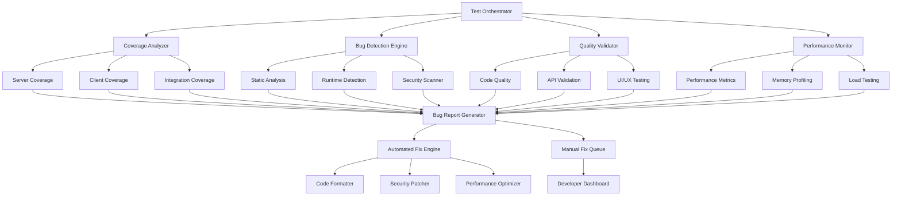

# Design Document

## Overview

This design outlines a comprehensive testing and bug fixing framework for the Chanuka Legislative Transparency Platform. The system will systematically identify, document, and resolve bugs across all application layers while establishing robust quality assurance processes.

## Architecture

### Testing Framework Architecture



## Components and Interfaces

### 1. Test Coverage Analyzer

**Purpose**: Analyze current test coverage and identify gaps

**Interface**:
```typescript
interface CoverageAnalyzer {
  analyzeServerCoverage(): Promise<CoverageReport>;
  analyzeClientCoverage(): Promise<CoverageReport>;
  analyzeIntegrationCoverage(): Promise<CoverageReport>;
  identifyGaps(reports: CoverageReport[]): Promise<CoverageGap[]>;
  generateCoverageReport(): Promise<ComprehensiveCoverageReport>;
}

interface CoverageReport {
  lines: { total: number; covered: number; percentage: number };
  functions: { total: number; covered: number; percentage: number };
  branches: { total: number; covered: number; percentage: number };
  statements: { total: number; covered: number; percentage: number };
  uncoveredFiles: string[];
  uncoveredFunctions: string[];
  uncoveredLines: { file: string; lines: number[] }[];
}

interface CoverageGap {
  type: 'function' | 'branch' | 'statement' | 'integration';
  file: string;
  location: string;
  severity: 'critical' | 'high' | 'medium' | 'low';
  description: string;
  suggestedTest: string;
}
```

### 2. Bug Detection Engine

**Purpose**: Systematically detect bugs through multiple analysis methods

**Interface**:
```typescript
interface BugDetectionEngine {
  runStaticAnalysis(): Promise<StaticAnalysisResult[]>;
  runRuntimeDetection(): Promise<RuntimeBug[]>;
  runSecurityScan(): Promise<SecurityVulnerability[]>;
  runPerformanceAnalysis(): Promise<PerformanceBug[]>;
  runAccessibilityAudit(): Promise<AccessibilityIssue[]>;
  generateBugReport(): Promise<ComprehensiveBugReport>;
}

interface Bug {
  id: string;
  type: 'syntax' | 'logic' | 'performance' | 'security' | 'accessibility' | 'ui' | 'api';
  severity: 'critical' | 'high' | 'medium' | 'low';
  file: string;
  line?: number;
  column?: number;
  description: string;
  reproductionSteps?: string[];
  expectedBehavior: string;
  actualBehavior: string;
  impact: string;
  suggestedFix?: string;
  autoFixable: boolean;
  testCase?: string;
}

interface StaticAnalysisResult extends Bug {
  rule: string;
  category: 'typescript' | 'eslint' | 'security' | 'performance';
}

interface RuntimeBug extends Bug {
  stackTrace: string;
  context: Record<string, any>;
  frequency: number;
  firstOccurrence: Date;
  lastOccurrence: Date;
}

interface SecurityVulnerability extends Bug {
  cwe: string;
  cvss: number;
  exploitability: 'high' | 'medium' | 'low';
  mitigation: string;
}

interface PerformanceBug extends Bug {
  metric: 'response_time' | 'memory_usage' | 'cpu_usage' | 'bundle_size';
  threshold: number;
  actualValue: number;
  impact: 'user_experience' | 'server_load' | 'cost';
}

interface AccessibilityIssue extends Bug {
  wcagLevel: 'A' | 'AA' | 'AAA';
  wcagCriterion: string;
  element: string;
  assistiveTechnology: string[];
}
```

### 3. Database and API Validator

**Purpose**: Validate database operations and API endpoints comprehensively

**Interface**:
```typescript
interface DatabaseValidator {
  validateSchema(): Promise<SchemaValidationResult>;
  validateDataIntegrity(): Promise<DataIntegrityResult>;
  validateMigrations(): Promise<MigrationValidationResult>;
  validatePerformance(): Promise<DatabasePerformanceResult>;
  runIntegrityTests(): Promise<IntegrityTestResult[]>;
}

interface APIValidator {
  validateEndpoints(): Promise<EndpointValidationResult[]>;
  validateRequestResponse(): Promise<APIValidationResult[]>;
  validateSecurity(): Promise<APISecurityResult[]>;
  validatePerformance(): Promise<APIPerformanceResult[]>;
  runContractTests(): Promise<ContractTestResult[]>;
}

interface SchemaValidationResult {
  valid: boolean;
  missingTables: string[];
  missingColumns: { table: string; columns: string[] }[];
  typeConflicts: { table: string; column: string; expected: string; actual: string }[];
  constraintViolations: { table: string; constraint: string; issue: string }[];
  indexIssues: { table: string; index: string; issue: string }[];
}

interface EndpointValidationResult {
  endpoint: string;
  method: string;
  status: 'working' | 'broken' | 'missing';
  responseTime: number;
  statusCode: number;
  responseFormat: 'valid' | 'invalid';
  securityHeaders: boolean;
  rateLimiting: boolean;
  authentication: 'required' | 'optional' | 'none';
  issues: string[];
}
```

### 4. Frontend Component Tester

**Purpose**: Comprehensive testing of React components and user interactions

**Interface**:
```typescript
interface ComponentTester {
  testComponentRendering(): Promise<RenderingTestResult[]>;
  testUserInteractions(): Promise<InteractionTestResult[]>;
  testResponsiveDesign(): Promise<ResponsiveTestResult[]>;
  testAccessibility(): Promise<AccessibilityTestResult[]>;
  testPerformance(): Promise<ComponentPerformanceResult[]>;
  runVisualRegressionTests(): Promise<VisualRegressionResult[]>;
}

interface RenderingTestResult {
  component: string;
  props: Record<string, any>;
  rendered: boolean;
  errors: string[];
  warnings: string[];
  missingProps: string[];
  unusedProps: string[];
  childComponents: string[];
}

interface InteractionTestResult {
  component: string;
  interaction: string;
  success: boolean;
  expectedOutcome: string;
  actualOutcome: string;
  userFlow: string[];
  accessibility: boolean;
  keyboardNavigation: boolean;
}

interface ResponsiveTestResult {
  component: string;
  breakpoint: string;
  viewport: { width: number; height: number };
  layout: 'correct' | 'broken' | 'suboptimal';
  issues: string[];
  screenshots?: string[];
}
```

### 5. Performance and Security Monitor

**Purpose**: Monitor application performance and security continuously

**Interface**:
```typescript
interface PerformanceMonitor {
  measureResponseTimes(): Promise<ResponseTimeMetrics>;
  profileMemoryUsage(): Promise<MemoryProfile>;
  analyzeBundleSize(): Promise<BundleAnalysis>;
  runLoadTests(): Promise<LoadTestResult>;
  monitorRealTimePerformance(): Promise<RealTimeMetrics>;
}

interface SecurityMonitor {
  scanVulnerabilities(): Promise<VulnerabilityReport>;
  testAuthentication(): Promise<AuthenticationTestResult>;
  validateInputSanitization(): Promise<SanitizationTestResult>;
  checkSecurityHeaders(): Promise<SecurityHeadersResult>;
  runPenetrationTests(): Promise<PenetrationTestResult>;
}

interface ResponseTimeMetrics {
  endpoints: { path: string; method: string; averageTime: number; p95: number; p99: number }[];
  slowQueries: { query: string; averageTime: number; frequency: number }[];
  bottlenecks: { component: string; impact: number; suggestion: string }[];
}

interface VulnerabilityReport {
  critical: SecurityVulnerability[];
  high: SecurityVulnerability[];
  medium: SecurityVulnerability[];
  low: SecurityVulnerability[];
  summary: { total: number; byType: Record<string, number> };
  recommendations: string[];
}
```

### 6. Automated Fix Engine

**Purpose**: Automatically fix common bugs and code quality issues

**Interface**:
```typescript
interface AutomatedFixEngine {
  fixFormattingIssues(): Promise<FixResult[]>;
  fixSecurityVulnerabilities(): Promise<FixResult[]>;
  optimizePerformance(): Promise<FixResult[]>;
  fixAccessibilityIssues(): Promise<FixResult[]>;
  updateDependencies(): Promise<FixResult[]>;
  generateMissingTests(): Promise<FixResult[]>;
}

interface FixResult {
  type: 'formatting' | 'security' | 'performance' | 'accessibility' | 'dependency' | 'test';
  file: string;
  description: string;
  applied: boolean;
  backup?: string;
  verification: 'passed' | 'failed' | 'pending';
  impact: 'low' | 'medium' | 'high';
}
```

## Data Models

### Bug Report Model

```typescript
interface ComprehensiveBugReport {
  id: string;
  timestamp: Date;
  version: string;
  environment: 'development' | 'staging' | 'production';
  summary: {
    totalBugs: number;
    criticalBugs: number;
    fixedBugs: number;
    newBugs: number;
    bugsByType: Record<string, number>;
    bugsBySeverity: Record<string, number>;
  };
  bugs: Bug[];
  coverageGaps: CoverageGap[];
  performanceIssues: PerformanceBug[];
  securityVulnerabilities: SecurityVulnerability[];
  accessibilityIssues: AccessibilityIssue[];
  recommendations: Recommendation[];
  fixPlan: FixPlan;
}

interface Recommendation {
  category: 'testing' | 'performance' | 'security' | 'accessibility' | 'code-quality';
  priority: 'high' | 'medium' | 'low';
  description: string;
  effort: 'low' | 'medium' | 'high';
  impact: 'low' | 'medium' | 'high';
  implementation: string[];
}

interface FixPlan {
  phases: FixPhase[];
  estimatedTime: string;
  dependencies: string[];
  risks: string[];
}

interface FixPhase {
  name: string;
  description: string;
  tasks: FixTask[];
  estimatedTime: string;
  priority: number;
}

interface FixTask {
  id: string;
  description: string;
  type: 'automated' | 'manual';
  assignee?: string;
  estimatedTime: string;
  dependencies: string[];
  verification: string[];
}
```

## Error Handling

### Error Categories and Handling Strategy

1. **Test Execution Errors**
   - Timeout errors: Increase timeout, optimize test performance
   - Environment errors: Validate test environment setup
   - Dependency errors: Check and update test dependencies

2. **Bug Detection Errors**
   - Static analysis failures: Fallback to alternative tools
   - Runtime detection issues: Implement error boundaries
   - Security scan failures: Manual security review

3. **Fix Application Errors**
   - Automated fix failures: Queue for manual review
   - Verification failures: Rollback and flag for investigation
   - Dependency conflicts: Create compatibility matrix

4. **Performance Monitoring Errors**
   - Metric collection failures: Use fallback metrics
   - Load test failures: Adjust test parameters
   - Memory profiling errors: Use alternative profiling tools

## Testing Strategy

### Test Execution Pipeline

1. **Pre-execution Phase**
   - Environment validation
   - Dependency checks
   - Test data preparation
   - Baseline metrics collection

2. **Execution Phase**
   - Unit test execution with coverage
   - Integration test execution
   - End-to-end test execution
   - Performance test execution
   - Security test execution

3. **Analysis Phase**
   - Coverage analysis
   - Bug detection and classification
   - Performance analysis
   - Security vulnerability assessment

4. **Reporting Phase**
   - Comprehensive report generation
   - Fix recommendation generation
   - Priority assignment
   - Dashboard updates

5. **Fix Phase**
   - Automated fix application
   - Manual fix queue generation
   - Verification testing
   - Regression testing

### Quality Gates

1. **Coverage Gates**
   - Minimum 80% line coverage
   - Minimum 70% branch coverage
   - 100% critical path coverage

2. **Performance Gates**
   - API response time < 2 seconds
   - Page load time < 3 seconds
   - Memory usage < 512MB baseline

3. **Security Gates**
   - Zero critical vulnerabilities
   - All high vulnerabilities addressed
   - Security headers properly configured

4. **Accessibility Gates**
   - WCAG 2.1 AA compliance
   - Keyboard navigation support
   - Screen reader compatibility

### Test Data Management

1. **Mock Data Strategy**
   - Realistic test data generation
   - Edge case data scenarios
   - Performance test data sets
   - Security test payloads

2. **Test Environment Management**
   - Isolated test databases
   - Consistent environment setup
   - Test data cleanup procedures
   - Environment reset capabilities

3. **Test Result Storage**
   - Historical test results
   - Trend analysis data
   - Performance benchmarks
   - Bug tracking integration

## Implementation Phases

### Phase 1: Foundation Setup
- Test infrastructure enhancement
- Coverage analysis implementation
- Basic bug detection setup
- Reporting framework creation

### Phase 2: Comprehensive Testing
- Advanced bug detection implementation
- Performance monitoring setup
- Security scanning integration
- Accessibility testing implementation

### Phase 3: Automation and Optimization
- Automated fix engine development
- Continuous integration setup
- Dashboard and reporting enhancement
- Performance optimization

### Phase 4: Monitoring and Maintenance
- Continuous monitoring setup
- Alerting and notification system
- Regular maintenance procedures
- Documentation and training

This design provides a comprehensive framework for systematic testing and bug fixing that will ensure the Chanuka Legislative Transparency Platform meets production quality standards.