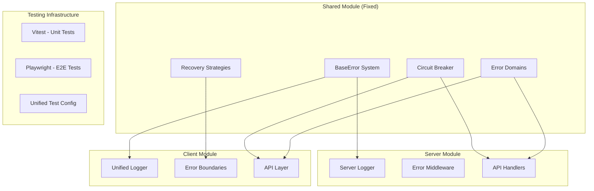
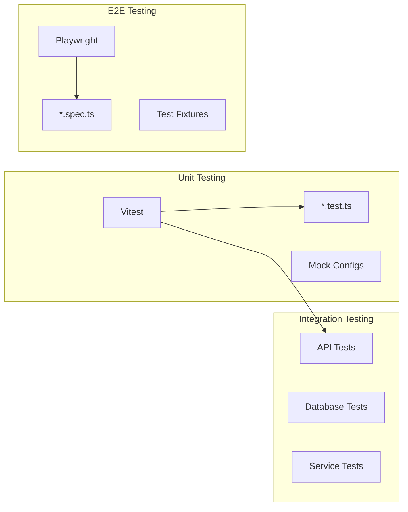
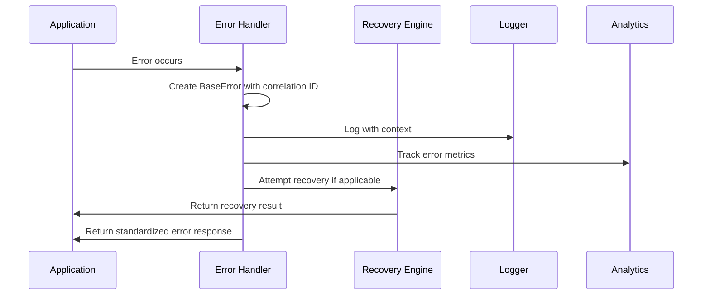

# Design Document

## Overview

This design addresses the critical build failures and infrastructure issues preventing the Chanuka Legislative Transparency Platform from deploying successfully. The solution focuses on four key areas: shared module compilation fixes, unified error management integration, test framework conflict resolution, and security vulnerability patching.

The design leverages the existing comprehensive error management system in `shared/core/src/observability/error-management/errors/base-error.ts` and integrates it across the client and server modules, replacing the current fragmented error handling approaches.

## Architecture

### Current State Analysis

Based on the codebase examination, the platform has:

1. **Shared Module Structure**: Well-organized with core utilities, database management, and schema definitions
2. **Comprehensive Error System**: Fully implemented BaseError system with correlation IDs, recovery strategies, and circuit breakers
3. **Fragmented Error Usage**: Client uses custom logger errors, server has separate implementations, shared system unused
4. **Test Framework Conflicts**: Mixed Vitest/Playwright usage causing import conflicts
5. **Build Compilation Issues**: Missing imports and class implementation problems

### Target Architecture



## Components and Interfaces

### 1. Shared Module Compilation Fixes

**BrowserAdapter Implementation**
- Fix missing base class implementations
- Resolve import path issues for `core/base-adapter`
- Implement required properties and methods
- Ensure proper TypeScript compilation

**Module Resolution Strategy**
- Standardize import paths across modules
- Fix shared/core export structure
- Resolve circular dependency issues
- Update TypeScript path mappings

### 2. Unified Error Management Integration

**Error System Integration Points**

```typescript
// Shared error system (already implemented)
interface BaseErrorSystem {
  BaseError: class with correlation IDs and recovery
  ErrorDomain: enum for categorization
  ErrorSeverity: enum for priority
  RecoveryStrategy: interface for automatic recovery
}

// Client integration points
interface ClientErrorIntegration {
  logger: ExtendedLogger using BaseError
  errorBoundaries: React components using BaseError
  apiInterceptors: HTTP interceptors with circuit breakers
}

// Server integration points  
interface ServerErrorIntegration {
  middleware: Express middleware using BaseError
  errorHandlers: Global handlers with recovery
  apiResponses: Standardized error responses
}
```

**Migration Strategy**
- Replace client logger error classes with BaseError
- Update server error handling to use shared system
- Implement error boundaries using BaseError
- Add circuit breaker patterns to API calls

### 3. Test Framework Conflict Resolution

**Testing Architecture**



**Conflict Resolution Strategy**
- Separate test file patterns: `*.test.ts` for Vitest, `*.spec.ts` for Playwright
- Isolated configuration files with no shared dependencies
- Dedicated mock configurations for each framework
- Path alias resolution for both frameworks

### 4. Security Vulnerability Patching

**Dependency Update Strategy**
- Update glob package to latest secure version
- Update esbuild to patched version
- Implement input validation for command injection prevention
- Add request sanitization middleware

## Data Models

### Error Correlation Model

```typescript
interface ErrorCorrelation {
  correlationId: string;
  parentErrorId?: string;
  childErrors: string[];
  recoveryAttempts: RecoveryAttempt[];
  circuitBreakerState: CircuitBreakerState;
}

interface RecoveryAttempt {
  strategyId: string;
  timestamp: Date;
  success: boolean;
  error?: string;
}

interface CircuitBreakerState {
  state: 'closed' | 'open' | 'half-open';
  failureCount: number;
  lastFailure?: Date;
  nextRetry?: Date;
}
```

### Build Configuration Model

```typescript
interface BuildConfiguration {
  sharedModuleExports: ModuleExport[];
  importPathMappings: PathMapping[];
  typeScriptReferences: ProjectReference[];
  testFrameworkConfigs: TestConfig[];
}

interface ModuleExport {
  module: string;
  exports: string[];
  path: string;
}

interface PathMapping {
  alias: string;
  path: string;
  frameworks: ('vitest' | 'playwright' | 'typescript')[];
}
```

## Error Handling

### Centralized Error Management

**Error Flow Architecture**



**Recovery Strategy Implementation**

1. **Network Errors**: Exponential backoff with circuit breaker
2. **Authentication Errors**: Token refresh with fallback to login
3. **Validation Errors**: User-friendly messages with field mapping
4. **System Errors**: Cache clear and application reload for critical issues

### Error Boundary Integration

```typescript
interface ErrorBoundaryProps {
  fallback: ComponentType<ErrorFallbackProps>;
  onError?: (error: BaseError, errorInfo: ErrorInfo) => void;
  isolate?: boolean;
  recoveryStrategies?: RecoveryStrategy[];
}

interface ErrorFallbackProps {
  error: BaseError;
  resetError: () => void;
  attemptRecovery: () => Promise<boolean>;
}
```

## Testing Strategy

### Test Framework Separation

**Vitest Configuration (Unit Tests)**
- File pattern: `**/*.test.{ts,tsx}`
- Environment: jsdom for React components
- Mock configurations for Redis, Performance API
- Path aliases for shared module imports

**Playwright Configuration (E2E Tests)**
- File pattern: `**/*.spec.{ts,tsx}`
- Environment: browser contexts
- API testing project for backend endpoints
- Database performance testing project

### Test Environment Setup

```typescript
interface TestEnvironment {
  framework: 'vitest' | 'playwright';
  environment: 'jsdom' | 'node' | 'browser';
  mocks: MockConfiguration[];
  pathAliases: PathAlias[];
  setupFiles: string[];
}

interface MockConfiguration {
  module: string;
  implementation: string;
  conditions?: string[];
}
```

### Mock Strategy

**Redis Mock Implementation**
```typescript
interface RedisMock {
  get: (key: string) => Promise<string | null>;
  set: (key: string, value: string, ttl?: number) => Promise<void>;
  del: (key: string) => Promise<number>;
  flushall: () => Promise<void>;
}
```

**Performance API Mock**
```typescript
interface PerformanceMock {
  mark: (name: string) => void;
  measure: (name: string, start: string, end: string) => void;
  getEntriesByType: (type: string) => PerformanceEntry[];
  clearMarks: () => void;
  clearMeasures: () => void;
}
```

## Implementation Phases

### Phase 1: Shared Module Compilation (Critical)
1. Fix BrowserAdapter class implementation
2. Resolve missing import paths
3. Update TypeScript configuration
4. Ensure clean compilation

### Phase 2: Error System Integration (Critical)
1. Update client logger to use BaseError
2. Replace server error classes with BaseError
3. Implement error boundaries with shared system
4. Add circuit breaker patterns to API calls

### Phase 3: Test Framework Resolution (High Priority)
1. Separate Vitest and Playwright configurations
2. Fix mock implementations
3. Resolve path alias conflicts
4. Update test file patterns

### Phase 4: Security Patching (Critical)
1. Update vulnerable dependencies
2. Implement input validation
3. Add request sanitization
4. Security audit verification

## Performance Considerations

### Memory Management
- Implement LRU cache for error storage
- Automatic cleanup of stale error entries
- Efficient circular buffer for render tracking
- Debounced error notifications

### Build Performance
- Incremental TypeScript compilation
- Optimized import resolution
- Parallel test execution
- Cached dependency resolution

### Runtime Performance
- Zero-overhead debug logging in production
- Lazy loading of advanced error modules
- Efficient error correlation algorithms
- Minimal performance impact from error tracking

## Security Considerations

### Input Validation
- Sanitize all user inputs to prevent command injection
- Validate file paths and module imports
- Implement CSP headers for XSS protection
- Rate limiting for error reporting endpoints

### Error Information Disclosure
- Sanitize error messages for production
- Remove sensitive context data from logs
- Implement error message localization
- Secure error correlation ID generation

### Dependency Security
- Regular security audits of dependencies
- Automated vulnerability scanning
- Secure package resolution
- Dependency pinning for critical packages

## Monitoring and Observability

### Error Analytics
- Error rate monitoring by domain and severity
- Recovery success rate tracking
- Circuit breaker state monitoring
- Performance impact measurement

### Build Monitoring
- Compilation time tracking
- Test execution metrics
- Dependency resolution performance
- Bundle size analysis

### Runtime Monitoring
- Error correlation tracking
- Memory usage monitoring
- Performance regression detection
- User experience impact measurement