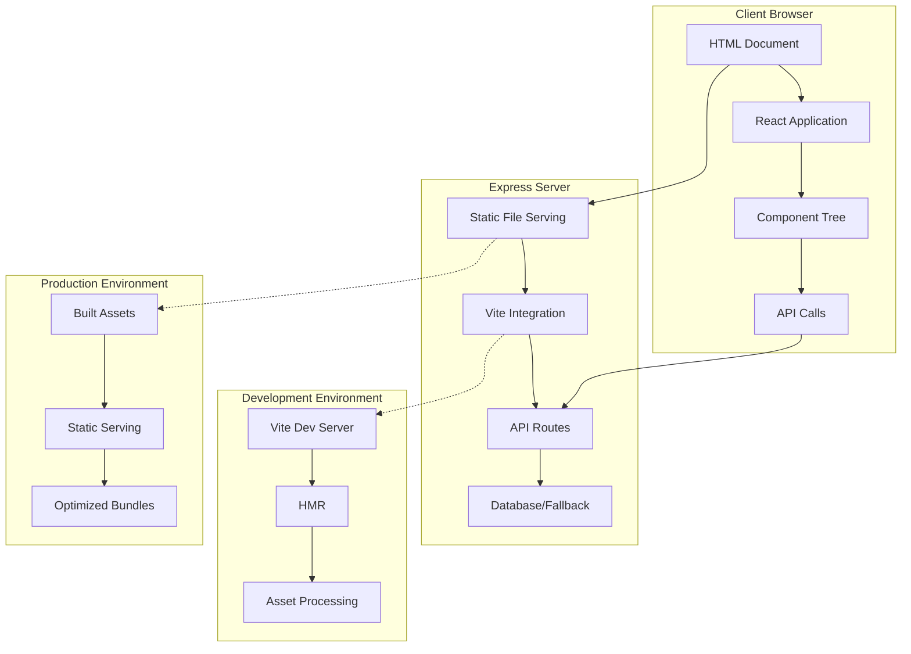

# Design Document

## Overview

The frontend serving and functionality issues in the Chanuka Legislative Transparency Platform stem from several interconnected problems: improper Vite integration with Express, React application initialization failures, API communication issues, and asset serving problems. This design addresses these issues through a systematic approach that ensures reliable frontend serving, proper React initialization, robust error handling, and seamless API integration.

The solution focuses on creating a stable foundation for the frontend application while maintaining the existing architecture and ensuring both development and production environments work correctly.

## Architecture

### High-Level Architecture



### Component Architecture

The frontend architecture follows a layered approach:

1. **Serving Layer**: Express server with Vite integration for development and static file serving for production
2. **Application Layer**: React application with proper initialization and error boundaries
3. **Routing Layer**: React Router with lazy-loaded components and error handling
4. **API Layer**: Axios/fetch-based API client with error handling and fallback mechanisms
5. **State Management**: React Query for server state and React Context for client state

## Components and Interfaces

### 1. Server Configuration Component

**Purpose**: Ensure proper frontend serving in both development and production environments.

**Key Interfaces**:
```typescript
interface ServerConfig {
  port: number;
  environment: 'development' | 'production';
  staticPath?: string;
  viteConfig?: ViteDevServerOptions;
}

interface ViteIntegration {
  setupVite(app: Express, server: Server): Promise<void>;
  serveStatic(app: Express): void;
}
```

**Implementation Strategy**:
- Fix Vite middleware integration to properly handle asset requests
- Implement proper fallback to index.html for SPA routing
- Configure CORS and security headers appropriately
- Add proper error handling for asset serving failures

### 2. React Application Bootstrap Component

**Purpose**: Ensure reliable React application initialization and mounting.

**Key Interfaces**:
```typescript
interface AppBootstrap {
  initializeApp(): Promise<void>;
  handleInitializationError(error: Error): void;
  validateDOMReady(): boolean;
}

interface ErrorBoundaryConfig {
  fallbackComponent: React.ComponentType;
  onError: (error: Error, errorInfo: ErrorInfo) => void;
  resetOnPropsChange?: boolean;
}
```

**Implementation Strategy**:
- Add DOM readiness checks before React mounting
- Implement comprehensive error boundaries at multiple levels
- Add initialization retry logic with exponential backoff
- Provide meaningful error messages for common failure scenarios

### 3. API Communication Component

**Purpose**: Establish reliable communication between frontend and backend.

**Key Interfaces**:
```typescript
interface ApiClient {
  baseURL: string;
  timeout: number;
  retryConfig: RetryConfig;
  interceptors: {
    request: RequestInterceptor[];
    response: ResponseInterceptor[];
  };
}

interface RetryConfig {
  maxRetries: number;
  retryDelay: number;
  retryCondition: (error: any) => boolean;
}
```

**Implementation Strategy**:
- Configure proper base URLs for different environments
- Implement request/response interceptors for error handling
- Add retry logic for network failures
- Implement proper CORS handling and authentication headers

### 4. Asset Loading and Optimization Component

**Purpose**: Ensure efficient loading and caching of frontend assets.

**Key Interfaces**:
```typescript
interface AssetLoader {
  preloadCriticalAssets(): Promise<void>;
  loadAssetWithRetry(url: string, type: AssetType): Promise<void>;
  handleAssetError(error: Error, asset: string): void;
}

interface CacheStrategy {
  staticAssets: CacheConfig;
  apiResponses: CacheConfig;
  componentChunks: CacheConfig;
}
```

**Implementation Strategy**:
- Implement proper asset preloading for critical resources
- Add retry mechanisms for failed asset loads
- Configure appropriate caching headers and strategies
- Optimize bundle splitting and lazy loading

## Data Models

### Frontend Configuration Model

```typescript
interface FrontendConfig {
  apiBaseUrl: string;
  environment: 'development' | 'production';
  features: {
    enableServiceWorker: boolean;
    enableOfflineMode: boolean;
    enableAnalytics: boolean;
  };
  performance: {
    enablePreloading: boolean;
    chunkSizeLimit: number;
    cacheStrategy: CacheStrategy;
  };
}
```

### Error State Model

```typescript
interface ErrorState {
  type: 'network' | 'component' | 'initialization' | 'api';
  message: string;
  code?: string;
  timestamp: Date;
  context: {
    component?: string;
    route?: string;
    userAgent?: string;
  };
  recoverable: boolean;
  retryCount: number;
}
```

### Loading State Model

```typescript
interface LoadingState {
  isLoading: boolean;
  loadingType: 'initial' | 'navigation' | 'component' | 'api';
  progress?: number;
  message?: string;
  estimatedTime?: number;
}
```

## Error Handling

### Error Boundary Strategy

1. **Page-Level Error Boundaries**: Catch and handle errors at the page level, allowing other parts of the application to continue functioning
2. **Component-Level Error Boundaries**: Wrap critical components with error boundaries to prevent cascading failures
3. **API Error Boundaries**: Handle API errors gracefully with retry mechanisms and fallback data
4. **Initialization Error Handling**: Provide recovery mechanisms for application bootstrap failures

### Error Recovery Mechanisms

```typescript
interface ErrorRecovery {
  // Automatic retry with exponential backoff
  retryWithBackoff(operation: () => Promise<any>, maxRetries: number): Promise<any>;
  
  // Fallback to cached or default data
  fallbackToCache(key: string): any;
  
  // Component-level recovery
  resetComponent(componentId: string): void;
  
  // Full application reset
  resetApplication(): void;
}
```

### Error Reporting and Monitoring

- Client-side error logging with context information
- Network error tracking and analysis
- Performance monitoring for loading times
- User experience metrics for error recovery success rates

## Testing Strategy

### Unit Testing

1. **Server Configuration Tests**:
   - Test Vite integration setup
   - Test static file serving
   - Test CORS and security header configuration
   - Test error handling in server setup

2. **React Application Tests**:
   - Test application initialization
   - Test error boundary functionality
   - Test component mounting and unmounting
   - Test routing and navigation

3. **API Communication Tests**:
   - Test API client configuration
   - Test request/response interceptors
   - Test retry mechanisms
   - Test error handling and fallbacks

### Integration Testing

1. **End-to-End Serving Tests**:
   - Test complete request flow from browser to server
   - Test asset loading and caching
   - Test SPA routing and fallbacks
   - Test error scenarios and recovery

2. **Cross-Browser Testing**:
   - Test functionality across different browsers
   - Test responsive design and mobile compatibility
   - Test performance across different devices
   - Test accessibility compliance

### Performance Testing

1. **Loading Performance**:
   - Measure initial page load times
   - Test asset loading optimization
   - Measure component lazy loading performance
   - Test caching effectiveness

2. **Runtime Performance**:
   - Test navigation speed
   - Measure API response times
   - Test memory usage and cleanup
   - Monitor error recovery performance

### Development Testing

1. **Hot Module Replacement Testing**:
   - Test HMR functionality in development
   - Test error recovery during development
   - Test asset reloading and caching
   - Test development server stability

2. **Build Process Testing**:
   - Test production build generation
   - Test asset optimization and minification
   - Test bundle splitting and lazy loading
   - Test deployment readiness

## Implementation Approach

### Phase 1: Server Configuration Fix
- Fix Vite integration middleware setup
- Implement proper static file serving for production
- Configure CORS and security headers
- Add comprehensive error handling for server setup

### Phase 2: React Application Bootstrap
- Add DOM readiness checks and initialization validation
- Implement comprehensive error boundaries
- Add application-level error recovery mechanisms
- Improve loading states and user feedback

### Phase 3: API Communication Enhancement
- Configure proper API client with retry mechanisms
- Implement request/response interceptors
- Add network error handling and fallbacks
- Ensure proper authentication and CORS handling

### Phase 4: Asset Optimization and Performance
- Implement asset preloading strategies
- Optimize bundle splitting and lazy loading
- Configure caching strategies
- Add performance monitoring and optimization

### Phase 5: Testing and Validation
- Implement comprehensive test suite
- Add cross-browser and device testing
- Performance testing and optimization
- User acceptance testing and feedback integration

This design ensures a robust, reliable frontend serving solution that addresses the current issues while providing a foundation for future enhancements and scalability.