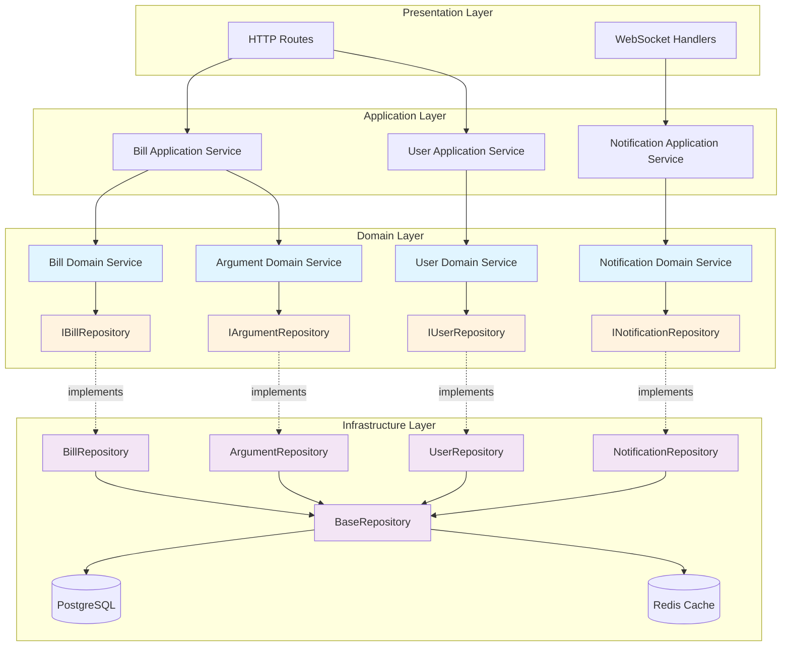

# Design Document: Infrastructure-Feature Integration

## Overview

This design establishes a repository pattern architecture that builds on Week 1's database access standardization to achieve full feature-infrastructure integration.

**Week 1 Achievements (COMPLETE):**
- ✅ 20 files migrated to modern patterns (100% of target)
- ✅ 200+ methods using `readDatabase`/`withTransaction`
- ✅ Integration score: 18% → 50% (+178%)
- ✅ Zero legacy pool imports remaining
- ✅ Proven patterns: `readDatabase`, `withTransaction`, Result<T, Error>

**Week 2+ Goals:**
This design provides a systematic approach to achieve 90%+ integration through domain-specific repositories (not generic CRUD), dependency injection, and clear architectural boundaries. The foundation from Week 1 (modern database access) is leveraged throughout.

### Critical Design Principles

1. **Repository vs Service Separation**: Repositories handle data access ONLY; domain services implement business logic; application services orchestrate use cases
2. **Domain-Specific Over Generic**: Repositories expose domain methods like `findByBillNumber()` rather than generic CRUD
3. **Dependency Injection**: All repositories injected as dependencies, never instantiated with `new`
4. **Leverage Existing Infrastructure**: Use Drizzle ORM, `withTransaction()`, read/write separation, and existing validation
5. **Selective Application**: Not every table needs a repository; simple queries can use query services

### Design Goals

- Increase integration score from 18% to 90%+
- Increase schema utilization from 30% to 80%+
- Achieve 95%+ type consistency
- Reduce query execution time by 30%
- Reduce code duplication by 40%
- Establish enforceable patterns through linting

## Architecture

### Layered Architecture


### Layer Responsibilities

**Presentation Layer**
- HTTP request/response handling
- Input validation and sanitization
- Response formatting
- Authentication/authorization checks
- NO direct database access
- NO business logic

**Application Layer**
- Use case orchestration
- Transaction boundary management
- Cross-feature coordination
- Event publishing
- NO direct database access
- Minimal business logic (coordination only)

**Domain Layer**
- Business logic implementation
- Domain model definitions
- Repository interface definitions
- Domain event definitions
- Business rule validation
- NO infrastructure concerns

**Infrastructure Layer**
- Data access implementation
- Database query execution
- Caching strategy
- Transaction management
- Connection pooling
- NO business logic

### Dependency Flow

```
Presentation → Application → Domain ← Infrastructure
```

- Presentation depends on Application
- Application depends on Domain
- Infrastructure depends on Domain (implements interfaces)
- Domain depends on NOTHING (pure business logic)

This inverted dependency ensures domain logic remains independent of infrastructure concerns, enabling testability and flexibility.

## Components and Interfaces

### Base Repository

The Base Repository provides common infrastructure without enforcing generic CRUD methods. It's designed to be extended by domain-specific repositories.

```typescript
// server/infrastructure/database/repository/base-repository.ts

import { logger } from '@server/infrastructure/observability/core/logger';
import { withTransaction, readDatabase, writeDatabase } from '@server/infrastructure/database';
import type { DatabaseConnection, ExtendedTransaction } from '@server/infrastructure/database/connection';
import { Result, Ok, Err } from '@shared/core';

/**
 * Configuration for repository operations
 */
export interface RepositoryOptions {
  /** Enable caching for read operations */
  enableCache?: boolean;
  /** Cache TTL in seconds */
  cacheTTL?: number;
  /** Custom cache key prefix */
  cachePrefix?: string;
  /** Enable query logging */
  enableLogging?: boolean;
}

/**
 * Base repository providing common infrastructure for data access.
 * 
 * DESIGN PRINCIPLES:
 * - Provides infrastructure (transactions, error handling, caching, logging)
 * - Does NOT enforce generic CRUD methods
 * - Domain-specific repositories extend this and define their own methods
 * - Uses existing Drizzle ORM, withTransaction, read/write separation
 * 
 * @example
 * class BillRepository extends BaseRepository<Bill> {
 *   async findByBillNumber(billNumber: string): Promise<Result<Maybe<Bill>, Error>> {
 *     return this.executeRead(async (db) => {
 *       const result = await db.select()
 *         .from(bills)
 *         .where(eq(bills.bill_number, billNumber))
 *         .limit(1);
 *       return result[0] ?? null;
 *     }, `findByBillNumber:${billNumber}`);
 *   }
 * }
 */
export abstract class BaseRepository<T> {
  protected readonly options: Required<RepositoryOptions>;
  protected readonly entityName: string;

  constructor(
    entityName: string,
    options: RepositoryOptions = {}
  ) {
    this.entityName = entityName;
    this.options = {
      enableCache: options.enableCache ?? false,
      cacheTTL: options.cacheTTL ?? 300, // 5 minutes default
      cachePrefix: options.cachePrefix ?? `repo:${entityName}`,
      enableLogging: options.enableLogging ?? true,
    };
  }

  /**
   * Execute a read operation with automatic replica routing and optional caching
   */
  protected async executeRead<R>(
    operation: (db: DatabaseConnection) => Promise<R>,
    cacheKey?: string
  ): Promise<Result<R, Error>> {
    const start = Date.now();
    
    try {
      // Check cache if enabled and key provided
      if (this.options.enableCache && cacheKey) {
        const cached = await this.getFromCache<R>(cacheKey);
        if (cached !== null) {
          this.logOperation('read', 'cache-hit', Date.now() - start, cacheKey);
          return Ok(cached);
        }
      }

      // Execute read operation on read replica
      const result = await operation(readDatabase);

      // Cache result if enabled
      if (this.options.enableCache && cacheKey) {
        await this.setInCache(cacheKey, result);
      }

      this.logOperation('read', 'success', Date.now() - start, cacheKey);
      return Ok(result);
    } catch (error) {
      const err = error instanceof Error ? error : new Error(String(error));
      this.logOperation('read', 'error', Date.now() - start, cacheKey, err);
      return Err(err);
    }
  }

  /**
   * Execute a write operation with automatic transaction wrapping
   */
  protected async executeWrite<R>(
    operation: (tx: ExtendedTransaction) => Promise<R>,
    invalidateCacheKeys?: string[]
  ): Promise<Result<R, Error>> {
    const start = Date.now();
    
    try {
      // Execute write operation in transaction
      const result = await withTransaction(async (tx) => {
        return await operation(tx as ExtendedTransaction);
      });

      // Invalidate cache keys if provided
      if (invalidateCacheKeys && invalidateCacheKeys.length > 0) {
        await this.invalidateCache(invalidateCacheKeys);
      }

      this.logOperation('write', 'success', Date.now() - start);
      return Ok(result);
    } catch (error) {
      const err = error instanceof Error ? error : new Error(String(error));
      this.logOperation('write', 'error', Date.now() - start, undefined, err);
      return Err(err);
    }
  }

  /**
   * Execute a batch write operation with transaction support
   */
  protected async executeBatchWrite<R>(
    operation: (tx: ExtendedTransaction) => Promise<R>,
    invalidateCachePattern?: string
  ): Promise<Result<R, Error>> {
    const start = Date.now();
    
    try {
      const result = await withTransaction(async (tx) => {
        return await operation(tx as ExtendedTransaction);
      }, {
        maxRetries: 3, // Batch operations may encounter deadlocks
        timeout: 30000, // 30 second timeout for batch operations
      });

      // Invalidate cache pattern if provided
      if (invalidateCachePattern) {
        await this.invalidateCachePattern(invalidateCachePattern);
      }

      this.logOperation('batch-write', 'success', Date.now() - start);
      return Ok(result);
    } catch (error) {
      const err = error instanceof Error ? error : new Error(String(error));
      this.logOperation('batch-write', 'error', Date.now() - start, undefined, err);
      return Err(err);
    }
  }

  /**
   * Cache operations (to be implemented with Redis)
   */
  private async getFromCache<R>(key: string): Promise<R | null> {
    // TODO: Implement Redis cache retrieval
    // For now, return null (cache miss)
    return null;
  }

  private async setInCache<R>(key: string, value: R): Promise<void> {
    // TODO: Implement Redis cache storage with TTL
  }

  private async invalidateCache(keys: string[]): Promise<void> {
    // TODO: Implement Redis cache invalidation
  }

  private async invalidateCachePattern(pattern: string): Promise<void> {
    // TODO: Implement Redis pattern-based cache invalidation
  }

  /**
   * Logging helper
   */
  private logOperation(
    type: string,
    status: string,
    durationMs: number,
    cacheKey?: string,
    error?: Error
  ): void {
    if (!this.options.enableLogging) return;

    const logData = {
      component: 'Repository',
      entity: this.entityName,
      operation: type,
      status,
      durationMs,
      cacheKey,
      error: error?.message,
    };

    if (status === 'error') {
      logger.error(logData, `Repository operation failed: ${this.entityName}.${type}`);
    } else if (durationMs > 1000) {
      logger.warn(logData, `Slow repository operation: ${this.entityName}.${type}`);
    } else {
      logger.debug(logData, `Repository operation: ${this.entityName}.${type}`);
    }
  }
}
```

### Repository Interface Pattern

Domain-specific repository interfaces define the contract for data access. These live in the domain layer and are implemented in the infrastructure layer.

```typescript
// server/features/bills/domain/repositories/bill.repository.interface.ts

import type { Result, Maybe } from '@shared/core';
import type { Bill, NewBill } from '@server/infrastructure/schema';

/**
 * Bill repository interface defining domain-specific data access operations.
 * 
 * DESIGN PRINCIPLES:
 * - Domain-specific methods (findByBillNumber, findByAffectedCounties)
 * - NOT generic CRUD (no generic findOne, findAll)
 * - Returns Result<T, Error> for explicit error handling
 * - Uses Maybe<T> for nullable results
 * - Supports pagination, filtering, sorting
 */
export interface IBillRepository {
  // Domain-specific queries
  findByBillNumber(billNumber: string): Promise<Result<Maybe<Bill>, Error>>;
  findByAffectedCounties(counties: string[], options?: QueryOptions): Promise<Result<Bill[], Error>>;
  findBySponsorId(sponsorId: string, options?: QueryOptions): Promise<Result<Bill[], Error>>;
  findByStatus(status: string, options?: QueryOptions): Promise<Result<Bill[], Error>>;
  search(query: string, options?: SearchOptions): Promise<Result<Bill[], Error>>;
  
  // Write operations
  create(bill: NewBill): Promise<Result<Bill, Error>>;
  update(id: string, updates: Partial<NewBill>): Promise<Result<Bill, Error>>;
  updateEngagementMetrics(id: string, metrics: EngagementMetrics): Promise<Result<void, Error>>;
  delete(id: string): Promise<Result<void, Error>>;
  
  // Batch operations
  createBatch(bills: NewBill[]): Promise<Result<Bill[], Error>>;
  updateBatch(updates: Array<{ id: string; data: Partial<NewBill> }>): Promise<Result<Bill[], Error>>;
  deleteBatch(ids: string[]): Promise<Result<void, Error>>;
  
  // Aggregations
  count(criteria?: CountCriteria): Promise<Result<number, Error>>;
}

interface QueryOptions {
  limit?: number;
  offset?: number;
  orderBy?: string;
  orderDirection?: 'asc' | 'desc';
}

interface SearchOptions extends QueryOptions {
  status?: string;
  chamber?: string;
}

interface EngagementMetrics {
  view_count?: number;
  comment_count?: number;
  share_count?: number;
  vote_count_for?: number;
  vote_count_against?: number;
  engagement_score?: number;
}

interface CountCriteria {
  status?: string;
  sponsor_id?: string;
  chamber?: string;
  affected_counties?: string[];
}
```

### Repository Implementation Pattern

Concrete repositories implement the interface and extend BaseRepository for infrastructure support.

```typescript
// server/features/bills/infrastructure/repositories/bill.repository.ts

import { eq, and, or, ilike, inArray, desc, asc } from 'drizzle-orm';
import { bills } from '@server/infrastructure/schema';
import { BaseRepository } from '@server/infrastructure/database/repository/base-repository';
import type { IBillRepository } from '../../domain/repositories/bill.repository.interface';
import type { Result, Maybe } from '@shared/core';
import type { Bill, NewBill } from '@server/infrastructure/schema';

/**
 * Bill repository implementation using Drizzle ORM.
 * 
 * DESIGN PRINCIPLES:
 * - Implements domain interface
 * - Extends BaseRepository for infrastructure
 * - Uses Drizzle ORM for type-safe queries
 * - Leverages read/write separation through BaseRepository
 * - Implements caching for frequently accessed data
 */
export class BillRepository extends BaseRepository<Bill> implements IBillRepository {
  constructor() {
    super('Bill', {
      enableCache: true,
      cacheTTL: 300, // 5 minutes
      enableLogging: true,
    });
  }

  async findByBillNumber(billNumber: string): Promise<Result<Maybe<Bill>, Error>> {
    return this.executeRead(async (db) => {
      const result = await db.select()
        .from(bills)
        .where(eq(bills.bill_number, billNumber))
        .limit(1);
      return result[0] ?? null;
    }, `bill:number:${billNumber}`);
  }

  async findByAffectedCounties(
    counties: string[],
    options: QueryOptions = {}
  ): Promise<Result<Bill[], Error>> {
    const { limit = 50, offset = 0, orderBy = 'created_at', orderDirection = 'desc' } = options;
    
    return this.executeRead(async (db) => {
      let query = db.select()
        .from(bills)
        .where(
          or(...counties.map(county => 
            ilike(bills.affected_counties, `%${county}%`)
          ))
        );

      // Apply ordering
      const orderColumn = bills[orderBy as keyof typeof bills];
      query = orderDirection === 'desc' 
        ? query.orderBy(desc(orderColumn))
        : query.orderBy(asc(orderColumn));

      // Apply pagination
      query = query.limit(limit).offset(offset);

      return await query;
    }, `bills:counties:${counties.join(',')}`);
  }

  async findBySponsorId(
    sponsorId: string,
    options: QueryOptions = {}
  ): Promise<Result<Bill[], Error>> {
    const { limit = 50, offset = 0, orderBy = 'created_at', orderDirection = 'desc' } = options;
    
    return this.executeRead(async (db) => {
      let query = db.select()
        .from(bills)
        .where(eq(bills.sponsor_id, sponsorId));

      const orderColumn = bills[orderBy as keyof typeof bills];
      query = orderDirection === 'desc'
        ? query.orderBy(desc(orderColumn))
        : query.orderBy(asc(orderColumn));

      query = query.limit(limit).offset(offset);

      return await query;
    }, `bills:sponsor:${sponsorId}`);
  }

  async create(bill: NewBill): Promise<Result<Bill, Error>> {
    return this.executeWrite(async (tx) => {
      const [created] = await tx.insert(bills)
        .values(bill)
        .returning();
      return created;
    }, [`bills:sponsor:${bill.sponsor_id}`]);
  }

  async update(id: string, updates: Partial<NewBill>): Promise<Result<Bill, Error>> {
    return this.executeWrite(async (tx) => {
      const [updated] = await tx.update(bills)
        .set({ ...updates, updated_at: new Date() })
        .where(eq(bills.id, id))
        .returning();
      return updated;
    }, [`bill:id:${id}`, `bill:number:${updates.bill_number}`]);
  }

  async createBatch(billsData: NewBill[]): Promise<Result<Bill[], Error>> {
    return this.executeBatchWrite(async (tx) => {
      const created = await tx.insert(bills)
        .values(billsData)
        .returning();
      return created;
    }, 'bills:*');
  }

  // ... other methods
}
```

### Domain Service Pattern

Domain services implement business logic and consume repositories through dependency injection.

```typescript
// server/features/bills/domain/services/bill-domain.service.ts

import type { IBillRepository } from '../repositories/bill.repository.interface';
import type { ISponsorRepository } from '../../../sponsors/domain/repositories/sponsor.repository.interface';
import type { Result } from '@shared/core';
import type { Bill, NewBill } from '@server/infrastructure/schema';
import { logger } from '@server/infrastructure/observability/core/logger';

/**
 * Bill domain service implementing business logic.
 * 
 * DESIGN PRINCIPLES:
 * - Consumes repositories through constructor injection
 * - Implements business logic and validation
 * - Orchestrates multiple repository calls
 * - NO direct database access
 * - Returns Result<T, Error> for explicit error handling
 */
export class BillDomainService {
  constructor(
    private readonly billRepository: IBillRepository,
    private readonly sponsorRepository: ISponsorRepository
  ) {}

  /**
   * Create a new bill with validation
   */
  async createBill(billData: NewBill): Promise<Result<Bill, Error>> {
    // Validate sponsor exists
    const sponsorResult = await this.sponsorRepository.findById(billData.sponsor_id);
    if (sponsorResult.isErr()) {
      return sponsorResult;
    }
    if (!sponsorResult.value) {
      return Err(new Error(`Sponsor not found: ${billData.sponsor_id}`));
    }

    // Validate bill number is unique
    const existingResult = await this.billRepository.findByBillNumber(billData.bill_number);
    if (existingResult.isErr()) {
      return existingResult;
    }
    if (existingResult.value) {
      return Err(new Error(`Bill number already exists: ${billData.bill_number}`));
    }

    // Calculate initial engagement score
    const billWithScore = {
      ...billData,
      engagement_score: 0,
      controversy_score: 0,
      quality_score: 0,
    };

    // Create bill
    const result = await this.billRepository.create(billWithScore);
    
    if (result.isOk()) {
      logger.info({
        component: 'BillDomainService',
        billId: result.value.id,
        billNumber: result.value.bill_number,
      }, 'Bill created successfully');
    }

    return result;
  }

  /**
   * Update bill engagement metrics with business rules
   */
  async updateEngagement(
    billId: string,
    metrics: {
      views?: number;
      comments?: number;
      shares?: number;
      votesFor?: number;
      votesAgainst?: number;
    }
  ): Promise<Result<void, Error>> {
    // Calculate engagement score using business rules
    const engagementScore = this.calculateEngagementScore(metrics);
    const controversyScore = this.calculateControversyScore(metrics);

    return this.billRepository.updateEngagementMetrics(billId, {
      view_count: metrics.views,
      comment_count: metrics.comments,
      share_count: metrics.shares,
      vote_count_for: metrics.votesFor,
      vote_count_against: metrics.votesAgainst,
      engagement_score: engagementScore,
    });
  }

  /**
   * Business logic: Calculate engagement score
   */
  private calculateEngagementScore(metrics: {
    views?: number;
    comments?: number;
    shares?: number;
    votesFor?: number;
    votesAgainst?: number;
  }): number {
    const weights = {
      view: 1,
      comment: 5,
      share: 3,
      vote: 2,
    };

    const score = 
      (metrics.views ?? 0) * weights.view +
      (metrics.comments ?? 0) * weights.comment +
      (metrics.shares ?? 0) * weights.share +
      ((metrics.votesFor ?? 0) + (metrics.votesAgainst ?? 0)) * weights.vote;

    return Math.round(score);
  }

  /**
   * Business logic: Calculate controversy score
   */
  private calculateControversyScore(metrics: {
    votesFor?: number;
    votesAgainst?: number;
  }): number {
    const votesFor = metrics.votesFor ?? 0;
    const votesAgainst = metrics.votesAgainst ?? 0;
    const totalVotes = votesFor + votesAgainst;

    if (totalVotes === 0) return 0;

    // Controversy is high when votes are evenly split
    const ratio = Math.min(votesFor, votesAgainst) / totalVotes;
    return Math.round(ratio * 100);
  }
}
```

### Application Service Pattern

Application services orchestrate use cases and manage transaction boundaries.

```typescript
// server/features/bills/application/services/bill-application.service.ts

import type { BillDomainService } from '../../domain/services/bill-domain.service';
import type { ArgumentIntelligenceService } from '../../../argument-intelligence/domain/services/argument-intelligence.service';
import type { Result } from '@shared/core';
import type { Bill, NewBill } from '@server/infrastructure/schema';
import { withTransaction } from '@server/infrastructure/database';

/**
 * Bill application service orchestrating use cases.
 * 
 * DESIGN PRINCIPLES:
 * - Orchestrates cross-feature operations
 * - Manages transaction boundaries
 * - Publishes domain events
 * - Minimal business logic (coordination only)
 */
export class BillApplicationService {
  constructor(
    private readonly billDomainService: BillDomainService,
    private readonly argumentService: ArgumentIntelligenceService
  ) {}

  /**
   * Create bill with argument analysis (cross-feature use case)
   */
  async createBillWithAnalysis(billData: NewBill): Promise<Result<Bill, Error>> {
    // Transaction boundary managed at application layer
    return withTransaction(async (tx) => {
      // Create bill
      const billResult = await this.billDomainService.createBill(billData);
      if (billResult.isErr()) {
        throw billResult.error; // Rollback transaction
      }

      const bill = billResult.value;

      // Trigger argument analysis (cross-feature integration)
      try {
        await this.argumentService.analyzeBillArguments(bill.id, bill.summary);
      } catch (error) {
        // Log but don't fail - analysis can be retried
        logger.warn({
          component: 'BillApplicationService',
          billId: bill.id,
          error,
        }, 'Argument analysis failed, will retry');
      }

      return bill;
    });
  }
}
```

### Dependency Injection Pattern

Features use factory functions to create service instances with injected dependencies.

```typescript
// server/features/bills/bill-factory.ts

import { BillRepository } from './infrastructure/repositories/bill.repository';
import { SponsorRepository } from '../sponsors/infrastructure/repositories/sponsor.repository';
import { BillDomainService } from './domain/services/bill-domain.service';
import { BillApplicationService } from './application/services/bill-application.service';
import { ArgumentIntelligenceService } from '../argument-intelligence/domain/services/argument-intelligence.service';

/**
 * Factory function creating bill services with dependency injection.
 * 
 * DESIGN PRINCIPLES:
 * - Repositories injected as dependencies
 * - Services depend on interfaces, not concrete classes
 * - Single source of truth for dependency wiring
 * - Enables testing with mock repositories
 */
export function createBillServices() {
  // Create repositories
  const billRepository = new BillRepository();
  const sponsorRepository = new SponsorRepository();

  // Create domain service with injected repositories
  const billDomainService = new BillDomainService(
    billRepository,
    sponsorRepository
  );

  // Create application service with injected domain services
  const argumentService = new ArgumentIntelligenceService();
  const billApplicationService = new BillApplicationService(
    billDomainService,
    argumentService
  );

  return {
    billRepository,
    billDomainService,
    billApplicationService,
  };
}

// Export singleton instance
export const billServices = createBillServices();
```

### When NOT to Use Repositories

Not every table needs a repository. Here are scenarios where repositories are unnecessary:

```typescript
// ❌ DON'T create repositories for:

// 1. Simple read-only queries (use query services)
export class BillStatsQueryService {
  async getBillCountByStatus(): Promise<Record<string, number>> {
    return readDatabase.select({
      status: bills.status,
      count: sql<number>`count(*)`,
    })
    .from(bills)
    .groupBy(bills.status);
  }
}

// 2. One-off migrations (use direct database access)
async function migrateBillData() {
  await writeDatabase.update(bills)
    .set({ quality_score: 0 })
    .where(isNull(bills.quality_score));
}

// 3. Analytics/reporting (use specialized query services)
export class BillAnalyticsService {
  async getEngagementTrends(startDate: Date, endDate: Date) {
    return readDatabase.select({
      date: sql<string>`date_trunc('day', ${bills.created_at})`,
      avgEngagement: sql<number>`avg(${bills.engagement_score})`,
    })
    .from(bills)
    .where(between(bills.created_at, startDate, endDate))
    .groupBy(sql`date_trunc('day', ${bills.created_at})`);
  }
}

// ✅ DO create repositories for:
// - Core domain entities with complex business logic
// - Entities requiring caching strategies
// - Entities with multiple access patterns
// - Entities shared across features
```

## Data Models

### Core Entity Models

The schema layer already defines comprehensive data models. Repositories use these directly through Drizzle ORM type inference.

```typescript
// Types are inferred from schema
import type { Bill, NewBill, User, NewUser, Sponsor, NewSponsor } from '@server/infrastructure/schema';

// Repository methods use these types
interface IBillRepository {
  create(bill: NewBill): Promise<Result<Bill, Error>>;
  findById(id: string): Promise<Result<Maybe<Bill>, Error>>;
}
```

### Result Type Pattern

All repository methods return `Result<T, Error>` for explicit error handling:

```typescript
// @shared/core/result.ts

export type Result<T, E> = Ok<T> | Err<E>;

export class Ok<T> {
  readonly isOk = true;
  readonly isErr = false;
  constructor(readonly value: T) {}
}

export class Err<E> {
  readonly isOk = false;
  readonly isErr = true;
  constructor(readonly error: E) {}
}

// Usage
const result = await billRepository.findById(id);
if (result.isErr()) {
  logger.error({ error: result.error }, 'Failed to find bill');
  return res.status(500).json({ error: 'Internal server error' });
}

const bill = result.value;
if (!bill) {
  return res.status(404).json({ error: 'Bill not found' });
}

return res.json(bill);
```

### Maybe Type Pattern

Use `Maybe<T>` for nullable results:

```typescript
export type Maybe<T> = T | null;

// Repository method
findById(id: string): Promise<Result<Maybe<Bill>, Error>>;

// Usage
const result = await billRepository.findById(id);
if (result.isOk() && result.value) {
  // Bill found
  const bill = result.value;
} else if (result.isOk() && !result.value) {
  // Bill not found (not an error)
} else {
  // Database error
  const error = result.error;
}
```


## Correctness Properties

A property is a characteristic or behavior that should hold true across all valid executions of a system—essentially, a formal statement about what the system should do. Properties serve as the bridge between human-readable specifications and machine-verifiable correctness guarantees.

### Property Reflection

After analyzing all acceptance criteria, I identified the following testable properties and performed redundancy elimination:

**Redundancy Analysis:**
- Properties 6.1, 6.2, 6.3 (transaction wrapping for create/update/delete) can be combined into a single property: "All write operations are wrapped in transactions"
- Properties 1.2 and 2.6 are duplicates (both test transaction wrapping) - consolidate into one
- Properties 1.4, 2.7, 9.1, 9.2 (read/write routing) can be combined into a single comprehensive property
- Properties 7.3 and 7.5 (constraint and foreign key violations) can be combined into "database constraint violations produce appropriate errors"

**Final Property Set:**
After eliminating redundancy, we have 25 unique, high-value properties covering:
- Repository infrastructure (transactions, caching, routing, error handling)
- Round-trip and idempotence properties
- Transaction atomicity and isolation
- Error handling and retry logic
- Batch operations and performance

### Property 1: Write Operations Transaction Wrapping

For any repository write operation (create, update, delete), the operation must be wrapped in a database transaction.

**Validates: Requirements 1.2, 2.6, 6.1, 6.2, 6.3**

### Property 2: Transient Error Retry

For any transient database error (connection failure, deadlock, timeout), the repository must retry the operation up to 3 times with exponential backoff.

**Validates: Requirements 1.3, 7.1, 7.4**

### Property 3: Read/Write Routing

For any repository operation, read operations must route to readDatabase and write operations must route to writeDatabase.

**Validates: Requirements 1.4, 2.7, 9.1, 9.2**

### Property 4: Operation Logging

For any database operation, the repository must log the operation with execution time.

**Validates: Requirements 1.6**

### Property 5: Error Context

For any database operation failure, the repository must throw a standardized error containing operation context (entity name, operation type, parameters).

**Validates: Requirements 1.7, 7.10**

### Property 6: Cache-Then-Database

For any read operation with caching enabled, the repository must check cache before querying the database.

**Validates: Requirements 1.8, 8.1**

### Property 7: Cache Storage with TTL

For any read operation with caching enabled, the repository must store query results in cache with the configured TTL.

**Validates: Requirements 8.2**

### Property 8: Write Invalidates Cache

For any write operation, the repository must invalidate related cache entries.

**Validates: Requirements 8.3**

### Property 9: Repository Extension Functionality

For any repository extending BaseRepository and implementing required methods, the repository must successfully perform CRUD operations.

**Validates: Requirements 1.9**

### Property 10: Create-Read Round Trip

For any entity, creating it then reading it by ID must return an equivalent object (with system-generated fields like timestamps).

**Validates: Requirements 1.10**

### Property 11: Database Orchestrator Usage

For any repository method call, the repository must use the Database Orchestrator for connection management (not direct pool access).

**Validates: Requirements 2.5**

### Property 12: Input Validation

For any repository write operation with invalid input data, the repository must reject the operation before executing the database query.

**Validates: Requirements 2.9**

### Property 13: Create-Delete Idempotence

For any entity, creating it then deleting it must leave the database in its original state (entity count unchanged).

**Validates: Requirements 2.10**

### Property 14: Migration Backward Compatibility

For any feature during migration, both legacy and modern patterns must work simultaneously without conflicts.

**Validates: Requirements 3.8**

### Property 15: Integration Score Improvement

For any migrated feature, the integration score must increase by at least 50 percentage points.

**Validates: Requirements 3.10**

### Property 16: Nested Transaction Support

For any repository performing multiple related operations, nested transactions must be supported and correctly managed.

**Validates: Requirements 6.4**

### Property 17: Transaction Rollback on Failure

For any transaction operation that fails, all changes within the transaction must be rolled back.

**Validates: Requirements 6.5**

### Property 18: Transaction Commit on Success

For any transaction operation that succeeds, all changes within the transaction must be committed.

**Validates: Requirements 6.6**

### Property 19: Transaction Isolation Levels

For any transaction, the repository must support configurable isolation levels (read committed, repeatable read, serializable).

**Validates: Requirements 6.7**

### Property 20: Transaction Event Logging

For any transaction, the repository must log transaction start, commit, and rollback events.

**Validates: Requirements 6.8**

### Property 21: Transaction Timeout Rollback

For any transaction that exceeds the timeout threshold, the repository must rollback all changes and throw a timeout error.

**Validates: Requirements 6.9**

### Property 22: Transaction Atomicity

For any transaction operation, either all changes succeed and are committed, or all changes fail and are rolled back (no partial commits).

**Validates: Requirements 6.10**

### Property 23: Query Timeout Logging

For any query that exceeds the timeout threshold, the repository must log the query text and execution time.

**Validates: Requirements 7.2**

### Property 24: Database Constraint Error Handling

For any database constraint violation (unique, foreign key, check), the repository must throw an appropriate error with field details.

**Validates: Requirements 7.3, 7.5**

### Property 25: Error Categorization

For any database error, the repository must categorize it as transient, validation, or fatal.

**Validates: Requirements 7.6**

### Property 26: Cache Fallback

For any read operation with caching enabled, if cache is unavailable, the repository must fall back to database query.

**Validates: Requirements 8.6**

### Property 27: Read Replica Equivalence

For any read query, routing to read replicas must return the same results as routing to primary database (eventual consistency acceptable).

**Validates: Requirements 9.10**

### Property 28: Batch Operation Atomicity

For any batch write operation, either all items succeed or all items fail (no partial batch commits).

**Validates: Requirements 14.1**

### Property 29: Pagination Consistency

For any paginated query, iterating through all pages must return all matching records exactly once (no duplicates, no missing records).

**Validates: Requirements 14.4**

### Property 30: Metrics Collection

For any repository operation, the repository must collect and expose metrics (query count, execution time, cache hit rate).

**Validates: Requirements 12.1, 12.2, 12.3**

## Error Handling

### Error Type Hierarchy

```typescript
// server/infrastructure/database/repository/errors.ts

/**
 * Base repository error class
 */
export abstract class RepositoryError extends Error {
  constructor(
    message: string,
    public readonly code: string,
    public readonly context?: Record<string, unknown>
  ) {
    super(message);
    this.name = this.constructor.name;
  }
}

/**
 * Transient errors that should trigger retries
 */
export class TransientError extends RepositoryError {
  constructor(message: string, context?: Record<string, unknown>) {
    super(message, 'TRANSIENT_ERROR', context);
  }
}

/**
 * Validation errors from business rules or constraints
 */
export class ValidationError extends RepositoryError {
  constructor(
    message: string,
    public readonly field?: string,
    context?: Record<string, unknown>
  ) {
    super(message, 'VALIDATION_ERROR', context);
  }
}

/**
 * Fatal errors that should not be retried
 */
export class FatalError extends RepositoryError {
  constructor(message: string, context?: Record<string, unknown>) {
    super(message, 'FATAL_ERROR', context);
  }
}

/**
 * Constraint violation errors (unique, foreign key, check)
 */
export class ConstraintError extends ValidationError {
  constructor(
    message: string,
    public readonly constraintType: 'unique' | 'foreign_key' | 'check',
    field?: string,
    context?: Record<string, unknown>
  ) {
    super(message, field, { ...context, constraintType });
  }
}

/**
 * Not found errors
 */
export class NotFoundError extends RepositoryError {
  constructor(
    entityName: string,
    identifier: string,
    context?: Record<string, unknown>
  ) {
    super(
      `${entityName} not found: ${identifier}`,
      'NOT_FOUND',
      { ...context, entityName, identifier }
    );
  }
}

/**
 * Timeout errors
 */
export class TimeoutError extends TransientError {
  constructor(
    operation: string,
    timeoutMs: number,
    context?: Record<string, unknown>
  ) {
    super(
      `Operation timed out after ${timeoutMs}ms: ${operation}`,
      { ...context, operation, timeoutMs }
    );
  }
}
```

### Error Handling Strategy

```typescript
// In BaseRepository

protected handleDatabaseError(error: unknown, operation: string): RepositoryError {
  // PostgreSQL error
  if (this.isPostgreSQLError(error)) {
    const pgError = error as PostgreSQLError;
    
    // Constraint violations
    if (pgError.code === '23505') {
      return new ConstraintError(
        'Unique constraint violation',
        'unique',
        this.extractFieldFromError(pgError),
        { originalError: pgError.message }
      );
    }
    
    if (pgError.code === '23503') {
      return new ConstraintError(
        'Foreign key constraint violation',
        'foreign_key',
        this.extractFieldFromError(pgError),
        { originalError: pgError.message }
      );
    }
    
    if (pgError.code === '23514') {
      return new ConstraintError(
        'Check constraint violation',
        'check',
        this.extractFieldFromError(pgError),
        { originalError: pgError.message }
      );
    }
    
    // Transient errors
    if (['40001', '40P01', '57014', '08006'].includes(pgError.code)) {
      return new TransientError(
        pgError.message,
        { code: pgError.code, operation }
      );
    }
    
    // Fatal errors
    return new FatalError(
      pgError.message,
      { code: pgError.code, operation }
    );
  }
  
  // Timeout errors
  if (error instanceof Error && error.message.includes('timeout')) {
    return new TimeoutError(operation, 30000);
  }
  
  // Unknown errors
  return new FatalError(
    error instanceof Error ? error.message : String(error),
    { operation }
  );
}
```

### Retry Logic

```typescript
// In BaseRepository

protected async executeWithRetry<R>(
  operation: () => Promise<R>,
  maxRetries: number = 3
): Promise<R> {
  let lastError: Error;
  
  for (let attempt = 0; attempt <= maxRetries; attempt++) {
    try {
      return await operation();
    } catch (error) {
      lastError = error instanceof Error ? error : new Error(String(error));
      
      // Don't retry non-transient errors
      if (!(lastError instanceof TransientError)) {
        throw lastError;
      }
      
      // Don't retry on last attempt
      if (attempt === maxRetries) {
        throw lastError;
      }
      
      // Calculate backoff delay
      const delay = Math.min(1000 * Math.pow(2, attempt), 10000);
      const jitter = delay * 0.2 * Math.random();
      
      logger.warn({
        component: 'Repository',
        entity: this.entityName,
        attempt: attempt + 1,
        maxRetries,
        delayMs: Math.round(delay + jitter),
      }, 'Retrying operation after transient error');
      
      await new Promise(resolve => setTimeout(resolve, delay + jitter));
    }
  }
  
  throw lastError!;
}
```

## Testing Strategy

### Dual Testing Approach

This design requires both unit tests and property-based tests for comprehensive coverage:

**Unit Tests:**
- Specific examples demonstrating correct behavior
- Edge cases (empty inputs, boundary values, null handling)
- Error conditions (constraint violations, not found, timeouts)
- Integration points between components
- Mock repository testing for services

**Property-Based Tests:**
- Universal properties across all inputs (30 properties defined above)
- Comprehensive input coverage through randomization
- Minimum 100 iterations per property test
- Each test tagged with design property reference

### Property-Based Testing Configuration

**Library Selection:**
- TypeScript/JavaScript: `fast-check` (recommended)
- Provides generators for complex data structures
- Supports async operations
- Integrates with Jest/Vitest

**Test Configuration:**
```typescript
// Example property test configuration

import fc from 'fast-check';
import { describe, it, expect } from 'vitest';
import { BillRepository } from './bill.repository';
import type { NewBill } from '@server/infrastructure/schema';

describe('BillRepository Property Tests', () => {
  const repository = new BillRepository();
  
  it('Property 10: Create-Read Round Trip', async () => {
    // Feature: infrastructure-feature-integration, Property 10: Create-Read Round Trip
    
    await fc.assert(
      fc.asyncProperty(
        // Generator for NewBill
        fc.record({
          bill_number: fc.string({ minLength: 1, maxLength: 50 }),
          title: fc.string({ minLength: 1, maxLength: 200 }),
          summary: fc.string({ minLength: 1, maxLength: 1000 }),
          sponsor_id: fc.uuid(),
          status: fc.constantFrom('draft', 'introduced', 'committee', 'passed', 'rejected'),
          chamber: fc.constantFrom('national', 'senate'),
        }),
        async (billData: NewBill) => {
          // Create bill
          const createResult = await repository.create(billData);
          expect(createResult.isOk()).toBe(true);
          
          if (createResult.isErr()) return;
          const created = createResult.value;
          
          // Read bill
          const readResult = await repository.findById(created.id);
          expect(readResult.isOk()).toBe(true);
          
          if (readResult.isErr()) return;
          const read = readResult.value;
          
          // Verify equivalence (excluding system-generated fields)
          expect(read).toBeDefined();
          expect(read?.bill_number).toBe(billData.bill_number);
          expect(read?.title).toBe(billData.title);
          expect(read?.summary).toBe(billData.summary);
          expect(read?.sponsor_id).toBe(billData.sponsor_id);
          expect(read?.status).toBe(billData.status);
          expect(read?.chamber).toBe(billData.chamber);
          
          // Cleanup
          await repository.delete(created.id);
        }
      ),
      { numRuns: 100 } // Minimum 100 iterations
    );
  });
  
  it('Property 13: Create-Delete Idempotence', async () => {
    // Feature: infrastructure-feature-integration, Property 13: Create-Delete Idempotence
    
    await fc.assert(
      fc.asyncProperty(
        fc.record({
          bill_number: fc.string({ minLength: 1, maxLength: 50 }),
          title: fc.string({ minLength: 1, maxLength: 200 }),
          summary: fc.string({ minLength: 1, maxLength: 1000 }),
          sponsor_id: fc.uuid(),
          status: fc.constantFrom('draft', 'introduced', 'committee', 'passed', 'rejected'),
          chamber: fc.constantFrom('national', 'senate'),
        }),
        async (billData: NewBill) => {
          // Get initial count
          const initialCountResult = await repository.count();
          expect(initialCountResult.isOk()).toBe(true);
          if (initialCountResult.isErr()) return;
          const initialCount = initialCountResult.value;
          
          // Create bill
          const createResult = await repository.create(billData);
          expect(createResult.isOk()).toBe(true);
          if (createResult.isErr()) return;
          const created = createResult.value;
          
          // Delete bill
          const deleteResult = await repository.delete(created.id);
          expect(deleteResult.isOk()).toBe(true);
          
          // Verify count is back to initial
          const finalCountResult = await repository.count();
          expect(finalCountResult.isOk()).toBe(true);
          if (finalCountResult.isErr()) return;
          const finalCount = finalCountResult.value;
          
          expect(finalCount).toBe(initialCount);
        }
      ),
      { numRuns: 100 }
    );
  });
  
  it('Property 22: Transaction Atomicity', async () => {
    // Feature: infrastructure-feature-integration, Property 22: Transaction Atomicity
    
    await fc.assert(
      fc.asyncProperty(
        fc.array(
          fc.record({
            bill_number: fc.string({ minLength: 1, maxLength: 50 }),
            title: fc.string({ minLength: 1, maxLength: 200 }),
            summary: fc.string({ minLength: 1, maxLength: 1000 }),
            sponsor_id: fc.uuid(),
            status: fc.constantFrom('draft', 'introduced', 'committee', 'passed', 'rejected'),
            chamber: fc.constantFrom('national', 'senate'),
          }),
          { minLength: 2, maxLength: 5 }
        ),
        async (billsData: NewBill[]) => {
          // Get initial count
          const initialCountResult = await repository.count();
          expect(initialCountResult.isOk()).toBe(true);
          if (initialCountResult.isErr()) return;
          const initialCount = initialCountResult.value;
          
          // Attempt batch create (will fail if any bill is invalid)
          // Inject an invalid bill to force failure
          const invalidBillsData = [
            ...billsData,
            { ...billsData[0], sponsor_id: 'invalid-uuid' } // This will fail
          ];
          
          const batchResult = await repository.createBatch(invalidBillsData);
          
          // Verify transaction rolled back
          const finalCountResult = await repository.count();
          expect(finalCountResult.isOk()).toBe(true);
          if (finalCountResult.isErr()) return;
          const finalCount = finalCountResult.value;
          
          // Count should be unchanged (all or nothing)
          expect(finalCount).toBe(initialCount);
        }
      ),
      { numRuns: 100 }
    );
  });
});
```

### Unit Test Examples

```typescript
describe('BillRepository Unit Tests', () => {
  const repository = new BillRepository();
  
  it('should find bill by bill number', async () => {
    const billData: NewBill = {
      bill_number: 'Bill 15 of 2024',
      title: 'Test Bill',
      summary: 'Test summary',
      sponsor_id: 'test-sponsor-id',
      status: 'introduced',
      chamber: 'national',
    };
    
    const createResult = await repository.create(billData);
    expect(createResult.isOk()).toBe(true);
    
    const findResult = await repository.findByBillNumber('Bill 15 of 2024');
    expect(findResult.isOk()).toBe(true);
    expect(findResult.value).toBeDefined();
    expect(findResult.value?.title).toBe('Test Bill');
    
    // Cleanup
    if (createResult.isOk()) {
      await repository.delete(createResult.value.id);
    }
  });
  
  it('should return null for non-existent bill number', async () => {
    const findResult = await repository.findByBillNumber('Non-Existent Bill');
    expect(findResult.isOk()).toBe(true);
    expect(findResult.value).toBeNull();
  });
  
  it('should reject invalid sponsor ID', async () => {
    const billData: NewBill = {
      bill_number: 'Bill 16 of 2024',
      title: 'Test Bill',
      summary: 'Test summary',
      sponsor_id: 'invalid-sponsor-id',
      status: 'introduced',
      chamber: 'national',
    };
    
    const createResult = await repository.create(billData);
    expect(createResult.isErr()).toBe(true);
    expect(createResult.error).toBeInstanceOf(ConstraintError);
  });
  
  it('should handle empty affected counties', async () => {
    const findResult = await repository.findByAffectedCounties([]);
    expect(findResult.isOk()).toBe(true);
    expect(findResult.value).toEqual([]);
  });
});
```

### Integration Test Strategy

```typescript
// Integration tests verify schema-feature integration

describe('Bill Feature Integration Tests', () => {
  it('should integrate with argument intelligence schema', async () => {
    // Create bill
    const billResult = await billRepository.create(testBillData);
    expect(billResult.isOk()).toBe(true);
    const bill = billResult.value;
    
    // Verify argument intelligence integration
    const argumentsResult = await argumentRepository.findByBillId(bill.id);
    expect(argumentsResult.isOk()).toBe(true);
    
    // Cleanup
    await billRepository.delete(bill.id);
  });
  
  it('should integrate with constitutional intelligence schema', async () => {
    // Similar integration test
  });
});
```

### Test Coverage Requirements

- Unit test coverage: 80%+ for repository implementations
- Property test coverage: 100% of defined properties (30 properties)
- Integration test coverage: All cross-feature integrations
- Each property test runs minimum 100 iterations
- All tests must pass before deployment


## Migration Strategy

### Phase-Based Migration Approach

The migration follows a 5-phase approach to systematically integrate all features with the repository pattern while maintaining system stability.


### Phase 1: Repository Infrastructure (Weeks 1-2)

**Objective:** Create base repository infrastructure with common functionality.

**Deliverables:**
1. BaseRepository class with transaction, caching, logging support
2. Error type hierarchy (TransientError, ValidationError, FatalError, etc.)
3. Result<T, Error> and Maybe<T> type utilities
4. Repository testing utilities and generators

**Tasks:**
- [ ] Create `server/infrastructure/database/repository/base-repository.ts`
- [ ] Create `server/infrastructure/database/repository/errors.ts`
- [ ] Create `@shared/core/result.ts` and `@shared/core/maybe.ts`
- [ ] Create `server/infrastructure/database/repository/test-utils.ts`
- [ ] Write unit tests for BaseRepository
- [ ] Write property tests for BaseRepository
- [ ] Document repository pattern in `docs/REPOSITORY_PATTERN.md`

**Success Criteria:**
- BaseRepository passes all unit tests
- BaseRepository passes all 10 property tests
- Documentation complete with examples
- Code review approved

### Phase 2: Core Entity Repositories (Weeks 3-5)

**Objective:** Implement repositories for core entities (users, bills, sponsors, committees).

**Deliverables:**
1. Repository interfaces for core entities
2. Repository implementations extending BaseRepository
3. Comprehensive test suites for each repository
4. Migration adapters for backward compatibility

**Tasks:**

**Week 3: User Repository**
- [ ] Create `server/features/users/domain/repositories/user.repository.interface.ts`
- [ ] Create `server/features/users/infrastructure/repositories/user.repository.ts`
- [ ] Write unit tests for UserRepository
- [ ] Write property tests for UserRepository
- [ ] Create migration adapter for existing user data access

**Week 4: Bill Repository**
- [ ] Create `server/features/bills/domain/repositories/bill.repository.interface.ts`
- [ ] Create `server/features/bills/infrastructure/repositories/bill.repository.ts`
- [ ] Write unit tests for BillRepository
- [ ] Write property tests for BillRepository
- [ ] Create migration adapter for existing bill data access

**Week 5: Sponsor & Committee Repositories**
- [ ] Create sponsor repository interface and implementation
- [ ] Create committee repository interface and implementation
- [ ] Write comprehensive test suites
- [ ] Create migration adapters

**Success Criteria:**
- All repositories pass unit tests (80%+ coverage)
- All repositories pass property tests (100 iterations each)
- Migration adapters maintain backward compatibility
- Integration tests pass

### Phase 3: Domain Services (Weeks 6-8)

**Objective:** Create domain services that consume repositories through dependency injection.

**Deliverables:**
1. Domain services for core features
2. Factory functions for dependency injection
3. Service test suites with mock repositories
4. Cross-feature integration examples

**Tasks:**

**Week 6: Bill Domain Service**
- [ ] Create `server/features/bills/domain/services/bill-domain.service.ts`
- [ ] Implement business logic (validation, engagement scoring, etc.)
- [ ] Create `server/features/bills/bill-factory.ts` for DI
- [ ] Write unit tests with mock repositories
- [ ] Document service patterns

**Week 7: User Domain Service**
- [ ] Create `server/features/users/domain/services/user-domain.service.ts`
- [ ] Implement authentication and profile management logic
- [ ] Create factory function for DI
- [ ] Write comprehensive tests

**Week 8: Other Domain Services**
- [ ] Create sponsor domain service
- [ ] Create committee domain service
- [ ] Create notification domain service
- [ ] Write comprehensive tests

**Success Criteria:**
- All domain services pass unit tests
- Services successfully use injected repositories
- Mock repository testing works correctly
- Documentation complete

### Phase 4: Feature Migration (Weeks 9-14)

**Objective:** Migrate features from legacy patterns to repository-based access.

**Feature Prioritization:**

**High Priority (Weeks 9-10):**
1. Bills (15+ files, 60% integration)
2. Users (20+ files, 70% integration)
3. Notifications (well-integrated, good example)
4. Search (partial integration, high impact)

**Medium Priority (Weeks 11-12):**
5. Sponsors (5+ files, 40% integration)
6. Community (basic integration)
7. Analytics (minimal integration)
8. Safeguards (partial integration)

**Low Priority (Weeks 13-14):**
9. Advocacy (not using schema)
10. Constitutional Analysis (not using schema)
11. Argument Intelligence (not using schema)
12. Market (minimal implementation)
13. Accountability (basic implementation)

**Migration Process per Feature:**


**Migration Checklist per Feature:**
- [ ] Audit current data access patterns
- [ ] Identify schema tables used
- [ ] Create repository interface (if not exists)
- [ ] Implement repository (if not exists)
- [ ] Create domain service
- [ ] Update feature code to use repositories
- [ ] Remove direct schema imports
- [ ] Remove direct pool access
- [ ] Update error handling to use Result<T, Error>
- [ ] Write/update unit tests
- [ ] Write property tests
- [ ] Run integration tests
- [ ] Update documentation
- [ ] Code review
- [ ] Deploy with feature flag
- [ ] Monitor integration score
- [ ] Remove feature flag after validation

**Success Criteria per Feature:**
- Integration score increases by 50+ percentage points
- All tests pass
- No direct schema imports remain
- No direct pool access remains
- Error handling uses Result<T, Error>
- Documentation updated

### Phase 5: Enforcement & Monitoring (Weeks 15-16)

**Objective:** Establish linting rules and monitoring to prevent regression.

**Deliverables:**
1. ESLint rules preventing legacy patterns
2. Integration monitoring dashboard
3. Automated integration score tracking
4. CI/CD pipeline integration

**Tasks:**

**Week 15: Linting Rules**
- [ ] Create ESLint rule: no direct pool imports
- [ ] Create ESLint rule: no direct schema imports in features
- [ ] Create ESLint rule: require repository imports
- [ ] Create ESLint rule: no 'any' type for database operations
- [ ] Add rules to `.eslintrc.js`
- [ ] Configure pre-commit hooks
- [ ] Configure CI/CD pipeline checks
- [ ] Document linting rules

**Week 16: Monitoring Dashboard**
- [ ] Create integration score calculator
- [ ] Create schema utilization tracker
- [ ] Create query performance monitor
- [ ] Create cache hit rate monitor
- [ ] Build monitoring dashboard
- [ ] Set up alerts for score drops
- [ ] Document monitoring system

**Success Criteria:**
- Linting rules catch all legacy patterns
- Pre-commit hooks prevent violations
- CI/CD pipeline fails on violations
- Monitoring dashboard shows real-time metrics
- Alerts trigger on integration score drops

### Rollback Strategy

Each phase includes rollback procedures to ensure system stability:

**Phase 1-2 Rollback:**
- Repository infrastructure is additive (no breaking changes)
- Can be removed without affecting existing code
- No rollback needed if not yet used

**Phase 3 Rollback:**
- Domain services are additive
- Features still use legacy patterns
- Can be removed without impact

**Phase 4 Rollback (per feature):**
- Deploy with feature flag
- Monitor integration score and error rates
- If issues detected:
  1. Disable feature flag
  2. Revert to legacy pattern
  3. Investigate and fix issues
  4. Re-deploy with feature flag
- Keep migration adapter for backward compatibility during transition

**Phase 5 Rollback:**
- Linting rules can be disabled in `.eslintrc.js`
- Monitoring is observability-only (no functional impact)
- No rollback needed

### Migration Metrics

Track these metrics throughout migration:

**Integration Score:**
- Current: 18%
- Target: 90%+
- Measure: % of features using modern patterns

**Schema Utilization:**
- Current: 30%
- Target: 80%+
- Measure: % of schema tables actively used

**Type Consistency:**
- Current: 25%
- Target: 95%+
- Measure: % of features using consistent types

**Query Performance:**
- Target: 30% reduction in average query time
- Measure: Average query execution time

**Code Duplication:**
- Target: 40% reduction
- Measure: Lines of duplicate code

**Test Coverage:**
- Target: 80%+ unit test coverage
- Target: 100% property test coverage
- Measure: Coverage reports

### Risk Mitigation

**Risk: Breaking Changes During Migration**
- Mitigation: Use migration adapters for backward compatibility
- Mitigation: Deploy with feature flags
- Mitigation: Comprehensive test suites
- Mitigation: Gradual rollout per feature

**Risk: Performance Degradation**
- Mitigation: Benchmark before and after migration
- Mitigation: Monitor query execution times
- Mitigation: Implement caching strategically
- Mitigation: Use read/write separation

**Risk: Developer Resistance**
- Mitigation: Comprehensive documentation
- Mitigation: Code examples and templates
- Mitigation: Pair programming sessions
- Mitigation: Clear benefits communication

**Risk: Timeline Overruns**
- Mitigation: Prioritize high-impact features
- Mitigation: Parallel migration of independent features
- Mitigation: Buffer time in schedule
- Mitigation: Regular progress reviews

## Architecture Diagrams

### Repository Pattern Class Diagram


### Authentication Flow Sequence Diagram


### Create Bill with Analysis Flow


### Component Interaction Diagram



### Data Flow Diagram


## Conclusion

This design establishes a comprehensive repository pattern architecture that addresses the critical 18% integration gap between modernized infrastructure and application features. By following the principles of domain-specific repositories, dependency injection, and clear architectural boundaries, we can achieve:

- 90%+ integration score (from 18%)
- 80%+ schema utilization (from 30%)
- 95%+ type consistency (from 25%)
- 30% reduction in query execution time
- 40% reduction in code duplication

The phased migration approach ensures system stability while systematically transforming all features to use modern patterns. The combination of unit tests and property-based tests provides comprehensive correctness guarantees, while linting rules and monitoring prevent regression.

Key success factors:
1. **Domain-specific over generic**: Repositories expose domain methods, not generic CRUD
2. **Dependency injection**: All repositories injected, never instantiated with `new`
3. **Leverage existing infrastructure**: Use Drizzle, withTransaction, read/write separation
4. **Selective application**: Not every table needs a repository
5. **Comprehensive testing**: Both unit tests and property tests required
6. **Gradual migration**: Feature flags and backward compatibility during transition
7. **Enforcement**: Linting rules prevent regression to legacy patterns

This design provides a clear path forward for achieving consistent, maintainable, and performant data access across the entire application.

