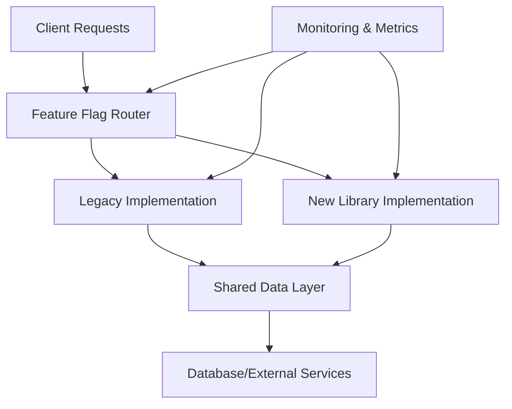
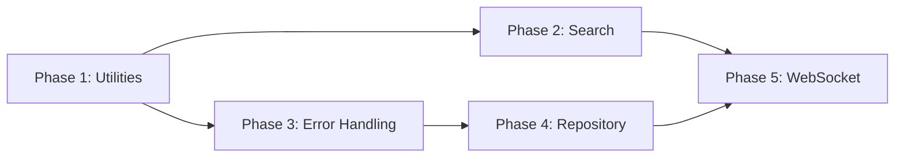

# Design Document

## Overview

This design outlines the systematic migration from custom utility implementations to established, battle-tested libraries across five phases. The migration addresses significant technical debt while maintaining system stability through careful phased rollouts, comprehensive monitoring, and robust rollback mechanisms.

The design prioritizes zero-downtime migration, API compatibility, and measurable performance improvements while reducing maintenance burden and code complexity.

## Architecture

### Migration Architecture Pattern

The migration follows a **Strangler Fig Pattern** where new library-based implementations gradually replace custom solutions:



### Phase Dependencies



## Components and Interfaces

### Phase 1: Utilities Migration

#### Race Condition Prevention
**Current Architecture:**
- Custom `debounce`, `throttle`, `mutex` implementations
- Manual semaphore and concurrency control
- 200+ lines of custom concurrency utilities

**Target Architecture:**
```typescript
// Adapter Pattern for API Compatibility
export class ConcurrencyAdapter {
  private mutex = new Mutex(); // from async-mutex
  private limiter = pLimit(10); // from p-limit
  
  async withLock<T>(fn: () => Promise<T>): Promise<T> {
    return this.mutex.runExclusive(fn);
  }
  
  async withLimit<T>(fn: () => Promise<T>): Promise<T> {
    return this.limiter(fn);
  }
}
```

#### Query Builder Service
**Current:** Custom abstraction over Drizzle ORM
**Target:** Direct Drizzle usage with type safety

### Phase 2: Search System Migration

#### Search Engine Architecture
```typescript
interface SearchEngine {
  search(query: SearchQuery): Promise<SearchResult[]>;
  suggest(query: string): Promise<string[]>;
}

// Fuzzy Search with Fuse.js
export class FuseSearchEngine implements SearchEngine {
  private fuse: Fuse<SearchableItem>;
  
  constructor(items: SearchableItem[]) {
    this.fuse = new Fuse(items, {
      keys: ['title', 'content', 'tags'],
      threshold: 0.3,
      includeScore: true,
      minMatchCharLength: 2
    });
  }
}

// Enhanced PostgreSQL Full-Text
export class PostgreSQLSearchEngine implements SearchEngine {
  async search(query: SearchQuery): Promise<SearchResult[]> {
    return db
      .select({
        id: bills.id,
        title: bills.title,
        rank: sql<number>`ts_rank(search_vector, plainto_tsquery(${query.text}))`
      })
      .from(bills)
      .where(sql`search_vector @@ plainto_tsquery(${query.text})`)
      .orderBy(sql`ts_rank(search_vector, plainto_tsquery(${query.text})) DESC`);
  }
}
```

### Phase 3: Error Handling Migration

#### Error Architecture
```typescript
// Boom + Neverthrow Integration
export class ErrorService {
  static createValidationError(errors: ValidationError[]): Result<never, Boom.Boom> {
    return err(Boom.badRequest('Validation failed', { errors }));
  }
  
  static toStandardResponse(error: Boom.Boom): ErrorResponse {
    return {
      success: false,
      error: {
        id: generateErrorId(),
        code: error.output.payload.error,
        message: error.message,
        category: this.mapToCategory(error),
        retryable: this.isRetryable(error),
        timestamp: new Date().toISOString()
      },
      metadata: {
        requestId: getCurrentRequestId(),
        service: 'legislative-platform'
      }
    };
  }
}
```

### Phase 4: Repository Migration

#### Direct ORM Architecture
```typescript
// Before: Repository Pattern
class UserService {
  constructor(private userRepo: UserRepository) {}
  
  async getUser(id: string): Promise<User | null> {
    return this.userRepo.findById(id);
  }
}

// After: Direct Drizzle Usage
class UserService {
  async getUser(id: string): Promise<User | null> {
    const [result] = await db
      .select()
      .from(users)
      .where(eq(users.id, id))
      .limit(1);
    
    return result ? User.fromRow(result) : null;
  }
}
```

### Phase 5: WebSocket Migration

#### Socket.IO Architecture
```typescript
export class WebSocketService {
  private io: Server;
  private redis: RedisAdapter;
  
  constructor(httpServer: Server) {
    this.io = new Server(httpServer, {
      cors: { origin: process.env.FRONTEND_URL },
      transports: ['websocket', 'polling'],
      pingTimeout: 60000,
      pingInterval: 25000
    });
    
    // Redis adapter for horizontal scaling
    this.io.adapter(createAdapter(redisClient, redisClient.duplicate()));
    
    this.setupEventHandlers();
    this.setupMemoryManagement();
  }
  
  private setupMemoryManagement() {
    setInterval(() => {
      const memUsage = process.memoryUsage();
      if (memUsage.heapUsed / memUsage.heapTotal > 0.85) {
        this.optimizeMemory();
      }
    }, 60000);
  }
}
```

## Data Models

### Migration State Tracking
```typescript
interface MigrationState {
  phase: 1 | 2 | 3 | 4 | 5;
  component: string;
  status: 'not_started' | 'in_progress' | 'testing' | 'rolled_out' | 'completed';
  rolloutPercentage: number;
  startTime: Date;
  completionTime?: Date;
  metrics: {
    errorRate: number;
    responseTime: number;
    memoryUsage: number;
    successRate: number;
  };
  dataValidationCheckpoints: {
    checkpointId: string;
    timestamp: Date;
    status: 'passed' | 'failed' | 'pending';
    validationResults: ValidationResult[];
  }[];
}

interface ValidationResult {
  validator: string;
  passed: boolean;
  message: string;
  dataPoints: number;
  inconsistencies?: any[];
}
```

### Feature Flag Configuration
```typescript
interface FeatureFlag {
  name: string;
  enabled: boolean;
  rolloutPercentage: number;
  conditions?: {
    userIds?: string[];
    userGroups?: string[];
    environment?: string;
  };
  fallbackEnabled: boolean;
}
```

## Error Handling

### Migration Error Scenarios
1. **Library Integration Failures**
   - Fallback to legacy implementation
   - Alert development team
   - Log detailed error context

2. **Performance Degradation**
   - Automatic rollback if response time > 500ms
   - Memory usage monitoring with 85% threshold
   - Connection stability monitoring

3. **Data Consistency Issues**
   - Transaction rollback mechanisms
   - Comprehensive data validation checkpoints between phases
   - Cross-phase data consistency validation
   - Audit logging for all changes with detailed tracking

### Error Recovery Strategies
```typescript
export class MigrationErrorHandler {
  async handleMigrationError(error: MigrationError): Promise<void> {
    switch (error.type) {
      case 'PERFORMANCE_DEGRADATION':
        await this.triggerRollback(error.component);
        break;
      case 'DATA_INCONSISTENCY':
        await this.pauseMigration(error.component);
        await this.validateDataIntegrity();
        break;
      case 'LIBRARY_FAILURE':
        await this.fallbackToLegacy(error.component);
        break;
    }
  }
}
```

## Testing Strategy

### Multi-Level Testing Approach

#### Unit Testing
- Test library integrations in isolation
- Mock external dependencies
- Verify adapter pattern implementations
- Performance benchmarking

#### Integration Testing
```typescript
describe('Migration Integration Tests', () => {
  describe('Phase 1: Utilities', () => {
    it('should maintain API compatibility', async () => {
      const legacyResult = await legacyMutex.withLock(testOperation);
      const newResult = await newMutex.withLock(testOperation);
      expect(newResult).toEqual(legacyResult);
    });
  });
  
  describe('Phase 2: Search', () => {
    it('should improve search relevance', async () => {
      const legacyResults = await legacySearch.search(query);
      const newResults = await fuseSearch.search(query);
      expect(calculateRelevanceScore(newResults)).toBeGreaterThan(
        calculateRelevanceScore(legacyResults)
      );
    });
  });
});
```

#### Load Testing
- Concurrent user simulation (10,000+ connections for WebSocket)
- Memory usage under sustained load
- Response time percentiles (P95, P99)
- Error rate monitoring

#### A/B Testing Framework
```typescript
export class ABTestingService {
  async shouldUseMigration(component: string, userId: string): Promise<boolean> {
    const flag = await this.getFeatureFlag(component);
    if (!flag.enabled) return false;
    
    const userHash = this.hashUser(userId);
    return userHash % 100 < flag.rolloutPercentage;
  }
  
  async trackCohortMetrics(component: string, userId: string, metrics: PerformanceMetrics): Promise<void> {
    const cohort = await this.getUserCohort(userId, component);
    await this.recordCohortMetrics(cohort, metrics);
  }
  
  async calculateStatisticalSignificance(component: string): Promise<SignificanceResult> {
    const controlMetrics = await this.getCohortMetrics(component, 'control');
    const treatmentMetrics = await this.getCohortMetrics(component, 'treatment');
    
    return this.performTTest(controlMetrics, treatmentMetrics);
  }
  
  async getUserBehaviorAnalysis(component: string): Promise<BehaviorAnalysis> {
    return {
      conversionRate: await this.calculateConversionRate(component),
      userSatisfaction: await this.getUserSatisfactionScore(component),
      taskCompletionRate: await this.getTaskCompletionRate(component)
    };
  }
}
```

### Performance Monitoring

#### Key Metrics Dashboard
```typescript
interface PerformanceMetrics {
  responseTime: {
    p50: number;
    p95: number;
    p99: number;
  };
  errorRate: number;
  throughput: number;
  memoryUsage: {
    heapUsed: number;
    heapTotal: number;
    external: number;
  };
  connectionMetrics?: {
    activeConnections: number;
    connectionRate: number;
    disconnectionRate: number;
  };
}
```

#### Automated Alerting
- Error rate > 1% triggers rollback
- Response time > 500ms triggers investigation
- Memory usage > 90% triggers optimization
- Connection drops > 1% triggers WebSocket investigation

### Rollback Mechanisms

#### Instant Rollback Architecture
```typescript
export class RollbackService {
  async triggerRollback(component: string): Promise<void> {
    // 1. Update feature flags
    await this.disableFeatureFlag(component);
    
    // 2. Drain new implementation traffic
    await this.drainTraffic(component);
    
    // 3. Verify legacy system health
    await this.verifyLegacyHealth(component);
    
    // 4. Log rollback event
    await this.logRollbackEvent(component);
    
    // 5. Alert team
    await this.alertTeam(component);
  }
}
```

### Deployment Strategy

#### Blue-Green Deployment for WebSocket
1. **Blue Environment**: Current WebSocket service
2. **Green Environment**: New Socket.IO service
3. **Load Balancer**: Routes traffic based on feature flags
4. **Connection Migration**: Graceful handover of active connections

#### Canary Releases
- Start with 1% traffic to new implementation
- Gradually increase: 1% → 5% → 10% → 25% → 50% → 100%
- Automated rollback if metrics degrade
- Manual approval gates at 25% and 50%

### Documentation and Training

#### Migration Runbooks
- Step-by-step migration procedures with data validation checkpoints
- Comprehensive rollback procedures for each phase with connection preservation
- Troubleshooting guides including A/B testing analysis
- Performance tuning guides with statistical analysis procedures

#### Team Training Materials
- Library-specific documentation with best practices
- Best practices for new implementations and A/B testing frameworks
- Migration lessons learned and post-migration cleanup procedures
- Monitoring and alerting procedures with escalation guidelines

#### Post-Migration Cleanup Procedures
- Systematic legacy code removal with proper archiving
- Long-term monitoring and maintenance schedules
- A/B testing framework documentation for future rollouts
- Performance validation procedures for sustained improvements

This design ensures a safe, measurable, and reversible migration process that maintains system stability while achieving significant improvements in performance, maintainability, and code quality.