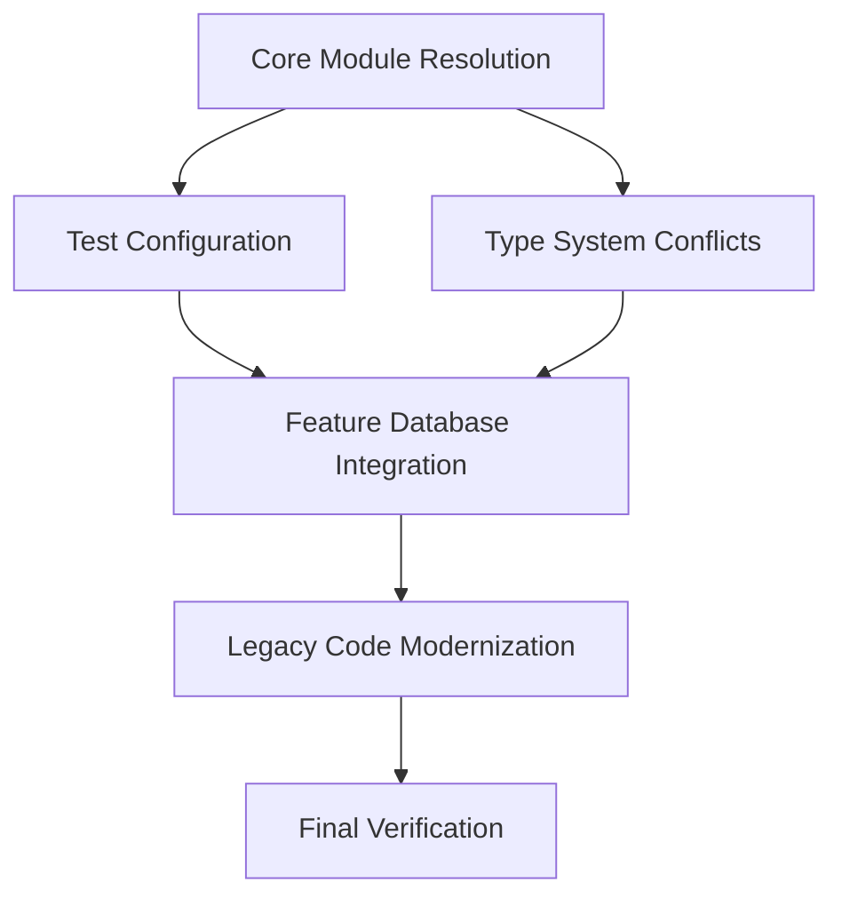

# Design Document

## Overview

This design addresses the systematic resolution of 751 remaining TypeScript errors through a phased approach that prioritizes core infrastructure fixes before addressing feature-specific issues. The design ensures minimal disruption to existing functionality while achieving complete type safety.

## Architecture

### Error Classification System

The remaining errors are categorized into five distinct groups based on impact and dependencies:

1. **Core Module Issues** (150 errors) - Foundation layer affecting all other modules
2. **Test Configuration** (50 errors) - Development and CI/CD pipeline issues  
3. **Type System Conflicts** (50 errors) - Interface and type definition mismatches
4. **Feature Database Integration** (400 errors) - Application functionality issues
5. **Legacy Code** (100 errors) - Technical debt and deprecated patterns

### Dependency Resolution Order



## Components and Interfaces

### 1. Module Resolution Component

**Purpose**: Resolve import/export conflicts in shared/core modules

**Key Interfaces**:
- `ModuleExportResolver` - Handles duplicate export conflicts
- `ImportPathUpdater` - Updates deprecated import paths
- `TypeDefinitionUnifier` - Merges conflicting type definitions

**Implementation Strategy**:
- Use explicit re-exports with aliases for conflicting exports
- Create barrel exports for commonly used modules
- Implement type guards for runtime type checking

### 2. Validation System Unifier

**Purpose**: Resolve ValidationError type conflicts across modules

**Key Interfaces**:
- `UnifiedValidationError` - Single source of truth for validation errors
- `ValidationAdapterInterface` - Consistent interface for all validation adapters
- `ValidationResultMapper` - Maps between different validation result formats

**Implementation Strategy**:
- Create a unified ValidationError interface that satisfies all use cases
- Update all validation adapters to use the unified interface
- Implement adapter pattern for legacy validation code

### 3. Database Integration Layer

**Purpose**: Ensure consistent database access patterns across features

**Key Interfaces**:
- `DatabaseSchemaProvider` - Provides type-safe schema access
- `RepositoryBase<T>` - Base class for all repository implementations
- `QueryBuilder` - Type-safe query construction

**Implementation Strategy**:
- Fix schema import paths to use correct database schema
- Implement consistent error handling across all database operations
- Use generic types for reusable database patterns

### 4. Test Configuration Manager

**Purpose**: Resolve test framework conflicts and missing test modules

**Key Interfaces**:
- `TestConfigurationResolver` - Manages Vitest/Jest compatibility
- `TestModuleProvider` - Creates missing test modules
- `MockDataGenerator` - Provides consistent test data

**Implementation Strategy**:
- Separate test configurations by test type (unit vs integration)
- Create missing schema test files with proper exports
- Implement test utilities that work with both frameworks

## Data Models

### Unified ValidationError Model

```typescript
interface UnifiedValidationError {
  // Core validation interface properties
  field: string;
  message: string;
  code: string;
  value?: unknown;
  context?: Record<string, any>;
  
  // Extended properties for specialized errors
  errors?: ValidationError[];
  errorId?: string;
  statusCode?: number;
  details?: Record<string, any>;
  timestamp?: Date;
  source?: string;
}
```

### Module Export Configuration

```typescript
interface ModuleExportConfig {
  modulePath: string;
  exports: {
    name: string;
    alias?: string;
    type: 'type' | 'value' | 'both';
  }[];
  conflicts: string[];
  resolution: 'alias' | 'explicit' | 'merge';
}
```

### Database Schema Reference

```typescript
interface SchemaReference {
  tableName: string;
  schemaPath: string;
  typeDefinition: string;
  relationships: {
    table: string;
    type: 'oneToMany' | 'manyToOne' | 'manyToMany';
  }[];
}
```

## Error Handling

### Error Resolution Strategy

1. **Compilation Errors**: Fix at source with proper type definitions
2. **Import Errors**: Update import paths and create missing modules
3. **Type Conflicts**: Use type unions and intersection types where appropriate
4. **Interface Mismatches**: Implement adapter patterns for compatibility

### Rollback Strategy

- Maintain git commits for each phase of fixes
- Implement feature flags for major changes
- Keep backup copies of modified interfaces
- Document all breaking changes with migration guides

### Error Monitoring

- Track error count reduction after each phase
- Monitor build time impact of changes
- Verify no runtime regressions introduced
- Maintain compatibility with existing API contracts

## Testing Strategy

### Unit Testing

- Test each fixed module independently
- Verify type safety with TypeScript compiler
- Test error handling paths
- Validate interface compatibility

### Integration Testing

- Test module interactions after fixes
- Verify database operations work correctly
- Test validation system end-to-end
- Validate API response formats

### Regression Testing

- Run existing test suite after each phase
- Monitor application startup and basic functionality
- Test critical user workflows
- Verify performance characteristics maintained

### Type Safety Testing

- Use TypeScript compiler as primary test
- Implement type-level unit tests where appropriate
- Test generic type constraints
- Validate runtime type checking

## Implementation Phases

### Phase 1: Core Infrastructure (Priority 1)
- Fix shared/core module export conflicts
- Resolve import path issues
- Unify validation type definitions
- Update core interface implementations

### Phase 2: Development Infrastructure (Priority 2)  
- Fix test configuration conflicts
- Create missing test modules
- Update test utilities and mocks
- Resolve legacy adapter issues

### Phase 3: Feature Integration (Priority 3)
- Fix database schema imports
- Update repository implementations
- Fix API response formatting
- Resolve feature-specific type issues

### Phase 4: Cleanup and Verification (Priority 4)
- Remove deprecated code patterns
- Update documentation
- Verify zero TypeScript errors
- Performance and regression testing

## Performance Considerations

- Minimize impact on build times
- Avoid runtime overhead from type checking
- Use efficient import patterns
- Optimize module bundling

## Security Considerations

- Maintain type safety for security-critical operations
- Validate input types at runtime boundaries
- Ensure error messages don't leak sensitive information
- Preserve existing authentication and authorization patterns