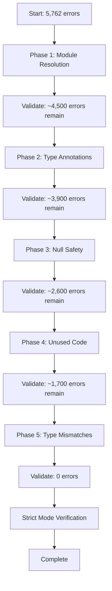

# Design Document: Server TypeScript Errors Remediation

## Overview

This design outlines a systematic approach to remediating 5,762 TypeScript compilation errors in the server codebase. The strategy prioritizes errors by category, starting with foundational issues (module resolution) and progressing through type safety concerns (annotations, null checks) to code quality improvements (unused code, type mismatches).

The remediation follows a phased approach where each category of errors is addressed in dependency order, ensuring that fixes in earlier phases don't create cascading issues in later phases. The goal is to achieve zero TypeScript errors with strict mode enabled while preserving all existing functionality.

## Architecture

### Error Categorization System

Errors are grouped into five major categories based on their impact and dependencies:

1. **Foundation Layer** (Module Resolution)
   - TS2307: Cannot find module
   - TS2305: Module has no exported member
   - TS2614: Module has no default export
   - TS2724: Module has no exported member and no default export
   - Total: ~1,200 errors

2. **Type Safety Layer** (Type Annotations)
   - TS7006: Parameter implicitly has 'any' type
   - TS7031: Binding element implicitly has 'any' type
   - TS7053: Element implicitly has 'any' type
   - Total: ~600 errors

3. **Null Safety Layer** (Strict Null Checks)
   - TS18046: 'value' is possibly 'undefined'
   - TS18048: 'value' is possibly 'undefined'
   - TS2532: Object is possibly 'undefined'
   - Total: ~1,300 errors

4. **Code Quality Layer** (Unused Code)
   - TS6133: Variable declared but never used
   - TS6138: Property declared but never used
   - Total: ~900 errors

5. **Type Correctness Layer** (Type Mismatches)
   - TS2339: Property does not exist on type
   - TS2322: Type is not assignable to type
   - TS2345: Argument type not assignable to parameter
   - TS2304: Cannot find name
   - Total: ~1,700 errors

### Remediation Pipeline



## Components and Interfaces

### 1. Error Analysis Service

**Purpose**: Analyze TypeScript compilation output and categorize errors

**Interface**:
```typescript
interface ErrorAnalysisService {
  // Parse tsc output and extract error information
  parseCompilerOutput(output: string): CompilationError[];
  
  // Group errors by category
  categorizeErrors(errors: CompilationError[]): ErrorsByCategory;
  
  // Identify error dependencies (which errors block others)
  analyzeErrorDependencies(errors: CompilationError[]): ErrorDependencyGraph;
  
  // Generate remediation priority order
  prioritizeErrors(categories: ErrorsByCategory): RemediationPlan;
}

interface CompilationError {
  code: string;           // e.g., "TS2307"
  file: string;           // File path
  line: number;           // Line number
  column: number;         // Column number
  message: string;        // Error message
  category: ErrorCategory;
}

interface ErrorsByCategory {
  moduleResolution: CompilationError[];
  typeAnnotations: CompilationError[];
  nullSafety: CompilationError[];
  unusedCode: CompilationError[];
  typeMismatches: CompilationError[];
  other: CompilationError[];
}

type ErrorCategory = 
  | 'moduleResolution'
  | 'typeAnnotations'
  | 'nullSafety'
  | 'unusedCode'
  | 'typeMismatches'
  | 'other';
```

### 2. Module Resolution Fixer

**Purpose**: Fix module import and export errors

**Interface**:
```typescript
interface ModuleResolutionFixer {
  // Fix missing module imports
  fixMissingImport(error: CompilationError): FixResult;
  
  // Fix missing exported members
  fixMissingExport(error: CompilationError): FixResult;
  
  // Resolve circular dependencies
  breakCircularDependency(cycle: string[]): FixResult;
  
  // Update import paths
  updateImportPath(oldPath: string, newPath: string): FixResult;
}

interface FixResult {
  success: boolean;
  filesModified: string[];
  errorsFixed: number;
  newErrors: number;
  description: string;
}
```

**Strategies**:
- Scan for missing module files and create stubs if needed
- Add missing exports to existing modules
- Extract interfaces to break circular dependencies
- Update tsconfig paths for module resolution
- Convert relative imports to absolute where appropriate

### 3. Type Annotation Fixer

**Purpose**: Add explicit type annotations to parameters and variables

**Interface**:
```typescript
interface TypeAnnotationFixer {
  // Infer and add parameter types
  addParameterType(error: CompilationError): FixResult;
  
  // Infer and add return types
  addReturnType(error: CompilationError): FixResult;
  
  // Add index signatures for dynamic access
  addIndexSignature(error: CompilationError): FixResult;
  
  // Add type guards for narrowing
  addTypeGuard(error: CompilationError): FixResult;
}
```

**Strategies**:
- Use TypeScript's type inference to determine appropriate types
- Add explicit types based on usage patterns
- Create union types for variables with multiple possible types
- Add generic constraints where needed
- Use 'unknown' instead of 'any' when type is truly unknown

### 4. Null Safety Fixer

**Purpose**: Add null and undefined checks throughout the codebase

**Interface**:
```typescript
interface NullSafetyFixer {
  // Add optional chaining
  addOptionalChaining(error: CompilationError): FixResult;
  
  // Add nullish coalescing
  addNullishCoalescing(error: CompilationError): FixResult;
  
  // Add explicit null checks
  addNullCheck(error: CompilationError): FixResult;
  
  // Add type guards for undefined
  addUndefinedGuard(error: CompilationError): FixResult;
}
```

**Strategies**:
- Use optional chaining (?.) for property access on potentially undefined values
- Use nullish coalescing (??) for default values
- Add explicit if checks for null/undefined before usage
- Use non-null assertion (!) only when absolutely certain value exists
- Refactor functions to return non-nullable types where possible

### 5. Unused Code Remover

**Purpose**: Remove unused variables, imports, and parameters

**Interface**:
```typescript
interface UnusedCodeRemover {
  // Remove unused imports
  removeUnusedImport(error: CompilationError): FixResult;
  
  // Remove unused variables
  removeUnusedVariable(error: CompilationError): FixResult;
  
  // Handle unused parameters (remove or prefix with _)
  handleUnusedParameter(error: CompilationError): FixResult;
  
  // Remove unused properties
  removeUnusedProperty(error: CompilationError): FixResult;
}
```

**Strategies**:
- Remove unused imports automatically
- Remove unused local variables
- Prefix unused parameters with underscore if they're part of an interface
- Remove unused parameters if they're trailing parameters
- Document why parameters are kept if they're required by interface

### 6. Type Mismatch Fixer

**Purpose**: Resolve type incompatibilities and property access errors

**Interface**:
```typescript
interface TypeMismatchFixer {
  // Fix property access on wrong type
  fixPropertyAccess(error: CompilationError): FixResult;
  
  // Fix type assignment mismatches
  fixTypeAssignment(error: CompilationError): FixResult;
  
  // Fix function argument mismatches
  fixArgumentType(error: CompilationError): FixResult;
  
  // Resolve undefined name references
  resolveUndefinedName(error: CompilationError): FixResult;
}
```

**Strategies**:
- Add type guards to narrow types before property access
- Use type assertions when type is known but compiler can't infer
- Add missing properties to type definitions
- Convert types to match expected signatures
- Import missing type definitions

### 7. Validation Service

**Purpose**: Validate fixes and track progress

**Interface**:
```typescript
interface ValidationService {
  // Run TypeScript compiler and collect errors
  compileAndCollectErrors(): CompilationError[];
  
  // Compare error counts before and after fixes
  compareErrorCounts(before: ErrorsByCategory, after: ErrorsByCategory): ProgressReport;
  
  // Verify no new errors introduced
  detectRegressions(baseline: CompilationError[], current: CompilationError[]): CompilationError[];
  
  // Generate progress report
  generateProgressReport(phase: string, errors: ErrorsByCategory): ProgressReport;
}

interface ProgressReport {
  phase: string;
  totalErrorsBefore: number;
  totalErrorsAfter: number;
  errorsFixed: number;
  newErrors: number;
  errorsByCategory: ErrorsByCategory;
  timestamp: Date;
}
```

## Data Models

### CompilationError

```typescript
interface CompilationError {
  code: string;           // Error code (e.g., "TS2307")
  file: string;           // Absolute file path
  line: number;           // Line number (1-indexed)
  column: number;         // Column number (1-indexed)
  message: string;        // Full error message
  category: ErrorCategory; // Categorized error type
  severity: 'error' | 'warning';
  context?: string;       // Surrounding code context
}
```

### RemediationPlan

```typescript
interface RemediationPlan {
  phases: RemediationPhase[];
  totalErrors: number;
  estimatedDuration: string;
}

interface RemediationPhase {
  name: string;
  category: ErrorCategory;
  errors: CompilationError[];
  priority: number;
  dependencies: string[];  // Phase names this depends on
  strategy: string;
}
```

### FixResult

```typescript
interface FixResult {
  success: boolean;
  filesModified: string[];
  errorsFixed: number;
  newErrors: number;
  description: string;
  changes?: CodeChange[];
}

interface CodeChange {
  file: string;
  lineStart: number;
  lineEnd: number;
  oldCode: string;
  newCode: string;
  reason: string;
}
```


## Correctness Properties

A property is a characteristic or behavior that should hold true across all valid executions of a system—essentially, a formal statement about what the system should do. Properties serve as the bridge between human-readable specifications and machine-verifiable correctness guarantees.

Based on the acceptance criteria analysis, this remediation project has specific compilation goals that can be verified through automated testing. Most criteria are examples of specific states the codebase should reach (zero errors of specific types), which we validate through compilation tests.

### Property 1: Module Resolution Completeness

*For any* TypeScript compilation of the server codebase after Phase 1 completion, the compiler SHALL report zero module resolution errors (TS2307, TS2305, TS2614, TS2724).

**Validates: Requirements 1.4, 1.5, 1.6, 1.7**

### Property 2: Type Annotation Completeness

*For any* TypeScript compilation of the server codebase after Phase 2 completion, the compiler SHALL report zero implicit any type errors (TS7006, TS7031, TS7053).

**Validates: Requirements 2.4, 2.5, 2.6**

### Property 3: Null Safety Completeness

*For any* TypeScript compilation of the server codebase with strictNullChecks enabled after Phase 3 completion, the compiler SHALL report zero possibly undefined errors (TS18046, TS18048, TS2532).

**Validates: Requirements 3.5, 3.6, 3.7**

### Property 4: Unused Code Elimination

*For any* TypeScript compilation of the server codebase after Phase 4 completion, the compiler SHALL report zero unused declaration errors (TS6133, TS6138).

**Validates: Requirements 4.4, 4.5**

### Property 5: Type Correctness Completeness

*For any* TypeScript compilation of the server codebase after Phase 5 completion, the compiler SHALL report zero type mismatch errors (TS2339, TS2322, TS2345, TS2304).

**Validates: Requirements 5.5, 5.6, 5.7, 6.4**

### Property 6: Strict Mode Compliance

*For any* TypeScript compilation of the server codebase with all strict mode flags enabled (strictNullChecks, strictFunctionTypes, strictBindCallApply, strictPropertyInitialization, noImplicitAny, noImplicitThis), the compiler SHALL report zero errors and exit with code 0.

**Validates: Requirements 8.1, 8.2, 8.3, 8.4, 8.5, 8.6, 8.7**

## Error Handling

### Compilation Failures

**Strategy**: If compilation fails during validation, the system should:
1. Parse the compiler output to extract all errors
2. Categorize errors by type
3. Identify which phase introduced new errors
4. Roll back changes if regressions are detected
5. Report detailed error information for manual review

### Fix Application Failures

**Strategy**: If a fix cannot be applied automatically:
1. Log the error with full context
2. Mark the error for manual review
3. Continue with other fixable errors
4. Generate a report of errors requiring manual intervention

### Circular Dependency Detection

**Strategy**: When circular dependencies are detected:
1. Analyze the dependency graph to identify the cycle
2. Identify the weakest link (least coupled modules)
3. Extract shared interfaces or types to a common module
4. Update imports to break the cycle
5. Validate that the cycle is broken

### Type Inference Failures

**Strategy**: When type cannot be inferred automatically:
1. Use 'unknown' type instead of 'any' as a safe default
2. Add a TODO comment explaining why manual review is needed
3. Log the location for manual type annotation
4. Continue with other fixes

### Regression Detection

**Strategy**: If new errors are introduced:
1. Compare error counts before and after each phase
2. Identify files with new errors
3. Analyze if new errors are related to fixes
4. Decide whether to:
   - Fix new errors immediately
   - Roll back problematic changes
   - Accept new errors if they reveal real issues

## Testing Strategy

This remediation project uses a dual testing approach combining compilation validation with unit tests:

### Compilation Tests (Primary Validation)

Each phase completion is validated through TypeScript compilation tests that verify zero errors of specific types. These tests run the TypeScript compiler with appropriate flags and parse the output to count errors by category.

**Test Configuration**:
- Use `tsc --noEmit` to check types without generating output
- Parse compiler output to extract error codes and counts
- Group errors by category for phase-specific validation
- Run after each batch of fixes to catch regressions early

**Example Test Structure**:
```typescript
describe('Phase 1: Module Resolution', () => {
  it('should have zero module resolution errors', () => {
    const errors = compileAndCollectErrors();
    const moduleErrors = errors.filter(e => 
      ['TS2307', 'TS2305', 'TS2614', 'TS2724'].includes(e.code)
    );
    expect(moduleErrors).toHaveLength(0);
  });
});
```

### Unit Tests (Supplementary Validation)

Unit tests verify specific fix strategies and helper functions work correctly:

- **Error Parser Tests**: Verify compiler output parsing is accurate
- **Fix Strategy Tests**: Verify individual fix strategies produce correct code
- **Validation Tests**: Verify error categorization and counting logic
- **Regression Tests**: Verify fixes don't break existing functionality

**Test Coverage Goals**:
- Error analysis and categorization logic: 100%
- Fix application logic: 80%
- Validation and reporting logic: 100%

### Integration Tests

Integration tests verify the end-to-end remediation pipeline:

- Run full phase on a small test codebase
- Verify error counts decrease as expected
- Verify no regressions are introduced
- Verify progress reporting is accurate

### Property-Based Testing

While most validation is done through compilation tests (which are deterministic), we can use property-based testing for fix strategies:

**Property Test Example**:
```typescript
// Property: Adding null checks should not change runtime behavior for non-null values
test('null check addition preserves behavior for defined values', () => {
  fc.assert(
    fc.property(fc.anything().filter(x => x !== null && x !== undefined), (value) => {
      const original = accessProperty(value);
      const withNullCheck = accessPropertySafely(value);
      expect(withNullCheck).toEqual(original);
    })
  );
});
```

**Testing Library**: Use `fast-check` for TypeScript property-based testing

**Test Configuration**: Minimum 100 iterations per property test

**Test Tagging**: Each property test references its design property:
```typescript
// Feature: server-typescript-errors-remediation, Property 3: Null Safety Completeness
```

### Validation Checkpoints

After each phase:
1. Run full TypeScript compilation
2. Count errors by category
3. Verify expected error reduction
4. Run existing test suite to catch regressions
5. Generate progress report
6. Get user confirmation before proceeding

### Continuous Validation

During remediation:
- Run compilation after every 50-100 fixes
- Monitor for new errors introduced
- Track progress metrics (errors fixed per hour)
- Maintain error baseline for comparison
