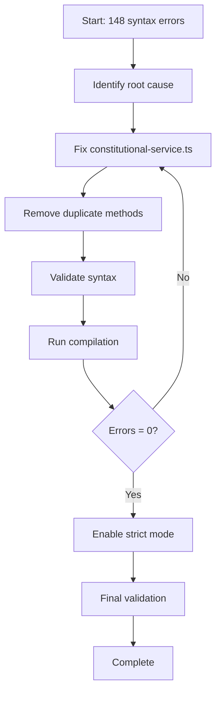

# Design Document: Server TypeScript Errors Remediation

## Overview

This design outlines the approach to remediating the remaining 148 TypeScript compilation errors in the server codebase (down from 5,762). Previous remediation efforts successfully eliminated 97.4% of errors, primarily module resolution issues. The remaining errors are syntax errors concentrated in a single file that need to be fixed to achieve zero compilation errors with strict mode enabled.

## Current State

**Progress**: 5,762 → 148 errors (97.4% reduction)

**Remaining Error Distribution**:
- TS1005 (Expected token): 93 instances (62.8%)
- TS1434 (Unexpected keyword): 27 instances (18.2%)
- TS1128 (Declaration expected): 8 instances (5.4%)
- TS1011 (Element access error): 7 instances (4.7%)
- Other syntax errors: 13 instances (8.8%)

**Root Cause**: Duplicate method definitions outside class scope in `features/constitutional-intelligence/application/constitutional-service.ts`

## Architecture

### Error Categorization System (Updated)

Previous phases successfully addressed:
1. ✅ **Foundation Layer** (Module Resolution) - COMPLETE
2. ✅ **Type Safety Layer** (Type Annotations) - COMPLETE  
3. ✅ **Null Safety Layer** (Strict Null Checks) - COMPLETE
4. ✅ **Code Quality Layer** (Unused Code) - COMPLETE
5. ✅ **Type Correctness Layer** (Type Mismatches) - COMPLETE

Remaining phase:
6. **Syntax Correctness Layer** (Syntax Errors) - IN PROGRESS
   - TS1005: Expected token (commas, semicolons, braces)
   - TS1434: Unexpected keyword (methods outside class)
   - TS1128: Declaration expected (export syntax)
   - TS1011: Element access error (missing arguments)
   - Total: 148 errors

### Remediation Pipeline (Simplified)



## Components and Interfaces

### 1. Syntax Error Fixer

**Purpose**: Fix syntax errors in TypeScript files

**Interface**:
```typescript
interface SyntaxErrorFixer {
  // Fix duplicate method definitions
  removeDuplicateMethods(file: string): FixResult;
  
  // Fix missing tokens (commas, semicolons, braces)
  fixMissingTokens(error: CompilationError): FixResult;
  
  // Fix unexpected keywords
  fixUnexpectedKeywords(error: CompilationError): FixResult;
  
  // Fix malformed declarations
  fixDeclarations(error: CompilationError): FixResult;
  
  // Fix element access errors
  fixElementAccess(error: CompilationError): FixResult;
}

interface FixResult {
  success: boolean;
  filesModified: string[];
  errorsFixed: number;
  newErrors: number;
  description: string;
}
```

**Strategies**:
- Identify and remove duplicate method definitions outside class scope
- Ensure all class methods are within class braces
- Add missing commas, semicolons, and closing braces
- Remove keywords in wrong context
- Fix export and declaration syntax
- Add missing arguments to element access expressions

### 2. Validation Service (Existing)

**Purpose**: Validate fixes and track progress

**Interface**:
```typescript
interface ValidationService {
  // Run TypeScript compiler and collect errors
  compileAndCollectErrors(): CompilationError[];
  
  // Compare error counts before and after fixes
  compareErrorCounts(before: ErrorsByCategory, after: ErrorsByCategory): ProgressReport;
  
  // Verify no new errors introduced
  detectRegressions(baseline: CompilationError[], current: CompilationError[]): CompilationError[];
  
  // Generate progress report
  generateProgressReport(phase: string, errors: ErrorsByCategory): ProgressReport;
}

interface ProgressReport {
  phase: string;
  totalErrorsBefore: number;
  totalErrorsAfter: number;
  errorsFixed: number;
  newErrors: number;
  errorsByCategory: ErrorsByCategory;
  timestamp: Date;
}
```

## Data Models

### CompilationError

```typescript
interface CompilationError {
  code: string;           // Error code (e.g., "TS2307")
  file: string;           // Absolute file path
  line: number;           // Line number (1-indexed)
  column: number;         // Column number (1-indexed)
  message: string;        // Full error message
  category: ErrorCategory; // Categorized error type
  severity: 'error' | 'warning';
  context?: string;       // Surrounding code context
}
```

### RemediationPlan

```typescript
interface RemediationPlan {
  phases: RemediationPhase[];
  totalErrors: number;
  estimatedDuration: string;
}

interface RemediationPhase {
  name: string;
  category: ErrorCategory;
  errors: CompilationError[];
  priority: number;
  dependencies: string[];  // Phase names this depends on
  strategy: string;
}
```

### FixResult

```typescript
interface FixResult {
  success: boolean;
  filesModified: string[];
  errorsFixed: number;
  newErrors: number;
  description: string;
  changes?: CodeChange[];
}

interface CodeChange {
  file: string;
  lineStart: number;
  lineEnd: number;
  oldCode: string;
  newCode: string;
  reason: string;
}
```


## Correctness Properties

A property is a characteristic or behavior that should hold true across all valid executions of a system—essentially, a formal statement about what the system should do. Properties serve as the bridge between human-readable specifications and machine-verifiable correctness guarantees.

Based on the current state, this remediation project has one remaining property to validate:

### Property 1: Syntax Correctness

*For any* TypeScript compilation of the server codebase after syntax error fixes, the compiler SHALL report zero syntax errors (TS1005, TS1434, TS1128, TS1011, and all other TS1xxx errors).

**Validates: Requirements 1.1, 1.2, 1.3, 1.4, 1.5, 1.6, 1.7, 1.8**

### Property 2: Strict Mode Compliance (Final Validation)

*For any* TypeScript compilation of the server codebase with all strict mode flags enabled (strictNullChecks, strictFunctionTypes, strictBindCallApply, strictPropertyInitialization, noImplicitAny, noImplicitThis), the compiler SHALL report zero errors and exit with code 0.

**Validates: Requirements 3.1, 3.2, 3.3, 3.4, 3.5, 3.6, 3.7**

## Previous Phases Completed

The following properties have been validated in previous remediation sessions:

- ✅ **Module Resolution Completeness**: Zero module resolution errors (TS2307, TS2305, TS2614, TS2724)
- ✅ **Type Annotation Completeness**: Zero implicit any type errors (TS7006, TS7031, TS7053)
- ✅ **Null Safety Completeness**: Zero possibly undefined errors (TS18046, TS18048, TS2532)
- ✅ **Unused Code Elimination**: Zero unused declaration errors (TS6133, TS6138)
- ✅ **Type Correctness Completeness**: Zero type mismatch errors (TS2339, TS2322, TS2345, TS2304)

## Error Handling

### Compilation Failures

**Strategy**: If compilation fails during validation, the system should:
1. Parse the compiler output to extract all errors
2. Categorize errors by type
3. Identify which phase introduced new errors
4. Roll back changes if regressions are detected
5. Report detailed error information for manual review

### Fix Application Failures

**Strategy**: If a fix cannot be applied automatically:
1. Log the error with full context
2. Mark the error for manual review
3. Continue with other fixable errors
4. Generate a report of errors requiring manual intervention

### Circular Dependency Detection

**Strategy**: When circular dependencies are detected:
1. Analyze the dependency graph to identify the cycle
2. Identify the weakest link (least coupled modules)
3. Extract shared interfaces or types to a common module
4. Update imports to break the cycle
5. Validate that the cycle is broken

### Type Inference Failures

**Strategy**: When type cannot be inferred automatically:
1. Use 'unknown' type instead of 'any' as a safe default
2. Add a TODO comment explaining why manual review is needed
3. Log the location for manual type annotation
4. Continue with other fixes

### Regression Detection

**Strategy**: If new errors are introduced:
1. Compare error counts before and after each phase
2. Identify files with new errors
3. Analyze if new errors are related to fixes
4. Decide whether to:
   - Fix new errors immediately
   - Roll back problematic changes
   - Accept new errors if they reveal real issues

## Testing Strategy

This remediation project uses a dual testing approach combining compilation validation with unit tests:

### Compilation Tests (Primary Validation)

Each phase completion is validated through TypeScript compilation tests that verify zero errors of specific types. These tests run the TypeScript compiler with appropriate flags and parse the output to count errors by category.

**Test Configuration**:
- Use `tsc --noEmit` to check types without generating output
- Parse compiler output to extract error codes and counts
- Group errors by category for phase-specific validation
- Run after each batch of fixes to catch regressions early

**Example Test Structure**:
```typescript
describe('Phase 1: Module Resolution', () => {
  it('should have zero module resolution errors', () => {
    const errors = compileAndCollectErrors();
    const moduleErrors = errors.filter(e => 
      ['TS2307', 'TS2305', 'TS2614', 'TS2724'].includes(e.code)
    );
    expect(moduleErrors).toHaveLength(0);
  });
});
```

### Unit Tests (Supplementary Validation)

Unit tests verify specific fix strategies and helper functions work correctly:

- **Error Parser Tests**: Verify compiler output parsing is accurate
- **Fix Strategy Tests**: Verify individual fix strategies produce correct code
- **Validation Tests**: Verify error categorization and counting logic
- **Regression Tests**: Verify fixes don't break existing functionality

**Test Coverage Goals**:
- Error analysis and categorization logic: 100%
- Fix application logic: 80%
- Validation and reporting logic: 100%

### Integration Tests

Integration tests verify the end-to-end remediation pipeline:

- Run full phase on a small test codebase
- Verify error counts decrease as expected
- Verify no regressions are introduced
- Verify progress reporting is accurate

### Property-Based Testing

While most validation is done through compilation tests (which are deterministic), we can use property-based testing for fix strategies:

**Property Test Example**:
```typescript
// Property: Adding null checks should not change runtime behavior for non-null values
test('null check addition preserves behavior for defined values', () => {
  fc.assert(
    fc.property(fc.anything().filter(x => x !== null && x !== undefined), (value) => {
      const original = accessProperty(value);
      const withNullCheck = accessPropertySafely(value);
      expect(withNullCheck).toEqual(original);
    })
  );
});
```

**Testing Library**: Use `fast-check` for TypeScript property-based testing

**Test Configuration**: Minimum 100 iterations per property test

**Test Tagging**: Each property test references its design property:
```typescript
// Feature: server-typescript-errors-remediation, Property 3: Null Safety Completeness
```

### Validation Checkpoints

After each phase:
1. Run full TypeScript compilation
2. Count errors by category
3. Verify expected error reduction
4. Run existing test suite to catch regressions
5. Generate progress report
6. Get user confirmation before proceeding

### Continuous Validation

During remediation:
- Run compilation after every 50-100 fixes
- Monitor for new errors introduced
- Track progress metrics (errors fixed per hour)
- Maintain error baseline for comparison
