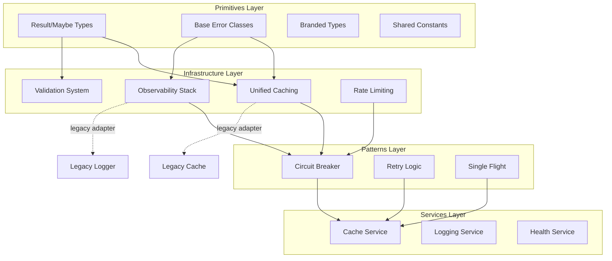

# Shared Core Refinement Design

## Overview

This design establishes a clear, four-layer architecture for shared/core that addresses the organic growth challenges. The architecture flows from primitives at the foundation through infrastructure, patterns, and services layers, with each layer depending only on layers below it.

## Architecture

The system follows a layered architecture:

1. **Primitives Layer**: Pure, framework-agnostic types and errors (Result, Maybe, BaseError, branded types)
2. **Infrastructure Layer**: Unified caching, observability, validation, and rate limiting with consistent interfaces
3. **Patterns Layer**: Reusable design patterns like circuit breakers and retry logic
4. **Services Layer**: High-level abstractions that orchestrate infrastructure and patterns



## Components and Interfaces

### Unified Cache System

The cache system consolidates multiple implementations into a single, coherent interface:

```typescript
interface CacheAdapter {
  // Primary cache operations
  get<T>(key: string): Promise<Result<T | null>>;
  set<T>(key: string, value: T, ttl?: number): Promise<Result<void>>;
  delete(key: string): Promise<Result<void>>;
  clear(): Promise<Result<void>>;
  exists(key: string): Promise<Result<boolean>>;
  
  // Lifecycle management
  initialize(): Promise<Result<void>>;
  healthCheck(): Promise<HealthStatus>;
  shutdown(): Promise<Result<void>>;
  
  // Observability integration
  getMetrics(): CacheMetrics;
}

interface CacheFactory {
  createMemoryCache(config: MemoryCacheConfig): CacheAdapter;
  createRedisCache(config: RedisCacheConfig): CacheAdapter;
  createMultiTierCache(config: MultiTierConfig): CacheAdapter;
  createAICache(config: AICacheConfig): CacheAdapter;
  
  getRegisteredCaches(): CacheAdapter[];
  shutdownAll(): Promise<Result<void>>;
}
```

### Middleware Factory

The unified middleware factory consolidates factory.ts, enhanced-factory.ts, and unified.ts:

```typescript
interface MiddlewareFactory {
  createAuth(config: AuthConfig): MiddlewareFunction;
  createRateLimit(config: RateLimitConfig): MiddlewareFunction;
  createValidation(config: ValidationConfig): MiddlewareFunction;
  createErrorHandler(config: ErrorHandlerConfig): MiddlewareFunction;
  createCache(config: CacheMiddlewareConfig): MiddlewareFunction;
  
  registerProvider(name: string, provider: MiddlewareProvider): void;
  setServiceContainer(container: ServiceContainer): void;
}

interface ServiceContainer {
  getLogger(): Logger;
  getMetrics(): MetricsCollector;
  getCache(): CacheAdapter;
  getConfig(): ConfigManager;
}
```

### Observability Stack

The observability stack coordinates all signals with automatic correlation ID propagation:

```typescript
class ObservabilityStack {
  constructor(config: ObservabilityConfig);
  
  async initialize(): Promise<Result<void>>;
  
  getLogger(): Logger;
  getMetrics(): MetricsCollector;
  getTracer(): Tracer;
  getHealth(): HealthChecker;
  
  startRequest(): CorrelationContext;
  getCorrelationId(): string;
  
  async shutdown(): Promise<Result<void>>;
}

interface HealthChecker {
  registerCheck(name: string, check: HealthCheck): void;
  checkHealth(): Promise<AggregatedHealth>;
  disableCheck(name: string): void;
  enableCheck(name: string): void;
}
```

### Error Management

The error hierarchy ensures consistent error handling:

```typescript
class BaseError extends Error {
  constructor(
    message: string,
    public statusCode: number,
    public errorCode: string,
    public metadata: Record<string, unknown> = {},
    public isRetryable: boolean = false
  );
  
  toJSON(): ErrorResponse;
}

class ValidationError extends BaseError {
  constructor(message: string, public validationErrors: ValidationErrorDetail[]);
}

class DatabaseError extends BaseError {
  constructor(message: string, public query: string, public originalError: Error);
}
```

## Data Models

### Cache Configuration

```typescript
interface BaseCacheConfig {
  name: string;
  ttl: number;
  maxSize?: number;
  evictionPolicy?: 'lru' | 'lfu' | 'fifo';
}

interface MemoryCacheConfig extends BaseCacheConfig {
  type: 'memory';
}

interface RedisCacheConfig extends BaseCacheConfig {
  type: 'redis';
  host: string;
  port: number;
  password?: string;
  db?: number;
  keyPrefix?: string;
}

interface MultiTierConfig extends BaseCacheConfig {
  type: 'multi-tier';
  tiers: Array<MemoryCacheConfig | RedisCacheConfig>;
  writeThrough: boolean;
}
```

### Observability Configuration

```typescript
interface ObservabilityConfig {
  logging: {
    level: 'debug' | 'info' | 'warn' | 'error';
    format: 'json' | 'pretty';
    destination: 'stdout' | 'file' | 'both';
  };
  
  metrics: {
    prefix: string;
    enabled: boolean;
    exportInterval?: number;
    exporters?: Array<'prometheus' | 'statsd' | 'cloudwatch'>;
  };
  
  tracing: {
    enabled: boolean;
    serviceName: string;
    samplingRate: number;
    exporters?: Array<'jaeger' | 'zipkin' | 'otlp'>;
  };
  
  health: {
    enabled: boolean;
    checkInterval: number;
    cacheTTL: number;
    checks: Record<string, HealthCheckConfig>;
  };
}
```

## Error Handling

All components use the Result type for explicit error handling:

```typescript
type Result<T> = Success<T> | Error<BaseError>;

interface Success<T> {
  isSuccess(): true;
  isError(): false;
  value: T;
}

interface Error<E> {
  isSuccess(): false;
  isError(): true;
  error: E;
}
```

This eliminates thrown exceptions in favor of explicit error handling, making error paths visible in the type system.

## Testing Strategy

### Unit Testing
- Each component has focused unit tests verifying behavior in isolation
- 100% test coverage for all primitives and core interfaces
- Property-based testing for Result and Maybe combinators

### Integration Testing
- Components work together correctly
- Correlation ID propagation across all signals
- Legacy adapter behavioral equivalence

### Performance Testing
- Cache adapters meet 10k+ operations per second
- No regression in request latencies
- Memory usage within current limits
- Health checks complete under 100ms

### Migration Testing
- Validation tools compare old vs new implementations
- Feature flags enable controlled rollout
- Behavioral equivalence verification

## Migration Strategy

### Legacy Adapter Pattern

Legacy adapters bridge old interfaces to new implementations:

```typescript
class LegacyCacheAdapter {
  constructor(private modernCache: CacheAdapter) {}
  
  async getValue(key: string): Promise<any> {
    const result = await this.modernCache.get(key);
    if (result.isError()) throw result.error;
    return result.value;
  }
}
```

### Feature Flag Integration

Feature flags enable controlled rollout:

```typescript
function getCacheService(flags: FeatureFlags): CacheAdapter {
  if (flags.useModernCache) {
    return cacheFactory.createRedisCache(config);
  } else {
    return legacyCacheService;
  }
}
```

### Deprecation Warnings

Structured warnings guide migration:

```typescript
function deprecate(featureName: string, sunsetDate: Date, alternative: string): void {
  logger.warn('Deprecated feature used', {
    feature: featureName,
    sunsetDate: sunsetDate.toISOString(),
    alternative,
    stackTrace: new Error().stack
  });
}
```

## Implementation Phases

1. **Foundation (Weeks 1-2)**: Primitives layer and interfaces
2. **Core Infrastructure (Weeks 3-5)**: Cache system and middleware factory
3. **Observability & Validation (Weeks 6-7)**: Complete observability stack
4. **Migration & Cleanup (Weeks 8-10)**: Service migration and legacy removal

## Success Criteria

- Code duplication reduced by 50%+
- Developer velocity increased by 30%
- System reliability improved with fewer bugs
- Test coverage reaches 90%+
- Performance maintains current baselines
- All services successfully migrated