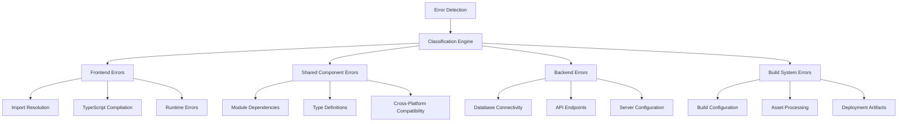

# Design Document

## Overview

This design document outlines a systematic approach to identifying and fixing all errors in the Chanuka Legislative Transparency Platform codebase. The strategy follows a layered approach: frontend → shared components → backend, ensuring dependencies are resolved in the correct order and preventing cascading failures.

## Architecture

### Error Detection and Classification System

The systematic error fixing process is built around a multi-layered detection and classification system:



### Processing Pipeline

The error fixing process follows a structured pipeline:

1. **Discovery Phase**: Automated scanning and manual inspection
2. **Classification Phase**: Categorizing errors by type, severity, and dependencies
3. **Prioritization Phase**: Ordering fixes based on dependency chains
4. **Resolution Phase**: Systematic fixing with validation
5. **Verification Phase**: Comprehensive testing and validation

## Components and Interfaces

### Error Detection Engine

**Purpose**: Automatically discover and catalog all errors in the codebase

**Key Components**:
- TypeScript compiler integration for compilation errors
- ESLint integration for code quality issues
- Build system monitoring for build failures
- Runtime error tracking for execution issues
- Test runner integration for test failures

**Interface**:
```typescript
interface ErrorDetectionEngine {
  scanCodebase(): Promise<ErrorReport[]>
  classifyErrors(errors: ErrorReport[]): ClassifiedErrors
  prioritizeErrors(classified: ClassifiedErrors): PrioritizedErrorQueue
}

interface ErrorReport {
  id: string
  type: ErrorType
  severity: ErrorSeverity
  location: FileLocation
  message: string
  stackTrace?: string
  dependencies: string[]
}
```

### Fix Resolution System

**Purpose**: Apply fixes in the correct order while maintaining system integrity

**Key Components**:
- Dependency graph analyzer
- Fix application engine
- Rollback mechanism
- Validation system

**Interface**:
```typescript
interface FixResolutionSystem {
  analyzeDependencies(errors: ErrorReport[]): DependencyGraph
  applyFix(error: ErrorReport): Promise<FixResult>
  validateFix(fix: FixResult): Promise<ValidationResult>
  rollbackFix(fix: FixResult): Promise<void>
}
```

### Progress Tracking System

**Purpose**: Monitor fixing progress and provide real-time status updates

**Key Components**:
- Progress dashboard
- Error status tracking
- Completion metrics
- Reporting system

## Data Models

### Error Classification Schema

```typescript
enum ErrorType {
  IMPORT_RESOLUTION = 'import_resolution',
  TYPESCRIPT_COMPILATION = 'typescript_compilation',
  RUNTIME_ERROR = 'runtime_error',
  BUILD_CONFIGURATION = 'build_configuration',
  DATABASE_CONNECTION = 'database_connection',
  API_ENDPOINT = 'api_endpoint',
  TEST_FAILURE = 'test_failure',
  DEPENDENCY_MISSING = 'dependency_missing'
}

enum ErrorSeverity {
  CRITICAL = 'critical',    // Blocks application startup
  HIGH = 'high',           // Breaks major functionality
  MEDIUM = 'medium',       // Affects specific features
  LOW = 'low'             // Minor issues or warnings
}

interface ClassifiedErrors {
  frontend: ErrorReport[]
  shared: ErrorReport[]
  backend: ErrorReport[]
  build: ErrorReport[]
}
```

### Fix Tracking Schema

```typescript
interface FixResult {
  errorId: string
  status: FixStatus
  appliedAt: Date
  changes: FileChange[]
  validationResults: ValidationResult[]
  rollbackData?: RollbackData
}

enum FixStatus {
  PENDING = 'pending',
  IN_PROGRESS = 'in_progress',
  APPLIED = 'applied',
  VALIDATED = 'validated',
  FAILED = 'failed',
  ROLLED_BACK = 'rolled_back'
}
```

## Error Handling

### Fix Application Failures

**Strategy**: Implement comprehensive rollback mechanisms and validation checkpoints

**Implementation**:
- Pre-fix snapshots for rollback capability
- Incremental validation after each fix
- Dependency chain validation
- Automated rollback on validation failure

### Cascading Error Prevention

**Strategy**: Fix errors in dependency order to prevent cascading failures

**Implementation**:
- Dependency graph analysis before fixing
- Batch processing of independent errors
- Sequential processing of dependent errors
- Validation checkpoints between batches

### Build System Integration

**Strategy**: Integrate with existing build tools and CI/CD pipelines

**Implementation**:
- TypeScript compiler integration
- ESLint and Prettier integration
- Test runner integration
- Build system hooks

## Testing Strategy

### Automated Validation

**Unit Testing**:
- Test each fix in isolation
- Validate error detection accuracy
- Test rollback mechanisms
- Verify dependency analysis

**Integration Testing**:
- Test fix application across modules
- Validate cross-component interactions
- Test build system integration
- Verify end-to-end workflows

**Regression Testing**:
- Automated test suite execution after each fix
- Performance impact validation
- Functionality preservation checks
- Cross-browser compatibility testing

### Manual Validation

**Code Review Process**:
- Peer review of complex fixes
- Architecture impact assessment
- Security implications review
- Performance impact analysis

**User Acceptance Testing**:
- Functional testing of fixed features
- User workflow validation
- Performance testing
- Accessibility compliance verification

## Implementation Phases

### Phase 1: Frontend Error Resolution
- Import path fixes
- TypeScript compilation errors
- Component rendering issues
- Test failures

### Phase 2: Shared Component Stabilization
- Module dependency resolution
- Type definition consistency
- Cross-platform compatibility
- Shared utility fixes

### Phase 3: Backend Error Resolution
- Database connection issues
- API endpoint fixes
- Server configuration problems
- Backend test failures

### Phase 4: Build System Optimization
- Build configuration fixes
- Asset processing improvements
- Deployment artifact generation
- CI/CD pipeline optimization

### Phase 5: Quality Assurance and Monitoring
- Comprehensive testing
- Performance validation
- Error monitoring setup
- Documentation updates

## Success Metrics

### Error Resolution Metrics
- Total errors identified and fixed
- Fix success rate
- Time to resolution
- Regression prevention rate

### System Health Metrics
- Build success rate
- Test pass rate
- Application startup time
- Runtime error frequency

### Quality Metrics
- Code coverage improvement
- Performance impact
- User experience metrics
- Maintainability scores