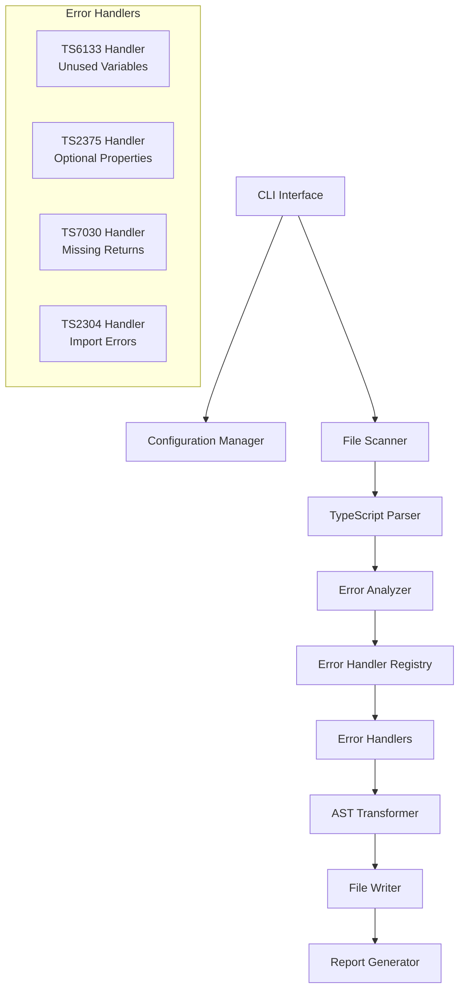

# Design Document

## Overview

The TypeScript Error Fixer is a specialized command-line tool designed to systematically resolve the specific TypeScript compilation errors present in the Chanuka project codebase. The system focuses on fixing import issues, schema reference problems, unused variables, and type compatibility issues that have accumulated through organic growth and multiple refactors.

The tool leverages the TypeScript Compiler API and project-specific knowledge of the Chanuka codebase structure to identify and fix errors related to:
- Missing schema imports from '@shared/schema'
- Incorrect database connection imports
- Unused variables and imports (especially from shared/core utilities)
- Schema property mismatches with Drizzle ORM
- API response utility parameter type issues
- exactOptionalPropertyTypes configuration problems

The tool is designed with knowledge of the project's specific patterns including shared/core utilities, database schema structure, and API response patterns.

## Architecture

### High-Level Architecture



### Core Components

1. **CLI Interface**: Command-line entry point with argument parsing
2. **Configuration Manager**: Handles configuration loading and validation
3. **File Scanner**: Discovers and filters TypeScript files for processing
4. **TypeScript Parser**: Uses TypeScript Compiler API for AST parsing
5. **Error Analyzer**: Identifies TypeScript errors and categorizes them
6. **Error Handler Registry**: Manages pluggable error handlers
7. **AST Transformer**: Applies fixes by modifying the AST
8. **File Writer**: Writes transformed code back to files with backup support
9. **Report Generator**: Creates detailed reports of applied fixes

## Components and Interfaces

### Core Interfaces

```typescript
interface ErrorFixer {
  canHandle(error: TypeScriptError): boolean;
  fix(error: TypeScriptError, sourceFile: SourceFile): FixResult;
  getDescription(): string;
}

interface TypeScriptError {
  code: number;
  message: string;
  file: string;
  line: number;
  column: number;
  category: DiagnosticCategory;
}

interface FixResult {
  success: boolean;
  changes: CodeChange[];
  message: string;
  requiresManualReview?: boolean;
}

interface CodeChange {
  type: 'replace' | 'insert' | 'delete';
  start: number;
  end: number;
  newText: string;
  description: string;
}

interface Configuration {
  enabledErrorTypes: number[];
  excludePatterns: string[];
  includePatterns: string[];
  backupFiles: boolean;
  previewMode: boolean;
  outputFormat: 'console' | 'json' | 'markdown';
}
```

### Error Handler Implementations

#### Schema Import Handler
- **Purpose**: Fix missing schema imports and property references
- **Strategy**: 
  - Identify references to schema tables (users, bills, user_profiles, etc.)
  - Add missing imports from '@shared/schema'
  - Fix incorrect property names based on actual schema definitions
  - Handle Drizzle ORM specific patterns (eq, and, desc, sql)
- **Safety**: Verify schema structure before applying fixes, maintain Drizzle patterns

#### Shared Core Import Handler
- **Purpose**: Fix imports from shared/core utilities
- **Strategy**:
  - Identify references to shared utilities (logger, cacheKeys, ApiSuccess, etc.)
  - Add correct import paths from shared/core/src
  - Fix relative path issues in nested directories
  - Handle index.js re-exports correctly
- **Safety**: Preserve existing import organization, prefer named imports

#### Database Connection Handler
- **Purpose**: Fix database connection and service imports
- **Strategy**:
  - Add missing database imports from '@shared/database/connection'
  - Fix databaseService import paths
  - Ensure proper database transaction patterns
  - Handle fallback patterns correctly
- **Safety**: Maintain database service patterns, preserve transaction logic

#### API Response Handler
- **Purpose**: Fix API response utility parameter mismatches
- **Strategy**:
  - Identify ApiSuccess, ApiError, ApiValidationError calls
  - Fix parameter order and types for ApiResponseWrapper
  - Handle metadata parameter requirements
  - Fix error message format requirements
- **Safety**: Maintain API response consistency, preserve error handling patterns

#### Unused Variable Handler
- **Purpose**: Clean up unused imports and variables
- **Strategy**:
  - Remove unused imports from shared/core
  - Remove unused variable declarations
  - Prefix unused function parameters with underscore
  - Handle logger imports that are imported but not used
- **Safety**: Verify no external references, preserve intentionally unused parameters

#### Optional Property Handler
- **Purpose**: Fix exactOptionalPropertyTypes issues
- **Strategy**:
  - Add `| undefined` to optional properties in interfaces
  - Fix validation middleware optional parameter issues
  - Handle configuration object optional properties
  - Maintain type safety with strict TypeScript settings
- **Safety**: Preserve existing type constraints, maintain backward compatibility

## Data Models

### Project Structure Model
```typescript
interface ProjectStructure {
  rootPath: string;
  tsConfigPath: string;
  sourceFiles: string[];
  excludePatterns: string[];
  compilerOptions: CompilerOptions;
}
```

### Processing Context
```typescript
interface ProcessingContext {
  project: ProjectStructure;
  config: Configuration;
  sourceFile: SourceFile;
  program: Program;
  typeChecker: TypeChecker;
}
```

### Fix Session
```typescript
interface FixSession {
  id: string;
  startTime: Date;
  files: string[];
  totalErrors: number;
  fixedErrors: number;
  skippedErrors: number;
  backupLocation?: string;
}
```

## Error Handling

### Error Categories
1. **Parsing Errors**: Invalid TypeScript syntax
   - Skip file and report issue
   - Continue with remaining files
   
2. **Fix Application Errors**: Failed to apply automated fix
   - Log specific error details
   - Mark for manual review
   - Continue with other errors
   
3. **File System Errors**: Cannot read/write files
   - Report permission or access issues
   - Provide suggested solutions
   - Fail gracefully

### Recovery Strategies
- **Backup Files**: Create `.backup` files before modification
- **Rollback Support**: Provide command to restore from backups
- **Partial Success**: Continue processing even if some files fail
- **Validation**: Re-compile after fixes to verify correctness

## Testing Strategy

### Unit Testing
- **Error Handler Tests**: Test each error type handler in isolation
- **AST Transformation Tests**: Verify correct code transformations
- **Configuration Tests**: Test configuration loading and validation
- **File System Tests**: Mock file operations for reliable testing

### Integration Testing
- **End-to-End Scenarios**: Test complete fix workflows
- **Multi-File Projects**: Test cross-file dependency handling
- **Error Combinations**: Test files with multiple error types
- **Configuration Variations**: Test different configuration options

### Test Data Strategy
- **Synthetic Test Cases**: Create minimal examples for each error type
- **Real-World Samples**: Use actual TypeScript files with known errors
- **Edge Cases**: Test boundary conditions and unusual code patterns
- **Regression Tests**: Prevent fixes from breaking previously working code

### Performance Testing
- **Large Codebases**: Test on projects with 1000+ files
- **Memory Usage**: Monitor memory consumption during processing
- **Processing Speed**: Benchmark fix application times
- **Concurrent Processing**: Test parallel file processing capabilities

### Validation Testing
- **Compilation Verification**: Ensure fixed code compiles successfully
- **Type Safety**: Verify fixes don't break type relationships
- **Runtime Behavior**: Test that fixes don't change program behavior
- **Code Quality**: Ensure fixes maintain code style and readability