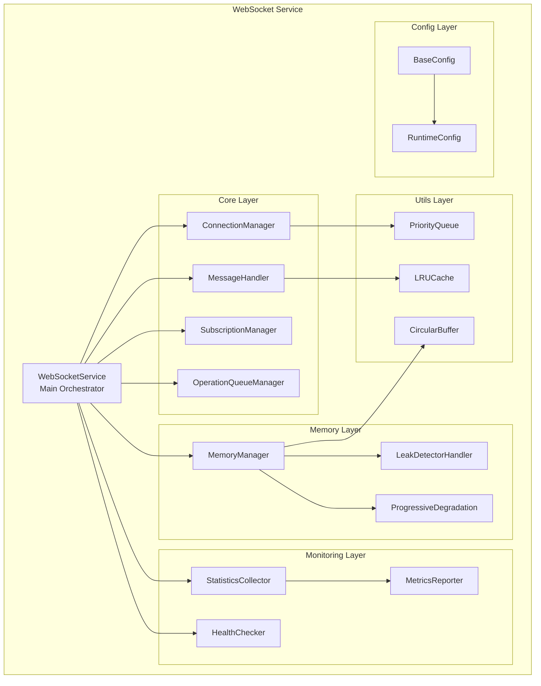
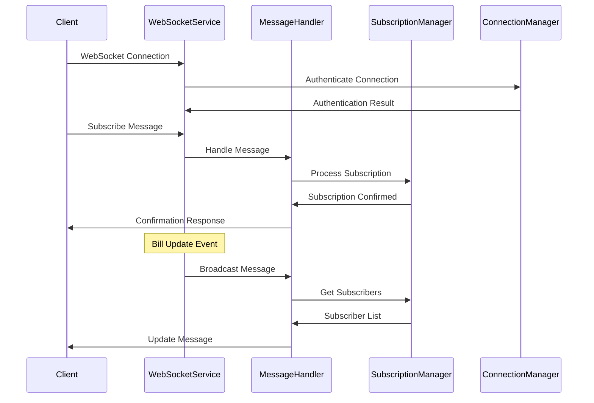

# WebSocket Service Optimization Design

## Overview

The current WebSocket service is a monolithic 2,300+ line file that handles multiple concerns including connection management, message processing, memory management, and monitoring. This design outlines the modularization of this service into focused, maintainable components while fixing all identified technical issues and maintaining backward compatibility.

The refactored architecture will follow a layered approach with clear separation of concerns, proper dependency injection, and comprehensive error handling. The service will maintain its current public API while internally restructuring for better maintainability and testability.

## Architecture

### High-Level Architecture



### Directory Structure

```
server/infrastructure/websocket/
├── index.ts                          # Barrel export & main service
├── types.ts                          # All interfaces & types
├── config/
│   ├── base-config.ts               # Immutable configuration
│   ├── runtime-config.ts            # Dynamic configuration
│   └── index.ts                     # Config barrel export
├── utils/
│   ├── priority-queue.ts            # Priority queue utility
│   ├── lru-cache.ts                 # LRU cache utility
│   ├── circular-buffer.ts           # Circular buffer utility
│   └── index.ts                     # Utils barrel export
├── core/
│   ├── websocket-service.ts         # Main orchestrator
│   ├── connection-manager.ts        # Connection lifecycle
│   ├── message-handler.ts           # Message processing
│   ├── subscription-manager.ts      # Subscription logic
│   ├── operation-queue-manager.ts   # Queue processing
│   └── index.ts                     # Core barrel export
├── memory/
│   ├── memory-manager.ts            # Memory cleanup
│   ├── leak-detector-handler.ts     # Memory leak responses
│   ├── progressive-degradation.ts   # Degradation logic
│   └── index.ts                     # Memory barrel export
├── monitoring/
│   ├── statistics-collector.ts      # Stats tracking
│   ├── health-checker.ts           # Health monitoring
│   ├── metrics-reporter.ts         # Metrics generation
│   └── index.ts                     # Monitoring barrel export
└── README.md                        # Documentation
```

## Components and Interfaces

### Core Types (types.ts)

```typescript
// Authentication and connection types
interface AuthenticatedWebSocket extends WebSocket {
  user_id?: string;
  isAlive?: boolean;
  lastPing?: number;
  subscriptions?: Set<number>;
  messageBuffer?: Array<Record<string, unknown>>;
  flushTimer?: NodeJS.Timeout;
  connectionId?: string;
}

interface WebSocketMessage {
  type: 'subscribe' | 'unsubscribe' | 'ping' | 'pong' | 'auth' |
    'get_preferences' | 'update_preferences' | 'batch_subscribe' | 'batch_unsubscribe';
  data?: MessageData;
  messageId?: string;
  timestamp?: number;
}

interface ConnectionPoolEntry {
  connections: AuthenticatedWebSocket[];
  lastActivity: number;
}

// Memory management types
interface MemoryLeakData {
  severity: 'low' | 'medium' | 'high' | 'critical';
  recommendations: string[];
  analysis: {
    growthRate: number;
    retainedIncrease: number;
  };
}

interface MemoryPressureData {
  pressure: number;
  threshold: number;
}

// Service interfaces for dependency injection
interface IConnectionManager {
  addConnection(ws: AuthenticatedWebSocket): void;
  removeConnection(ws: AuthenticatedWebSocket): void;
  getConnectionsForUser(userId: string): AuthenticatedWebSocket[];
  cleanup(): void;
}

interface IMessageHandler {
  handleMessage(ws: AuthenticatedWebSocket, message: WebSocketMessage): Promise<void>;
  broadcastToSubscribers(billId: number, message: Record<string, unknown>): void;
}

interface IMemoryManager {
  startMonitoring(): void;
  stopMonitoring(): void;
  performCleanup(): void;
  handleMemoryPressure(data: MemoryPressureData): void;
}
```

### Configuration Layer

#### BaseConfig (config/base-config.ts)
Immutable configuration constants that never change during runtime:

```typescript
export const BASE_CONFIG = {
  HEARTBEAT_INTERVAL: 30000,
  HEALTH_CHECK_INTERVAL: 60000,
  STALE_CONNECTION_THRESHOLD: 60000,
  CONNECTION_POOL_SIZE: 10000,
  MAX_QUEUE_SIZE: 1000,
  MAX_PAYLOAD: 100 * 1024,
  MAX_LATENCY_SAMPLES: 200,
  DEDUPE_CACHE_CLEANUP_AGE: 1800000,
  MAX_RECONNECT_ATTEMPTS: 3,
  RECONNECT_DELAY: 1000,
  HIGH_MEMORY_THRESHOLD: 85,
  CRITICAL_MEMORY_THRESHOLD: 95,
  PERFORMANCE_HISTORY_MAX_SIZE: 100,
  SHUTDOWN_GRACE_PERIOD: 5000,
} as const;
```

#### RuntimeConfig (config/runtime-config.ts)
Dynamic configuration that can be adjusted for progressive degradation:

```typescript
export class RuntimeConfig {
  private config = {
    MESSAGE_BATCH_SIZE: 10,
    MESSAGE_BATCH_DELAY: 50,
    COMPRESSION_THRESHOLD: 1024,
    DEDUPE_CACHE_SIZE: 5000,
    DEDUPE_WINDOW: 5000,
    MAX_CONNECTIONS_PER_USER: 5,
    MEMORY_CLEANUP_INTERVAL: 180000,
  };

  get(key: keyof typeof this.config): number {
    return this.config[key];
  }

  set(key: keyof typeof this.config, value: number): void {
    this.config[key] = value;
  }

  reset(): void {
    // Reset to defaults
  }

  toObject(): Record<string, number> {
    return { ...this.config };
  }
}
```

### Core Layer

#### WebSocketService (core/websocket-service.ts)
Main orchestrator that coordinates all other components:

```typescript
export class WebSocketService {
  private wss: WebSocketServer | null = null;
  private connectionManager: IConnectionManager;
  private messageHandler: IMessageHandler;
  private memoryManager: IMemoryManager;
  private statisticsCollector: IStatisticsCollector;
  private healthChecker: IHealthChecker;

  constructor(
    connectionManager: IConnectionManager,
    messageHandler: IMessageHandler,
    memoryManager: IMemoryManager,
    statisticsCollector: IStatisticsCollector,
    healthChecker: IHealthChecker
  ) {
    this.connectionManager = connectionManager;
    this.messageHandler = messageHandler;
    this.memoryManager = memoryManager;
    this.statisticsCollector = statisticsCollector;
    this.healthChecker = healthChecker;
  }

  initialize(server: Server): void {
    // Initialize WebSocket server
    // Set up event handlers
    // Start monitoring services
  }

  shutdown(): Promise<void> {
    // Graceful shutdown logic
  }
}
```

#### ConnectionManager (core/connection-manager.ts)
Handles connection lifecycle, authentication, and connection pooling:

```typescript
export class ConnectionManager implements IConnectionManager {
  private connectionPool = new Map<string, ConnectionPoolEntry>();
  private runtimeConfig: RuntimeConfig;

  constructor(runtimeConfig: RuntimeConfig) {
    this.runtimeConfig = runtimeConfig;
  }

  addConnection(ws: AuthenticatedWebSocket): void {
    // Add connection to pool
    // Handle user connection limits
    // Set up connection metadata
  }

  removeConnection(ws: AuthenticatedWebSocket): void {
    // Remove from pool
    // Clean up resources
    // Update statistics
  }

  authenticateConnection(ws: AuthenticatedWebSocket, token: string): Promise<boolean> {
    // JWT verification
    // User lookup
    // Set user_id on connection
  }
}
```

#### MessageHandler (core/message-handler.ts)
Processes incoming messages and handles broadcasting:

```typescript
export class MessageHandler implements IMessageHandler {
  private subscriptionManager: ISubscriptionManager;
  private operationQueueManager: IOperationQueueManager;
  private dedupeCache: ILRUCache<string, boolean>;

  constructor(
    subscriptionManager: ISubscriptionManager,
    operationQueueManager: IOperationQueueManager,
    dedupeCache: ILRUCache<string, boolean>
  ) {
    this.subscriptionManager = subscriptionManager;
    this.operationQueueManager = operationQueueManager;
    this.dedupeCache = dedupeCache;
  }

  async handleMessage(ws: AuthenticatedWebSocket, message: WebSocketMessage): Promise<void> {
    // Message validation
    // Route to appropriate handler
    // Error handling
  }

  broadcastToSubscribers(billId: number, message: Record<string, unknown>): void {
    // Find subscribers
    // Queue messages
    // Handle batching
  }
}
```

### Memory Layer

#### MemoryManager (memory/memory-manager.ts)
Coordinates memory monitoring and cleanup:

```typescript
export class MemoryManager implements IMemoryManager {
  private leakDetectorHandler: ILeakDetectorHandler;
  private progressiveDegradation: IProgressiveDegradation;
  private cleanupInterval: NodeJS.Timeout | null = null;

  constructor(
    leakDetectorHandler: ILeakDetectorHandler,
    progressiveDegradation: IProgressiveDegradation
  ) {
    this.leakDetectorHandler = leakDetectorHandler;
    this.progressiveDegradation = progressiveDegradation;
  }

  startMonitoring(): void {
    // Set up memory leak detector
    // Start cleanup intervals
    // Register event handlers
  }

  handleMemoryPressure(data: MemoryPressureData): void {
    // Trigger progressive degradation
    // Increase cleanup frequency
    // Log memory pressure events
  }
}
```

### Monitoring Layer

#### StatisticsCollector (monitoring/statistics-collector.ts)
Tracks performance metrics and connection statistics:

```typescript
export class StatisticsCollector implements IStatisticsCollector {
  private metrics = {
    totalConnections: 0,
    messagesProcessed: 0,
    averageLatency: 0,
    memoryUsage: 0,
  };

  updateConnectionCount(count: number): void {
    this.metrics.totalConnections = count;
  }

  recordMessageProcessed(latency: number): void {
    this.metrics.messagesProcessed++;
    // Update average latency
  }

  getMetrics(): Record<string, number> {
    return { ...this.metrics };
  }
}
```

### Utils Layer

#### PriorityQueue (utils/priority-queue.ts)
Efficient priority queue for message processing:

```typescript
export class PriorityQueue<T> {
  private items: Array<{ priority: number; item: T; timestamp: number }> = [];
  private readonly maxSize: number;

  constructor(maxSize: number) {
    this.maxSize = maxSize;
  }

  enqueue(item: T, priority: number): boolean {
    // Binary search insertion
    // Size limit enforcement
  }

  dequeue(): T | undefined {
    // Remove highest priority item
  }
}
```

## Data Models

### Connection State Management

The service maintains connection state through several data structures:

1. **Connection Pool**: Maps user IDs to their active connections
2. **Subscription Registry**: Tracks which connections are subscribed to which bills
3. **Message Queues**: Priority queues for efficient message delivery
4. **Statistics Cache**: Circular buffers for performance metrics

### Message Flow



## Error Handling

### Error Categories

1. **Connection Errors**: Authentication failures, connection drops, rate limiting
2. **Message Errors**: Invalid format, processing failures, timeout errors
3. **Memory Errors**: Out of memory, leak detection, pressure events
4. **System Errors**: Database failures, service unavailability

### Error Handling Strategy

```typescript
interface ErrorHandler {
  handleConnectionError(error: ConnectionError, ws: AuthenticatedWebSocket): void;
  handleMessageError(error: MessageError, message: WebSocketMessage): void;
  handleMemoryError(error: MemoryError): void;
  handleSystemError(error: SystemError): void;
}
```

Each component will implement proper error boundaries and recovery mechanisms:

- **Graceful Degradation**: Reduce functionality under stress
- **Circuit Breakers**: Prevent cascade failures
- **Retry Logic**: Automatic recovery for transient errors
- **Error Reporting**: Comprehensive logging and monitoring

## Testing Strategy

### Unit Testing

Each module will have comprehensive unit tests:

- **Connection Manager**: Connection lifecycle, authentication, pooling
- **Message Handler**: Message processing, validation, broadcasting
- **Memory Manager**: Cleanup operations, pressure handling
- **Utils**: Data structures, algorithms, helper functions

### Integration Testing

Test component interactions:

- **Service Integration**: Full WebSocket service functionality
- **Memory Integration**: Memory management under load
- **Error Integration**: Error handling across components

### Performance Testing

- **Load Testing**: High connection counts, message throughput
- **Memory Testing**: Memory usage patterns, leak detection
- **Latency Testing**: Message delivery performance

### Test Structure

```typescript
// Example test structure
describe('ConnectionManager', () => {
  let connectionManager: ConnectionManager;
  let mockRuntimeConfig: RuntimeConfig;

  beforeEach(() => {
    mockRuntimeConfig = new RuntimeConfig();
    connectionManager = new ConnectionManager(mockRuntimeConfig);
  });

  describe('addConnection', () => {
    it('should add connection to pool', () => {
      // Test implementation
    });

    it('should enforce connection limits', () => {
      // Test implementation
    });
  });
});
```

This modular design ensures each component can be tested in isolation while maintaining the ability to test the integrated system as a whole.