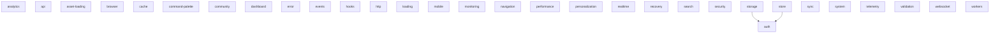

# Infrastructure Dependency Graph

```mermaid
graph TD

    ANALYTICS[analytics]
    API[api]
    ASSET_LOADING[asset-loading]
    AUTH[auth]
    BROWSER[browser]
    CACHE[cache]
    COMMAND_PALETTE[command-palette]
    COMMUNITY[community]
    DASHBOARD[dashboard]
    ERROR[error]
    EVENTS[events]
    HOOKS[hooks]
    HTTP[http]
    LOADING[loading]
    MOBILE[mobile]
    MONITORING[monitoring]
    NAVIGATION[navigation]
    PERFORMANCE[performance]
    PERSONALIZATION[personalization]
    REALTIME[realtime]
    RECOVERY[recovery]
    SEARCH[search]
    SECURITY[security]
    STORAGE[storage]
    STORE[store]
    SYNC[sync]
    SYSTEM[system]
    TELEMETRY[telemetry]
    VALIDATION[validation]
    WEBSOCKET[websocket]
    WORKERS[workers]

    STORAGE --> AUTH
    STORE --> AUTH
```

✅ **No circular dependencies detected!**