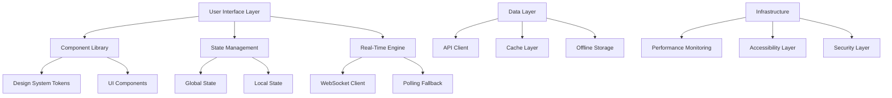
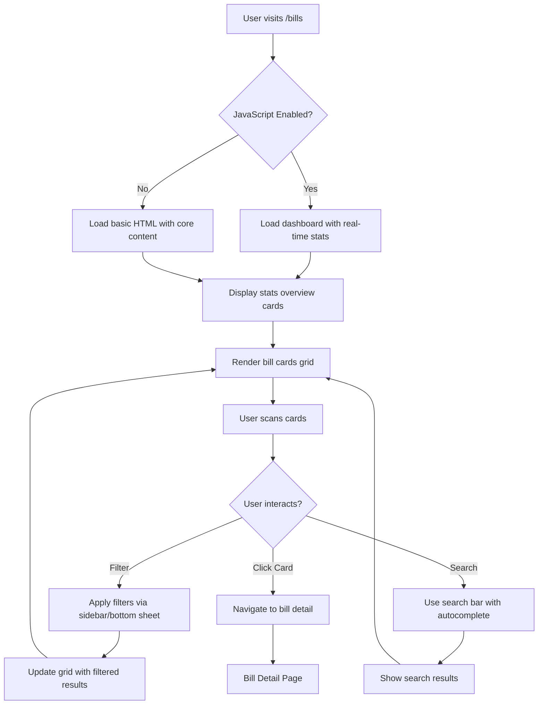
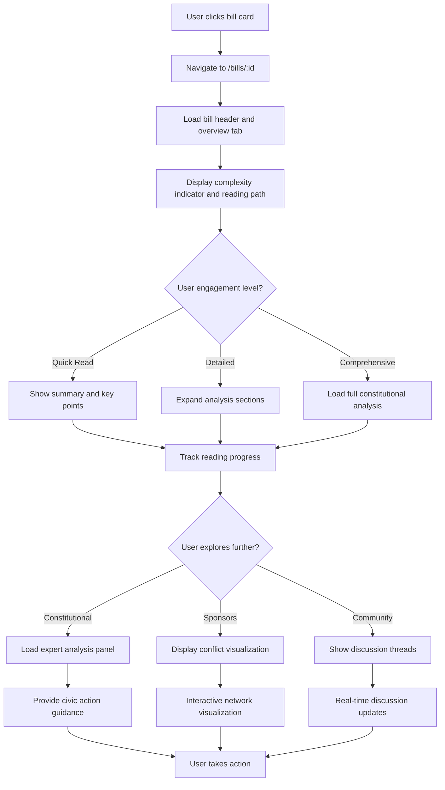
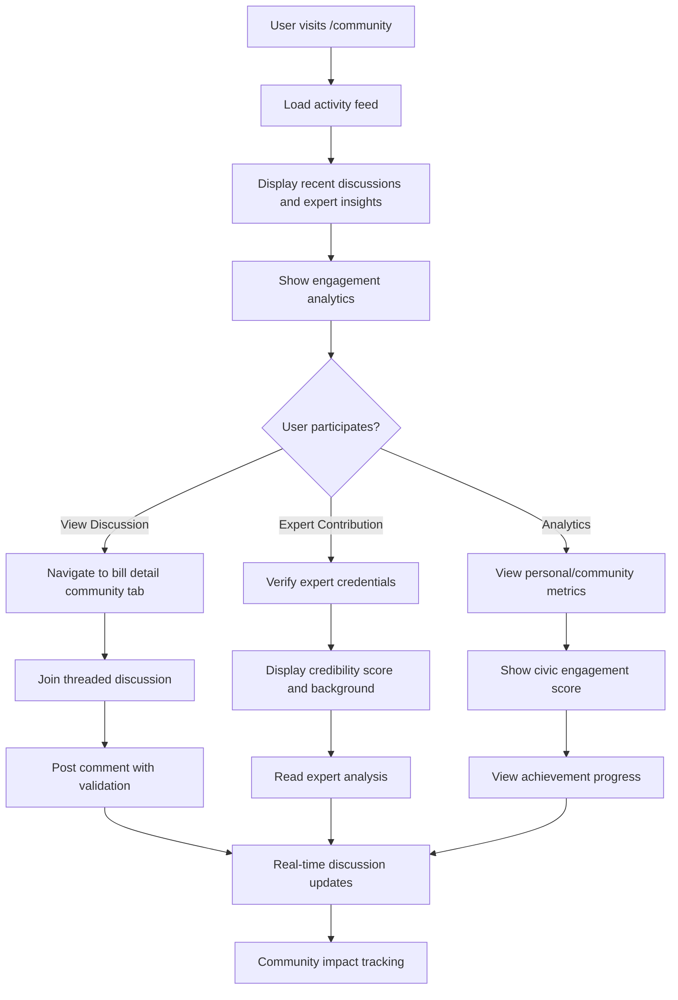

# Chanuka Client UI Upgrade - Comprehensive UI/UX Design Specification

## Document Control
**Version:** 1.0  
**Date:** November 10, 2025  
**Author:** Kilo Code (Architect Mode)  
**Purpose:** Implementation-ready UI/UX specifications for Chanuka platform upgrade  
**Alignment:** Enhanced EARS requirements, P0 feature prioritization  

---

## Executive Summary

This specification provides a comprehensive UI/UX design for the Chanuka Client UI Upgrade, transforming the platform from a basic legislative tracking system into a sophisticated civic engagement platform. The design prioritizes P0 features from the enhanced EARS requirements, incorporates strategic features identified in gap analyses, and ensures mobile-first responsive design with WCAG 2.1 AA accessibility compliance.

Key design decisions are based on:
- User-centered approach focusing on citizen empowerment
- Progressive disclosure to manage information complexity
- Real-time engagement to foster community participation
- Expert verification for credibility and trust
- Performance optimization for global accessibility

---

## 1. High-Level System Architecture and Component Hierarchy

### System Architecture Overview



### Component Hierarchy

```
├── App Shell
│   ├── Navigation (Header/Footer)
│   ├── Main Content Area
│   └── Modals/Overlays
├── Page Templates
│   ├── Dashboard Template
│   ├── Detail Template
│   └── Hub Template
├── Feature Components
│   ├── Bills Discovery
│   │   ├── Bill Card (Extend existing .chanuka-card)
│   │   ├── Filter Panel (Use existing filter patterns)
│   │   └── Search Interface (Leverage existing search)
│   ├── Bill Analysis
│   │   ├── Constitutional Panel (Extend existing civic variables)
│   │   ├── Conflict Visualization (Build on current D3.js setup)
│   │   └── Expert Insights (Enhance existing verification)
│   ├── Community Engagement
│   │   ├── Discussion Threads (Use existing .chanuka-card classes)
│   │   ├── Expert Verification (Extend existing badge system)
│   │   └── Analytics Dashboard (Leverage existing metrics)
│   └── User Management
│       ├── Authentication (Maintain existing auth context)
│       ├── Dashboard (Extend existing personalization)
│       └── Preferences (Use existing privacy controls)
├── Shared Components
│   ├── Loading States (Enhance existing skeleton loaders)
│   ├── Error Boundaries (Maintain existing error handling)
│   ├── Accessibility Helpers (Extend existing skip links)
│   └── Performance Monitors (Use existing monitoring)
└── Infrastructure
    ├── Real-Time Updates (Extend existing WebSocket client)
    ├── Offline Support (Maintain existing service worker)
    └── Security Controls (Leverage existing CSP and validation)
```

### Rationale
- **Extension of Existing Architecture**: Builds upon established patterns and components
- **Progressive Enhancement**: Core functionality works without JavaScript
- **Component Reusability**: Leverages existing design system for consistency
- **Performance Optimization**: Maintains existing lazy loading and code splitting

---

## 2. Detailed Wireframes and User Flows

### 2.1 Bills Dashboard Screen

#### Wireframe Description

**Desktop Layout (≥1024px):**
```
┌─────────────────────────────────────────────────────────────┐
│ Header: Logo | Navigation | Search Bar | User Menu          │
├─────────────────────────────────────────────────────────────┤
│ Stats Overview: [Active Bills: 247] [Urgent: 12] [Const.: 8] [Trending: 45] │
├─────────────────────────────────────────────────────────────┤
│ Quick Filters: [All] [Urgent] [Constitutional] [Trending]   │
│ Advanced Filters Button                                    │
├─────────────────────────────────────────────────────────────┤
│ Bills Grid (3 columns)                                      │
│ ┌─────────────────┐ ┌─────────────────┐ ┌─────────────────┐ │
│ │ Bill Card 1     │ │ Bill Card 2     │ │ Bill Card 3     │ │
│ │ Status: Active  │ │ Status: Urgent  │ │ Status: Passed  │ │
│ │ Urgency: High   │ │ Urgency: Crit.  │ │ Urgency: Low    │ │
│ │ Views: 1.2K     │ │ Views: 856      │ │ Views: 2.1K     │ │
│ │ Comments: 23    │ │ Comments: 67    │ │ Comments: 12    │ │
│ │ Quick Actions   │ │ Quick Actions   │ │ Quick Actions   │ │
│ └─────────────────┘ └─────────────────┘ └─────────────────┘ │
│ [Load More] Button                                         │
└─────────────────────────────────────────────────────────────┘
```

**Mobile Layout (<768px):**
```
┌─────────────────────┐
│ Header (Collapsed)  │
├─────────────────────┤
│ Stats (2x2 Grid)    │
│ [247] [12]          │
│ [8]   [45]          │
├─────────────────────┤
│ Filters (Bottom Sheet)│
├─────────────────────┤
│ Bills (Single Column) │
│ ┌─────────────────┐ │
│ │ Bill Card       │ │
│ │ Status + Urgency│ │
│ │ Metrics         │ │
│ │ Actions         │ │
│ └─────────────────┘ │
│ [Load More]         │
└─────────────────────┘
```

#### User Flow: Bills Discovery



#### Key Features
- **Real-Time Stats**: Extend existing WebSocket client for live updates every 30 seconds, maintain polling fallback
- **Progressive Loading**: Above-fold cards load immediately, below-fold lazy load
- **Smart Filtering**: Multi-dimensional with URL persistence using existing patterns
- **Enhanced Bill Cards**: Status indicators, urgency badges, engagement metrics using existing classes

#### Rationale
- **Information Hierarchy**: Stats overview provides context before detailed content
- **Progressive Disclosure**: Filters hidden by default to reduce cognitive load
- **Mobile-First**: Bottom sheet filters optimize for touch interaction
- **Performance**: Skeleton loading prevents layout shift

### 2.2 Bill Detail Screen

#### Wireframe Description

**Desktop Layout:**
```
┌─────────────────────────────────────────────────────────────┐
│ Bill Header: Title | Status | Quick Actions                 │
├─────────────────────────────────────────────────────────────┤
│ Tab Navigation: Overview | Full Text | Analysis | Sponsors | Community │
├─────────────────────────────────────────────────────────────┤
│ Overview Tab                                               │
│ ┌─────────────────────────────────────────────────────────┐ │
│ │ Summary | Key Points | Timeline                         │ │
│ │ Complexity: ••• (10+ min)                              │ │
│ │ Reading Progress: [████████░░] 70%                     │ │
│ └─────────────────────────────────────────────────────────┘ │
├─────────────────────────────────────────────────────────────┤
│ Constitutional Analysis Panel (if applicable)              │
│ ┌─────────────────────────────────────────────────────────┐ │
│ │ ⚠️ High Concern | Expert Analysis | Civic Actions       │ │
│ └─────────────────────────────────────────────────────────┘ │
└─────────────────────────────────────────────────────────────┘
```

**Mobile Layout:**
```
┌─────────────────────┐
│ Bill Header         │
├─────────────────────┤
│ Tab Selector (Dropdown)│
├─────────────────────┤
│ Content Area         │
│ ┌─────────────────┐ │
│ │ Overview         │ │
│ │ Progress Bar     │ │
│ │ Key Points       │ │
│ └─────────────────┘ │
├─────────────────────┤
│ Sticky Action Bar   │
│ [Save] [Share] [Comment]│
└─────────────────────┘
```

#### User Flow: Bill Analysis



#### Key Features
- **Progressive Disclosure**: Complexity indicators guide user engagement
- **Constitutional Analysis**: Extend existing expert verification for civic concerns
- **Conflict Visualization**: Build upon current D3.js network mapping capabilities
- **Community Integration**: Leverage existing real-time threaded discussions

#### Rationale
- **Educational Scaffolding**: Complexity indicators prevent information overload
- **Expert Credibility**: Verification badges build trust in analysis
- **Interactive Engagement**: Network visualization makes complex relationships accessible
- **Mobile Optimization**: Sticky action bar ensures key functions remain accessible

### 2.3 Community Hub Screen

#### Wireframe Description

**Desktop Layout:**
```
┌─────────────────────────────────────────────────────────────┐
│ Community Header | Activity Feed | Trending Topics         │
├─────────────────────────────────────────────────────────────┤
│ Activity Feed                                            │
│ ┌─────────────────────────────────────────────────────────┐ │
│ │ Recent Comments (47) | Expert Insights | Local Impact  │ │
│ │ [Comment Thread]                                       │ │
│ │ [Expert Contribution]                                  │ │
│ │ [Local Bill Alert]                                      │ │
│ └─────────────────────────────────────────────────────────┘ │
├─────────────────────────────────────────────────────────────┤
│ Expert Insights Panel                                      │
│ ┌─────────────────────────────────────────────────────────┐ │
│ │ ⭐ Verified Expert | Credibility: 94/100               │ │
│ │ Analysis Summary | Full Contribution Link              │ │
│ └─────────────────────────────────────────────────────────┘ │
├─────────────────────────────────────────────────────────────┤
│ Engagement Analytics                                       │
│ ┌─────────────────────────────────────────────────────────┐ │
│ │ Community Pulse: 89% Approval | 4,238 Participants     │ │
│ │ Sentiment: Positive 65% | Neutral 25% | Concerned 10%   │ │
│ │ Your Score: 847 | Rank: Top 15%                        │ │
│ └─────────────────────────────────────────────────────────┘ │
└─────────────────────────────────────────────────────────────┘
```

**Mobile Layout:**
```
┌─────────────────────┐
│ Community Header    │
├─────────────────────┤
│ Activity Feed       │
│ ┌─────────────────┐ │
│ │ Recent Activity │ │
│ │ Expert Insights │ │
│ │ Analytics       │ │
│ └─────────────────┘ │
├─────────────────────┤
│ Action Center       │
│ [Join Discussion]   │
│ [Share Insight]     │
│ [Track Bill]        │
└─────────────────────┘
```

#### User Flow: Community Engagement



#### Key Features
- **Expert Verification**: Extend existing badge system with multi-tier credibility scoring
- **Real-Time Analytics**: Leverage existing metrics for live engagement and sentiment tracking
- **Threaded Discussions**: Build upon current nested comments with moderation
- **Gamification**: Enhance existing civic engagement scoring and rankings

#### Rationale
- **Trust Building**: Expert verification combats misinformation
- **Community Building**: Real-time metrics encourage participation
- **Moderation**: Transparent moderation maintains discussion quality
- **Accessibility**: Threaded discussions support screen readers

---

## 3. Responsive Design Patterns and Mobile-First Approach

### Mobile-First Principles
- **Content Priority**: Most important content loads first on small screens
- **Touch Optimization**: Minimum 44px touch targets, gesture support
- **Progressive Enhancement**: Core functionality works without JavaScript
- **Performance Focus**: Optimized for slower mobile networks

### Responsive Breakpoints
- **Mobile**: <768px (single column, bottom sheets, touch-first)
- **Tablet**: 768px-1023px (2 columns, collapsible panels)
- **Desktop**: ≥1024px (3 columns, sidebar navigation, hover states)

### Key Patterns
- **Bottom Sheet Filters**: Mobile-optimized filter interface
- **Sticky Action Bars**: Persistent navigation on mobile
- **Swipe Gestures**: Horizontal swipe for tab navigation
- **Collapsible Sections**: Accordion-style content organization

### Rationale
- **Global Accessibility**: Mobile-first ensures functionality in low-bandwidth areas
- **Touch-First Design**: Optimizes for primary interaction method on mobile
- **Progressive Scaling**: Design scales up from mobile to desktop

---

## 4. Accessibility Design Guidelines and Patterns

### WCAG 2.1 AA Compliance Requirements
- **Color Contrast**: 4.5:1 minimum for normal text, 3:1 for large text
- **Keyboard Navigation**: Full functionality without mouse
- **Screen Reader Support**: Semantic HTML, ARIA labels, live regions
- **Focus Management**: Clear focus indicators, logical tab order

### Accessibility Patterns
- **Skip Links**: Jump to main content, navigation, search
- **ARIA Labels**: Descriptive labels for complex widgets
- **Live Regions**: Announce dynamic content changes
- **Semantic HTML**: Proper heading hierarchy, landmark regions

### Inclusive Design Features
- **Language Support**: Multi-language interface with RTL support
- **Reading Level**: Plain language summaries with complexity indicators
- **Motor Impairments**: Voice navigation, extended timeouts
- **Cognitive Support**: Clear information hierarchy, progressive disclosure

### Rationale
- **Legal Compliance**: WCAG AA required for government-facing platforms
- **Democratic Inclusion**: Ensures all citizens can participate
- **User Experience**: Better accessibility benefits all users

---

## 5. Performance Optimization Strategies

### Core Web Vitals Targets
- **LCP**: <2.5 seconds (Largest Contentful Paint)
- **FID**: <100ms (First Input Delay)
- **CLS**: <0.1 (Cumulative Layout Shift)

### Optimization Techniques
- **Critical Path Optimization**: Inline critical CSS, defer non-critical JS
- **Image Optimization**: WebP format with lazy loading
- **Bundle Splitting**: Route-based code splitting
- **Caching Strategy**: Service worker for offline content

### Real-Time Performance
- **WebSocket Efficiency**: Binary protocols, connection pooling
- **Update Batching**: Group real-time updates to reduce DOM manipulation
- **Virtual Scrolling**: For large lists to maintain performance

### Rationale
- **User Experience**: Fast loading prevents user abandonment
- **Accessibility**: Performance issues disproportionately affect low-income users
- **Scalability**: Optimized performance supports global user base

---

## 6. Real-Time Feature Implementation Approach

### WebSocket Architecture
- **Connection Management**: Extend existing auto-reconnect with exponential backoff
- **Message Protocol**: Leverage current JSON-RPC 2.0 for structured communication
- **Fallback Strategy**: Maintain existing polling when WebSocket unavailable

### Real-Time Features
- **Live Stats Updates**: Dashboard metrics update every 30 seconds
- **Discussion Updates**: New comments appear instantly
- **Notification Delivery**: Push notifications for important events
- **Engagement Tracking**: Real-time participation metrics

### Implementation Considerations
- **Connection Limits**: Maximum 1 WebSocket per user across tabs
- **Message Prioritization**: Critical updates bypass rate limiting
- **Offline Queue**: Actions queue when offline, sync on reconnection

### Rationale
- **Engagement**: Real-time features increase user participation
- **Trust**: Live updates demonstrate platform vitality
- **Reliability**: Fallback mechanisms ensure functionality

---

## 7. Security and Privacy UI Patterns

### Authentication UI
- **Secure Login**: 2FA support with clear instructions
- **Session Management**: Visible session status and logout options
- **Password Security**: Strength indicators and requirements display

### Privacy Controls
- **Consent Management**: Granular privacy settings with clear explanations
- **Data Export**: One-click data download and deletion
- **Visibility Settings**: Control over profile and activity visibility

### Content Security
- **Input Validation**: Real-time validation with clear error messages
- **XSS Prevention**: Sanitized content display
- **CSRF Protection**: Token-based form protection

### Rationale
- **User Trust**: Transparent security builds confidence
- **Legal Compliance**: GDPR and data protection requirements
- **Platform Integrity**: Prevents malicious content and attacks

---

## 8. Implementation Priorities and Rationale

### P0 Features (Critical for Launch)
1. **Bills Dashboard Core**: Foundation for user discovery
2. **Bill Detail Progressive Disclosure**: Manages complexity
3. **Mobile Responsive Design**: Ensures accessibility
4. **WCAG AA Accessibility**: Legal and ethical requirement
5. **Core Web Vitals Optimization**: Performance baseline

### P1 Features (Enhanced Experience)
1. **Real-Time Engagement Analytics**: Community building
2. **Expert Verification System**: Credibility foundation
3. **Advanced Filtering**: Improved discoverability
4. **Conflict of Interest Visualization**: Transparency mission

### Implementation Rationale
- **User Impact**: P0 features address core user needs
- **Technical Feasibility**: Builds on existing infrastructure
- **Regulatory Compliance**: Accessibility and security prioritized
- **Scalability**: Modular design allows incremental deployment

---

## Conclusion

This UI/UX specification provides implementation-ready designs that transform Chanuka into a leading civic engagement platform. The mobile-first, accessible, and performance-optimized design ensures broad participation while advanced features like real-time analytics and expert verification build trust and engagement.

The specifications align with enhanced EARS requirements, prioritize P0 features, and incorporate strategic features identified in gap analyses. Implementation should follow the phased approach with continuous user testing and performance monitoring.