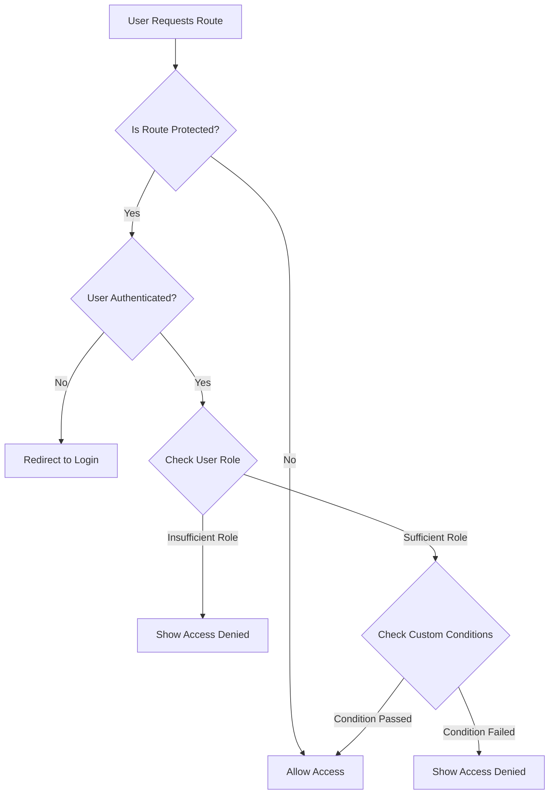

# Navigation Flow Logic

## Overview

This document defines the navigation flow logic that manages how users move through the application, including route access control, page relationships, and navigation state management.

## Route Access Control

### Access Control Flow



### Route Access Hook Implementation

```typescript
export const useRouteAccess = (path: string) => {
  const { user, userRole } = useUnifiedNavigation();
  const navigationItem = findNavigationItemByPath(path);

  // Public routes (no navigation item) are always accessible
  if (!navigationItem) {
    return { canAccess: true, denialReason: null, requiredRole: null };
  }

  // Check authentication requirement
  if (navigationItem.requiresAuth && !user) {
    return {
      canAccess: false,
      denialReason: 'unauthenticated',
      requiredRole: navigationItem.allowedRoles
    };
  }

  // Check admin requirement
  if (navigationItem.adminOnly && userRole !== 'admin') {
    return {
      canAccess: false,
      denialReason: 'admin_required',
      requiredRole: ['admin']
    };
  }

  // Check role requirements
  if (navigationItem.allowedRoles && !navigationItem.allowedRoles.includes(userRole)) {
    return {
      canAccess: false,
      denialReason: 'insufficient_role',
      requiredRole: navigationItem.allowedRoles
    };
  }

  // Check custom conditions
  if (navigationItem.condition && !navigationItem.condition(userRole, user)) {
    return {
      canAccess: false,
      denialReason: 'custom_condition',
      requiredRole: navigationItem.allowedRoles
    };
  }

  return { canAccess: true, denialReason: null, requiredRole: null };
};
```

## Page Relationship Management

### Related Pages Hook Implementation

```typescript
export const useRelatedPages = (currentPath: string, options?: {
  maxResults?: number;
  includeBreadcrumbs?: boolean;
  filterByRole?: boolean;
}) => {
  const { userRole, user, preferences } = useUnifiedNavigation();
  const { maxResults = 5, includeBreadcrumbs = false, filterByRole = true } = options || {};

  // Get relationships for current path
  const relationships = PAGE_RELATIONSHIPS[currentPath] || [];

  // Convert relationships to RelatedPage objects
  let relatedPages: RelatedPage[] = relationships.map(rel => {
    const navItem = findNavigationItemByPath(rel.pageId);
    return {
      pageId: rel.pageId,
      title: navItem?.label || rel.pageId,
      path: rel.pageId,
      description: navItem?.description || '',
      category: navItem?.section || 'tools',
      type: rel.type,
      weight: rel.weight,
      context: rel.context,
      relevanceScore: calculateRelevanceScore(rel, userRole, preferences, user)
    };
  });

  // Filter by role access if requested
  if (filterByRole) {
    relatedPages = relatedPages.filter(page => {
      const navItem = findNavigationItemByPath(page.path);
      return navItem ? canViewItem(navItem, userRole, user) : true;
    });
  }

  // Sort by relevance score
  relatedPages.sort((a, b) => b.relevanceScore - a.relevanceScore);

  // Limit results
  const limitedPages = relatedPages.slice(0, maxResults);

  // Add breadcrumb relationships if requested
  if (includeBreadcrumbs) {
    const breadcrumbPages = generateBreadcrumbRelationships(currentPath, userRole, user);
    limitedPages.push(...breadcrumbPages);
  }

  return {
    relatedPages: limitedPages,
    totalCount: relatedPages.length,
    hasMore: relatedPages.length > maxResults
  };
};
```

### Relevance Score Calculation

```typescript
const calculateRelevanceScore = (
  relationship: PageRelationship,
  userRole: UserRole,
  preferences: NavigationPreferences,
  user: any
): number => {
  let score = relationship.weight;

  // Role-based adjustments
  if (relationship.allowedRoles && !relationship.allowedRoles.includes(userRole)) {
    score *= 0.3; // Significantly reduce score for inaccessible pages
  }

  // User preference adjustments
  if (preferences?.favoritePages?.includes(relationship.pageId)) {
    score *= 1.5; // Boost favorite pages
  }

  // Recency adjustments
  const lastVisited = preferences?.recentlyVisited?.find(p => p.path === relationship.pageId);
  if (lastVisited) {
    const daysSinceVisited = (Date.now() - lastVisited.visitedAt.getTime()) / (1000 * 60 * 60 * 24);
    if (daysSinceVisited < 7) {
      score *= 1.2; // Boost recently visited pages
    }
  }

  // Visit frequency adjustments
  if (lastVisited && lastVisited.visitCount > 5) {
    score *= 1.1; // Slightly boost frequently visited pages
  }

  // Context-based adjustments
  score = applyContextAdjustments(score, relationship, userRole, user);

  return Math.min(Math.max(score, 0), 10); // Clamp between 0 and 10
};
```

## Navigation State Management

### Navigation Context Structure

```typescript
interface NavigationContextValue {
  // Current state
  currentPath: string;
  previousPath: string;
  breadcrumbs: BreadcrumbItem[];
  relatedPages: RelatedPage[];
  currentSection: NavigationSection;
  userRole: UserRole;
  preferences: NavigationPreferences;

  // Actions
  navigateTo: (path: string) => void;
  updateBreadcrumbs: (breadcrumbs: BreadcrumbItem[]) => void;
  updateRelatedPages: (pages: RelatedPage[]) => void;
  updateUserRole: (role: UserRole) => void;
  updatePreferences: (preferences: Partial<NavigationPreferences>) => void;
  addToRecentPages: (page: { path: string; title: string }) => void;
}
```

### Navigation State Updates

```typescript
const updateNavigationState = (newPath: string) => {
  const previousPath = navigationState.currentPath;

  // Update path history
  setNavigationState(prev => ({
    ...prev,
    currentPath: newPath,
    previousPath,
  }));

  // Update breadcrumbs
  const breadcrumbs = generateBreadcrumbs(newPath);
  updateBreadcrumbs(breadcrumbs);

  // Update related pages
  const { relatedPages } = useRelatedPages(newPath);
  updateRelatedPages(relatedPages);

  // Update current section
  const section = determineCurrentSection(newPath);
  setNavigationState(prev => ({
    ...prev,
    currentSection: section,
  }));

  // Add to recent pages
  addToRecentPages({ path: newPath, title: getPageTitle(newPath) });
};
```

## Breadcrumb Generation

### Breadcrumb Algorithm

```typescript
export const generateBreadcrumbs = (currentPath: string): BreadcrumbItem[] => {
  const breadcrumbs: BreadcrumbItem[] = [];
  const pathSegments = currentPath.split('/').filter(Boolean);

  // Always start with home
  breadcrumbs.push({
    label: 'Home',
    path: '/',
    isActive: currentPath === '/'
  });

  // Build breadcrumb path
  let currentPathBuilder = '';
  for (let i = 0; i < pathSegments.length; i++) {
    currentPathBuilder += `/${pathSegments[i]}`;
    const segment = pathSegments[i];

    // Skip if this is a parameter (starts with : or is a number/id)
    if (segment.startsWith(':') || /^\d+$/.test(segment)) {
      continue;
    }

    const navItem = findNavigationItemByPath(currentPathBuilder);
    if (navItem) {
      breadcrumbs.push({
        label: navItem.label,
        path: currentPathBuilder,
        isActive: currentPathBuilder === currentPath
      });
    }
  }

  // Ensure current page is marked as active
  const lastBreadcrumb = breadcrumbs[breadcrumbs.length - 1];
  if (lastBreadcrumb) {
    lastBreadcrumb.isActive = true;
  }

  return breadcrumbs;
};
```

## Navigation Flow Patterns

### User Journey Flows

#### New User Flow
```
Landing → Sign Up → Email Verification → Dashboard → Profile Setup → Bills
```

#### Expert User Flow
```
Login → Dashboard → Expert Verification → Bills → Analysis → Community Input
```

#### Admin User Flow
```
Login → Admin Panel → User Management → System Settings → Audit Logs
```

### Conditional Navigation

```typescript
const getNextStepInFlow = (currentPath: string, userRole: UserRole, user: any) => {
  const flows = NAVIGATION_FLOWS[userRole] || NAVIGATION_FLOWS.default;
  const currentIndex = flows.findIndex(step => step.path === currentPath);

  if (currentIndex === -1 || currentIndex === flows.length - 1) {
    return null; // No next step
  }

  const nextStep = flows[currentIndex + 1];

  // Check if user can access next step
  const { canAccess } = useRouteAccess(nextStep.path);
  return canAccess ? nextStep : null;
};
```

## Error Handling and Fallbacks

### Access Denied Handling

```typescript
const handleAccessDenied = (denialReason: AccessDenialReason, requiredRole?: UserRole[]) => {
  switch (denialReason) {
    case 'unauthenticated':
      // Redirect to login with return URL
      navigateTo(`/auth?returnUrl=${encodeURIComponent(window.location.pathname)}`);
      break;

    case 'insufficient_role':
      // Show upgrade prompt or redirect to appropriate page
      if (requiredRole?.includes('expert')) {
        navigateTo('/expert-verification');
      } else {
        showToast('Access denied: Insufficient permissions', 'error');
      }
      break;

    case 'admin_required':
      // Redirect to home or show admin contact
      navigateTo('/');
      showToast('This page requires administrator access', 'warning');
      break;

    case 'custom_condition':
      // Show custom message based on condition
      showToast('Access denied: Additional requirements not met', 'error');
      break;
  }
};
```

### Navigation Error Recovery

```typescript
const recoverFromNavigationError = (error: NavigationError, currentPath: string) => {
  logger.error('Navigation error:', error);

  switch (error.type) {
    case 'route_not_found':
      // Try to find closest matching route
      const closestRoute = findClosestRoute(currentPath);
      if (closestRoute) {
        navigateTo(closestRoute);
        return;
      }
      break;

    case 'permission_denied':
      handleAccessDenied(error.denialReason, error.requiredRole);
      return;

    case 'network_error':
      // Show offline message and retry option
      showOfflineMessage();
      return;
  }

  // Default fallback
  navigateTo('/');
};
```

## Performance Optimizations

### Memoization Strategies

```typescript
// Memoize expensive calculations
const useMemoizedNavigation = () => {
  const { userRole, user, preferences } = useUnifiedNavigation();

  return useMemo(() => {
    const navigationItems = filterNavigationItems(userRole, user);
    const currentSection = determineCurrentSection(window.location.pathname);
    const breadcrumbs = generateBreadcrumbs(window.location.pathname);

    return {
      navigationItems,
      currentSection,
      breadcrumbs,
      // Other computed values
    };
  }, [userRole, user, preferences, window.location.pathname]);
};
```

### Lazy Loading Relationships

```typescript
// Load page relationships on demand
const useLazyRelatedPages = (currentPath: string) => {
  return useQuery({
    queryKey: ['navigation', 'related-pages', currentPath],
    queryFn: () => fetchRelatedPages(currentPath),
    staleTime: 5 * 60 * 1000, // 5 minutes
    enabled: !!currentPath,
  });
};
```

## Testing Strategies

### Unit Tests for Navigation Logic

```typescript
describe('useRouteAccess', () => {
  it('should allow access to public routes', () => {
    const { canAccess } = useRouteAccess('/');
    expect(canAccess).toBe(true);
  });

  it('should deny access to admin routes for non-admin users', () => {
    const { canAccess, denialReason } = useRouteAccess('/admin');
    expect(canAccess).toBe(false);
    expect(denialReason).toBe('admin_required');
  });

  it('should allow access based on role permissions', () => {
    const { canAccess } = useRouteAccess('/expert-verification');
    expect(canAccess).toBe(true); // Assuming expert user
  });
});
```

### Integration Tests for Navigation Flows

```typescript
describe('Navigation Flow', () => {
  it('should maintain breadcrumb state during navigation', () => {
    // Navigate through a flow
    navigateTo('/bills');
    expect(breadcrumbs).toContainEqual({ label: 'Home', path: '/' });
    expect(breadcrumbs).toContainEqual({ label: 'Bills', path: '/bills', isActive: true });

    navigateTo('/bill-sponsorship-analysis');
    expect(breadcrumbs).toContainEqual({ label: 'Bill Analysis', path: '/bill-sponsorship-analysis', isActive: true });
  });

  it('should update related pages when changing routes', () => {
    navigateTo('/bills');
    expect(relatedPages).toContainEqual(
      expect.objectContaining({ path: '/bill-sponsorship-analysis' })
    );
  });
});
```

## Monitoring and Analytics

### Navigation Event Tracking

```typescript
const trackNavigationEvent = (event: NavigationEvent) => {
  analytics.track('navigation', {
    eventType: event.type,
    fromPath: event.fromPath,
    toPath: event.toPath,
    userRole: event.userRole,
    timestamp: event.timestamp,
    success: event.success,
    denialReason: event.denialReason,
  });
};
```

### Performance Metrics

```typescript
const measureNavigationPerformance = (navigationStart: number) => {
  const navigationEnd = performance.now();
  const duration = navigationEnd - navigationStart;

  metrics.record('navigation_duration', duration, {
    path: window.location.pathname,
    userRole: getCurrentUserRole(),
  });

  // Alert on slow navigation
  if (duration > 1000) {
    logger.warn('Slow navigation detected', { duration, path: window.location.pathname });
  }
};
```

This navigation flow logic provides a comprehensive system for managing user navigation, access control, and page relationships while maintaining performance and providing excellent user experience.