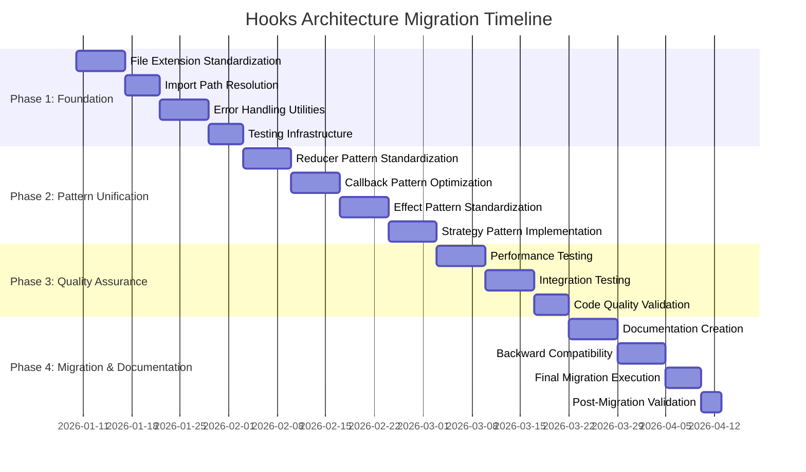

# Hooks Architecture Migration Implementation Roadmap

## Overview

This document provides the complete implementation roadmap for the hooks architecture migration. It consolidates all previous planning documents into actionable steps with clear priorities, timelines, and success criteria.

## Migration Phases Overview



## Phase 1: Foundation (Week 1-2) - PRIORITY: HIGH

### 1.1 File Extension Standardization

**Objective:** Convert logic-only hooks from `.tsx` to `.ts`

**Files to Migrate:**
- `use-mobile.tsx` → `use-mobile.ts`
- `useOfflineDetection.tsx` → `use-offline-detection.ts`
- `useSystem.tsx` → `use-system.ts`
- `useCleanup.tsx` → `use-cleanup.ts`

**Implementation Steps:**
1. Create backup of current files
2. Rename files with correct extensions
3. Update all import statements
4. Verify TypeScript compilation
5. Run existing tests

**Validation:**
- [ ] All files compile without errors
- [ ] All tests pass
- [ ] No import errors in dependent files

**Estimated Time:** 2-3 hours

### 1.2 Import Path Resolution

**Objective:** Fix broken import paths in `client/src/hooks/index.ts`

**Current Issues:**
```typescript
// Broken paths
export { useApiConnection } from '../core/api/hooks';
export { useUnifiedNavigation } from '../core/navigation/hooks';
export { useTimeoutAwareLoading } from '../core/loading/hooks';
```

**Fixed Paths:**
```typescript
// Correct paths
export { useApiConnection } from '../core/api/hooks/useApiConnection';
export { useUnifiedNavigation } from '../core/navigation/hooks/useUnifiedNavigation';
export { useTimeoutAwareLoading } from '../core/loading/hooks/useTimeoutAwareLoading';
```

**Implementation Steps:**
1. Audit all import paths in index.ts
2. Verify target files exist
3. Update import statements
4. Test all imports work correctly
5. Update any broken imports in dependent files

**Validation:**
- [ ] All imports resolve correctly
- [ ] No TypeScript errors
- [ ] All dependent files work

**Estimated Time:** 3-4 hours

### 1.3 Error Handling Utilities

**Objective:** Create unified error handling infrastructure

**Files to Create:**
- `client/src/hooks/utils/error-handling.ts`
- `client/src/hooks/utils/migration.ts`

**Implementation Steps:**
1. Create error handling utilities
2. Define error types and categories
3. Implement recovery strategies
4. Create error handler factory
5. Add comprehensive tests

**Key Features:**
- Unified error handling across all hooks
- Configurable recovery strategies
- Error tracking and monitoring
- Graceful degradation patterns

**Validation:**
- [ ] Error handling utilities work correctly
- [ ] Recovery strategies are configurable
- [ ] Error tracking provides useful insights
- [ ] All tests pass

**Estimated Time:** 1-2 days

### 1.4 Testing Infrastructure

**Objective:** Set up comprehensive testing framework

**Files to Create:**
- `client/src/hooks/__tests__/unit/` (individual hook tests)
- `client/src/hooks/__tests__/integration/` (integration tests)
- `client/src/hooks/__tests__/performance/` (performance tests)
- `client/src/hooks/__tests__/fixtures/` (test utilities)

**Implementation Steps:**
1. Set up test directory structure
2. Create test utilities and mocks
3. Implement test templates
4. Add performance testing utilities
5. Configure test scripts

**Validation:**
- [ ] Test infrastructure is set up
- [ ] Test utilities work correctly
- [ ] Performance testing is available
- [ ] All tests can run

**Estimated Time:** 2-3 days

## Phase 2: Pattern Unification (Week 3-4) - PRIORITY: HIGH

### 2.1 Reducer Pattern Standardization

**Objective:** Standardize state management using pure reducers

**Reference Implementation:** [`use-toast.ts`](client/src/hooks/use-toast.ts:56)

**Implementation Steps:**
1. Analyze existing reducer patterns
2. Create reducer template
3. Standardize reducer functions
4. Move side effects outside reducers
5. Update hooks to use standardized pattern

**Pattern Requirements:**
- Pure reducer functions (no side effects)
- Clear action types
- Immutable state updates
- Side effects in useEffect

**Validation:**
- [ ] All state management uses pure reducers
- [ ] Side effects are properly isolated
- [ ] State updates are predictable
- [ ] Performance is maintained

**Estimated Time:** 2-3 days

### 2.2 Callback Pattern Optimization

**Objective:** Standardize performance optimization patterns

**Reference Implementations:**
- [`useErrorRecovery.ts`](client/src/hooks/useErrorRecovery.ts:129)
- [`useCleanup.tsx`](client/src/hooks/useCleanup.tsx:38)

**Implementation Steps:**
1. Identify performance-critical hooks
2. Implement memoization where needed
3. Standardize useCallback usage
4. Optimize expensive computations
5. Add performance monitoring

**Pattern Requirements:**
- Memoized expensive operations
- Proper dependency arrays
- Performance monitoring
- Memory leak prevention

**Validation:**
- [ ] Performance is optimized
- [ ] Memory usage is controlled
- [ ] Render performance is maintained
- [ ] No performance regressions

**Estimated Time:** 2-3 days

### 2.3 Effect Pattern Standardization

**Objective:** Standardize side effect management

**Reference Implementations:**
- [`useOfflineDetection.tsx`](client/src/hooks/useOfflineDetection.tsx:141)
- [`useToast.ts`](client/src/hooks/use-toast.ts:165)

**Implementation Steps:**
1. Audit all useEffect usage
2. Standardize cleanup patterns
3. Implement proper dependency management
4. Add effect performance optimization
5. Ensure proper cleanup on unmount

**Pattern Requirements:**
- Proper cleanup in return functions
- Correct dependency arrays
- No infinite loops
- Memory leak prevention

**Validation:**
- [ ] All effects have proper cleanup
- [ ] No infinite loops
- [ ] Memory leaks are prevented
- [ ] Dependencies are correct

**Estimated Time:** 2-3 days

### 2.4 Strategy Pattern Implementation

**Objective:** Implement configurable behavior patterns

**Reference Implementation:** [`useErrorRecovery.ts`](client/src/hooks/useErrorRecovery.ts:33)

**Implementation Steps:**
1. Define strategy interfaces
2. Create strategy registry
3. Implement configurable strategies
4. Add strategy selection logic
5. Update hooks to use strategies

**Pattern Requirements:**
- Configurable behavior
- Strategy prioritization
- Conditional strategy application
- Extensible architecture

**Validation:**
- [ ] Strategies are configurable
- [ ] Strategy selection works correctly
- [ ] Behavior is extensible
- [ ] Performance is maintained

**Estimated Time:** 2-3 days

## Phase 3: Quality Assurance (Week 5-6) - PRIORITY: MEDIUM

### 3.1 Performance Testing

**Objective:** Ensure no performance regressions

**Implementation Steps:**
1. Set up performance benchmarks
2. Test memory usage
3. Measure render performance
4. Test bundle size impact
5. Validate performance requirements

**Performance Requirements:**
- Memory usage increase < 5%
- Render performance maintained
- Bundle size increase < 5%
- No memory leaks

**Validation:**
- [ ] Performance benchmarks pass
- [ ] Memory usage is acceptable
- [ ] Render performance is maintained
- [ ] Bundle size impact is minimal

**Estimated Time:** 2-3 days

### 3.2 Integration Testing

**Objective:** Test hook interactions and system integration

**Implementation Steps:**
1. Create integration test suite
2. Test hook interactions
3. Test error handling integration
4. Test performance integration
5. Validate system behavior

**Integration Requirements:**
- Hooks work together correctly
- Error handling is consistent
- Performance is maintained across interactions
- System behavior is predictable

**Validation:**
- [ ] Integration tests pass
- [ ] Hook interactions work correctly
- [ ] Error handling is consistent
- [ ] System behavior is predictable

**Estimated Time:** 2-3 days

### 3.3 Code Quality Validation

**Objective:** Ensure code quality standards are met

**Implementation Steps:**
1. Run ESLint checks
2. Validate TypeScript strict mode
3. Check test coverage
4. Review code complexity
5. Validate documentation

**Quality Requirements:**
- ESLint passes all rules
- TypeScript strict mode enabled
- Test coverage > 90%
- Code complexity acceptable
- Documentation complete

**Validation:**
- [ ] All quality checks pass
- [ ] Test coverage requirements met
- [ ] Code complexity is acceptable
- [ ] Documentation is complete

**Estimated Time:** 1-2 days

## Phase 4: Migration & Documentation (Week 7-8) - PRIORITY: MEDIUM

### 4.1 Documentation Creation

**Objective:** Provide comprehensive documentation

**Files to Create:**
- `client/src/hooks/docs/README.md`
- `client/src/hooks/docs/patterns/`
- `client/src/hooks/docs/migration-guide.md`
- `client/src/hooks/docs/best-practices.md`

**Implementation Steps:**
1. Create main documentation
2. Document all patterns
3. Create migration guide
4. Add best practices
5. Create examples

**Documentation Requirements:**
- Complete pattern documentation
- Clear migration instructions
- Best practices defined
- Examples provided
- API documentation complete

**Validation:**
- [ ] All documentation is complete
- [ ] Migration guide is clear
- [ ] Examples work correctly
- [ ] Best practices are defined
- [ ] API documentation is complete

**Estimated Time:** 2-3 days

### 4.2 Backward Compatibility

**Objective:** Ensure smooth migration with minimal breaking changes

**Implementation Steps:**
1. Create compatibility layer
2. Add deprecation warnings
3. Provide migration utilities
4. Update import paths gradually
5. Monitor for issues

**Compatibility Requirements:**
- Existing code continues to work
- Deprecation warnings are shown
- Migration utilities work correctly
- Rollback mechanisms available

**Validation:**
- [ ] Backward compatibility is maintained
- [ ] Deprecation warnings work
- [ ] Migration utilities function correctly
- [ ] Rollback mechanisms are in place

**Estimated Time:** 2-3 days

### 4.3 Final Migration Execution

**Objective:** Complete the migration with all changes

**Implementation Steps:**
1. Migrate all remaining hooks
2. Update all import statements
3. Remove deprecated code
4. Clean up compatibility layer
5. Final validation

**Migration Requirements:**
- All hooks follow new patterns
- All imports are updated
- Deprecated code is removed
- System is validated

**Validation:**
- [ ] All hooks are migrated
- [ ] All imports are updated
- [ ] Deprecated code is removed
- [ ] System validation passes

**Estimated Time:** 2-3 days

### 4.4 Post-Migration Validation

**Objective:** Validate the complete migration

**Implementation Steps:**
1. Run full test suite
2. Validate performance benchmarks
3. Check bundle size
4. Validate developer experience
5. Gather feedback

**Validation Requirements:**
- All tests pass
- Performance is maintained
- Bundle size is acceptable
- Developer experience is improved
- Feedback is positive

**Validation:**
- [ ] Full test suite passes
- [ ] Performance benchmarks maintained
- [ ] Bundle size is acceptable
- [ ] Developer experience improved
- [ ] Feedback is positive

**Estimated Time:** 1-2 days

## Risk Management

### High Risk Items

#### 1. Breaking Changes
**Risk:** Migration causes breaking changes for existing code
**Mitigation:**
- Comprehensive backward compatibility layer
- Gradual migration approach
- Extensive testing
- Rollback mechanisms

#### 2. Performance Regression
**Risk:** New patterns cause performance issues
**Mitigation:**
- Performance benchmarking
- Memory leak detection
- Render performance testing
- Bundle size monitoring

#### 3. Developer Adoption
**Risk:** Developers resist new patterns
**Mitigation:**
- Clear documentation
- Comprehensive examples
- Training materials
- Gradual rollout

### Medium Risk Items

#### 1. Migration Complexity
**Risk:** Migration is more complex than expected
**Mitigation:**
- Break down into smaller steps
- Parallel implementation approach
- Regular progress reviews
- Flexible timeline

#### 2. Testing Coverage
**Risk:** Testing doesn't catch all issues
**Mitigation:**
- Comprehensive test strategy
- Multiple testing levels
- Performance testing
- Integration testing

## Success Criteria

### Functional Requirements
- [ ] All hooks follow consistent patterns
- [ ] File extensions correctly reflect content type
- [ ] Import paths are valid and consistent
- [ ] Error handling is unified across hooks
- [ ] Test coverage > 90%
- [ ] All tests pass
- [ ] Performance benchmarks maintained
- [ ] Bundle size impact < 5%

### Non-Functional Requirements
- [ ] TypeScript strict mode compliance
- [ ] ESLint rule compliance
- [ ] Developer experience improvement
- [ ] System reliability maintained
- [ ] Memory usage optimized
- [ ] Render performance maintained

### Business Requirements
- [ ] Migration completed within 8 weeks
- [ ] No production downtime
- [ ] Developer productivity maintained
- [ ] Code maintainability improved
- [ ] Future development simplified

## Resource Requirements

### Development Resources
- **Lead Developer:** 1 FTE for 8 weeks
- **Senior Developer:** 1 FTE for 6 weeks
- **QA Engineer:** 0.5 FTE for 4 weeks

### Tools and Infrastructure
- Testing framework setup
- Performance monitoring tools
- Code quality tools
- Documentation tools

### Time Allocation
- **Phase 1:** 1 week
- **Phase 2:** 2 weeks
- **Phase 3:** 2 weeks
- **Phase 4:** 3 weeks
- **Buffer:** 1 week

## Post-Migration Maintenance

### Ongoing Monitoring
- Performance metrics tracking
- Error rate monitoring
- Developer feedback collection
- Code quality metrics

### Future Enhancements
- Additional pattern implementations
- Performance optimizations
- Developer tooling improvements
- Documentation updates

### Support Plan
- Developer support during transition
- Documentation updates as needed
- Bug fixes and improvements
- Regular maintenance reviews

This comprehensive roadmap provides a clear path for successfully migrating the hooks architecture while maintaining system stability and developer productivity.
