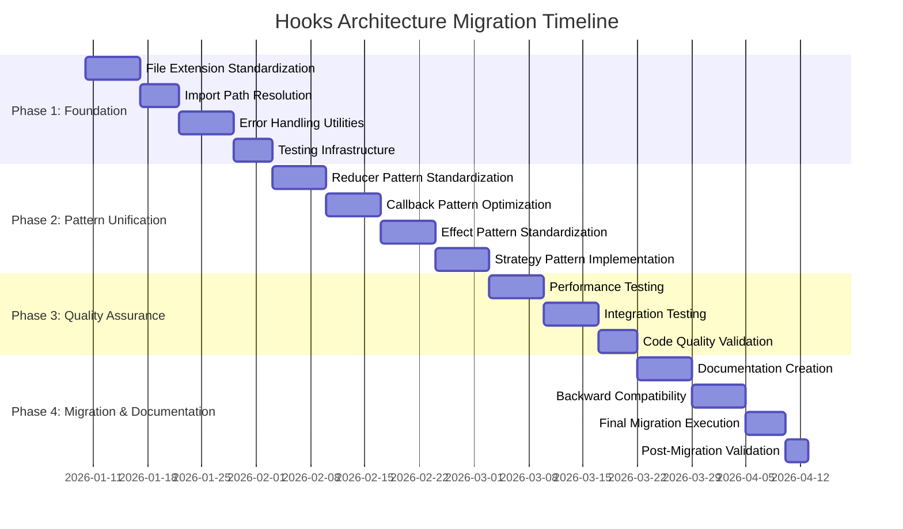

# Hooks Architecture Migration - Complete Implementation Plan

## Executive Summary

This document provides a comprehensive implementation plan for standardizing the hooks architecture in the SimpleTool project. Based on analysis of 25+ hooks, we've identified inconsistencies in file extensions, naming conventions, error handling, and import paths that need to be unified for better maintainability and developer experience.

## Key Findings

### Current State Analysis
- **25+ hooks** with mixed patterns and inconsistencies
- **4 hooks** using incorrect `.tsx` extensions for logic-only functionality
- **Import path issues** in main index file referencing non-existent paths
- **Inconsistent error handling** across hooks
- **Mixed naming conventions** and export patterns

### Identified Patterns
1. **Reducer Pattern** - Well-implemented in [`use-toast.ts`](client/src/hooks/use-toast.ts:56)
2. **Callback Pattern** - Optimized in [`useErrorRecovery.ts`](client/src/hooks/useErrorRecovery.ts:129)
3. **Effect Pattern** - Properly managed in [`useOfflineDetection.tsx`](client/src/hooks/useOfflineDetection.tsx:141)
4. **Strategy Pattern** - Configurable in [`useErrorRecovery.ts`](client/src/hooks/useErrorRecovery.ts:33)

## Implementation Plan Overview

### Phase 1: Foundation (Week 1-2) - HIGH PRIORITY
- **File Extension Standardization**: Convert 4 hooks from `.tsx` to `.ts`
- **Import Path Resolution**: Fix broken paths in `client/src/hooks/index.ts`
- **Error Handling Utilities**: Create unified error handling infrastructure
- **Testing Infrastructure**: Set up comprehensive testing framework

### Phase 2: Pattern Unification (Week 3-4) - HIGH PRIORITY
- **Reducer Pattern Standardization**: Apply pure reducer pattern consistently
- **Callback Pattern Optimization**: Standardize performance optimization
- **Effect Pattern Standardization**: Unify side effect management
- **Strategy Pattern Implementation**: Implement configurable behavior patterns

### Phase 3: Quality Assurance (Week 5-6) - MEDIUM PRIORITY
- **Performance Testing**: Ensure no performance regressions
- **Integration Testing**: Test hook interactions
- **Code Quality Validation**: Verify standards compliance

### Phase 4: Migration & Documentation (Week 7-8) - MEDIUM PRIORITY
- **Documentation Creation**: Comprehensive guides and examples
- **Backward Compatibility**: Smooth migration with minimal breaking changes
- **Final Migration Execution**: Complete the migration
- **Post-Migration Validation**: Validate success criteria

## Deliverables Created

### 1. Main Implementation Plan
**File:** [`HOOKS_ARCHITECTURE_MIGRATION_PLAN.md`](client/src/hooks/HOOKS_ARCHITECTURE_MIGRATION_PLAN.md)
- Comprehensive overview of current state
- Detailed migration strategy
- Risk mitigation plans
- Success criteria

### 2. Standardization Guidelines
**File:** [`STANDARDIZATION_GUIDELINES.md`](client/src/hooks/STANDARDIZATION_GUIDELINES.md)
- File organization and naming conventions
- Hook pattern templates and examples
- Performance and testing standards
- Code quality requirements

### 3. Error Handling Unification
**File:** [`ERROR_HANDLING_UNIFICATION.md`](client/src/hooks/ERROR_HANDLING_UNIFICATION.md)
- Unified error handling architecture
- Error recovery strategies
- Error types and classification
- Integration with existing hooks

### 4. Testing Strategy
**File:** [`TESTING_STRATEGY.md`](client/src/hooks/TESTING_STRATEGY.md)
- Comprehensive testing pyramid
- Unit, integration, and performance testing
- Test utilities and helpers
- Continuous integration setup

### 5. Backward Compatibility Plan
**File:** [`BACKWARD_COMPATIBILITY_PLAN.md`](client/src/hooks/BACKWARD_COMPATIBILITY_PLAN.md)
- Compatibility layer implementation
- Migration utilities and scripts
- Rollback mechanisms
- Validation testing

### 6. Implementation Roadmap
**File:** [`IMPLEMENTATION_ROADMAP.md`](client/src/hooks/IMPLEMENTATION_ROADMAP.md)
- Detailed timeline with Gantt chart
- Phase-by-phase implementation steps
- Resource requirements
- Risk management strategies

## Key Benefits

### For Developers
- **Consistent Patterns**: All hooks follow the same architectural patterns
- **Better Developer Experience**: Clear documentation and examples
- **Reduced Cognitive Load**: Predictable hook behavior
- **Easier Maintenance**: Standardized error handling and testing

### For the System
- **Improved Reliability**: Consistent error handling and recovery
- **Better Performance**: Optimized patterns and memory management
- **Enhanced Maintainability**: Clear separation of concerns
- **Future-Proof Architecture**: Extensible patterns for new hooks

### For the Project
- **Reduced Technical Debt**: Standardized architecture
- **Faster Development**: Reusable patterns and utilities
- **Better Quality**: Comprehensive testing and validation
- **Smooth Migration**: Backward compatibility maintained

## Implementation Timeline

## Success Criteria

### Functional Requirements
- [ ] All hooks follow consistent patterns
- [ ] File extensions correctly reflect content type
- [ ] Import paths are valid and consistent
- [ ] Error handling is unified across hooks
- [ ] Test coverage > 90%
- [ ] All tests pass
- [ ] Performance benchmarks maintained
- [ ] Bundle size impact < 5%

### Non-Functional Requirements
- [ ] TypeScript strict mode compliance
- [ ] ESLint rule compliance
- [ ] Developer experience improvement
- [ ] System reliability maintained
- [ ] Memory usage optimized
- [ ] Render performance maintained

## Next Steps

### Immediate Actions (Next 1-2 Weeks)
1. **Review and approve** this implementation plan
2. **Set up development environment** for migration
3. **Begin Phase 1 implementation** starting with file extension standardization
4. **Establish regular progress reviews** with architecture team

### Short-term Goals (Next 1-2 Months)
1. **Complete Phase 1-2** implementation
2. **Validate patterns** with comprehensive testing
3. **Begin gradual migration** of existing code
4. **Monitor performance** and developer feedback

### Long-term Goals (Next 3-6 Months)
1. **Complete full migration** with all phases
2. **Establish new development standards** for future hooks
3. **Create training materials** for development team
4. **Measure success** against defined criteria

## Risk Mitigation

### High Risk Items
1. **Breaking Changes**: Mitigated through comprehensive backward compatibility layer
2. **Performance Regression**: Mitigated through extensive performance testing
3. **Developer Adoption**: Mitigated through clear documentation and examples

### Medium Risk Items
1. **Migration Complexity**: Mitigated through gradual, phased approach
2. **Testing Coverage**: Mitigated through comprehensive test strategy
3. **Timeline Delays**: Mitigated through flexible planning and resource allocation

## Conclusion

This comprehensive implementation plan provides a clear roadmap for standardizing the hooks architecture in the SimpleTool project. The plan addresses all identified inconsistencies while maintaining backward compatibility and ensuring system reliability.

The migration will be executed over 8 weeks with clear milestones, comprehensive testing, and risk mitigation strategies. The result will be a more maintainable, reliable, and developer-friendly hooks architecture that supports the project's long-term goals.

**Prepared by:** Kilo Code Architect  
**Date:** January 7, 2026  
**Status:** Ready for Review and Implementation
