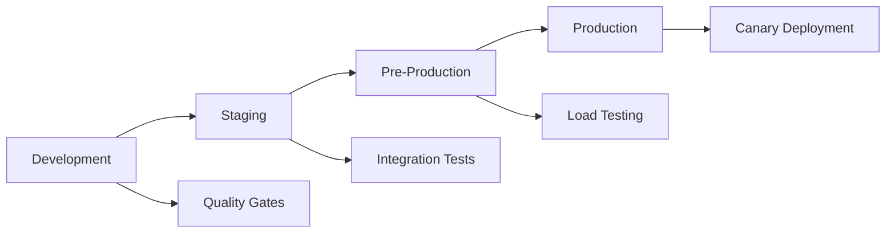

# Chanuka Client - Production Deployment and Monitoring

This document provides comprehensive guidance for deploying and monitoring the Chanuka Client application in production environments.

## Overview

The production deployment system includes:

- **Advanced Bundle Optimization** - Intelligent code splitting and compression
- **CDN Deployment** - Global content distribution with aggressive caching
- **Comprehensive Error Monitoring** - Sentry integration with real-time alerts
- **Performance Monitoring** - Real User Metrics (RUM) collection and analysis
- **Multi-Environment Pipeline** - Staging, pre-production, and production deployments
- **Monitoring Dashboards** - System health, user experience, and business metrics

## Quick Start

### Prerequisites

1. **Node.js 18+** and **pnpm 8+**
2. **AWS CLI** configured with appropriate permissions
3. **Sentry account** for error monitoring
4. **Datadog account** for monitoring dashboards (optional)

### Environment Setup

```bash
# Install dependencies
pnpm install

# Copy environment configuration
cp deployment/environment-configs/production.env client/.env.production

# Configure monitoring
export REACT_APP_SENTRY_DSN="your-sentry-dsn"
export DATADOG_API_KEY="your-datadog-api-key"
export DATADOG_APP_KEY="your-datadog-app-key"
```

### Build and Deploy

```bash
# Build for production with optimization
pnpm run build:production

# Analyze bundle performance
pnpm run build:analyze

# Check performance budgets
pnpm run test:performance-budget production

# Deploy to CDN
pnpm run cdn:deploy

# Set up monitoring dashboards
pnpm run monitoring:setup
```

## Architecture

### Build Optimization

The production build system includes:

#### Advanced Bundle Analysis
- **Chunk Splitting**: Vendor, feature, and route-based chunks
- **Compression**: Gzip and Brotli compression
- **Performance Budgets**: Automated budget enforcement
- **Bundle Visualization**: Interactive treemap analysis

```typescript
// Example chunk configuration
manualChunks: {
  'react-vendor': ['react', 'react-dom'],
  'router-vendor': ['react-router-dom'],
  'bills-feature': ['./src/components/bills', './src/pages/bills'],
  'community-feature': ['./src/components/community'],
}
```

#### Performance Budgets by Environment

| Environment | JS Budget | CSS Budget | Images Budget | Total Budget |
|-------------|-----------|------------|---------------|--------------|
| Development | 200KB     | 100KB      | 500KB         | 1MB          |
| Staging     | 150KB     | 75KB       | 400KB         | 800KB        |
| Production  | 100KB     | 50KB       | 300KB         | 600KB        |

### CDN Configuration

#### CloudFront Distribution
- **Global Edge Locations**: Optimized for Kenya and global users
- **Aggressive Caching**: 1-year cache for static assets
- **Compression**: Automatic Gzip/Brotli compression
- **Security**: WAF integration and security headers

#### Cache Strategies
```javascript
// Static assets (JS/CSS with hashes)
'Cache-Control': 'public, max-age=31536000, immutable'

// Images
'Cache-Control': 'public, max-age=2592000' // 30 days

// HTML files
'Cache-Control': 'public, max-age=0, must-revalidate'
```

### Error Monitoring

#### Sentry Integration
- **Real-time Error Tracking**: Automatic error capture and alerting
- **Performance Monitoring**: Transaction tracing and Core Web Vitals
- **Session Replay**: Visual debugging for error reproduction
- **Release Tracking**: Deployment correlation with error rates

#### Error Classification
```typescript
// Error severity levels
Critical: App cannot function (authentication failure)
High: Feature unavailable (WebSocket disconnection)  
Medium: Degraded experience (slow API response)
Low: Minor issue (image loading failure)
```

#### Sample Configuration
```typescript
Sentry.init({
  dsn: process.env.REACT_APP_SENTRY_DSN,
  environment: 'production',
  sampleRate: 0.1, // 10% of errors
  tracesSampleRate: 0.05, // 5% of transactions
  replaysSessionSampleRate: 0.01, // 1% of sessions
  replaysOnErrorSampleRate: 1.0, // 100% of error sessions
});
```

### Performance Monitoring

#### Real User Metrics (RUM)
- **Core Web Vitals**: LCP, FID, CLS, FCP, TTFB
- **Custom Metrics**: Time to Interactive, Memory Usage
- **Resource Timing**: Network performance analysis
- **User Experience**: Session duration, bounce rate

#### Performance Thresholds
```typescript
const thresholds = {
  lcp: 2500,    // Largest Contentful Paint < 2.5s
  fid: 100,     // First Input Delay < 100ms
  cls: 0.1,     // Cumulative Layout Shift < 0.1
  fcp: 1800,    // First Contentful Paint < 1.8s
  ttfb: 800,    // Time to First Byte < 800ms
};
```

## Deployment Pipeline

### Multi-Environment Strategy



### Quality Gates

Before any deployment, the following checks must pass:

1. **Code Quality**
   - ESLint with zero violations
   - TypeScript strict mode compilation
   - Prettier formatting compliance

2. **Testing**
   - Unit tests (80%+ coverage)
   - Integration tests
   - Accessibility tests (WCAG 2.1 AA)
   - End-to-end tests

3. **Performance**
   - Bundle size within budgets
   - Core Web Vitals thresholds
   - Lighthouse performance score > 90

4. **Security**
   - Dependency vulnerability scan
   - Security headers validation
   - CSP policy compliance

### Deployment Environments

#### Development
- **Purpose**: Feature development and testing
- **URL**: https://dev.chanuka.ke
- **Monitoring**: Full debugging enabled
- **Deployment**: Automatic on `develop` branch

#### Staging
- **Purpose**: Integration testing and QA
- **URL**: https://staging.chanuka.ke
- **Monitoring**: Production-like monitoring
- **Deployment**: Manual approval required

#### Pre-Production
- **Purpose**: Final validation before production
- **URL**: https://preprod.chanuka.ke
- **Monitoring**: Full production monitoring
- **Deployment**: Blue-green deployment strategy

#### Production
- **Purpose**: Live application
- **URL**: https://chanuka.ke
- **Monitoring**: Comprehensive monitoring and alerting
- **Deployment**: Canary deployment with gradual rollout

### Canary Deployment Process

1. **5% Traffic**: Deploy to canary environment, monitor for 15 minutes
2. **25% Traffic**: Increase traffic, monitor for 10 minutes
3. **100% Traffic**: Full deployment with continuous monitoring
4. **Rollback**: Automatic rollback on error rate > 2%

## Monitoring Dashboards

### System Health Dashboard

Monitors core infrastructure metrics:

- **Error Rate**: Application error percentage
- **Response Time**: API response latency
- **Uptime**: Service availability
- **Active Users**: Real-time user count
- **Memory Usage**: Client-side memory consumption
- **CDN Performance**: Cache hit rates and edge performance

### User Experience Dashboard

Tracks user-facing performance:

- **Core Web Vitals**: LCP, FID, CLS metrics
- **Page Load Times**: Route-specific performance
- **User Satisfaction**: Calculated satisfaction score
- **Bounce Rate**: User engagement metrics
- **Session Duration**: Average time spent
- **Device Performance**: Performance by device type

### Business Metrics Dashboard

Measures civic engagement:

- **Daily Active Users**: User engagement trends
- **Bill Engagement**: Views, saves, comments
- **User Journey Funnel**: Conversion rates
- **Geographic Distribution**: User location analytics
- **Feature Adoption**: Feature usage rates
- **Conversion Metrics**: Goal completion rates

### Real-time Operations Dashboard

For incident response:

- **Live User Count**: Current active users
- **Error Stream**: Real-time error feed
- **Performance Alerts**: Active performance issues
- **Deployment Timeline**: Recent deployment events
- **API Health Matrix**: Service dependency status
- **WebSocket Connections**: Real-time connection health

## Alerting Strategy

### Critical Alerts (Immediate Response)

- **Error Rate > 5%**: High error rate detected
- **Response Time > 2s**: Slow response times
- **Uptime < 99%**: Service availability issues
- **Core Web Vitals Degradation**: Performance regression

### Warning Alerts (Monitor Closely)

- **Error Rate > 2%**: Elevated error rate
- **Memory Usage > 150MB**: High memory consumption
- **Bundle Size Increase > 20%**: Significant size increase
- **User Satisfaction < 60%**: Poor user experience

### Notification Channels

- **Slack**: `#chanuka-alerts` for all alerts
- **Email**: Critical alerts to on-call team
- **SMS**: Production-down alerts only
- **Datadog**: Dashboard notifications

## Security Considerations

### Content Security Policy (CSP)

```javascript
const csp = {
  "default-src": ["'self'"],
  "script-src": ["'self'", "'nonce-{NONCE}'", "https://cdn.chanuka.ke"],
  "style-src": ["'self'", "'unsafe-inline'", "https://cdn.chanuka.ke"],
  "img-src": ["'self'", "data:", "https:", "blob:"],
  "connect-src": ["'self'", "https://api.chanuka.ke", "wss://ws.chanuka.ke"],
  "frame-ancestors": ["'none'"],
};
```

### Security Headers

- **HSTS**: `max-age=31536000; includeSubDomains; preload`
- **X-Content-Type-Options**: `nosniff`
- **X-Frame-Options**: `DENY`
- **X-XSS-Protection**: `1; mode=block`
- **Referrer-Policy**: `strict-origin-when-cross-origin`

## Troubleshooting

### Common Issues

#### High Error Rate
1. Check Sentry dashboard for error details
2. Review recent deployments
3. Check API service health
4. Verify CDN configuration

#### Poor Performance
1. Analyze Core Web Vitals metrics
2. Check bundle size reports
3. Review resource timing data
4. Verify CDN cache hit rates

#### Deployment Failures
1. Check build logs for errors
2. Verify environment configuration
3. Test performance budgets
4. Validate security headers

### Rollback Procedures

#### Automatic Rollback Triggers
- Error rate > 5% for 5 minutes
- Core Web Vitals degradation > 50%
- Critical security vulnerability detected

#### Manual Rollback Process
```bash
# Emergency rollback to previous version
aws s3 sync s3://chanuka-client-production-backup/ s3://chanuka-client-production --delete
aws cloudfront create-invalidation --distribution-id $DISTRIBUTION_ID --paths "/*"
```

## Performance Optimization

### Bundle Optimization Techniques

1. **Code Splitting**: Route and feature-based splitting
2. **Tree Shaking**: Remove unused code
3. **Dynamic Imports**: Lazy load heavy components
4. **Vendor Chunking**: Separate vendor libraries
5. **Asset Optimization**: Image compression and WebP conversion

### Runtime Optimization

1. **Virtual Scrolling**: For large lists
2. **Memoization**: Cache expensive computations
3. **Debouncing**: Optimize user input handling
4. **Web Workers**: Offload heavy processing
5. **Service Workers**: Cache resources and enable offline functionality

## Maintenance

### Regular Tasks

#### Daily
- Monitor error rates and performance metrics
- Review deployment pipeline health
- Check security alerts

#### Weekly
- Analyze performance trends
- Review bundle size reports
- Update dependency vulnerabilities

#### Monthly
- Performance budget review
- Monitoring dashboard optimization
- Security audit and updates

### Capacity Planning

Monitor these metrics for scaling decisions:

- **User Growth**: Plan for 2x current capacity
- **API Load**: Monitor response times and error rates
- **CDN Usage**: Track bandwidth and request patterns
- **Storage**: Monitor asset storage growth

## Support and Documentation

### Resources

- **Deployment Pipeline**: `.github/workflows/deploy.yml`
- **Monitoring Config**: `deployment/monitoring-dashboards.js`
- **CDN Config**: `deployment/cdn-config.js`
- **Performance Budgets**: `client/scripts/performance-budget-check.js`

### Team Contacts

- **DevOps Team**: devops@chanuka.ke
- **Frontend Team**: frontend@chanuka.ke
- **On-Call**: +254-XXX-XXXX (24/7 support)

### Emergency Procedures

For production incidents:

1. **Assess Impact**: Check monitoring dashboards
2. **Communicate**: Notify stakeholders via Slack
3. **Mitigate**: Implement immediate fixes or rollback
4. **Document**: Record incident details and resolution
5. **Post-Mortem**: Conduct review within 48 hours

---

This deployment and monitoring system ensures the Chanuka Client application maintains high availability, performance, and user experience while providing comprehensive visibility into system health and user behavior.