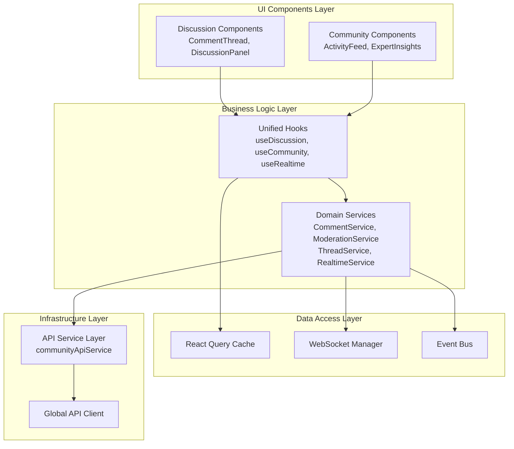

# Discussion and Community Implementation Comparative Analysis

## Executive Summary

This analysis compares the discussion and community implementations in the client codebase, identifying significant architectural inconsistencies, overlapping concepts, and integration opportunities. The current implementations suffer from duplicate type definitions, inconsistent state management approaches, and incomplete feature implementations that prevent seamless integration.

## Current Implementation Overview

### Discussion Implementation (`useDiscussion.ts`)

**Architecture:**
- React hook-based approach using React Query for state management
- WebSocket integration for real-time updates via `CommunityWebSocketManager`
- Event-driven architecture using `eventBus` for cross-component communication
- Thin abstraction layer over community hooks

**Key Features:**
- Real-time comment updates and typing indicators
- Comment CRUD operations (create, update, delete, vote)
- Moderation capabilities (report, moderate - incomplete)
- Thread aggregation from flat comment structure

**Issues Identified:**
- Mock thread creation from comments data (lines 82-96)
- Incomplete moderation implementations (lines 217-240)
- Type casting issues (`as any` usage)
- Dependency on community hooks for core functionality

### Community Implementation (`useCommunity.ts`)

**Architecture:**
- Comprehensive React Query-based state management
- Extensive hook collection covering multiple community features
- API service abstraction via `communityApiService`
- Feature-sliced architecture with separate hooks for different concerns

**Key Features:**
- Comments management with full CRUD operations
- Thread management (create, update, delete, retrieve)
- Social features (sharing, stats, activity feeds)
- Expert insights and trending topics
- Search and discovery functionality

**Issues Identified:**
- Many hooks return empty promises (e.g., `useSocialSharing`, `useCampaigns`)
- Incomplete API implementations noted in comments
- Duplicate type definitions in API service
- Over-engineered for current feature set

## Comparative Analysis

### Architectural Approaches

| Aspect | Discussion Implementation | Community Implementation |
|--------|--------------------------|--------------------------|
| **State Management** | React Query + WebSocket events | React Query only |
| **Data Flow** | Event-driven with real-time updates | Query-based with cache invalidation |
| **Abstraction Level** | High-level discussion features | Low-level API operations |
| **Real-time Support** | Native WebSocket integration | No real-time capabilities |
| **Completeness** | Partial (moderation incomplete) | Partial (many features stubbed) |

### Type System Analysis

**Duplicate Type Definitions:**

1. **Comment Interface** - Defined in both `types/discussion.ts` and `core/api/community.ts`
   - `discussion.ts`: Comprehensive with threading, moderation, quality metrics
   - `community.ts`: Minimal subset with different field names (`body` vs `content`)

2. **DiscussionThread Interface** - Multiple inconsistent definitions
   - `discussion.ts`: Rich metadata with engagement metrics
   - `community.ts`: Basic structure with minimal fields
   - `types/community.ts`: Minimal version with different field structure

3. **Moderation Types** - Inconsistent violation type definitions
   - `discussion.ts`: 9 violation types including `copyright_violation`
   - `community.ts`: 5 violation types, different naming (`offensive` vs `inappropriate_language`)

### Import Path Inconsistencies

```typescript
// Inconsistent import patterns found:
import { Comment } from '../../../types/discussion';  // useDiscussion.ts
import { Comment } from '../../../types/community';  // Some components
import type { Comment } from '../../../core/api/community';  // API service
```

### State Management Conflicts

**React Query vs Event Bus:**
- Discussion uses EventBus for real-time updates
- Community relies on React Query cache invalidation
- No unified approach for real-time data synchronization

**API Contract Mismatches:**
- Discussion expects `bill_id` in requests
- Community API uses `billId` in some places, `bill_id` in others
- Inconsistent parameter naming throughout

## Overlapping Concepts and Conflicts

### 1. Comment Management
**Overlap:** Both implementations handle comment CRUD operations
**Conflict:** Different interfaces and API expectations
**Impact:** Type casting required (`as any`) in useDiscussion.ts

### 2. Thread vs Discussion Concepts
**Overlap:** Both represent comment collections
**Conflict:** Discussion creates mock threads, Community has real thread entities
**Impact:** Conceptual confusion about data boundaries

### 3. Moderation Systems
**Overlap:** Both implement reporting and moderation
**Conflict:** Discussion has comprehensive types, Community has stubbed implementations
**Impact:** Incomplete moderation workflow

### 4. Real-time Features
**Overlap:** Both attempt real-time updates
**Conflict:** Different mechanisms (WebSocket vs cache invalidation)
**Impact:** Inconsistent user experience

## Component Relationships Map

```
Discussion Layer (useDiscussion.ts)
├── WebSocket Manager (CommunityWebSocketManager)
├── Event Bus (eventBus)
└── Community Hooks (useComments, etc.)
    └── API Service (communityApiService)
        ├── Global API Client
        └── Error Handler

Community Layer (useCommunity.ts)
├── React Query Cache
├── Multiple Specialized Hooks
│   ├── useComments
│   ├── useThreads
│   ├── useSocialSharing (stubbed)
│   ├── useCommunityStats (stubbed)
│   └── useExpertInsights
└── API Service (communityApiService)
    └── Same as above
```

## Integration Points and Shared Functionality

### High-Priority Integration Points

1. **Unified Comment System**
   - Single Comment interface across all layers
   - Consistent API contracts
   - Shared CRUD operations

2. **Real-time Infrastructure**
   - Unified WebSocket management
   - Consistent event handling
   - Shared typing indicators and presence

3. **Moderation Workflow**
   - Complete moderation implementation
   - Unified reporting system
   - Consistent violation types

4. **Thread/Discussion Unification**
   - Clear separation of concerns
   - Consistent data models
   - Unified pagination and filtering

### Shared Functionality Opportunities

1. **API Service Consolidation**
   - Remove duplicate type definitions
   - Standardize parameter naming
   - Implement missing endpoints

2. **Hook Composition**
   - Combine discussion and community hooks
   - Eliminate redundant implementations
   - Create higher-level abstractions

3. **Component Reuse**
   - Unified comment rendering
   - Shared moderation UI
   - Consistent real-time indicators

## Proposed Unified Architecture

### Core Principles

1. **Single Source of Truth** - One comprehensive type system
2. **Layered Architecture** - Clear separation between UI, business logic, and data
3. **Real-time First** - Consistent real-time capabilities across features
4. **Progressive Enhancement** - Graceful degradation for incomplete features

### Recommended Architecture



### Implementation Strategy

#### Phase 1: Type System Consolidation
1. Merge duplicate type definitions into single source
2. Update all imports to use unified types
3. Resolve naming inconsistencies (bill_id vs billId)

#### Phase 2: API Service Refactoring
1. Remove duplicate types from API service
2. Standardize parameter naming conventions
3. Implement missing API endpoints
4. Add comprehensive error handling

#### Phase 3: Hook Unification
1. Create unified comment/thread management hooks
2. Implement complete moderation workflow
3. Consolidate real-time features
4. Remove stubbed implementations

#### Phase 4: Component Integration
1. Update components to use unified hooks
2. Implement shared UI components
3. Add comprehensive testing
4. Performance optimization

## Code Reuse and Consolidation Opportunities

### Immediate Opportunities

1. **Type Definitions** - Consolidate into single `types/community.ts` file
2. **API Methods** - Merge duplicate CRUD operations
3. **Real-time Logic** - Extract WebSocket management into shared service
4. **Validation Logic** - Create shared comment validation utilities

### Medium-term Opportunities

1. **Component Library** - Shared comment, thread, and moderation components
2. **Hook Composition** - Higher-order hooks for common patterns
3. **State Management** - Unified real-time state management strategy
4. **Error Handling** - Consistent error boundaries and user feedback

### Long-term Opportunities

1. **Micro-frontend Architecture** - Separate discussion and community as independent features
2. **Plugin System** - Extensible moderation and feature system
3. **Advanced Real-time** - WebRTC-based features, advanced presence
4. **Machine Learning** - Automated moderation, content recommendations

## Specific Recommendations

### 1. Resolve Type Conflicts
```typescript
// Recommended: Single Comment interface in types/community.ts
export interface Comment {
  id: string;
  billId: number;
  parentId?: string;
  authorId: string;
  authorName: string;
  authorAvatar?: string;
  content: string; // Standardized field name
  createdAt: string;
  updatedAt: string;
  editedAt?: string;
  // ... rest of comprehensive interface
}
```

### 2. Standardize API Contracts
```typescript
// Consistent parameter naming
interface CreateCommentRequest {
  billId: number; // camelCase consistently
  content: string;
  parentId?: string;
}
```

### 3. Implement Missing Features
- Complete moderation workflow in community hooks
- Real-time features in community implementation
- Social sharing functionality
- Expert insights integration

### 4. Performance Optimizations
- Implement proper caching strategies
- Add optimistic updates for better UX
- Lazy load non-critical features
- Bundle splitting for better loading performance

## Conclusion

The current discussion and community implementations represent significant architectural debt with overlapping functionality, inconsistent patterns, and incomplete features. A unified architecture focusing on type consolidation, API standardization, and feature completeness will enable better code reuse, improved maintainability, and enhanced user experience.

The proposed phased approach allows for incremental improvement while maintaining system stability, with clear integration points that can be tackled independently.