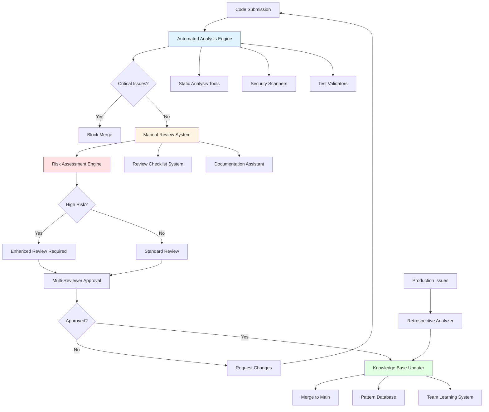
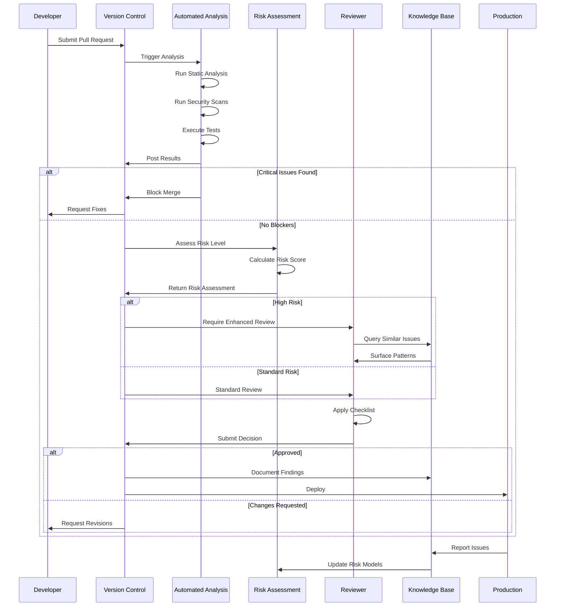

# Design Document: AI-Generated Code Review Framework
## System Overview

**Document Version:** 1.0  
**Date:** October 14, 2025  
**Related Documents:** Requirements Document (AI-Generated Code Review Framework)  
**Architecture Owner:** Technical Lead & Security Architect Personas

### Current State Challenges

Development teams have integrated AI coding assistants into their workflows without establishing appropriate verification mechanisms for the unique failure modes these tools introduce. The current state presents several critical challenges that this framework must address.

Traditional code review processes were designed to catch human errors—logic mistakes, oversight of edge cases, inconsistent patterns, or knowledge gaps where developers indicate uncertainty. These review processes assume that code which looks polished and confident is likely correct, because human developers who lack knowledge typically write tentative code or ask clarifying questions. AI-generated code inverts this assumption by producing polished, confident-looking code regardless of correctness, making superficial review insufficient for catching issues.

Teams currently lack systematic approaches for identifying AI-specific failure patterns. Reviewers apply inconsistent scrutiny depending on their individual awareness of AI limitations. High-risk code receives the same review attention as low-risk functionality. Tests achieve high coverage metrics while providing minimal regression protection because they test implementation details rather than behavioral contracts. Security vulnerabilities that appear in tutorial code and training data—hardcoded credentials, missing input validation, SQL injection through string concatenation—pass review because they look intentional rather than accidental.

The accumulated technical debt from months of AI-assisted development without appropriate safeguards creates maintenance burden that compounds over time. Code that worked correctly when merged becomes difficult to modify as requirements change. Intermittent bugs appear in production that are difficult to reproduce because they occur in edge cases that weren't tested. Resource leaks create problems under load that weren't visible during development testing.

### Architectural Vision

This framework establishes a multi-layered verification system that catches AI-specific issues through a combination of automated tooling, structured manual review processes, and knowledge-building feedback loops. The architecture balances thoroughness with sustainability, ensuring enhanced scrutiny does not create development bottlenecks that make the framework impractical to maintain.

The system operates on the principle of defense in depth, with each layer catching different categories of issues. Automated checks execute first, filtering out obvious problems before human attention is required. Structured manual review then applies systematic verification using checklists and guidelines that target known AI failure patterns. Enhanced review requirements apply to high-risk code areas regardless of whether AI assistance was used. Finally, feedback loops capture learnings from both caught and missed issues, continuously improving the framework's effectiveness.

The framework integrates into existing development workflows rather than replacing them, augmenting current code review practices with AI-specific verification steps. This integration approach reduces adoption friction and allows teams to implement the framework incrementally, starting with high-risk areas and expanding coverage as the team builds familiarity with the patterns.

---

## High-Level System Architecture

The framework consists of five primary subsystems that work together to provide comprehensive verification of potentially AI-generated code. Each subsystem addresses specific requirements from the requirements document and can be implemented independently, though they provide maximum value when integrated into a complete system.



This architectural diagram illustrates the primary flow of code through the review system and the feedback mechanisms that enable continuous improvement. The automated analysis engine serves as the first line of defense, executing without human intervention. The manual review system provides structured guidance for human reviewers. The risk assessment engine determines the appropriate level of scrutiny. The knowledge base updater captures learnings and makes them available to future reviews.

---

## Component Specifications

### Automated Analysis Engine

**Purpose:** Execute automated verification checks that can reliably detect AI-specific issues without human judgment, filtering out obvious problems before manual review begins.

**Responsibilities:** The automated analysis engine orchestrates multiple analysis tools, aggregates their results into a unified report, and enforces blocking conditions that prevent merge of code with critical issues. It serves requirements FR-001 (Surface-Level Verification), portions of FR-003 (Security scanning), and NFR-001 (Performance efficiency).

**Key Features:** The engine executes static analysis to detect type errors, unused imports, and code complexity metrics. Security scanning identifies hardcoded secrets, SQL injection patterns, and missing input validation. Dependency validation verifies all imported modules exist and are properly declared. Test execution runs the test suite and verifies consistent pass rates. Result aggregation combines findings from multiple tools into a single prioritized report with file and line number references.

**Integration Points:** The engine integrates with the version control system to trigger on pull request creation or update. It interfaces with static analysis tools like ESLint, Pylint, TypeScript compiler, and equivalent tools for other languages. Security scanners including Semgrep, Bandit, and dependency vulnerability checkers provide security findings. The engine writes results to the code review platform as comments on the pull request and updates merge blocking status.

**Configuration Interface:**
```typescript
interface AutomatedAnalysisConfig {
  // Analysis tools to execute
  enabledAnalyzers: {
    staticAnalysis: boolean;
    securityScanning: boolean;
    dependencyValidation: boolean;
    testExecution: boolean;
    complexityAnalysis: boolean;
  };
  
  // Blocking thresholds that prevent merge
  blockingThresholds: {
    criticalSecurityIssues: number; // Block if >= this count (typically 1)
    highSecurityIssues: number; // Block threshold for high severity
    testFailures: number; // Block if any tests fail (typically 0)
    maxComplexity: number; // Maximum cyclomatic complexity allowed
    minTestCoverage: number; // Minimum code coverage percentage
  };
  
  // Tool-specific configurations
  staticAnalysisRules: Record<string, unknown>;
  securityScannerConfig: Record<string, unknown>;
  
  // Performance settings
  timeoutMinutes: number; // Maximum execution time before cancellation
  parallelExecution: boolean; // Run analyzers in parallel
}

interface AnalysisResult {
  status: 'passed' | 'failed' | 'warning';
  blocksMerge: boolean;
  executionTimeMs: number;
  
  findings: Finding[];
  summary: {
    critical: number;
    high: number;
    medium: number;
    low: number;
    info: number;
  };
}

interface Finding {
  severity: 'critical' | 'high' | 'medium' | 'low' | 'info';
  category: string; // e.g., 'security', 'complexity', 'type-error'
  message: string;
  location: {
    file: string;
    line: number;
    column?: number;
  };
  suggestion?: string; // Automated fix suggestion when available
  ruleId: string; // Reference to specific rule that triggered
}
```

**Implementation Considerations:** The engine must handle timeouts gracefully when analysis tools hang or take excessive time. Results should cache based on file content hashes to avoid re-analyzing unchanged files. The system should support incremental analysis, only examining changed files and their dependents. Error handling must distinguish between analysis failures due to code issues versus tool failures, treating the latter as non-blocking system errors that alert platform maintainers.

---

### Manual Review System

**Purpose:** Provide structured guidance to human reviewers, ensuring systematic application of the framework's verification steps while maintaining flexibility for reviewer judgment.

**Responsibilities:** The manual review system presents reviewers with layer-specific checklists, tracks checklist completion, provides contextual guidance and examples, surfaces relevant historical findings from the knowledge base, and records reviewer decisions for future reference. It addresses requirements FR-001 through FR-006 by structuring the manual review process and NFR-002 (Usability) by making the framework accessible to reviewers.

**Key Features:** Dynamic checklist generation creates review checklists customized to the specific code changes, emphasizing areas relevant to the files being modified. Inline documentation provides examples of problematic patterns and correct alternatives directly in the review interface. Progress tracking shows which checklist items each reviewer has verified. Historical context surfaces similar issues found in previous reviews of related code. Decision capture records which verification steps were performed and any issues found or explicitly cleared.

**Integration Points:** The system integrates tightly with the code review platform (GitHub, GitLab, Bitbucket) to present checklists as part of the review interface. It queries the knowledge base for relevant historical findings. Risk assessment results influence which checklist items appear and whether enhanced review is required. Review decisions write back to the knowledge base for future reference.

**Data Structures:**
```typescript
interface ReviewChecklist {
  pullRequestId: string;
  reviewLayer: 'surface' | 'logic' | 'security' | 'production' | 'maintainability' | 'testing';
  
  items: ChecklistItem[];
  requiredCompletionPercentage: number; // Minimum % to approve
  estimatedTimeMinutes: number;
}

interface ChecklistItem {
  id: string;
  requirementId: string; // References AC-XXX.X from requirements
  description: string;
  verificationSteps: string[]; // How to verify this item
  
  examples?: {
    problematic: string; // Example of problematic code
    corrected: string; // Example of correct approach
    explanation: string;
  };
  
  completed: boolean;
  completedBy?: string; // Reviewer who verified
  completedAt?: Date;
  notes?: string; // Reviewer's observations
  
  issuesFound: Issue[];
}

interface Issue {
  severity: 'blocker' | 'critical' | 'major' | 'minor';
  description: string;
  location: {
    file: string;
    lineStart: number;
    lineEnd: number;
  };
  suggestedFix?: string;
  requirementViolated: string; // Which requirement this violates
}

interface ReviewSession {
  pullRequestId: string;
  reviewer: string;
  startedAt: Date;
  completedAt?: Date;
  
  checklistsCompleted: string[]; // Which checklists were finished
  totalIssuesFound: number;
  decision: 'approved' | 'changes-requested' | 'commented';
  
  timeSpentMinutes: number;
}
```

**Behavioral Specifications:** When a reviewer begins examining a pull request, the system analyzes the changed files and generates relevant checklists. For example, files modifying authentication logic automatically include security-focused checklist items. Database query changes trigger SQL injection verification items. The system prioritizes checklist items based on risk assessment, presenting the most critical verifications first.

As the reviewer works through items, the system tracks progress and provides contextual help. Clicking on a checklist item expands inline documentation with examples. The system suggests related findings from the knowledge base that might be relevant to current verification. When a reviewer marks an item as having issues, they document the specific problem, which feeds into the knowledge base for future pattern recognition.

---

### Risk Assessment Engine

**Purpose:** Classify code changes by risk level to determine appropriate scrutiny, ensuring high-risk changes receive enhanced review while avoiding unnecessary overhead for low-risk modifications.

**Responsibilities:** The risk assessment engine analyzes code changes to identify high-risk characteristics, determines required review processes based on risk classification, enforces multi-reviewer requirements for critical changes, and tracks risk patterns to refine classification logic over time. It implements requirements FR-007.4 (High-Risk Code Designation) and supports NFR-001 (Performance) by appropriately allocating review effort.

**Classification Algorithm:** The engine evaluates multiple risk factors to produce an overall risk score. Changes touching authentication or authorization code receive high base risk scores. Modifications to payment processing, personal data handling, or cryptographic operations trigger elevated risk. Files with historical bug density increase risk scores. Large changes with many modified lines receive higher scrutiny. New code introduced by developers unfamiliar with the codebase gets additional review attention.

**Risk Factors:**
```typescript
interface RiskAssessment {
  pullRequestId: string;
  overallRisk: 'critical' | 'high' | 'medium' | 'low';
  riskScore: number; // Numerical score 0-100
  
  factors: RiskFactor[];
  requiredReviewers: number; // Minimum reviewer count
  requiresSecurityReview: boolean;
  requiresArchitectureReview: boolean;
  
  recommendedVerificationFocus: string[]; // Specific areas needing attention
}

interface RiskFactor {
  category: 'security' | 'complexity' | 'scope' | 'historical' | 'developer-experience';
  description: string;
  weight: number; // Contribution to overall risk score
  mitigationStrategy: string; // How to address this risk
}

interface SecurityRiskFactors {
  touchesAuthentication: boolean;
  touchesAuthorization: boolean;
  touchesPaymentProcessing: boolean;
  touchesPersonalData: boolean;
  modifiesCryptography: boolean;
  addsExternalDependencies: boolean;
}

interface ComplexityRiskFactors {
  linesChanged: number;
  filesModified: number;
  cyclomaticComplexityDelta: number; // Change in complexity
  newAbstractionsIntroduced: number;
}

interface HistoricalRiskFactors {
  filesWithRecentBugs: string[]; // Files that had bugs in last 90 days
  averageBugDensity: number; // Bugs per 100 lines historically
  previousSecurityIssues: number;
}
```

**Risk Calculation Logic:** The engine computes risk scores by evaluating each factor category and combining them with weighted averaging. Security factors receive the highest weight (40% of total score), followed by historical factors (25%), complexity factors (20%), scope factors (10%), and developer experience factors (5%). Critical security operations like authentication changes automatically elevate risk to 'critical' level regardless of other factors.

**Integration with Review Workflow:** Based on assessed risk, the engine determines review requirements. Critical risk requires three reviewers including a security specialist. High risk requires two reviewers and security review for security-related changes. Medium risk requires standard single-reviewer approval. Low risk can use expedited review for trusted contributors. The engine enforces these requirements by blocking merge until appropriate approvals are obtained.

---

### Knowledge Base System

**Purpose:** Capture institutional learning from code reviews, production issues, and retrospectives to continuously improve the framework's effectiveness and help reviewers recognize patterns.

**Responsibilities:** The knowledge base stores documented issues found during reviews, categorizes and indexes them for searchability, surfaces relevant historical findings during current reviews, tracks pattern frequency to identify systemic problems, and provides training materials for new team members. It supports requirements FR-007.5 (Review Feedback Documentation), FR-007.6 (Retrospective Analysis), and NFR-002 (Adoption and Usability).

**Data Model:**
```typescript
interface KnowledgeEntry {
  id: string;
  category: 'surface' | 'logic' | 'security' | 'production' | 'maintainability' | 'testing';
  
  title: string;
  description: string; // What the issue was
  
  problematicPattern: {
    code: string; // Example of problematic code
    language: string;
    explanation: string; // Why this is problematic
  };
  
  correctPattern: {
    code: string; // Corrected implementation
    language: string;
    explanation: string; // Why this is better
  };
  
  detectionGuidance: string; // How reviewers can spot this
  preventionGuidance: string; // How to avoid this in future
  
  relatedRequirements: string[]; // AC-XXX.X references
  aiToolSignature?: string; // Which AI tool commonly generates this
  
  occurrences: Occurrence[];
  createdAt: Date;
  updatedAt: Date;
}

interface Occurrence {
  pullRequestId: string;
  detectedBy: string; // Reviewer or system
  detectedAt: Date;
  severity: string;
  wasBlocked: boolean; // Whether it prevented merge
}

interface ProductionIssue {
  id: string;
  incidentId: string; // Reference to incident tracking system
  
  description: string;
  rootCause: string;
  impactSeverity: 'critical' | 'high' | 'medium' | 'low';
  
  wouldFrameworkCatch: boolean;
  frameworkGap?: string; // What we need to add to catch this
  
  associatedKnowledgeEntry?: string; // Link to knowledge entry
  retrospectiveNotes: string;
  
  occurredAt: Date;
  resolvedAt: Date;
}

interface PatternAnalytics {
  patternId: string;
  occurrenceCount: number;
  lastSeenAt: Date;
  
  affectedLanguages: string[];
  affectedComponents: string[];
  
  trendDirection: 'increasing' | 'stable' | 'decreasing';
  recommendedAction: string;
}
```

**Search and Retrieval:** The knowledge base implements full-text search across descriptions, code samples, and guidance text. It supports filtering by category, language, affected component, and time range. When reviewers examine code, the system proactively surfaces relevant knowledge entries based on file types, changed functions, and contextual similarity. This contextual presentation helps reviewers apply lessons learned from previous reviews without needing to remember to search.

**Pattern Recognition:** The system analyzes occurrences to identify recurring patterns that indicate systemic issues. If the same type of issue appears frequently, it suggests adding automated detection if possible or enhancing training if it's a knowledge gap. Patterns that appear across multiple teams or projects indicate problems that should be addressed at the organizational level through tooling, documentation, or process changes.

---

### Test Validation System

**Purpose:** Verify that tests provide meaningful behavioral verification rather than superficial coverage, catching the characteristic test quality issues in AI-generated test suites.

**Responsibilities:** The test validation system analyzes test code structure and content, identifies superficial tests that only check happy paths, verifies test independence and determinism, checks for realistic test data including edge cases, measures assertion quality and specificity, and flags tests that test implementation details rather than behavior. It implements requirements FR-006 (Testing Strategy Requirements) and supports NFR-003 (Accuracy and Effectiveness).

**Analysis Capabilities:**
```typescript
interface TestSuiteAnalysis {
  suiteName: string;
  totalTests: number;
  
  coverageMetrics: {
    linesCovered: number;
    totalLines: number;
    percentCovered: number;
    branchesCovered: number;
    totalBranches: number;
  };
  
  qualityMetrics: {
    testsWithEdgeCases: number;
    testsWithErrorHandling: number;
    testsWithAsyncOperations: number;
    independentTests: number;
    deterministicTests: number;
  };
  
  issues: TestIssue[];
  recommendations: string[];
}

interface TestIssue {
  testName: string;
  issueType: 'missing-edge-cases' | 'order-dependent' | 'non-deterministic' 
            | 'weak-assertions' | 'testing-implementation' | 'unrealistic-data';
  severity: 'critical' | 'high' | 'medium' | 'low';
  description: string;
  location: {
    file: string;
    line: number;
  };
}

interface TestAnalysisConfig {
  // Minimum quality thresholds
  minEdgeCasePercentage: number; // % of tests that should cover edges
  minErrorTestPercentage: number; // % that should test error conditions
  
  // Patterns that indicate problems
  weakAssertionPatterns: string[]; // e.g., "assert(result)" without specifics
  implementationDetailPatterns: string[]; // Mocking internal methods
  
  // Test data validation
  requireRealisticTestData: boolean;
  flagSimpleHappyPathData: boolean;
}
```

**Detection Algorithms:** The system parses test code to identify assertion patterns. Weak assertions like `expect(result).toBeTruthy()` or `assert(response)` without checking specific values indicate superficial testing. Tests that mock internal methods rather than external dependencies are testing implementation rather than behavior. Tests using only simple values like "test", "foo", "123" lack realistic edge case coverage.

To detect order dependencies, the system can run tests in random order and compare results. Non-deterministic tests are identified by running the suite multiple times and flagging tests with inconsistent results. Tests that require specific data left by previous tests are marked as order-dependent and require refactoring.

**Integration with Review Process:** Test validation results appear alongside other automated analysis findings. Reviewers see specific tests flagged with quality issues and recommendations for improvement. The system blocks merge if test quality falls below configured thresholds, such as less than 60% of tests including edge cases or error conditions.

---

## Data Flow Architecture

### Code Submission to Merge Flow



This sequence diagram illustrates how code flows through the review system from initial submission through merge and deployment, with feedback loops that improve future reviews based on production experience.

---

## Error Handling Strategy

The framework implements a hierarchical error handling approach that ensures graceful degradation when components fail while maintaining security guarantees.

### Level 1: Component-Level Error Handling

Each component handles its own errors and reports them to the orchestration layer. Automated analysis tools that timeout or crash do not block the entire review process unless they were checking for critical security issues. The system logs tool failures for investigation while allowing review to proceed with reduced automated coverage.

When the knowledge base is unavailable, reviews proceed without historical context rather than blocking. Manual review checklists remain accessible even if dynamic customization based on changed files fails. The system defaults to comprehensive checklists rather than optimized ones when customization fails.

### Level 2: Fail-Safe Defaults

When risk assessment fails to execute, the system defaults to high-risk classification, ensuring more scrutiny rather than less. If automated security scanning cannot complete, security-focused checklist items become mandatory for manual review. Missing test results trigger manual test verification requirements.

### Level 3: Critical Security Guarantees

Certain failures result in blocking merge until resolved because the risk of proceeding exceeds the cost of delay. If security scanners detect potential credential exposure, the merge blocks until manually cleared by a security specialist. If dependency validation finds imports to non-existent modules, the code cannot merge because it won't run. If tests fail, merge is blocked until tests pass consistently.

**Error Recovery Procedures:**
```typescript
interface ErrorRecoveryStrategy {
  component: string;
  errorType: string;
  
  recovery: 'retry' | 'degrade' | 'fail-safe' | 'block';
  maxRetries?: number;
  fallbackBehavior: string;
  
  notification: {
    notifyEngineering: boolean;
    notifyReviewer: boolean;
    severity: 'info' | 'warning' | 'error' | 'critical';
  };
}

// Example recovery strategies
const recoveryStrategies: ErrorRecoveryStrategy[] = [
  {
    component: 'StaticAnalyzer',
    errorType: 'timeout',
    recovery: 'degrade',
    fallbackBehavior: 'Proceed without static analysis, flag for manual review',
    notification: { notifyEngineering: true, notifyReviewer: true, severity: 'warning' }
  },
  {
    component: 'SecurityScanner',
    errorType: 'credential-detected',
    recovery: 'block',
    fallbackBehavior: 'Block merge, require security specialist review',
    notification: { notifyEngineering: true, notifyReviewer: true, severity: 'critical' }
  },
  {
    component: 'TestRunner',
    errorType: 'test-failure',
    recovery: 'block',
    fallbackBehavior: 'Block merge until tests pass',
    notification: { notifyEngineering: false, notifyReviewer: true, severity: 'error' }
  },
  {
    component: 'KnowledgeBase',
    errorType: 'unavailable',
    recovery: 'degrade',
    fallbackBehavior: 'Proceed without historical context',
    notification: { notifyEngineering: true, notifyReviewer: false, severity: 'warning' }
  }
];
```

---

## Testing Strategy

The framework itself requires comprehensive testing to ensure it reliably catches AI-generated issues without creating false positives or blocking legitimate code.

### Unit Testing Approach

Each component has unit tests that verify its behavior in isolation. Automated analysis engine tests mock tool outputs and verify result aggregation, blocking logic, and error handling. Manual review system tests verify checklist generation, progress tracking, and decision capture. Risk assessment tests verify scoring algorithms with known risk scenarios. Knowledge base tests verify storage, retrieval, and pattern recognition. Test validation tests use synthetic test suites with known quality issues.

### Integration Testing Approach

Integration tests verify components work together correctly. End-to-end tests submit synthetic pull requests with known issues and verify the system catches them appropriately. Tests verify that high-risk code triggers enhanced review requirements. Tests confirm knowledge base findings appear during relevant reviews. Tests validate that production issues feed back into improved detection.

### Performance Testing Approach

Performance tests ensure the framework meets NFR-001 requirements for execution speed. Tests measure automated analysis completion time for pull requests of varying sizes. Tests verify review checklist generation completes within performance budgets. Tests confirm knowledge base queries return results within latency targets. Load tests verify the system handles concurrent reviews from multiple teams.

### Validation Testing Approach

Validation tests use real examples of AI-generated code with known issues to verify detection accuracy. The test suite includes actual bugs that were caught in production, verifying the framework would have detected them during review. Tests measure false positive rates by applying the framework to high-quality human-written code and verifying appropriate issues are not flagged.

**Test Coverage Targets:**
- Unit test coverage: 85% of code lines
- Integration test coverage: All critical paths and error scenarios
- Performance tests: Pass 95% of the time under expected load
- Validation accuracy: Detect 90% of known AI-generated issues with <10% false positive rate

---

## Implementation Phases

The framework will be implemented in four phases that allow incremental value delivery while managing risk and team adaptation.

### Phase 1: Foundation and Automated Checks (Weeks 1-3)

**Objective:** Establish automated analysis pipeline that catches obvious issues without requiring manual process changes.

**Deliverables:**
- Automated analysis engine with static analysis, security scanning, and test execution
- Integration with version control and code review platforms
- Basic blocking rules for critical issues
- Execution time under 5 minutes for 95% of pull requests

**Success Criteria:**
- System executes on every pull request
- Blocks merge for critical security issues and test failures
- Produces actionable reports with file and line references
- No false positive blocks (all blocks are legitimate issues)

**Risk Mitigation:** Start with conservative blocking rules that only stop obviously broken code. Monitor execution time closely and optimize tooling. Communicate clearly about the new automated checks to set team expectations.

### Phase 2: Manual Review System and Risk Assessment (Weeks 4-6)

**Objective:** Implement structured manual review processes with appropriate risk-based scrutiny levels.

**Deliverables:**
- Manual review checklist system integrated into code review interface
- Risk assessment engine that classifies changes by risk level
- Enhanced review requirements for high-risk code
- Initial knowledge base populated with known issue patterns

**Success Criteria:**
- Reviewers have accessible checklists for each review layer
- High-risk changes automatically require multiple reviewers
- Enhanced review adds no more than 50% to standard review time
- Team completes training on framework usage

**Risk Mitigation:** Provide comprehensive training before rollout. Start with pilot team that volunteers for early adoption. Collect feedback and refine checklists based on usability observations. Monitor review time impact and adjust checklist comprehensiveness if needed.

### Phase 3: Knowledge Base and Feedback Loops (Weeks 7-9)

**Objective:** Establish learning systems that capture findings and improve detection over time.

**Deliverables:**
- Knowledge base with search, categorization, and contextual surfacing
- Production issue tracking and retrospective analysis integration
- Pattern recognition and trending analytics
- Automated suggestions for common issues based on historical patterns

**Success Criteria:**
- Knowledge base contains documented patterns from reviews
- Production issues link back to framework gaps
- Reviewers receive relevant historical context during reviews
- System identifies recurring patterns and recommends interventions

**Risk Mitigation:** Start with manual knowledge base population from recent reviews. Build pattern recognition incrementally based on actual data. Ensure knowledge base failures degrade gracefully rather than blocking reviews.

### Phase 4: Optimization and Advanced Features (Weeks 10-12)

**Objective:** Refine framework based on collected data and add advanced capabilities that further improve effectiveness.

**Deliverables:**
- Test quality validation system
- Advanced pattern detection in knowledge base
- Customized review recommendations based on team patterns
- Documentation and training materials based on real framework usage
- Performance optimizations based on usage patterns

**Success Criteria:**
- Test validation catches superficial test suites
- Framework achieves 90% detection rate for targeted issue categories
- Review time stabilizes at sustainable levels
- Team satisfaction with framework value versus overhead
- Production issues in targeted categories decrease by measurable percentage

**Risk Mitigation:** Use data from earlier phases to prioritize optimization efforts. Maintain flexibility to adjust features based on team feedback. Establish clear metrics for success to evaluate whether framework delivers value.

---

## Migration and Compatibility Strategy

### Backward Compatibility

The framework augments existing review processes rather than replacing them, ensuring teams can adopt gradually without disrupting current workflows. Existing code review practices remain unchanged; the framework adds new verification steps. Teams not yet ready to adopt enhanced review can continue using standard review while automated checks still provide value.

### Legacy Code Handling

For code already in production before framework implementation, the design supports just-in-time review where modules are reviewed using framework criteria when developers need to modify them. This approach spreads review effort over time and ensures review effort focuses on code that's actively changing.

High-risk legacy code (authentication, payment processing, personal data handling) receives priority review regardless of modification schedule. The risk assessment engine can analyze legacy code to identify which modules warrant proactive review even if they're not currently being modified.

### Data Migration

The knowledge base starts empty and populates organically as reviews occur and issues are documented. This approach avoids requiring upfront data migration or historical analysis. As production issues are retrospectively analyzed, relevant entries are added to the knowledge base, gradually building institutional knowledge.

### Rollback Strategy

If the framework creates unsustainable friction or doesn't deliver expected value, rollback involves:
- Disabling automated blocking for non-critical issues
- Making manual checklists optional rather than required
- Reducing enhanced review requirements to critical security code only
- Maintaining knowledge base as reference material even if active usage decreases

The modular architecture allows selective rollback of specific components rather than all-or-nothing decisions.

---

## Monitoring and Success Metrics

### Framework Effectiveness Metrics

**Issue Detection Rate:** Percentage of AI-generated issues caught during review versus reaching production. Target: 90% for targeted issue categories.

**False Positive Rate:** Percentage of flagged issues that were not actual problems. Target: <10% for automated checks, <15% for manual review flags.

**Production Issue Reduction:** Decrease in production bugs in categories targeted by framework. Measured by comparing incident rates before and after implementation.

### Performance Metrics

**Automated Analysis Time:** P95 execution time for automated checks. Target: <5 minutes.

**Review Duration Impact:** Increase in review time compared to pre-framework baseline. Target: <50% increase for standard PRs, sustainable for long-term practice.

**Time to Approval:** Overall time from PR submission to merge approval. Monitor to ensure framework doesn't create bottlenecks that slow delivery.

### Adoption and Usage Metrics

**Checklist Completion Rate:** Percentage of reviews where checklists were fully completed. Target: >80% compliance.

**Knowledge Base Engagement:** Frequency of knowledge base queries and relevance ratings. Indicates whether reviewers find it valuable.

**Team Satisfaction:** Periodic surveys measuring whether developers find framework helpful versus burdensome. Target: >70% positive sentiment.

---

## Security and Privacy Considerations

The framework handles sensitive information including code, issue descriptions, and developer activity. Security measures include:

**Access Control:** Knowledge base entries are scoped to team or organization level based on code repository permissions. Issue descriptions that contain security vulnerability details are restricted to security specialists and relevant developers.

**Data Retention:** Knowledge base entries retain indefinitely for learning purposes. Individual review session data retains for 90 days for retrospective analysis then aggregates into anonymous usage statistics.

**Credential Handling:** Automated security scanning that detects credentials triggers immediate notification without storing the actual credential values in logs or reports. The system reports "credential detected at line X" without exposing the credential itself.

**Audit Logging:** The system logs all review decisions, approval overrides, and framework configuration changes for compliance and retrospective analysis while protecting developer privacy by not logging detailed developer activity patterns.

---

## Technology Stack Recommendations

While the framework can be implemented with various technologies, these recommendations balance capability with ecosystem maturity:

**Automated Analysis Engine:**
- Python or Node.js for orchestration
- Integrations with language-specific linters (ESLint, Pylint, RuboCop, etc.)
- Semgrep for security pattern detection
- Existing dependency scanning tools (Snyk, npm audit, pip-audit)

**Manual Review System:**
- Browser extension or API integration with code review platforms
- React or Vue for UI components if custom interface needed
- Integration APIs for GitHub, GitLab, Bitbucket

**Knowledge Base:**
- PostgreSQL or MongoDB for storage depending on query pattern preferences
- Elasticsearch for full-text search
- REST API for component integration

**Risk Assessment:**
- Python for ML-based risk scoring if advanced analytics needed
- Rules engine for deterministic risk factors

This design document provides the architectural foundation for implementing the AI-Generated Code Review Framework. The next document in the sequence is the Implementation Plan, which breaks this design into specific executable tasks with dependencies, deliverables, and acceptance criteria.