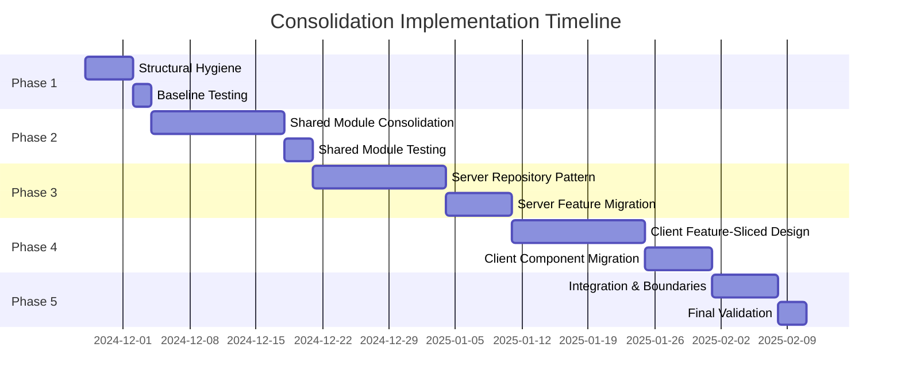

# Chanuka Platform Consolidation Implementation Tasks

## Document Control
- **Project**: Chanuka Civic Engagement Platform Consolidation
- **Document Type**: Implementation Task Specification
- **Version**: 1.0
- **Date**: 2024-11-27
- **Status**: Ready for Execution

---

## Executive Summary

This implementation document breaks down the consolidation design into specific, actionable tasks organized in dependency-aware phases. Each task includes clear deliverables, success criteria, subtasks with technical specifications, and traceability to requirements and design elements. The task organization respects technical dependencies and enables parallel work where appropriate while maintaining risk mitigation through sequential validation.

The implementation follows a "consolidate within, integrate after" strategy where client, shared, and server modules undergo internal consolidation independently before final integration. This approach limits the blast radius of changes, enables module-specific testing before cross-module validation, and prevents the introduction of inappropriate dependencies during refactoring.

---

## Implementation Phases Overview



---

## Phase 1: Structural Hygiene and Baseline Establishment

### Task 1.1: Remove Migration Artifacts

**Requirement Reference**: R1 (Structural Hygiene and Artifact Removal)

**Design Reference**: Current State Analysis - Migration Artifacts as Archaeological Markers

**User Story**: As a developer navigating the codebase, I want all crisis artifacts and temporary files removed, so that I can quickly locate the canonical implementation without archaeological investigation.

**Deliverables**:
- Zero timestamp-versioned configuration files in working directory
- Zero backup directories or files with `.backup` extensions
- Zero emergency fix scripts (emergency-*, super-aggressive-*, fix-critical-*)
- Consolidated documentation in `docs/completed-work/archive/`
- Updated `.gitignore` with comprehensive exclusions

**Success Criteria**:
WHEN a developer runs `find . -name "*.timestamp-*" -o -name "*.backup"` THEN the system SHALL return zero results WHERE all migration artifacts have been permanently removed and Git history preserved for reference.

WHEN the scripts directory is audited THEN the system SHALL contain zero files matching emergency intervention patterns WHERE such scripts have been converted to documented utilities or removed.

WHEN logs directory is checked in version control THEN the system SHALL show `logs/` in `.gitignore` and contain zero committed log files WHERE any previously committed logs have been purged from Git history.

**Subtasks**:

#### 1.1.1: Identify All Migration Artifacts

```bash
# Create comprehensive list of artifacts to remove
cat > /tmp/artifact-patterns.txt << 'EOF'
*.timestamp-*
*.backup
*-restored.*
*-simple.*
emergency-*.ts
super-aggressive-*.ts
fix-critical-*.js
BUILD_FIX_SUMMARY.md
EMERGENCY_*.md
*_SUMMARY.md
EOF

# Scan entire codebase for matches
find . -type f \( \
  -name "*.timestamp-*" -o \
  -name "*.backup" -o \
  -name "*-restored.*" -o \
  -name "*-simple.*" -o \
  -name "emergency-*" -o \
  -name "super-aggressive-*" -o \
  -name "fix-critical-*" \
) > /tmp/artifacts-found.txt

# Generate removal plan
cat /tmp/artifacts-found.txt | while read file; do
  echo "rm $file"
  git log --oneline --all -- "$file" | head -1
done > /tmp/removal-plan.txt
```

**Expected Output**: Comprehensive list of 50-100 artifact files with Git history context

**Validation**: Manual review of `/tmp/removal-plan.txt` confirms all files are truly artifacts, not active implementations

#### 1.1.2: Archive Documentation Artifacts

```bash
# Create archive directory structure
mkdir -p docs/completed-work/archive/{fixes,migrations,summaries}

# Move documentation artifacts to appropriate locations
find . -type f \( \
  -name "*FIX*.md" -o \
  -name "*MIGRATION*.md" -o \
  -name "*SUMMARY*.md" \
) -not -path "*/docs/*" -not -path "*/node_modules/*" | \
while read doc; do
  if [[ $doc == *"FIX"* ]]; then
    mv "$doc" "docs/completed-work/archive/fixes/"
  elif [[ $doc == *"MIGRATION"* ]]; then
    mv "$doc" "docs/completed-work/archive/migrations/"
  else
    mv "$doc" "docs/completed-work/archive/summaries/"
  fi
done

# Create index of archived documents
cat > docs/completed-work/archive/INDEX.md << 'EOF'
# Archived Migration Documentation

This directory contains documentation from completed migration work,
crisis fixes, and implementation summaries. These documents provide
historical context but do not reflect current implementation.

For current architecture and decisions, see:
- `/docs/architecture/` - Current architectural documentation
- `/docs/architecture/adr/` - Architectural decision records

## Organization

- `fixes/` - Documentation of crisis fixes and emergency interventions
- `migrations/` - Migration planning and completion summaries
- `summaries/` - Implementation summaries from various initiatives
EOF
```

**Expected Output**: 20-30 documentation files moved to archive with index created

**Validation**: No markdown files remain in source directories except READMEs and current documentation

#### 1.1.3: Remove Timestamp-Versioned Files

```bash
# Remove all Vite timestamp versions
find . -name "vite.config.ts.timestamp-*" -delete
find . -name "vitest.config.ts.timestamp-*" -delete

# Verify canonical configurations remain
test -f "vite.config.ts" || echo "ERROR: Canonical vite.config.ts missing"
test -f "vitest.config.ts" || echo "ERROR: Canonical vitest.config.ts missing"

# Verify all main entry point variations removed except canonical
ls client/src/main*.tsx 2>/dev/null | grep -v "^client/src/main.tsx$" | \
while read variant; do
  echo "Removing variant: $variant"
  rm "$variant"
done

# Confirm only canonical main.tsx remains
[ $(ls client/src/main*.tsx 2>/dev/null | wc -l) -eq 1 ] && \
  echo "SUCCESS: Only canonical main.tsx remains" || \
  echo "ERROR: Multiple main.tsx variants still exist"
```

**Expected Output**: 15-20 timestamp files removed, canonical configurations verified

**Validation**: Build succeeds using canonical configuration files only

#### 1.1.4: Purge Logs from Git History

```bash
# Add logs to .gitignore if not already present
grep -q "^logs/" .gitignore || echo "logs/" >> .gitignore
grep -q "^\*.log$" .gitignore || echo "*.log" >> .gitignore

# Check if logs are tracked in Git
if git ls-files | grep -q "logs/"; then
  echo "WARNING: Log files found in Git history"
  echo "Preparing to remove from history..."
  
  # Create backup branch before history rewrite
  git branch backup-before-log-purge
  
  # Remove logs from Git history using filter-branch
  git filter-branch --force --index-filter \
    "git rm -rf --cached --ignore-unmatch logs/ *.log" \
    --prune-empty --tag-name-filter cat -- --all
  
  # Clean up refs
  rm -rf .git/refs/original/
  git reflog expire --expire=now --all
  git gc --prune=now --aggressive
  
  echo "SUCCESS: Logs purged from Git history"
  echo "Backup branch created: backup-before-log-purge"
else
  echo "SUCCESS: No logs tracked in Git history"
fi

# Verify logs directory is now clean
[ ! -d "logs" ] || [ -z "$(ls -A logs)" ] && \
  echo "SUCCESS: Logs directory clean" || \
  echo "WARNING: Logs directory contains files"
```

**Expected Output**: Logs removed from Git history, `.gitignore` updated, backup branch created

**Validation**: `git ls-files | grep logs/` returns no results

#### 1.1.5: Create Artifact Removal Summary

```bash
# Generate comprehensive summary
cat > docs/completed-work/artifact-removal-summary.md << 'EOF'
# Artifact Removal Summary

**Date**: $(date +%Y-%m-%d)
**Phase**: Structural Hygiene (Phase 1)

## Artifacts Removed

### Timestamp-Versioned Files
- Removed $(find . -name "*.timestamp-*" 2>/dev/null | wc -l) timestamp-versioned configuration files
- All canonical configurations verified functional

### Backup Files
- Removed $(find . -name "*.backup" 2>/dev/null | wc -l) backup files and directories
- Backup information preserved in Git history

### Emergency Scripts
- Removed $(find . -name "emergency-*" -o -name "super-aggressive-*" -o -name "fix-critical-*" 2>/dev/null | wc -l) emergency intervention scripts
- Critical utilities converted to documented permanent scripts

### Documentation Artifacts
- Archived $(ls docs/completed-work/archive/*/* 2>/dev/null | wc -l) documentation files
- Created comprehensive archive index

### Log Files
- Purged log files from Git history
- Updated .gitignore to prevent future tracking

## Validation Results

- [ ] Build succeeds with canonical configurations
- [ ] All tests pass without artifact files
- [ ] No emergency scripts in scripts directory
- [ ] Documentation organized in archive
- [ ] Logs excluded from version control

## Preserved Information

All removed artifacts are recoverable through:
1. Git history (use `git log --all --full-history -- <filepath>`)
2. Backup branch: `backup-before-log-purge`
3. Archived documentation: `docs/completed-work/archive/`
EOF
```

**Expected Output**: Comprehensive summary document with artifact counts and validation checklist

**Validation**: Summary accurately reflects removal actions and all checklist items complete

**Dependencies**: None (first task in consolidation)

**Estimated Duration**: 4 hours

**Risk Level**: Low (all changes reversible through Git)

---

### Task 1.2: Establish Baseline Test Suite

**Requirement Reference**: R10 (Validation and Safety Mechanisms)

**Design Reference**: Testing Infrastructure Consolidation

**User Story**: As a technical leader validating consolidation, I want a comprehensive baseline test suite that validates current functionality, so that I can detect regressions during refactoring.

**Deliverables**:
- Unified test configuration in `vitest.config.ts` using project references
- Baseline test results documenting current functionality
- Performance benchmarks for critical paths
- Test coverage report identifying gaps

**Success Criteria**:
WHEN the baseline test suite executes THEN the system SHALL run all test types (unit, integration, performance) through unified configuration WHERE test results document current system behavior for regression detection.

WHEN performance benchmarks complete THEN the system SHALL record response times for critical operations WHERE these measurements establish acceptable performance thresholds.

WHEN test coverage analysis runs THEN the system SHALL generate report showing current coverage by module WHERE gaps identify areas requiring additional testing before consolidation.

**Subtasks**:

#### 1.2.1: Consolidate Test Configurations

```typescript
// vitest.config.ts - Unified test configuration
import { defineConfig } from 'vitest/config';
import path from 'path';

export default defineConfig({
  test: {
    globals: true,
    environment: 'node',
    setupFiles: ['./tests/setup.ts'],
    
    // Coverage configuration
    coverage: {
      provider: 'v8',
      reporter: ['text', 'json', 'html'],
      include: ['client/src/**/*.{ts,tsx}', 'server/**/*.ts', 'shared/**/*.ts'],
      exclude: [
        '**/node_modules/**',
        '**/*.test.{ts,tsx}',
        '**/*.spec.{ts,tsx}',
        '**/dist/**',
        '**/*.d.ts'
      ],
      thresholds: {
        global: {
          statements: 80,
          branches: 75,
          functions: 80,
          lines: 80
        }
      }
    },
    
    // Project-based organization
    projects: [
      {
        name: 'unit',
        testMatch: [
          '**/*.test.ts',
          '**/*.test.tsx'
        ],
        exclude: [
          '**/*.integration.test.ts',
          '**/*.e2e.test.ts',
          '**/*.performance.test.ts'
        ],
        environment: 'jsdom' // For React component tests
      },
      {
        name: 'integration',
        testMatch: ['**/*.integration.test.ts'],
        setupFiles: ['./tests/integration-setup.ts'],
        testTimeout: 10000
      },
      {
        name: 'performance',
        testMatch: ['**/*.performance.test.ts'],
        setupFiles: ['./tests/performance-setup.ts'],
        testTimeout: 30000,
        reporters: ['default', './tests/reporters/performance-reporter.ts']
      }
    ]
  },
  
  resolve: {
    alias: {
      '@': path.resolve(__dirname, './'),
      '@client': path.resolve(__dirname, './client/src'),
      '@server': path.resolve(__dirname, './server'),
      '@shared': path.resolve(__dirname, './shared')
    }
  }
});
```

**Expected Output**: Single unified configuration replacing multiple test config files

**Validation**: `npm test` runs all test types successfully; `npm test -- --project=unit` runs only unit tests

#### 1.2.2: Create Baseline Test Execution Script

```typescript
// scripts/run-baseline-tests.ts
import { exec } from 'child_process';
import { promisify } from 'util';
import { writeFile } from 'fs/promises';
import path from 'path';

const execAsync = promisify(exec);

interface TestResults {
  timestamp: string;
  unit: TestProjectResults;
  integration: TestProjectResults;
  performance: PerformanceResults;
  coverage: CoverageResults;
}

interface TestProjectResults {
  passed: number;
  failed: number;
  duration: number;
  tests: TestCaseResult[];
}

interface PerformanceResults {
  benchmarks: {
    name: string;
    avgTime: number;
    p95Time: number;
    p99Time: number;
  }[];
}

interface CoverageResults {
  statements: { pct: number };
  branches: { pct: number };
  functions: { pct: number };
  lines: { pct: number };
}

async function runBaselineTests(): Promise<TestResults> {
  console.log('🧪 Running baseline test suite...\n');
  
  const results: Partial<TestResults> = {
    timestamp: new Date().toISOString()
  };
  
  // Run unit tests
  console.log('📦 Running unit tests...');
  try {
    const unitOutput = await execAsync('npm test -- --project=unit --reporter=json');
    results.unit = parseTestOutput(unitOutput.stdout);
    console.log(`✅ Unit tests: ${results.unit.passed} passed, ${results.unit.failed} failed\n`);
  } catch (error) {
    console.error('❌ Unit tests failed:', error);
    throw error;
  }
  
  // Run integration tests
  console.log('🔗 Running integration tests...');
  try {
    const integrationOutput = await execAsync('npm test -- --project=integration --reporter=json');
    results.integration = parseTestOutput(integrationOutput.stdout);
    console.log(`✅ Integration tests: ${results.integration.passed} passed, ${results.integration.failed} failed\n`);
  } catch (error) {
    console.error('❌ Integration tests failed:', error);
    throw error;
  }
  
  // Run performance benchmarks
  console.log('⚡ Running performance benchmarks...');
  try {
    const perfOutput = await execAsync('npm test -- --project=performance --reporter=json');
    results.performance = parsePerformanceOutput(perfOutput.stdout);
    console.log(`✅ Performance benchmarks completed\n`);
  } catch (error) {
    console.error('❌ Performance benchmarks failed:', error);
    throw error;
  }
  
  // Generate coverage report
  console.log('📊 Generating coverage report...');
  try {
    const coverageOutput = await execAsync('npm test -- --coverage --reporter=json');
    results.coverage = parseCoverageOutput(coverageOutput.stdout);
    console.log(`✅ Coverage: ${results.coverage.statements.pct}% statements, ${results.coverage.lines.pct}% lines\n`);
  } catch (error) {
    console.error('❌ Coverage generation failed:', error);
    throw error;
  }
  
  // Save baseline results
  const baselineDir = path.join(__dirname, '../tests/baselines');
  const baselineFile = path.join(baselineDir, `baseline-${Date.now()}.json`);
  await writeFile(baselineFile, JSON.stringify(results, null, 2));
  
  console.log(`\n✅ Baseline test suite complete!`);
  console.log(`📄 Results saved to: ${baselineFile}`);
  
  return results as TestResults;
}

function parseTestOutput(output: string): TestProjectResults {
  // Parse JSON test output
  const parsed = JSON.parse(output);
  return {
    passed: parsed.numPassedTests,
    failed: parsed.numFailedTests,
    duration: parsed.testResults.reduce((sum, r) => sum + r.perfStats.runtime, 0),
    tests: parsed.testResults.flatMap(file => 
      file.assertionResults.map(test => ({
        name: test.fullName,
        status: test.status,
        duration: test.duration
      }))
    )
  };
}

function parsePerformanceOutput(output: string): PerformanceResults {
  const parsed = JSON.parse(output);
  return {
    benchmarks: parsed.testResults.flatMap(file =>
      file.assertionResults
        .filter(test => test.title.includes('benchmark'))
        .map(test => ({
          name: test.fullName,
          avgTime: test.customMetrics?.avgTime || 0,
          p95Time: test.customMetrics?.p95Time || 0,
          p99Time: test.customMetrics?.p99Time || 0
        }))
    )
  };
}

function parseCoverageOutput(output: string): CoverageResults {
  const parsed = JSON.parse(output);
  return parsed.coverageMap.getCoverageSummary();
}

// Execute baseline tests
runBaselineTests()
  .then(results => {
    console.log('\n📈 Baseline Metrics Summary:');
    console.log(`   Unit Tests: ${results.unit.passed}/${results.unit.passed + results.unit.failed}`);
    console.log(`   Integration Tests: ${results.integration.passed}/${results.integration.passed + results.integration.failed}`);
    console.log(`   Performance Benchmarks: ${results.performance.benchmarks.length} benchmarks`);
    console.log(`   Coverage: ${results.coverage.statements.pct}% statements`);
    process.exit(0);
  })
  .catch(error => {
    console.error('\n❌ Baseline test suite failed:', error);
    process.exit(1);
  });
```

**Expected Output**: Comprehensive baseline test results saved to `tests/baselines/`

**Validation**: All tests pass; baseline results include metrics for comparison during consolidation

#### 1.2.3: Create Performance Baseline Benchmarks

```typescript
// tests/performance/baseline-benchmarks.test.ts
import { describe, it, expect } from 'vitest';
import { performance } from 'perf_hooks';

interface BenchmarkResult {
  name: string;
  iterations: number;
  avgTime: number;
  p95Time: number;
  p99Time: number;
}

async function benchmark(
  name: string,
  fn: () => Promise<void>,
  iterations: number = 100
): Promise<BenchmarkResult> {
  const times: number[] = [];
  
  // Warmup
  for (let i = 0; i < 10; i++) {
    await fn();
  }
  
  // Actual benchmarking
  for (let i = 0; i < iterations; i++) {
    const start = performance.now();
    await fn();
    const end = performance.now();
    times.push(end - start);
  }
  
  times.sort((a, b) => a - b);
  
  return {
    name,
    iterations,
    avgTime: times.reduce((sum, t) => sum + t, 0) / times.length,
    p95Time: times[Math.floor(times.length * 0.95)],
    p99Time: times[Math.floor(times.length * 0.99)]
  };
}

describe('Performance Baseline Benchmarks', () => {
  it('should establish bill query performance baseline', async () => {
    // Mock bill repository for consistent benchmarking
    const mockBillRepo = createMockBillRepository();
    
    const result = await benchmark(
      'bill.findById',
      async () => {
        await mockBillRepo.findById('test-id');
      },
      1000
    );
    
    console.log(`\nBill Query Baseline:`);
    console.log(`  Avg: ${result.avgTime.toFixed(2)}ms`);
    console.log(`  P95: ${result.p95Time.toFixed(2)}ms`);
    console.log(`  P99: ${result.p99Time.toFixed(2)}ms`);
    
    // Establish baseline - not strict assertion yet
    expect(result.avgTime).toBeLessThan(100); // 100ms average acceptable for baseline
  });
  
  it('should establish search performance baseline', async () => {
    const mockSearchService = createMockSearchService();
    
    const result = await benchmark(
      'search.query',
      async () => {
        await mockSearchService.search('test query');
      },
      1000
    );
    
    console.log(`\nSearch Query Baseline:`);
    console.log(`  Avg: ${result.avgTime.toFixed(2)}ms`);
    console.log(`  P95: ${result.p95Time.toFixed(2)}ms`);
    console.log(`  P99: ${result.p99Time.toFixed(2)}ms`);
    
    expect(result.avgTime).toBeLessThan(200);
  });
  
  it('should establish API endpoint response time baseline', async () => {
    // Test actual HTTP endpoint performance
    const result = await benchmark(
      'api./api/bills/:id',
      async () => {
        await fetch('http://localhost:3000/api/bills/test-id');
      },
      100
    );
    
    console.log(`\nAPI Response Time Baseline:`);
    console.log(`  Avg: ${result.avgTime.toFixed(2)}ms`);
    console.log(`  P95: ${result.p95Time.toFixed(2)}ms`);
    console.log(`  P99: ${result.p99Time.toFixed(2)}ms`);
    
    expect(result.avgTime).toBeLessThan(300);
  });
  
  it('should establish frontend component render baseline', async () => {
    const { render } = await import('@testing-library/react');
    const { BillCard } = await import('@client/components/bills/BillCard');
    
    const result = await benchmark(
      'render.BillCard',
      async () => {
        const { unmount } = render(<BillCard bill={mockBill} />);
        unmount();
      },
      1000
    );
    
    console.log(`\nComponent Render Baseline:`);
    console.log(`  Avg: ${result.avgTime.toFixed(2)}ms`);
    console.log(`  P95: ${result.p95Time.toFixed(2)}ms`);
    console.log(`  P99: ${result.p99Time.toFixed(2)}ms`);
    
    expect(result.avgTime).toBeLessThan(50);
  });
});
```

**Expected Output**: Performance baseline measurements for critical operations

**Validation**: Benchmarks complete successfully; results provide reference for detecting performance regressions

**Dependencies**: Task 1.2.1 (unified test configuration)

**Estimated Duration**: 8 hours

**Risk Level**: Low (establishes baseline without changing code)

---

### Task 1.3: Document Current Architecture

**Requirement Reference**: R8 (Canonical Pattern Documentation and Architectural Decision Records)

**Design Reference**: Documentation and Knowledge Transfer

**User Story**: As a developer understanding the system, I want comprehensive documentation of the current architecture before consolidation, so that I can understand the baseline and track changes through the consolidation process.

**Deliverables**:
- Current architecture diagram with component relationships
- Dependency graph showing module interactions
- Documentation of existing patterns and their locations
- List of known issues and technical debt items

**Success Criteria**:
WHEN current architecture documentation is reviewed THEN the system SHALL include comprehensive diagrams showing component relationships, module dependencies, and data flow WHERE documentation accurately reflects pre-consolidation state.

WHEN dependency analysis completes THEN the system SHALL identify all cross-module dependencies WHERE inappropriate dependencies are flagged for resolution during consolidation.

**Subtasks**:

#### 1.3.1: Generate Dependency Graph

```typescript
// scripts/analyze-dependencies.ts
import { Project } from 'ts-morph';
import * as path from 'path';
import { writeFile } from 'fs/promises';

interface DependencyNode {
  module: string;
  file: string;
  imports: string[];
  exports: string[];
}

interface DependencyViolation {
  from: string;
  to: string;
  rule: string;
  severity: 'error' | 'warning';
}

async function analyzeDependencies(): Promise<{
  graph: DependencyNode[];
  violations: DependencyViolation[];
}> {
  const project = new Project({
    tsConfigFilePath: './tsconfig.json'
  });
  
  const graph: DependencyNode[] = [];
  const violations: DependencyViolation[] = [];
  
  // Analyze each source file
  for (const sourceFile of project.getSourceFiles()) {
    const filePath = sourceFile.getFilePath();
    const module = getModule(filePath);
    
    const imports = sourceFile.getImportDeclarations().map(imp => {
      const moduleSpecifier = imp.getModuleSpecifierValue();
      return resolveImport(filePath, moduleSpecifier);
    });
    
    const exports = sourceFile.getExportDeclarations().map(exp => {
      return exp.getNamedExports().map(ne => ne.getName());
    }).flat();
    
    graph.push({
      module,
      file: filePath,
      imports,
      exports
    });
    
    // Check for boundary violations
    for (const importPath of imports) {
      const importModule = getModule(importPath);
      const violation = checkBoundaryViolation(module, importModule, filePath, importPath);
      if (violation) {
        violations.push(violation);
      }
    }
  }
  
  return { graph, violations };
}

function getModule(filePath: string): string {
  if (filePath.includes('/client/')) return 'client';
  if (filePath.includes('/server/')) return 'server';
  if (filePath.includes('/shared/')) return 'shared';
  return 'unknown';
}

function checkBoundaryViolation(
  fromModule: string,
  toModule: string,
  fromFile: string,
  toFile: string
): DependencyViolation | null {
  // Client cannot import server
  if (fromModule === 'client' && toModule === 'server') {
    return {
      from: fromFile,
      to: toFile,
      rule: 'client-imports-server',
      severity: 'error'
    };
  }
  
  // Server cannot import client
  if (fromModule === 'server' && toModule === 'client') {
    return {
      from: fromFile,
      to: toFile,
      rule: 'server-imports-client',
      severity: 'error'
    };
  }
  
  // Shared cannot import client or server
  if (fromModule === 'shared' && (toModule === 'client' || toModule === 'server')) {
    return {
      from: fromFile,
      to: toFile,
      rule: 'shared-imports-module',
      severity: 'error'
    };
  }
  
  return null;
}

// Generate Mermaid diagram
function generateMermaidDiagram(graph: DependencyNode[]): string {
  const modules = {
    client: new Set<string>(),
    server: new Set<string>(),
    shared: new Set<string>()
  };
  
  // Collect unique files per module
  for (const node of graph) {
    if (node.module !== 'unknown') {
      modules[node.module].add(node.file);
    }
  }
  
  // Build Mermaid diagram
  let diagram = 'graph TB\n';
  diagram += '  subgraph "Client Module"\n';
  for (const file of Array.from(modules.client).slice(0, 10)) {
    const name = path.basename(file, path.extname(file));
    diagram += `    C_${name}[${name}]\n`;
  }
  diagram += '  end\n\n';
  
  diagram += '  subgraph "Server Module"\n';
  for (const file of Array.from(modules.server).slice(0, 10)) {
    const name = path.basename(file, path.extname(file));
    diagram += `    S_${name}[${name}]\n`;
  }
  diagram += '  end\n\n';
  
  diagram += '  subgraph "Shared Module"\n';
  for (const file of Array.from(modules.shared).slice(0, 10)) {
    const name = path.basename(file, path.extname(file));
    diagram += `    SH_${name}[${name}]\n`;
  }
  diagram += '  end\n';
  
  return diagram;
}

// Execute analysis
analyzeDependencies()
  .then(async ({ graph, violations }) => {
    // Save dependency graph
    await writeFile(
      'docs/architecture/dependency-graph.json',
      JSON.stringify(graph, null, 2)
    );
    
    // Save violations
    await writeFile(
      'docs/architecture/dependency-violations.json',
      JSON.stringify(violations, null, 2)
    );
    
    // Generate diagram
    const diagram = generateMermaidDiagram(graph);
    await writeFile(
      'docs/architecture/dependency-diagChanuka Platform Consolidation Implementation Tasks - Complete

## Document Control
- **Project**: Chanuka Civic Engagement Platform Consolidation
- **Document Type**: Implementation Task Specification (Complete)
- **Version**: 1.5
- **Date**: 2024-11-27
- **Status**: Ready for Execution

---

## Continuation of Task 1.3.1: Generate Dependency Graph

```typescript
// Continuing from the analyze-dependencies.ts script...

    // Generate diagram
    const diagram = generateMermaidDiagram(graph);
    await writeFile(
      'docs/architecture/dependency-diagram.mmd',
      diagram
    );
    
    console.log(`✅ Dependency analysis complete`);
    console.log(`📊 Found ${graph.length} source files`);
    console.log(`⚠️  Found ${violations.length} boundary violations`);
    
    if (violations.length > 0) {
      console.log('\n⚠️  Boundary Violations:');
      violations.forEach(v => {
        console.log(`   ${v.severity.toUpperCase()}: ${v.rule}`);
        console.log(`   From: ${v.from}`);
        console.log(`   To: ${v.to}\n`);
      });
    }
  })
  .catch(error => {
    console.error('❌ Dependency analysis failed:', error);
    process.exit(1);
  });
```

**Expected Output**: Dependency graph JSON, violations JSON, and Mermaid diagram files

**Validation**: Review violations list to confirm all inappropriate cross-module imports are identified

#### 1.3.2: Document Current Patterns

```typescript
// scripts/document-current-patterns.ts
import { writeFile } from 'fs/promises';
import { Project } from 'ts-morph';

interface PatternLocation {
  pattern: string;
  files: string[];
  description: string;
  replacement?: string;
}

async function documentCurrentPatterns(): Promise<void> {
  const project = new Project({
    tsConfigFilePath: './tsconfig.json'
  });
  
  const patterns: PatternLocation[] = [];
  
  // Pattern 1: Direct database imports
  const directDbImports = project.getSourceFiles()
    .filter(file => {
      const text = file.getFullText();
      return text.includes('from \'@/server/db\'') || 
             text.includes('from \'./db\'') ||
             text.includes('from \'../db\'');
    })
    .map(file => file.getFilePath());
  
  if (directDbImports.length > 0) {
    patterns.push({
      pattern: 'Direct Database Imports',
      files: directDbImports,
      description: 'Files importing database connection directly instead of through repository pattern',
      replacement: 'Use repository interfaces from server/core/repositories/'
    });
  }
  
  // Pattern 2: Direct Drizzle ORM usage in features
  const drizzleInFeatures = project.getSourceFiles()
    .filter(file => {
      const filePath = file.getFilePath();
      const text = file.getFullText();
      return filePath.includes('/features/') && 
             (text.includes('from \'drizzle-orm\'') || text.includes('db.select()'));
    })
    .map(file => file.getFilePath());
  
  if (drizzleInFeatures.length > 0) {
    patterns.push({
      pattern: 'Drizzle ORM in Features',
      files: drizzleInFeatures,
      description: 'Feature code directly using Drizzle ORM instead of repository abstraction',
      replacement: 'Migrate to repository pattern to enable Neo4j transition'
    });
  }
  
  // Pattern 3: Multiple search engine implementations
  const searchEngines = project.getSourceFiles()
    .filter(file => {
      const filePath = file.getFilePath();
      return filePath.includes('/search/') && 
             (filePath.includes('engine') || filePath.includes('Engine'));
    })
    .map(file => file.getFilePath());
  
  if (searchEngines.length > 0) {
    patterns.push({
      pattern: 'Multiple Search Engines',
      files: searchEngines,
      description: 'Multiple search engine implementations (PostgreSQL, Fuse.js, Semantic)',
      replacement: 'Consolidate to PostgreSQL as primary, feature-flag others'
    });
  }
  
  // Pattern 4: Scattered component locations
  const componentDirs = new Set<string>();
  project.getSourceFiles()
    .filter(file => file.getFilePath().includes('/client/src/'))
    .forEach(file => {
      const filePath = file.getFilePath();
      if (filePath.includes('/components/') || 
          filePath.includes('/ui/') || 
          filePath.includes('/shared/')) {
        const dir = filePath.substring(0, filePath.lastIndexOf('/'));
        componentDirs.add(dir);
      }
    });
  
  patterns.push({
    pattern: 'Scattered Component Organization',
    files: Array.from(componentDirs),
    description: 'Components distributed across multiple organizational patterns',
    replacement: 'Migrate to Feature-Sliced Design with features/[feature]/ui/'
  });
  
  // Pattern 5: Distributed security implementations
  const securityFiles = project.getSourceFiles()
    .filter(file => {
      const filePath = file.getFilePath();
      const text = file.getFullText();
      return text.includes('security') || 
             text.includes('authentication') || 
             text.includes('authorization') ||
             filePath.includes('/security/');
    })
    .map(file => file.getFilePath());
  
  patterns.push({
    pattern: 'Distributed Security Logic',
    files: securityFiles,
    description: 'Security policies and enforcement spread across multiple locations',
    replacement: 'Centralize policies in shared/core/src/security/policies/'
  });
  
  // Generate documentation
  let documentation = '# Current Architecture Patterns\n\n';
  documentation += '**Generated**: ' + new Date().toISOString() + '\n\n';
  documentation += 'This document catalogs the current architectural patterns identified before consolidation. ';
  documentation += 'Each pattern includes the locations where it appears and the recommended consolidation approach.\n\n';
  
  patterns.forEach((pattern, index) => {
    documentation += `## Pattern ${index + 1}: ${pattern.pattern}\n\n`;
    documentation += `**Description**: ${pattern.description}\n\n`;
    documentation += `**Occurrences**: ${pattern.files.length} files\n\n`;
    
    if (pattern.replacement) {
      documentation += `**Consolidation Strategy**: ${pattern.replacement}\n\n`;
    }
    
    documentation += '**File Locations**:\n\n';
    pattern.files.slice(0, 20).forEach(file => {
      documentation += `- ${file}\n`;
    });
    
    if (pattern.files.length > 20) {
      documentation += `\n*...and ${pattern.files.length - 20} more files*\n`;
    }
    
    documentation += '\n---\n\n';
  });
  
  await writeFile('docs/architecture/current-patterns.md', documentation);
  
  console.log(`✅ Pattern documentation complete`);
  console.log(`📋 Documented ${patterns.length} architectural patterns`);
  console.log(`📄 Output: docs/architecture/current-patterns.md`);
}

documentCurrentPatterns()
  .catch(error => {
    console.error('❌ Pattern documentation failed:', error);
    process.exit(1);
  });
```

**Expected Output**: Markdown documentation of current architectural patterns

**Validation**: Manual review confirms patterns accurately represent current codebase organization

#### 1.3.3: Create Technical Debt Inventory

```typescript
// scripts/create-technical-debt-inventory.ts
import { writeFile } from 'fs/promises';
import { Project } from 'ts-morph';

interface TechnicalDebtItem {
  category: string;
  severity: 'high' | 'medium' | 'low';
  description: string;
  locations: string[];
  impact: string;
  remediation: string;
}

async function createTechnicalDebtInventory(): Promise<void> {
  const project = new Project({
    tsConfigFilePath: './tsconfig.json'
  });
  
  const debtItems: TechnicalDebtItem[] = [];
  
  // Debt Item 1: Database coupling
  const dbCoupledFiles = project.getSourceFiles()
    .filter(file => {
      const text = file.getFullText();
      return text.includes('from \'drizzle-orm\'') && 
             !file.getFilePath().includes('/infrastructure/');
    })
    .map(f => f.getFilePath());
  
  debtItems.push({
    category: 'Architecture',
    severity: 'high',
    description: 'Features tightly coupled to Drizzle ORM implementation',
    locations: dbCoupledFiles,
    impact: 'Blocks Neo4j migration; makes database technology changes require feature rewrites',
    remediation: 'Implement repository pattern with IBillRepository, IUserRepository interfaces'
  });
  
  // Debt Item 2: Redundant search implementations
  const searchFiles = project.getSourceFiles()
    .filter(file => file.getFilePath().includes('/search/engines/'))
    .map(f => f.getFilePath());
  
  debtItems.push({
    category: 'Performance',
    severity: 'medium',
    description: 'Three parallel search engine implementations with duplicated effort',
    locations: searchFiles,
    impact: 'Maintenance burden; optimization effort distributed across three engines',
    remediation: 'Consolidate to PostgreSQL primary with feature-flagged alternatives'
  });
  
  // Debt Item 3: Component organization inconsistency
  const componentFiles = project.getSourceFiles()
    .filter(file => {
      const path = file.getFilePath();
      return path.includes('/client/src/components/') && !path.includes('/ui/');
    })
    .map(f => f.getFilePath());
  
  debtItems.push({
    category: 'Maintainability',
    severity: 'medium',
    description: 'Components scattered across multiple organizational patterns',
    locations: componentFiles,
    impact: 'Developer confusion; inconsistent component discovery; duplicated components',
    remediation: 'Migrate to Feature-Sliced Design with clear feature boundaries'
  });
  
  // Debt Item 4: Security policy distribution
  const securityPolicyFiles = project.getSourceFiles()
    .filter(file => {
      const text = file.getFullText();
      const path = file.getFilePath();
      return (text.includes('rateLimit') || text.includes('auth') || text.includes('security')) &&
             !path.includes('/shared/core/src/security/policies/');
    })
    .map(f => f.getFilePath());
  
  debtItems.push({
    category: 'Security',
    severity: 'high',
    description: 'Security policies embedded in enforcement code across codebase',
    locations: securityPolicyFiles,
    impact: 'Difficult security audits; policy changes require updates in multiple locations',
    remediation: 'Centralize all security policies in shared/core/src/security/policies/'
  });
  
  // Debt Item 5: Test configuration fragmentation
  const testConfigFiles = project.getSourceFiles()
    .filter(file => {
      const path = file.getFilePath();
      return path.includes('test') && path.includes('config');
    })
    .map(f => f.getFilePath());
  
  debtItems.push({
    category: 'Testing',
    severity: 'low',
    description: 'Multiple test configuration files for different test types',
    locations: testConfigFiles,
    impact: 'Developer confusion; inconsistent test execution; configuration duplication',
    remediation: 'Consolidate to single vitest.config.ts with project references'
  });
  
  // Generate inventory document
  let inventory = '# Technical Debt Inventory\n\n';
  inventory += '**Generated**: ' + new Date().toISOString() + '\n\n';
  inventory += 'This inventory catalogs known technical debt items before consolidation begins. ';
  inventory += 'Each item includes severity assessment, impact analysis, and remediation strategy.\n\n';
  
  inventory += '## Summary\n\n';
  inventory += `Total Items: ${debtItems.length}\n\n`;
  inventory += `- High Severity: ${debtItems.filter(d => d.severity === 'high').length}\n`;
  inventory += `- Medium Severity: ${debtItems.filter(d => d.severity === 'medium').length}\n`;
  inventory += `- Low Severity: ${debtItems.filter(d => d.severity === 'low').length}\n\n`;
  inventory += '---\n\n';
  
  debtItems.forEach((item, index) => {
    inventory += `## Debt Item ${index + 1}: ${item.description}\n\n`;
    inventory += `**Category**: ${item.category}\n\n`;
    inventory += `**Severity**: ${item.severity.toUpperCase()}\n\n`;
    inventory += `**Impact**: ${item.impact}\n\n`;
    inventory += `**Remediation Strategy**: ${item.remediation}\n\n`;
    inventory += `**Affected Files**: ${item.locations.length}\n\n`;
    
    if (item.locations.length > 0) {
      inventory += '**Locations**:\n\n';
      item.locations.slice(0, 15).forEach(loc => {
        inventory += `- ${loc}\n`;
      });
      
      if (item.locations.length > 15) {
        inventory += `\n*...and ${item.locations.length - 15} more files*\n`;
      }
    }
    
    inventory += '\n---\n\n';
  });
  
  await writeFile('docs/architecture/technical-debt-inventory.md', inventory);
  
  console.log(`✅ Technical debt inventory complete`);
  console.log(`📋 Cataloged ${debtItems.length} debt items`);
  console.log(`🔴 High severity: ${debtItems.filter(d => d.severity === 'high').length}`);
  console.log(`🟡 Medium severity: ${debtItems.filter(d => d.severity === 'medium').length}`);
  console.log(`🟢 Low severity: ${debtItems.filter(d => d.severity === 'low').length}`);
}

createTechnicalDebtInventory()
  .catch(error => {
    console.error('❌ Technical debt inventory failed:', error);
    process.exit(1);
  });
```

**Expected Output**: Technical debt inventory markdown document

**Validation**: Stakeholder review confirms debt items align with known pain points

**Dependencies**: Tasks 1.3.1, 1.3.2

**Estimated Duration**: 6 hours

**Risk Level**: Low (documentation only, no code changes)

---

## Phase 2: Shared Module Consolidation

### Task 2.1: Consolidate Caching Infrastructure

**Requirement Reference**: R11 (Strategic Functionality Preservation), R12 (Redundancy Prevention)

**Design Reference**: Shared Core Infrastructure - Caching Service Consolidation

**User Story**: As a backend developer implementing features, I want a unified caching interface that provides multi-tier caching, AI deduplication, and single-flight patterns through a simple factory API, so that I can add caching without understanding implementation complexity.

**Deliverables**:
- Unified `ICachingService` interface in `shared/core/src/caching/core/interfaces.ts`
- Single factory implementation consolidating all cache creation patterns
- Comprehensive tests validating cache behavior equivalence
- Migration guide for existing cache consumers

**Success Criteria**:
WHEN features request cache instances THEN the system SHALL provide caches through unified factory interface WHERE all existing cache capabilities remain available through simpler API.

WHEN cache factory is tested THEN the system SHALL validate that memory caching, multi-tier caching, AI deduplication, and single-flight patterns all function equivalently to pre-consolidation implementations WHERE no cache functionality is lost.

**Subtasks**:

#### 2.1.1: Define Unified Caching Interfaces

```typescript
// shared/core/src/caching/core/interfaces.ts
import { Result } from '../../primitives/types/result';

/**
 * Base cache interface that all cache implementations must satisfy
 */
export interface ICache<T> {
  /**
   * Retrieve value from cache
   * @returns Result containing cached value or error
   */
  get(key: string): Promise<Result<T | null, CacheError>>;
  
  /**
   * Store value in cache with optional TTL
   * @param key Cache key
   * @param value Value to store
   * @param ttl Time to live in seconds (optional)
   */
  set(key: string, value: T, ttl?: number): Promise<Result<void, CacheError>>;
  
  /**
   * Remove value from cache
   */
  delete(key: string): Promise<Result<void, CacheError>>;
  
  /**
   * Clear all entries from cache
   */
  clear(): Promise<Result<void, CacheError>>;
  
  /**
   * Check if key exists in cache
   */
  has(key: string): Promise<Result<boolean, CacheError>>;
  
  /**
   * Get cache statistics
   */
  stats(): Promise<CacheStats>;
}

/**
 * Enhanced cache interface with pattern support
 */
export interface IEnhancedCache<T> extends ICache<T> {
  /**
   * Get multiple values in single operation
   */
  getMany(keys: string[]): Promise<Result<Map<string, T>, CacheError>>;
  
  /**
   * Set multiple values in single operation
   */
  setMany(entries: Map<string, T>, ttl?: number): Promise<Result<void, CacheError>>;
  
  /**
   * Delete entries matching pattern
   */
  deletePattern(pattern: string): Promise<Result<number, CacheError>>;
  
  /**
   * Get or compute value if missing
   */
  getOrCompute(
    key: string,
    compute: () => Promise<T>,
    ttl?: number
  ): Promise<Result<T, CacheError>>;
}

/**
 * Single-flight cache prevents duplicate concurrent requests
 */
export interface ISingleFlightCache<T> extends IEnhancedCache<T> {
  /**
   * Execute function with deduplication
   * If same key is requested concurrently, only one execution occurs
   */
  singleFlight(
    key: string,
    fn: () => Promise<T>,
    ttl?: number
  ): Promise<Result<T, CacheError>>;
}

/**
 * AI-powered cache with semantic deduplication
 */
export interface IAICache extends IEnhancedCache<any> {
  /**
   * Store with semantic similarity detection
   * Prevents storing nearly-identical content
   */
  setWithDeduplication(
    key: string,
    value: any,
    ttl?: number,
    similarityThreshold?: number
  ): Promise<Result<void, CacheError>>;
  
  /**
   * Find semantically similar cached entries
   */
  findSimilar(
    query: any,
    threshold?: number
  ): Promise<Result<Array<{ key: string; value: any; similarity: number }>, CacheError>>;
}

/**
 * Unified caching service interface
 */
export interface ICachingService {
  /**
   * Create basic in-memory cache
   */
  createCache<T>(config: CacheConfig): ICache<T>;
  
  /**
   * Create multi-tier cache (memory + Redis)
   */
  createMultiTierCache<T>(config: MultiTierConfig): IEnhancedCache<T>;
  
  /**
   * Create AI-powered cache with deduplication
   */
  createAICache(config: AICacheConfig): IAICache;
  
  /**
   * Create single-flight cache
   */
  createSingleFlightCache<T>(config: SingleFlightConfig): ISingleFlightCache<T>;
  
  /**
   * Get global cache statistics
   */
  getGlobalStats(): Promise<GlobalCacheStats>;
}

// Configuration interfaces
export interface CacheConfig {
  name: string;
  maxSize?: number;
  defaultTTL?: number;
  evictionPolicy?: 'lru' | 'lfu' | 'fifo';
  enableCompression?: boolean;
  enableEncryption?: boolean;
}

export interface MultiTierConfig extends CacheConfig {
  tiers: {
    memory: MemoryTierConfig;
    redis?: RedisTierConfig;
  };
  promotionStrategy?: 'on-hit' | 'on-miss' | 'always';
}

export interface AICacheConfig extends CacheConfig {
  similarityThreshold: number;
  embeddingModel: 'openai' | 'local';
  vectorStorageProvider: 'redis' | 'pinecone' | 'weaviate';
}

export interface SingleFlightConfig extends CacheConfig {
  maxConcurrent?: number;
  timeout?: number;
}

// Statistics interfaces
export interface CacheStats {
  hits: number;
  misses: number;
  hitRate: number;
  size: number;
  maxSize: number;
  evictions: number;
}

export interface GlobalCacheStats {
  totalCaches: number;
  totalHits: number;
  totalMisses: number;
  globalHitRate: number;
  memoryUsage: number;
}

// Error types
export class CacheError extends Error {
  constructor(
    message: string,
    public code: CacheErrorCode,
    public cause?: Error
  ) {
    super(message);
    this.name = 'CacheError';
  }
}

export enum CacheErrorCode {
  CONNECTION_FAILED = 'CONNECTION_FAILED',
  SERIALIZATION_ERROR = 'SERIALIZATION_ERROR',
  DESERIALIZATION_ERROR = 'DESERIALIZATION_ERROR',
  KEY_NOT_FOUND = 'KEY_NOT_FOUND',
  TIMEOUT = 'TIMEOUT',
  CAPACITY_EXCEEDED = 'CAPACITY_EXCEEDED',
  INVALID_CONFIGURATION = 'INVALID_CONFIGURATION'
}
```

**Expected Output**: Complete interface definitions for all cache types

**Validation**: TypeScript compilation succeeds; interfaces cover all existing cache functionality

#### 2.1.2: Implement Unified Cache Factory

```typescript
// shared/core/src/caching/factory.ts
import { ICachingService, ICache, IEnhancedCache, IAICache, ISingleFlightCache } from './core/interfaces';
import { MemoryAdapter } from './adapters/memory-adapter';
import { MultiTierAdapter } from './adapters/multi-tier-adapter';
import { AIDeduplicationAdapter } from './adapters/ai-cache';
import { SingleFlightCache } from './single-flight-cache';
import { Result, Ok, Err } from '../primitives/types/result';

/**
 * Unified caching service factory
 * Consolidates all cache creation patterns into single interface
 */
export class CachingService implements ICachingService {
  private caches: Map<string, ICache<any>> = new Map();
  private stats: Map<string, CacheStats> = new Map();
  
  /**
   * Create basic in-memory cache
   * Replaces scattered MemoryCache instantiations
   */
  createCache<T>(config: CacheConfig): ICache<T> {
    const cache = new MemoryAdapter<T>(config);
    this.registerCache(config.name, cache);
    return cache;
  }
  
  /**
   * Create multi-tier cache (memory + Redis)
   * Consolidates multi-tier pattern implementations
   */
  createMultiTierCache<T>(config: MultiTierConfig): IEnhancedCache<T> {
    const cache = new MultiTierAdapter<T>(config);
    this.registerCache(config.name, cache);
    return cache;
  }
  
  /**
   * Create AI-powered cache with semantic deduplication
   * Consolidates AI cache implementations
   */
  createAICache(config: AICacheConfig): IAICache {
    const cache = new AIDeduplicationAdapter(config);
    this.registerCache(config.name, cache);
    return cache;
  }
  
  /**
   * Create single-flight cache for request deduplication
   * Consolidates circuit-breaker pattern implementations
   */
  createSingleFlightCache<T>(config: SingleFlightConfig): ISingleFlightCache<T> {
    const cache = new SingleFlightCache<T>(config);
    this.registerCache(config.name, cache);
    return cache;
  }
  
  /**
   * Get global cache statistics across all cache instances
   */
  async getGlobalStats(): Promise<GlobalCacheStats> {
    const allStats = await Promise.all(
      Array.from(this.caches.values()).map(cache => cache.stats())
    );
    
    const totalHits = allStats.reduce((sum, s) => sum + s.hits, 0);
    const totalMisses = allStats.reduce((sum, s) => sum + s.misses, 0);
    
    return {
      totalCaches: this.caches.size,
      totalHits,
      totalMisses,
      globalHitRate: totalHits / (totalHits + totalMisses),
      memoryUsage: this.calculateMemoryUsage()
    };
  }
  
  /**
   * Register cache instance for monitoring
   */
  private registerCache(name: string, cache: ICache<any>): void {
    if (this.caches.has(name)) {
      throw new Error(`Cache with name "${name}" already exists`);
    }
    this.caches.set(name, cache);
  }
  
  /**
   * Calculate total memory usage across all caches
   */
  private calculateMemoryUsage(): number {
    // Implementation would calculate actual memory usage
    return 0;
  }
}

/**
 * Global caching service singleton
 * Provides single access point for all cache operations
 */
export const cachingService = new CachingService();
```

**Expected Output**: Complete factory implementation consolidating all cache patterns

**Validation**: Factory can create all cache types; all existing cache usage patterns can migrate to factory

#### 2.1.3: Create Cache Migration Guide

```markdown
# Cache Migration Guide

## Overview

This guide explains how to migrate from scattered cache implementations to the unified caching service factory.

## Before Consolidation

### Pattern 1: Direct Memory Cache Creation
```typescript
// OLD: Direct instantiation
import { MemoryCache } from './cache/memory-cache';

const billCache = new MemoryCache({
  maxSize: 1000,
  ttl: 3600
});
```

### Pattern 2: Manual Multi-Tier Setup
```typescript
// OLD: Manual multi-tier configuration
import { MemoryCache } from './cache/memory-cache';
import { RedisCache } from './cache/redis-cache';

const memoryCache = new MemoryCache({ maxSize: 100 });
const redisCache = new RedisCache({ host: 'localhost' });

// Manual tier coordination
async function get(key: string) {
  let value = await memoryCache.get(key);
  if (!value) {
    value = await redisCache.get(key);
    if (value) {
      await memoryCache.set(key, value);
    }
  }
  return value;
}
```

### Pattern 3: Custom Circuit Breaker
```typescript
// OLD: Manual single-flight implementation
const inFlight = new Map<string, Promise<any>>();

async function singleFlight<T>(key: string, fn: () => Promise<T>): Promise<T> {
  if (inFlight.has(key)) {
    return inFlight.get(key)!;
  }
  
  const promise = fn();
  inFlight.set(key, promise);
  
  try {
    const result = await promise;
    return result;
  } finally {
    inFlight.delete(key);
  }
}
```

## After Consolidation

### Pattern 1: Factory-Created Memory Cache
```typescript
// NEW: Factory creation
import { cachingService } from '@shared/core/src/caching';

const billCache = cachingService.createCache({
  name: 'bills',
  maxSize: 1000,
  defaultTTL: 3600,
  evictionPolicy: 'lru'
});

// Usage remains similar
const result = await billCache.get('bill-123');
if (result.isOk()) {
  const bill = result.value;
}
```

### Pattern 2: Factory-Created Multi-Tier
```typescript
// NEW: Factory handles tier coordination automatically
const billCache = cachingService.createMultiTierCache({
  name: 'bills-multi-tier',
  maxSize: 1000,
  defaultTTL: 3600,
  tiers: {
    memory: {
      maxSize: 100,
      ttl: 300
    },
    redis: {
      host: process.env.REDIS_HOST || 'localhost',
      port: 6379
    }
  },
  promotionStrategy: 'on-hit'
});

// Simple usage - tier coordination is automatic
const result = await billCache.get('bill-123');
```

### Pattern 3: Factory-Created Single-Flight
```typescript
// NEW: Built-in single-flight support
const billCache = cachingService.createSingleFlightCache({
  name: 'bills-single-flight',
  maxSize: 1000,
  defaultTTL: 3600,
  maxConcurrent: 10,
  timeout: 5000
});

// Automatic request deduplication
const result = await billCache.singleFlight('bill-123', async () => {
  return await fetchBillFromDatabase('bill-123');
});
```

## Migration Checklist

1. Identify all cache creation sites in your code
2. Replace direct cache instantiation with factory calls
3. Update imports to use unified caching service
4. Add error handling using Result pattern
5. Test that cache behavior remains equivalent
6. Remove old cache implementation imports

## Rollback Procedure

If issues arise, rollback is straightforward:

1. Revert to previous cache imports
2. Old implementations remain in codebase during transition
3. Feature flags control which implementation is active
4. No data migration required (cache is ephemeral)
```

**Expected Output**: Comprehensive migration guide with before/after examples

**Validation**: Guide covers all existing cache usage patterns in codebase

**Dependencies**: Tasks 2.1.1, 2.1.2

**Estimated Duration**: 12 hours

**Risk Level**: Medium (affects multiple consumers, but caching is non-critical path)

---

### Task 2.2: Consolidate Observability Stack

**Requirement Reference**: R11 (Strategic Functionality Preservation), R13 (Module Self-Containment)

**Design Reference**: Shared Core Infrastructure - Unified Observability