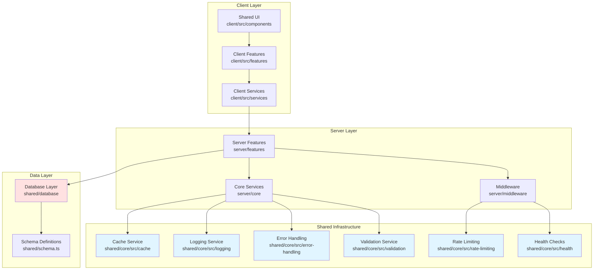
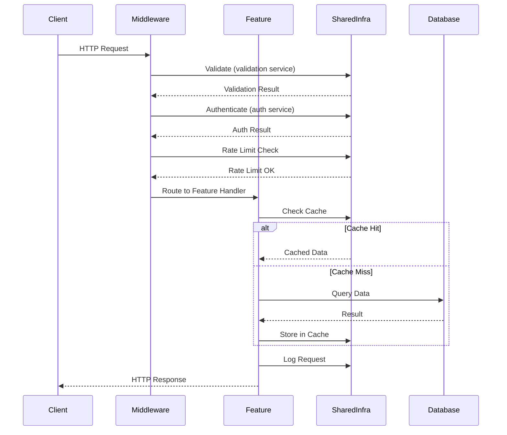
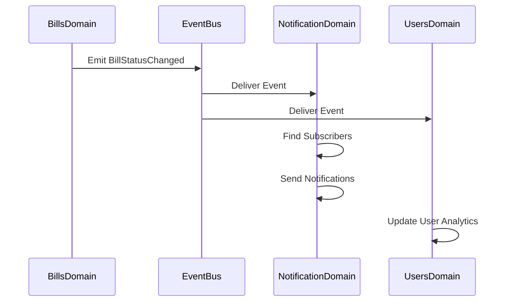

# Chanuka Platform: Centralized Architecture Design

**Version**: 1.0  
**Date**: October 13, 2025  
**Status**: Authoritative Design  
**Optimized For**: GenAI Coding Agents

## Executive Summary

This design document specifies the transformation of the Chanuka civic engagement platform from its current fragmented architecture into a maintainable, centralized system. The design consolidates infrastructure services into a shared layer, establishes clear domain boundaries, and creates explicit integration patterns that enable GenAI coding agents to generate and modify code with precision.

## Current State Analysis

The existing codebase exhibits fragmentation across three critical dimensions. Infrastructure concerns scatter between `server/infrastructure`, `server/core`, and experimental code paths. Database access occurs through multiple patterns in `server/db.ts`, `server/infrastructure/database`, and feature-specific implementations. Utility functions duplicate across `server/utils`, `client/src/utils`, and inline implementations within features.

This fragmentation creates ambiguity for both human developers and AI coding agents. When asked to implement caching, an AI agent must choose between multiple cache implementations without clear guidance about which is canonical. The same problem applies to logging, error handling, and validation.

## Design Goals

The centralized architecture achieves five interconnected objectives. First, it establishes single authoritative implementations for all infrastructure concerns in the `shared/core/src` directory structure. Second, it creates clear domain boundaries in `server/features` and `client/src/features` that mirror business capabilities. Third, it eliminates ambiguity through explicit file paths and import patterns. Fourth, it optimizes code organization for AI agent navigation using consistent naming and structure. Fifth, it maintains backward compatibility through adapter patterns during migration.

## High-Level Architecture



## Component Architecture

### Shared Infrastructure Layer

The shared infrastructure layer provides all cross-cutting technical concerns through a unified interface structure. Each service exports from `shared/core/src/[service-name]/index.ts` using consistent barrel patterns that enable AI agents to locate functionality through predictable import paths.

#### Cache Service Architecture

```typescript
// shared/core/src/cache/index.ts
export interface CacheAdapter {
  get<T>(key: string): Promise<T | null>;
  set<T>(key: string, value: T, ttl?: number): Promise<void>;
  delete(key: string): Promise<void>;
  clear(): Promise<void>;
}

export interface SingleFlightCache extends CacheAdapter {
  getOrCompute<T>(
    key: string,
    compute: () => Promise<T>,
    ttl?: number
  ): Promise<T>;
}

export interface CircuitBreakerConfig {
  failureThreshold: number;
  resetTimeout: number;
  monitorInterval: number;
}
```

The cache service provides three adapter implementations. The `memory-adapter.ts` offers in-process caching with LRU eviction suitable for single-instance deployments. The `redis-adapter.ts` enables distributed caching across multiple application servers with automatic reconnection handling. The `multi-tier-adapter.ts` combines memory and Redis caching with intelligent fallback when Redis is unavailable.

The `single-flight-cache.ts` prevents duplicate concurrent requests for identical data by deduplicating in-flight operations. When multiple requests arrive for the same cache key simultaneously, only one computation executes while others wait for the result.

#### Error Handling Architecture

```typescript
// shared/core/src/error-handling/index.ts
export class BaseError extends Error {
  constructor(
    message: string,
    public code: string,
    public statusCode: number,
    public context?: Record<string, any>
  ) {
    super(message);
    this.name = this.constructor.name;
  }
}

export interface CircuitBreaker {
  execute<T>(operation: () => Promise<T>): Promise<T>;
  getState(): 'CLOSED' | 'OPEN' | 'HALF_OPEN';
  reset(): void;
}

export interface ErrorMiddleware {
  (error: Error, req: Request, res: Response, next: NextFunction): void;
}
```

The error handling system establishes a hierarchy of specialized error classes extending from `BaseError`. The `ValidationError` represents input validation failures with field-level details. The `AuthenticationError` indicates authentication failures with appropriate HTTP status codes. The `DatabaseError` wraps database-specific errors with query context for debugging.

The circuit breaker pattern prevents cascade failures when external dependencies become unavailable. It monitors error rates and automatically opens the circuit when failures exceed threshold, returning fallback responses until the dependency recovers.

#### Logging Service Architecture

```typescript
// shared/core/src/logging/index.ts
export interface Logger {
  debug(message: string, meta?: Record<string, any>): void;
  info(message: string, meta?: Record<string, any>): void;
  warn(message: string, meta?: Record<string, any>): void;
  error(message: string, meta?: Record<string, any>): void;
  child(context: Record<string, any>): Logger;
}

export interface LogRotationConfig {
  maxSize: string;
  maxAge: string;
  maxFiles: number;
  compress: boolean;
}

export interface LogEntry {
  level: string;
  message: string;
  timestamp: string;
  correlationId: string;
  context: Record<string, any>;
}
```

The logging service produces structured JSON output with automatic correlation ID injection for distributed tracing. Each log entry includes request context, user information when available, and metadata that aids debugging. The service automatically redacts sensitive information like passwords, tokens, and personal identifiable information before writing logs.

Log rotation ensures disk space management through configurable size and age limits with optional compression of archived logs. The service integrates with external log aggregation systems through standardized JSON format.

#### Validation Service Architecture

```typescript
// shared/core/src/validation/index.ts
export interface ValidationSchema<T> {
  parse(data: unknown): T;
  safeParse(data: unknown): 
    { success: true; data: T } | 
    { success: false; errors: ValidationError[] };
}

export interface ValidationMiddleware {
  body<T>(schema: ValidationSchema<T>): RequestHandler;
  query<T>(schema: ValidationSchema<T>): RequestHandler;
  params<T>(schema: ValidationSchema<T>): RequestHandler;
}

export interface SanitizationOptions {
  trim: boolean;
  escape: boolean;
  lowercase: boolean;
  maxLength?: number;
}
```

The validation service leverages Zod schemas for type-safe runtime validation with automatic TypeScript type inference. Common validation schemas exist in `schemas/common.ts` for reusable patterns like email addresses, phone numbers, and URLs.

Sanitization functions complement validation by normalizing input data before processing. The service handles Unicode normalization, whitespace trimming, HTML escaping, and length restrictions to prevent both injection attacks and data quality issues.

### Database Layer Architecture

```typescript
// shared/database/connection.ts
export interface DatabaseConfig {
  host: string;
  port: number;
  database: string;
  user: string;
  password: string;
  ssl: boolean;
  maxConnections: number;
  connectionTimeout: number;
  idleTimeout: number;
}

export interface ConnectionPool {
  query<T>(sql: string, params: any[]): Promise<T[]>;
  transaction<T>(callback: (tx: Transaction) => Promise<T>): Promise<T>;
  healthCheck(): Promise<boolean>;
  close(): Promise<void>;
}

export interface Transaction {
  query<T>(sql: string, params: any[]): Promise<T[]>;
  commit(): Promise<void>;
  rollback(): Promise<void>;
}
```

The database layer centralizes all data access through connection pooling with automatic health monitoring. Connections are validated before use and removed from the pool when they fail health checks. The pool automatically scales within configured limits based on application demand.

Transaction support ensures ACID properties with automatic rollback on errors. Nested transactions use savepoints to maintain proper isolation boundaries. The system detects deadlocks and retries transactions automatically with exponential backoff.

Schema definitions in `shared/schema.ts` use Drizzle ORM to generate TypeScript types that stay synchronized with database structure. The schema serves as the single source of truth for all table definitions, relationships, and constraints.

### Server Domain Architecture

Server features organize around business capabilities rather than technical layers. Each domain encapsulates related functionality with clear public interfaces and private implementation details.

#### Bills Domain Structure

```typescript
// server/features/bills/index.ts
export interface BillService {
  getBillById(id: string): Promise<Bill>;
  searchBills(criteria: SearchCriteria): Promise<Bill[]>;
  trackBill(userId: string, billId: string): Promise<void>;
  analyzeBill(billId: string): Promise<BillAnalysis>;
}

export interface SponsorService {
  getSponsorsByBill(billId: string): Promise<Sponsor[]>;
  analyzeSponsorship(sponsorId: string): Promise<SponsorshipAnalysis>;
  detectConflicts(sponsorId: string): Promise<ConflictAnalysis>;
}

export interface BillTrackingService {
  getTrackedBills(userId: string): Promise<Bill[]>;
  subscribeToUpdates(userId: string, billId: string): Promise<void>;
  notifyStatusChange(billId: string, newStatus: string): Promise<void>;
}
```

The bills domain manages legislative content and analysis. The `bill-service.ts` provides core operations for retrieving and searching legislation. The `sponsor-service.ts` analyzes bill sponsorship patterns and financial connections. The `bill-tracking.ts` enables users to monitor bills and receive notifications about status changes.

The domain maintains no direct dependencies on other domains, communicating through events when coordination is required. This isolation enables independent testing and modification without cascading changes.

#### Users Domain Structure

```typescript
// server/features/users/index.ts
export interface UserProfileService {
  getUserProfile(userId: string): Promise<UserProfile>;
  updateProfile(userId: string, updates: Partial<UserProfile>): Promise<void>;
  deleteAccount(userId: string): Promise<void>;
}

export interface VerificationService {
  verifyCitizen(userId: string, documents: VerificationDocuments): Promise<void>;
  verifyExpert(userId: string, credentials: ExpertCredentials): Promise<void>;
  getVerificationStatus(userId: string): Promise<VerificationStatus>;
}

export interface PreferencesService {
  getPreferences(userId: string): Promise<UserPreferences>;
  updatePreferences(userId: string, prefs: Partial<UserPreferences>): Promise<void>;
}
```

The users domain handles all user-related functionality including profile management, verification, and preferences. Authentication lives in `server/core/auth` as it represents a cross-cutting concern that other domains depend upon.

### Client Feature Architecture

Client features mirror server domain organization to create cognitive alignment between frontend and backend. Each feature contains components, hooks, services, and types specific to that domain.

```typescript
// client/src/features/bills/hooks/useBills.ts
export function useBills(searchCriteria: SearchCriteria) {
  return useQuery({
    queryKey: ['bills', searchCriteria],
    queryFn: () => billService.search(searchCriteria),
    staleTime: 5 * 60 * 1000,
  });
}

// client/src/features/bills/services/bill-api.ts
export const billService = {
  async search(criteria: SearchCriteria): Promise<Bill[]> {
    const response = await authenticatedApi.post('/api/bills/search', criteria);
    return response.data;
  },
  
  async track(billId: string): Promise<void> {
    await authenticatedApi.post(`/api/bills/${billId}/track`);
  },
};
```

Feature boundaries enable code splitting at route boundaries, loading only the JavaScript required for the current page. Features export barrel files that expose public components while keeping implementation details private.

## Data Flow Architecture

### Request Flow Pattern



Every request follows a consistent flow through middleware layers before reaching feature handlers. The validation middleware runs first to reject malformed requests immediately. The authentication middleware verifies credentials and attaches user context to the request. The rate limiting middleware enforces usage quotas to prevent abuse.

Feature handlers receive validated, authenticated requests with user context. They check caches before querying databases, update caches with fresh data, and log significant operations. Error handling middleware catches exceptions from any layer and transforms them into appropriate HTTP responses.

### Event Flow Pattern



Domains communicate through events rather than direct calls to maintain independence. When a bill status changes, the bills domain emits an event without knowledge of subscribers. The notification domain receives the event and sends alerts to users tracking that bill. The analytics domain receives the same event and updates engagement metrics.

This pattern enables adding new domains without modifying existing ones. A new recommendation domain could subscribe to bill events without any changes to the bills domain.

## Migration Strategy

### Phase 1: Infrastructure Consolidation

The first migration phase establishes the shared infrastructure layer while maintaining existing functionality through adapters. Each infrastructure service is implemented in `shared/core/src` with complete test coverage before any migration occurs.

Legacy adapters bridge between old and new implementations. For example, `shared/core/src/cache/adapters/legacy/infrastructure-cache-adapter.ts` wraps the new cache service to match the old cache interface. This allows gradual migration of call sites without breaking changes.

```typescript
// Legacy adapter example
import { CacheAdapter } from '../index';
import { oldCache } from 'server/infrastructure/cache';

export class InfrastructureCacheAdapter implements CacheAdapter {
  async get<T>(key: string): Promise<T | null> {
    // Translate to old cache interface
    return oldCache.get(key);
  }
  
  async set<T>(key: string, value: T, ttl?: number): Promise<void> {
    // Translate to old cache interface
    oldCache.set(key, value, ttl);
  }
}
```

Feature flags control rollout of new infrastructure services. Initially, the flag directs all traffic through legacy adapters. As confidence grows, the flag gradually shifts traffic to native implementations. The system monitors error rates and performance metrics, automatically rolling back if problems emerge.

### Phase 2: Database Centralization

The second phase consolidates database access through the shared database layer. All direct imports of database libraries are replaced with imports from `shared/database`. Connection pooling centralizes in `shared/database/connection.ts` with health monitoring and automatic recovery.

Schema migration consolidates all table definitions into `shared/schema.ts`. Existing schemas scattered across feature directories are moved and deduplicated. Type generation ensures all TypeScript types stay synchronized with schema changes.

### Phase 3: Domain Organization

The third phase restructures features into domain-oriented directories. Business logic moves from technical layers into feature modules organized by capability. Each domain establishes clear public interfaces and encapsulates implementation details.

Import paths are updated to reference domain exports rather than internal implementation files. This enables refactoring within domains without affecting consumers.

### Phase 4: Client Alignment

The fourth phase reorganizes client features to mirror server domain structure. Components, hooks, and services move into feature directories that correspond to backend domains. Shared UI components are extracted to `client/src/components/ui` while feature-specific components remain within their domains.

### Phase 5: Legacy Cleanup

The final phase removes legacy code after migration completes. Adapters are deleted once all call sites use native implementations. Feature flags are removed after rollout reaches one hundred percent. Dead code is eliminated through automated detection and manual verification.

## Testing Strategy

### Unit Testing

Unit tests verify individual components in isolation using mocked dependencies. Each service in shared infrastructure has comprehensive unit tests covering normal operation, edge cases, and error conditions.

```typescript
// Example unit test structure
describe('CacheAdapter', () => {
  let cache: CacheAdapter;
  
  beforeEach(() => {
    cache = new MemoryCacheAdapter();
  });
  
  describe('get/set operations', () => {
    it('should store and retrieve values', async () => {
      await cache.set('key', 'value');
      expect(await cache.get('key')).toBe('value');
    });
    
    it('should respect TTL expiration', async () => {
      await cache.set('key', 'value', 100);
      await sleep(150);
      expect(await cache.get('key')).toBeNull();
    });
  });
});
```

Test coverage requirements mandate eighty percent minimum for shared infrastructure with higher coverage for critical paths. Coverage reports identify untested code paths for targeted test creation.

### Integration Testing

Integration tests verify component interactions using real dependencies where practical. Database integration tests use dedicated test databases that are reset between test runs. API integration tests exercise full request flows from HTTP endpoint through business logic to database.

```typescript
// Example integration test
describe('Bill API Integration', () => {
  let testDb: TestDatabase;
  
  beforeEach(async () => {
    testDb = await createTestDatabase();
    await testDb.seed(billTestData);
  });
  
  afterEach(async () => {
    await testDb.cleanup();
  });
  
  it('should search bills with filters', async () => {
    const response = await request(app)
      .post('/api/bills/search')
      .send({ status: 'active', topic: 'healthcare' });
      
    expect(response.status).toBe(200);
    expect(response.body.bills).toHaveLength(5);
  });
});
```

### Performance Testing

Performance tests establish baseline metrics and detect regressions. Load tests simulate concurrent users to verify the system handles target capacity. Response time tests ensure API endpoints meet latency requirements at both average and peak load.

```typescript
// Example performance test
describe('Cache Performance', () => {
  it('should handle 1000 concurrent gets', async () => {
    const cache = new RedisCacheAdapter(redisConfig);
    
    const start = Date.now();
    const operations = Array(1000)
      .fill(null)
      .map(() => cache.get('test-key'));
      
    await Promise.all(operations);
    const duration = Date.now() - start;
    
    expect(duration).toBeLessThan(1000); // 1 second max
  });
});
```

## Monitoring and Observability

### Metrics Collection

The system collects metrics at one-minute intervals covering request rates, error rates, response times, and resource utilization. Metrics are tagged with component, environment, and version information enabling precise analysis.

```typescript
// Metrics example
interface MetricsCollector {
  recordRequest(endpoint: string, method: string, statusCode: number, duration: number): void;
  recordCacheHit(cacheType: string): void;
  recordCacheMiss(cacheType: string): void;
  recordDatabaseQuery(operation: string, duration: number): void;
}
```

Dashboards visualize metrics with appropriate time ranges and aggregations. Alert rules detect anomalies and threshold breaches, triggering notifications through multiple channels.

### Distributed Tracing

Correlation IDs connect related operations across service boundaries enabling end-to-end request tracing. Each request generates a unique correlation ID that propagates through logs, metrics, and external service calls.

```typescript
// Correlation ID propagation
import { correlationId } from 'shared/core/src/utils/correlation-id';

export function withCorrelationId(handler: RequestHandler): RequestHandler {
  return (req, res, next) => {
    const id = req.headers['x-correlation-id'] || correlationId.generate();
    correlationId.run(id, () => handler(req, res, next));
  };
}
```

### Health Monitoring

Health checks validate system dependencies at regular intervals. Database health checks verify connection pool status and query execution. Redis health checks confirm connectivity and response times. Memory health checks monitor heap usage and trigger garbage collection when needed.

```typescript
// Health check example
export interface HealthChecker {
  check(): Promise<HealthStatus>;
}

export interface HealthStatus {
  status: 'healthy' | 'degraded' | 'unhealthy';
  checks: Record<string, CheckResult>;
  timestamp: string;
}
```

## Success Criteria

The architecture achieves success when all infrastructure resides exclusively in shared layer with zero duplication validated through automated static analysis. Import paths follow consistent conventions throughout the codebase with violations caught in continuous integration. Test coverage reaches eighty percent across both frontend and backend code with critical paths exceeding ninety-five percent coverage.

Development velocity increases by at least twenty percent measured through story points completed per sprint after migration completes. New developer onboarding time decreases by at least forty percent measured from first day to first substantial commit. Production incidents related to infrastructure decrease by at least fifty percent in the three months following migration completion.

GenAI coding agents successfully generate code in correct locations following architectural patterns without human correction in at least eighty percent of attempts. Code review feedback related to architectural violations decreases by at least sixty percent as patterns become established and clear.

## Conclusion

This centralized architecture transforms the Chanuka platform into a maintainable system optimized for both human developers and GenAI coding agents. The clear structure, explicit file paths, and consistent patterns eliminate ambiguity that creates friction in development. The migration strategy ensures backward compatibility while systematically improving the codebase through measured phases with clear success criteria at each step.