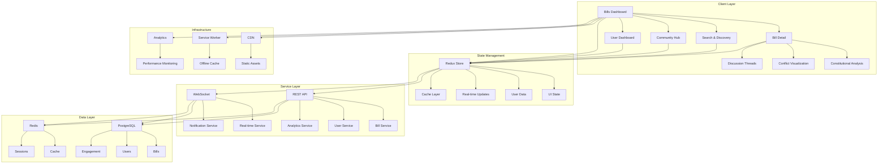

# Chanuka Platform UI Design Specification

## Document Control
**Version:** 3.0
**Date:** December 3, 2025
**Phase:** Quality Assurance & Version Control
**Related Documents:** Requirements Specification v1.0
**Optimization:** Gen-AI Coding Agent Compatible

## Executive Summary

### Problem Statement

Citizens attempting to engage with legislative transparency face three critical challenges that current implementations fail to address adequately:

1. **Information Overload Without Context**: Legislative information exists but remains inaccessible due to legal complexity, poor information architecture, and lack of contextual guidance. Citizens cannot distinguish urgent from routine, consequential from procedural, or trustworthy from speculative analysis.

2. **Fragmented Civic Engagement**: Existing platforms treat discovery, analysis, and action as separate workflows, forcing users to context-switch between tools. This fragmentation reduces engagement quality and makes sustained civic participation cognitively expensive.

3. **Trust and Verification Gaps**: Democratic discourse suffers when users cannot distinguish genuine expertise from confident ignorance, when financial conflicts remain obscured, and when information quality lacks systematic verification.

### Architectural Vision

The Chanuka UI architecture addresses these challenges through three foundational design principles:

**Progressive Disclosure Architecture**: Information reveals itself based on user need and context rather than overwhelming users with comprehensive data upfront. Reading time estimates, complexity indicators, and collapsible sections allow users to choose their engagement depth dynamically.

**Unified Civic Workflow**: Discovery, analysis, and action integrate into a coherent experience. Users transition fluidly from discovering relevant legislation to understanding implications to taking informed action, all within contextual workflows that maintain cognitive continuity.

**Transparent Intelligence Layer**: AI and algorithmic systems make their reasoning visible and contestable. Constitutional analysis shows its methodology. Conflict of interest detection explains what patterns trigger alerts. Expert verification displays credibility factors. This transparency builds trust while maintaining the benefits of computational analysis.

The architecture leverages existing infrastructure (design system, component library, performance monitoring) while introducing new patterns specifically designed for civic engagement at scale.

---

## High-Level System Architecture



### Architecture Layers Explained

**Client Layer**: React-based single-page application with route-based code splitting. Each major view (Dashboard, Detail, Search, Community, User) loads as a separate bundle, minimizing initial load time while maintaining instant navigation through client-side routing.

**State Management**: Redux store manages application state with middleware for WebSocket integration, API calls, and cache synchronization. State shape optimizes for normalized data preventing duplication and enabling efficient updates.

**Service Layer**: RESTful API handles CRUD operations and complex queries. WebSocket service manages real-time updates for bill status changes, new comments, and engagement metrics. Services implement caching strategies and request batching for performance.

**Data Layer**: PostgreSQL provides primary data storage with full-text search capabilities. Redis handles session management, real-time data caching, and pub/sub for WebSocket broadcasting. Data layer implements proper indexing for query performance.

**Infrastructure**: CDN serves static assets with aggressive caching. Service Worker provides offline functionality and asset caching. Analytics monitor real user performance metrics for continuous optimization.

---

## Component Architecture

### Component Hierarchy

```typescript
// Core Layout Components
interface LayoutComponents {
  AppShell: {
    purpose: "Root layout with navigation, auth state, and error boundaries";
    props: {
      user: User | null;
      navigationItems: NavigationItem[];
      mobileBreakpoint: number;
    };
    children: "Route-specific views";
  };
  
  NavigationBar: {
    purpose: "Primary navigation with search, notifications, user menu";
    props: {
      currentRoute: string;
      notifications: Notification[];
      searchEnabled: boolean;
    };
    features: ["responsive collapse", "keyboard shortcuts", "skip links"];
  };
  
  PageLayout: {
    purpose: "Consistent page structure with header, content, sidebar";
    props: {
      header: ReactNode;
      sidebar?: ReactNode;
      sidebarPosition: "left" | "right";
      contentMaxWidth: string;
    };
    accessibility: "landmark regions, heading hierarchy";
  };
}

// Bills Dashboard Components
interface DashboardComponents {
  BillsDashboard: {
    purpose: "Main bills discovery interface";
    composition: [
      "StatsOverview",
      "QuickFilters",
      "AdvancedFilters",
      "BillsGrid",
      "Pagination"
    ];
    state: {
      filters: FilterState;
      sort: SortOptions;
      view: "grid" | "list";
    };
  };
  
  StatsOverview: {
    purpose: "High-level metrics for quick orientation";
    props: {
      totalBills: number;
      urgentCount: number;
      constitutionalFlags: number;
      trendingCount: number;
    };
    updates: "real-time via WebSocket";
  };
  
  BillCard: {
    purpose: "Individual bill display in dashboard";
    props: {
      bill: Bill;
      onSave: (billId: string) => void;
      onShare: (billId: string) => void;
      showQuickActions: boolean;
    };
    features: [
      "status indicator border",
      "urgency badge",
      "engagement metrics",
      "hover quick actions",
      "lazy image loading"
    ];
    accessibility: "keyboard navigation, screen reader labels";
  };
  
  FilterPanel: {
    purpose: "Multi-dimensional filtering interface";
    props: {
      availableFilters: FilterDefinition[];
      activeFilters: FilterState;
      onFilterChange: (filters: FilterState) => void;
      resultCounts: Record<string, number>;
    };
    responsive: {
      desktop: "sidebar panel";
      mobile: "bottom sheet drawer";
    };
  };
}

// Bill Detail Components
interface DetailComponents {
  BillDetailView: {
    purpose: "Comprehensive bill information display";
    composition: [
      "BillHeader",
      "QuickActionsBar",
      "TabbedContent",
      "ProgressiveNavigation"
    ];
    routing: "tabs update URL fragment for deep linking";
  };
  
  BillHeader: {
    purpose: "Bill identification and status";
    props: {
      bill: Bill;
      sponsors: Sponsor[];
      currentStatus: BillStatus;
      timeline: TimelineEvent[];
    };
    features: ["semantic HTML", "structured data markup"];
  };
  
  TabbedContent: {
    purpose: "Organized content with on-demand loading";
    props: {
      tabs: TabDefinition[];
      activeTab: string;
      onTabChange: (tabId: string) => void;
    };
    optimization: "lazy load tab content, cache viewed tabs";
    accessibility: "standard tab ARIA pattern";
  };
  
  ConstitutionalAnalysisPanel: {
    purpose: "Expert constitutional review integration";
    props: {
      analysis: ConstitutionalAnalysis;
      experts: ExpertContribution[];
      precedents: LegalPrecedent[];
      civicActions: CivicAction[];
    };
    features: [
      "severity color coding",
      "expert verification display",
      "expandable precedents",
      "actionable recommendations"
    ];
  };
  
  ConflictVisualization: {
    purpose: "Interactive conflict of interest mapping";
    props: {
      sponsor: Sponsor;
      financialData: FinancialExposure;
      connections: OrganizationalConnection[];
      votingPatterns: VotingPattern[];
    };
    visualization: "D3.js network graph with accessibility fallback";
    interactions: "node click, zoom, pan, keyboard navigation";
  };
}

// Community Components
interface CommunityComponents {
  DiscussionThread: {
    purpose: "Nested comment discussions";
    props: {
      comments: Comment[];
      maxDepth: number;
      sortBy: SortOption;
      onComment: (parentId: string, content: string) => void;
    };
    features: [
      "nested threading",
      "vote system",
      "expert highlight",
      "moderation tools",
      "real-time updates"
    ];
    accessibility: "keyboard navigation, thread depth announcement";
  };
  
  ExpertBadge: {
    purpose: "Display expert verification status";
    props: {
      expert: Expert;
      credibilityScore: number;
      showDetails: boolean;
    };
    features: [
      "verification level indicator",
      "tooltip with credentials",
      "credibility score display"
    ];
    accessibility: "ARIA label, keyboard accessible details";
  };
  
  EngagementAnalytics: {
    purpose: "Real-time participation metrics";
    props: {
      metrics: EngagementMetrics;
      updateInterval: number;
    };
    updates: "WebSocket subscription with fallback polling";
    visualization: "responsive charts using Recharts";
  };
}

// Shared UI Components
interface SharedComponents {
  ProgressiveNavigation: {
    purpose: "Reading guidance and quick jumps";
    props: {
      sections: Section[];
      currentSection: string;
      readingProgress: number;
    };
    features: [
      "complexity indicators",
      "reading time estimates",
      "progress bar",
      "quick jump links"
    ];
    responsive: {
      desktop: "sticky sidebar";
      mobile: "dropdown selector";
    };
  };
  
  SkeletonLoader: {
    purpose: "Loading state that matches content structure";
    props: {
      variant: "card" | "list" | "detail" | "chart";
      count?: number;
    };
    features: "prevents layout shift, accessible loading announcement";
  };
  
  ErrorBoundary: {
    purpose: "Graceful error handling with recovery";
    props: {
      fallback: ReactNode;
      onError: (error: Error, errorInfo: ErrorInfo) => void;
    };
    features: [
      "error logging",
      "user-friendly messages",
      "retry mechanisms",
      "navigation to safe state"
    ];
  };
}
```

---

## Data Models

### Core Data Structures

```typescript
// Bill Entity
interface Bill {
  id: string;
  billNumber: string;
  title: string;
  summary: string;
  fullText: string;
  status: BillStatus;
  urgencyLevel: UrgencyLevel;
  introducedDate: Date;
  lastUpdated: Date;
  
  // Relationships
  sponsors: Sponsor[];
  committees: Committee[];
  amendments: Amendment[];
  relatedBills: string[]; // Bill IDs
  
  // Analysis Data
  constitutionalFlags: ConstitutionalFlag[];
  pretextDetection: PretextAnalysis | null;
  impactAssessment: ImpactAssessment;
  
  // Engagement Data
  viewCount: number;
  saveCount: number;
  commentCount: number;
  shareCount: number;
  
  // Metadata
  policyAreas: string[];
  geographicScope: GeographicScope;
  complexity: ComplexityLevel;
  readingTime: ReadingTime;
}

enum BillStatus {
  PROPOSED = "proposed",
  COMMITTEE_REVIEW = "committee_review",
  FLOOR_DEBATE = "floor_debate",
  PASSED = "passed",
  REJECTED = "rejected",
  ENACTED = "enacted"
}

enum UrgencyLevel {
  CRITICAL = "critical",
  HIGH = "high",
  MEDIUM = "medium",
  LOW = "low"
}

interface ReadingTime {
  quick: number; // minutes for summary
  detailed: number; // minutes for detailed analysis
  comprehensive: number; // minutes for full content
}

// Sponsor and Conflict Analysis
interface Sponsor {
  id: string;
  name: string;
  title: string;
  party: string;
  constituency: string;
  profileImage: string;
  
  // Conflict Data
  financialExposure: FinancialExposure;
  organizationalConnections: OrganizationalConnection[];
  votingPatterns: VotingPattern[];
  transparencyScore: TransparencyScore;
  
  // Engagement
  billsSponsored: number;
  constitutionalFlags: number;
}

interface FinancialExposure {
  totalAmount: number;
  currency: string;
  breakdown: FinancialBreakdown[];
  lastDisclosure: Date;
  completeness: number; // 0-100 percentage
}

interface FinancialBreakdown {
  industry: string;
  amount: number;
  source: string;
  dateReceived: Date;
  disclosureStatus: "disclosed" | "partial" | "undisclosed";
}

interface OrganizationalConnection {
  organizationId: string;
  organizationName: string;
  connectionType: "employment" | "board_member" | "consultant" | "donor" | "family";
  startDate: Date;
  endDate: Date | null;
  description: string;
  relevantToPolicy: string[]; // Policy areas where conflict might exist
}

interface VotingPattern {
  policyArea: string;
  industryAlignment: number; // -1 to 1, negative opposes industry, positive aligns
  votesAnalyzed: number;
  confidence: number; // 0-1 statistical confidence
  significantVotes: Vote[];
}

interface TransparencyScore {
  overall: number; // 0-100
  factors: {
    disclosureCompleteness: number;
    timeliness: number;
    detailLevel: number;
    updateFrequency: number;
  };
  methodology: string;
  lastCalculated: Date;
}

// Constitutional Analysis
interface ConstitutionalFlag {
  id: string;
  severity: "critical" | "high" | "moderate" | "low";
  category: string; // e.g., "free_speech", "due_process", "equal_protection"
  description: string;
  affectedProvisions: BillProvision[];
  constitutionalReference: ConstitutionalReference[];
  expertAnalysis: ExpertAnalysis[];
  communityDiscussion: string; // Discussion thread ID
}

interface ConstitutionalReference {
  article: string;
  section: string;
  text: string;
  interpretation: string;
  relevantCases: LegalPrecedent[];
}

interface LegalPrecedent {
  caseName: string;
  year: number;
  jurisdiction: string;
  summary: string;
  relevance: string;
  outcome: string;
  fullCitation: string;
  url?: string;
}

// Expert Verification
interface Expert {
  userId: string;
  verificationType: "official" | "domain" | "identity";
  credentials: Credential[];
  affiliations: Affiliation[];
  specializations: string[];
  credibilityScore: number; // 0-100
  contributionCount: number;
  avgCommunityRating: number;
  verified: boolean;
  verificationDate: Date;
}

interface Credential {
  type: "education" | "certification" | "publication" | "experience";
  institution: string;
  title: string;
  year: number;
  verified: boolean;
}

interface Affiliation {
  organization: string;
  role: string;
  startDate: Date;
  endDate: Date | null;
  conflictPotential: boolean;
  conflictDescription?: string;
}

interface ExpertAnalysis {
  id: string;
  expertId: string;
  expert: Expert;
  billId: string;
  category: string;
  analysis: string; // Rich text content
  citations: Citation[];
  createdAt: Date;
  updatedAt: Date;
  upvotes: number;
  downvotes: number;
  communityValidation: CommunityValidation;
}

interface CommunityValidation {
  helpful: number;
  wellSupported: number;
  disagree: number;
  avgRating: number;
  reviewCount: number;
}

// Community Engagement
interface Comment {
  id: string;
  parentId: string | null;
  billId: string;
  userId: string;
  user: User;
  content: string; // Sanitized HTML
  createdAt: Date;
  updatedAt: Date;
  depth: number; // Thread nesting level
  upvotes: number;
  downvotes: number;
  flagged: boolean;
  moderationStatus: ModerationStatus;
}

enum ModerationStatus {
  APPROVED = "approved",
  PENDING = "pending",
  FLAGGED = "flagged",
  REMOVED = "removed"
}

interface EngagementMetrics {
  billId: string;
  timeframe: "hour" | "day" | "week";
  metrics: {
    views: number;
    uniqueViews: number;
    comments: number;
    saves: number;
    shares: number;
    expertContributions: number;
  };
  sentiment: SentimentBreakdown;
  participantCount: number;
  expertParticipation: number;
  trendDirection: "up" | "down" | "stable";
}

interface SentimentBreakdown {
  positive: number; // percentage
  neutral: number;
  concerned: number;
  opposed: number;
}

// User Data
interface User {
  id: string;
  email: string;
  displayName: string;
  avatar: string;
  role: UserRole;
  
  // Preferences
  preferences: UserPreferences;
  notificationSettings: NotificationSettings;
  privacySettings: PrivacySettings;
  
  // Engagement
  trackedBills: string[]; // Bill IDs
  engagementHistory: EngagementHistory;
  civicScore: CivicScore;
  
  // Authentication
  lastLogin: Date;
  twoFactorEnabled: boolean;
  emailVerified: boolean;
}

enum UserRole {
  ANONYMOUS = "anonymous",
  USER = "user",
  VERIFIED_EXPERT = "verified_expert",
  MODERATOR = "moderator",
  ADMIN = "admin"
}

interface UserPreferences {
  theme: "light" | "dark" | "auto";
  language: string;
  policyAreas: string[];
  geographicFocus: string[];
  dashboardLayout: string;
  defaultBillView: "grid" | "list";
  defaultSort: SortOption;
}

interface NotificationSettings {
  channels: {
    inApp: boolean;
    email: boolean;
    sms: boolean;
  };
  frequency: {
    immediate: string[]; // Notification types
    daily: string[];
    weekly: string[];
  };
  quietHours: {
    enabled: boolean;
    start: string; // 24-hour time
    end: string;
  };
}

interface EngagementHistory {
  billsViewed: BillInteraction[];
  commentsPosted: number;
  votescast: number;
  sharesCreated: number;
  joinDate: Date;
  lastActive: Date;
}

interface CivicScore {
  overall: number; // 0-100
  factors: {
    participation: number;
    quality: number;
    consistency: number;
    diversity: number;
  };
  level: "emerging" | "active" | "dedicated" | "champion";
  nextMilestone: Milestone;
}
```

---

## State Management Architecture

### Redux Store Structure

```typescript
interface RootState {
  // UI State
  ui: {
    loading: LoadingState;
    errors: ErrorState;
    modals: ModalState;
    navigation: NavigationState;
  };
  
  // Data State
  bills: {
    byId: Record<string, Bill>;
    allIds: string[];
    filters: FilterState;
    sort: SortOptions;
    pagination: PaginationState;
  };
  
  sponsors: {
    byId: Record<string, Sponsor>;
    allIds: string[];
  };
  
  comments: {
    byId: Record<string, Comment>;
    byBillId: Record<string, string[]>; // Bill ID to comment IDs
  };
  
  experts: {
    byId: Record<string, Expert>;
    analyses: Record<string, ExpertAnalysis[]>; // Bill ID to analyses
  };
  
  // User State
  auth: {
    user: User | null;
    token: string | null;
    isAuthenticated: boolean;
    loading: boolean;
  };
  
  userDashboard: {
    trackedBills: string[];
    recentActivity: Activity[];
    recommendations: Recommendation[];
    civicScore: CivicScore;
  };
  
  // Real-time State
  realtime: {
    connected: boolean;
    subscriptions: string[]; // Bill IDs subscribed to
    pendingUpdates: Update[];
  };
  
  // Cache State
  cache: {
    billDetails: Record<string, CacheEntry>;
    searchResults: Record<string, CacheEntry>;
    expirationTimes: Record<string, number>;
  };
}

interface LoadingState {
  global: boolean;
  bills: boolean;
  billDetail: boolean;
  comments: boolean;
  search: boolean;
}

interface ErrorState {
  global: Error | null;
  bills: Error | null;
  billDetail: Error | null;
  comments: Error | null;
}

interface FilterState {
  billType: string[];
  policyAreas: string[];
  sponsors: string[];
  timeframe: {
    start: Date | null;
    end: Date | null;
  };
  urgencyLevels: UrgencyLevel[];
  controversyLevels: string[];
  constitutionalFlags: boolean;
  geographicScope: string[];
}

interface CacheEntry {
  data: any;
  timestamp: number;
  expiresAt: number;
}
```

### State Update Patterns

```typescript
// Redux Actions - Normalized Data Pattern
const billsSlice = createSlice({
  name: 'bills',
  initialState,
  reducers: {
    // Normalized data updates
    billsReceived: (state, action: PayloadAction<Bill[]>) => {
      const normalized = normalizeBills(action.payload);
      state.byId = { ...state.byId, ...normalized.byId };
      state.allIds = [...new Set([...state.allIds, ...normalized.allIds])];
    },
    
    billUpdated: (state, action: PayloadAction<Bill>) => {
      state.byId[action.payload.id] = action.payload;
    },
    
    // Real-time update
    billStatusChanged: (state, action: PayloadAction<{billId: string, status: BillStatus}>) => {
      const bill = state.byId[action.payload.billId];
      if (bill) {
        bill.status = action.payload.status;
        bill.lastUpdated = new Date();
      }
    }
  }
});

// Selectors with Memoization
const selectBillById = (state: RootState, billId: string) => 
  state.bills.byId[billId];

const selectFilteredBills = createSelector(
  [
    (state: RootState) => state.bills.byId,
    (state: RootState) => state.bills.allIds,
    (state: RootState) => state.bills.filters
  ],
  (byId, allIds, filters) => {
    return allIds
      .map(id => byId[id])
      .filter(bill => applyFilters(bill, filters));
  }
);

const selectBillWithSponsors = createSelector(
  [selectBillById, (state: RootState) => state.sponsors.byId],
  (bill, sponsors) => {
    if (!bill) return null;
    return {
      ...bill,
      sponsors: bill.sponsors.map(sponsorId => sponsors[sponsorId])
    };
  }
);
```

---

## Error Handling Strategy

### Hierarchical Error Management

```typescript
// Error Types
enum ErrorSeverity {
  CRITICAL = "critical", // App cannot function
  HIGH = "high",          // Feature unavailable
  MEDIUM = "medium",      // Degraded experience
  LOW = "low"            // Minor issue, user can continue
}

interface AppError {
  severity: ErrorSeverity;
  code: string;
  message: string;
  userMessage: string;
  timestamp: Date;
  context?: Record<string, any>;
  recoverable: boolean;
  recovery?: () => void;
}

// Error Boundary Pattern
class FeatureErrorBoundary extends React.Component<Props, State> {
  state = { hasError: false, error: null };
  
  static getDerivedStateFromError(error: Error) {
    return { hasError: true, error };
  }
  
  componentDidCatch(error: Error, errorInfo: ErrorInfo) {
    // Log error to monitoring service
    logError({
      error,
      errorInfo,
      severity: this.determineSeverity(error),
      userContext: this.props.user
    });
  }
  
  determineSeverity(error: Error): ErrorSeverity {
    if (error instanceof NetworkError) return ErrorSeverity.MEDIUM;
    if (error instanceof AuthenticationError) return ErrorSeverity.HIGH;
    return ErrorSeverity.LOW;
  }
  
  render() {
    if (this.state.hasError) {
      return (
        <ErrorFallback
          error={this.state.error}
          onRetry={() => this.setState({ hasError: false, error: null })}
          onNavigate={() => window.location.href = '/'}
        />
      );
    }
    return this.props.children;
  }
}

// Recovery Mechanisms
const errorRecoveryStrategies = {
  NetworkError: {
    retry: true,
    retryDelay: [1000, 2000, 5000], // Exponential backoff
    fallback: () => loadCachedData(),
    userMessage: "Connection issue. Retrying..."
  },
  
  AuthenticationError: {
    retry: false,
    fallback: () => redirectToLogin(),
    userMessage: "Please sign in again to continue"
  },
  
  ValidationError: {
    retry: false,
    fallback: () => showValidationFeedback(),
    userMessage: "Please check your input and try again"
  },
  
  ServerError: {
    retry: true,
    retryDelay: [2000, 5000, 10000],
    fallback: () => showGracefulDegradation(),
    userMessage: "Server issue. We're working on it..."
  }
};

// Graceful Degradation
interface FallbackStrategy {
  component: React.ComponentType;
  data: any;
  limitations: string[];
}

const fallbackStrategies: Record<string, FallbackStrategy> = {
  BillDetail: {
    component: SimpleBillView,
    data: () => loadCachedBillData(),
    limitations: ["Real-time updates unavailable", "Comments view only"]
  },
  
  Search: {
    component: BasicSearch,
    data: () => loadRecentBills(),
    limitations: ["Advanced filters unavailable", "Results may be cached"]
  },
  
  ConflictVisualization: {
    component: TableView,
    data: (props) => props.sponsor.financialData,
    limitations: ["Interactive visualization unavailable"]
  }
};
```

---

## Testing Strategy

### Testing Pyramid

```typescript
// Unit Tests - Component Behavior
describe('BillCard', () => {
  it('displays bill information correctly', () => {
    const bill = createMockBill();
    const { getByText, getByRole } = render(<BillCard bill={bill} />);
    
    expect(getByText(bill.title)).toBeInTheDocument();
    expect(getByRole('article')).toHaveAttribute('aria-label', `Bill: ${bill.title}`);
  });
  
  it('shows urgency badge when bill is critical', () => {
    const criticalBill = createMockBill({ urgencyLevel: 'critical' });
    const { getByText } = render(<BillCard bill={criticalBill} />);
    
    expect(getByText('Critical')).toBeInTheDocument();
  });
  
  it('calls onSave when save button clicked', () => {
    const bill = createMockBill();
    const onSave = jest.fn();
    const { getByRole } = render(<BillCard bill={bill} onSave={onSave} />);
    
    fireEvent.click(getByRole('button', { name: /save/i }));
    expect(onSave).toHaveBeenCalledWith(bill.id);
  });
});

// Integration Tests - Feature Workflows
describe('Bill Discovery Workflow', () => {
  it('allows filtering and viewing bill details', async () => {
    const { user } = setup(<BillsDashboard />);
    
    // Apply filter
    await user.click(screen.getByRole('button', { name: /filters/i }));
    await user.click(screen.getByLabelText('Health Policy'));
    await user.click(screen.getByRole('button', { name: /apply/i }));
    
    // Verify filtered results
    await waitFor(() => {
      expect(screen.getAllByRole('article')).toHaveLength(5);
    });
    
    // Navigate to detail
    await user.click(screen.getByText('Healthcare Reform Act'));
    
    // Verify detail page loaded
    expect(screen.getByRole('heading', { level: 1 })).toHaveTextContent('Healthcare Reform Act');
  });
});

// Accessibility Tests
describe('Accessibility Compliance', () => {
  it('has no accessibility violations', async () => {
    const { container } = render(<BillsDashboard />);
    const results = await axe(container);
    
    expect(results).toHaveNoViolations();
  });
  
  it('supports keyboard navigation', async () => {
    const { user } = setup(<BillCard bill={mockBill} />);
    
    // Tab to card
    await user.tab();
    expect(screen.getByRole('article')).toHaveFocus();
    
    // Tab to save button
    await user.tab();
    expect(screen.getByRole('button', { name: /save/i })).toHaveFocus();
    
    // Activate with Enter
    await user.keyboard('{Enter}');
    expect(mockOnSave).toHaveBeenCalled();
  });
  
  it('announces dynamic content to screen readers', async () => {
    const { rerender } = render(<StatsOverview stats={initialStats} />);
    
    const liveRegion = screen.getByRole('status');
    expect(liveRegion).toHaveAttribute('aria-live', 'polite');
    
    // Update stats
    rerender(<StatsOverview stats={updatedStats} />);
    
    expect(liveRegion).toHaveTextContent('Stats updated: 156 active bills');
  });
});

// Performance Tests
describe('Performance Benchmarks', () => {
  it('renders dashboard within performance budget', async () => {
    const startTime = performance.now();
    
    render(<BillsDashboard bills={largeBillsDataset} />);
    
    const renderTime = performance.now() - startTime;
    expect(renderTime).toBeLessThan(100); // 100ms budget
  });
  
  it('lazy loads below-fold content', () => {
    const { container } = render(<BillsGrid bills={manyBills} />);
    
    const billCards = container.querySelectorAll('[data-testid="bill-card"]');
    const aboveFold = Array.from(billCards).slice(0, 6);
    const belowFold = Array.from(billCards).slice(6);
    
    // Above-fold images should have src
    aboveFold.forEach(card => {
      const img = card.querySelector('img');
      expect(img).toHaveAttribute('src');
    });
    
    // Below-fold images should use loading="lazy"
    belowFold.forEach(card => {
      const img = card.querySelector('img');
      expect(img).toHaveAttribute('loading', 'lazy');
    });
  });
});

// Real-time Integration Tests
describe('WebSocket Real-time Updates', () => {
  it('receives and displays bill status updates', async () => {
    const { mockSocket } = setupWebSocketTest();
    render(<BillDetailView billId="123" />);
    
    // Simulate WebSocket message
    act(() => {
      mockSocket.emit('bill:status-changed', {
        billId: '123',
        status: 'passed',
        timestamp: new Date()
      });
    });
    
    await waitFor(() => {
      expect(screen.getByText('Status: Passed')).toBeInTheDocument();
    });
  });
  
  it('falls back to polling when WebSocket unavailable', async () => {
    const { mockFetch } = setupMockFetch();
    setupWebSocketTest({ failConnection: true });
    
    render(<BillDetailView billId="123" />);
    
    // Wait for fallback polling
    await waitFor(() => {
      expect(mockFetch).toHaveBeenCalledWith(
        expect.stringContaining('/api/bills/123'),
        expect.any(Object)
      );
    }, { timeout: 11000 }); // 10s polling interval + buffer
  });
});
```

---

## Conclusion

This design specification provides comprehensive guidance for implementing the Chanuka platform UI. The architecture balances complexity with usability, performance with features, and innovation with accessibility. By following these specifications, development teams can build a civic engagement platform that truly serves democratic participation while maintaining technical excellence