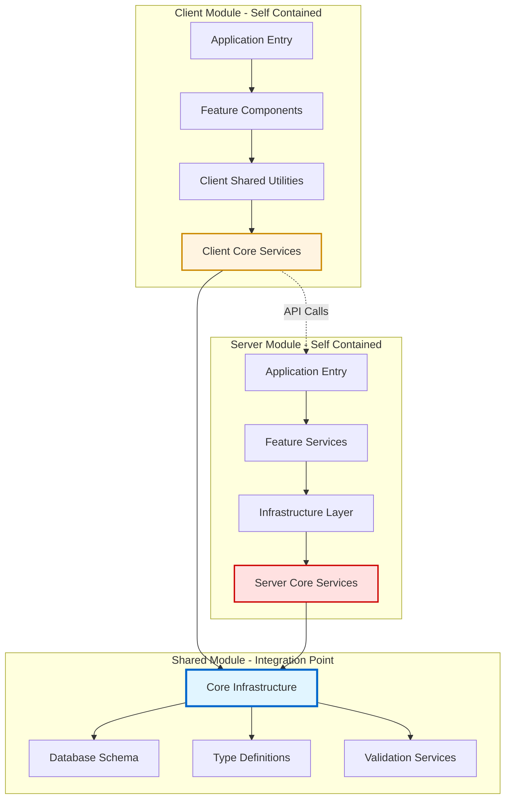
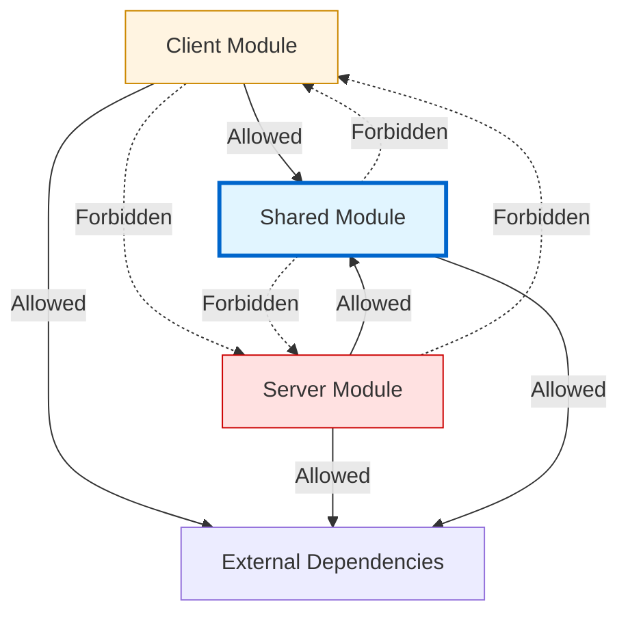

# Chanuka Platform Consolidation Design Specification

## Document Control
- **Project**: Chanuka Civic Engagement Platform Consolidation
- **Document Type**: Technical Design Specification
- **Version**: 1.0
- **Date**: 2024-11-27
- **Status**: Implementation Ready

---

## Executive Summary

This design document provides the architectural blueprint for consolidating the Chanuka platform from its current state of fragmentation—characterized by dual architectures, abandoned migration artifacts, and distributed responsibilities—into a cohesive, maintainable system. The design prioritizes strategic functionality preservation, establishes clear module boundaries, and creates self-contained consolidation within client, shared, and server modules before final integration.

The consolidation addresses three critical architectural challenges: eliminating redundant patterns that slow development velocity, establishing canonical approaches that remove decision paralysis, and creating strategic boundaries that prevent inappropriate cross-module dependencies. This is not a rewrite but a careful surgical consolidation that preserves your sophisticated domain modeling while removing the scaffolding from incomplete migrations.

---

## Current State Analysis: Understanding the Fragmentation

### The Dual Architecture Problem

Your codebase reveals two parallel architectural approaches operating simultaneously. The legacy structure uses traditional `controllers/routes/services` at the root level, while the modern approach implements feature-sliced design with proper domain-driven architecture in `server/features/`. This duality creates cognitive overhead—every new feature requires developers to choose which pattern to follow, and the existence of both patterns suggests neither is definitively correct, leading to inconsistent implementations.

This architectural ambiguity manifests in your database layer, where connection management exists in three locations: `shared/database/core/connection-manager.ts`, `server/infrastructure/database/connection-pool.ts`, and `server/db.ts`. Each implementation has slightly different error handling, retry logic, and connection pooling behavior, meaning your application's reliability characteristics vary depending on the code path executing.

### Migration Artifacts as Archaeological Markers

Files like `main-restored.tsx`, `main-simple.tsx`, and entire directories with `.backup` suffixes tell the story of development under pressure. The timestamp-versioned Vite configuration files (`vite.config.ts.timestamp-*`) indicate build instability moments where recovery files were created but never cleaned up. Scripts named `emergency-build-fix.ts` and `super-aggressive-suppressor.ts` are not just utilities—they're preserved crisis responses that should have been temporary solutions.

These artifacts create three specific problems. First, they generate visual noise that makes navigation difficult and slows developers trying to understand the canonical implementation. Second, they create uncertainty about which version is current, forcing developers to investigate file timestamps and contents rather than trusting the file system structure. Third, they preserve technical debt by making past problems visible without providing context about whether they're resolved.

### Search System Overengineering

Your search infrastructure demonstrates sophisticated engineering that may exceed current needs. You've implemented PostgreSQL full-text search, Fuse.js for client-side searching, and semantic search capabilities, each with distinct query intent analysis, typo correction, and relevance scoring. This creates maintenance burden because each engine requires different index management strategies, different query syntax patterns, different performance characteristics, and different monitoring approaches.

The test files show extensive work validating these approaches against each other, optimizing relevance scoring across implementations—work that makes sense for platforms serving millions of queries daily with sophisticated user expectations, but represents premature optimization for a pre-launch civic engagement platform.

---

## Design Principles: Guiding the Consolidation

### Principle 1: Module Self-Containment

Each module (client, shared, server) must be self-contained with clearly defined public interfaces. Internal consolidation happens independently within each module before any cross-module integration occurs. This prevents the common pitfall of creating new coupling while attempting to remove old coupling.

The shared module serves as the integration point, exporting only stable, well-documented interfaces. Client and server modules consume these interfaces without knowledge of internal implementation details. This creates the architectural flexibility needed for your planned Neo4j migration—when you swap database implementations, only the server infrastructure layer changes while features remain unaffected.

### Principle 2: Preserve Strategic Investment

Your domain modeling, feature separation, and infrastructure patterns represent significant valuable work. Consolidation means finishing incomplete work and removing contradictory patterns, not rebuilding from scratch. The sophisticated features you've built—constitutional analysis, conflict detection, real-time tracking—are architectural assets that need proper integration, not replacement.

### Principle 3: Progressive Capability Activation

Complex features like multi-tier caching, circuit breakers, and AI deduplication middleware solve problems that emerge at scale. Rather than removing these capabilities, the design establishes feature flags that allow progressive activation as needs emerge. You've built multiple floors of a building simultaneously; consolidation means finishing floor one completely before continuing upward.

### Principle 4: Strategic Boundary Enforcement

Inappropriate dependencies between modules create the maintenance burden you're experiencing. The design establishes enforcement mechanisms—linting rules, architectural tests, dependency graphs—that prevent client from importing server code, ensure shared remains dependency-free of client and server, and verify that features consume shared infrastructure through defined interfaces.

---

## High-Level Architecture: The Consolidated Vision



### Component Specifications

#### Shared Core Infrastructure

The shared module provides foundational services consumed by both client and server without creating circular dependencies. This module consolidates your current scattered utilities into cohesive service layers.

```typescript
// shared/core/src/index.ts - Public Interface
export interface ISharedCore {
  caching: ICachingService;
  observability: IObservabilityStack;
  validation: IValidationService;
  primitives: typeof Primitives;
}

// Caching Service - Consolidates all cache implementations
export interface ICachingService {
  createCache<T>(config: CacheConfig): ICache<T>;
  createAICache(config: AICacheConfig): IAICache;
  createSingleFlightCache<T>(config: SingleFlightConfig): ISingleFlightCache<T>;
}

// Observability Stack - Unified monitoring
export interface IObservabilityStack {
  logging: ILoggingService;
  metrics: IMetricsService;
  tracing: ITracingService;
  health: IHealthChecker;
  errorManagement: IErrorManagementService;
}

// Validation Service - Single source of truth
export interface IValidationService {
  validate<T>(data: unknown, schema: ValidationSchema<T>): Result<T, ValidationError>;
  createMiddleware(schema: ValidationSchema): ValidationMiddleware;
  registerCustomValidator(name: string, validator: CustomValidator): void;
}
```

This interface design ensures that both client and server access shared functionality through a stable API. Internal implementation changes don't ripple through dependent modules because the interface contract remains constant.

#### Server Core Services

The server module consolidates around repository interfaces that abstract data access, enabling your Neo4j migration while maintaining feature stability.

```typescript
// server/core/services/interfaces/index.ts
export interface IRepositoryFactory {
  createBillRepository(): IBillRepository;
  createUserRepository(): IUserRepository;
  createNotificationRepository(): INotificationRepository;
}

// Repository Interface Pattern
export interface IBillRepository {
  findById(id: string): Promise<Result<Bill, RepositoryError>>;
  findByStatus(status: BillStatus, options?: QueryOptions): Promise<Result<Bill[], RepositoryError>>;
  findBySearchCriteria(criteria: SearchCriteria): Promise<Result<Bill[], RepositoryError>>;
  save(bill: Bill): Promise<Result<Bill, RepositoryError>>;
  update(id: string, updates: Partial<Bill>): Promise<Result<Bill, RepositoryError>>;
  delete(id: string): Promise<Result<void, RepositoryError>>;
}

// Implementation Factory
export class RepositoryFactory implements IRepositoryFactory {
  constructor(
    private readonly connectionManager: IConnectionManager,
    private readonly cache: ICachingService,
    private readonly logger: ILoggingService
  ) {}
  
  createBillRepository(): IBillRepository {
    // Currently returns Drizzle implementation
    // Future: Returns Neo4j implementation with same interface
    return new DrizzleBillRepository(
      this.connectionManager,
      this.cache,
      this.logger
    );
  }
}
```

This pattern provides the database abstraction that your analysis correctly identified as essential. Features depend on `IBillRepository`, not `DrizzleBillRepository`, making the database technology an implementation detail that can be swapped without feature code changes.

#### Client Core Services

The client module consolidates around feature-sliced design with clear boundaries between features and shared infrastructure.

```typescript
// client/src/core/services/index.ts
export interface IClientCore {
  api: IApiClient;
  state: IStateManagement;
  navigation: INavigationService;
  error: IErrorBoundaryService;
}

// API Client - Single communication layer
export interface IApiClient {
  bills: IBillsApiClient;
  users: IUsersApiClient;
  notifications: INotificationsApiClient;
  // Feature-specific clients
}

// Feature Isolation Pattern
// client/src/features/bills/index.ts
export interface IBillsFeature {
  components: typeof BillsComponents;
  hooks: typeof BillsHooks;
  types: typeof BillsTypes;
  // No internal implementation exported
}
```

This structure ensures features remain self-contained. When you add bill tracking functionality, all related code lives in `client/src/features/bills/` rather than scattered across generic component directories.

---

## Data Architecture: Repository Interface Pattern

### Current State Challenge

Your current architecture couples features directly to Drizzle ORM, creating several problems. Feature code imports Drizzle types, constructs queries directly, and handles database-specific error codes. This tight coupling means your Neo4j migration requires rewriting every feature that accesses data—potentially hundreds of query sites across your codebase.

### Repository Interface Solution

The repository interface pattern introduces an abstraction layer that completely decouples features from database technology:

```typescript
// Feature code before consolidation (problematic)
import { db } from '@/server/db';
import { bills } from '@/shared/schema';
import { eq } from 'drizzle-orm';

async function getBillByStatus(status: string) {
  const results = await db
    .select()
    .from(bills)
    .where(eq(bills.status, status));
  return results;
}

// Feature code after consolidation (decoupled)
import { IBillRepository } from '@/server/core/services/interfaces';
import { Result } from '@/shared/core/primitives';

class BillService {
  constructor(private readonly billRepository: IBillRepository) {}
  
  async getBillsByStatus(status: BillStatus): Promise<Result<Bill[], ServiceError>> {
    const result = await this.billRepository.findByStatus(status);
    return result.map(bills => this.enrichWithMetadata(bills));
  }
}
```

The feature now depends on an interface contract, not an implementation. When you migrate to Neo4j, you create `Neo4jBillRepository` implementing `IBillRepository`, and feature code continues working unchanged.

### Migration Strategy Through Parallel Implementation

The repository pattern enables a powerful migration strategy where both databases run in parallel during transition:

```typescript
export class HybridBillRepository implements IBillRepository {
  constructor(
    private readonly drizzleRepo: DrizzleBillRepository,
    private readonly neo4jRepo: Neo4jBillRepository,
    private readonly config: MigrationConfig
  ) {}
  
  async findById(id: string): Promise<Result<Bill, RepositoryError>> {
    // Primary: Current production database
    const primaryResult = await this.drizzleRepo.findById(id);
    
    // Shadow: New database for validation
    if (this.config.shadowMode) {
      const shadowResult = await this.neo4jRepo.findById(id);
      this.compareResults(primaryResult, shadowResult);
    }
    
    return primaryResult;
  }
  
  private compareResults(primary: Result<Bill>, shadow: Result<Bill>): void {
    // Log discrepancies for analysis
    // Helps validate migration correctness in production
  }
}
```

This approach lets you validate Neo4j implementation correctness in production with real traffic before cutting over, dramatically reducing migration risk.

---

## Search System Rationalization

### Current State Analysis

Your search implementation demonstrates thorough engineering with three complete engines: PostgreSQL full-text search with tsvector indexing, Fuse.js with configurable fuzzy matching, and semantic search with embedding generation. Each engine has distinct strengths: PostgreSQL scales well and integrates with your existing data, Fuse.js provides instant client-side search, and semantic search understands conceptual similarity.

However, maintaining three engines creates burden. Index management differs across engines—PostgreSQL requires trigger-based tsvector updates, Fuse.js needs in-memory index rebuilds, and semantic search requires embedding regeneration on content changes. Query syntax varies, making it difficult to provide consistent user experience. Performance characteristics differ, requiring separate tuning approaches.

### Consolidated Search Architecture

The design consolidates around PostgreSQL as the primary search engine while preserving other engines as disabled capabilities that can be progressively activated:

```typescript
// server/features/search/application/search-service.ts
export class ConsolidatedSearchService {
  constructor(
    private readonly primaryEngine: PostgreSQLSearchEngine,
    private readonly experimentalEngines: Map<string, ISearchEngine>,
    private readonly featureFlags: IFeatureFlagService
  ) {}
  
  async search(query: SearchQuery): Promise<SearchResults> {
    // Always use primary engine
    const results = await this.primaryEngine.search(query);
    
    // Optional: Compare with experimental engines for validation
    if (this.featureFlags.isEnabled('search.comparison')) {
      await this.compareEngines(query, results);
    }
    
    return results;
  }
  
  private async compareEngines(
    query: SearchQuery,
    primaryResults: SearchResults
  ): Promise<void> {
    // Shadow traffic to experimental engines
    // Log relevance scores for analysis
    // Build confidence in alternative implementations
  }
}
```

This design provides several advantages. PostgreSQL handles all production traffic, eliminating the complexity of multi-engine coordination. Alternative engines remain in the codebase as working code, not commented-out experiments, preserving your investment. Feature flags enable experimental comparison without affecting production users. When scale demands alternative engines, the infrastructure exists and has been validated.

### PostgreSQL Optimization Focus

With a single production engine, optimization effort concentrates productively:

```typescript
// server/features/search/infrastructure/postgresql-optimizer.ts
export class PostgreSQLSearchOptimizer {
  async optimizeIndexes(): Promise<OptimizationReport> {
    // Analyze query patterns
    const patterns = await this.analyzeQueryPatterns();
    
    // Recommend index improvements
    const recommendations = this.generateIndexRecommendations(patterns);
    
    // Apply approved optimizations
    return this.applyOptimizations(recommendations);
  }
  
  async tuneRelevanceScoring(): Promise<ScoringConfig> {
    // Use search analytics to improve ranking
    const analytics = await this.getSearchAnalytics();
    
    // Adjust weights based on user engagement
    return this.adjustRankingWeights(analytics);
  }
}
```

This focused approach delivers better results than maintaining three partially-optimized engines. Your search quality improves through concentrated effort on one implementation.

---

## Frontend Consolidation: Feature-Sliced Design

### Current State Challenge

Your client structure scatters components across four organizational patterns: `client/src/components` for generic components, `client/src/features` for domain-specific components, `client/src/lib` for shared utilities, and `client/src/ui` for your design system. Components also live directly in feature directories without consistent organization.

This creates the same decision paralysis you experience on the backend. When creating a bill status badge component, should it go in components (generic), features/bills (specific), or ui (design system)? The answer requires judgment rather than following a clear rule, and different developers make different choices, leading to organizational drift.

### Feature-Sliced Design Structure

Feature-Sliced Design provides unambiguous rules for component placement:

```
client/src/
├── app/                    # Application initialization
├── features/               # Feature-specific code
│   ├── bills/
│   │   ├── ui/            # Components used only by bills feature
│   │   │   ├── BillCard.tsx
│   │   │   ├── BillStatusBadge.tsx
│   │   │   └── BillFilterPanel.tsx
│   │   ├── model/         # State management
│   │   ├── api/           # API integration
│   │   └── index.ts       # Public interface
│   └── users/
│       ├── ui/
│       └── ...
├── shared/                # Cross-cutting concerns
│   ├── ui/               # Components used by multiple features
│   │   └── StatusBadge.tsx  # Only moved here when actually reused
│   ├── api/              # Shared API utilities
│   └── lib/              # Shared business logic
└── widgets/              # Complex reusable components
```

The placement rule is simple: components belong to the feature that uses them. Only when a component is genuinely used by multiple features (proven by actual imports from multiple feature directories) does it get promoted to shared. This prevents premature abstraction—creating shared components based on speculation about future reuse.

### Migration Approach

The migration happens feature-by-feature, not through a big-bang reorganization:

```typescript
// Step 1: Create feature structure for bills
client/src/features/bills/
├── ui/
│   ├── BillCard.tsx        // Moved from components/bills/
│   ├── BillStatusBadge.tsx // Moved from components/bills/
│   └── BillList.tsx        // Moved from components/bills/
├── model/
│   └── useBillsStore.ts    // State management
├── api/
│   └── billsApi.ts         // API calls
└── index.ts                 // Export public interface

// Step 2: Update imports in consuming code
// Before: import { BillCard } from '@/components/bills/BillCard';
// After:  import { BillCard } from '@/features/bills';

// Step 3: Verify no other features import bills components directly
// Step 4: Delete old components/bills/ directory
```

This incremental approach limits risk. You migrate one feature, verify functionality, then proceed to the next. If issues arise, only one feature needs rollback rather than the entire frontend structure.

---

## Security Consolidation: Policy vs. Enforcement

### Current State Challenge

Your security implementation shows strong awareness of modern concerns—CSP, CSRF protection, input sanitization, rate limiting, security monitoring, and intrusion detection. However, these concerns spread across `server/infrastructure/security/`, `shared/core/src/observability/error-management/`, `client/src/security/`, and within individual feature domains.

This distribution creates two problems. First, auditing security posture requires examining dozens of files across multiple directories, making it difficult to verify consistent protection. Second, security logic duplication means updates require changes in multiple places, and it's easy to update one location while missing others.

### Consolidated Security Architecture

The design distinguishes between security policies (the rules) and security enforcement (the mechanisms):

```typescript
// shared/core/src/security/policies/index.ts
export class SecurityPolicyRegistry {
  // Centralized policy definitions
  
  getRateLimitPolicy(endpoint: string): RateLimitPolicy {
    return {
      endpoint,
      limit: this.policies.rateLimit[endpoint] || this.policies.rateLimit.default,
      window: '15m',
      keyGenerator: (req) => req.user?.id || req.ip
    };
  }
  
  getCSPPolicy(context: SecurityContext): CSPPolicy {
    return {
      directives: {
        defaultSrc: ["'self'"],
        scriptSrc: this.getScriptSources(context),
        styleSrc: ["'self'", "'unsafe-inline'"],
        connectSrc: this.getConnectSources(context)
      }
    };
  }
  
  getInputValidationRules(dataType: string): ValidationRules {
    return this.policies.validation[dataType];
  }
}

// server/middleware/security-enforcement.ts
export class SecurityEnforcement {
  constructor(
    private readonly policies: SecurityPolicyRegistry,
    private readonly logger: ILoggingService
  ) {}
  
  createRateLimitMiddleware(endpoint: string): Middleware {
    const policy = this.policies.getRateLimitPolicy(endpoint);
    return rateLimiter(policy); // Enforcement uses centralized policy
  }
  
  createCSPMiddleware(context: SecurityContext): Middleware {
    const policy = this.policies.getCSPPolicy(context);
    return cspEnforcer(policy); // Enforcement uses centralized policy
  }
}
```

This separation provides several advantages. Security policies live in one reviewable location, making audits straightforward. Policy updates propagate automatically to all enforcement points without code changes. Testing security policies doesn't require setting up enforcement infrastructure. Adding new security requirements means defining policy rules and choosing appropriate enforcement mechanisms.

---

## Error Handling Consolidation

### Current State Challenge

Your error handling shows sophisticated patterns—base error classes, specialized error types, error boundaries, recovery strategies, and analytics integration. However, the implementation fragments across `shared/core/src/observability/error-management/`, `client/src/components/error-handling/`, `server/middleware/`, and feature-specific error handlers.

This fragmentation means error handling behavior varies across the application. Some features use the sophisticated error recovery engine, others catch errors without recovery, and some let errors bubble unhandled. Users experience inconsistent error messages depending on which code path fails.

### Unified Error Management Architecture

The design consolidates around a hierarchical error management system:

```typescript
// shared/core/src/observability/error-management/index.ts
export class UnifiedErrorManager {
  private handlers: ErrorHandlerChain;
  private analytics: ErrorAnalyticsService;
  private recovery: ErrorRecoveryEngine;
  
  constructor(config: ErrorManagementConfig) {
    this.handlers = this.buildHandlerChain(config);
    this.analytics = new ErrorAnalyticsService(config.analytics);
    this.recovery = new ErrorRecoveryEngine(config.recovery);
  }
  
  async handleError(error: Error, context: ErrorContext): Promise<ErrorResolution> {
    // 1. Classify error
    const classification = this.classifyError(error);
    
    // 2. Track analytics
    this.analytics.trackError(error, classification, context);
    
    // 3. Attempt recovery
    const recoveryResult = await this.recovery.attemptRecovery(
      error,
      classification,
      context
    );
    
    // 4. If recovery fails, delegate to handler chain
    if (!recoveryResult.recovered) {
      return this.handlers.handle(error, classification, context);
    }
    
    return { recovered: true, strategy: recoveryResult.strategy };
  }
  
  // Feature-specific registration
  registerFeatureHandler(feature: string, handler: FeatureErrorHandler): void {
    this.handlers.registerFeatureHandler(feature, handler);
  }
}

// Feature integration
// server/features/bills/infrastructure/error-handling.ts
export class BillsErrorHandler implements FeatureErrorHandler {
  handle(error: Error, context: ErrorContext): Promise<ErrorResolution> {
    if (error instanceof BillNotFoundError) {
      return { 
        recovered: true,
        strategy: 'default_bill',
        userMessage: 'The requested bill could not be found. Showing recent bills instead.'
      };
    }
    
    // Delegate to next handler if not bills-specific
    return { recovered: false };
  }
}
```

This architecture provides consistent error handling application-wide while allowing feature-specific customization. Every error flows through the unified manager, ensuring analytics capture, recovery attempts, and appropriate user messaging. Features register custom handlers for domain-specific errors but inherit baseline error management automatically.

---

## Testing Infrastructure Consolidation

### Current State Challenge

Your testing infrastructure demonstrates comprehensive coverage—unit tests, integration tests, end-to-end tests, performance tests, accessibility tests, and visual regression tests. However, separate configurations for each test type create operational complexity. You have multiple Vitest configurations, multiple Playwright configurations, and Jest configurations for accessibility testing. Running the full test suite requires executing multiple commands with different configurations.

### Unified Testing Architecture

The design consolidates around single configuration files using project references:

```typescript
// vitest.config.ts - Single configuration
export default defineConfig({
  test: {
    // Shared configuration
    globals: true,
    environment: 'node',
    setupFiles: ['./tests/setup.ts'],
    
    // Project-based test organization
    projects: [
      {
        name: 'unit',
        testMatch: ['**/*.test.ts', '**/*.test.tsx'],
        exclude: ['**/*.integration.test.ts', '**/*.e2e.test.ts'],
        environment: 'jsdom' // For React component tests
      },
      {
        name: 'integration',
        testMatch: ['**/*.integration.test.ts'],
        setupFiles: ['./tests/integration-setup.ts']
      },
      {
        name: 'performance',
        testMatch: ['**/*.performance.test.ts'],
        testTimeout: 30000, // Longer timeout for performance tests
        reporters: ['performance-reporter']
      }
    ]
  }
});

// playwright.config.ts - Single configuration
export default defineConfig({
  projects: [
    {
      name: 'chromium',
      use: { ...devices['Desktop Chrome'] }
    },
    {
      name: 'firefox',
      use: { ...devices['Desktop Firefox'] }
    },
    {
      name: 'mobile',
      use: { ...devices['iPhone 13'] }
    },
    {
      name: 'accessibility',
      use: { 
        ...devices['Desktop Chrome'],
        // Accessibility-specific configuration
      },
      testMatch: /.*\.a11y\.test\.ts/
    }
  ]
});
```

This consolidation provides several benefits. Developers run targeted tests with simple commands: `npm test -- --project=unit` or `npm test -- --project=integration`. CI/CD configuration simplifies to running one test command with different project filters. Shared configuration means timeout adjustments and reporter changes apply consistently across test types. Adding new test categories means adding a project definition, not creating entirely new configuration files.

---

## Module Boundary Enforcement

### Dependency Graph Visualization

The consolidated architecture enforces strict module boundaries through automated validation:



### Enforcement Mechanisms

The design implements multiple enforcement layers to prevent boundary violations:

```typescript
// .eslintrc.js - Linting enforcement
module.exports = {
  rules: {
    'import/no-restricted-paths': ['error', {
      zones: [
        {
          target: './client',
          from: './server',
          message: 'Client cannot import server code. Move shared logic to shared module.'
        },
        {
          target: './server',
          from: './client',
          message: 'Server cannot import client code. Move shared logic to shared module.'
        },
        {
          target: './shared',
          from: './client',
          message: 'Shared module cannot depend on client. Remove client-specific code.'
        },
        {
          target: './shared',
          from: './server',
          message: 'Shared module cannot depend on server. Remove server-specific code.'
        }
      ]
    }]
  }
};

// Architectural tests
// tests/architecture/module-boundaries.test.ts
describe('Module Boundary Enforcement', () => {
  it('should prevent client importing server', async () => {
    const violations = await analyzeImports('./client', './server');
    expect(violations).toHaveLength(0);
  });
  
  it('should prevent server importing client', async () => {
    const violations = await analyzeImports('./server', './client');
    expect(violations).toHaveLength(0);
  });
  
  it('should prevent shared importing client or server', async () => {
    const clientViolations = await analyzeImports('./shared', './client');
    const serverViolations = await analyzeImports('./shared', './server');
    expect([...clientViolations, ...serverViolations]).toHaveLength(0);
  });
});
```

These mechanisms catch boundary violations automatically. Linting rules fail during development, providing immediate feedback. Architectural tests run in CI, preventing boundary violations from merging. Dependency graphs visualize current state, making violations obvious during code review.

---

## Migration and Rollback Strategy

### Phased Rollout Approach

The consolidation happens in carefully sequenced phases that respect technical dependencies and allow validation before proceeding:

**Phase 1: Structural Hygiene (Week 1)**
Remove migration artifacts, consolidate documentation, establish baseline test suite that validates current functionality. This phase creates clean foundation without changing behavior.

**Phase 2: Shared Module Consolidation (Weeks 2-3)**
Consolidate caching, observability, validation, and primitives within shared module. Establish public interfaces that client and server will consume. Deploy and validate that existing functionality works through new interfaces.

**Phase 3: Server Repository Pattern (Weeks 4-5)**
Implement repository interfaces starting with bills feature. Migrate features one at a time to repository pattern. Validate each migration with comprehensive testing comparing old and new behavior.

**Phase 4: Client Feature-Sliced Design (Weeks 6-7)**
Migrate frontend features to Feature-Sliced Design organization. Start with most actively developed features. Validate with visual regression testing and user acceptance testing.

**Phase 5: Integration and Boundary Enforcement (Week 8)**
Enable linting rules, implement architectural tests, validate dependency graphs. Fix any boundary violations discovered. Establish automated enforcement in CI/CD.

### Rollback Mechanisms

Each phase includes rollback strategy to limit risk:

```typescript
// Feature flag-based rollback
export class MigrationFeatureFlags {
  // During migration, both old and new code paths exist
  useRepositoryPattern(feature: string): boolean {
    return this.flags.get(`migration.repository.${feature}`) ?? false;
  }
  
  useConsolidatedSearch(): boolean {
    return this.flags.get('migration.search.consolidated') ?? false;
  }
  
  useFeatureSlicedDesign(feature: string): boolean {
    return this.flags.get(`migration.fsd.${feature}`) ?? false;
  }
}

// Gradual rollout pattern
class GradualRollout {
  shouldUseNewImplementation(userId: string): boolean {
    // Start with 1% of users
    // Increase to 10%, 25%, 50%, 100% based on validation
    // Gradual rollout pattern
class GradualRollout {
  shouldUseNewImplementation(userId: string): boolean {
    // Start with 1% of users
    // Increase to 10%, 25%, 50%, 100% based on validation
    const rolloutPercentage = this.config.rolloutPercentage;
    const userHash = this.hashUserId(userId);
    return (userHash % 100) < rolloutPercentage;
  }
}

// Rollback procedure
async function rollbackPhase(phaseName: string): Promise<RollbackResult> {
  // 1. Set feature flag to disable new implementation
  await featureFlags.set(`migration.${phaseName}`, false);
  
  // 2. Verify old code path activates
  const validation = await validateOldCodePath(phaseName);
  
  // 3. Monitor for error rate reduction
  const errorRateCheck = await monitorErrorRate(5 * 60 * 1000); // 5 minutes
  
  // 4. Document rollback reason for post-mortem
  await documentRollback(phaseName, validation, errorRateCheck);
  
  return { success: true, oldCodePathActive: true };
}
```

This rollback approach ensures that consolidation never creates irreversible situations. At any point during migration, you can revert to the previous working state within minutes by toggling feature flags. The old code paths remain in place until the new implementation has been thoroughly validated in production with real user traffic.

---

## Data Migration Strategy: Preserving Schema Integrity

### Schema Evolution During Consolidation

Your current schema structure in `shared/schema/` demonstrates thoughtful domain modeling with files like `foundation.ts`, `parliamentary_process.ts`, and `transparency_analysis.ts`. The consolidation preserves this organization while improving how the schema is consumed throughout the application.

The key principle is that schema definitions remain the single source of truth in the shared module, but we add abstraction layers that decouple features from schema implementation details:

```typescript
// shared/schema/index.ts - Public schema interface
export interface ISchemaRegistry {
  // Domain schemas
  foundation: typeof foundationSchema;
  parliamentary: typeof parliamentarySchema;
  transparency: typeof transparencySchema;
  
  // Schema utilities
  validate<T>(data: unknown, schemaName: string): Result<T, ValidationError>;
  getTableDefinition(tableName: string): TableDefinition;
  getMigrationVersion(): string;
}

// Server consumes schema through abstraction
// server/infrastructure/database/schema-adapter.ts
export class SchemaAdapter {
  constructor(private readonly schema: ISchemaRegistry) {}
  
  getTableForQuery(domain: string, entity: string): TableDefinition {
    // Map domain/entity to actual table
    // Insulates queries from schema reorganization
    return this.schema.getTableDefinition(this.mapToTable(domain, entity));
  }
}
```

This indirection means that when you reorganize schema files or rename tables as part of the Neo4j migration, you update the mapping in one place rather than hunting through feature code for hardcoded table references.

### Test Data Management

Your test files show extensive work validating schema structure. The consolidation builds on this by creating a unified test data factory that respects schema constraints:

```typescript
// shared/schema/__tests__/test-data-factory.ts
export class SchemaTestDataFactory {
  constructor(private readonly schema: ISchemaRegistry) {}
  
  // Generate valid test data that respects schema constraints
  createBill(overrides?: Partial<Bill>): Bill {
    const defaults = {
      id: this.generateId(),
      title: 'Test Bill',
      status: 'introduced',
      introducedDate: new Date(),
      // All required fields with valid defaults
    };
    
    const testData = { ...defaults, ...overrides };
    
    // Validate against schema before returning
    const validation = this.schema.validate<Bill>(testData, 'bills');
    
    if (validation.isErr()) {
      throw new Error(`Invalid test data: ${validation.error.message}`);
    }
    
    return validation.value;
  }
  
  // Create related entities with proper foreign key relationships
  createBillWithSponsors(billOverrides?: Partial<Bill>, sponsorCount: number = 2) {
    const bill = this.createBill(billOverrides);
    const sponsors = Array.from({ length: sponsorCount }, () => 
      this.createSponsor({ billId: bill.id })
    );
    
    return { bill, sponsors };
  }
}
```

This factory ensures that all test data remains valid as the schema evolves. When you add a new required field to the bills table, tests continue working because the factory provides appropriate defaults. When you change validation rules, the factory validates test data creation and fails fast with clear error messages indicating what needs updating.

---

## Performance Optimization Strategy

### Current Performance Characteristics

Your codebase includes sophisticated performance infrastructure: multi-tier caching with compression, circuit breakers with single-flight patterns, query optimization, and comprehensive performance monitoring. However, this infrastructure activates uniformly across the application regardless of whether individual features need it.

The consolidation strategy defers performance optimization complexity until measurement validates its necessity, while keeping the infrastructure available for progressive activation.

### Performance Budget Framework

The design establishes performance budgets that trigger optimization activation:

```typescript
// shared/core/src/performance/budgets.ts
export const PERFORMANCE_BUDGETS = {
  api: {
    p50: 100, // 50th percentile response time in ms
    p95: 300, // 95th percentile
    p99: 1000 // 99th percentile
  },
  database: {
    queryTime: {
      simple: 10,
      complex: 100,
      report: 1000
    }
  },
  frontend: {
    lcp: 2500, // Largest Contentful Paint
    fid: 100,  // First Input Delay
    cls: 0.1   // Cumulative Layout Shift
  },
  memory: {
    heapUsed: 500 * 1024 * 1024, // 500MB
    heapTotal: 1024 * 1024 * 1024 // 1GB
  }
};

// Automatic optimization activation
export class PerformanceBudgetMonitor {
  async checkBudgets(): Promise<BudgetViolation[]> {
    const violations: BudgetViolation[] = [];
    
    // Check each budget category
    const apiMetrics = await this.getApiMetrics();
    if (apiMetrics.p95 > PERFORMANCE_BUDGETS.api.p95) {
      violations.push({
        category: 'api',
        metric: 'p95',
        actual: apiMetrics.p95,
        budget: PERFORMANCE_BUDGETS.api.p95,
        recommendation: 'Enable response caching for frequently accessed endpoints'
      });
    }
    
    // Similar checks for other categories
    
    return violations;
  }
  
  async applyRecommendations(violations: BudgetViolation[]): Promise<void> {
    for (const violation of violations) {
      // Automatically enable appropriate optimizations
      if (violation.recommendation.includes('caching')) {
        await this.enableCaching(violation.category);
      }
      
      if (violation.recommendation.includes('circuit breaker')) {
        await this.enableCircuitBreaker(violation.category);
      }
    }
  }
}
```

This approach ensures optimizations activate when metrics justify them rather than running continuously "just in case". When your API response times exceed budget, caching automatically enables. When database query times violate budget, query optimization activates. This data-driven optimization prevents premature complexity while ensuring performance remains acceptable.

### Progressive Caching Activation

Your multi-tier caching system with compression, circuit breakers, and single-flight patterns represents sophisticated engineering. The consolidation makes this an opt-in capability that features activate when performance measurement validates the need:

```typescript
// server/features/bills/infrastructure/caching-config.ts
export const billsCachingConfig: CachingConfig = {
  // Start simple
  enabled: false,
  
  // Progressive activation based on metrics
  triggers: {
    enableWhen: {
      avgResponseTime: 200, // ms
      requestsPerSecond: 10
    }
  },
  
  // When enabled, use sophisticated patterns
  implementation: {
    tier: 'multi-tier',
    compression: true,
    circuitBreaker: true,
    singleFlight: true
  }
};

// Automatic activation
class CachingOrchestrator {
  async evaluateFeature(feature: string): Promise<void> {
    const metrics = await this.getFeatureMetrics(feature);
    const config = this.getFeatureConfig(feature);
    
    if (!config.enabled && this.shouldEnable(metrics, config.triggers)) {
      await this.enableCaching(feature, config.implementation);
      this.logger.info(`Enabled caching for ${feature} due to performance metrics`);
    }
  }
}
```

This strategy means features start with simple implementations that are easy to understand and debug. When traffic patterns justify optimization, the infrastructure activates automatically. You gain performance when needed without carrying optimization complexity unnecessarily.

---

## Security Implementation Details

### Centralized Policy Management

The security architecture separates policy definition from enforcement, making security rules reviewable in one location while keeping enforcement distributed appropriately:

```typescript
// shared/core/src/security/policies/security-policy-registry.ts
export class SecurityPolicyRegistry {
  private readonly policies: SecurityPolicies;
  
  constructor(environment: Environment) {
    this.policies = this.loadPolicies(environment);
  }
  
  // Rate limiting policies
  getRateLimitPolicy(endpoint: string, userType: UserType): RateLimitPolicy {
    const basePolicy = this.policies.rateLimit[endpoint] || 
                       this.policies.rateLimit.default;
    
    // Apply user type modifiers
    return {
      ...basePolicy,
      limit: basePolicy.limit * this.getUserTypeMultiplier(userType),
      windowMs: basePolicy.windowMs,
      keyGenerator: (req) => this.generateRateLimitKey(req, userType)
    };
  }
  
  // Input validation policies
  getValidationPolicy(dataType: DataType): ValidationPolicy {
    return {
      schema: this.policies.validation.schemas[dataType],
      sanitization: this.policies.validation.sanitization[dataType],
      errorMessages: this.policies.validation.errorMessages
    };
  }
  
  // Content Security Policy
  getCSPPolicy(route: string): CSPPolicy {
    const routePolicy = this.policies.csp.routes[route];
    const basePolicy = this.policies.csp.base;
    
    // Merge route-specific with base policy
    return this.mergeCSPPolicies(basePolicy, routePolicy);
  }
  
  // Authentication requirements
  getAuthPolicy(route: string): AuthPolicy {
    return {
      requiresAuth: this.policies.auth.protectedRoutes.includes(route),
      requiredRoles: this.policies.auth.roleRequirements[route] || [],
      mfaRequired: this.policies.auth.mfaRoutes.includes(route),
      sessionTimeout: this.policies.auth.sessionTimeout
    };
  }
  
  // Data privacy policies
  getPrivacyPolicy(dataCategory: DataCategory): PrivacyPolicy {
    return {
      retentionPeriod: this.policies.privacy.retention[dataCategory],
      encryptionRequired: this.policies.privacy.encryption[dataCategory],
      accessLogging: this.policies.privacy.auditLogging[dataCategory],
      deletionPolicy: this.policies.privacy.deletion[dataCategory]
    };
  }
}
```

This centralization provides immense value during security audits. Instead of examining hundreds of files to verify rate limits, auditors review the policy registry. When security requirements change—for example, implementing stricter rate limits after a DDoS attempt—you update policies in one place and enforcement automatically reflects the changes.

### Security Enforcement Distribution

While policies centralize, enforcement remains distributed to appropriate layers for performance and architectural reasons:

```typescript
// server/middleware/security-enforcement.ts
export class SecurityEnforcementLayer {
  constructor(
    private readonly policies: SecurityPolicyRegistry,
    private readonly monitor: SecurityMonitor
  ) {}
  
  // API Gateway - Rate limiting
  createRateLimitMiddleware(endpoint: string): Middleware {
    return async (req, res, next) => {
      const policy = this.policies.getRateLimitPolicy(endpoint, req.user?.type);
      const key = policy.keyGenerator(req);
      
      const allowed = await this.checkRateLimit(key, policy);
      
      if (!allowed) {
        this.monitor.recordRateLimitViolation(req, policy);
        return res.status(429).json({ 
          error: 'Rate limit exceeded',
          retryAfter: policy.windowMs 
        });
      }
      
      next();
    };
  }
  
  // Route Handler - Authentication
  createAuthMiddleware(route: string): Middleware {
    return async (req, res, next) => {
      const policy = this.policies.getAuthPolicy(route);
      
      if (policy.requiresAuth && !req.user) {
        return res.status(401).json({ error: 'Authentication required' });
      }
      
      if (policy.requiredRoles.length > 0) {
        const hasRole = policy.requiredRoles.some(role => 
          req.user?.roles.includes(role)
        );
        
        if (!hasRole) {
          this.monitor.recordAuthorizationFailure(req, policy);
          return res.status(403).json({ error: 'Insufficient permissions' });
        }
      }
      
      next();
    };
  }
  
  // Input Validation - Controller Boundary
  createValidationMiddleware(dataType: DataType): Middleware {
    return async (req, res, next) => {
      const policy = this.policies.getValidationPolicy(dataType);
      
      // Sanitize input
      const sanitized = this.sanitizeInput(req.body, policy.sanitization);
      
      // Validate against schema
      const validation = await this.validate(sanitized, policy.schema);
      
      if (validation.isErr()) {
        this.monitor.recordValidationFailure(req, validation.error);
        return res.status(400).json({
          error: 'Validation failed',
          details: this.formatValidationErrors(validation.error, policy.errorMessages)
        });
      }
      
      req.validatedBody = validation.value;
      next();
    };
  }
}
```

This distributed enforcement maintains performance—rate limiting happens at the gateway before expensive processing, authentication checks happen at route handlers before business logic executes, and validation happens at controller boundaries before data enters the domain layer. Each enforcement point references centralized policies, ensuring consistency without sacrificing performance.

---

## Observability Integration

### Unified Observability Stack

Your observability infrastructure includes logging, metrics collection, tracing, health checking, and error management. The consolidation unifies these into a cohesive stack that provides comprehensive insight into system behavior:

```typescript
// shared/core/src/observability/stack.ts
export class ObservabilityStack {
  constructor(
    private readonly logging: ILoggingService,
    private readonly metrics: IMetricsService,
    private readonly tracing: ITracingService,
    private readonly health: IHealthChecker,
    private readonly errors: IErrorManagementService
  ) {}
  
  // Unified context across all observability tools
  createOperationContext(operation: string): OperationContext {
    const traceId = this.tracing.startTrace(operation);
    const logger = this.logging.child({ traceId, operation });
    const metrics = this.metrics.forOperation(operation);
    
    return {
      traceId,
      logger,
      metrics,
      
      // Automatic instrumentation
      async measure<T>(name: string, fn: () => Promise<T>): Promise<T> {
        const span = this.tracing.startSpan(name, traceId);
        const timer = metrics.startTimer(name);
        
        try {
          logger.debug(`Starting ${name}`);
          const result = await fn();
          logger.debug(`Completed ${name}`);
          return result;
        } catch (error) {
          logger.error(`Failed ${name}`, { error });
          metrics.incrementCounter(`${name}.errors`);
          throw error;
        } finally {
          timer.end();
          span.end();
        }
      },
      
      // Error handling with full context
      async handleError(error: Error): Promise<ErrorResolution> {
        logger.error('Operation error', { error, traceId });
        metrics.incrementCounter('errors');
        
        return this.errors.handleError(error, {
          traceId,
          operation,
          context: logger.context
        });
      }
    };
  }
}

// Feature usage example
// server/features/bills/application/bill-service.ts
export class BillService {
  constructor(
    private readonly repository: IBillRepository,
    private readonly observability: ObservabilityStack
  ) {}
  
  async getBillById(id: string): Promise<Result<Bill, ServiceError>> {
    const ctx = this.observability.createOperationContext('getBillById');
    
    return ctx.measure('database.query', async () => {
      const result = await this.repository.findById(id);
      
      if (result.isErr()) {
        await ctx.handleError(result.error);
      }
      
      return result;
    });
  }
}
```

This integration ensures that every operation automatically gets comprehensive observability without manual instrumentation. Developers use the operation context, and the stack handles logging, metrics, tracing, and error management consistently.

### Monitoring Dashboard Integration

The observability stack feeds into monitoring dashboards that provide real-time visibility:

```typescript
// server/infrastructure/monitoring/dashboard-config.ts
export const monitoringDashboards = {
  systemHealth: {
    metrics: [
      'system.cpu.usage',
      'system.memory.used',
      'database.connections.active',
      'cache.hit.rate'
    ],
    alerts: [
      {
        metric: 'system.memory.used',
        threshold: 0.85, // 85% memory usage
        severity: 'warning'
      },
      {
        metric: 'database.connections.active',
        threshold: 90, // 90% of pool size
        severity: 'critical'
      }
    ]
  },
  
  featurePerformance: {
    metrics: [
      'bills.query.duration.p95',
      'search.query.duration.p95',
      'api.response.time.p95'
    ],
    budgets: PERFORMANCE_BUDGETS,
    alerts: [
      {
        metric: 'bills.query.duration.p95',
        threshold: PERFORMANCE_BUDGETS.database.queryTime.complex,
        severity: 'warning'
      }
    ]
  },
  
  securityMonitoring: {
    metrics: [
      'auth.failures.rate',
      'rate_limit.violations',
      'validation.failures.rate'
    ],
    alerts: [
      {
        metric: 'auth.failures.rate',
        threshold: 10, // per minute
        severity: 'critical'
      }
    ]
  }
};
```

These dashboards provide the visibility needed to validate consolidation success. When you migrate a feature to the repository pattern, dashboard metrics confirm that performance characteristics remain stable. When you enable caching, dashboard metrics show hit rates and latency improvements. When security policies change, dashboard metrics reveal their impact on legitimate traffic.

---

## Documentation and Knowledge Transfer

### Architectural Decision Records

The consolidation process generates comprehensive documentation that explains not just what changed but why:

```typescript
// docs/architecture/adr/001-repository-pattern-adoption.md
/**
 * ADR 001: Repository Pattern Adoption
 * 
 * Status: Accepted
 * Date: 2024-11-27
 * 
 * Context:
 * Current architecture couples features directly to Drizzle ORM, creating
 * barriers to the planned Neo4j migration. Every feature that accesses
 * data contains Drizzle-specific query logic, type imports, and error
 * handling. This tight coupling means migrating to Neo4j requires rewriting
 * potentially hundreds of query sites across the codebase.
 * 
 * Decision:
 * Adopt repository pattern with interfaces defining data access contracts.
 * Features depend on repository interfaces (IBillRepository, IUserRepository)
 * rather than concrete implementations. Current Drizzle implementation sits
 * behind these interfaces, and future Neo4j implementation will satisfy the
 * same interfaces without feature code changes.
 * 
 * Consequences:
 * 
 * Positive:
 * - Database technology becomes swappable implementation detail
 * - Features test against mock repositories without database
 * - Migration to Neo4j isolates changes to infrastructure layer
 * - Parallel implementation during migration validates correctness
 * 
 * Negative:
 * - Additional abstraction layer adds initial development overhead
 * - Repository methods must accommodate both SQL and graph query patterns
 * - Team must learn repository pattern conventions
 * 
 * Implementation:
 * Phase 1: Define repository interfaces for core domains (bills, users)
 * Phase 2: Implement Drizzle-backed repositories satisfying interfaces
 * Phase 3: Migrate features one-by-one to use repositories
 * Phase 4: Validate with comprehensive testing comparing old and new
 * Phase 5: Remove direct Drizzle dependencies from feature code
 */
```

These architectural decision records provide essential context for future developers. When someone questions why the repository pattern exists, the ADR explains the rationale, alternatives considered, and trade-offs accepted. When planning the Neo4j migration, the ADR documents the migration strategy and validation approach.

### Migration Runbooks

The consolidation includes detailed runbooks for executing each phase:

```markdown
# Migration Runbook: Repository Pattern Adoption

## Prerequisites
- [ ] All tests passing on main branch
- [ ] Feature flags configured in environment
- [ ] Monitoring dashboards configured
- [ ] Rollback procedures documented and tested

## Phase 1: Bills Feature Migration

### Step 1: Create Repository Interface
```typescript
// server/domain/interfaces/bill-repository.interface.ts
export interface IBillRepository {
  findById(id: string): Promise<Result<Bill, RepositoryError>>;
  // ... other methods
}
```

### Step 2: Implement Drizzle Repository
```typescript
// server/infrastructure/persistence/drizzle/bill-repository.ts
export class DrizzleBillRepository implements IBillRepository {
  // Implementation using existing Drizzle queries
}
```

### Step 3: Update Feature to Use Repository
```typescript
// server/features/bills/application/bill-service.ts
export class BillService {
  constructor(private readonly repository: IBillRepository) {}
  // Replace direct database calls with repository methods
}
```

### Step 4: Feature Flag Configuration
```typescript
// Enable repository pattern for bills feature
FEATURE_FLAGS.migration.repository.bills = true
```

### Step 5: Validation
- [ ] Run full test suite - all tests must pass
- [ ] Deploy to staging with feature flag enabled
- [ ] Run integration tests against staging
- [ ] Check error rates in monitoring dashboard
- [ ] Verify performance metrics within budget
- [ ] Enable for 10% of production traffic
- [ ] Monitor for 24 hours
- [ ] If stable, increase to 50%
- [ ] Monitor for 48 hours
- [ ] If stable, enable for 100%

### Step 6: Cleanup
- [ ] Remove old direct database access code
- [ ] Update tests to use repository mocks
- [ ] Document any learned lessons
- [ ] Update ADR with actual implementation details

## Rollback Procedure
If issues arise at any step:

1. Set feature flag to false: `FEATURE_FLAGS.migration.repository.bills = false`
2. Verify old code path activates correctly
3. Monitor error rates for 5 minutes - should return to baseline
4. Document rollback reason in incident log
5. Schedule post-mortem to address issues
6. Do not proceed to next feature until issues resolved
```

These runbooks ensure that anyone on the team can execute the consolidation safely. The checklists prevent skipping critical validation steps. The detailed procedures reduce reliance on institutional knowledge—if the primary developer becomes unavailable, others can continue the consolidation using the runbooks.

---

## Success Metrics and Validation

### Consolidation Success Criteria

The design establishes clear, measurable criteria for consolidation success:

```typescript
export const CONSOLIDATION_SUCCESS_CRITERIA = {
  codeQuality: {
    // Structural cleanliness
    artifactFiles: 0, // No timestamp files, backups, or emergency fixes
    duplicateImplementations: 0, // Single canonical pattern for each concern
    deadCode: 0, // No unreachable or commented-out code
    
    // Architectural integrity
    boundaryViolations: 0, // No client importing server, etc.
    circularDependencies: 0, // No circular imports
    
    // Documentation
    undocumentedPublicAPIs: 0, // All public interfaces documented
    missingADRs: 0, // All major decisions have ADRs
    outdatedDocs: 0 // Documentation reflects current implementation
  },
  
  functionality: {
    // No regression
    passingTests: 100, // All existing tests continue passing
    testCoverage: 85, // Maintain or improve coverage
    
    // Performance maintained
    apiResponseTimeP95: PERFORMANCE_BUDGETS.api.p95,
    databaseQueryTimeP95: PERFORMANCE_BUDGETS.database.queryTime.complex,
    frontendLCP: PERFORMANCE_BUDGETS.frontend.lcp
  },
  
  maintainability: {
    // Development velocity
    timeToAddFeature: -30, // 30% reduction in time to add features
    timeToDebugIssue: -40, // 40% reduction in debugging time
    onboardingTime: -50, // 50% reduction in new developer onboarding
    
    // Code understanding
    developerConfidence: 4, // Average 4/5 on "I understand where code belongs"
    architecturalClarity: 4 // Average 4/5 on "Architecture is clear and documented"
  },
  
  operationalExcellence: {
    // Deployment confidence
    deploymentFrequency: +50, // 50% increase in deployment frequency
    rollbackRate: -75, // 75% reduction in rollbacks
    incidentResolutionTime: -40, // 40% faster incident resolution
    
    // Monitoring effectiveness
    alertAccuracy: 95, // 95% of alerts are actionable
    meanTimeToDetection: -60 // 60% faster issue detection
  }
};
```

These metrics provide objective validation that consolidation achieves its goals. Weekly tracking during consolidation phases identifies issues early. Post-consolidation comparison validates that the effort delivered value.

---

## Conclusion: A Path Forward

This design provides a comprehensive blueprint for transforming your platform from fragmented to cohesive while preserving strategic investments. The consolidation respects your sophisticated domain modeling, maintains all functionality, and establishes clear patterns that accelerate future development.

The key to successful execution is disciplined phased rollout with continuous validation. Each phase delivers value independently—you could stop after any phase and have a better codebase than today. The phases build on each other, but none creates irreversible changes that lock you into completing the entire consolidation.

Your civic engagement mission deserves a platform that ships quickly and maintains reliably. This consolidation removes the architectural friction currently slowing development while preserving the sophisticated capabilities you've built. The result is a codebase that developers understand, features that deploy confidently, and infrastructure that scales when needed without carrying unnecessary complexity.

The detailed implementation tasks document that follows breaks this design into specific, actionable work items with clear success criteria, dependencies, and validation steps. Each task traces back to requirements and design elements, ensuring the implementation faithfully realizes this architectural vision.