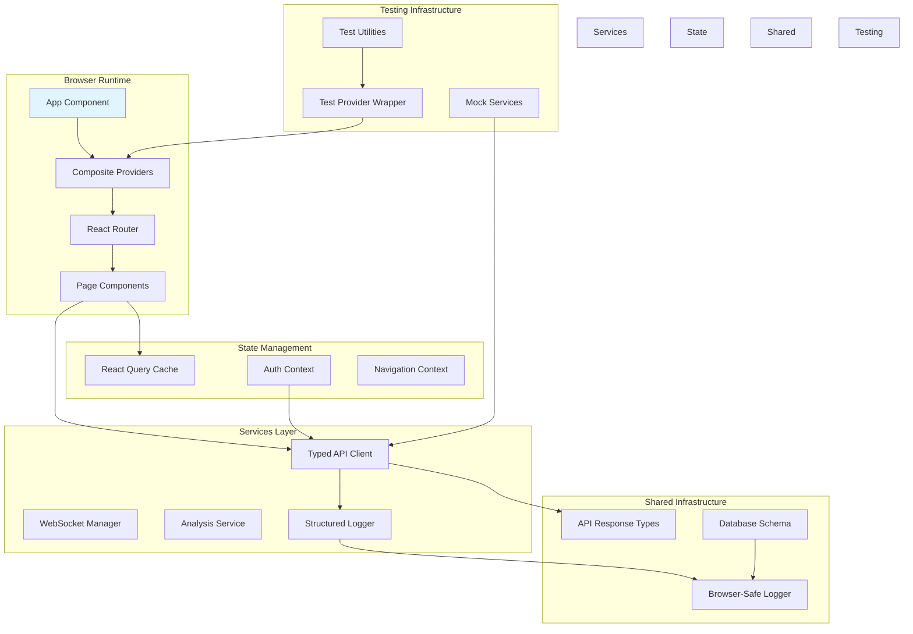

# Frontend Stabilization Design Document
**Project:** Chanuka Legislative Transparency Platform - Frontend Stabilization Initiative  
**Version:** 1.0  
**Date:** October 16, 2025  
**References:** Frontend Stabilization Requirements Document v1.0

## Executive Summary

This design document establishes the technical architecture for stabilizing the Chanuka Legislative Transparency Platform's frontend application. The design addresses five build-blocking errors, implements comprehensive type safety, establishes robust testing infrastructure, and creates sustainable patterns for ongoing development. The architecture balances immediate stability needs with long-term maintainability goals while ensuring backward compatibility with existing functionality.

The design serves both strategic architectural planning and tactical implementation guidance by providing detailed component specifications, data models, error handling strategies, and migration paths that development teams can follow to systematically resolve the critical issues identified in the requirements document.

---

## 1. Current State Analysis

### 1.1 Existing Challenges

The Chanuka frontend application demonstrates solid architectural foundations with modern React patterns including React Query for data fetching, error boundaries for fault isolation, and code-splitting for performance optimization. However, the application suffers from critical infrastructure gaps that prevent reliable deployment and create significant technical debt.

The most severe challenge involves five build-blocking module resolution errors that prevent the build system from completing successfully. The Vite configuration attempts to import a logger from an incorrect path, the shared schema couples client code to server-specific utilities, and server modules contain incorrect relative paths that break module resolution. These errors represent not just coding mistakes but systemic confusion about module boundaries and the distinction between browser-compatible and Node.js-specific code.

Type safety represents another critical challenge with thirty-one instances of 'any' type usage scattered across authentication flows, API clients, and utility functions. This lack of type safety creates invisible failure modes where runtime errors emerge only in production when unexpected data structures arrive from the backend. The absence of discriminated unions for API responses means error handling code cannot leverage TypeScript's type narrowing capabilities to ensure all error paths are properly handled.

Testing coverage at six point nine percent leaves ninety-three percent of the codebase untested, creating enormous regression risk. The existing integration tests fail due to JSDOM limitations around navigation and missing test identifiers on components. This testing gap means developers cannot confidently refactor code or add features without fear of breaking existing functionality in subtle ways that won't be discovered until production deployment.

The application initialization sequence involves nine distinct phases with exponential backoff retry logic that adds significant complexity. Eight nested context providers create deep component trees that complicate testing and make it difficult to understand provider dependencies. One hundred fifty-three direct console logging calls scatter diagnostic information without structure, making production debugging challenging and potentially leaking sensitive information.

### 1.2 Architectural Vision

The stabilization effort establishes the frontend as a reliable, type-safe, well-tested foundation for ongoing feature development. The architecture prioritizes clear module boundaries between browser-compatible shared code and environment-specific implementations, comprehensive type definitions that enable compile-time verification of data contracts, and robust testing infrastructure that catches regressions before deployment.

The vision emphasizes sustainable development practices where adding new features follows established patterns, test coverage naturally grows alongside implementation code, and structured logging provides observability into production behavior without performance degradation. Provider composition becomes straightforward rather than nested and complex. Application initialization simplifies to essential phases with clear error recovery. Type safety becomes the default rather than the exception.

This architectural vision recognizes that frontend stability is not a one-time achievement but an ongoing discipline. The design therefore establishes patterns and infrastructure that make the correct approach the easiest approach for developers, naturally guiding the codebase toward better maintainability over time.

---

## 2. System Architecture

### 2.1 High-Level Architecture



### 2.2 Module Boundary Architecture

The architecture establishes clear boundaries between three distinct module categories to prevent the cross-contamination that currently causes build failures. Browser-compatible shared modules contain code that can safely execute in both browser and Node.js environments, including data schemas, type definitions, validation logic, and the browser-safe logger implementation. These modules use only standard JavaScript features available in both environments and avoid any Node.js-specific APIs.

Server-specific modules contain backend logic that depends on Node.js APIs, file system access, database connections, and process management. These modules should never be imported by client code because bundling them would either fail or include unnecessary code in the browser bundle. The build system must detect and prevent such cross-boundary imports at compile time.

Client-specific modules contain browser-dependent code including DOM manipulation, browser storage APIs, React components, and browser-specific event handling. These modules cannot execute in Node.js environments and should only be imported by other client code or by server-side rendering infrastructure that provides appropriate polyfills.

The path alias configuration plays a critical role in maintaining these boundaries. The `@shared` alias points exclusively to browser-compatible code in the shared directory. Client code uses `@/` for internal imports within the client directory. Server code never appears in client import paths, and any attempt to import from `@server` in client code triggers a build error.

---

## 3. Component Specifications

### 3.1 Browser-Safe Logger

**Purpose**: Provide structured logging capabilities that work identically in browser and Node.js environments while supporting contextual metadata and severity levels.

**Location**: `shared/utils/logger.ts`

**Interface**:
```typescript
interface LogContext {
  component?: string;
  userId?: string;
  billId?: string;
  errorCode?: string;
  [key: string]: any;
}

interface Logger {
  info(message: string, context: LogContext, ...args: any[]): void;
  warn(message: string, context: LogContext, ...args: any[]): void;
  error(message: string, context: LogContext, ...args: any[]): void;
  debug(message: string, context: LogContext, ...args: any[]): void;
}
```

**Key Features**:

The logger implementation uses only standard console APIs available in all JavaScript environments. Each severity method accepts a message string, a structured context object, and optional additional arguments. The context object provides searchable metadata that can be extracted by log aggregation services in production.

In development environments, the logger formats output for human readability with colored severity indicators and formatted context objects. In production environments, the logger outputs JSON-formatted log entries optimized for parsing by log aggregation services. The logger automatically includes timestamps and captures stack traces for error-level logs.

The implementation supports log sampling to prevent performance degradation from high-frequency logging. Debug logs are completely disabled in production. Info logs from high-frequency events sample at a configurable rate. Warning and error logs always emit without sampling since they indicate significant issues requiring investigation.

**Integration Points**:

The shared schema imports this logger instead of the server-specific logger, breaking the circular dependency that currently blocks builds. The Vite configuration imports this logger using the correct path alias. All client components replace direct console calls with logger method calls. The server can optionally provide an enhanced logger implementation that extends this interface with file output or network transport while maintaining API compatibility.

### 3.2 API Response Types

**Purpose**: Provide comprehensive TypeScript type definitions for all API endpoints, enabling compile-time verification of data contracts between frontend and backend.

**Location**: `shared/types/api-responses.ts`

**Interface**:
```typescript
// Base response types using discriminated unions
type ApiResponse<T> = 
  | { success: true; data: T }
  | { success: false; error: ErrorResponse };

interface ErrorResponse {
  code: string;
  message: string;
  details?: Record<string, any>;
  timestamp: string;
}

// Authentication responses
interface LoginResponse {
  user: User;
  token: string;
  expiresAt: string;
}

interface RefreshResponse {
  token: string;
  expiresAt: string;
}

// User responses
interface UserProfileResponse {
  user: User;
  preferences: UserPreferences;
  statistics: UserStatistics;
}

// Bill responses
interface BillListResponse {
  bills: Bill[];
  pagination: PaginationMeta;
  filters: AppliedFilters;
}

interface BillDetailResponse {
  bill: Bill;
  analysis: BillAnalysis;
  relatedBills: Bill[];
}
```

**Key Features**:

The type system uses discriminated unions with a success boolean field that allows TypeScript to narrow types automatically in conditional branches. When code checks if success is true, TypeScript knows the data field is available. When success is false, TypeScript knows the error field is available. This pattern eliminates the possibility of accessing undefined properties.

Every response type extends from the base ApiResponse generic, ensuring consistency across all endpoints. Error responses follow a standardized structure with a code string for programmatic handling, a human-readable message, optional detailed information, and a timestamp for correlation with server logs.

The types import entity definitions from the shared schema, ensuring the client and server agree on data structures. User, Bill, and other entity types flow from the single source of truth in the database schema rather than being redefined in multiple locations where they could drift out of sync.

**Integration Points**:

The API client uses these types for all fetch operations, providing type-safe request and response handling. Authentication hooks consume LoginResponse and RefreshResponse types, eliminating any type usage. Component prop types reference these response types when displaying API data. Integration tests can use these types to construct mock responses that match production structures exactly.

### 3.3 Navigation Service

**Purpose**: Provide a mockable abstraction over browser navigation APIs, enabling integration tests to verify navigation flows without encountering JSDOM limitations.

**Location**: `client/src/services/navigation.ts`

**Interface**:
```typescript
interface NavigationService {
  reload(): void;
  navigate(path: string): void;
  goBack(): void;
  replace(path: string): void;
  getLocation(): Location;
}

// Production implementation
export const navigationService: NavigationService = {
  reload: () => window.location.reload(),
  navigate: (path: string) => window.location.href = path,
  goBack: () => window.history.back(),
  replace: (path: string) => window.location.replace(path),
  getLocation: () => window.location
};
```

**Key Features**:

The service wraps all browser navigation operations behind a consistent interface that remains constant across environments. Production code imports the concrete implementation that delegates to actual browser APIs. Test code imports mock implementations that record navigation calls without triggering actual navigation.

The interface deliberately excludes direct window.location manipulation, forcing code to use the service methods. This makes navigation operations visible and testable rather than scattered throughout the codebase as direct property assignments that cannot be intercepted.

The service maintains stateless operation, simply delegating to browser APIs without maintaining internal state. This simplicity ensures the production implementation has no performance overhead compared to direct API usage while still providing complete mockability in tests.

**Integration Points**:

Authentication flows call navigationService.reload after logout instead of directly calling window.location.reload. React Router integration uses navigationService.navigate for programmatic navigation. Test setup files provide mock implementations that verify navigation was called with expected paths. The service can be enhanced later to integrate with analytics tracking or navigation guards without changing the interface.

### 3.4 Composite Provider Component

**Purpose**: Simplify provider composition by combining all eight context providers into a single wrapper component with correct nesting order, reducing test boilerplate and improving maintainability.

**Location**: `client/src/components/AppProviders.tsx`

**Interface**:
```typescript
interface AppProvidersProps {
  children: React.ReactNode;
  overrides?: Partial<ProviderOverrides>;
}

interface ProviderOverrides {
  queryClient?: QueryClient;
  authContext?: Partial<AuthContextValue>;
  navigationContext?: Partial<NavigationContextValue>;
}

// Implementation using reduceRight for correct nesting
const AppProviders: React.FC<AppProvidersProps> = ({ 
  children, 
  overrides = {} 
}) => {
  const providers: ProviderConfig[] = [
    { component: QueryClientProvider, props: { client: queryClient } },
    { component: AuthProvider, props: {} },
    { component: NavigationProvider, props: {} },
    { component: ResponsiveNavigationProvider, props: {} },
    { component: LoadingProvider, props: {} },
    { component: AccessibilityProvider, props: {} },
    { component: OfflineProvider, props: {} },
    { component: PageErrorBoundary, props: {} }
  ];
  
  return providers.reduceRight(
    (acc, { component: Provider, props }) => (
      <Provider {...props}>{acc}</Provider>
    ),
    children
  );
};
```

**Key Features**:

The component uses reduceRight to build the provider tree from inside out, ensuring correct nesting order without deep indentation. The provider configuration array explicitly documents the dependency order with QueryClientProvider at the root and PageErrorBoundary wrapping the innermost content.

The overrides parameter allows tests to inject custom provider configurations without modifying the component implementation. Tests can provide a mock QueryClient with specific cache data or a mock AuthContext with predetermined authentication state. This flexibility enables comprehensive testing of components under various provider states.

The implementation maintains individual provider configurations in separate files, preserving modularity. AppProviders simply composes these providers without duplicating their logic. When provider configurations change, only the individual provider files need updates, not the composition layer.

**Integration Points**:

App.tsx replaces the deeply nested provider tree with a single AppProviders wrapper. Test utility functions wrap components in AppProviders with appropriate overrides. Storybook configuration uses AppProviders to provide consistent context across all stories. The pattern can be extended to support environment-specific provider variations by conditionally including providers based on configuration flags.

### 3.5 Application Bootstrap Service

**Purpose**: Simplify application initialization from nine complex phases to three logical stages with clear error handling and performance monitoring.

**Location**: `client/src/services/bootstrap.ts`

**Interface**:
```typescript
interface BootstrapResult {
  success: boolean;
  duration: number;
  failures?: BootstrapFailure[];
}

interface BootstrapFailure {
  stage: 'validation' | 'dependencies' | 'mount';
  error: Error;
  recoverable: boolean;
}

class AppBootstrap {
  async initialize(): Promise<BootstrapResult>;
  private async validateEnvironment(): Promise<void>;
  private async loadDependencies(): Promise<void>;
  private async mountApplication(): Promise<void>;
}
```

**Key Features**:

The bootstrap service consolidates initialization into three clear stages that execute sequentially. Environment validation verifies browser capabilities and required APIs exist before proceeding. Dependency loading uses Promise.allSettled to load polyfills, preload critical assets, and initialize services in parallel without failing fast. Application mounting performs the final React render with error boundary protection.

Each stage reports performance metrics using the Performance API, marking the start and end of each phase. These metrics flow to monitoring services, enabling teams to track initialization performance across different browsers and network conditions. Slow initialization triggers alerts before users experience degraded experiences.

The service implements a single retry attempt for the entire initialization sequence rather than retrying individual phases. When initialization fails, users see a clear error message explaining which stage failed and providing actionable recovery steps like refreshing the browser or checking network connectivity. Non-critical failures like service worker registration don't block initialization but do log structured errors.

**Integration Points**:

Main.tsx calls AppBootstrap.initialize before rendering the React application. The bootstrap service integrates with the structured logger to provide visibility into initialization progress. Performance monitoring services consume the duration metrics. Tests can mock the bootstrap service to simulate various initialization failure scenarios.

### 3.6 Test Utilities Module

**Purpose**: Provide reusable test utilities that simplify component testing, reduce boilerplate, and ensure consistent test setup across the codebase.

**Location**: `client/src/test-utils/index.tsx`

**Interface**:
```typescript
interface RenderOptions {
  initialRoute?: string;
  authState?: Partial<AuthContextValue>;
  queryClient?: QueryClient;
  wrapper?: React.ComponentType;
}

interface RenderResult extends RTLRenderResult {
  mockNavigate: Mock;
  rerender: (ui: React.ReactElement) => void;
}

// Test utilities
export function renderWithProviders(
  ui: React.ReactElement,
  options?: RenderOptions
): RenderResult;

export function createMockQueryClient(
  overrides?: Partial<QueryClientConfig>
): QueryClient;

export function createMockAuthContext(
  overrides?: Partial<AuthContextValue>
): AuthContextValue;

export function waitForLoadingToFinish(): Promise<void>;

export function mockApiResponse<T>(
  data: T,
  delay?: number
): Promise<ApiResponse<T>>;
```

**Key Features**:

The renderWithProviders function wraps components in AppProviders with sensible defaults, reducing test setup code from fifteen lines to a single function call. Tests can override specific provider values while accepting defaults for others. The function returns an enhanced render result that includes mock navigation functions for verifying navigation calls.

Mock factory functions create realistic test doubles for complex dependencies. createMockQueryClient produces a QueryClient configured for synchronous test execution with no retries and immediate failure. createMockAuthContext generates authenticated user state with realistic data that matches production structures.

Helper functions like waitForLoadingToFinish abstract common test patterns. This function waits for all loading states to complete, useful for tests that verify final rendered state without worrying about intermediate loading indicators. mockApiResponse simulates API calls with configurable delays for testing loading and error states.

**Integration Points**:

All component tests import these utilities instead of duplicating setup code. Integration tests use renderWithProviders as the foundation for rendering complex component trees. The utilities ensure tests remain maintainable as provider composition evolves, since changes to provider structure only require updating the test utilities rather than every test file.

---

## 4. Data Models

### 4.1 Structured Log Entry

```typescript
interface LogEntry {
  timestamp: string;        // ISO 8601 timestamp
  level: 'debug' | 'info' | 'warn' | 'error';
  message: string;          // Human-readable message
  context: LogContext;      // Structured metadata
  stackTrace?: string;      // For error-level logs
  environment: 'development' | 'production' | 'test';
  sessionId?: string;       // User session identifier
}

interface LogContext {
  component: string;        // Component/module name
  action?: string;          // User action or operation
  userId?: string;          // User identifier
  entityId?: string;        // Related entity ID
  errorCode?: string;       // Application error code
  fallback?: string;        // Fallback strategy used
  duration?: number;        // Operation duration in ms
  [key: string]: any;       // Additional context
}
```

**Usage Pattern**:

```typescript
// Error logging with context
logger.error('Failed to fetch user profile', {
  component: 'UserProfile',
  action: 'fetchProfile',
  userId: user.id,
  errorCode: 'PROFILE_FETCH_FAILED',
  fallback: 'cached_data',
  duration: performance.now() - startTime
}, error);

// Info logging for state transitions
logger.info('User authentication successful', {
  component: 'AuthProvider',
  action: 'login',
  userId: response.user.id,
  duration: performance.now() - loginStart
});
```

### 4.2 API Response Envelope

```typescript
// Success response
interface SuccessResponse<T> {
  success: true;
  data: T;
  meta?: ResponseMeta;
}

// Error response
interface ErrorResponse {
  success: false;
  error: {
    code: string;              // Machine-readable error code
    message: string;           // Human-readable message
    details?: Record<string, any>;  // Additional error context
    timestamp: string;         // When error occurred
    requestId?: string;        // For correlation with logs
  };
}

interface ResponseMeta {
  pagination?: PaginationMeta;
  cached?: boolean;
  timestamp: string;
}

interface PaginationMeta {
  page: number;
  pageSize: number;
  totalPages: number;
  totalItems: number;
  hasNext: boolean;
  hasPrevious: boolean;
}
```

**Type Guards**:

```typescript
function isSuccessResponse<T>(
  response: ApiResponse<T>
): response is SuccessResponse<T> {
  return response.success === true;
}

function isErrorResponse(
  response: ApiResponse<any>
): response is ErrorResponse {
  return response.success === false;
}

// Usage in API client
const response = await fetchUser(userId);
if (isSuccessResponse(response)) {
  // TypeScript knows response.data exists
  setUser(response.data);
} else {
  // TypeScript knows response.error exists
  handleError(response.error);
}
```

### 4.3 Navigation State

```typescript
interface NavigationState {
  currentPath: string;
  previousPath?: string;
  params: Record<string, string>;
  query: URLSearchParams;
  hash: string;
}

interface NavigationContext {
  state: NavigationState;
  navigate: (path: string, options?: NavigationOptions) => void;
  goBack: () => void;
  reload: () => void;
}

interface NavigationOptions {
  replace?: boolean;        // Replace current history entry
  state?: any;              // State to pass to next page
  preserveQuery?: boolean;  // Keep current query params
}
```

### 4.4 Test Data Structures

```typescript
interface MockApiResponse<T> {
  data: T;
  delay?: number;
  shouldFail?: boolean;
  errorCode?: string;
}

interface TestProviderConfig {
  auth?: {
    isAuthenticated: boolean;
    user?: User;
    token?: string;
  };
  router?: {
    initialPath: string;
    history?: string[];
  };
  query?: {
    cacheTime?: number;
    staleTime?: number;
  };
}

interface TestScenario {
  name: string;
  setup: () => Promise<void>;
  assertions: () => Promise<void>;
  cleanup: () => Promise<void>;
}
```

---

## 5. Error Handling Strategy

### 5.1 Error Hierarchy

The error handling strategy establishes four distinct error levels with specific recovery mechanisms appropriate to each level's severity.

**Level 1: Build-Time Errors (Critical)**

Build-time errors prevent compilation or module bundling, completely blocking deployment. These errors must be caught by TypeScript compiler, ESLint, or Vite before code reaches version control. The CI/CD pipeline enforces zero tolerance for build errors, failing immediately when TypeScript compilation errors occur.

Recovery mechanism: Automated prevention through pre-commit hooks and CI checks. Developers cannot push code with build errors. The CI pipeline blocks merges when builds fail.

**Level 2: Runtime Type Errors (High)**

Runtime type errors occur when data doesn't match expected TypeScript types, typically from API responses or user input. These errors manifest as type assertion failures, undefined property access, or invalid function calls.

Recovery mechanism: Type guards validate data at runtime before usage. API response validation rejects malformed data before it reaches components. Error boundaries catch type errors in components and display fallback UI. Structured logging captures type mismatch details for investigation.

**Level 3: Network and API Errors (Medium)**

Network errors include failed HTTP requests, timeout conditions, or API responses indicating errors. These errors are expected in normal operation due to network conditions or backend issues.

Recovery mechanism: Retry logic with exponential backoff for transient failures. Fallback to cached data when available. User-facing error messages explain the problem and recovery options. Offline indicator shows when network is unavailable. Background retry attempts when connection restores.

**Level 4: User Input Errors (Low)**

User input errors include form validation failures, invalid search queries, or attempts to access unauthorized resources. These errors represent expected validation logic.

Recovery mechanism: Inline validation provides immediate feedback. Error messages explain validation rules and suggest corrections. Form state preserves user input while displaying errors. No logging required for validation errors since they're expected user behavior.

### 5.2 Error Boundary Strategy

```typescript
interface ErrorBoundaryProps {
  fallback?: React.ComponentType<ErrorFallbackProps>;
  onError?: (error: Error, errorInfo: React.ErrorInfo) => void;
  resetKeys?: any[];
}

interface ErrorFallbackProps {
  error: Error;
  resetError: () => void;
}

// Page-level error boundary
<PageErrorBoundary
  fallback={PageErrorFallback}
  onError={(error, errorInfo) => {
    logger.error('Page render error', {
      component: 'PageErrorBoundary',
      errorMessage: error.message,
      componentStack: errorInfo.componentStack
    }, error);
  }}
>
  <PageContent />
</PageErrorBoundary>

// Route-level error boundary
<Route 
  path="/bills/:id" 
  element={
    <RouteErrorBoundary>
      <BillDetailPage />
    </RouteErrorBoundary>
  } 
/>
```

### 5.3 Logging Integration

Every error level integrates with structured logging to provide visibility:

```typescript
// Build-time: No logging (prevents compilation)

// Runtime type errors
try {
  const user = validateUser(apiResponse.data);
} catch (error) {
  logger.error('User validation failed', {
    component: 'UserProfile',
    action: 'validateResponse',
    errorCode: 'INVALID_USER_DATA'
  }, error);
  throw error; // Let error boundary handle
}

// Network errors
try {
  const response = await fetchBills(filters);
} catch (error) {
  logger.warn('Bill fetch failed, using cache', {
    component: 'BillList',
    action: 'fetchBills',
    fallback: 'cache',
    filters: sanitizeFilters(filters)
  }, error);
  return cachedBills;
}

// User input errors (minimal logging)
if (!isValidEmail(email)) {
  // No logging needed - expected validation
  setError('email', 'Please enter a valid email address');
}
```

---

## 6. Testing Strategy

### 6.1 Testing Pyramid

**Unit Tests (60% of coverage)**

Unit tests verify individual functions, hooks, and utility modules in isolation. These tests execute quickly, provide immediate feedback, and pinpoint exact failure locations. Unit tests mock all external dependencies including API calls, browser APIs, and context providers.

Target coverage:
- Utility functions: 95%
- Custom hooks: 90%
- Type guards and validators: 100%
- Error handlers: 85%

Example unit test:
```typescript
describe('useAuth hook', () => {
  it('should handle login success', async () => {
    const mockLogin = vi.fn().mockResolvedValue({
      success: true,
      data: { user: mockUser, token: 'token123' }
    });
    
    const { result } = renderHook(() => useAuth(), {
      wrapper: createTestWrapper({ api: { login: mockLogin } })
    });
    
    await act(async () => {
      await result.current.login('user@example.com', 'password');
    });
    
    expect(result.current.isAuthenticated).toBe(true);
    expect(result.current.user).toEqual(mockUser);
  });
});
```

**Integration Tests (30% of coverage)**

Integration tests verify multiple components working together, testing data flow through context providers, API client integration, and component interactions. These tests use real provider implementations with mocked API responses.

Target coverage:
- Complete user flows: 100%
- Provider interactions: 80%
- API client with context: 90%
- Navigation flows: 100%

Example integration test:
```typescript
describe('Authentication flow', () => {
  it('should complete login and navigate to dashboard', async () => {
    const { user } = renderWithProviders(<App />, {
      initialRoute: '/login'
    });
    
    await user.type(screen.getByLabelText('Email'), 'user@example.com');
    await user.type(screen.getByLabelText('Password'), 'password123');
    await user.click(screen.getByRole('button', { name: 'Log In' }));
    
    await waitFor(() => {
      expect(screen.getByTestId('dashboard-page')).toBeInTheDocument();
    });
    
    expect(screen.getByText('Welcome back')).toBeInTheDocument();
  });
});
```

**End-to-End Tests (10% of coverage)**

End-to-end tests verify critical user journeys in a browser environment using Playwright. These tests run against the actual application with real network requests to a test backend. E2E tests focus on happy paths and critical business flows.

Target coverage:
- User registration and login: 100%
- Bill browsing and filtering: 100%
- Analytics dashboard viewing: 100%
- Profile management: 100%

Example E2E test:
```typescript
test('user can browse and filter bills', async ({ page }) => {
  await page.goto('/bills');
  await expect(page.getByTestId('bill-list')).toBeVisible();
  
  await page.getByLabel('Filter by status').selectOption('active');
  await page.getByRole('button', { name: 'Apply Filters' }).click();
  
  await expect(page.getByTestId('bill-item')).toHaveCount(10);
  await expect(page.getByText('Status: Active')).toBeVisible();
});
```

### 6.2 Test Organization

Tests follow a consistent directory structure that mirrors the source code:

```
client/src/
├── components/
│   ├── ui/
│   │   ├── button.tsx
│   │   └── button.test.tsx
│   └── bills/
│       ├── bill-card.tsx
│       └── bill-card.test.tsx
├── hooks/
│   ├── use-auth.tsx
│   └── use-auth.test.tsx
├── services/
│   ├── api.ts
│   └── api.test.ts
└── __tests__/
    ├── integration/
    │   ├── auth-flow.test.tsx
    │   └── bill-browsing.test.tsx
    └── e2e/
        ├── user-journey.spec.ts
        └── admin-workflow.spec.ts
```

### 6.3 Test Data Management

Tests use factory functions to generate consistent test data:

```typescript
// test-utils/factories.ts
export function createMockUser(overrides?: Partial<User>): User {
  return {
    id: 'user-123',
    email: 'test@example.com',
    name: 'Test User',
    role: 'citizen',
    createdAt: '2025-01-01T00:00:00Z',
    ...overrides
  };
}

export function createMockBill(overrides?: Partial<Bill>): Bill {
  return {
    id: 'bill-123',
    title: 'Test Bill',
    status: 'active',
    sponsor: 'Test Sponsor',
    introducedDate: '2025-01-01',
    ...overrides
  };
}

// Usage in tests
const authenticatedUser = createMockUser({ role: 'admin' });
const pendingBill = createMockBill({ status: 'pending' });
```

### 6.4 Performance Testing

Performance tests verify application behavior under load and measure critical performance metrics:

```typescript
describe('Performance: Bill list rendering', () => {
  it('should render 1000 bills within 100ms', async () => {
    const bills = Array.from({ length: 1000 }, (_, i) => 
      createMockBill({ id: `bill-${i}` })
    );
    
    const startTime = performance.now();
    render(<BillList bills={bills} />);
    const renderTime = performance.now() - startTime;
    
    expect(renderTime).toBeLessThan(100);
  });
  
  it('should maintain 60fps during scroll', async () => {
    const { container } = render(<BillList bills={largeBillList} />);
    const frameMetrics = measureScrollPerformance(container);
    
    expect(frameMetrics.averageFPS).toBeGreaterThan(55);
    expect(frameMetrics.droppedFrames).toBeLessThan(5);
  });
});
```

---

## 7. Implementation Phases

### Phase 1: Critical Stabilization (Week 1)

**Objective**: Resolve all build-blocking errors and enable successful deployment

**Success Criteria**:
- Zero build errors in CI/CD pipeline
- Development server starts without errors
- Production build completes successfully
- All existing functionality remains operational

**Key Deliverables**:
1. Browser-safe logger in shared/utils/logger.ts
2. Updated imports in vite.config.ts and shared/schema.ts
3. Fixed server import paths
4. Verified build succeeds locally and in CI

**Risk Mitigation**: Create feature branch for changes, verify builds before merging, maintain backward compatibility with existing log calls during transition

### Phase 2: Testing Foundation (Week 2)

**Objective**: Stabilize integration tests and establish testing infrastructure

**Success Criteria**:
- 100% integration test pass rate
- Test utilities reduce boilerplate by 50%
- Navigation abstraction enables JSDOM testing
- All critical components have data-testid attributes

**Key Deliverables**:
1. Navigation service implementation
2. Test utilities module with renderWithProviders
3. Updated components with data-testid attributes
4. Fixed integration tests using new infrastructure

**Risk Mitigation**: Implement navigation service without changing existing navigation logic, add test IDs incrementally starting with critical paths, maintain existing test structure while introducing new utilities

### Phase 3: Type Safety Implementation (Week 3)

**Objective**: Eliminate type safety gaps and enable strict TypeScript mode

**Success Criteria**:
- Fewer than 10 'any' type usages
- All API responses use typed interfaces
- Strict mode enabled without compilation errors
- Type guards protect all external data

**Key Deliverables**:
1. API response type definitions in shared/types/
2. Updated authentication hooks with proper types
3. Type guards for runtime validation
4. Strict mode enabled in tsconfig.json

**Risk Mitigation**: Implement types incrementally starting with authentication, use type assertions temporarily where needed with TODO comments, verify runtime behavior unchanged after type additions

### Phase 4: Coverage Expansion (Week 4-5)

**Objective**: Achieve 70% test coverage across critical modules

**Success Criteria**:
- 70% line coverage, 65% branch coverage
- All API services have comprehensive tests
- Top 10 hooks fully tested
- Critical user flows covered by integration tests

**Key Deliverables**:
1. API service test suites
2. Hook test suites using renderHook
3. Component test suites for UI primitives
4. Integration tests for authentication and navigation

**Risk Mitigation**: Focus on high-value tests first, use coverage reports to identify gaps, parallelize test implementation across team members, establish test review process

### Phase 5: Infrastructure Improvements (Week 6-7)

**Objective**: Implement structured logging and simplify architecture

**Success Criteria**:
- Zero direct console calls in production code
- Application initialization under 5 seconds (p95)
- Provider composition reduces test setup code
- Monitoring integrated with logging

**Key Deliverables**:
1. Structured logger with production configuration
2. Refactored bootstrap service
3. Composite provider implementation
4. Updated all logging call sites

**Risk Mitigation**: Maintain console calls during transition with deprecation warnings, implement logging incrementally by module, monitor performance impact of structured logging

---

## 8. Migration Strategy

### 8.1 Backward Compatibility

The migration preserves existing functionality throughout the transition. Old code continues working while new patterns are introduced gradually. This allows partial migration without breaking changes.

**Logger Migration**:

```typescript
// Old code continues working
console.log('User logged in');

// New code uses structured logger
logger.info('User authentication successful', {
  component: 'AuthProvider',
  userId: user.id
});

// Transition: console.log deprecated but not removed
console.log('[DEPRECATED] Use logger.info instead');
```

**Type Safety Migration**:

```typescript
// Old code with 'any' continues working
const data: any = await fetch('/api/user').then(r => r.json());

// New code uses types
const response: ApiResponse<UserResponse> = await fetchUser(userId);
if (isSuccessResponse(response)) {
  const data = response.data;
}

// Transition: Add types to new code, migrate old code incrementally
```

**Provider Migration**:

```typescript
// Old nested providers continue working
<QueryClientProvider client={queryClient}>
  <AuthProvider>
    <App />
  </AuthProvider>
</QueryClientProvider>

// New composite provider available as alternative
<AppProviders>
  <App />
</AppProviders>

// Tests can choose which pattern to use
```

### 8.2 Rollout Strategy

**Week 1**: Build fixes deployed immediately to unblock deployment. Changes are minimal and low-risk, affecting only import paths. Rollback plan involves reverting specific commits if build issues arise.

**Week 2-3**: Testing infrastructure deployed to development environment. Team begins using new test utilities for new tests while existing tests remain unchanged. No production impact during this phase.

**Week 4-5**: Type definitions added incrementally, starting with most critical paths (authentication, API client). Each PR adds types to specific modules with comprehensive testing. Production deployment begins after types are validated in staging.

**Week 6-7**: Logging infrastructure deployed with feature flag. Initially logs to both console and structured logger for comparison. After validation period, console logging is phased out. Monitoring validates structured logs provide sufficient information.

### 8.3 Rollback Procedures

Each phase has specific rollback procedures if issues arise:

**Phase 1 Rollback**: Revert import path changes, restore original logger imports. Build system returns to previous state within minutes.

**Phase 2 Rollback**: Tests can continue using old patterns. New test utilities are additive and don't break existing tests. Simply don't adopt new utilities if issues found.

**Phase 3 Rollback**: Disable strict mode in tsconfig.json, revert to previous type definitions. Application continues functioning without type safety improvements.

**Phase 4 Rollback**: New tests can be disabled in CI if they're flaky. Coverage requirements can be temporarily reduced. Doesn't affect production.

**Phase 5 Rollback**: Revert structured logger, restore console logging. Feature flag allows instant rollback without deployment. Bootstrap changes can be reverted independently.

### 8.4 Validation Criteria

Each phase requires validation before proceeding:

- **Build validation**: CI pipeline must pass three consecutive times
- **Test validation**: New tests must pass 10 consecutive runs without flakes
- **Type validation**: No TypeScript errors, runtime behavior unchanged
- **Performance validation**: No measurable performance regression
- **Production validation**: Monitor error rates for 24 hours after deployment

---

## 9. Monitoring and Observability

### 9.1 Build Monitoring

Track build health metrics:
- Build success rate (target: >99%)
- Build duration (target: <5 minutes)
- Module resolution errors (target: 0)
- TypeScript compilation warnings (target: <10)

### 9.2 Application Monitoring

Monitor runtime application health:
- Initialization success rate (target: >99.5%)
- Initialization duration p50, p95, p99 (target: <2s, <5s, <10s)
- Error boundary activation rate (target: <0.1% of sessions)
- Navigation success rate (target: >99%)

### 9.3 Test Monitoring

Track test health:
- Test pass rate (target: 100%)
- Test execution duration (target: <10 minutes)
- Flaky test rate (target: <1%)
- Coverage trends (target: increasing toward 80%)

### 9.4 Log Monitoring

Monitor structured logging:
- Error log volume (baseline and alert on spikes)
- Warning log volume (monitor trends)
- Log sampling effectiveness (verify sampling doesn't miss critical errors)
- Log aggregation latency (target: <10 seconds)

---

## 10. Success Metrics

### Short-term (Week 1-2)
- ✅ 0 build-blocking errors
- ✅ All integration tests passing
- ✅ <10 'any' type usages
- ✅ >30% test file coverage

### Medium-term (Month 1)
- ✅ >70% line coverage
- ✅ >65% branch coverage
- ✅ 0 console.* calls in production code
- ✅ <5 critical type safety issues

### Long-term (Quarter 1)
- ✅ >80% line coverage
- ✅ >70% branch coverage
- ✅ 100% hook test coverage
- ✅ <1% flaky test rate
- ✅ <2s initialization time p50

---

## 11. Architectural Decision Records

### ADR-001: Browser-Safe Logger in Shared Code

**Context**: Shared schema needs logging but cannot depend on server-specific logger.

**Decision**: Create browser-compatible logger in shared/utils/ using only console APIs.

**Rationale**: Enables code sharing without creating client-server coupling. Allows server to enhance logger while maintaining interface compatibility.

**Consequences**: Logging implementation slightly more complex. Server must maintain compatibility with shared logger interface.

### ADR-002: Discriminated Union for API Responses

**Context**: API responses need type-safe handling of success and error cases.

**Decision**: Use discriminated unions with success boolean field.

**Rationale**: TypeScript can automatically narrow types in conditional branches. Prevents accessing undefined properties. Industry standard pattern.

**Consequences**: All API responses follow same structure. Slightly more verbose response construction.

### ADR-003: Navigation Service Abstraction

**Context**: Integration tests fail due to JSDOM navigation limitations.

**Decision**: Create navigation service wrapping browser navigation APIs.

**Rationale**: Provides test seam without changing production behavior. Enables future enhancements like analytics integration.

**Consequences**: Additional abstraction layer. All navigation must use service methods.

### ADR-004: Composite Provider Pattern

**Context**: Eight nested providers create complexity in tests and components.

**Decision**: Compose providers using reduceRight pattern in single component.

**Rationale**: Reduces visual complexity. Simplifies test setup. Maintains correct nesting order.

**Consequences**: Provider order must be documented. Less obvious what providers wrap what.

---

## 12. Conclusion

This design establishes a comprehensive approach to stabilizing the Chanuka frontend through clear module boundaries, comprehensive type safety, robust testing infrastructure, and sustainable development patterns. The phased implementation allows incremental progress while maintaining backward compatibility and provides clear rollback procedures if issues arise.

The architecture balances immediate stabilization needs with long-term maintainability goals. Critical build errors are resolved first to enable deployment. Testing infrastructure follows to prevent regressions. Type safety and logging improvements enhance developer productivity and production observability.

Success depends on disciplined execution of the implementation phases, comprehensive validation at each stage, and team adoption of the new patterns. The monitoring and observability strategy ensures teams can track progress and identify issues early. The migration strategy provides confidence that changes can be rolled back if unexpected problems emerge.

This design serves as both strategic guidance for the overall initiative and tactical specifications for developers implementing specific components. The detailed component interfaces, data models, and error handling strategies enable teams to begin implementation immediately while maintaining consistency across the codebase.