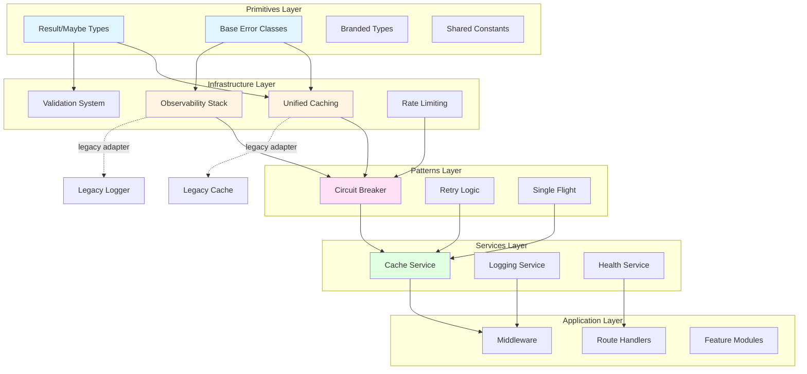

# Shared Core Architecture Design

## Document Information
- **Version**: 1.0
- **Date**: October 20, 2025
- **Related Documents**:
  - Requirements: `shared-core-requirements.md`
  - Implementation Plan: `shared-core-tasks.md`

## 1. Overview

### Current State Challenges

The shared/core directory has evolved organically, creating several interconnected problems that slow development and increase bug risk. The caching system has multiple implementations scattered across different locations, with legacy adapters coexisting alongside newer patterns without clear migration paths. Middleware shows inconsistent patterns where some components use factory patterns while others use direct implementations. The observability infrastructure has overlapping concerns between logging, metrics, tracing, and health checks that could work together more cohesively. Validation logic appears in multiple forms without clear guidance on when developers should use each approach.

### Architectural Vision

This design establishes a clear, four-layer architecture for shared/core. The primitives layer contains pure, framework-agnostic types and errors that form the foundation. The infrastructure layer builds on primitives to provide caching, observability, validation, and rate limiting with unified interfaces. The patterns layer composes infrastructure components into reusable design patterns like circuit breakers and retry logic. The services layer provides high-level abstractions that orchestrate infrastructure and patterns for common use cases.

This architecture fulfills requirements **REQ-CACHE-001**, **REQ-MIDDLEWARE-001**, **REQ-OBS-001**, **REQ-VAL-001**, and **REQ-ERR-001** by providing clear boundaries, consistent interfaces, and predictable behavior throughout the shared core.

## 2. System Architecture



The architecture flows from bottom to top, with each layer depending only on layers below it. Legacy adapters provide backward compatibility during migration, bridging old interfaces to new implementations without requiring immediate consumer changes.

## 3. Component Specifications

### 3.1 Unified Cache System (REQ-CACHE-001, REQ-CACHE-002)

```typescript
// Core cache interface that all adapters must implement
interface CacheAdapter {
  // Primary cache operations
  get<T>(key: string): Promise<Result<T | null>>;
  set<T>(key: string, value: T, ttl?: number): Promise<Result<void>>;
  delete(key: string): Promise<Result<void>>;
  clear(): Promise<Result<void>>;
  exists(key: string): Promise<Result<boolean>>;
  
  // Lifecycle management
  initialize(): Promise<Result<void>>;
  healthCheck(): Promise<HealthStatus>;
  shutdown(): Promise<Result<void>>;
  
  // Observability integration
  getMetrics(): CacheMetrics;
}

// Cache factory provides centralized instantiation
interface CacheFactory {
  createMemoryCache(config: MemoryCacheConfig): CacheAdapter;
  createRedisCache(config: RedisCacheConfig): CacheAdapter;
  createMultiTierCache(config: MultiTierConfig): CacheAdapter;
  createAICache(config: AICacheConfig): CacheAdapter;
  
  // Registry management for coordinated shutdown
  getRegisteredCaches(): CacheAdapter[];
  shutdownAll(): Promise<Result<void>>;
}

// Health status includes detailed diagnostics
interface HealthStatus {
  status: 'healthy' | 'degraded' | 'unhealthy';
  latency: number;
  details: Record<string, unknown>;
  timestamp: Date;
}

// Metrics enable performance monitoring
interface CacheMetrics {
  hits: number;
  misses: number;
  hitRate: number;
  averageLatency: number;
  errors: number;
}
```

The cache system consolidates four existing implementations into a single, coherent interface. Memory adapters provide fast in-process caching. Redis adapters offer distributed caching with persistence. Multi-tier adapters combine both for optimal performance. AI-specific adapters add specialized capabilities like token counting while maintaining interface compatibility.

### 3.2 Middleware Factory (REQ-MIDDLEWARE-001, REQ-MIDDLEWARE-002)

```typescript
// Unified middleware factory replaces scattered creation patterns
interface MiddlewareFactory {
  // Create middleware with automatic dependency injection
  createAuth(config: AuthConfig): MiddlewareFunction;
  createRateLimit(config: RateLimitConfig): MiddlewareFunction;
  createValidation(config: ValidationConfig): MiddlewareFunction;
  createErrorHandler(config: ErrorHandlerConfig): MiddlewareFunction;
  createCache(config: CacheMiddlewareConfig): MiddlewareFunction;
  
  // Register custom middleware providers
  registerProvider(name: string, provider: MiddlewareProvider): void;
  
  // Dependency management
  setServiceContainer(container: ServiceContainer): void;
}

// Service container provides dependency injection
interface ServiceContainer {
  getLogger(): Logger;
  getMetrics(): MetricsCollector;
  getCache(): CacheAdapter;
  getConfig(): ConfigManager;
}

// Middleware provider defines creation logic
interface MiddlewareProvider {
  name: string;
  dependencies: string[];
  create(config: unknown, container: ServiceContainer): MiddlewareFunction;
  validate(config: unknown): Result<void>;
}
```

The middleware factory consolidates factory.ts, enhanced-factory.ts, and unified.ts into a single creation point. Dependency injection ensures middleware components have consistent access to logging, metrics, caching, and configuration. Provider registration allows teams to extend the factory with custom middleware while maintaining consistent patterns.

### 3.3 Observability Stack (REQ-OBS-001, REQ-OBS-002)

```typescript
// Unified observability initialization coordinates all signals
class ObservabilityStack {
  constructor(config: ObservabilityConfig) {
    this.logger = createLogger(config.logging);
    this.metrics = createMetrics(config.metrics);
    this.tracer = createTracer(config.tracing);
    this.health = createHealthChecker(config.health);
    
    // Wire correlation ID propagation
    this.correlationManager = new CorrelationManager();
    this.wireCorrelationPropagation();
  }
  
  // Coordinate initialization
  async initialize(): Promise<Result<void>>;
  
  // Provide unified access
  getLogger(): Logger;
  getMetrics(): MetricsCollector;
  getTracer(): Tracer;
  getHealth(): HealthChecker;
  
  // Correlation management
  startRequest(): CorrelationContext;
  getCorrelationId(): string;
  
  // Coordinated shutdown
  async shutdown(): Promise<Result<void>>;
}

// Health checker aggregates component status
interface HealthChecker {
  // Register health checks
  registerCheck(name: string, check: HealthCheck): void;
  
  // Execute all checks
  checkHealth(): Promise<AggregatedHealth>;
  
  // Circuit breaker integration
  disableCheck(name: string): void;
  enableCheck(name: string): void;
}

// Aggregated health provides detailed status
interface AggregatedHealth {
  status: 'healthy' | 'degraded' | 'unhealthy';
  checks: Record<string, HealthStatus>;
  timestamp: Date;
  version: string;
}
```

The observability stack ensures logging, metrics, tracing, and health checks work together cohesively. Correlation IDs propagate automatically across all signals, enabling request tracking throughout distributed operations. Health checks aggregate to provide accurate system status while circuit breakers prevent cascading failures.

### 3.4 Validation System (REQ-VAL-001, REQ-VAL-002)

```typescript
// Unified validation service supports multiple validators
interface ValidationService {
  // Validate with appropriate validator based on schema type
  validate<T>(schema: ValidationSchema, data: unknown): Result<T>;
  
  // Create validation middleware
  createMiddleware(schema: ValidationSchema): MiddlewareFunction;
  
  // Schema management
  registerSchema(name: string, schema: ValidationSchema): void;
  getSchema(name: string): ValidationSchema | null;
}

// Validation schemas support multiple implementations
type ValidationSchema = 
  | { type: 'zod'; schema: z.ZodSchema }
  | { type: 'joi'; schema: Joi.Schema }
  | { type: 'custom'; validate: (data: unknown) => Result<unknown> };

// Validation errors follow consistent structure
interface ValidationError extends BaseError {
  statusCode: 400;
  errors: Array<{
    field: string;
    value: unknown;
    rule: string;
    message: string;
  }>;
}

// Validation middleware provides consistent behavior
function createValidationMiddleware(
  schema: ValidationSchema,
  target: 'body' | 'query' | 'params' = 'body'
): MiddlewareFunction {
  return async (req, res, next) => {
    const result = validationService.validate(schema, req[target]);
    
    if (result.isError()) {
      return res.status(400).json(result.error);
    }
    
    // Attach validated data with type safety
    req.validated = result.value;
    next();
  };
}
```

The validation system centralizes schema definitions while supporting multiple validator libraries. Zod provides type-safe runtime validation. Joi handles complex asynchronous validation scenarios. Custom validators address domain-specific requirements. All validators produce consistent error structures, ensuring predictable error handling across the application.

### 3.5 Error Management (REQ-ERR-001)

```typescript
// Base error class provides consistent structure
class BaseError extends Error {
  constructor(
    message: string,
    public statusCode: number,
    public errorCode: string,
    public metadata: Record<string, unknown> = {},
    public isRetryable: boolean = false
  ) {
    super(message);
    this.name = this.constructor.name;
    
    // Automatically capture correlation ID
    this.metadata.correlationId = getCorrelationId();
    
    // Integrate with logging
    logger.error(message, {
      errorCode,
      statusCode,
      metadata,
      stack: this.stack
    });
  }
  
  // Serialize for API responses, filtering sensitive data
  toJSON(): ErrorResponse {
    return {
      error: {
        code: this.errorCode,
        message: this.message,
        ...(process.env.NODE_ENV === 'development' && {
          stack: this.stack,
          metadata: this.metadata
        })
      }
    };
  }
}

// Specialized error classes extend base
class ValidationError extends BaseError {
  constructor(
    message: string,
    public validationErrors: ValidationErrorDetail[]
  ) {
    super(message, 400, 'VALIDATION_ERROR', { validationErrors }, false);
  }
}

class DatabaseError extends BaseError {
  constructor(
    message: string,
    public query: string,
    public originalError: Error
  ) {
    super(message, 500, 'DATABASE_ERROR', { query }, true);
  }
}

class AuthenticationError extends BaseError {
  constructor(message: string) {
    super(message, 401, 'AUTHENTICATION_ERROR', {}, false);
  }
}

class ExternalServiceError extends BaseError {
  constructor(
    message: string,
    public service: string,
    public statusCode: number
  ) {
    super(
      message, 
      502, 
      'EXTERNAL_SERVICE_ERROR', 
      { service, upstreamStatus: statusCode },
      statusCode >= 500 // Retry on 5xx errors
    );
  }
}
```

The error hierarchy ensures consistent error handling throughout the application. All errors automatically integrate with logging and include correlation IDs for request tracing. Specialized error classes provide domain-specific context while maintaining the common interface. Error serialization filters sensitive information based on environment, protecting internal details in production.

## 4. Data Models

### 4.1 Cache Configuration

```typescript
interface BaseCacheConfig {
  name: string;
  ttl: number; // Default time-to-live in seconds
  maxSize?: number;
  evictionPolicy?: 'lru' | 'lfu' | 'fifo';
}

interface MemoryCacheConfig extends BaseCacheConfig {
  type: 'memory';
}

interface RedisCacheConfig extends BaseCacheConfig {
  type: 'redis';
  host: string;
  port: number;
  password?: string;
  db?: number;
  keyPrefix?: string;
}

interface MultiTierConfig extends BaseCacheConfig {
  type: 'multi-tier';
  tiers: Array<MemoryCacheConfig | RedisCacheConfig>;
  writeThrough: boolean;
}

interface AICacheConfig extends BaseCacheConfig {
  type: 'ai';
  tokenizer?: (text: string) => number;
  maxTokens?: number;
}
```

### 4.2 Middleware Configuration

```typescript
interface AuthConfig {
  type: 'jwt' | 'session';
  secret: string;
  expiresIn?: string;
  refreshTokenPath?: string;
}

interface RateLimitConfig {
  algorithm: 'fixed-window' | 'sliding-window' | 'token-bucket';
  maxRequests: number;
  windowMs: number;
  keyGenerator?: (req: Request) => string;
}

interface ValidationConfig {
  schemas: Record<string, ValidationSchema>;
  stripUnknown?: boolean;
  abortEarly?: boolean;
}

interface CacheMiddlewareConfig {
  cache: CacheAdapter;
  keyGenerator: (req: Request) => string;
  ttl?: number;
  conditions?: (req: Request) => boolean;
}
```

### 4.3 Observability Configuration

```typescript
interface ObservabilityConfig {
  logging: {
    level: 'debug' | 'info' | 'warn' | 'error';
    format: 'json' | 'pretty';
    destination: 'stdout' | 'file' | 'both';
    rotation?: {
      maxSize: string;
      maxFiles: number;
    };
  };
  
  metrics: {
    prefix: string;
    enabled: boolean;
    exportInterval?: number;
    exporters?: Array<'prometheus' | 'statsd' | 'cloudwatch'>;
  };
  
  tracing: {
    enabled: boolean;
    serviceName: string;
    samplingRate: number;
    exporters?: Array<'jaeger' | 'zipkin' | 'otlp'>;
  };
  
  health: {
    enabled: boolean;
    checkInterval: number;
    cacheTTL: number;
    checks: Record<string, HealthCheckConfig>;
  };
}
```

## 5. Migration Strategy (REQ-MIG-001, REQ-MIG-002)

### 5.1 Legacy Adapter Pattern

Legacy adapters bridge old interfaces to new implementations, enabling incremental migration without breaking existing consumers. These adapters live in `legacy-adapters/` directories and follow a consistent pattern.

```typescript
// Example: Legacy cache adapter
class LegacyCacheAdapter {
  constructor(private modernCache: CacheAdapter) {}
  
  // Old interface methods delegate to new implementation
  async getValue(key: string): Promise<any> {
    const result = await this.modernCache.get(key);
    // Old interface didn't use Result type
    if (result.isError()) throw result.error;
    return result.value;
  }
  
  async setValue(key: string, value: any, ttl?: number): Promise<void> {
    const result = await this.modernCache.set(key, value, ttl);
    if (result.isError()) throw result.error;
  }
}

// Factory creates legacy adapter automatically when needed
export function createLegacyCache(config: CacheConfig): LegacyCacheAdapter {
  const modernCache = cacheFactory.create(config);
  return new LegacyCacheAdapter(modernCache);
}
```

### 5.2 Feature Flag Integration

Feature flags enable controlled rollout, allowing teams to toggle between old and new implementations without code changes.

```typescript
interface FeatureFlags {
  useModernCache: boolean;
  useUnifiedMiddleware: boolean;
  useObservabilityStack: boolean;
}

// Service layer checks flags to determine which implementation to use
function getCacheService(flags: FeatureFlags): CacheAdapter {
  if (flags.useModernCache) {
    return cacheFactory.createRedisCache(config);
  } else {
    return legacyCacheService;
  }
}
```

### 5.3 Validation Tools

Validation tools help teams verify that old and new implementations produce equivalent results during migration.

```typescript
// Validation tool compares old and new implementations
class MigrationValidator {
  constructor(
    private legacyImpl: any,
    private modernImpl: any,
    private logger: Logger
  ) {}
  
  async validate<T>(
    operation: string,
    args: unknown[],
    options: ValidationOptions = {}
  ): Promise<ValidationResult> {
    // Execute both implementations
    const [legacyResult, modernResult] = await Promise.allSettled([
      this.executeLegacy(operation, args),
      this.executeModern(operation, args)
    ]);
    
    // Compare results
    const comparison = this.compareResults(legacyResult, modernResult);
    
    // Log discrepancies
    if (!comparison.equivalent) {
      this.logger.warn('Migration validation found discrepancy', {
        operation,
        args,
        legacyResult,
        modernResult,
        diff: comparison.differences
      });
    }
    
    // Return modern result but flag discrepancies
    return {
      success: modernResult.status === 'fulfilled',
      value: modernResult.status === 'fulfilled' ? modernResult.value : null,
      equivalent: comparison.equivalent,
      differences: comparison.differences
    };
  }
}
```

### 5.4 Deprecation Warnings

Structured deprecation warnings guide teams through migration with clear, actionable information.

```typescript
// Deprecation warning system
function deprecate(
  featureName: string,
  sunsetDate: Date,
  alternative: string
): void {
  const daysUntilSunset = Math.ceil(
    (sunsetDate.getTime() - Date.now()) / (1000 * 60 * 60 * 24)
  );
  
  logger.warn('Deprecated feature used', {
    feature: featureName,
    sunsetDate: sunsetDate.toISOString(),
    daysRemaining: daysUntilSunset,
    alternative,
    stackTrace: new Error().stack,
    urgency: daysUntilSunset < 30 ? 'high' : 'medium'
  });
  
  // Emit metric for tracking
  metrics.increment('deprecated_feature_usage', {
    feature: featureName,
    urgency: daysUntilSunset < 30 ? 'high' : 'medium'
  });
}

// Usage in legacy adapter
class LegacyMiddlewareFactory {
  createAuth(config: AuthConfig) {
    deprecate(
      'LegacyMiddlewareFactory.createAuth',
      new Date('2025-12-31'),
      'Use MiddlewareFactory.createAuth from shared/core/src/middleware'
    );
    
    // Delegate to modern implementation
    return modernMiddlewareFactory.createAuth(config);
  }
}
```

## 6. Testing Strategy

### 6.1 Unit Testing Approach

Each component has focused unit tests that verify behavior in isolation.

```typescript
// Cache adapter unit tests
describe('MemoryCacheAdapter', () => {
  let cache: CacheAdapter;
  
  beforeEach(async () => {
    cache = cacheFactory.createMemoryCache({
      name: 'test-cache',
      ttl: 300,
      maxSize: 100
    });
    await cache.initialize();
  });
  
  afterEach(async () => {
    await cache.shutdown();
  });
  
  it('should store and retrieve values', async () => {
    const result = await cache.set('key1', { data: 'value1' });
    expect(result.isSuccess()).toBe(true);
    
    const retrieved = await cache.get<{ data: string }>('key1');
    expect(retrieved.isSuccess()).toBe(true);
    expect(retrieved.value).toEqual({ data: 'value1' });
  });
  
  it('should return null for non-existent keys', async () => {
    const result = await cache.get('nonexistent');
    expect(result.isSuccess()).toBe(true);
    expect(result.value).toBeNull();
  });
  
  it('should respect TTL', async () => {
    await cache.set('ttl-key', 'value', 1);
    await new Promise(resolve => setTimeout(resolve, 1100));
    
    const result = await cache.get('ttl-key');
    expect(result.value).toBeNull();
  });
  
  it('should emit metrics', async () => {
    await cache.set('key1', 'value1');
    await cache.get('key1');
    await cache.get('nonexistent');
    
    const metrics = cache.getMetrics();
    expect(metrics.hits).toBe(1);
    expect(metrics.misses).toBe(1);
    expect(metrics.hitRate).toBeCloseTo(0.5);
  });
});
```

### 6.2 Integration Testing

Integration tests verify that components work together correctly.

```typescript
// Middleware integration tests
describe('Middleware Integration', () => {
  let app: Express;
  let middlewareFactory: MiddlewareFactory;
  let observability: ObservabilityStack;
  
  beforeEach(() => {
    observability = new ObservabilityStack(testConfig);
    middlewareFactory = new MiddlewareFactory(observability);
    app = express();
  });
  
  it('should integrate validation and error handling', async () => {
    const schema = z.object({
      email: z.string().email(),
      age: z.number().min(18)
    });
    
    app.post('/users',
      middlewareFactory.createValidation({ body: schema }),
      middlewareFactory.createErrorHandler(),
      (req, res) => res.json(req.validated)
    );
    
    // Valid request succeeds
    const validResponse = await request(app)
      .post('/users')
      .send({ email: 'test@example.com', age: 25 })
      .expect(200);
    
    expect(validResponse.body).toEqual({
      email: 'test@example.com',
      age: 25
    });
    
    // Invalid request returns structured error
    const invalidResponse = await request(app)
      .post('/users')
      .send({ email: 'invalid', age: 15 })
      .expect(400);
    
    expect(invalidResponse.body.error.code).toBe('VALIDATION_ERROR');
    expect(invalidResponse.body.error.errors).toHaveLength(2);
  });
  
  it('should propagate correlation IDs', async () => {
    const correlationIds: string[] = [];
    
    app.use((req, res, next) => {
      correlationIds.push(observability.getCorrelationId());
      next();
    });
    
    app.get('/test',
      middlewareFactory.createAuth(authConfig),
      async (req, res) => {
        correlationIds.push(observability.getCorrelationId());
        res.json({ success: true });
      }
    );
    
    await request(app).get('/test').expect(200);
    
    // All correlation IDs should match
    expect(new Set(correlationIds).size).toBe(1);
  });
});
```

### 6.3 Performance Testing

Performance tests ensure no regression in critical paths.

```typescript
// Cache performance benchmarks
describe('Cache Performance', () => {
  it('should handle high throughput', async () => {
    const cache = cacheFactory.createMemoryCache(config);
    await cache.initialize();
    
    const operations = 10000;
    const startTime = Date.now();
    
    // Parallel writes
    await Promise.all(
      Array.from({ length: operations }, (_, i) =>
        cache.set(`key-${i}`, `value-${i}`)
      )
    );
    
    // Parallel reads
    await Promise.all(
      Array.from({ length: operations }, (_, i) =>
        cache.get(`key-${i}`)
      )
    );
    
    const duration = Date.now() - startTime;
    const opsPerSecond = (operations * 2) / (duration / 1000);
    
    // Should achieve at least 10k ops/sec
    expect(opsPerSecond).toBeGreaterThan(10000);
    
    const metrics = cache.getMetrics();
    expect(metrics.averageLatency).toBeLessThan(1); // < 1ms average
  });
});
```

## 7. Implementation Phases

### Phase 1: Foundation (Weeks 1-2)

**Objective**: Establish core primitives and infrastructure layer without breaking existing functionality.

**Success Criteria**:
- Primitives layer (Result, Maybe, BaseError, branded types) implemented with 100% test coverage
- Cache adapter interface defined with complete TypeScript types
- Observability stack interface designed with integration points identified
- All new code passes linting and type checking
- Documentation covers architecture decisions and usage patterns

**Deliverables**:
- `shared/core/src/primitives/` fully implemented and tested
- `shared/core/src/caching/core/interfaces.ts` defining cache contracts
- `shared/core/src/observability/index.ts` with stack initialization
- Architecture decision records documenting key design choices

### Phase 2: Core Infrastructure (Weeks 3-5)

**Objective**: Implement unified cache system and middleware factory with legacy adapters for backward compatibility.

**Success Criteria**:
- All cache adapters (memory, Redis, multi-tier, AI) implement CacheAdapter interface
- CacheFactory provides centralized instantiation with validation
- MiddlewareFactory consolidates existing factory patterns
- Legacy adapters enable existing code to work without changes
- Integration tests verify adapter equivalence
- Performance benchmarks show no regression from current implementation

**Deliverables**:
- `shared/core/src/caching/` with all adapters and factory
- `shared/core/src/middleware/factory.ts` consolidating patterns
- `shared/core/src/caching/legacy-adapters/` for backward compatibility
- Performance test suite comparing old and new implementations
- Migration guide with side-by-side examples

### Phase 3: Observability & Validation (Weeks 6-7)

**Objective**: Complete observability stack integration and consolidate validation system.

**Success Criteria**:
- ObservabilityStack coordinates logging, metrics, tracing, and health
- Correlation IDs propagate automatically across all signals
- Health checks aggregate component status with circuit breakers
- Validation system supports Zod, Joi, and custom validators
- All validators produce consistent error structures
- Validation middleware provides predictable behavior

**Deliverables**:
- `shared/core/src/observability/` with complete stack implementation
- `shared/core/src/validation/` with unified validation service
- Health check dashboard showing aggregated status
- Validation schema examples for common use cases
- Integration tests verifying signal correlation

### Phase 4: Migration & Cleanup (Weeks 8-10)

**Objective**: Migrate consuming services and remove deprecated code.

**Success Criteria**:
- All services migrate to new implementations with feature flags
- Validation tools confirm behavioral equivalence
- Deprecation warnings guide remaining migrations
- Legacy code removed after all consumers migrate
- Documentation updated to reflect final architecture
- All tests pass with 90%+ coverage

**Deliverables**:
- Migration validation reports for all services
- Cleanup scripts removing legacy code
- Updated documentation and examples
- Final architecture review and retrospective
- Knowledge transfer sessions for team

## 8. Success Metrics

The design is successfully implemented when:

**Code Quality**: Code duplication in shared/core reduces by 50%+ measured by jscpd. Test coverage reaches 90%+ across all components. Zero high-severity linting or type errors remain.

**Developer Experience**: Time to implement features using shared/core decreases by 30%. Onboarding time for new developers decreases by 30%. Developer satisfaction surveys show improvement in perceived code clarity.

**System Reliability**: Bugs originating from shared/core decrease by 40%. Mean time to resolution for shared/core issues decreases by 50%. Production incidents related to caching or middleware decrease.

**Performance**: Cache hit rates maintain or exceed 90%. Request latencies remain within 5% of current baselines. Memory usage stays within current limits. Health check response times stay under 100ms.

**Migration Success**: All services successfully migrate within planned timeline. Zero critical incidents during migration. Feature flags successfully control rollout. All legacy code removed on schedule.