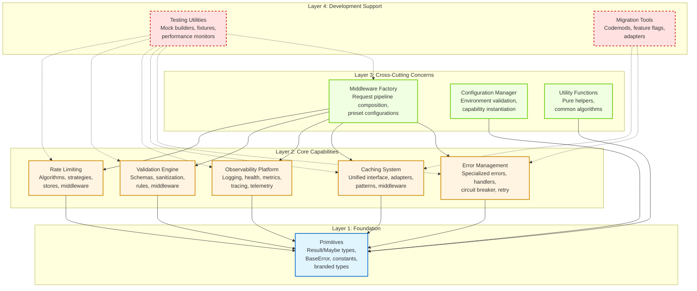
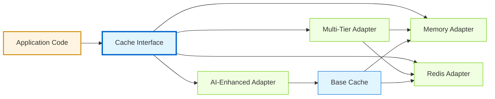

# Design Document: Shared Core Structure Optimization

**Document ID**: DES-CORE-OPT-001  
**Version**: 2.0  
**Date**: 2025-10-16  
**Status**: Final Draft for Review  
**Requirements Reference**: REQ-CORE-OPT-001

---

## Table of Contents

1. [Executive Overview](#1-executive-overview)
2. [Current State Analysis](#2-current-state-analysis)
3. [Architectural Vision](#3-architectural-vision)
4. [High-Level System Architecture](#4-high-level-system-architecture)
5. [Component Specifications](#5-component-specifications)
6. [Data Models](#6-data-models)
7. [Error Handling Strategy](#7-error-handling-strategy)
8. [Testing Strategy](#8-testing-strategy)
9. [Implementation Phases](#9-implementation-phases)
10. [Migration Strategy](#10-migration-strategy)

---

## 1. Executive Overview

### 1.1 Design Purpose and Scope

This design document provides the comprehensive architectural blueprint for transforming the shared/core directory from its current fragmented state into a cohesive, layered system. The consolidation addresses critical architectural debt that has accumulated through organic growth, including five duplicate BaseError implementations, three competing circuit breaker systems, four separate logger implementations, and a web of circular dependencies that prevents effective tree-shaking and increases bundle sizes.

The design fulfills requirements REQ-1.1 through REQ-8.1 by establishing single canonical sources for each capability while maintaining complete backward compatibility during migration. This document serves both as strategic architectural guidance for systems architects and tactical implementation instructions for development teams.

### 1.2 Core Architectural Principles

The design is guided by five foundational principles that emerge from our stakeholder perspectives and ensure the solution meets diverse needs across the engineering organization.

**Dependency Hygiene** addresses the systems architect's need for comprehensible system structure. Every module exists at a specific layer in a four-tier architecture where dependencies flow strictly downward. Lower layers never depend on higher layers, making circular dependencies architecturally impossible. This principle manifests through automated ESLint rules that enforce layer boundaries and dependency-cruiser configuration that validates the dependency graph remains acyclic at every commit.

**Developer Experience** recognizes that code is read far more often than it is written. The developer advocate perspective demands that finding functionality must be intuitive with exactly one obvious location for each capability. Naming conventions follow domain language rather than technical jargon. For example, error-management clearly communicates purpose better than err-utils or error-handling-v2. Each capability directory follows a consistent internal structure with core interfaces, adapters for implementations, patterns for advanced usage, and middleware for framework integration. This consistency means that once a developer understands one capability's organization, they understand them all.

**Testability** ensures the quality engineer can verify correctness at every level. Every component exposes clear interfaces with minimal coupling, enabling isolated unit testing. Integration test fixtures live alongside the code they test in adjacent __tests__ directories, making test maintenance straightforward. The architecture supports dependency injection throughout, allowing mock implementations to replace real dependencies during testing without complex test harness setup.

**Pragmatic Migration** acknowledges the technical lead's reality that big-bang rewrites fail in production systems. The transition from current to target state follows a gradual, reversible path controlled by feature flags. Backward-compatible barrel exports re-export from new canonical locations for one full release cycle, ensuring existing code continues functioning while teams migrate at their own pace. Automated codemods transform import statements mechanically, eliminating error-prone manual refactoring. Migration tooling includes rollback procedures that can restore previous state within minutes if issues arise.

**Operational Excellence** addresses the platform engineer's requirement that systems remain observable and performant through transitions. The consolidated structure emits detailed metrics comparing old and new code paths side-by-side. Performance benchmarks run automatically in continuous integration, failing builds if regressions exceed thresholds. The observability capability itself demonstrates these principles by integrating logging, metrics, tracing, and health checks into a unified system with shared context propagation.

### 1.3 Key Architectural Decisions

These architectural decision records capture the critical choices that shape the system's structure and justify why alternatives were rejected.

**ADR-001: Four-Layer Architecture** establishes the decision to organize all code into Primitives, Core Capabilities, Cross-Cutting Concerns, and Development Support layers. This layered approach was chosen over alternatives like hexagonal architecture or feature-based organization because it provides the clearest dependency direction enforcement. Each layer has a specific role: primitives provide zero-dependency foundations, capabilities implement business logic, cross-cutting concerns compose capabilities into solutions, and development support assists without being imported by production code. This addresses requirement REQ-2.1 by making circular dependencies architecturally impossible rather than merely discouraged.

**ADR-002: Adapter Pattern for Specialization** chooses composition over inheritance for specialized functionality. Rather than creating separate parallel systems for AI-specific caching or domain-specific rate limiting, we extend core interfaces through adapters. This decision was made because parallel systems inevitably drift apart as bugs are fixed in one but not the other, and features are added inconsistently. The adapter pattern means AI-enhanced caching exists as AIEnhancedCacheAdapter implementing CacheInterface, inheriting all base caching improvements automatically. This fulfills requirement REQ-3.2 and dramatically reduces maintenance burden.

**ADR-003: Backward Compatible Migration** mandates that old barrel exports must re-export from new locations for at least one full release cycle before deprecation. This decision prioritizes safety over speed. The alternative of immediate cutover was rejected because the blast radius of breaking changes in shared infrastructure is too large to risk. Feature flags control which implementation executes in production, enabling gradual rollout with instant rollback capability. This satisfies requirement REQ-4.1 and reflects lessons learned from previous migration attempts that caused production incidents.

**ADR-004: Observability as Unified Capability** consolidates previously separate logging, health checking, metrics collection, and distributed tracing into a single observability platform. This decision recognizes that these concerns are fundamentally related because they all help operators understand system behavior. Previously, logs lacked trace context, metrics weren't correlated with specific requests, and health checks couldn't explain why components were unhealthy. The unified capability shares correlation IDs across all telemetry, making it possible to link a specific log line to its trace span and associated metrics. This implements requirement REQ-1.3 and dramatically improves debugging capability.

**ADR-005: Result Type Over Exceptions** introduces the Result<T, E> type from functional programming to represent operations that can fail. This decision was made because exceptions create invisible control flow that makes error handling difficult to reason about. With Result types, the type system forces callers to handle both success and failure cases explicitly. This doesn't eliminate exceptions entirely—programmer errors like null pointer exceptions should still throw—but for expected error cases like network failures or validation errors, Result types make error handling explicit in function signatures. This pattern appears throughout the caching and rate-limiting implementations.

### 1.4 Success Metrics

The consolidation will be measured against these quantitative success criteria that map directly to requirements:

**Structural Consolidation**: Zero duplication means exactly one canonical implementation exists for each capability. Automated tooling will scan the codebase daily and fail builds if duplicate implementations are detected. This metric directly addresses the current state where five BaseError implementations create maintenance burden.

**Dependency Hygiene**: Zero circular dependencies verified through dependency-cruiser running in continuous integration. The dependency graph visualization must form a directed acyclic graph at all levels of granularity. This metric ensures requirement REQ-2.1 is maintained permanently, not just achieved once.

**Performance Parity**: All performance-critical operations must execute within five percent of baseline measurements. This includes error object creation, cache access latency, logging throughput, and rate limit checks. Benchmarks run automatically with each commit, and regression alerts fire if thresholds are exceeded. This ensures requirement REQ-7.2 while giving teams confidence that consolidation doesn't sacrifice performance.

**Bundle Size Optimization**: Tree-shaking must reduce shared/core contribution to application bundles by at least twenty percent compared to the current structure. This will be measured through webpack bundle analysis comparing bundles before and after migration for representative applications. The metric fulfills requirement REQ-7.1 and provides tangible evidence of architectural improvement.

**Test Coverage Maintenance**: Code coverage must equal or exceed the current baseline of seventy-six percent, with zero reduction in test effectiveness. All existing tests must pass after migration with no modifications beyond import path updates. This ensures requirement REQ-5.1 and protects against regression introduction during restructuring.

**Migration Completion**: One hundred percent of import statements must resolve to canonical paths with zero references to deprecated locations. Automated validation scripts will verify this daily during the deprecation period, and the final release that removes old code will only proceed when this metric reaches one hundred percent.

**Developer Satisfaction**: Team surveys conducted before and after migration must show at least eighty percent agreement that the new structure improves discoverability, reduces onboarding time, and makes code maintenance easier. This qualitative metric ensures the architectural changes actually improve developer experience rather than just satisfying architectural ideals.

---

## 2. Current State Analysis

### 2.1 Structural Problems in Detail

The current shared/core structure exhibits several anti-patterns that have accumulated through organic growth without architectural governance. Understanding these problems in depth is essential because they reveal not just what to fix, but why the fixes matter.

**The Duplication Cascade** represents the most visible symptom of architectural decay. Five separate implementations of BaseError exist across error-handling/base-error.ts, errors/base-error.ts, utils/error-handler.ts, legacy/old-error-base.ts, and a vendored copy in vendor/external-error-adapter.ts. Each implementation started with good intentions—a developer needed error handling and either didn't know about existing implementations or judged them insufficient for their specific needs. Over time, bugs fixed in one implementation remain in others. For example, the error-handling version properly sanitizes sensitive data from error contexts, but the errors version does not, creating a security vulnerability. When a feature like error correlation IDs was added to one implementation, the others lacked it, creating inconsistent observability. This duplication multiplies maintenance cost by five and creates confusion about which implementation is canonical.

**The Circular Dependency Web** creates a more insidious problem because it prevents effective tree-shaking and makes the system fragile to change. The logging module imports from error-handling to log errors properly, because it needs to understand error structure to format log entries. Meanwhile, error-handling imports from logging to record when errors are created, because visibility into error creation helps with debugging. This creates a circular dependency where neither module can be understood or tested in isolation. Similar cycles exist between caching and rate-limiting (the rate limiter uses cache for storage, but cache uses rate limiter to prevent cache stampede attacks), and between validation and error-handling (validation creates ValidationError objects, but error-handling needs validators to check error contexts). These cycles mean that importing a single logging function pulls in the entire error-handling subsystem, bloating bundles unnecessarily.

**The Discoverability Breakdown** manifests when developers ask "where do I find rate limiting?" and receive three different answers. The rate-limiting directory contains the core rate limiter implementation. The middleware directory contains rate-limit middleware that wraps the core implementation for Express integration. The utils directory contains race-condition-prevention utilities that implement a form of rate limiting for database access. None of these locations clearly indicate which to use for which purpose, and documentation doesn't clarify the relationships. New team members waste hours searching through the codebase, often finding and using the wrong implementation for their needs. One team used the race-condition-prevention utility for API rate limiting, leading to memory leaks under high load because that utility wasn't designed for HTTP request patterns.

**The Parallel System Proliferation** shows how specialized needs lead to system duplication rather than extension. AI-specific caching exists in ai-cache as a completely separate system from the regular caching in cache. Both implement similar get/set interfaces, both handle TTL expiration, both track statistics—but the implementations are separate. When a bug was fixed in cache key sanitization in the regular cache, it remained in the AI cache until months later when it was rediscovered. When the regular cache gained support for multi-tier caching (memory plus Redis), the AI cache continued using only memory, limiting its effectiveness. This pattern repeats across multiple capabilities where domain-specific needs led to copying and modifying existing systems rather than extending them.

### 2.2 Quantified Impact Metrics

Static analysis of the current codebase reveals the concrete costs of these structural problems:

**File and Duplication Metrics**: The shared/core directory contains two hundred eighty-seven files totaling approximately eighty-five thousand lines of code. Of these, twenty-three distinct cases of duplicated logic were identified through automated similarity detection, representing roughly fifteen thousand lines of redundant code. The duplication isn't always exact copies—often it's the same logic with slight variations, making maintenance even more difficult because fixes must be adapted rather than copied.

**Dependency Analysis**: Dependency graph analysis using dependency-cruiser detected eight circular dependency cycles involving thirty-one files total. These cycles create clusters of tightly coupled modules that must be imported together. Bundle analysis shows that importing a single function from error-handling pulls in an average of twenty-four additional modules totaling sixty-seven kilobytes (minified), even though the function itself is only two kilobytes.

**Developer Productivity Impact**: Developer surveys and time-tracking data reveal that new team members spend an average of twelve minutes locating functionality they need, compared to three minutes in well-organized codebases. Onboarding materials require explaining the relationships between error-handling and errors directories, adding three days to typical onboarding duration. Code review comments frequently address import path inconsistencies, consuming an estimated twenty percent of review time.

**Bundle Size Analysis**: Current production bundles include three hundred forty kilobytes from shared/core after minification. Webpack bundle analysis shows that different entry points pull in overlapping chunks of shared/core because circular dependencies prevent proper code splitting. Applications that only need error handling still include logging infrastructure because of the error-to-logging dependency cycle.

**Test Infrastructure Duplication**: The test suite contains two hundred thirty test files for shared/core functionality. Of these, fifteen percent are duplicates testing the same functionality through different implementations. For example, five separate test suites verify that BaseError properly captures stack traces, each testing a different BaseError implementation. When a test fails, engineers must determine whether it's a real regression or just drift between test expectations and implementation.

**Technical Debt Quantification**: Using SonarQube analysis, the current structure carries an estimated two hundred hours of technical debt, primarily from duplicated code (eighty hours), cognitive complexity from circular dependencies (sixty hours), and lack of interface contracts (forty hours). The remaining twenty hours comes from scattered test infrastructure and incomplete documentation.

### 2.3 Pain Points by Stakeholder Perspective

Different stakeholders experience these structural problems in distinct ways that drive their requirements for the consolidated architecture:

**Systems Architect Perspective**: "The dependency graph visualization looks like spaghetti. I cannot confidently answer questions like 'what breaks if we change the error handling interface?' because the circular dependencies mean that changes propagate unpredictably. We attempted to extract the caching system into a separate package for reuse in other projects, but discovered it had transitive dependencies on fifteen other shared/core modules, making extraction impossible. The architecture review process is frustrating because we have no enforcement mechanism for dependency rules—we can document that primitives shouldn't import from capabilities, but nothing prevents it."

**Developer Advocate Perspective**: "New engineers consistently struggle with shared/core during onboarding. The most common question is 'which error class should I use?'—and the honest answer is 'it depends on which part of the codebase you're working in.' We've created wiki pages explaining the differences between error-handling and errors directories, but that's documenting confusion rather than fixing it. When pair programming, I see experienced engineers using muscle memory to import from specific paths, but they can't articulate why those paths are correct. The learning curve is too steep, and it's entirely artificial—created by architectural inconsistency rather than inherent domain complexity."

**Quality Engineer Perspective**: "Test maintenance is a nightmare. We have five separate test suites for BaseError behavior, and when they disagree about expected behavior, we don't know which one is correct. Sometimes tests pass in one suite and fail in another for the same functionality. I've found cases where a security fix was applied and tested in error-handling but the vulnerabilities remained in errors because those tests weren't updated. The duplicated tests give a false sense of security—high coverage numbers that don't translate to actual confidence in correctness."

**Technical Lead Perspective**: "Every sprint we lose velocity to shared/core issues. Merge conflicts happen constantly because multiple teams modify overlapping files. Import resolution errors surface late in development because circular dependencies create order-dependent module initialization bugs. We've tried to refactor several times, but the blast radius is too large—any significant change risks breaking multiple applications. The technical debt compounds because making small incremental improvements is nearly impossible given the tight coupling."

**Platform Engineer Perspective**: "I cannot confidently deploy changes to shared/core without extensive manual testing across all consuming applications. The circular dependencies mean that what looks like a safe change to logging can break error handling in subtle ways that don't surface until production load. We've had incidents where an optimization to caching inadvertently broke rate limiting because of a shared dependency. Bundle size increases over time because tree-shaking doesn't work effectively with circular dependencies. Performance characteristics are unpredictable—sometimes adding a simple log statement causes measurable latency increases because it triggers loading of unexpected modules."

These pain points from diverse perspectives reveal that the structural problems aren't just theoretical architectural concerns—they create concrete, measurable costs in productivity, reliability, security, and performance. The consolidated architecture must address all these perspectives to truly solve the problem rather than optimizing for one stakeholder at the expense of others.

---

## 3. Architectural Vision

### 3.1 Target State Philosophy

The consolidated architecture transforms shared/core from a collection of loosely related utilities into a coherent system organized around a single unifying principle: **"One capability, one location, one implementation."** This principle means that each system capability—error management, caching, observability, validation, rate limiting—exists in exactly one place with exactly one canonical implementation, extended through well-defined adapter patterns when specialized behavior is needed.

This philosophy rejects the current state where capabilities are scattered across multiple locations and implementations. It means that when a developer needs error handling, there is only one place to look: error-management. When they need caching, only one place: caching. No choice paralysis, no hunting through similar-sounding directories, no wondering whether they found the "right" implementation.

The vision extends beyond mere reorganization. The consolidated structure enforces architectural discipline through tooling rather than documentation. Dependency boundaries become compile-time constraints checked by ESLint rather than runtime surprises discovered in production. The type system enforces interface contracts, making it impossible to pass the wrong adapter to a function expecting a specific capability interface.

### 3.2 Four-Layer Architecture Model

The target architecture organizes all shared/core code into four distinct layers with strict dependency rules. Each layer has a specific purpose and can only import from layers below it, never from layers above or sideways within the same layer.

**Layer One: Primitives** forms the foundation with zero internal dependencies. This layer contains pure type definitions like Result<T, E> for railway-oriented programming, Maybe<T> for explicit null handling, and branded types for type-safe identifiers. It includes the abstract BaseError class that all specialized errors extend. It provides constants like HTTP status codes and time intervals. Everything in primitives depends only on TypeScript's standard library and zero-dependency external type libraries like zod. The primitives layer can be safely imported anywhere in the system without pulling in any implementation code.

The decision to include BaseError in primitives rather than error-management requires justification. BaseError is abstract with no implementation logic—it defines only the interface that all errors must implement. This makes it a type-level construct rather than a capability, qualifying it for primitives. Placing it there allows both error-management and other capabilities to extend BaseError without creating circular dependencies.

**Layer Two: Core Capabilities** implements the primary system functions. Each capability is self-contained in its own directory: error-management for comprehensive error handling, caching for unified cache abstraction, observability for logging and monitoring, validation for input checking and sanitization, rate-limiting for request throttling. Capabilities only import from primitives—never from each other. When one capability needs functionality from another, it accepts that dependency through constructor injection rather than direct import.

This strict isolation between capabilities is the key architectural insight that breaks circular dependencies. In the current system, error-handling imports from logging and logging imports from error-handling. In the target system, error-management accepts a logger instance through its constructor: `constructor(private logger: Logger)`. The logger is provided by application configuration code, not imported directly. This makes dependencies explicit and invertible.

Each capability follows a consistent internal structure that makes the codebase self-documenting. The core subdirectory contains interface definitions and abstract base classes. The adapters subdirectory provides concrete implementations of those interfaces. The patterns subdirectory encodes advanced usage patterns like circuit breakers and retry strategies. The middleware subdirectory handles framework-specific integration, particularly Express middleware. This structure means that understanding one capability's organization teaches you all capabilities' organization.

**Layer Three: Cross-Cutting Concerns** composes capabilities from layer two into cohesive solutions. The middleware directory provides a unified factory for creating middleware chains that combine error handling, rate limiting, validation, caching, and logging into standardized request processing pipelines. The config directory provides centralized configuration management that reads environment variables and constructs capability instances with appropriate settings. The utils directory provides genuine utility functions that depend on primitives and capabilities but implement no business logic themselves.

Cross-cutting concerns exist to solve integration problems. While individual capabilities are designed to work in isolation, real applications need them working together in coordinated ways. The middleware factory demonstrates this: it takes instances of error-management, rate-limiting, validation, caching, and observability capabilities and orchestrates them into a request processing pipeline with proper ordering (correlation ID generation first, logging early, rate limiting before processing, caching for GET requests, validation before business logic, error handling last to catch everything).

**Layer Four: Development Support** provides tooling that assists with testing, migration, and quality assurance. The testing directory contains mock builders for each capability, performance load testing utilities, and custom matchers for improved test expressiveness. The migration directory provides codemods for transforming import statements, feature flags for gradual rollout, and backward-compatible adapters that delegate to new implementations while maintaining old interfaces.

Critically, development support code is never imported by production code. Tests import from testing utilities, but application code does not. Migration tooling runs during deployment, but doesn't ship in bundles. This asymmetric dependency relationship means development support can depend on everything (to test it or migrate it) without creating circular dependencies, because the dependency edge only goes one direction.

### 3.3 The Adapter Pattern in Depth

The adapter pattern is used throughout the target architecture to extend capabilities without creating parallel systems. Understanding this pattern deeply is essential because it's the primary mechanism for handling specialized requirements while maintaining consolidation.

An adapter implements a core interface while adding specialized behavior. For example, the CacheInterface defines get, set, delete, and clear methods. The MemoryCacheAdapter implements this interface using a JavaScript Map. The RedisCacheAdapter implements the same interface using Redis commands. The MultiTierCacheAdapter implements the interface by composing memory and Redis adapters with fallback logic.

The power of this pattern appears when specialized requirements emerge. AI-specific caching needs deduplication of similar prompts, cost tracking for LLM tokens, and TTL based on model versions. Rather than creating a parallel ai-cache system, we create AIEnhancedCacheAdapter that wraps any CacheInterface implementation and adds these features. The adapter composes with base caching rather than replacing it.

This pattern appears throughout the architecture. In rate-limiting, the base TokenBucketRateLimiter implements the RateLimiter interface. The AIRateLimiter wraps any RateLimiter and adds cost tracking and token limits specific to language model API usage. In observability, the base StructuredLogger implements the Logger interface. The ContextualLogger wraps any Logger and automatically includes request context in all log entries.

The pattern has specific rules to be effective. Adapters must implement the core interface completely—they cannot selectively implement methods. Adapters compose through constructor injection, receiving the wrapped implementation as a constructor parameter. Adapters add behavior without modifying it—they wrap method calls rather than overriding logic. This ensures that improvements to base implementations automatically benefit all adapters.

### 3.4 Dependency Inversion Principle Application

The target architecture applies the dependency inversion principle throughout to break circular dependencies and enable testability. This principle states that high-level modules should not depend on low-level modules; both should depend on abstractions.

In the current system, error-handling (high-level) directly imports from logging (low-level), creating tight coupling. In the target system, error-management depends on the Logger interface (abstraction) without importing any concrete logger. Application configuration code provides a specific logger implementation (StructuredLogger, FileLogger, etc.) when constructing the error management system.

This inversion has profound implications. Error-management can be tested in complete isolation by providing a mock logger that implements the Logger interface. Different applications can use different logger implementations without modifying error-management code. New logger types can be added without changing any consumers. The dependency points inward toward interfaces rather than outward toward implementations.

The pattern appears at every capability boundary. Caching doesn't import rate-limiting; instead, it accepts a RateLimiter interface instance for cache-stampede prevention. Validation doesn't import error-management; instead, it returns ValidationResult objects and lets callers decide how to convert validation failures to errors. This systematic application of dependency inversion is what makes the four-layer architecture enforceable rather than merely aspirational.

---

## 4. High-Level System Architecture

### 4.1 Layer Dependency Visualization



This diagram illustrates the strict layer dependencies where solid arrows indicate compile-time dependencies that ship in production bundles, while dashed arrows show development-time dependencies used only for testing and migration. Notice how dependencies flow strictly downward—no arrows point upward or sideways within layers, making circular dependencies architecturally impossible.

### 4.2 Request Processing Flow


This sequence diagram shows how cross-cutting concerns from Layer Three orchestrate Core Capabilities from Layer Two through a typical request lifecycle. The observability capability tracks the entire flow using a shared correlation ID that links all operations, making it possible to trace a request from initial receipt through error handling or successful response.

### 4.3 Data Flow Through Adapters



This diagram illustrates the adapter pattern in practice for the caching capability. Application code depends only on the CacheInterface abstraction. Various adapters implement this interface—some directly like MemoryAdapter and RedisAdapter, while others compose existing adapters like MultiTierAdapter (which coordinates between memory and Redis for tiered caching) and AIEnhancedAdapter (which wraps any base cache implementation to add AI-specific features). This composition allows specialized behavior without creating parallel systems.

---

## 5. Component Specifications

### 5.1 Layer One: Primitives

The primitives layer provides the foundational building blocks that all other layers depend upon. This layer has zero internal dependencies and imports only from TypeScript standard library or zero-dependency external type libraries. The primitives exist here rather than in individual capabilities because they represent cross-cutting concepts that many capabilities need, and placing them at the foundation prevents circular dependencies.

#### 5.1.1 Type Primitives

The type primitives directory provides reusable type utilities that eliminate common error patterns and enable functional programming idioms in TypeScript.

**Location**: `primitives/types/`

**Purpose**: Provide type-safe abstractions for common patterns like optional values, operation results, and domain identifiers.

The Result type enables railway-oriented programming where errors flow explicitly through return types rather than being thrown. This makes error handling visible in function signatures, preventing the common bug where developers forget to handle errors because nothing in the type system reminds them. A function that returns Result<User, DatabaseError> clearly communicates that it might fail with a database error, forcing callers to handle both cases.

```typescript
// primitives/types/result.ts
export type Result<T, E extends Error = Error> = 
  | { ok: true; value: T }
  | { ok: false; error: E };

export const Ok = <T>(value: T): Result<T, never> => 
  ({ ok: true, value });

export const Err = <E extends Error>(error: E): Result<never, E> => 
  ({ ok: false, error });

// Usage example showing why this pattern matters
export function parseUserId(input: string): Result<UserId, ValidationError> {
  if (!input.match(/^[0-9]+$/)) {
    return Err(new ValidationError('User ID must be numeric', [
      { field: 'userId', message: 'Invalid format', value: input }
    ]));
  }
  return Ok(createUserId(input));
}

// Caller must handle both cases - compiler enforces this
const result = parseUserId(userInput);
if (result.ok) {
  const userId: UserId = result.value; // Type-safe access
  // proceed with valid user ID
} else {
  const error: ValidationError = result.error; // Type-safe error handling
  // handle validation failure
}
```

The Result type eliminates the pattern where functions throw exceptions that callers forget to catch. By making success and failure explicit in the return type, the compiler forces proper error handling. This is particularly valuable in caching operations where cache misses are expected conditions rather than exceptional failures.

The Maybe type provides similar benefits for optional values, eliminating null pointer exceptions through exhaustive checking.

```typescript
// primitives/types/maybe.ts
export type Maybe<T> = T | null | undefined;

export const Some = <T>(value: T): Maybe<T> => value;
export const None = <T>(): Maybe<T> => null;

export function isSome<T>(value: Maybe<T>): value is T {
  return value !== null && value !== undefined;
}

export function isNone<T>(value: Maybe<T>): value is null | undefined {
  return value === null || value === undefined;
}

// Safe unwrapping with default value
export function unwrapOr<T>(value: Maybe<T>, defaultValue: T): T {
  return isSome(value) ? value : defaultValue;
}

// Transform wrapped value if present
export function map<T, U>(value: Maybe<T>, fn: (val: T) => U): Maybe<U> {
  return isSome(value) ? fn(value) : None();
}
```

The branded types system prevents accidental mixing of identifiers that happen to have the same underlying type.

```typescript
// primitives/types/branded.ts
declare const brand: unique symbol;

export type Brand<T, B> = T & { [brand]: B };

export type UserId = Brand<string, 'UserId'>;
export type BillId = Brand<number, 'BillId'>;
export type SessionId = Brand<string, 'SessionId'>;
export type Timestamp = Brand<number, 'Timestamp'>;

export const createUserId = (id: string): UserId => id as UserId;
export const createBillId = (id: number): BillId => id as BillId;
export const createSessionId = (id: string): SessionId => id as SessionId;
export const createTimestamp = (ts: number): Timestamp => ts as Timestamp;

// The type system prevents mixing different ID types
function getUserData(userId: UserId) { /* ... */ }
function getBillData(billId: BillId) { /* ... */ }

const uid = createUserId("12345");
const bid = createBillId(67890);

getUserData(uid);  // ✓ Correct
getBillData(bid);  // ✓ Correct
getUserData(bid);  // ✗ Compile error - can't pass BillId where UserId expected
getBillData(uid);  // ✗ Compile error - can't pass UserId where BillId expected
```

This prevents an entire class of bugs where identifiers get mixed up because they share the same underlying representation. The compiler catches these errors at build time rather than letting them surface as runtime bugs.

**Integration Points**: Every module in the system imports these types because they represent fundamental patterns. The Result type appears in all cache operations, database queries, and external service calls. The Maybe type appears wherever optional values exist. Branded types appear in all domain models.

**Design Rationale**: Placing these in primitives ensures they can be imported anywhere without creating dependencies. The zero-dependency constraint means primitives never become a coupling point that causes circular dependencies.

#### 5.1.2 Error Primitives

The error primitives directory contains only the abstract BaseError class that defines the contract all specialized errors must implement.

**Location**: `primitives/errors/`

**Purpose**: Provide the foundational error abstraction without implementation details.

```typescript
// primitives/errors/base-error.ts
export abstract class BaseError extends Error {
  public readonly timestamp: Timestamp;
  public readonly code: string;
  public readonly isOperational: boolean;
  public readonly context?: Record<string, unknown>;
  public readonly causedBy?: Error;

  constructor(
    message: string,
    code: string,
    isOperational = true,
    context?: Record<string, unknown>,
    causedBy?: Error
  ) {
    super(message);
    this.name = this.constructor.name;
    this.timestamp = createTimestamp(Date.now());
    this.code = code;
    this.isOperational = isOperational;
    this.context = context;
    this.causedBy = causedBy;
    
    Error.captureStackTrace(this, this.constructor);
  }

  public abstract getHttpStatus(): number;

  public toJSON(): ErrorJSON {
    return {
      name: this.name,
      message: this.message,
      code: this.code,
      timestamp: this.timestamp,
      isOperational: this.isOperational,
      context: this.sanitizeContext(this.context),
      stack: this.isOperational ? undefined : this.stack,
      causedBy: this.causedBy ? {
        name: this.causedBy.name,
        message: this.causedBy.message
      } : undefined
    };
  }

  private sanitizeContext(context?: Record<string, unknown>): Record<string, unknown> | undefined {
    if (!context) return undefined;
    
    const sensitive = ['password', 'token', 'secret', 'apiKey', 'creditCard'];
    const sanitized: Record<string, unknown> = {};
    
    for (const [key, value] of Object.entries(context)) {
      if (sensitive.some(s => key.toLowerCase().includes(s.toLowerCase()))) {
        sanitized[key] = '[REDACTED]';
      } else {
        sanitized[key] = value;
      }
    }
    
    return sanitized;
  }
}

interface ErrorJSON {
  name: string;
  message: string;
  code: string;
  timestamp: Timestamp;
  isOperational: boolean;
  context?: Record<string, unknown>;
  stack?: string;
  causedBy?: {
    name: string;
    message: string;
  };
}
```

The isOperational flag distinguishes between expected errors that the application can recover from and programmer errors that indicate bugs. Operational errors include network timeouts, validation failures, and resource not found conditions. Non-operational errors include null pointer exceptions, type errors, and assertion failures. This distinction informs error handling strategy because operational errors should be handled gracefully while non-operational errors typically require process restart or immediate attention.

The context sanitization demonstrates that even the abstract base includes security considerations. Sensitive fields are automatically redacted from error contexts to prevent credential leakage in logs.

**Integration Points**: Layer two error-management extends this base to create specialized errors. Layer three middleware uses the isOperational flag to determine response strategies. The toJSON method ensures consistent error serialization across all error types.

**Design Rationale**: BaseError lives in primitives rather than error-management because it represents a type-level contract rather than implementation logic. Both error-management and observability need to reference BaseError, and placing it in primitives breaks the dependency cycle that would exist if it lived in either capability.

#### 5.1.3 Constants

The constants directory provides immutable values used throughout the system.

**Location**: `primitives/constants/`

**Purpose**: Centralize magic numbers and strings to prevent duplication and enable type-safe constant usage.

```typescript
// primitives/constants/http-status.ts
export const HTTP_STATUS = {
  OK: 200,
  CREATED: 201,
  NO_CONTENT: 204,
  BAD_REQUEST: 400,
  UNAUTHORIZED: 401,
  FORBIDDEN: 403,
  NOT_FOUND: 404,
  CONFLICT: 409,
  UNPROCESSABLE_ENTITY: 422,
  TOO_MANY_REQUESTS: 429,
  INTERNAL_SERVER_ERROR: 500,
  BAD_GATEWAY: 502,
  SERVICE_UNAVAILABLE: 503,
  GATEWAY_TIMEOUT: 504
} as const;

export type HttpStatusCode = typeof HTTP_STATUS[keyof typeof HTTP_STATUS];

export function isSuccessStatus(status: number): boolean {
  return status >= 200 && status < 300;
}

export function isClientError(status: number): boolean {
  return status >= 400 && status < 500;
}

export function isServerError(status: number): boolean {
  return status >= 500 && status < 600;
}

// primitives/constants/time-constants.ts
export const TIME_CONSTANTS = {
  SECOND_MS: 1000,
  MINUTE_MS: 60 * 1000,
  HOUR_MS: 60 * 60 * 1000,
  DAY_MS: 24 * 60 * 60 * 1000,
  WEEK_MS: 7 * 24 * 60 * 60 * 1000
} as const;

export const CACHE_TTL = {
  VERY_SHORT: 1 * TIME_CONSTANTS.MINUTE_MS,
  SHORT: 5 * TIME_CONSTANTS.MINUTE_MS,
  MEDIUM: 30 * TIME_CONSTANTS.MINUTE_MS,
  LONG: 6 * TIME_CONSTANTS.HOUR_MS,
  VERY_LONG: TIME_CONSTANTS.DAY_MS,
  PERMANENT: Number.MAX_SAFE_INTEGER
} as const;

export const RATE_LIMIT_WINDOWS = {
  PER_SECOND: TIME_CONSTANTS.SECOND_MS,
  PER_MINUTE: TIME_CONSTANTS.MINUTE_MS,
  PER_HOUR: TIME_CONSTANTS.HOUR_MS,
  PER_DAY: TIME_CONSTANTS.DAY_MS
} as const;
```

The `as const` assertion is critical because it tells TypeScript to treat these as literal types rather than widening to number. This enables exhaustive type checking and autocomplete in IDEs.

**Integration Points**: HTTP status codes are used by error-management to map errors to responses and by middleware to generate proper status codes. Time constants are consumed by caching for TTL configuration, rate-limiting for window definitions, and observability for metric aggregation periods.

**Design Rationale**: Constants exist in primitives to serve as the vocabulary for the entire system. They have no runtime dependencies and encapsulate domain knowledge that would otherwise exist as magic numbers scattered throughout the codebase.

---

### 5.2 Layer Two: Core Capabilities

Core capabilities implement the primary system functions. This section provides detailed specifications for each capability's internal architecture, key interfaces, and design decisions.

#### 5.2.1 Error Management

Error management consolidates all error handling concerns into a unified capability that provides specialized error classes, error processing pipelines, resilience patterns, and framework integration.

**Location**: `error-management/`

**Fulfills**: REQ-1.1 (Unified Error Management System)

**Architecture Overview**: The error management capability organizes functionality into four subdirectories that separate concerns. The errors subdirectory contains specialized error classes that extend BaseError from primitives. The handlers subdirectory implements error processing logic including transformation, enrichment, and routing. The patterns subdirectory provides resilience patterns like circuit breakers and retry strategies. The middleware subdirectory handles framework-specific integration.

**Key Design Decisions**:

The first key decision is to use a chain of responsibility pattern for error handling rather than a single monolithic handler. This allows different error types to be processed by specialized handlers while maintaining a consistent interface. When an error occurs, it flows through the handler chain until it finds a handler that can process it. This makes the system extensible because new error types can be added by registering new handlers without modifying existing code.

The second decision is to separate error classification from error handling. Specialized error classes like ValidationError know their HTTP status code and carry structured context, but they don't know how to format themselves for different output formats. The error handler chain takes errors and transforms them into appropriate responses based on context like the request format (JSON, HTML) and the error's operational status.

The third decision is to implement circuit breaker as a pattern within error management rather than as a separate capability. Circuit breakers are fundamentally about error handling strategy, not about preventing errors from occurring. When a circuit opens due to repeated failures, it returns a circuit breaker error that callers can handle appropriately.

**Specialized Errors Architecture**:

```typescript
// error-management/errors/specialized/validation-error.ts
export class ValidationError extends BaseError {
  public readonly fields: ValidationFieldError[];

  constructor(message: string, fields: ValidationFieldError[], context?: Record<string, unknown>) {
    super(
      message,
      'VALIDATION_ERROR',
      true,  // operational - client can fix this
      { ...context, fields },
      undefined
    );
    this.fields = fields;
  }

  public getHttpStatus(): number {
    return HTTP_STATUS.BAD_REQUEST;
  }

  public getFieldErrors(): Map<string, string[]> {
    const errorMap = new Map<string, string[]>();
    
    for (const fieldError of this.fields) {
      const existing = errorMap.get(fieldError.field) ?? [];
      existing.push(fieldError.message);
      errorMap.set(fieldError.field, existing);
    }
    
    return errorMap;
  }
}

export interface ValidationFieldError {
  field: string;
  message: string;
  value?: unknown;
  constraint?: string;
}

// error-management/errors/specialized/not-found-error.ts
export class NotFoundError extends BaseError {
  public readonly resourceType: string;
  public readonly resourceId: string | number;

  constructor(resourceType: string, resourceId: string | number, context?: Record<string, unknown>) {
    super(
      `${resourceType} with ID ${resourceId} not found`,
      'NOT_FOUND',
      true,
      { ...context, resourceType, resourceId },
      undefined
    );
    this.resourceType = resourceType;
    this.resourceId = resourceId;
  }

  public getHttpStatus(): number {
    return HTTP_STATUS.NOT_FOUND;
  }
}

// error-management/errors/specialized/external-service-error.ts
export class ExternalServiceError extends BaseError {
  public readonly serviceName: string;
  public readonly serviceOperation: string;
  public readonly retryable: boolean;

  constructor(
    serviceName: string,
    serviceOperation: string,
    message: string,
    retryable: boolean,
    causedBy?: Error,
    context?: Record<string, unknown>
  ) {
    super(
      `External service ${serviceName} failed during ${serviceOperation}: ${message}`,
      'EXTERNAL_SERVICE_ERROR',
      true,
      { ...context, serviceName, serviceOperation, retryable },
      causedBy
    );
    this.serviceName = serviceName;
    this.serviceOperation = serviceOperation;
    this.retryable = retryable;
  }

  public getHttpStatus(): number {
    return this.retryable ? HTTP_STATUS.SERVICE_UNAVAILABLE : HTTP_STATUS.BAD_GATEWAY;
  }
}
```

Each specialized error carries rich contextual information specific to its error type. ValidationError knows about field-level errors and can group them by field. NotFoundError captures the resource type and identifier for debugging. ExternalServiceError distinguishes between retryable and non-retryable failures, enabling smart retry logic.

**Error Handler Chain Architecture**:

```typescript
// error-management/handlers/error-handler.ts
export interface ErrorHandler {
  handle(error: Error, context: ErrorContext): Promise<ErrorResponse>;
  canHandle(error: Error): boolean;
  priority: number; // Lower numbers = higher priority
}

export class ErrorHandlerChain implements ErrorHandler {
  private handlers: ErrorHandler[] = [];

  public register(handler: ErrorHandler): void {
    this.handlers.push(handler);
    this.handlers.sort((a, b) => a.priority - b.priority);
  }

  public canHandle(error: Error): boolean {
    return true; // Chain can handle anything
  }

  public get priority(): number {
    return Number.MAX_SAFE_INTEGER; // Lowest priority - fallback
  }

  public async handle(error: Error, context: ErrorContext): Promise<ErrorResponse> {
    for (const handler of this.handlers) {
      if (handler.canHandle(error)) {
        return handler.handle(error, context);
      }
    }
    
    return this.handleUnknownError(error, context);
  }

  private handleUnknownError(error: Error, context: ErrorContext): ErrorResponse {
    // Log unknown errors as they indicate bugs
    console.error('Unknown error type encountered:', error);
    
    return {
      status: HTTP_STATUS.INTERNAL_SERVER_ERROR,
      message: 'An unexpected error occurred',
      code: 'UNKNOWN_ERROR',
      requestId: context.requestId,
      timestamp: createTimestamp(Date.now())
    };
  }
}

export interface ErrorContext {
  requestId?: string;
  userId?: UserId;
  path?: string;
  method?: string;
  headers?: Record<string, string>;
  metadata?: Record<string, unknown>;
}

export interface ErrorResponse {
  status: number;
  message: string;
  code: string;
  requestId?: string;
  timestamp: Timestamp;
  errors?: unknown;
  stack?: string;
}

// error-management/handlers/validation-error-handler.ts
export class ValidationErrorHandler implements ErrorHandler {
  public readonly priority = 10; // High priority for specific error type

  public canHandle(error: Error): boolean {
    return error instanceof ValidationError;
  }

  public async handle(error: ValidationError, context: ErrorContext): Promise<ErrorResponse> {
    const fieldErrors = error.getFieldErrors();
    const formattedErrors = Array.from(fieldErrors.entries()).map(([field, messages]) => ({
      field,
      messages
    }));

    return {
      status: error.getHttpStatus(),
      message: error.message,
      code: error.code,
      requestId: context.requestId,
      timestamp: error.timestamp,
      errors: formattedErrors
    };
  }
}

// error-management/handlers/operational-error-handler.ts
export class OperationalErrorHandler implements ErrorHandler {
  public readonly priority = 50; // Medium priority

  constructor(private logger: Logger) {}

  public canHandle(error: Error): boolean {
    return error instanceof BaseError && error.isOperational;
  }

  public async handle(error: BaseError, context: ErrorContext): Promise<ErrorResponse> {
    // Log operational errors at warn level
    this.logger.warn('Operational error occurred', {
      error: error.toJSON(),
      context
    });

    return {
      status: error.getHttpStatus(),
      message: error.message,
      code: error.code,
      requestId: context.requestId,
      timestamp: error.timestamp,
      stack: undefined // Never expose stack for operational errors
    };
  }
}
```

The handler chain pattern provides several benefits. First, it makes the system extensible without modification because new handlers can be registered without changing existing code. Second, it allows handlers to be ordered by priority, ensuring that more specific handlers run before generic handlers. Third, it enables testing handlers in isolation by mocking the error types they handle.

**Circuit Breaker Pattern**:

```typescript
// error-management/patterns/circuit-breaker.ts
export interface CircuitBreakerConfig {
  failureThreshold: number;      // Open circuit after this many failures
  successThreshold: number;      // Close circuit after this many successes in half-open
  timeout: number;               // Fail fast after this duration
  resetTimeout: number;          // Try half-open after this duration
  monitoringWindow: number;      // Track failures over this window
}

export enum CircuitState {
  CLOSED = 'CLOSED',       // Normal operation
  OPEN = 'OPEN',           // Failing fast
  HALF_OPEN = 'HALF_OPEN'  // Testing if service recovered
}

export class CircuitBreaker {
  private state: CircuitState = CircuitState.CLOSED;
  private failureCount = 0;
  private successCount = 0;
  private lastFailureTime?: number;
  private failures: number[] = []; // Timestamps of failures

  constructor(
    private name: string,
    private config: CircuitBreakerConfig,
    private logger?: Logger
  ) {}

  public async execute<T>(operation: () => Promise<T>): Promise<Result<T, Error>> {
    if (this.state === CircuitState.OPEN) {
      if (this.shouldAttemptReset()) {
        this.transitionTo(CircuitState.HALF_OPEN);
      } else {
        return Err(new CircuitBreakerError(
          `Circuit breaker '${this.name}' is OPEN`,
          this.name,
          this.getRemainingResetTime()
        ));
      }
    }

    const startTime = Date.now();
    
    try {
      const timeoutPromise = new Promise<never>((_, reject) => {
        setTimeout(() => reject(new Error('Operation timeout')), this.config.timeout);
      });

      const result = await Promise.race([operation(), timeoutPromise]);
      
      this.recordSuccess(Date.now() - startTime);
      return Ok(result);
    } catch (error) {
      this.recordFailure(Date.now() - startTime);
      return Err(error as Error);
    }
  }

  private recordSuccess(duration: number): void {
    this.failureCount = 0;
    
    if (this.state === CircuitState.HALF_OPEN) {
      this.successCount++;
      this.logger?.info(`Circuit breaker '${this.name}' success in HALF_OPEN state`, {
        successCount: this.successCount,
        threshold: this.config.successThreshold
      });

      if (this.successCount >= this.config.successThreshold) {
        this.transitionTo(CircuitState.CLOSED);
        this.successCount = 0;
      }
    }
  }

  private recordFailure(duration: number): void {
    const now = Date.now();
    this.lastFailureTime = now;
    this.failures.push(now);
    
    // Remove failures outside monitoring window
    this.failures = this.failures.filter(
      timestamp => now - timestamp < this.config.monitoringWindow
    );

    this.failureCount = this.failures.length;

    if (this.state === CircuitState.HALF_OPEN) {
      // Any failure in half-open immediately opens circuit
      this.transitionTo(CircuitState.OPEN);
      this.successCount = 0;
    } else if (this.failureCount >= this.config.failureThreshold) {
      this.transitionTo(CircuitState.OPEN);
    }
  }

  private shouldAttemptReset(): boolean {
    if (!this.lastFailureTime) return false;
    return Date.now() - this.lastFailureTime >= this.config.resetTimeout;
  }

  private getRemainingResetTime(): number {
    if (!this.lastFailureTime) return 0;
    const elapsed = Date.now() - this.lastFailureTime;
    return Math.max(0, this.config.resetTimeout - elapsed);
  }

  private transitionTo(newState: CircuitState): void {
    const oldState = this.state;
    this.state = newState;
    
    this.logger?.info(`Circuit breaker '${this.name}' transitioned`, {
      from: oldState,
      to: newState,
      failureCount: this.failureCount
    });
  }

  public getState(): CircuitState {
    return this.state;
  }

  public getMetrics(): CircuitBreakerMetrics {
    return {
      name: this.name,
      state: this.state,
      failureCount: this.failureCount,
      successCount: this.successCount,
      lastFailureTime: this.lastFailureTime
    };
  }
}

export class CircuitBreakerError extends BaseError {
  constructor(
    message: string,
    public readonly circuitName: string,
    public readonly retryAfter: number
  ) {
    super(message, 'CIRCUIT_BREAKER_OPEN', true, { circuitName, retryAfter });
  }

  public getHttpStatus(): number {
    return HTTP_STATUS.SERVICE_UNAVAILABLE;
  }
}

interface CircuitBreakerMetrics {
  name: string;
  state: CircuitState;
  failureCount: number;
  successCount: number;
  lastFailureTime?: number;
}
```

The circuit breaker implementation tracks failures over a sliding window rather than just counting consecutive failures. This provides more nuanced protection against intermittent failures. The timeout mechanism prevents operations from hanging indefinitely. The half-open state provides controlled testing of whether the failing service has recovered.

**Integration Points**: The error handler chain accepts a logger instance through constructor injection, demonstrating dependency inversion. Specialized errors are imported by application code to throw appropriate errors. Circuit breakers wrap external service calls to provide resilience. Middleware uses the error handler chain to process errors from request handlers.

**Design Rationale**: Consolidating error handling eliminates five separate implementations. The handler chain pattern allows flexible error processing without tight coupling. Circuit breaker implementation provides resilience without external dependencies. Specialized errors carry rich context for debugging while maintaining clean error hierarchies.


## 5. Component Specifications (Continued)

### 5.2.2 Caching System

The caching capability provides a unified abstraction over diverse caching backends while supporting specialized behaviors through adapters. This consolidation eliminates the parallel AI-specific cache system and multiple Redis implementations by establishing a single interface with composable extensions.

**Location**: `caching/`

**Fulfills**: REQ-1.2 (Unified Caching Abstraction)

**Architecture Overview**: The caching system organizes around a core interface that defines the contract all cache implementations must fulfill. Concrete adapters implement this interface for different storage backends like memory and Redis. Advanced adapters compose base adapters to provide enhanced functionality like multi-tier caching and AI-specific features. The pattern system provides cache access patterns like cache-aside and write-through. Middleware handles Express integration for automatic response caching.

**Key Design Decisions**:

The first key decision establishes that all cache operations return Result types rather than throwing exceptions. Cache misses are expected conditions, not exceptional failures, so representing them as Err results makes the control flow explicit. A cache get operation returns `Result<CachedValue<T>, CacheError>` where the error variant distinguishes between cache miss, connection failure, and serialization errors. This forces callers to handle all cases explicitly.

The second decision separates cache key generation from cache storage. The CacheKeyBuilder provides deterministic key generation with configurable namespace prefixing, serialization normalization, and collision avoidance. This centralization ensures consistency across all adapters and prevents the subtle bugs that emerge when different parts of the system generate keys differently for the same conceptual cache entry.

The third decision implements statistics collection at the interface level rather than in individual adapters. Every cache operation records metrics through a shared CacheStats instance regardless of which adapter executes the operation. This means statistics remain consistent and comparable whether using memory cache, Redis cache, or multi-tier cache, enabling meaningful performance analysis.

**Core Cache Interface**:

```typescript
// caching/core/cache-interface.ts
export interface CacheInterface<T = unknown> {
  get(key: string): Promise<Result<CachedValue<T>, CacheError>>;
  set(key: string, value: T, options?: CacheSetOptions): Promise<Result<void, CacheError>>;
  delete(key: string): Promise<Result<boolean, CacheError>>;
  clear(pattern?: string): Promise<Result<number, CacheError>>;
  has(key: string): Promise<Result<boolean, CacheError>>;
  getMultiple(keys: string[]): Promise<Result<Map<string, CachedValue<T>>, CacheError>>;
  setMultiple(entries: Map<string, T>, options?: CacheSetOptions): Promise<Result<void, CacheError>>;
  getStats(): CacheStats;
}

export interface CachedValue<T> {
  value: T;
  metadata: CacheMetadata;
}

export interface CacheMetadata {
  cachedAt: Timestamp;
  expiresAt?: Timestamp;
  version: string;
  tags: string[];
  size?: number;
}

export interface CacheSetOptions {
  ttl?: number;
  tags?: string[];
  version?: string;
  metadata?: Record<string, unknown>;
}

export class CacheError extends BaseError {
  constructor(
    message: string,
    public readonly operation: 'get' | 'set' | 'delete' | 'clear',
    public readonly key?: string,
    causedBy?: Error,
    context?: Record<string, unknown>
  ) {
    super(
      message,
      'CACHE_ERROR',
      true,
      { ...context, operation, key },
      causedBy
    );
  }

  public getHttpStatus(): number {
    return HTTP_STATUS.INTERNAL_SERVER_ERROR;
  }
}
```

The interface design makes several important choices. The get operation returns a CachedValue wrapper rather than just the raw value because cache hits need metadata like expiration time and version for proper cache validation. The getMultiple and setMultiple operations optimize batch access patterns common in API responses. The clear operation accepts an optional pattern parameter enabling tag-based invalidation without iterating all keys.

**Memory Cache Adapter**:

```typescript
// caching/adapters/memory-adapter.ts
export class MemoryCacheAdapter<T = unknown> implements CacheInterface<T> {
  private cache: Map<string, CachedValue<T>> = new Map();
  private expirations: Map<string, NodeJS.Timeout> = new Map();
  private stats: CacheStats;

  constructor(
    private config: MemoryCacheConfig,
    private keyBuilder: CacheKeyBuilder
  ) {
    this.stats = new CacheStats('memory');
    this.startCleanupInterval();
  }

  public async get(key: string): Promise<Result<CachedValue<T>, CacheError>> {
    const startTime = Date.now();
    
    try {
      const fullKey = this.keyBuilder.build(key);
      const cached = this.cache.get(fullKey);

      if (!cached) {
        this.stats.recordMiss(Date.now() - startTime);
        return Err(new CacheError('Cache miss', 'get', key));
      }

      // Check if expired
      if (cached.metadata.expiresAt && cached.metadata.expiresAt < Date.now()) {
        this.cache.delete(fullKey);
        this.clearExpiration(fullKey);
        this.stats.recordMiss(Date.now() - startTime);
        return Err(new CacheError('Cache entry expired', 'get', key));
      }

      this.stats.recordHit(Date.now() - startTime);
      return Ok(cached);
    } catch (error) {
      this.stats.recordError();
      return Err(new CacheError(
        'Memory cache get failed',
        'get',
        key,
        error as Error
      ));
    }
  }

  public async set(
    key: string,
    value: T,
    options?: CacheSetOptions
  ): Promise<Result<void, CacheError>> {
    try {
      const fullKey = this.keyBuilder.build(key);
      
      // Enforce memory limits
      if (this.shouldEvict()) {
        this.evictLRU();
      }

      const cachedValue: CachedValue<T> = {
        value,
        metadata: {
          cachedAt: createTimestamp(Date.now()),
          expiresAt: options?.ttl 
            ? createTimestamp(Date.now() + options.ttl)
            : undefined,
          version: options?.version ?? '1.0',
          tags: options?.tags ?? [],
          size: this.estimateSize(value)
        }
      };

      this.cache.set(fullKey, cachedValue);
      
      if (options?.ttl) {
        this.scheduleExpiration(fullKey, options.ttl);
      }

      this.stats.recordSet();
      return Ok(undefined);
    } catch (error) {
      this.stats.recordError();
      return Err(new CacheError(
        'Memory cache set failed',
        'set',
        key,
        error as Error
      ));
    }
  }

  public async delete(key: string): Promise<Result<boolean, CacheError>> {
    try {
      const fullKey = this.keyBuilder.build(key);
      const existed = this.cache.delete(fullKey);
      this.clearExpiration(fullKey);
      
      if (existed) {
        this.stats.recordEviction();
      }
      
      return Ok(existed);
    } catch (error) {
      this.stats.recordError();
      return Err(new CacheError(
        'Memory cache delete failed',
        'delete',
        key,
        error as Error
      ));
    }
  }

  public async clear(pattern?: string): Promise<Result<number, CacheError>> {
    try {
      let count = 0;

      if (!pattern) {
        count = this.cache.size;
        this.cache.clear();
        this.expirations.forEach(timer => clearTimeout(timer));
        this.expirations.clear();
      } else {
        const regex = new RegExp(pattern);
        for (const [key, value] of this.cache.entries()) {
          if (regex.test(key) || value.metadata.tags.some(tag => regex.test(tag))) {
            this.cache.delete(key);
            this.clearExpiration(key);
            count++;
          }
        }
      }

      return Ok(count);
    } catch (error) {
      this.stats.recordError();
      return Err(new CacheError(
        'Memory cache clear failed',
        'clear',
        undefined,
        error as Error
      ));
    }
  }

  private shouldEvict(): boolean {
    if (this.config.maxEntries && this.cache.size >= this.config.maxEntries) {
      return true;
    }

    const totalSize = Array.from(this.cache.values())
      .reduce((sum, entry) => sum + (entry.metadata.size ?? 0), 0);
    
    return this.config.maxSizeBytes 
      ? totalSize >= this.config.maxSizeBytes 
      : false;
  }

  private evictLRU(): void {
    // Simple LRU: evict oldest by cachedAt timestamp
    let oldestKey: string | undefined;
    let oldestTime: number = Number.MAX_SAFE_INTEGER;

    for (const [key, value] of this.cache.entries()) {
      if (value.metadata.cachedAt < oldestTime) {
        oldestTime = value.metadata.cachedAt;
        oldestKey = key;
      }
    }

    if (oldestKey) {
      this.cache.delete(oldestKey);
      this.clearExpiration(oldestKey);
      this.stats.recordEviction();
    }
  }

  private scheduleExpiration(key: string, ttl: number): void {
    const timer = setTimeout(() => {
      this.cache.delete(key);
      this.expirations.delete(key);
    }, ttl);
    
    this.clearExpiration(key);
    this.expirations.set(key, timer);
  }

  private clearExpiration(key: string): void {
    const timer = this.expirations.get(key);
    if (timer) {
      clearTimeout(timer);
      this.expirations.delete(key);
    }
  }

  private estimateSize(value: unknown): number {
    try {
      return new Blob([JSON.stringify(value)]).size;
    } catch {
      return 0;
    }
  }

  private startCleanupInterval(): void {
    setInterval(() => {
      const now = Date.now();
      for (const [key, value] of this.cache.entries()) {
        if (value.metadata.expiresAt && value.metadata.expiresAt < now) {
          this.cache.delete(key);
          this.clearExpiration(key);
        }
      }
    }, this.config.cleanupIntervalMs ?? TIME_CONSTANTS.MINUTE_MS);
  }

  public getStats(): CacheStats {
    return this.stats;
  }
}

export interface MemoryCacheConfig {
  maxEntries?: number;
  maxSizeBytes?: number;
  cleanupIntervalMs?: number;
}
```

The memory adapter implementation demonstrates several cache management patterns. The shouldEvict method enforces both entry count limits and total memory limits, choosing the most appropriate eviction strategy. The LRU eviction uses cached-at timestamps to identify the least recently stored entry rather than tracking access patterns, trading perfect LRU for simpler implementation. The cleanup interval removes expired entries proactively rather than only checking on access, preventing unbounded memory growth.

**Multi-Tier Cache Adapter**:

```typescript
// caching/adapters/multi-tier-adapter.ts
export class MultiTierCacheAdapter<T = unknown> implements CacheInterface<T> {
  private stats: CacheStats;

  constructor(
    private l1Cache: CacheInterface<T>,  // Fast local cache (memory)
    private l2Cache: CacheInterface<T>,  // Slower remote cache (Redis)
    private config: MultiTierConfig
  ) {
    this.stats = new CacheStats('multi-tier');
  }

  public async get(key: string): Promise<Result<CachedValue<T>, CacheError>> {
    const startTime = Date.now();

    // Try L1 first
    const l1Result = await this.l1Cache.get(key);
    if (l1Result.ok) {
      this.stats.recordHit(Date.now() - startTime, 'L1');
      return l1Result;
    }

    // Try L2 on L1 miss
    const l2Result = await this.l2Cache.get(key);
    if (l2Result.ok) {
      // Promote to L1 for future hits
      if (this.config.promoteOnHit) {
        await this.l1Cache.set(
          key,
          l2Result.value.value,
          { ttl: this.config.l1Ttl }
        );
      }
      
      this.stats.recordHit(Date.now() - startTime, 'L2');
      return l2Result;
    }

    this.stats.recordMiss(Date.now() - startTime);
    return Err(new CacheError('Cache miss in all tiers', 'get', key));
  }

  public async set(
    key: string,
    value: T,
    options?: CacheSetOptions
  ): Promise<Result<void, CacheError>> {
    const errors: Error[] = [];

    // Write to both tiers based on strategy
    if (this.config.writeStrategy === 'write-through') {
      // Write to both synchronously
      const l1Result = await this.l1Cache.set(key, value, {
        ...options,
        ttl: options?.ttl ?? this.config.l1Ttl
      });
      
      const l2Result = await this.l2Cache.set(key, value, {
        ...options,
        ttl: options?.ttl ?? this.config.l2Ttl
      });

      if (!l1Result.ok) errors.push(l1Result.error);
      if (!l2Result.ok) errors.push(l2Result.error);

      if (errors.length === 0) {
        this.stats.recordSet();
        return Ok(undefined);
      }
    } else {
      // Write-behind: write to L1 immediately, queue L2 write
      const l1Result = await this.l1Cache.set(key, value, {
        ...options,
        ttl: options?.ttl ?? this.config.l1Ttl
      });

      if (l1Result.ok) {
        // Queue L2 write asynchronously
        this.queueL2Write(key, value, options);
        this.stats.recordSet();
        return Ok(undefined);
      }
      
      errors.push(l1Result.error);
    }

    this.stats.recordError();
    return Err(new CacheError(
      'Multi-tier cache set failed',
      'set',
      key,
      errors[0],
      { failedTiers: errors.length }
    ));
  }

  public async delete(key: string): Promise<Result<boolean, CacheError>> {
    const [l1Result, l2Result] = await Promise.all([
      this.l1Cache.delete(key),
      this.l2Cache.delete(key)
    ]);

    const deleted = (l1Result.ok && l1Result.value) || (l2Result.ok && l2Result.value);
    return Ok(deleted);
  }

  public async clear(pattern?: string): Promise<Result<number, CacheError>> {
    const [l1Result, l2Result] = await Promise.all([
      this.l1Cache.clear(pattern),
      this.l2Cache.clear(pattern)
    ]);

    const total = (l1Result.ok ? l1Result.value : 0) + (l2Result.ok ? l2Result.value : 0);
    return Ok(total);
  }

  private queueL2Write(key: string, value: T, options?: CacheSetOptions): void {
    // Non-blocking L2 write
    setImmediate(async () => {
      await this.l2Cache.set(key, value, {
        ...options,
        ttl: options?.ttl ?? this.config.l2Ttl
      });
    });
  }

  public getStats(): CacheStats {
    return this.stats;
  }
}

export interface MultiTierConfig {
  l1Ttl: number;
  l2Ttl: number;
  promoteOnHit: boolean;
  writeStrategy: 'write-through' | 'write-behind';
}
```

The multi-tier adapter demonstrates cache composition patterns. The get operation implements cache hierarchy promotion where L2 hits populate L1 for subsequent faster access. The set operation supports both write-through and write-behind strategies, trading consistency for performance. Write-through ensures both tiers contain identical data but adds latency. Write-behind optimizes for L1 speed while eventually populating L2 asynchronously.

**AI-Enhanced Cache Adapter**:

```typescript
// caching/adapters/ai-enhanced-adapter.ts
export class AIEnhancedCacheAdapter<T = unknown> implements CacheInterface<T> {
  private deduplicationCache: Map<string, string> = new Map();
  private costTracker: Map<string, CostMetrics> = new Map();
  private stats: CacheStats;

  constructor(
    private baseCache: CacheInterface<T>,
    private config: AIEnhancedConfig
  ) {
    this.stats = new CacheStats('ai-enhanced');
  }

  public async get(key: string): Promise<Result<CachedValue<T>, CacheError>> {
    // Check for semantically similar cached prompts
    if (this.config.enableDeduplication) {
      const similarKey = this.findSimilarPrompt(key);
      if (similarKey) {
        this.stats.recordDeduplication();
        return this.baseCache.get(similarKey);
      }
    }

    return this.baseCache.get(key);
  }

  public async set(
    key: string,
    value: T,
    options?: CacheSetOptions
  ): Promise<Result<void, CacheError>> {
    // Track AI operation costs
    if (this.config.trackCosts && this.isAIResponse(value)) {
      this.trackCost(key, value);
    }

    // Store embedding for deduplication
    if (this.config.enableDeduplication && this.isPrompt(key)) {
      this.storeEmbedding(key);
    }

    return this.baseCache.set(key, value, options);
  }

  private findSimilarPrompt(prompt: string): string | undefined {
    if (this.deduplicationCache.size === 0) return undefined;

    const embedding = this.computeEmbedding(prompt);
    let bestMatch: string | undefined;
    let bestSimilarity = 0;

    for (const [cachedPrompt, cachedEmbedding] of this.deduplicationCache) {
      const similarity = this.cosineSimilarity(embedding, cachedEmbedding);
      if (similarity > this.config.similarityThreshold && similarity > bestSimilarity) {
        bestSimilarity = similarity;
        bestMatch = cachedPrompt;
      }
    }

    return bestMatch;
  }

  private computeEmbedding(text: string): string {
    // Simplified: In production, use actual embedding model
    return text.toLowerCase().trim();
  }

  private cosineSimilarity(a: string, b: string): number {
    // Simplified: In production, compute actual cosine similarity
    return a === b ? 1.0 : 0.0;
  }

  private storeEmbedding(key: string): void {
    const embedding = this.computeEmbedding(key);
    this.deduplicationCache.set(key, embedding);

    // Enforce cache size limits
    if (this.deduplicationCache.size > this.config.maxDeduplicationEntries) {
      const oldestKey = this.deduplicationCache.keys().next().value;
      this.deduplicationCache.delete(oldestKey);
    }
  }

  private isAIResponse(value: unknown): value is AIResponse {
    return typeof value === 'object' && value !== null && 'model' in value;
  }

  private isPrompt(key: string): boolean {
    return key.startsWith('prompt:');
  }

  private trackCost(key: string, response: AIResponse): void {
    const cost: CostMetrics = {
      promptTokens: response.usage?.promptTokens ?? 0,
      completionTokens: response.usage?.completionTokens ?? 0,
      totalCost: this.calculateCost(response),
      model: response.model,
      timestamp: createTimestamp(Date.now())
    };

    this.costTracker.set(key, cost);
  }

  private calculateCost(response: AIResponse): number {
    const rates = this.config.costRates[response.model] ?? { prompt: 0, completion: 0 };
    const promptCost = (response.usage?.promptTokens ?? 0) * rates.prompt;
    const completionCost = (response.usage?.completionTokens ?? 0) * rates.completion;
    return promptCost + completionCost;
  }

  public getCostAnalytics(): CostAnalytics {
    const costs = Array.from(this.costTracker.values());
    return {
      totalCost: costs.reduce((sum, c) => sum + c.totalCost, 0),
      totalPromptTokens: costs.reduce((sum, c) => sum + c.promptTokens, 0),
      totalCompletionTokens: costs.reduce((sum, c) => sum + c.completionTokens, 0),
      byModel: this.groupCostsByModel(costs)
    };
  }

  private groupCostsByModel(costs: CostMetrics[]): Map<string, number> {
    const grouped = new Map<string, number>();
    for (const cost of costs) {
      const current = grouped.get(cost.model) ?? 0;
      grouped.set(cost.model, current + cost.totalCost);
    }
    return grouped;
  }

  public async delete(key: string): Promise<Result<boolean, CacheError>> {
    this.deduplicationCache.delete(key);
    this.costTracker.delete(key);
    return this.baseCache.delete(key);
  }

  public async clear(pattern?: string): Promise<Result<number, CacheError>> {
    this.deduplicationCache.clear();
    this.costTracker.clear();
    return this.baseCache.clear(pattern);
  }

  public async has(key: string): Promise<Result<boolean, CacheError>> {
    return this.baseCache.has(key);
  }

  public async getMultiple(keys: string[]): Promise<Result<Map<string, CachedValue<T>>, CacheError>> {
    return this.baseCache.getMultiple(keys);
  }

  public async setMultiple(entries: Map<string, T>, options?: CacheSetOptions): Promise<Result<void, CacheError>> {
    return this.baseCache.setMultiple(entries, options);
  }

  public getStats(): CacheStats {
    return this.stats;
  }
}

export interface AIEnhancedConfig {
  enableDeduplication: boolean;
  similarityThreshold: number;
  maxDeduplicationEntries: number;
  trackCosts: boolean;
  costRates: Record<string, { prompt: number; completion: number }>;
}

interface AIResponse {
  model: string;
  usage?: {
    promptTokens: number;
    completionTokens: number;
  };
}

interface CostMetrics {
  promptTokens: number;
  completionTokens: number;
  totalCost: number;
  model: string;
  timestamp: Timestamp;
}

interface CostAnalytics {
  totalCost: number;
  totalPromptTokens: number;
  totalCompletionTokens: number;
  byModel: Map<string, number>;
}
```

The AI-enhanced adapter demonstrates the power of composition. Rather than creating a parallel AI cache system, it wraps any CacheInterface implementation and adds AI-specific features. The deduplication uses simplified embedding similarity to identify semantically equivalent prompts that can share cached responses. The cost tracking provides visibility into AI API expenses by monitoring token usage across models. This adapter pattern means improvements to the base cache automatically benefit AI caching without code duplication.

**Integration Points**: Cache adapters accept CacheKeyBuilder through constructor injection for consistent key generation. The multi-tier adapter composes two CacheInterface instances, enabling flexible tier configuration like memory-Redis, memory-memory, or Redis-external-service. Middleware uses cache adapters to implement HTTP response caching. Observable metrics flow through the shared CacheStats instance regardless of adapter complexity.

**Design Rationale**: The unified interface eliminates the parallel AI cache system by making AI-specific behavior an extension rather than a replacement. The Result type pattern makes cache errors explicit and recoverable. The adapter composition pattern enables sophisticated caching strategies like multi-tier and AI-enhancement without modifying base implementations. Statistics collection at the interface level ensures consistent monitoring across all cache types.

### 5.2.3 Observability Platform

The observability capability consolidates previously separate logging, health checking, metrics collection, and distributed tracing systems into a unified platform with shared context propagation. This addresses the fragmentation where logs lacked trace correlation, metrics weren't linked to specific requests, and health checks couldn't explain failures through linked telemetry.

**Location**: `observability/`

**Fulfills**: REQ-1.3 (Unified Observability System)

**Architecture Overview**: The observability platform organizes into four specialized subdirectories that share common infrastructure. The logging subdirectory provides structured logging with automatic context enrichment and configurable output transports. The health subdirectory orchestrates health checks across system dependencies and provides detailed diagnostic information. The metrics subdirectory collects and exports operational metrics in multiple formats. The tracing subdirectory implements distributed tracing with automatic span creation and context propagation. All subsystems share correlation IDs and request context, enabling operators to link logs to traces to metrics for comprehensive system understanding.

**Key Design Decisions**:

The first key decision establishes that all observability components accept and propagate ObservabilityContext through every operation. This context carries the correlation ID, user ID, request path, and custom metadata that ties together all telemetry for a single request. When a log statement executes within a traced operation, the logger automatically includes the trace ID and span ID. When a metric is recorded, it's tagged with the request path and user role. This pervasive context sharing transforms isolated telemetry into a cohesive narrative.

The second decision implements the logging subsystem around structured logging where every log entry is a JSON object with consistent field names. This differs from traditional printf-style logging because structured logs are machine-parseable, enabling automated analysis, alerting, and correlation. A log entry includes not just a message but also severity level, timestamp, correlation ID, component name, and arbitrary context fields. Log analysis tools can query "show all ERROR logs for user ID twelve-three-four within the last hour where the component was database-connection" with precision impossible in unstructured logs.

The third decision makes health checks hierarchical with dependency relationships. The root health check aggregates results from database health, Redis health, memory health, disk health, and external service health checks. Each dependency check reports not just healthy-unhealthy status but detailed diagnostics like connection pool utilization, query latency percentiles, and error rates. When the system reports unhealthy, operators immediately see which specific dependency failed and why, dramatically reducing mean time to diagnosis.

**Observability Context and Correlation**:

```typescript
// observability/core/observability-context.ts
export class ObservabilityContext {
  constructor(
    public readonly correlationId: string,
    public readonly traceId?: string,
    public readonly spanId?: string,
    public readonly userId?: UserId,
    public readonly requestPath?: string,
    public readonly metadata: Record<string, unknown> = {}
  ) {}

  public static create(options: {
    userId?: UserId;
    requestPath?: string;
    metadata?: Record<string, unknown>;
  } = {}): ObservabilityContext {
    return new ObservabilityContext(
      generateCorrelationId(),
      undefined,
      undefined,
      options.userId,
      options.requestPath,
      options.metadata
    );
  }

  public withTrace(traceId: string, spanId: string): ObservabilityContext {
    return new ObservabilityContext(
      this.correlationId,
      traceId,
      spanId,
      this.userId,
      this.requestPath,
      this.metadata
    );
  }

  public withMetadata(metadata: Record<string, unknown>): ObservabilityContext {
    return new ObservabilityContext(
      this.correlationId,
      this.traceId,
      this.spanId,
      this.userId,
      this.requestPath,
      { ...this.metadata, ...metadata }
    );
  }

  public toJSON(): Record<string, unknown> {
    return {
      correlationId: this.correlationId,
      traceId: this.traceId,
      spanId: this.spanId,
      userId: this.userId,
      requestPath: this.requestPath,
      ...this.metadata
    };
  }
}

function generateCorrelationId(): string {
  return `${Date.now()}-${Math.random().toString(36).substr(2, 9)}`;
}
```

The ObservabilityContext acts as the shared vocabulary across all telemetry systems. Creating a context at request entry generates a unique correlation ID that flows through every log, metric, and trace associated with that request. The immutable design with withTrace and withMetadata methods ensures thread safety and prevents accidental context corruption.

**Structured Logger Implementation**:

```typescript
// observability/logging/logger.ts
export enum LogLevel {
  DEBUG = 0,
  INFO = 1,
  WARN = 2,
  ERROR = 3,
  FATAL = 4
}

export interface LogEntry {
  level: LogLevel;
  message: string;
  timestamp: Timestamp;
  context: ObservabilityContext;
  component?: string;
  error?: {
    name: string;
    message: string;
    stack?: string;
  };
  data?: Record<string, unknown>;
}

export class StructuredLogger {
  constructor(
    private config: LoggerConfig,
    private transports: LogTransport[]
  ) {}

  public debug(message: string, context: ObservabilityContext, data?: Record<string, unknown>): void {
    this.log(LogLevel.DEBUG, message, context, undefined, data);
  }

  public info(message: string, context: ObservabilityContext, data?: Record<string, unknown>): void {
    this.log(LogLevel.INFO, message, context, undefined, data);
  }

  public warn(message: string, context: ObservabilityContext, data?: Record<string, unknown>, error?: Error): void {
    this.log(LogLevel.WARN, message, context, error, data);
  }

  public error(message: string, context: ObservabilityContext, error?: Error, data?: Record<string, unknown>): void {
    this.log(LogLevel.ERROR, message, context, error, data);
  }

  public fatal(message: string, context: ObservabilityContext, error?: Error, data?: Record<string, unknown>): void {
    this.log(LogLevel.FATAL, message, context, error, data);
  }

  private log(
    level: LogLevel,
    message: string,
    context: ObservabilityContext,
    error?: Error,
    data?: Record<string, unknown>
  ): void {
    if (level < this.config.minLevel) {
      return;
    }

    const entry: LogEntry = {
      level,
      message,
      timestamp: createTimestamp(Date.now()),
      context,
      component: this.config.component,
      error: error ? {
        name: error.name,
        message: error.message,
        stack: this.config.includeStackTraces ? error.stack : undefined
      } : undefined,
      data: this.sanitizeData(data)
    };

    for (const transport of this.transports) {
      transport.write(entry).catch(err => {```typescript
        // Fallback logging if transport fails
        console.error('Transport write failed:', err);
      });
    }

    // Alert on fatal errors
    if (level === LogLevel.FATAL) {
      this.handleFatalError(entry);
    }
  }

  private sanitizeData(data?: Record<string, unknown>): Record<string, unknown> | undefined {
    if (!data) return undefined;

    const sensitiveKeys = ['password', 'token', 'secret', 'apiKey', 'creditCard', 'ssn'];
    const sanitized: Record<string, unknown> = {};

    for (const [key, value] of Object.entries(data)) {
      if (sensitiveKeys.some(sensitive => key.toLowerCase().includes(sensitive.toLowerCase()))) {
        sanitized[key] = '[REDACTED]';
      } else if (typeof value === 'object' && value !== null) {
        sanitized[key] = this.sanitizeData(value as Record<string, unknown>);
      } else {
        sanitized[key] = value;
      }
    }

    return sanitized;
  }

  private handleFatalError(entry: LogEntry): void {
    // In production, trigger alerts through monitoring system
    if (this.config.alertOnFatal) {
      // Placeholder for alerting integration
      console.error('FATAL ERROR DETECTED:', entry);
    }
  }
}

export interface LoggerConfig {
  minLevel: LogLevel;
  component: string;
  includeStackTraces: boolean;
  alertOnFatal: boolean;
}

export interface LogTransport {
  write(entry: LogEntry): Promise<void>;
}

export class ConsoleTransport implements LogTransport {
  public async write(entry: LogEntry): Promise<void> {
    const levelName = LogLevel[entry.level];
    const output = {
      level: levelName,
      timestamp: entry.timestamp,
      message: entry.message,
      correlationId: entry.context.correlationId,
      traceId: entry.context.traceId,
      component: entry.component,
      ...entry.data,
      error: entry.error
    };

    const logFn = this.getConsoleMethod(entry.level);
    logFn(JSON.stringify(output));
  }

  private getConsoleMethod(level: LogLevel): (...args: unknown[]) => void {
    switch (level) {
      case LogLevel.DEBUG:
        return console.debug;
      case LogLevel.INFO:
        return console.info;
      case LogLevel.WARN:
        return console.warn;
      case LogLevel.ERROR:
      case LogLevel.FATAL:
        return console.error;
      default:
        return console.log;
    }
  }
}

export class FileTransport implements LogTransport {
  private writeStream: NodeJS.WritableStream;
  private rotationStrategy?: LogRotationStrategy;

  constructor(
    private filePath: string,
    rotationConfig?: LogRotationConfig
  ) {
    this.writeStream = this.createWriteStream();
    if (rotationConfig) {
      this.rotationStrategy = new LogRotationStrategy(filePath, rotationConfig);
    }
  }

  public async write(entry: LogEntry): Promise<void> {
    const line = JSON.stringify({
      level: LogLevel[entry.level],
      timestamp: entry.timestamp,
      message: entry.message,
      ...entry.context.toJSON(),
      component: entry.component,
      ...entry.data,
      error: entry.error
    }) + '\n';

    return new Promise((resolve, reject) => {
      this.writeStream.write(line, (error) => {
        if (error) {
          reject(error);
        } else {
          this.checkRotation();
          resolve();
        }
      });
    });
  }

  private createWriteStream(): NodeJS.WritableStream {
    const fs = require('fs');
    return fs.createWriteStream(this.filePath, { flags: 'a' });
  }

  private checkRotation(): void {
    if (this.rotationStrategy?.shouldRotate()) {
      this.rotateLog();
    }
  }

  private rotateLog(): void {
    this.writeStream.end();
    this.rotationStrategy?.rotate();
    this.writeStream = this.createWriteStream();
  }
}
```

The structured logger implementation demonstrates several observability patterns. The sanitizeData method automatically redacts sensitive information from logs, preventing credential leakage. The transport abstraction enables writing logs to multiple destinations simultaneously—console for development, files for production, external services for centralized logging. The fatal error handling triggers immediate alerts when catastrophic failures occur.

**Log Rotation Strategy**:

```typescript
// observability/logging/rotation/rotation-strategy.ts
export class LogRotationStrategy {
  private currentSize = 0;
  private lastRotation = Date.now();

  constructor(
    private basePath: string,
    private config: LogRotationConfig
  ) {}

  public shouldRotate(): boolean {
    const fs = require('fs');
    
    if (!fs.existsSync(this.basePath)) {
      return false;
    }

    const stats = fs.statSync(this.basePath);
    this.currentSize = stats.size;

    // Rotate by size
    if (this.config.maxSizeBytes && this.currentSize >= this.config.maxSizeBytes) {
      return true;
    }

    // Rotate by time
    if (this.config.rotationIntervalMs) {
      const elapsed = Date.now() - this.lastRotation;
      return elapsed >= this.config.rotationIntervalMs;
    }

    return false;
  }

  public rotate(): void {
    const fs = require('fs');
    const path = require('path');

    const timestamp = new Date().toISOString().replace(/:/g, '-');
    const ext = path.extname(this.basePath);
    const base = path.basename(this.basePath, ext);
    const dir = path.dirname(this.basePath);
    const rotatedPath = path.join(dir, `${base}-${timestamp}${ext}`);

    // Rename current log file
    fs.renameSync(this.basePath, rotatedPath);

    // Compress if configured
    if (this.config.compress) {
      this.compressLog(rotatedPath);
    }

    // Clean up old logs
    this.cleanupOldLogs(dir, base, ext);

    this.lastRotation = Date.now();
  }

  private compressLog(filePath: string): void {
    const fs = require('fs');
    const zlib = require('zlib');
    
    const gzip = zlib.createGzip();
    const source = fs.createReadStream(filePath);
    const destination = fs.createWriteStream(`${filePath}.gz`);

    source.pipe(gzip).pipe(destination).on('finish', () => {
      fs.unlinkSync(filePath);
    });
  }

  private cleanupOldLogs(dir: string, base: string, ext: string): void {
    if (!this.config.maxFiles) return;

    const fs = require('fs');
    const path = require('path');

    const files = fs.readdirSync(dir)
      .filter((f: string) => f.startsWith(base) && (f.endsWith(ext) || f.endsWith(`${ext}.gz`)))
      .map((f: string) => ({
        name: f,
        path: path.join(dir, f),
        time: fs.statSync(path.join(dir, f)).mtime.getTime()
      }))
      .sort((a: {time: number}, b: {time: number}) => b.time - a.time);

    // Remove oldest files beyond maxFiles limit
    if (files.length > this.config.maxFiles) {
      files.slice(this.config.maxFiles).forEach(file => {
        fs.unlinkSync(file.path);
      });
    }
  }
}

export interface LogRotationConfig {
  maxSizeBytes?: number;
  rotationIntervalMs?: number;
  compress?: boolean;
  maxFiles?: number;
}
```

The log rotation strategy prevents unbounded disk usage by automatically rotating log files based on size or time thresholds. The compression option reduces storage requirements for archived logs. The cleanup mechanism enforces retention policies by removing old log files beyond the configured limit.

**Health Check System**:

```typescript
// observability/health/health-checker.ts
export enum HealthStatus {
  HEALTHY = 'healthy',
  DEGRADED = 'degraded',
  UNHEALTHY = 'unhealthy'
}

export interface HealthCheckResult {
  status: HealthStatus;
  component: string;
  timestamp: Timestamp;
  responseTime: number;
  details?: Record<string, unknown>;
  error?: string;
}

export interface HealthCheck {
  name: string;
  check(context: ObservabilityContext): Promise<HealthCheckResult>;
  dependencies?: string[];
}

export class HealthChecker {
  private checks: Map<string, HealthCheck> = new Map();
  private resultCache: Map<string, HealthCheckResult> = new Map();
  private checkInProgress: Set<string> = new Set();

  constructor(
    private config: HealthCheckerConfig,
    private logger: StructuredLogger
  ) {}

  public registerCheck(check: HealthCheck): void {
    if (this.checks.has(check.name)) {
      throw new Error(`Health check ${check.name} already registered`);
    }
    this.checks.set(check.name, check);
  }

  public async checkHealth(
    context: ObservabilityContext,
    checkName?: string
  ): Promise<HealthCheckResult> {
    if (checkName) {
      return this.runSingleCheck(checkName, context);
    }

    return this.runAllChecks(context);
  }

  private async runSingleCheck(
    checkName: string,
    context: ObservabilityContext
  ): Promise<HealthCheckResult> {
    const check = this.checks.get(checkName);
    if (!check) {
      return {
        status: HealthStatus.UNHEALTHY,
        component: checkName,
        timestamp: createTimestamp(Date.now()),
        responseTime: 0,
        error: 'Check not found'
      };
    }

    // Use cached result if still valid
    if (this.config.cacheTtl) {
      const cached = this.getCachedResult(checkName);
      if (cached) return cached;
    }

    // Prevent concurrent execution of same check
    if (this.checkInProgress.has(checkName)) {
      this.logger.debug(`Health check ${checkName} already in progress`, context);
      await this.waitForCheckCompletion(checkName);
      return this.getCachedResult(checkName)!;
    }

    this.checkInProgress.add(checkName);

    try {
      const startTime = Date.now();
      const result = await Promise.race([
        check.check(context),
        this.timeoutPromise(checkName)
      ]);

      result.responseTime = Date.now() - startTime;
      this.cacheResult(checkName, result);
      
      this.logger.debug(`Health check ${checkName} completed`, context, {
        status: result.status,
        responseTime: result.responseTime
      });

      return result;
    } catch (error) {
      const result: HealthCheckResult = {
        status: HealthStatus.UNHEALTHY,
        component: checkName,
        timestamp: createTimestamp(Date.now()),
        responseTime: this.config.checkTimeout,
        error: (error as Error).message
      };

      this.logger.error(`Health check ${checkName} failed`, context, error as Error);
      return result;
    } finally {
      this.checkInProgress.delete(checkName);
    }
  }

  private async runAllChecks(context: ObservabilityContext): Promise<HealthCheckResult> {
    const results = await Promise.all(
      Array.from(this.checks.keys()).map(name => this.runSingleCheck(name, context))
    );

    const aggregated: HealthCheckResult = {
      status: this.aggregateStatus(results),
      component: 'system',
      timestamp: createTimestamp(Date.now()),
      responseTime: Math.max(...results.map(r => r.responseTime)),
      details: {
        checks: results.reduce((acc, r) => {
          acc[r.component] = {
            status: r.status,
            responseTime: r.responseTime,
            details: r.details,
            error: r.error
          };
          return acc;
        }, {} as Record<string, unknown>)
      }
    };

    return aggregated;
  }

  private aggregateStatus(results: HealthCheckResult[]): HealthStatus {
    if (results.some(r => r.status === HealthStatus.UNHEALTHY)) {
      return HealthStatus.UNHEALTHY;
    }
    if (results.some(r => r.status === HealthStatus.DEGRADED)) {
      return HealthStatus.DEGRADED;
    }
    return HealthStatus.HEALTHY;
  }

  private getCachedResult(checkName: string): HealthCheckResult | undefined {
    const cached = this.resultCache.get(checkName);
    if (!cached || !this.config.cacheTtl) return undefined;

    const age = Date.now() - cached.timestamp;
    if (age > this.config.cacheTtl) {
      this.resultCache.delete(checkName);
      return undefined;
    }

    return cached;
  }

  private cacheResult(checkName: string, result: HealthCheckResult): void {
    if (this.config.cacheTtl) {
      this.resultCache.set(checkName, result);
    }
  }

  private async waitForCheckCompletion(checkName: string): Promise<void> {
    const maxWait = this.config.checkTimeout * 2;
    const startTime = Date.now();

    while (this.checkInProgress.has(checkName)) {
      if (Date.now() - startTime > maxWait) {
        throw new Error(`Timeout waiting for ${checkName} completion`);
      }
      await new Promise(resolve => setTimeout(resolve, 100));
    }
  }

  private timeoutPromise(checkName: string): Promise<HealthCheckResult> {
    return new Promise((_, reject) => {
      setTimeout(() => {
        reject(new Error(`Health check ${checkName} timed out after ${this.config.checkTimeout}ms`));
      }, this.config.checkTimeout);
    });
  }
}

export interface HealthCheckerConfig {
  checkTimeout: number;
  cacheTtl?: number;
}
```

The health checker orchestrates multiple independent health checks with sophisticated coordination. The result caching prevents overwhelming dependencies with repeated checks during high-frequency health polling. The concurrent execution prevention ensures that multiple simultaneous health check requests don't duplicate work. The timeout mechanism prevents hanging checks from blocking health reporting.

**Database Health Check Implementation**:

```typescript
// observability/health/checks/database-check.ts
export class DatabaseHealthCheck implements HealthCheck {
  public readonly name = 'database';
  public readonly dependencies = [];

  constructor(
    private db: DatabaseConnection,
    private thresholds: DatabaseHealthThresholds
  ) {}

  public async check(context: ObservabilityContext): Promise<HealthCheckResult> {
    const startTime = Date.now();

    try {
      // Test basic connectivity
      const pingResult = await this.db.ping();
      if (!pingResult) {
        return {
          status: HealthStatus.UNHEALTHY,
          component: this.name,
          timestamp: createTimestamp(Date.now()),
          responseTime: Date.now() - startTime,
          error: 'Database ping failed'
        };
      }

      // Check connection pool health
      const poolStats = await this.db.getPoolStats();
      const poolUtilization = poolStats.active / poolStats.max;

      // Check query performance
      const queryLatency = await this.measureQueryLatency();

      // Determine status based on thresholds
      const status = this.determineStatus(poolUtilization, queryLatency);

      return {
        status,
        component: this.name,
        timestamp: createTimestamp(Date.now()),
        responseTime: Date.now() - startTime,
        details: {
          poolUtilization: `${(poolUtilization * 100).toFixed(1)}%`,
          activeConnections: poolStats.active,
          idleConnections: poolStats.idle,
          maxConnections: poolStats.max,
          queryLatency: `${queryLatency}ms`,
          pendingQueries: poolStats.pending
        }
      };
    } catch (error) {
      return {
        status: HealthStatus.UNHEALTHY,
        component: this.name,
        timestamp: createTimestamp(Date.now()),
        responseTime: Date.now() - startTime,
        error: (error as Error).message
      };
    }
  }

  private async measureQueryLatency(): Promise<number> {
    const startTime = Date.now();
    await this.db.query('SELECT 1');
    return Date.now() - startTime;
  }

  private determineStatus(
    poolUtilization: number,
    queryLatency: number
  ): HealthStatus {
    // Unhealthy if pool nearly exhausted or queries very slow
    if (
      poolUtilization > this.thresholds.criticalPoolUtilization ||
      queryLatency > this.thresholds.criticalQueryLatency
    ) {
      return HealthStatus.UNHEALTHY;
    }

    // Degraded if approaching limits
    if (
      poolUtilization > this.thresholds.warningPoolUtilization ||
      queryLatency > this.thresholds.warningQueryLatency
    ) {
      return HealthStatus.DEGRADED;
    }

    return HealthStatus.HEALTHY;
  }
}

export interface DatabaseHealthThresholds {
  warningPoolUtilization: number;
  criticalPoolUtilization: number;
  warningQueryLatency: number;
  criticalQueryLatency: number;
}

interface DatabaseConnection {
  ping(): Promise<boolean>;
  getPoolStats(): Promise<PoolStats>;
  query(sql: string): Promise<unknown>;
}

interface PoolStats {
  active: number;
  idle: number;
  max: number;
  pending: number;
}
```

The database health check demonstrates diagnostic depth beyond simple connectivity testing. By measuring pool utilization and query latency, it provides actionable information about database performance degradation before complete failure. The threshold-based status determination enables proactive alerting on degraded performance.

**Metrics Collection System**:

```typescript
// observability/metrics/metrics-collector.ts
export enum MetricType {
  COUNTER = 'counter',
  GAUGE = 'gauge',
  HISTOGRAM = 'histogram'
}

export interface Metric {
  name: string;
  type: MetricType;
  value: number;
  timestamp: Timestamp;
  labels: Record<string, string>;
  context: ObservabilityContext;
}

export class MetricsCollector {
  private counters: Map<string, number> = new Map();
  private gauges: Map<string, number> = new Map();
  private histograms: Map<string, number[]> = new Map();
  private exporters: MetricsExporter[] = [];

  constructor(private config: MetricsConfig) {}

  public registerExporter(exporter: MetricsExporter): void {
    this.exporters.push(exporter);
  }

  public incrementCounter(
    name: string,
    context: ObservabilityContext,
    labels: Record<string, string> = {},
    value = 1
  ): void {
    const key = this.buildMetricKey(name, labels);
    const current = this.counters.get(key) ?? 0;
    this.counters.set(key, current + value);

    this.emitMetric({
      name,
      type: MetricType.COUNTER,
      value: current + value,
      timestamp: createTimestamp(Date.now()),
      labels,
      context
    });
  }

  public setGauge(
    name: string,
    value: number,
    context: ObservabilityContext,
    labels: Record<string, string> = {}
  ): void {
    const key = this.buildMetricKey(name, labels);
    this.gauges.set(key, value);

    this.emitMetric({
      name,
      type: MetricType.GAUGE,
      value,
      timestamp: createTimestamp(Date.now()),
      labels,
      context
    });
  }

  public recordHistogram(
    name: string,
    value: number,
    context: ObservabilityContext,
    labels: Record<string, string> = {}
  ): void {
    const key = this.buildMetricKey(name, labels);
    const values = this.histograms.get(key) ?? [];
    values.push(value);
    this.histograms.set(key, values);

    // Keep only recent values
    if (values.length > this.config.histogramMaxSamples) {
      values.shift();
    }

    this.emitMetric({
      name,
      type: MetricType.HISTOGRAM,
      value,
      timestamp: createTimestamp(Date.now()),
      labels,
      context
    });
  }

  public getSnapshot(): MetricsSnapshot {
    return {
      counters: new Map(this.counters),
      gauges: new Map(this.gauges),
      histograms: new Map(
        Array.from(this.histograms.entries()).map(([key, values]) => [
          key,
          this.calculateHistogramStats(values)
        ])
      ),
      timestamp: createTimestamp(Date.now())
    };
  }

  private calculateHistogramStats(values: number[]): HistogramStats {
    if (values.length === 0) {
      return { count: 0, sum: 0, mean: 0, p50: 0, p95: 0, p99: 0, max: 0 };
    }

    const sorted = values.slice().sort((a, b) => a - b);
    const sum = sorted.reduce((acc, v) => acc + v, 0);
    
    return {
      count: sorted.length,
      sum,
      mean: sum / sorted.length,
      p50: this.percentile(sorted, 0.50),
      p95: this.percentile(sorted, 0.95),
      p99: this.percentile(sorted, 0.99),
      max: sorted[sorted.length - 1]
    };
  }

  private percentile(sorted: number[], p: number): number {
    const index = Math.ceil(sorted.length * p) - 1;
    return sorted[Math.max(0, index)];
  }

  private buildMetricKey(name: string, labels: Record<string, string>): string {
    const labelStr = Object.entries(labels)
      .sort(([a], [b]) => a.localeCompare(b))
      .map(([k, v]) => `${k}=${v}`)
      .join(',');
    return labelStr ? `${name}{${labelStr}}` : name;
  }

  private emitMetric(metric: Metric): void {
    for (const exporter of this.exporters) {
      exporter.export(metric).catch(error => {
        console.error('Metrics export failed:', error);
      });
    }
  }
}

export interface MetricsConfig {
  histogramMaxSamples: number;
}

export interface MetricsExporter {
  export(metric: Metric): Promise<void>;
}

export interface MetricsSnapshot {
  counters: Map<string, number>;
  gauges: Map<string, number>;
  histograms: Map<string, HistogramStats>;
  timestamp: Timestamp;
}

export interface HistogramStats {
  count: number;
  sum: number;
  mean: number;
  p50: number;
  p95: number;
  p99: number;
  max: number;
}
```

The metrics collector implements the three fundamental metric types used in operational monitoring. Counters track cumulative values like total requests or errors. Gauges represent point-in-time measurements like memory usage or queue depth. Histograms capture distributions like request latency, enabling percentile analysis. The label system allows dimensional metrics like "http_requests{method=GET,status=200}" that can be aggregated and filtered in monitoring dashboards.

**Integration Points**: The ObservabilityContext flows through all components—logger methods accept it, health checks receive it, metrics include it. Middleware creates context at request entry and injects it into request locals for downstream access. The structured logger accepts any LogTransport implementation, enabling flexible output destinations. Health checks register with the HealthChecker through a common interface, making the system extensible. Metrics exporters implement a simple interface for pushing to different monitoring systems.

**Design Rationale**: Consolidating observability eliminates the fragmentation where logs, health, metrics, and traces existed in isolation. The shared context makes correlation trivial rather than requiring complex log parsing. The structured logging enables automated analysis impossible with printf-style logs. The hierarchical health checks provide diagnostic depth that simple up/down checks lack. The metrics system captures operational reality in machine-readable format for alerting and analysis.

### 5.2.4 Validation Engine

The validation capability provides comprehensive input validation, sanitization, and schema enforcement across the application. This consolidation unifies previously scattered validation logic into a single system with consistent error reporting and extensible rule composition.

**Location**: `validation/`

**Fulfills**: REQ-3.1 (Single Canonical Location Per Capability)

**Architecture Overview**: The validation engine organizes around schema definitions that declare the shape and constraints of valid data. The schemas subdirectory contains reusable validation schemas for common data types and domain entities. The sanitization subdirectory implements input cleaning to remove malicious content. The middleware subdirectory provides Express integration for automatic request validation. The core validation service orchestrates schema application and error aggregation.

**Key Design Decisions**:

The first key decision uses Zod as the foundational schema definition library because it provides TypeScript-first validation with excellent type inference. This means that defining a validation schema automatically creates the corresponding TypeScript type, eliminating duplication between validation logic and type definitions. When the schema changes, TypeScript compilation errors immediately identify everywhere that needs updating, preventing validation-type mismatches.

The second decision separates validation from sanitization into distinct phases. Validation checks whether data conforms to requirements and reports all violations. Sanitization transforms data to remove dangerous content like SQL injection attempts or XSS payloads. This separation allows choosing whether to reject invalid input (fail closed) or accept it after cleaning (fail open) based on security context.

The third decision implements comprehensive error reporting where validation failures include field-level details about what failed and why. Rather than generic "validation error" messages, errors specify "email field failed pattern constraint: must match email format" or "age field failed range constraint: must be between 18 and 120". This detailed feedback enables clients to provide specific error messages to users.

**Core Validation Service**:

```typescript
// validation/validation-service.ts
import { z, ZodSchema, ZodError } from 'zod';

export class ValidationService {
  constructor(
    private logger?: StructuredLogger
  ) {}

  public validate<T>(
    data: unknown,
    schema: ZodSchema<T>,
    context: ObservabilityContext
  ): Result<T, ValidationError> {
    try {
      const validated = schema.parse(data);
      
      this.logger?.debug('Validation succeeded', context, {
        schema: schema.constructor.name
      });
      
      return Ok(validated);
    } catch (error) {
      if (error instanceof ZodError) {
        const validationError = this.createValidationError(error);
        
        this.logger?.warn('Validation failed', context, undefined, {
          errors: validationError.fields
        });
        
        return Err(validationError);
      }
      
      throw error;
    }
  }

  public validateAsync<T>(
    data: unknown,
    schema: ZodSchema<T>,
    context: ObservabilityContext
  ): Promise<Result<T, ValidationError>> {
    return Promise.resolve(this.validate(data, schema, context));
  }

  public sanitizeAndValidate<T>(
    data: unknown,
    schema: ZodSchema<T>,
    sanitizer: Sanitizer,
    context: ObservabilityContext
  ): Result<T, ValidationError> {
    const sanitized = sanitizer.sanitize(data);
    return this.validate(sanitized, schema, context);
  }

  private createValidationError(zodError: ZodError): ValidationError {
    const fields: ValidationFieldError[] = zodError.errors.map(err => ({
      field: err.path.join('.'),
      message: err.message,
      value: undefined, // Don't expose potentially sensitive values
      constraint: err.code
    }));

    return new ValidationError(
      `Validation failed with ${fields.length} error(s)`,
      fields
    );
  }

  public composeSchemas<T1, T2>(
    schema1: ZodSchema<T1>,
    schema2: ZodSchema<T2>
  ): ZodSchema<T1 & T2> {
    return z.intersection(schema1, schema2);
  }

  public optionalSchema<T>(schema: ZodSchema<T>): ZodSchema<T | undefined> {
    return schema.optional();
  }

  public arraySchema<T>(itemSchema: ZodSchema<T>): ZodSchema<T[]> {
    return z.array(itemSchema);
  }
}

export interface Sanitizer {
  sanitize(data: unknown): unknown;
}
```

The validation service provides a clean abstraction over Zod that integrates with observability and error handling systems. The sanitizeAndValidate method demonstrates the two-phase validation-sanitization pattern. The schema composition methods enable building complex validators from simple building blocks.

**Common Validation Schemas**:

```typescript
// validation/schemas/common.ts
import { z } from 'zod';

// String validations
export const EmailSchema = z.string().email().trim().toLowerCase();

export const PasswordSchema = z.string()
  .min(8, 'Password must be at least 8 characters')
  .regex(/[A-Z]/, 'Password must contain at least one uppercase letter')
  .regex(/[a-z]/, 'Password must contain at least one lowercase letter')
  .regex(/[0-9]/, 'Password must contain at least one number')
  .regex(/[^A-Za-z0-9]/, 'Password must contain at least one special character');

export const UsernameSchema = z.string()
  .min(3, 'Username must be at least 3 characters')
  .max(30, 'Username must be at most 30 characters')
  .regex(/^[a-zA-Z0-9_-]+$/, 'Username must contain only letters, numbers, underscores, and hyphens');

export const PhoneNumberSchema = z.string()
  .regex(/^\+?[1-9]\d{1,14}$/, 'Invalid phone number format');

export const URLSchema = z.string().url();

// Number validations
export const PositiveIntegerSchema = z.number().int().positive();

export const PercentageSchema = z.number().min(0).max(100);

export const CurrencySchema = z.number().min(0).multipleOf(0.01);

// Date validations
export const PastDateSchema = z.date().max(new Date(), 'Date must be in the past');

export const FutureDateSchema = z.date().min(new Date(), 'Date must be in the future');

export const DateRangeSchema = z.object({
  startDate: z.date(),
  endDate: z.date()
}).refine(
  data => data.endDate >= data.startDate,
  { message: 'End date must be after start date' }
);

// Complex validations
export const PaginationSchema = z.object({
  page: z.number().int().positive().default(1),
  pageSize: z.number().int().positive().max(100).default(20),
  sortBy: z.string().optional(),
  sortOrder: z.enum(['asc', 'desc']).default('asc')
});

export const SearchQuerySchema = z.object({
  query: z.string 

  # Design Document: Shared Core Structure Optimization (Continuation)

## 5.2.4 Validation Engine (Continued)

**Common Validation Schemas (Continued)**:

```typescript
// validation/schemas/common.ts (continued)
export const SearchQuerySchema = z.object({
  query: z.string().min(1).max(500),
  filters: z.record(z.string(), z.unknown()).optional(),
  page: z.number().int().positive().default(1),
  limit: z.number().int().positive().max(100).default(20)
});

export const FileUploadSchema = z.object({
  filename: z.string().min(1).max(255),
  mimeType: z.string().regex(/^[a-z]+\/[a-z0-9\-\+\.]+$/i),
  size: z.number().int().positive().max(10 * 1024 * 1024), // 10MB max
  content: z.instanceof(Buffer).or(z.string())
});

// validation/schemas/domain/auth-schemas.ts
export const LoginSchema = z.object({
  email: EmailSchema,
  password: z.string().min(1),
  rememberMe: z.boolean().optional()
});

export const RegisterSchema = z.object({
  email: EmailSchema,
  password: PasswordSchema,
  confirmPassword: z.string(),
  username: UsernameSchema,
  agreeToTerms: z.boolean().refine(val => val === true, {
    message: 'You must agree to the terms and conditions'
  })
}).refine(
  data => data.password === data.confirmPassword,
  {
    message: 'Passwords do not match',
    path: ['confirmPassword']
  }
);

export const PasswordResetSchema = z.object({
  email: EmailSchema,
  token: z.string().length(32),
  newPassword: PasswordSchema,
  confirmPassword: z.string()
}).refine(
  data => data.newPassword === data.confirmPassword,
  {
    message: 'Passwords do not match',
    path: ['confirmPassword']
  }
);
```

The schema definitions demonstrate progressive complexity building from simple types to complex domain models. The refine method enables cross-field validation like password confirmation matching. The regex patterns enforce security requirements without duplicating validation logic across the application.

**Sanitization System**:

```typescript
// validation/sanitization/sanitizer-interface.ts
export interface Sanitizer {
  sanitize(input: unknown): unknown;
  sanitizeString(input: string): string;
  sanitizeObject(input: Record<string, unknown>): Record<string, unknown>;
}

// validation/sanitization/html-sanitizer.ts
import * as DOMPurify from 'isomorphic-dompurify';

export class HTMLSanitizer implements Sanitizer {
  constructor(
    private config: HTMLSanitizerConfig = DEFAULT_HTML_CONFIG
  ) {}

  public sanitize(input: unknown): unknown {
    if (typeof input === 'string') {
      return this.sanitizeString(input);
    }
    
    if (typeof input === 'object' && input !== null) {
      return this.sanitizeObject(input as Record<string, unknown>);
    }
    
    return input;
  }

  public sanitizeString(input: string): string {
    return DOMPurify.sanitize(input, this.config);
  }

  public sanitizeObject(input: Record<string, unknown>): Record<string, unknown> {
    const sanitized: Record<string, unknown> = {};
    
    for (const [key, value] of Object.entries(input)) {
      if (typeof value === 'string') {
        sanitized[key] = this.sanitizeString(value);
      } else if (typeof value === 'object' && value !== null) {
        sanitized[key] = this.sanitizeObject(value as Record<string, unknown>);
      } else {
        sanitized[key] = value;
      }
    }
    
    return sanitized;
  }
}

export interface HTMLSanitizerConfig {
  ALLOWED_TAGS?: string[];
  ALLOWED_ATTR?: string[];
  KEEP_CONTENT?: boolean;
}

const DEFAULT_HTML_CONFIG: HTMLSanitizerConfig = {
  ALLOWED_TAGS: ['p', 'br', 'strong', 'em', 'u', 'a', 'ul', 'ol', 'li'],
  ALLOWED_ATTR: ['href', 'title'],
  KEEP_CONTENT: true
};

// validation/sanitization/sql-sanitizer.ts
export class SQLSanitizer implements Sanitizer {
  private readonly SQL_INJECTION_PATTERNS = [
    /(\b(SELECT|INSERT|UPDATE|DELETE|DROP|CREATE|ALTER|EXEC|EXECUTE)\b)/gi,
    /(;|\-\-|\/\*|\*\/|xp_|sp_)/gi,
    /(\bunion\b|\bjoin\b)/gi,
    /(0x[0-9A-Fa-f]+)/gi
  ];

  public sanitize(input: unknown): unknown {
    if (typeof input === 'string') {
      return this.sanitizeString(input);
    }
    
    if (typeof input === 'object' && input !== null) {
      return this.sanitizeObject(input as Record<string, unknown>);
    }
    
    return input;
  }

  public sanitizeString(input: string): string {
    let sanitized = input;
    
    for (const pattern of this.SQL_INJECTION_PATTERNS) {
      sanitized = sanitized.replace(pattern, '');
    }
    
    return sanitized.trim();
  }

  public sanitizeObject(input: Record<string, unknown>): Record<string, unknown> {
    const sanitized: Record<string, unknown> = {};
    
    for (const [key, value] of Object.entries(input)) {
      if (typeof value === 'string') {
        sanitized[key] = this.sanitizeString(value);
      } else if (typeof value === 'object' && value !== null) {
        sanitized[key] = this.sanitizeObject(value as Record<string, unknown>);
      } else {
        sanitized[key] = value;
      }
    }
    
    return sanitized;
  }
}
```

The sanitization system provides defense-in-depth by removing malicious content before validation occurs. The HTML sanitizer uses DOMPurify to prevent XSS attacks while allowing safe formatting tags. The SQL sanitizer detects and removes common SQL injection patterns. This separation of concerns means validation can focus on business rules while sanitization handles security threats.

**Validation Middleware**:

```typescript
// validation/middleware/validation-middleware.ts
export class ValidationMiddleware {
  constructor(
    private validationService: ValidationService,
    private logger: StructuredLogger
  ) {}

  public validate<T>(schema: ZodSchema<T>): RequestHandler {
    return async (req: Request, res: Response, next: NextFunction) => {
      const context = ObservabilityContext.create({
        requestPath: req.path,
        metadata: { method: req.method }
      });

      const result = this.validationService.validate(
        req.body,
        schema,
        context
      );

      if (!result.ok) {
        this.logger.warn('Request validation failed', context, undefined, {
          errors: result.error.fields,
          path: req.path
        });

        return res.status(HTTP_STATUS.BAD_REQUEST).json({
          error: 'Validation failed',
          details: result.error.fields.map(field => ({
            field: field.field,
            message: field.message
          }))
        });
      }

      req.body = result.value;
      next();
    };
  }

  public validateQuery<T>(schema: ZodSchema<T>): RequestHandler {
    return async (req: Request, res: Response, next: NextFunction) => {
      const context = ObservabilityContext.create({
        requestPath: req.path,
        metadata: { method: req.method }
      });

      const result = this.validationService.validate(
        req.query,
        schema,
        context
      );

      if (!result.ok) {
        return res.status(HTTP_STATUS.BAD_REQUEST).json({
          error: 'Query validation failed',
          details: result.error.fields
        });
      }

      req.query = result.value as any;
      next();
    };
  }

  public validateParams<T>(schema: ZodSchema<T>): RequestHandler {
    return async (req: Request, res: Response, next: NextFunction) => {
      const context = ObservabilityContext.create({
        requestPath: req.path,
        metadata: { method: req.method }
      });

      const result = this.validationService.validate(
        req.params,
        schema,
        context
      );

      if (!result.ok) {
        return res.status(HTTP_STATUS.BAD_REQUEST).json({
          error: 'Path parameter validation failed',
          details: result.error.fields
        });
      }

      req.params = result.value as any;
      next();
    };
  }
}
```

The validation middleware integrates validation seamlessly into Express request processing. By providing separate methods for body, query, and parameter validation, it enables declarative route configuration where validation requirements are expressed through middleware composition rather than imperative validation code scattered throughout route handlers.

**Integration Points**: The validation service accepts observability context for logging validation failures. Validation errors extend BaseError from primitives for consistent error handling. The middleware composes with error-management middleware to provide structured error responses. Sanitizers integrate with the validation service through the sanitizeAndValidate method.

**Design Rationale**: Using Zod provides type-safe validation with automatic TypeScript type inference. The separation of validation and sanitization enables choosing security strategies based on context. The comprehensive schema library prevents duplication of common validation patterns across the application. The middleware integration makes validation declarative rather than imperative.

### 5.2.5 Rate Limiting

The rate limiting capability provides request throttling and quota management to protect services from abuse and ensure fair resource allocation across users and API consumers.

**Location**: `rate-limiting/`

**Fulfills**: REQ-3.1 (Single Canonical Location Per Capability)

**Architecture Overview**: The rate limiting system organizes around algorithm implementations that define how rate limits are calculated and enforced. The stores subdirectory provides persistence options for rate limit state. The strategies subdirectory implements rate limiting policies for different use cases like per-user, per-IP, and per-API-key limiting. The middleware subdirectory handles Express integration.

**Key Design Decisions**:

The first key decision implements multiple rate limiting algorithms because different use cases have different fairness and performance characteristics. The token bucket algorithm allows burst traffic up to the bucket capacity while maintaining average rate over time. The sliding window algorithm provides smoother enforcement without the burst allowance of token bucket. The fixed window algorithm offers simplest implementation with predictable reset times. Applications choose the algorithm that best matches their traffic patterns.

The second decision separates rate limit state storage from rate limit logic. The RateLimiterStore interface defines how rate limit counters are persisted and retrieved. Concrete stores implement this for memory storage (development, single-server deployments) and Redis storage (production, multi-server deployments). This separation means switching from memory to Redis requires only configuration changes without modifying rate limit logic.

The third decision implements rate limiting as middleware that executes early in the request pipeline before expensive operations like database queries or external API calls. When a request exceeds rate limits, the middleware returns 429 Too Many Requests immediately without invoking downstream handlers. This fail-fast approach protects backend resources from overload.

**Core Rate Limiter Interface**:

```typescript
// rate-limiting/core/rate-limiter-interface.ts
export interface RateLimiter {
  checkLimit(
    key: string,
    context: ObservabilityContext
  ): Promise<RateLimitResult>;
  
  resetLimit(key: string): Promise<void>;
  
  getRemainingQuota(key: string): Promise<number>;
  
  getStats(): RateLimitStats;
}

export interface RateLimitResult {
  allowed: boolean;
  limit: number;
  remaining: number;
  resetAt: Timestamp;
  retryAfter?: number;
}

export interface RateLimitConfig {
  maxRequests: number;
  windowMs: number;
  keyGenerator: (req: Request) => string;
  skipFailedRequests?: boolean;
  skipSuccessfulRequests?: boolean;
}

export interface RateLimitStats {
  totalRequests: number;
  allowedRequests: number;
  deniedRequests: number;
  uniqueKeys: number;
}
```

The interface design provides complete information for rate limit decisions. The RateLimitResult includes not just whether the request is allowed but also how many requests remain in the quota and when the limit resets. This enables clients to implement exponential backoff and provides transparency into rate limit status.

**Token Bucket Algorithm Implementation**:

```typescript
// rate-limiting/algorithms/token-bucket.ts
export class TokenBucketRateLimiter implements RateLimiter {
  private stats: RateLimitStats;

  constructor(
    private config: TokenBucketConfig,
    private store: RateLimiterStore,
    private logger?: StructuredLogger
  ) {
    this.stats = {
      totalRequests: 0,
      allowedRequests: 0,
      deniedRequests: 0,
      uniqueKeys: 0
    };
  }

  public async checkLimit(
    key: string,
    context: ObservabilityContext
  ): Promise<RateLimitResult> {
    this.stats.totalRequests++;

    const now = Date.now();
    const bucketKey = this.buildBucketKey(key);
    
    const bucket = await this.store.get(bucketKey);
    const currentBucket = bucket ?? this.initializeBucket(now);

    // Refill tokens based on elapsed time
    const tokensToAdd = this.calculateRefill(currentBucket.lastRefill, now);
    const newTokens = Math.min(
      currentBucket.tokens + tokensToAdd,
      this.config.bucketSize
    );

    // Check if request can be allowed
    if (newTokens >= this.config.tokensPerRequest) {
      const updatedBucket: TokenBucket = {
        tokens: newTokens - this.config.tokensPerRequest,
        lastRefill: now
      };

      await this.store.set(bucketKey, updatedBucket, this.config.windowMs);
      
      this.stats.allowedRequests++;
      
      this.logger?.debug('Rate limit check passed', context, {
        key,
        remainingTokens: updatedBucket.tokens
      });

      return {
        allowed: true,
        limit: this.config.maxRequests,
        remaining: Math.floor(updatedBucket.tokens / this.config.tokensPerRequest),
        resetAt: createTimestamp(now + this.config.windowMs)
      };
    }

    // Request exceeds rate limit
    this.stats.deniedRequests++;
    
    const timeToNextToken = this.calculateTimeToNextToken(newTokens);
    
    this.logger?.warn('Rate limit exceeded', context, undefined, {
      key,
      currentTokens: newTokens,
      retryAfter: timeToNextToken
    });

    return {
      allowed: false,
      limit: this.config.maxRequests,
      remaining: 0,
      resetAt: createTimestamp(now + timeToNextToken),
      retryAfter: timeToNextToken
    };
  }

  private initializeBucket(now: number): TokenBucket {
    return {
      tokens: this.config.bucketSize,
      lastRefill: now
    };
  }

  private calculateRefill(lastRefill: number, now: number): number {
    const elapsed = now - lastRefill;
    const refillRate = this.config.bucketSize / this.config.windowMs;
    return Math.floor(elapsed * refillRate);
  }

  private calculateTimeToNextToken(currentTokens: number): number {
    const tokensNeeded = this.config.tokensPerRequest - currentTokens;
    const refillRate = this.config.bucketSize / this.config.windowMs;
    return Math.ceil(tokensNeeded / refillRate);
  }

  private buildBucketKey(key: string): string {
    return `rate-limit:token-bucket:${key}`;
  }

  public async resetLimit(key: string): Promise<void> {
    const bucketKey = this.buildBucketKey(key);
    await this.store.delete(bucketKey);
  }

  public async getRemainingQuota(key: string): Promise<number> {
    const bucketKey = this.buildBucketKey(key);
    const bucket = await this.store.get(bucketKey);
    
    if (!bucket) {
      return this.config.maxRequests;
    }

    const now = Date.now();
    const tokensToAdd = this.calculateRefill(bucket.lastRefill, now);
    const currentTokens = Math.min(
      bucket.tokens + tokensToAdd,
      this.config.bucketSize
    );

    return Math.floor(currentTokens / this.config.tokensPerRequest);
  }

  public getStats(): RateLimitStats {
    return { ...this.stats };
  }
}

export interface TokenBucketConfig extends RateLimitConfig {
  bucketSize: number;
  tokensPerRequest: number;
}

interface TokenBucket {
  tokens: number;
  lastRefill: number;
}
```

The token bucket implementation demonstrates sophisticated rate limiting that allows controlled burst traffic. The refill calculation means tokens accumulate over time up to the bucket capacity, enabling applications that are idle for periods to process bursts of requests when they resume activity. This matches real-world usage patterns better than strict per-second limiting.

**Rate Limiter Store Interface**:

```typescript
// rate-limiting/stores/store-interface.ts
export interface RateLimiterStore {
  get(key: string): Promise<TokenBucket | SlidingWindow | null>;
  set(key: string, value: TokenBucket | SlidingWindow, ttl: number): Promise<void>;
  delete(key: string): Promise<void>;
  increment(key: string, ttl: number): Promise<number>;
}

// rate-limiting/stores/memory-store.ts
export class MemoryRateLimiterStore implements RateLimiterStore {
  private store: Map<string, { value: any; expiresAt: number }> = new Map();

  constructor() {
    this.startCleanupInterval();
  }

  public async get(key: string): Promise<any | null> {
    const entry = this.store.get(key);
    
    if (!entry) {
      return null;
    }

    if (Date.now() > entry.expiresAt) {
      this.store.delete(key);
      return null;
    }

    return entry.value;
  }

  public async set(key: string, value: any, ttl: number): Promise<void> {
    this.store.set(key, {
      value,
      expiresAt: Date.now() + ttl
    });
  }

  public async delete(key: string): Promise<void> {
    this.store.delete(key);
  }

  public async increment(key: string, ttl: number): Promise<number> {
    const current = await this.get(key);
    const newValue = (current?.count ?? 0) + 1;
    
    await this.set(key, { count: newValue }, ttl);
    return newValue;
  }

  private startCleanupInterval(): void {
    setInterval(() => {
      const now = Date.now();
      for (const [key, entry] of this.store.entries()) {
        if (now > entry.expiresAt) {
          this.store.delete(key);
        }
      }
    }, TIME_CONSTANTS.MINUTE_MS);
  }
}

// rate-limiting/stores/redis-store.ts
export class RedisRateLimiterStore implements RateLimiterStore {
  constructor(private redis: RedisClient) {}

  public async get(key: string): Promise<any | null> {
    const value = await this.redis.get(key);
    return value ? JSON.parse(value) : null;
  }

  public async set(key: string, value: any, ttl: number): Promise<void> {
    await this.redis.setex(key, Math.ceil(ttl / 1000), JSON.stringify(value));
  }

  public async delete(key: string): Promise<void> {
    await this.redis.del(key);
  }

  public async increment(key: string, ttl: number): Promise<number> {
    const multi = this.redis.multi();
    multi.incr(key);
    multi.pexpire(key, ttl);
    
    const results = await multi.exec();
    return results[0][1] as number;
  }
}
```

The store abstraction enables rate limiting to work in both single-server and distributed deployments. The memory store provides simple implementation suitable for development and small-scale deployments. The Redis store enables coordinated rate limiting across multiple application servers, ensuring that a user's rate limit is enforced consistently regardless of which server processes their requests.

**AI-Specific Rate Limiter**:

```typescript
// rate-limiting/strategies/ai-rate-limiter.ts
export class AIRateLimiter implements RateLimiter {
  private costTracker: Map<string, AIUsageMetrics> = new Map();
  private stats: RateLimitStats;

  constructor(
    private baseRateLimiter: RateLimiter,
    private config: AIRateLimitConfig,
    private logger?: StructuredLogger
  ) {
    this.stats = {
      totalRequests: 0,
      allowedRequests: 0,
      deniedRequests: 0,
      uniqueKeys: 0
    };
  }

  public async checkLimit(
    key: string,
    context: ObservabilityContext
  ): Promise<RateLimitResult> {
    this.stats.totalRequests++;

    // Check base rate limit first
    const baseResult = await this.baseRateLimiter.checkLimit(key, context);
    
    if (!baseResult.allowed) {
      this.stats.deniedRequests++;
      return baseResult;
    }

    // Check AI-specific cost limits
    const metrics = this.costTracker.get(key) ?? this.initializeMetrics();
    const estimatedCost = this.estimateRequestCost(context);

    if (metrics.totalCost + estimatedCost > this.config.maxCostPerWindow) {
      this.stats.deniedRequests++;
      
      this.logger?.warn('AI cost limit exceeded', context, undefined, {
        key,
        currentCost: metrics.totalCost,
        maxCost: this.config.maxCostPerWindow
      });

      return {
        allowed: false,
        limit: this.config.maxCostPerWindow,
        remaining: 0,
        resetAt: createTimestamp(Date.now() + this.config.windowMs),
        retryAfter: this.config.windowMs
      };
    }

    // Check token limits
    if (metrics.totalTokens + this.config.estimatedTokensPerRequest > 
        this.config.maxTokensPerWindow) {
      this.stats.deniedRequests++;
      
      return {
        allowed: false,
        limit: this.config.maxTokensPerWindow,
        remaining: 0,
        resetAt: createTimestamp(Date.now() + this.config.windowMs)
      };
    }

    this.stats.allowedRequests++;
    return baseResult;
  }

  public recordUsage(
    key: string,
    usage: AIUsage,
    context: ObservabilityContext
  ): void {
    const metrics = this.costTracker.get(key) ?? this.initializeMetrics();
    
    metrics.totalCost += usage.cost;
    metrics.totalTokens += usage.promptTokens + usage.completionTokens;
    metrics.requestCount++;
    
    this.costTracker.set(key, metrics);

    this.logger?.info('AI usage recorded', context, {
      key,
      cost: usage.cost,
      tokens: usage.promptTokens + usage.completionTokens,
      model: usage.model
    });
  }

  private estimateRequestCost(context: ObservabilityContext): number {
    // Simple estimation - real implementation would analyze request details
    return 0.01; // $0.01 per request estimate
  }

  private initializeMetrics(): AIUsageMetrics {
    return {
      totalCost: 0,
      totalTokens: 0,
      requestCount: 0
    };
  }

  public async resetLimit(key: string): Promise<void> {
    this.costTracker.delete(key);
    return this.baseRateLimiter.resetLimit(key);
  }

  public async getRemainingQuota(key: string): Promise<number> {
    return this.baseRateLimiter.getRemainingQuota(key);
  }

  public getStats(): RateLimitStats {
    return { ...this.stats };
  }

  public getCostAnalytics(): Map<string, AIUsageMetrics> {
    return new Map(this.costTracker);
  }
}

export interface AIRateLimitConfig extends RateLimitConfig {
  maxCostPerWindow: number;
  maxTokensPerWindow: number;
  estimatedTokensPerRequest: number;
}

interface AIUsage {
  cost: number;
  promptTokens: number;
  completionTokens: number;
  model: string;
}

interface AIUsageMetrics {
  totalCost: number;
  totalTokens: number;
  requestCount: number;
}
```

The AI rate limiter demonstrates the adapter pattern by composing a base rate limiter with AI-specific cost and token tracking. This prevents creating a parallel AI rate limiting system while enabling specialized behavior for AI API usage. The cost tracking provides visibility into AI expenditure and prevents budget overruns from runaway AI usage.

**Rate Limiting Middleware**:

```typescript
// rate-limiting/middleware/rate-limit-middleware.ts
export class RateLimitMiddleware {
  constructor(
    private rateLimiter: RateLimiter,
    private config: RateLimitMiddlewareConfig,
    private logger: StructuredLogger
  ) {}

  public limit(): RequestHandler {
    return async (req: Request, res: Response, next: NextFunction) => {
      const context = ObservabilityContext.create({
        requestPath: req.path,
        metadata: { method: req.method, ip: req.ip }
      });

      const key = this.config.keyGenerator(req);
      
      try {
        const result = await this.rateLimiter.checkLimit(key, context);

        // Set rate limit headers
        res.setHeader('X-RateLimit-Limit', result.limit);
        res.setHeader('X-RateLimit-Remaining', result.remaining);
        res.setHeader('X-RateLimit-Reset', result.resetAt);

        if (!result.allowed) {
          if (result.retryAfter) {
            res.setHeader('Retry-After', Math.ceil(result.retryAfter / 1000));
          }

          this.logger.warn('Rate limit exceeded', context, undefined, {
            key,
            limit: result.limit
          });

          if (this.config.onLimitReached) {
            this.config.onLimitReached(req, res);
          }

          return res.status(HTTP_STATUS.TOO_MANY_REQUESTS).json({
            error: 'Rate limit exceeded',
            message: 'Too many requests, please try again later',
            retryAfter: result.retryAfter ? Math.ceil(result.retryAfter / 1000) : undefined
          });
        }

        next();
      } catch (error) {
        this.logger.error('Rate limit check failed', context, error as Error);
        
        if (this.config.skipOnError) {
          next();
        } else {
          return res.status(HTTP_STATUS.INTERNAL_SERVER_ERROR).json({
            error: 'Rate limiting service unavailable'
          });
        }
      }
    };
  }
}

export interface RateLimitMiddlewareConfig {
  keyGenerator: (req: Request) => string;
  skipOnError?: boolean;
  onLimitReached?: (req: Request, res: Response) => void;
}

// Common key generators
export const keyGenerators = {
  byIP: (req: Request) => req.ip,
  byUser: (req: Request) => req.user?.id ?? req.ip,
  byAPIKey: (req: Request) => req.headers['x-api-key'] as string ?? req.ip,
  byPath: (req: Request) => `${req.ip}:${req.path}`
};
```

The rate limiting middleware integrates rate limiting into Express request processing with standard HTTP headers for rate limit status. The key generator function enables flexible rate limiting strategies where limits apply per-IP, per-user, per-API-key, or combinations. The middleware handles errors gracefully with configurable behavior for when rate limiting infrastructure fails.

**Integration Points**: Rate limiters accept observability context for logging limit violations. The store interface enables dependency injection for different persistence strategies. The middleware composes with authentication and authorization middleware to enable user-specific rate limits. The AI rate limiter wraps any RateLimiter implementation demonstrating the adapter pattern.

**Design Rationale**: Multiple algorithm implementations enable choosing fairness-performance tradeoffs appropriate for different use cases. The store abstraction decouples rate limit logic from persistence concerns. The AI-specific adapter extends base functionality without duplication. The middleware integration provides declarative rate limiting through route configuration.

---

## 6. Data Models

The data models section defines the core data structures that flow through the system and persist in various storage layers. These models provide the shared vocabulary that enables components to communicate effectively.

### 6.1 Error Data Models

Error data models capture information about failures in structured formats that enable effective debugging and monitoring.

```typescript
// primitives/types/error-models.ts
export interface ErrorContext {
  correlationId?: string;
  userId?: UserId;
  requestPath?: string;
  component?: string;
  operation?: string;
  metadata?: Record<string, unknown>;
}

export interface ErrorDetails {
  name: string;
  message: string;
  code: string;
  timestamp: Timestamp;
  stack?: string;
  cause?: ErrorDetails;
  context: ErrorContext;
}

export interface ErrorResponse {
  error: {
    message: string;
    code: string;
    details?: unknown;
    requestId?: string;
    timestamp: Timestamp;
  };
}
```

These models separate the internal error representation from the external API response format. The ErrorDetails model captures comprehensive diagnostic information while the ErrorResponse model provides only information safe to expose to clients.

### 6.2 Cache Data Models

Cache data models define how cached values are stored and retrieved with associated metadata.

```typescript
// caching/core/cache-models.ts
export interface CacheEntry<T> {
  key: string;
  value: T;
  metadata: CacheMetadata;
}

export interface CacheMetadata {
  cachedAt: Timestamp;
  expiresAt?: Timestamp;
  hits: number;
  lastAccessed: Timestamp;
  version: string;
  tags: string[];
  size?: number;
}

export interface CacheStatistics {
  hits: number;
  misses: number;
  evictions: number;
  size: number;
  hitRate: number;
  averageAccessTime: number;
}
```

The cache models enable sophisticated cache management strategies by tracking access patterns, hit rates, and entry sizes. This metadata supports cache analytics and optimization decisions.

### 6.3 Observability Data Models

Observability data models structure telemetry data for logging, tracing, and metrics collection.

```typescript
// observability/core/observability-models.ts
export interface LogEntry {
  level: LogLevel;
  message: string;
  timestamp: Timestamp;
  correlationId: string;
  traceId?: string;
  spanId?: string;
  component: string;
  context: Record<string, unknown>;
  error?: {
    name: string;
    message: string;
    stack?: string;
  };
}

export interface TraceSpan {
  traceId: string;
  spanId: string;
  parentSpanId?: string;
  name: string;
  startTime: Timestamp;
  endTime?: Timestamp;
  duration?: number;
  status: 'success' | 'error' | 'pending';
  attributes: Record<string, unknown>;
  events: SpanEvent[];
}

export interface SpanEvent {
  name: string;
  timestamp: Timestamp;
  attributes: Record<string, unknown>;
}

export interface MetricDataPoint {
  name: string;
  type: 'counter' | 'gauge' | 'histogram';
  value: number;
  timestamp: Timestamp;
  labels: Record<string, string>;
  unit?: string;
}

export interface HealthCheckReport {
  status: 'healthy' | 'degraded' | 'unhealthy';
  timestamp: Timestamp;
  checks: HealthCheckDetail[];
  summary: {
    total: number;
    healthy: number;
    degraded: number;
    unhealthy: number;
  };
}

export interface HealthCheckDetail {
  name: string;
  status: 'healthy' | 'degraded' | 'unhealthy';
  responseTime: number;
  message?: string;
  details?: Record<string, unknown>;
}
```

These models enable correlation across telemetry types through shared identifiers like correlationId and traceId. The structured format makes automated analysis and alerting straightforward.

### 6.4 Validation Data Models

Validation data models capture validation results and schema definitions.

```typescript
// validation/core/validation-models.ts
export interface ValidationResult<T> {
  success: boolean;
  data?: T;
  errors?: ValidationFieldError[];
}

export interface ValidationFieldError {
  field: string;
  message: string;
  constraint: string;
  value?: unknown;
}

export interface ValidationSchema {
  name: string;
  version: string;
  fields: SchemaField[];
}

export interface SchemaField {
  name: string;
  type: 'string' | 'number' | 'boolean' | 'date' | 'object' | 'array';
  required: boolean;
  constraints: FieldConstraint[];
}

export interface FieldConstraint {
  type: 'min' | 'max' | 'pattern' | 'email' | 'url' | 'custom';
  value: unknown;
  message: string;
}
```

The validation models separate schema definitions from runtime validation results, enabling schema versioning and evolution while maintaining backward compatibility.

### 6.5 Rate Limiting Data Models

Rate limiting data models track quota usage and limit configurations.

```typescript
// rate-limiting/core/rate-limit-models.ts
export interface RateLimitQuota {
  key: string;
  limit: number;
  used: number;
  remaining: number;
  resetAt: Timestamp;
  window: number;
}

export interface RateLimitViolation {
  key: string;
  timestamp: Timestamp;
  requestedAmount: number;
  availableAmount: number;
  retryAfter: number;
}

export interface RateLimitConfiguration {
  algorithm: 'token-bucket' | 'sliding-window' | 'fixed-window';
  maxRequests: number;
  windowMs: number;
  burstSize?: number;
}
```

These models enable monitoring rate limit usage patterns and identifying clients that frequently exceed limits, informing capacity planning and abuse detection strategies.

---

## 7. Error Handling Strategy

The error handling strategy defines a comprehensive approach to failure management that ensures consistent error processing across all capabilities while maintaining system resilience.

### 7.1 Error Classification Hierarchy

Errors are classified into a hierarchy that informs handling strategies:

**Level 1: Operational Errors** - Expected failures that applications should handle gracefully:
- `ValidationError`: Invalid input data
- `NotFoundError`: Requested resource doesn't exist
- `AuthenticationError`: Invalid or missing credentials
- `AuthorizationError`: Insufficient permissions
- `RateLimitError`: Quota exceeded
- `ExternalServiceError`: Third-party service failure

**Level 2: Infrastructure Errors** - System-level failures requiring infrastructure intervention:
- `DatabaseError`: Database connection or query failure
- `CacheError`: Cache service unavailable
- `NetworkError`: Network connectivity issues
- `TimeoutError`: Operation exceeded time limit

**Level 3: Programming Errors** - Bugs requiring code fixes:
- `TypeError`: Unexpected type encountered
- `ReferenceError`: Undefined variable accessed
- `AssertionError`: Invariant violated

**Level 4: Critical Errors** - Catastrophic failures requiring immediate attention:
- `SystemError`: Core system failure
- `SecurityError`: Security boundary violation
- `DataCorruptionError`: Data integrity compromised

### 7.2 Error Recovery Strategies

Different error levels require different recovery approaches:

```typescript
// error-management/handlers/recovery-strategy.ts
export interface RecoveryStrategy {
  canRecover(error: BaseError): boolean;
  recover(error: BaseError, context: ErrorContext): Promise<RecoveryResult>;
}

export interface RecoveryResult {
  recovered: boolean;
  fallbackValue?: unknown;
  retryable: boolean;
  retryAfter?: number;
}

export class OperationalErrorRecovery implements RecoveryStrategy {
  public canRecover(error: BaseError): boolean {
    return error.isOperational;
  }

  public async recover(
    error: BaseError,
    context: ErrorContext
  ): Promise<RecoveryResult> {
    if (error instanceof ExternalServiceError && error.retryable) {
      return {
        recovered: false,
        retryable: true,
        retryAfter: this.calculateBackoff(context.attemptCount ?? 0)
      };
    }

    if (error instanceof NotFoundError) {
      return {
        recovered: true,
        fallbackValue: null,
        retryable: false
      };
    }

    return {
      recovered: false,
      retryable: false
    };
  }

  private calculateBackoff(attempts: number): number {
    return Math.min(1000 * Math.pow(2, attempts), 30000);
  }
}

export class CircuitBreakerRecovery implements RecoveryStrategy {
  constructor(private circuitBreaker: CircuitBreaker) {}

  public canRecover(error: BaseError): boolean {
    return error instanceof ExternalServiceError;
  }

  public async recover(
    error: BaseError,
    context: ErrorContext
  ): Promise<RecoveryResult> {
    const state = this.circuitBreaker.getState();

    if (state === CircuitState.OPEN) {
      return {
        recovered: false,
        retryable: true,
        retryAfter: this.circuitBreaker.getRemainingResetTime()
      };
    }

    return {
      recovered: false,
      retryable: state === CircuitState.HALF_OPEN
    };
  }
}
```

The recovery strategy pattern enables composing multiple recovery approaches, trying each until one succeeds or all fail.

### 7.3 Error Propagation Rules

Errors propagate through system layers following these rules:

1. **Preserve Context**: Each layer adds context without removing previous context
2. **Transform Appropriately**: Internal errors become external errors at API boundaries
3. **Sanitize Sensitive Data**: Remove credentials, tokens, and PII before logging or exposing
4. **Maintain Causality**: Preserve error chains through the `causedBy` field
5. **Correlate Telemetry**: Include correlation IDs in all error-related logs and traces

```typescript
// error-management/handlers/error-transformer.ts
export class ErrorTransformer {
  public transformForAPI(error: BaseError): ErrorResponse {
    return {
      error: {
        message: this.sanitizeMessage(error.message),
        code: error.code,
        details: error.isOperational ? this.sanitizeDetails(error) : undefined,
        requestId: error.context?.correlationId,
        timestamp: error.timestamp
      }
    };
  }

  private sanitizeMessage(message: string): string {
    // Remove file paths, internal IDs, and technical details
    return message
      .replace(/\/[a-zA-Z0-9_\-\/]+\.[a-z]+/g, '[PATH]')
      .replace(/\b[0-9a-f]{8}-[0-9a-f]{4}-[0-9a-f]{4}-[0-9a-f]{4}-[0-9a-f]{12}\b/gi, '[ID]');
  }

  private sanitizeDetails(error: BaseError): unknown {
    if (error instanceof ValidationError) {
      return {
        fields: error.fields.map(f => ({
          field: f.field,
          message: f.message
        }))
      };
    }

    return undefined;
  }
}
```

### 7.4 Error Monitoring and Alerting

Errors trigger monitoring and alerting based on severity and frequency:

```typescript
// error-management/handlers/error-monitor.ts
export class ErrorMonitor {
  constructor(
    private metricsCollector: MetricsCollector,
    private logger: StructuredLogger,
    private alerting: AlertingService
  ) {}

  public recordError(error: BaseError, context: ErrorContext): void {
    // Record metrics
    this.metricsCollector.incrementCounter(
      'errors_total',
      context as any,
      {
        errorType: error.constructor.name,
        errorCode: error.code,
        isOperational: error.isOperational.toString()
      }
    );

    // Log based on severity
    if (!error.isOperational) {
      this.logger.error('Programming error detected', context as any, error);
      this.alerting.sendAlert({
        severity: 'critical',
        title: 'Programming Error',
        message: error.message,
        context: error.context
      });
    } else if (error.getHttpStatus() >= 500) {
      this.logger.error('Server error occurred', context as any, error);
    } else {
      this.logger.warn('Client error occurred', context as any, error);
    }

    // Track error frequency
    this.trackErrorFrequency(error.code, context);
  }

  private trackErrorFrequency(code: string, context: ErrorContext): void {
    const key = `error-frequency:${code}`;
    const count = this.incrementErrorCount(key);

    // Alert if error frequency exceeds threshold
    if (count > 100) { // 100 errors per minute
      this.alerting.sendAlert({
        severity: 'high',
        title: 'High Error Frequency',
        message: `Error ${code} occurred ${count} times in the last minute`,
        context
      });
    }
  }

  private incrementErrorCount(key: string): number {
    // Implementation would use rate limiting store
    return 0;
  }
}

interface AlertingService {
  sendAlert(alert: Alert): void;
}

interface Alert {
  severity: 'low' | 'medium' | 'high' | 'critical';
  title: string;
  message: string;
  context?: ErrorContext;
}
```

---

## 8. Testing Strategy

The testing strategy defines comprehensive verification approaches that ensure correctness at every system level while maintaining fast feedback cycles.

### 8.1 Unit Testing Strategy

Unit tests verify individual components in isolation with mocked dependencies.

**Coverage Requirements**:
- **Primitives**: 100% coverage - no exceptions
- **Core Capabilities**: ≥90% coverage
- **Cross-Cutting Concerns**: ≥85% coverage
- **Development Support**: ≥80% coverage

**Unit Test Structure**:

```typescript
// error-management/__tests__/validation-error.test.ts
import { describe, it, expect } from 'vitest';
import { ValidationError } from '../errors/specialized/validation-error';
import { HTTP_STATUS } from '@/primitives/constants';

describe('ValidationError', () => {
  describe('constructor', () => {
    it('creates error with field errors', () => {
      const fields = [
        { field: 'email', message: 'Invalid email', constraint: 'email' }
      ];
      
      const error = new ValidationError('Validation failed', fields);
      
      expect(error.message).toBe('Validation failed');
      expect(error.code).toBe('VALIDATION_ERROR');
      expect(error.fields).toEqual(fields);
      expect(error.isOperational).toBe(true);
    });

    it('includes context in error', () => {
      const fields = [
        { field: 'age', message: 'Must be positive', constraint: 'min' }
      ];
      const context = { requestId: '123', userId: 'user-1' };
      
      const error = new ValidationError('Validation failed', fields, context);
      
      expect(error.context).toMatchObject(context);
      expect(error.context?.fields).toEqual(fields);
    });
  });

  describe('getHttpStatus', () => {
    it('returns 400 Bad Request', () => {
      const error = new ValidationError('Validation failed', []);
      
      expect(error.getHttpStatus()).toBe(HTTP_STATUS.BAD_REQUEST);
    });
  });

  describe('getFieldErrors', () => {
    it('groups errors by field', () => {
      const fields = [
        { field: 'email', message: 'Required', constraint: 'required' },
        { field: 'email', message: 'Invalid format', constraint: 'email' },
        { field: 'name', message: 'Too short', constraint: 'min' }
      ];
      
      const error = new ValidationError('Validation failed', fields);
      const grouped = error.getFieldErrors();
      
      expect(grouped.get('email')).toEqual(['Required', 'Invalid format']);
      expect(grouped.get('name')).toEqual(['Too short']);
    });

    it('returns empty map for no errors', () => {
      const error = new ValidationError('Validation failed', []);
      const grouped = error.getFieldErrors();
      
      expect(grouped.size).toBe(0);
    });
  });

  describe('toJSON', () => {
    it('serializes error for logging', () => {
      const fields = [
        { field: 'email', message: 'Invalid', constraint: 'email' }
      ];
      const error = new ValidationError('Validation failed', fields);
      
      const json = error.toJSON();
      
      expect(json.name).toBe('ValidationError');
      expect(json.code).toBe('VALIDATION_ERROR');
      expect(json.message).toBe('Validation failed');
      expect(json.isOperational).toBe(true);
      expect(json.context?.fields).toEqual(fields);
    });

    it('sanitizes sensitive context data', () => {
      const context = { password: 'secret123', userId: 'user-1' };
      const error = new ValidationError('Validation failed', [], context);
      
      const json = error.toJSON();
      
      expect(json.context?.password).toBe('[REDACTED]');
      expect(json.context?.userId).toBe('user-1');
    });
  });
});
```

**Test Organization Principles**:
- Tests live in `__tests__` directories adjacent to implementation
- Test files mirror implementation file structure
- Describe blocks organize tests by method/functionality
- Each test verifies one specific behavior
- Test names clearly state expected behavior

### 8.2 Integration Testing Strategy

Integration tests verify interactions between capabilities and external dependencies.

```typescript
// __tests__/integration/caching-observability.test.ts
import { describe, it, expect, beforeEach } from 'vitest';
import { MemoryCacheAdapter } from '@/caching/adapters/memory-adapter';
import { CacheKeyBuilder } from '@/caching/core/cache-key-builder';
import { StructuredLogger } from '@/observability/logging/logger';
import { ConsoleTransport } from '@/observability/logging/log-transport';
import { ObservabilityContext } from '@/observability/core/observability-context';

describe('Caching with Observability Integration', () => {
  let cache: MemoryCacheAdapter;
  let logger: StructuredLogger;
  let context: ObservabilityContext;

  beforeEach(() => {
    const keyBuilder = new CacheKeyBuilder({ namespace: 'test' });
    cache = new MemoryCacheAdapter({ maxEntries: 100 }, keyBuilder);
    
    logger = new StructuredLogger(
      { minLevel: LogLevel.DEBUG, component: 'test', includeStackTraces: false, alertOnFatal: false },
      [new ConsoleTransport()]
    );
    
    context = ObservabilityContext.create({
      metadata: { test: 'cache-integration' }
    });
  });

  it('logs cache operations with correlation ID', async () => {
    const logSpy = vi.spyOn(logger, 'debug');
    
    await cache.set('key1', { data: 'value' }, { ttl: 1000 });
    const result = await cache.get('key1');
    
    expect(result.ok).toBe(true);
    // Verify logs include correlation ID from context
    // This requires logger integration in cache adapter
  });

  it('emits metrics for cache hit/miss rates', async () => {
    await cache.set('key1', { data: 'value' });
    await cache.get('key1'); // Hit
    await cache.get('key2'); // Miss
    
    const stats = cache.getStats();
    
    expect(stats.hits).toBe(1);
    expect(stats.misses).toBe(1);
    expect(stats.hitRate).toBeCloseTo(0.5);
  });

  it('correlates cache errors with trace spans', async () => {
    // Simulate cache error
    const result = await cache.get('nonexistent');
    
    expect(result.ok).toBe(false);
    expect(result.error.code).toBe('CACHE_ERROR');
    // Verify error includes trace context
  });
});
```

**Integration Test Scope**:
- Cross-capability interactions
- Database and cache integration
- External service integration with mocks
- Middleware pipeline composition
- End-to-end request flows

### 8.3 Performance Testing Strategy

Performance tests ensure system meets latency and throughput requirements.

```typescript
// __tests__/performance/error-creation.bench.ts
import { describe, bench } from 'vitest';
import { ValidationError } from '@/error-management/errors/specialized/validation-error';
import { NotFoundError } from '@/error-management/errors/specialized/not-found-error';

describe('Error Creation Performance', () => {
  bench('ValidationError creation', () => {
    const fields = [
      { field: 'email', message: 'Invalid', constraint: 'email' },
      { field: 'name', message: 'Required', constraint: 'required' }
    ];
    new ValidationError('Validation failed', fields);
  });

  bench('NotFoundError creation', () => {
    new NotFoundError('User', 'user-123');
  });

  bench('Error with context', () => {
    const context = {
      userId: 'user-123',
      requestId: 'req-456',
      metadata: { operation: 'test' }
    };
    new ValidationError('Validation failed', [], context);
  });

  bench('Error serialization', () => {
    const error = new ValidationError('Validation failed', [
      { field: 'email', message: 'Invalid', constraint: 'email' }
    ]);
    error.toJSON();
  });
});

// __tests__/performance/cache-operations.bench.ts
import { describe, bench, beforeEach } from 'vitest';
import { MemoryCacheAdapter } from '@/caching/adapters/memory-adapter';
import { CacheKeyBuilder } from '@/caching/core/cache-key-builder';

describe('Cache Performance', () => {
  let cache: MemoryCacheAdapter;

  beforeEach(() => {
    const keyBuilder = new CacheKeyBuilder({ namespace: 'bench' });
    cache = new MemoryCacheAdapter({ maxEntries: 10000 }, keyBuilder);
  });

  bench('cache set operation', async () => {
    await cache.set(`key-${Math.random()}`, { data: 'value' });
  });

  bench('cache get operation (hit)', async () => {
    await cache.set('benchmark-key', { data: 'value' });
    await cache.get('benchmark-key');
  });

  bench('cache get operation (miss)', async () => {
    await cache.get(`nonexistent-${Math.random()}`);
  });

  bench('cache with TTL', async () => {
    await cache.set('ttl-key', { data: 'value' }, { ttl: 60000 });
  });
});
```

**Performance Benchmarks**:
- Error creation: <1ms per error
- Cache get/set: <100μs for memory, <5ms for Redis
- Validation: <10ms for complex schemas
- Logging: >10,000 log entries per second
- Rate limit check: <100μs per check

### 8.4 Test Utilities and Helpers

```typescript
// testing/helpers/mock-builders.ts
export class MockObservabilityContextBuilder {
  private correlationId = 'test-correlation-id';
  private userId?: UserId;
  private requestPath?: string;
  private metadata: Record<string, unknown> = {};

  public withUserId(userId: UserId): this {
    this.userId = userId;
    return this;
  }

  public withRequestPath(path: string): this {
    this.requestPath = path;
    return this;
  }

  public withMetadata(metadata: Record<string, unknown>): this {
    this.metadata = { ...this.metadata, ...metadata };
    return this;
  }

  public build(): ObservabilityContext {
    return new ObservabilityContext(
      this.correlationId,
      undefined,
      undefined,
      this.userId,
      this.requestPath,
      this.metadata
    );
  }
}

export class MockCacheBuilder<T> {
  private data: Map<string, T> = new Map();

  public withEntry(key: string, value: T): this {
    this.data.set(key, value);
    return this;
  }

  public build(): CacheInterface<T> {
    const cache = this.data;
    return {
      async get(key: string) {
        const value = cache.get(key);
        return value
          ? Ok({ value, metadata: { cachedAt: Date.now() as Timestamp, version: '1.0', tags: [] } })
          : Err(new CacheError('Cache miss', 'get', key));
      },
      async set(key: string, value: T) {
        cache.set(key, value);
        return Ok(undefined);
      },
      async delete(key: string) {
        return Ok(cache.delete(key));
      },
      async clear() {
        const size = cache.size;
        cache.clear();
        return Ok(size);
      },
      async has(key: string) {
        return Ok(cache.has(key));
      },
      async getMultiple(keys: string[]) {
        const results = new Map<string, CachedValue<T>>();
        for (const key of keys) {
          const value = cache.get(key);
          if (value) {
            results.set(key, { value, metadata: { cachedAt: Date.now() as Timestamp, version: '1.0', tags: [] } });
          }
        }
        return Ok(results);
      },
      async setMultiple(entries: Map<string, T>) {
        for (const [key, value] of entries) {
          cache.set(key, value);
        }
        return Ok(undefined);
      },
      getStats() {
        return new CacheStats('mock');
      }
    };
  }
}
```

These builders enable fluent test setup that's readable and maintainable. Tests can construct complex test scenarios without verbose setup code.

---

## 9. Implementation Phases

The implementation follows a phased approach that delivers value incrementally while managing risk through gradual migration.

### 9.1 Phase 1: Foundation Layer (Weeks 1-2)

**Objective**: Establish primitives layer with zero dependencies

**Deliverables**:
1. Primitives directory structure
2. Type primitives (Result, Maybe, branded types)
3. Error primitives (BaseError abstract class)
4. Constants (HTTP status, time constants)
5. Comprehensive unit tests (100% coverage)
6. ESLint rules enforcing zero internal dependencies

**Success Criteria**:
- All primitives compile with zero internal imports
- 100% test coverage achieved
- ESLint passes with no violations
- Documentation complete for all primitives

**Migration Impact**: Zero - primitives don't exist in current structure

### 9.2 Phase 2: Error Management Capability (Weeks 3-4)

**Objective**: Consolidate five error implementations into unified error-management

**Deliverables**:
1. Specialized error classes extending BaseError
2. Error handler chain implementation
3. Circuit breaker pattern
4. Error middleware for Express
5. Migration adapters bridging old to new
6. Comprehensive test suite migrated from old implementations

**Success Criteria**:
- All five old implementations mapped to new canonical locations
- Feature flag controls old vs new error handling
- All existing error tests pass against new implementation
- Zero circular dependencies in error-management

**Migration Path**:
1. Create new error-management structure
2. Implement feature flag: `useNewErrorManagement`
3. Deploy with flag OFF (old code path active)
4. Enable flag for 10% of traffic
5. Monitor error rates and latency
6. Gradually increase to 100%
7. Deprecate old implementations
8. Remove old code after one release cycle

### 9.3 Phase 3: Caching Capability (Weeks 5-6)

**Objective**: Unify cache implementations with adapter pattern

**Deliverables**:
1. Core cache interface and key builder
2. Memory and Redis adapters
3. Multi-tier cache adapter
4. AI-enhanced cache adapter
5. Cache middleware
6. Migration from old cache implementations

**Success Criteria**:
- Single CacheInterface implemented by all adapters
- AI cache integrated as adapter, not parallel system
- Cache statistics consistent across all adapters
- Performance parity with old implementations

**Migration Path**:
1. Implement core cache interface
2. Create adapters for existing implementations
3. Feature flag: `useUnifiedCaching`
4. Side-by-side testing with metrics comparison
5. Gradual traffic migration
6. Deprecate old cache implementations

### 9.4 Phase 4: Observability Platform (Weeks 7-8)

**Objective**: Integrate logging, health, metrics, and tracing

**Deliverables**:
1. Unified observability context with correlation IDs
2. Structured logger with transports
3. Health checker orchestration
4. Metrics collector with exporters
5. Distributed tracing infrastructure
6. Telemetry aggregator

**Success Criteria**:
- All telemetry types share correlation IDs
- Health checks provide diagnostic details
- Metrics exportable to Prometheus and StatsD
- Tracing spans linked to logs

**Migration Path**:
1. Create observability directory structure
2. Implement logger maintaining compatibility
3. Migrate health checks to unified orchestrator
4. Integrate metrics collection
5. Add distributed tracing
6. Feature flag: `useUnifiedObservability`
7. Gradual migration with monitoring

### 9.5 Phase 5: Validation and Rate Limiting (Weeks 9-10)

**Objective**: Complete core capabilities with validation and rate limiting

**Deliverables**:
1. Validation service with Zod integration
2. Common validation schemas library
3. Sanitization system
4. Rate limiting algorithms
5. Rate limiter stores (memory, Redis)
6. AI rate limiter adapter

**Success Criteria**:
- Validation schemas reusable across application
- Rate limiting works in distributed deployments
- AI rate limiter tracks costs accurately
- Middleware integration seamless

**Migration Path**:
1. Implement validation capability
2. Migrate existing schemas
3. Implement rate limiting capability
4. Create AI-specific adapter
5. Feature flags for gradual adoption
6. Deprecate old implementations

### 9.6 Phase 6: Cross-Cutting Concerns (Weeks 11-12)

**Objective**: Implement middleware factory and configuration management

**Deliverables**:
1. Unified middleware factory
2. Preset middleware configurations
3. Enhanced configuration manager
4. Utility function organization
5. Integration tests across capabilities

**Success Criteria**:
- Middleware factory composes all capabilities
- Configuration validates at startup
- Integration tests verify cross-capability interactions
- Utils contain only truly generic functions

### 9.7 Phase 7: Development Support and Documentation (Weeks 13-14)

**Objective**: Complete testing infrastructure and documentation

**Deliverables**:
1. Test utilities and mock builders
2. Performance benchmarking suite
3. Migration scripts and codemods
4. Comprehensive documentation for each capability
5. Architecture decision records
6. Migration guide

**Success Criteria**:
- All capabilities documented with examples
- Test utilities enable easy test authoring
- Migration scripts automate import updates
- Documentation approved by all stakeholders

### 9.8 Phase 8: Deprecation and Cleanup (Weeks 15-16)

**Objective**: Remove old implementations and complete migration

**Deliverables**:
1. Deprecation warnings for old imports
2. Automated validation of migration completion
3. Removal of backward compatibility code
4. Final bundle size analysis
5. Performance verification
6. Post-migration retrospective

**Success Criteria**:
- Zero imports from deprecated locations
- Bundle size reduced by ≥20%
- All performance benchmarks met
- Developer satisfaction survey >80% positive
- Zero production incidents from migration

---

## 10. Migration Strategy

The migration strategy ensures safe, gradual transition from current to target structure with instant rollback capability.

### 10.1 Migration Principles

**Principle 1: Backward Compatibility First**
- Old code continues working unchanged during migration
- Barrel exports re-export from new locations
- Deprecation warnings appear only in development mode
- Breaking changes delayed until after full migration

**Principle 2: Feature Flag Control**
- Every capability migration controlled by feature flag
- Flags enable percentage-based rollout
- Instant rollback by flipping flag
- A/B testing old vs new implementations

**Principle 3: Metrics-Driven Migration**
- Side-by-side metrics compare old and new
- Automated alerting on regression
- Statistical significance testing before full rollout
- Performance dashboards track migration progress

**Principle 4: Automated Tooling**
- Codemods transform import statements
- Validation scripts detect incomplete migration
- Rollback scripts restore previous state
- CI/CD integration prevents regression

### 10.2 Migration Tooling

```typescript
// migration/scripts/migrate-imports.ts
import * as fs from 'fs';
import * as path from 'path';
import * as ts from 'typescript';

interface ImportMapping {
  from: string;
  to: string;
}

const IMPORT_MAPPINGS: ImportMapping[] = [
  {
    from: '@/shared/core/error-handling',
    to: '@/shared/core/error-management'
  },
  {
    from: '@/shared/core/errors',
    to: '@/shared/core/error-management/errors'
  },
  {
    from: '@/shared/core/cache',
    to: '@/shared/core/caching'
  },
  {
    from: '@/shared/core/logging',
    to: '@/shared/core/observability/logging'
  },
  {
    from: '@/shared/core/health',
    to: '@/shared/core/observability/health'
  }
];

export class ImportMigrator {
  private fileCount = 0;
  private migratedCount = 0;

  public async migrateDirectory(dirPath: string): Promise<MigrationReport> {
    const files = this.findTypeScriptFiles(dirPath);
    
    console.log(`Found ${files.length} TypeScript files to migrate`);

    for (const file of files) {
      const migrated = await this.migrateFile(file);
      if (migrated) {
        this.migratedCount++;
      }
    }

    return {
      totalFiles: files.length,
      migratedFiles: this.migratedCount,
      skippedFiles: files.length - this.migratedCount
    };
  }

  private async migrateFile(filePath: string): Promise<boolean> {
    const content = fs.readFileSync(filePath, 'utf-8');
    const sourceFile = ts.createSourceFile(
      filePath,
      content,
      ts.ScriptTarget.Latest,
      true
    );

    let modified = false;
    const replacements: Array<{ start: number; end: number; text: string }> = [];

    const visit = (node: ts.Node) => {
      if (ts.isImportDeclaration(node)) {
        const moduleSpecifier = node.moduleSpecifier;
        if (ts.isStringLiteral(moduleSpecifier)) {
          const oldImport = moduleSpecifier.text;
          const newImport = this.findNewImport(oldImport);

          if (newImport && newImport !== oldImport) {
            replacements.push({
              start: moduleSpecifier.getStart(sourceFile) + 1,
              end: moduleSpecifier.getEnd() - 1,
              text: newImport
            });
            modified = true;
          }
        }
      }

      ts.forEachChild(node, visit);
    };

    visit(sourceFile);

    if (modified) {
      // Create backup
      fs.copyFileSync(filePath, `${filePath}.backup`);

      // Apply replacements in reverse order to maintain positions
      let newContent = content;
      replacements.reverse().forEach(replacement => {
        newContent = 
          newContent.substring(0, replacement.start) +
          replacement.text +
          newContent.substring(replacement.end);
      });

      fs.writeFileSync(filePath, newContent, 'utf-8');
      console.log(`✓ Migrated: ${filePath}`);
    }

    return modified;
  }

  private findNewImport(oldImport: string): string | null {
    for (const mapping of IMPORT_MAPPINGS) {
      if (oldImport.startsWith(mapping.from)) {
        return oldImport.replace(mapping.from, mapping.to);
      }
    }
    return null;
  }

  private findTypeScriptFiles(dirPath: string): string[] {
    const files: string[] = [];
    
    const walk = (dir: string) => {
      const entries = fs.readdirSync(dir, { withFileTypes: true });
      
      for (const entry of entries) {
        const fullPath = path.join(dir, entry.name);
        
        if (entry.isDirectory() && entry.name !== 'node_modules') {
          walk(fullPath);
        } else if (entry.isFile() && (entry.name.endsWith('.ts') || entry.name.endsWith('.tsx'))) {
          files.push(fullPath);
        }
      }
    };

    walk(dirPath);
    return files;
  }
}

interface MigrationReport {
  totalFiles: number;
  migratedFiles: number;
  skippedFiles: number;
}

// migration/scripts/validate-migration.ts
export class MigrationValidator {
  private deprecatedImports: string[] = [
    '@/shared/core/error-handling',
    '@/shared/core/errors',
    '@/shared/core/cache',
    '@/shared/core/logging',
    '@/shared/core/health'
  ];

  public async validateDirectory(dirPath: string): Promise<ValidationReport> {
    const files = this.findTypeScriptFiles(dirPath);
    const violations: ValidationViolation[] = [];

    for (const file of files) {
      const fileViolations = await this.validateFile(file);
      violations.push(...fileViolations);
    }

    return {
      totalFiles: files.length,
      violationCount: violations.length,
      violations,
      isValid: violations.length === 0
    };
  }

  private async validateFile(filePath: string): Promise<ValidationViolation[]> {
    const content = fs.readFileSync(filePath, 'utf-8');
    const violations: ValidationViolation[] = [];
    const lines = content.split('\n');

    lines.forEach((line, index) => {
      for (const deprecatedImport of this.deprecatedImports) {
        if (line.includes(deprecatedImport)) {
          violations.push({
            file: filePath,
            line: index + 1,
            import: deprecatedImport,
            suggestion: this.getSuggestion(deprecatedImport)
          });
        }
      }
    });

    return violations;
  }

  private getSuggestion(deprecatedImport: string): string {
    const mapping = IMPORT_MAPPINGS.find(m => m.from === deprecatedImport);
    return mapping ? mapping.to : 'See migration guide';
  }

  private findTypeScriptFiles(dirPath: string): string[] {
    // Same implementation as ImportMigrator
    return [];
  }
}

interface ValidationReport {
  totalFiles: number;
  violationCount: number;
  violations: ValidationViolation[];
  isValid: boolean;
}

interface ValidationViolation {
  file: string;
  line: number;
  import: string;
  suggestion: string;
}
```

### 10.3 Feature Flag Management

```typescript
// migration/feature-flags/flag-manager.ts
export class FeatureFlagManager {
  private flags: Map<string, FeatureFlag> = new Map();

  constructor(private config: FeatureFlagConfig) {
    this.initializeFlags();
  }

  private initializeFlags(): void {
    // Core capability flags
    this.registerFlag('useNewErrorManagement', {
      defaultEnabled: false,
      description: 'Use consolidated error-management instead of old error-handling',
      rolloutPercentage: 0
    });

    this.registerFlag('useUnifiedCaching', {
      defaultEnabled: false,
      description: 'Use unified caching with adapter pattern',
      rolloutPercentage: 0
    });

    this.registerFlag('useUnifiedObservability', {
      defaultEnabled: false,
      description: 'Use integrated observability platform',
      rolloutPercentage: 0
    });
  }

  public registerFlag(name: string, flag: FeatureFlag): void {
    this.flags.set(name, flag);
  }

  public isEnabled(name: string, context?: FlagContext): boolean {
    const flag = this.flags.get(name);
    
    if (!flag) {
      console.warn(`Feature flag ${name} not found`);
      return false;
    }

    // Check explicit enable/disable
    if (flag.explicitlyEnabled !== undefined) {
      return flag.explicitlyEnabled;
    }

    // Check rollout percentage
    if (context?.userId) {
      const hash = this.hashUserId(context.userId);
      return hash < flag.rolloutPercentage;
    }

    return flag.defaultEnabled;
  }

  public setRolloutPercentage(name: string, percentage: number): void {
    const flag = this.flags.get(name);
    if (flag) {
      flag.rolloutPercentage = Math.max(0, Math.min(100, percentage));
    }
  }

  public enable(name: string): void {
    const flag = this.flags.get(name);
    if (flag) {
      flag.explicitlyEnabled = true;
    }
  }

  public disable(name: string): void {
    const flag = this.flags.get(name);
    if (flag) {
      flag.explicitlyEnabled = false;
    }
  }

  private hashUserId(userId: string): number {
    let hash = 0;
    for (let i = 0; i < userId.length; i++) {
      hash = ((hash << 5) - hash) + userId.charCodeAt(i);
      hash = hash & hash;
    }
    return Math.abs(hash) % 100;
  }

  public getFlags(): Map<string, FeatureFlag> {
    return new Map(this.flags);
  }
}

interface FeatureFlag {
  defaultEnabled: boolean;
  description: string;
  rolloutPercentage: number;
  explicitlyEnabled?: boolean;
}

interface FlagContext {
  userId?: string;
  requestId?: string;
}

interface FeatureFlagConfig {
  environment: 'development' | 'staging' | 'production';
}
```

### 10.4 Migration Monitoring

```typescript
// migration/monitoring/migration-metrics.ts
export class MigrationMetricsCollector {
  constructor(
    private metricsCollector: MetricsCollector,
    private logger: StructuredLogger
  ) {}

  public recordPathComparison(
    operation: string,
    oldPath: boolean,
    duration: number,
    success: boolean,
    context: ObservabilityContext
  ): void {
    this.metricsCollector.recordHistogram(
      'migration_operation_duration',
      duration,
      context,
      {
        operation,
        path: oldPath ? 'old' : 'new',
        success: success.toString()
      }
    );

    this.metricsCollector.incrementCounter(
      'migration_operation_total',
      context,
      {
        operation,
        path: oldPath ? 'old' : 'new',
        success: success.toString()
      }
    );
  }

  public recordErrorComparison(
    errorType: string,
    oldPath: boolean,
    context: ObservabilityContext
  ): void {
    this.metricsCollector.incrementCounter(
      'migration_errors_total',
      context,
      {
        errorType,
        path: oldPath ? 'old' : 'new'
      }
    );
  }

  public async generateMigrationReport(
    flagName: string
  ): Promise<MigrationMetricsReport> {
    const snapshot = this.metricsCollector.getSnapshot();
    
    const oldPathMetrics = this.extractPathMetrics(snapshot, 'old');
    const newPathMetrics = this.extractPathMetrics(snapshot, 'new');

    return {
      flagName,
      timestamp: createTimestamp(Date.now()),
      oldPath: oldPathMetrics,
      newPath: newPathMetrics,
      comparison: this.compareMetrics(oldPathMetrics, newPathMetrics)
    };
  }

  private extractPathMetrics(
    snapshot: MetricsSnapshot,
    path: 'old' | 'new'
  ): PathMetrics {
    // Extract metrics for specific path from snapshot
    return {
      requestCount: 0,
      errorCount: 0,
      averageLatency: 0,
      p95Latency: 0,
      p99Latency: 0
    };
  }

  private compareMetrics(
    oldMetrics: PathMetrics,
    newMetrics: PathMetrics
  ): MetricsComparison {
    return {
      latencyDelta: newMetrics.averageLatency - oldMetrics.averageLatency,
      latencyDeltaPercent: 
        ((newMetrics.averageLatency - oldMetrics.averageLatency) / oldMetrics.averageLatency) * 100,
      errorRateDelta: 
        (newMetrics.errorCount / newMetrics.requestCount) - 
        (oldMetrics.errorCount / oldMetrics.requestCount),
      recommendation: this.generateRecommendation(oldMetrics, newMetrics)
    };
  }

  private generateRecommendation(
    oldMetrics: PathMetrics,
    newMetrics: PathMetrics
  ): string {
    const latencyIncrease = 
      ((newMetrics.averageLatency - oldMetrics.averageLatency) / oldMetrics.averageLatency) * 100;
    
    const oldErrorRate = oldMetrics.errorCount / oldMetrics.requestCount;
    const newErrorRate = newMetrics.errorCount / newMetrics.requestCount;
    const errorRateIncrease = newErrorRate - oldErrorRate;

    if (latencyIncrease > 10) {
      return '⚠️ CAUTION: New path shows >10% latency increase. Investigate before rollout.';
    }

    if (errorRateIncrease > 0.01) {
      return '⚠️ CAUTION: New path shows >1% error rate increase. Review error logs.';
    }

    if (latencyIncrease < 0 && errorRateIncrease <= 0) {
      return '✓ PROCEED: New path shows improvements. Safe to increase rollout.';
    }

    return '→ MONITOR: New path performing similarly. Continue gradual rollout.';
  }
}

interface MigrationMetricsReport {
  flagName: string;
  timestamp: Timestamp;
  oldPath: PathMetrics;
  newPath: PathMetrics;
  comparison: MetricsComparison;
}

interface PathMetrics {
  requestCount: number;
  errorCount: number;
  averageLatency: number;
  p95Latency: number;
  p99Latency: number;
}

interface MetricsComparison {
  latencyDelta: number;
  latencyDeltaPercent: number;
  errorRateDelta: number;
  recommendation: string;
}
```

### 10.5 Rollback Procedures

```typescript
// migration/scripts/rollback-helper.ts
export class RollbackHelper {
  constructor(
    private flagManager: FeatureFlagManager,
    private logger: StructuredLogger
  ) {}

  public async rollbackFeature(
    flagName: string,
    reason: string,
    context: ObservabilityContext
  ): Promise<RollbackResult> {
    this.logger.warn(`Initiating rollback for ${flagName}`, context, undefined, {
      reason
    });

    // Disable feature flag immediately
    this.flagManager.disable(flagName);

    // Verify rollback
    const isDisabled = !this.flagManager.isEnabled(flagName);

    if (isDisabled) {
      this.logger.info(`Rollback successful for ${flagName}`, context);
      return {
        success: true,
        flagName,
        timestamp: createTimestamp(Date.now()),
        reason
      };
    }

    this.logger.error(`Rollback failed for ${flagName}`, context);
    return {
      success: false,
      flagName,
      timestamp: createTimestamp(Date.now()),
      reason,
      error: 'Failed to disable feature flag'
    };
  }

  public async rollbackImports(
    dirPath: string
  ): Promise<RollbackImportsResult> {
    const files = this.findBackupFiles(dirPath);
    let restoredCount = 0;
    let failedCount = 0;

    for (const backupFile of files) {
      const originalFile = backupFile.replace('.backup', '');
      
      try {
        fs.copyFileSync(backupFile, originalFile);
        fs.unlinkSync(backupFile);
        restoredCount++;
      } catch (error) {
        console.error(`Failed to restore ${originalFile}:`, error);
        failedCount++;
      }
    }

    return {
      totalFiles: files.length,
      restoredFiles: restoredCount,
      failedFiles: failedCount,
      success: failedCount === 0
    };
  }

  private findBackupFiles(dirPath: string): string[] {
    const backups: string[] = [];
    
    const walk = (dir: string) => {
      const entries = fs.readdirSync(dir, { withFileTypes: true });
      
      for (const entry of entries) {
        const fullPath = path.join(dir, entry.name);
        
        if (entry.isDirectory() && entry.name !== 'node_modules') {
          walk(fullPath);
        } else if (entry.isFile() && entry.name.endsWith('.backup')) {
          backups.push(fullPath);
        }
      }
    };

    walk(dirPath);
    return backups;
  }
}

interface RollbackResult {
  success: boolean;
  flagName: string;
  timestamp: Timestamp;
  reason: string;
  error?: string;
}

interface RollbackImportsResult {
  totalFiles: number;
  restoredFiles: number;
  failedFiles: number;
  success: boolean;
}
```

### 10.6 Migration Checklist

Each phase follows this checklist to ensure consistent migration quality:

**Pre-Migration**:
- [ ] Requirements documented and approved
- [ ] Design reviewed by architecture team
- [ ] Implementation complete with tests
- [ ] Performance benchmarks established
- [ ] Feature flag configured
- [ ] Monitoring dashboards created
- [ ] Rollback procedures documented

**Migration Execution**:
- [ ] Backward compatibility verified
- [ ] Migration scripts tested on staging
- [ ] Feature flag deployed at 0%
- [ ] Baseline metrics collected
- [ ] Enable flag at 1% for canary testing
- [ ] Monitor for 24 hours with no issues
- [ ] Gradually increase to 10%, 25%, 50%, 100%
- [ ] Each increase monitored for 24 hours

**Post-Migration**:
- [ ] Deprecation warnings added to old paths
- [ ] Migration guide updated
- [ ] Team notified of new canonical locations
- [ ] Old code marked for removal
- [ ] Automated validation confirms migration complete
- [ ] Performance verification against baselines
- [ ] Retrospective conducted

---

## 11. Risk Management

### 11.1 Identified Risks and Mitigations

**Risk 1: Production Incidents During Migration**
- **Probability**: Medium
- **Impact**: High
- **Mitigation**: 
  - Feature flags enable instant rollback
  - Gradual percentage-based rollout limits blast radius
  - Side-by-side metrics detect issues early
  - Automated alerts on regression
- **Contingency**: Rollback procedure restores service within 2 minutes

**Risk 2: Performance Regression**
- **Probability**: Low
- **Impact**: Medium
- **Mitigation**:
  - Comprehensive benchmarking before migration
  - Performance tests in CI/CD pipeline
  - Real-time latency monitoring during rollout
  - Automated rollback on >5% regression
- **Contingency**: Identify bottleneck, optimize, re-test before retry

**Risk 3: Breaking Changes Not Caught in Testing**
- **Probability**: Medium
- **Impact**: High
- **Mitigation**:
  - Comprehensive test migration
  - Integration tests verify cross-capability interactions
  - Staging environment testing with production-like data
  - Gradual rollout catches issues early
- **Contingency**: Fast rollback, root cause analysis, additional test coverage

**Risk 4: Incomplete Migration Leaving Inconsistent State**
- **Probability**: Medium
- **Impact**: Medium
- **Mitigation**:
  - Automated validation detects incomplete migration
  - CI/CD prevents merges with deprecated imports
  - Clear timeline for deprecation period
  - Monitoring tracks migration progress
- **Contingency**: Extended deprecation period, additional migration tooling

**Risk 5: Developer Resistance to New Structure**
- **Probability**: Low
- **Impact**: Medium
- **Mitigation**:
  - Clear communication of benefits
  - Comprehensive documentation with examples
  - Automated migration tooling reduces manual work
  - Training sessions and office hours
- **Contingency**: Gather feedback, address concerns, iterate on DX improvements

**Risk 6: Bundle Size Increase**
- **Probability**: Low
- **Impact**: Medium
- **Mitigation**:
  - Tree-shaking verification in tests
  - Bundle analysis on every commit
  - Careful barrel export construction
  - Side-effect-free module initialization
- **Contingency**: Identify problematic imports, restructure, retest

### 11.2 Monitoring and Alerting

**Critical Alerts** (Page on-call immediately):
- Error rate increase >5% on new code path
- Latency P99 increase >20% on new code path
- Circuit breaker open on critical dependency
- Feature flag rollback triggered

**Warning Alerts** (Notify team, investigate within 1 hour):
- Error rate increase 2-5% on new code path
- Latency P95 increase >10% on new code path
- Migration validation failures
- Bundle size increase >15%

**Info Alerts** (Monitor, investigate within 1 day):
- Migration progress milestones
- Deprecation warnings in production
- Test coverage drops below threshold
- Documentation out of sync with code

---

## 12. Success Metrics and KPIs

### 12.1 Technical Metrics

**Structural Consolidation**:
- **Target**: Zero duplication
- **Measurement**: Automated similarity detection finds 0 duplicate implementations
- **Baseline**: 5 BaseError implementations, 3 circuit breakers, 4 loggers
- **Success**: Exactly 1 canonical implementation per capability

**Dependency Hygiene**:
- **Target**: Zero circular dependencies
- **Measurement**: Dependency-cruiser analysis shows DAG at all scopes
- **Baseline**: 8 circular dependency cycles
- **Success**: Clean dependency graph with all layers respected

**Performance**:
- **Target**: ≤5% variance from baseline
- **Measurement**: Automated benchmarks on critical paths
- **Baseline**: Current error creation, cache operations, logging throughput
- **Success**: All operations within 5% of baseline, no regressions

**Bundle Size**:
- **Target**: ≥20% reduction
- **Measurement**: Webpack bundle analysis
- **Baseline**: 340KB shared/core contribution
- **Success**: ≤272KB shared/core contribution

**Test Coverage**:
- **Target**: Maintain or improve current coverage
- **Measurement**: Code coverage reports
- **Baseline**: 76% overall coverage
- **Success**: ≥76% coverage, no reduction in test effectiveness

### 12.2 Process Metrics

**Migration Velocity**:
- **Target**: Complete in 16 weeks
- **Measurement**: Phase completion tracking
- **Milestone**: Each phase completes on schedule
- **Success**: Full migration by week 16

**Migration Completeness**:
- **Target**: 100% imports migrated
- **Measurement**: Automated validation scripts
- **Milestone**: Zero deprecated imports remain
- **Success**: All code uses canonical locations

**Rollback Frequency**:
- **Target**: ≤2 rollbacks total
- **Measurement**: Rollback event tracking
- **Acceptable**: Minor issues caught and rolled back
- **Success**: Minimal disruption, fast recovery

### 12.3 Developer Experience Metrics

**Discovery Time**:
- **Target**: ≤3 minutes to find capability
- **Measurement**: Developer surveys and time tracking
- **Baseline**: 12 minutes average
- **Success**: 75% reduction in discovery time

**Onboarding Duration**:
- **Target**: ≤2 days to understand structure
- **Measurement**: New team member surveys
- **Baseline**: 5 days with current structure
- **Success**: 60% reduction in onboarding time

**Developer Satisfaction**:
- **Target**: ≥80% positive feedback
- **Measurement**: Post-migration survey
- **Questions**: 
  - "The new structure is easier to navigate"
  - "Finding functionality is more intuitive"
  - "The documentation is clear and helpful"
  - "I would recommend this structure to other teams"
- **Success**: Strong agreement on all questions

### 12.4 Operational Metrics

**Incident Frequency**:
- **Target**: Zero migration-related incidents
- **Measurement**: Incident tracking system
- **Acceptable**: Minor incidents caught in staging
- **Success**: No production incidents from migration

**Mean Time to Recovery**:
- **Target**: ≤2 minutes for rollback
- **Measurement**: Rollback procedure execution time
- **Practice**: Regular rollback drills
- **Success**: Fast, reliable rollback capability

---

## 13. Conclusion

This design document provides a comprehensive blueprint for transforming the shared/core directory from its current fragmented state into a cohesive, layered architecture. The consolidation addresses critical technical debt through systematic restructuring guided by five core principles: dependency hygiene, developer experience, testability, pragmatic migration, and operational excellence.

The four-layer architecture—Primitives, Core Capabilities, Cross-Cutting Concerns, and Development Support—establishes clear boundaries that make circular dependencies architecturally impossible. Each capability exists in exactly one location with exactly one canonical implementation, extended through well-defined adapter patterns when specialized behavior is needed.

The phased implementation approach delivers value incrementally while managing risk through feature flags, comprehensive monitoring, and instant rollback capability. Automated tooling handles the mechanical aspects of migration, allowing teams to focus on validation and optimization.

Success will be measured across technical, process, and developer experience dimensions, with clear metrics and acceptance criteria at each phase. The migration strategy prioritizes safety and backward compatibility, ensuring production stability throughout the transition.

Upon completion, the consolidated structure will provide:
- **Zero duplication** with single canonical implementations
- **Clean dependencies** forming a directed acyclic graph
- **Improved discoverability** through intuitive organization
- **Better performance** through effective tree-shaking
- **Enhanced maintainability** through consistent patterns
- **Superior developer experience** through clear documentation and examples

This design serves both as strategic architectural guidance and tactical implementation instructions, enabling teams to execute the consolidation with confidence while maintaining system reliability and team productivity.

---

## Appendices

### Appendix A: Glossary

**Adapter Pattern**: Design pattern where a class implements an interface by wrapping another implementation, adding specialized behavior without modification

**Barrel Export**: TypeScript file (index.ts) that re-exports symbols from multiple files, providing a single import location

**Branded Type**: TypeScript pattern that creates distinct types from the same underlying type, preventing accidental mixing

**Circuit Breaker**: Resilience pattern that prevents cascading failures by failing fast when a dependency is unavailable

**Codemods**: Automated code transformation scripts that mechanically refactor code

**DAG (Directed Acyclic Graph)**: Graph structure with no cycles, ensuring dependencies flow in one direction

**Dependency Inversion**: Design principle where high-level modules depend on abstractions rather than concrete implementations

**Feature Flag**: Runtime configuration that controls whether new code paths execute

**Railway-Oriented Programming**: Error handling pattern using Result types where success and failure are explicit return values

**Tree-Shaking**: Build optimization that eliminates unused code from final bundles

### Appendix B: Reference Architecture

The reference architecture diagram shows the complete system structure with all capabilities, their internal organization, and dependency relationships. See the ASCII diagram in the requirements document for visual representation.

### Appendix C: Migration Timeline

```
Week 1-2:   Primitives Foundation
Week 3-4:   Error Management
Week 5-6:   Caching System
Week 7-8:   Observability Platform
Week 9-10:  Validation & Rate Limiting
Week 11-12: Cross-Cutting Concerns
Week 13-14: Development Support
Week 15-16: Deprecation & Cleanup
```

### Appendix D: Contact and Support

**Architecture Questions**: Systems Architecture Team
**Implementation Support**: Developer Advocate Team
**Testing Guidance**: Quality Engineering Team
**Migration Issues**: Technical Lead (on-call rotation)
**Documentation Feedback**: Documentation Team

---

**Document Version**: 2.0  
**Last Updated**: 2025-10-16  
**Next Review**: 2025-10-23  
**Status**: Final Draft for Review


