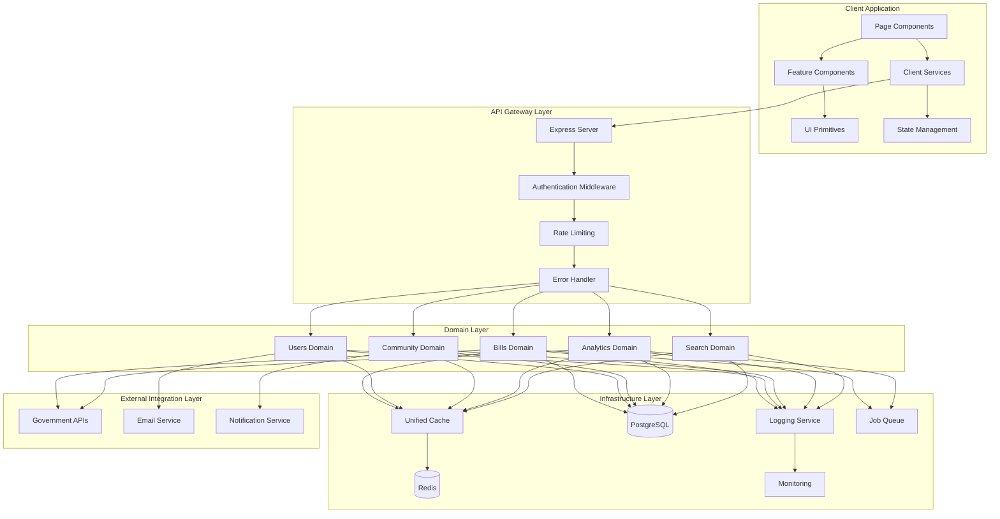
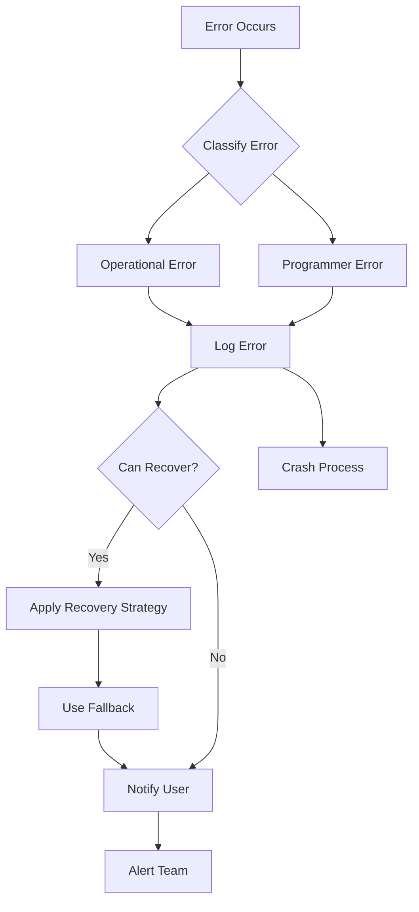

# Chanuka Platform Restructuring Design Document

## Document Control
- **Version**: 1.0
- **Date**: October 12, 2025
- **Status**: Draft for Review
- **Authors**: Architecture Team
- **Related Requirements**: Requirements Document v1.0

## Executive Summary

This design document presents a comprehensive architectural restructuring of the Chanuka civic engagement platform. The design transforms the current fragmented codebase into a coherent, domain-driven architecture that eliminates redundancies, establishes clear boundaries, and creates a foundation for sustainable growth. The restructuring is designed to be implemented incrementally with zero downtime and full backward compatibility throughout the migration period.

---

## Current State Analysis

The existing codebase reflects organic growth patterns that have created several architectural challenges. The docs/core directory contains experimental infrastructure that duplicates functionality already present in the server directory, creating confusion about which implementations should be considered production-ready. Cross-cutting concerns like caching, error handling, and validation exist in multiple versions across the codebase, each with slightly different capabilities and interfaces. Feature code is organized by technical layer rather than business domain, making it difficult to understand system capabilities and creating tight coupling between unrelated components.

The frontend exhibits similar patterns with multiple approaches to state management, scattered API interaction logic, and duplicate utility functions across different feature areas. Testing infrastructure is fragmented with test utilities duplicated in multiple locations and inconsistent patterns for mocking and assertions. Documentation is incomplete and often out of sync with implementation. These challenges compound each other, creating friction for developers and increasing the risk of bugs and performance issues.

---

## Architectural Vision

The restructured architecture adopts domain-driven design principles to organize code by business capability rather than technical layer. Each major business domain becomes a self-contained module with clear public interfaces and encapsulated implementation details. Cross-cutting infrastructure concerns are consolidated into a unified infrastructure layer that provides consistent implementations of caching, error handling, logging, monitoring, and other shared capabilities.

The frontend reorganization separates concerns more clearly by distinguishing between page components that coordinate features, reusable components that encapsulate specific UI patterns, and primitive UI components that provide foundational building blocks. State management is simplified by using React Query for server state, React hooks for local component state, and eliminating unnecessary global state. API interactions are centralized in service modules that handle loading states, error handling, and offline capabilities consistently.

Testing infrastructure is unified around shared test utilities, consistent mocking patterns, and a clear testing pyramid that emphasizes fast unit tests with strategic integration and end-to-end coverage. Documentation becomes a first-class concern with self-documenting code organization, comprehensive API documentation, and architectural decision records that capture the reasoning behind key design choices.

---

## High-Level System Architecture



This architecture diagram illustrates the clear separation between client, API gateway, domain logic, infrastructure, and external integrations. The flow is unidirectional with well-defined boundaries at each layer. Client components never directly access infrastructure or domain logic but instead interact through the services layer. The API gateway provides cross-cutting concerns before requests reach domain logic. Domains are independent of each other but share common infrastructure. External integrations are abstracted behind service interfaces within domains.

---

## Detailed Component Design

### Infrastructure Layer

The infrastructure layer provides the foundation for all other components through consolidated implementations of cross-cutting concerns. This layer is designed to be framework-agnostic where possible to support future migration scenarios.

#### Unified Cache Service

```typescript
interface CacheAdapter {
  get<T>(key: string): Promise<T | null>;
  set<T>(key: string, value: T, ttl?: number): Promise<void>;
  delete(key: string): Promise<void>;
  clear(pattern?: string): Promise<void>;
  has(key: string): Promise<boolean>;
}

interface CacheOptions {
  adapter: 'memory' | 'redis' | 'multi-tier';
  ttl?: number;
  namespace?: string;
  serializer?: Serializer;
}

class UnifiedCacheService {
  private adapter: CacheAdapter;
  private metrics: MetricsCollector;
  private circuitBreaker: CircuitBreaker;

  constructor(options: CacheOptions) {
    this.adapter = this.createAdapter(options);
    this.metrics = new MetricsCollector('cache');
    this.circuitBreaker = new CircuitBreaker({
      threshold: 5,
      timeout: 10000,
      resetTimeout: 60000
    });
  }

  async get<T>(key: string): Promise<T | null> {
    return this.circuitBreaker.execute(async () => {
      const start = Date.now();
      try {
        const value = await this.adapter.get<T>(key);
        this.metrics.recordHit(value !== null);
        this.metrics.recordLatency(Date.now() - start);
        return value;
      } catch (error) {
        this.metrics.recordError();
        throw error;
      }
    });
  }

  // Additional methods with similar monitoring and resilience patterns
}
```

The cache service consolidates all caching implementations into a single, well-tested component. It provides adapter patterns for different storage backends including in-memory caching for development and testing, Redis for distributed production caching, and multi-tier caching that combines memory and Redis for optimal performance. The circuit breaker pattern protects against cascading failures when cache infrastructure becomes unavailable. Comprehensive metrics enable monitoring of cache effectiveness and performance.

#### Error Handling Framework

```typescript
abstract class ApplicationError extends Error {
  abstract readonly code: string;
  abstract readonly statusCode: number;
  abstract readonly isOperational: boolean;
  readonly correlationId: string;
  readonly timestamp: Date;
  readonly context?: Record<string, unknown>;

  constructor(message: string, context?: Record<string, unknown>) {
    super(message);
    this.name = this.constructor.name;
    this.correlationId = getCorrelationId();
    this.timestamp = new Date();
    this.context = context;
    Error.captureStackTrace(this, this.constructor);
  }

  toJSON() {
    return {
      name: this.name,
      code: this.code,
      message: this.message,
      statusCode: this.statusCode,
      correlationId: this.correlationId,
      timestamp: this.timestamp,
      context: this.context
    };
  }
}

class ValidationError extends ApplicationError {
  readonly code = 'VALIDATION_ERROR';
  readonly statusCode = 400;
  readonly isOperational = true;
}

class UnifiedErrorHandler {
  private logger: Logger;
  private metrics: MetricsCollector;
  private recoveryStrategies: Map<string, RecoveryStrategy>;

  async handle(error: Error, context: ErrorContext): Promise<ErrorResponse> {
    const appError = this.normalizeError(error);
    
    await this.logger.error('Error occurred', {
      error: appError.toJSON(),
      context
    });

    this.metrics.recordError(appError.code);

    if (appError.isOperational) {
      const strategy = this.recoveryStrategies.get(appError.code);
      if (strategy) {
        await strategy.attempt(context);
      }
    }

    return {
      error: {
        code: appError.code,
        message: this.sanitizeMessage(appError.message),
        correlationId: appError.correlationId
      }
    };
  }
}
```

The error handling framework establishes a hierarchy of error types that make error handling consistent and predictable throughout the application. Operational errors that can be handled gracefully are distinguished from programmer errors that should crash the process. All errors carry correlation IDs that enable tracing through distributed operations. Error handling includes automatic recovery strategies for known error conditions and comprehensive logging for debugging. The framework integrates with monitoring systems to track error rates and patterns.

#### Logging Service

```typescript
interface LogEntry {
  level: 'debug' | 'info' | 'warn' | 'error';
  message: string;
  correlationId: string;
  timestamp: Date;
  context?: Record<string, unknown>;
  error?: Error;
}

class UnifiedLoggingService {
  private transports: LogTransport[];
  private sanitizer: DataSanitizer;
  private rotation: LogRotation;

  log(entry: Partial<LogEntry>): void {
    const fullEntry: LogEntry = {
      level: entry.level || 'info',
      message: entry.message || '',
      correlationId: entry.correlationId || getCorrelationId(),
      timestamp: new Date(),
      context: this.sanitizer.sanitize(entry.context),
      error: entry.error
    };

    if (this.shouldLog(fullEntry.level)) {
      this.transports.forEach(transport => {
        transport.write(fullEntry);
      });
    }
  }

  // Convenience methods
  debug(message: string, context?: Record<string, unknown>): void {
    this.log({ level: 'debug', message, context });
  }

  info(message: string, context?: Record<string, unknown>): void {
    this.log({ level: 'info', message, context });
  }

  // Additional levels...
}
```

The logging service provides structured logging with automatic correlation ID propagation, sensitive data sanitization, and configurable transports. Log rotation is handled automatically with configurable retention policies. The service integrates with monitoring dashboards and alerting systems. Log levels can be adjusted dynamically without redeployment.

### Domain Layer

The domain layer organizes code by business capability with each domain being a self-contained module that encapsulates related functionality.

#### Bills Domain

```typescript
interface BillsDomainInterface {
  // Bill management
  createBill(data: CreateBillInput): Promise<Bill>;
  updateBill(id: string, data: UpdateBillInput): Promise<Bill>;
  getBill(id: string): Promise<Bill>;
  listBills(filters: BillFilters): Promise<PaginatedResult<Bill>>;
  
  // Bill tracking
  trackBill(userId: string, billId: string): Promise<void>;
  untrackBill(userId: string, billId: string): Promise<void>;
  getTrackedBills(userId: string): Promise<Bill[]>;
  
  // Bill analysis
  analyzeBill(billId: string): Promise<BillAnalysis>;
  getBillSponsors(billId: string): Promise<Sponsor[]>;
  detectConflicts(billId: string): Promise<ConflictAnalysis>;
  
  // Real-time updates
  subscribeToBillUpdates(billId: string, callback: UpdateCallback): void;
  unsubscribeFromBillUpdates(billId: string): void;
}

class BillsDomain implements BillsDomainInterface {
  private storage: BillStorage;
  private cache: CacheService;
  private externalApis: GovernmentDataService;
  private eventBus: EventBus;
  private logger: Logger;

  constructor(dependencies: BillsDomainDependencies) {
    this.storage = dependencies.storage;
    this.cache = dependencies.cache;
    this.externalApis = dependencies.externalApis;
    this.eventBus = dependencies.eventBus;
    this.logger = dependencies.logger;
  }

  async getBill(id: string): Promise<Bill> {
    const cacheKey = `bill:${id}`;
    const cached = await this.cache.get<Bill>(cacheKey);
    
    if (cached) {
      return cached;
    }

    const bill = await this.storage.findBillById(id);
    
    if (!bill) {
      throw new NotFoundError(`Bill ${id} not found`);
    }

    await this.cache.set(cacheKey, bill, 300);
    return bill;
  }

  async analyzeBill(billId: string): Promise<BillAnalysis> {
    const bill = await this.getBill(billId);
    
    const [sponsors, conflicts, patterns] = await Promise.all([
      this.getBillSponsors(billId),
      this.detectConflicts(billId),
      this.analyzeVotingPatterns(billId)
    ]);

    const analysis: BillAnalysis = {
      bill,
      sponsors,
      conflicts,
      votingPatterns: patterns,
      timestamp: new Date()
    };

    this.eventBus.emit('bill:analyzed', { billId, analysis });
    
    return analysis;
  }
}
```

The Bills domain encapsulates all bill-related functionality including CRUD operations, tracking, sponsorship analysis, conflict detection, and real-time updates. The domain maintains its own storage layer, uses the unified cache service for performance, integrates with external government APIs, and emits events for cross-domain communication. All implementation details are hidden behind the domain interface, making it easy to modify internal behavior without affecting consumers.

#### Users Domain

```typescript
interface UsersDomainInterface {
  // Authentication
  register(data: RegisterInput): Promise<User>;
  login(credentials: LoginInput): Promise<AuthToken>;
  logout(sessionId: string): Promise<void>;
  resetPassword(email: string): Promise<void>;
  
  // Profile management
  getProfile(userId: string): Promise<UserProfile>;
  updateProfile(userId: string, data: ProfileUpdate): Promise<UserProfile>;
  deleteAccount(userId: string): Promise<void>;
  
  // Preferences
  getPreferences(userId: string): Promise<UserPreferences>;
  updatePreferences(userId: string, prefs: PreferenceUpdate): Promise<UserPreferences>;
  
  // Verification
  requestCitizenVerification(userId: string, documents: Document[]): Promise<void>;
  requestExpertVerification(userId: string, credentials: Credential[]): Promise<void>;
  getVerificationStatus(userId: string): Promise<VerificationStatus>;
}

class UsersDomain implements UsersDomainInterface {
  private storage: UserStorage;
  private authService: AuthenticationService;
  private sessionService: SessionService;
  private verificationService: VerificationService;
  private eventBus: EventBus;
  private logger: Logger;

  async register(data: RegisterInput): Promise<User> {
    const validation = await this.validateRegistration(data);
    if (!validation.valid) {
      throw new ValidationError('Invalid registration data', validation.errors);
    }

    const hashedPassword = await this.authService.hashPassword(data.password);
    
    const user = await this.storage.createUser({
      email: data.email,
      passwordHash: hashedPassword,
      profile: {
        firstName: data.firstName,
        lastName: data.lastName
      }
    });

    this.eventBus.emit('user:registered', { userId: user.id });
    
    await this.sendWelcomeEmail(user);
    
    return this.sanitizeUser(user);
  }

  async login(credentials: LoginInput): Promise<AuthToken> {
    const user = await this.storage.findUserByEmail(credentials.email);
    
    if (!user) {
      throw new AuthenticationError('Invalid credentials');
    }

    const valid = await this.authService.verifyPassword(
      credentials.password,
      user.passwordHash
    );

    if (!valid) {
      this.logger.warn('Failed login attempt', { email: credentials.email });
      throw new AuthenticationError('Invalid credentials');
    }

    const session = await this.sessionService.createSession(user.id);
    const token = await this.authService.generateToken(session);

    this.eventBus.emit('user:logged_in', { userId: user.id });

    return token;
  }

  private sanitizeUser(user: User): User {
    const { passwordHash, ...sanitized } = user;
    return sanitized as User;
  }
}
```

The Users domain manages all user-related functionality with clear separation between public interfaces and internal implementation. Authentication is handled securely with proper password hashing and session management. The domain emits events for cross-cutting concerns like sending welcome emails or updating analytics. User data is sanitized before being returned to prevent leaking sensitive information.

#### Community Domain

```typescript
interface CommunityDomainInterface {
  // Comments
  createComment(data: CreateCommentInput): Promise<Comment>;
  updateComment(id: string, data: UpdateCommentInput): Promise<Comment>;
  deleteComment(id: string): Promise<void>;
  getComments(filters: CommentFilters): Promise<PaginatedResult<Comment>>;
  
  // Voting
  voteOnComment(userId: string, commentId: string, vote: VoteType): Promise<void>;
  removeVote(userId: string, commentId: string): Promise<void>;
  getCommentVotes(commentId: string): Promise<VoteSummary>;
  
  // Moderation
  reportComment(commentId: string, reason: string): Promise<void>;
  moderateComment(commentId: string, action: ModerationAction): Promise<void>;
  
  // Social sharing
  shareContent(userId: string, contentId: string, platform: string): Promise<ShareResult>;
}

class CommunityDomain implements CommunityDomainInterface {
  private storage: CommunityStorage;
  private moderationService: ModerationService;
  private notificationService: NotificationService;
  private cache: CacheService;
  private eventBus: EventBus;

  async createComment(data: CreateCommentInput): Promise<Comment> {
    await this.validateCommentContent(data.content);

    const moderationResult = await this.moderationService.checkContent(data.content);
    
    if (moderationResult.requiresReview) {
      return this.createPendingComment(data);
    }

    const comment = await this.storage.createComment({
      ...data,
      status: 'published',
      createdAt: new Date()
    });

    await this.cache.delete(`comments:${data.billId}`);
    
    this.eventBus.emit('comment:created', { 
      commentId: comment.id,
      billId: data.billId,
      userId: data.userId 
    });

    await this.notifyRelevantUsers(comment);

    return comment;
  }

  async voteOnComment(
    userId: string, 
    commentId: string, 
    vote: VoteType
  ): Promise<void> {
    const comment = await this.storage.findCommentById(commentId);
    
    if (!comment) {
      throw new NotFoundError(`Comment ${commentId} not found`);
    }

    await this.storage.upsertVote({
      userId,
      commentId,
      voteType: vote,
      timestamp: new Date()
    });

    await this.cache.delete(`comment:votes:${commentId}`);
    
    this.eventBus.emit('comment:voted', { 
      userId, 
      commentId, 
      voteType: vote 
    });
  }

  private async notifyRelevantUsers(comment: Comment): Promise<void> {
    const notifications: NotificationTask[] = [];

    if (comment.parentId) {
      const parentComment = await this.storage.findCommentById(comment.parentId);
      notifications.push({
        userId: parentComment.userId,
        type: 'comment_reply',
        data: { commentId: comment.id }
      });
    }

    const billTrackers = await this.storage.getBillTrackers(comment.billId);
    notifications.push(...billTrackers.map(userId => ({
      userId,
      type: 'new_comment',
      data: { commentId: comment.id, billId: comment.billId }
    })));

    await this.notificationService.sendBatch(notifications);
  }
}
```

The Community domain encapsulates all user interaction features with built-in moderation, notification triggers, and cache invalidation. The domain handles the complexity of notifying relevant users when new comments are created while keeping the interface simple for consumers.

#### Analytics Domain

```typescript
interface AnalyticsDomainInterface {
  // Engagement analytics
  trackPageView(data: PageViewData): Promise<void>;
  trackUserAction(data: UserActionData): Promise<void>;
  getEngagementMetrics(filters: EngagementFilters): Promise<EngagementMetrics>;
  
  // Transparency features
  analyzeConflicts(billId: string): Promise<ConflictAnalysis>;
  trackFinancialDisclosures(): Promise<DisclosureUpdate[]>;
  monitorRegulatoryChanges(): Promise<RegulatoryChange[]>;
  
  // Machine learning
  generateRecommendations(userId: string): Promise<Recommendation[]>;
  analyzeSentiment(text: string): Promise<SentimentAnalysis>;
}

class AnalyticsDomain implements AnalyticsDomainInterface {
  private storage: AnalyticsStorage;
  private mlService: MachineLearningService;
  private externalData: ExternalDataService;
  private cache: CacheService;
  private queue: JobQueue;

  async trackUserAction(data: UserActionData): Promise<void> {
    await this.queue.add('analytics:action', {
      ...data,
      timestamp: new Date(),
      sessionId: getSessionId()
    });
  }

  async analyzeConflicts(billId: string): Promise<ConflictAnalysis> {
    const cacheKey = `conflicts:${billId}`;
    const cached = await this.cache.get<ConflictAnalysis>(cacheKey);
    
    if (cached && this.isFresh(cached, 3600)) {
      return cached;
    }

    const [sponsors, financialData, votingHistory] = await Promise.all([
      this.getSponsors(billId),
      this.getFinancialDisclosures(billId),
      this.getVotingHistory(billId)
    ]);

    const conflicts = await this.mlService.detectConflicts({
      sponsors,
      financialData,
      votingHistory
    });

    const analysis: ConflictAnalysis = {
      billId,
      conflicts,
      confidence: conflicts.reduce((sum, c) => sum + c.confidence, 0) / conflicts.length,
      analyzedAt: new Date()
    };

    await this.cache.set(cacheKey, analysis, 3600);
    
    return analysis;
  }

  async trackFinancialDisclosures(): Promise<DisclosureUpdate[]> {
    const legislators = await this.storage.getAllLegislators();
    const updates: DisclosureUpdate[] = [];

    for (const legislator of legislators) {
      const disclosures = await this.externalData.fetchDisclosures(legislator.id);
      const changes = await this.detectDisclosureChanges(
        legislator.id, 
        disclosures
      );
      
      if (changes.length > 0) {
        updates.push(...changes);
        await this.notifyOfDisclosureChanges(legislator, changes);
      }
    }

    return updates;
  }

  private async notifyOfDisclosureChanges(
    legislator: Legislator,
    changes: DisclosureChange[]
  ): Promise<void> {
    const interestedUsers = await this.storage.getUsersTrackingLegislator(
      legislator.id
    );

    for (const userId of interestedUsers) {
      await this.queue.add('notification:send', {
        userId,
        type: 'financial_disclosure_update',
        data: { legislator, changes }
      });
    }
  }
}
```

The Analytics domain handles both real-time event tracking and batch analysis processes. User actions are queued for asynchronous processing to avoid impacting response times. Conflict analysis leverages machine learning services while caching results appropriately. Financial disclosure monitoring runs on a schedule and notifies interested users of changes.

#### Search Domain

```typescript
interface SearchDomainInterface {
  // Search operations
  search(query: SearchQuery): Promise<SearchResults>;
  suggest(partial: string, context: SearchContext): Promise<string[]>;
  
  // Index management
  indexBill(bill: Bill): Promise<void>;
  updateIndex(entityType: string, entityId: string): Promise<void>;
  rebuildIndex(entityType: string): Promise<void>;
}

class SearchDomain implements SearchDomainInterface {
  private searchEngine: SearchEngine;
  private storage: SearchStorage;
  private cache: CacheService;
  private queue: JobQueue;

  async search(query: SearchQuery): Promise<SearchResults> {
    const normalizedQuery = this.normalizeQuery(query);
    const cacheKey = this.getCacheKey(normalizedQuery);
    
    const cached = await this.cache.get<SearchResults>(cacheKey);
    if (cached) {
      await this.trackSearch(normalizedQuery, true);
      return cached;
    }

    const results = await this.searchEngine.search(normalizedQuery);
    
    await this.cache.set(cacheKey, results, 300);
    await this.trackSearch(normalizedQuery, false);
    
    return results;
  }

  async indexBill(bill: Bill): Promise<void> {
    const searchDocument = this.transformBillToSearchDocument(bill);
    await this.searchEngine.index('bills', bill.id, searchDocument);
    await this.cache.delete(`search:*`); // Invalidate search caches
  }

  private transformBillToSearchDocument(bill: Bill): SearchDocument {
    return {
      id: bill.id,
      title: bill.title,
      summary: bill.summary,
      fullText: bill.fullText,
      sponsors: bill.sponsors.map(s => s.name),
      tags: bill.tags,
      status: bill.status,
      introducedDate: bill.introducedDate,
      boost: this.calculateRelevanceBoost(bill)
    };
  }

  private calculateRelevanceBoost(bill: Bill): number {
    let boost = 1.0;
    
    // Boost recent bills
    const daysSinceIntroduction = daysSince(bill.introducedDate);
    if (daysSinceIntroduction < 30) {
      boost *= 1.5;
    }
    
    // Boost bills with more engagement
    boost *= Math.log10(bill.commentCount + 10) / 2;
    
    return boost;
  }
}
```

The Search domain abstracts search engine implementation details while providing powerful search capabilities. The domain manages the lifecycle of search indices, handles query normalization and caching, and tracks search analytics to improve relevance over time.

---

## Client Architecture

### Component Organization

```
client/src/
├── app/                          # Application shell
│   ├── App.tsx
│   ├── Router.tsx
│   └── providers/
│       ├── AuthProvider.tsx
│       ├── QueryProvider.tsx
│       └── ThemeProvider.tsx
├── pages/                        # Page components
│   ├── bills/
│   │   ├── BillDetailPage.tsx
│   │   ├── BillListPage.tsx
│   │   └── BillAnalysisPage.tsx
│   ├── community/
│   │   ├── CommentsPage.tsx
│   │   └── DiscussionsPage.tsx
│   ├── profile/
│   │   ├── ProfilePage.tsx
│   │   └── SettingsPage.tsx
│   └── index.ts
├── features/                     # Feature modules
│   ├── bills/
│   │   ├── components/
│   │   │   ├── BillCard.tsx
│   │   │   ├── BillFilters.tsx
│   │   │   └── BillTimeline.tsx
│   │   ├── hooks/
│   │   │   ├── useBillTracking.ts
│   │   │   └── useBillAnalysis.ts
│   │   ├── services/
│   │   │   └── billsService.ts
│   │   └── types/
│   │       └── bill.types.ts
│   ├── auth/
│   ├── community/
│   └── analytics/
├── components/                   # Shared components
│   ├── layout/
│   │   ├── AppLayout.tsx
│   │   ├── Sidebar.tsx
│   │   └── Header.tsx
│   ├── ui/                      # UI primitives
│   │   ├── Button.tsx
│   │   ├── Input.tsx
│   │   ├── Card.tsx
│   │   └── ...
│   └── shared/
│       ├── LoadingSpinner.tsx
│       ├── ErrorBoundary.tsx
│       └── EmptyState.tsx
├── services/                     # API services
│   ├── api/
│   │   ├── client.ts
│   │   ├── types.ts
│   │   └── hooks.ts
│   └── websocket/
│       └── client.ts
├── hooks/                        # Shared hooks
│   ├── useAuth.ts
│   ├── useDebounce.ts
│   └── useLocalStorage.ts
├── utils/                        # Utility functions
│   ├── formatting.ts
│   ├── validation.ts
│   └── date.ts
└── types/                        # Shared types
    └── global.d.ts
```

This organization separates concerns clearly. Pages orchestrate features and handle routing. Features are self-contained modules with their own components, hooks, services, and types. Shared components provide reusable UI patterns. Services handle API interactions consistently. The structure makes it immediately clear where new code should be added.

### State Management Strategy

```typescript
// Server state with React Query
function useBill(billId: string) {
  return useQuery({
    queryKey: ['bill', billId],
    queryFn: () => billsService.getBill(billId),
    staleTime: 5 * 60 * 1000, // 5 minutes
    cacheTime: 10 * 60 * 1000, // 10 minutes
    retry: 3,
    onError: (error) => {
      logger.error('Failed to fetch bill', { billId, error });
    }
  });
}

// Local component state with hooks
function BillFilters() {
  const [selectedStatus, setSelectedStatus] = useState<BillStatus[]>([]);
  const [dateRange, setDateRange] = useState<DateRange | null>(null);
  const [searchTerm, setSearchTerm] = useState('');

  const debouncedSearch = useDebounce(searchTerm, 300);

  // Component logic...
}

// Global UI state (sparingly) with Context
interface NavigationContextValue {
  isOpen: boolean;
  toggle: () => void;
  close: () => void;
}

const NavigationContext = createContext<NavigationContextValue | null>(null);

export function NavigationProvider({ children }: PropsWithChildren) {
  const [isOpen, setIsOpen] = useState(false);

  const value = useMemo(() => ({
    isOpen,
    toggle: () => setIsOpen(prev => !prev),
    close: () => setIsOpen(false)
  }), [isOpen]);

  return (
    <NavigationContext.Provider value={value}>
      {children}
    </NavigationContext.Provider>
  );
}
```

State management is simplified by using the right tool for each type of state. React Query handles all server state with automatic caching, refetching, and error handling. Local component state uses standard React hooks. Global UI state is minimized and uses Context API only when truly necessary. This approach eliminates the complexity of global state management libraries while providing excellent developer experience.

### Service Layer Pattern

```typescript
// Base API client
class ApiClient {
  private baseURL: string;
  private token: string | null = null;

  async request<T>(
    endpoint: string,
    options: RequestOptions = {}
  ): Promise<T> {
    const url = `${this.baseURL}${endpoint}`;
    const headers = {
      'Content-Type': 'application/json',
      ...options.headers
    };

    if (this.token) {
      headers['Authorization'] = `Bearer ${this.token}`;
    }

    try {
      const response = await fetch(url, {
        ...options,
        headers
      });

      if (!response.ok) {
        throw await this.handleErrorResponse(response);
      }

      return await response.json();
    } catch (error) {
      if (error instanceof NetworkError) {
        // Handle offline scenario
        return this.getFromCache<T>(endpoint);
      }
      throw error;
    }
  }

  private async handleErrorResponse(response: Response): Promise<Error> {
    const data = await response.json().catch(() => ({}));
    
    switch (response.status) {
      case 401:
        this.token = null;
        return new AuthenticationError(data.message);
      case 403:
        return new AuthorizationError(data.message);
      case 404:
        return new NotFoundError(data.message);
      case 422:
        return new ValidationError(data.message, data.errors);
      default:
        return new ApiError(data.message || 'An error occurred');
    }
  }
}

// Domain-specific service
class BillsService {
  constructor(private client: ApiClient) {}

  async getBill(id: string): Promise<Bill> {
    return this.client.request<Bill>(`/api/bills/${id}`);
  }

  async listBills(filters: BillFilters): Promise<PaginatedResult<Bill>> {
    const params = new URLSearchParams(filters as any);
    return this.client.request<PaginatedResult<Bill>>(`/api/bills?${params}`);
  }

  async trackBill(billId: string): Promise<void> {
    await this.client.request(`/api/bills/${billId}/track`, {
      method: 'POST'
    });
  }
}

export const billsService = new BillsService(apiClient);
```

The service layer provides a clean abstraction over API calls with consistent error handling, authentication, and offline support. Domain-specific services encapsulate API endpoints related to their domain, making it easy to mock for testing and providing a single place to update when APIs change.

---

## Data Models

### Core Domain Models

```typescript
// Bills Domain
interface Bill {
  id: string;
  externalId: string | null;
  title: string;
  summary: string;
  fullText: string;
  status: BillStatus;
  introducedDate: Date;
  lastActionDate: Date;
  sponsors: Sponsor[];
  cosponsors: Sponsor[];
  tags: string[];
  category: string;
  metadata: BillMetadata;
  createdAt: Date;
  updatedAt: Date;
}

interface Sponsor {
  id: string;
  name: string;
  party: string;
  state: string;
  role: 'primary' | 'cosponsor';
  financialDisclosures?: FinancialDisclosure[];
}

interface BillAnalysis {
  billId: string;
  conflicts: Conflict[];
  sentiment: SentimentScore;
  complexity: ComplexityMetrics;
  impact: ImpactAssessment;
  analyzedAt: Date;
}

// Users Domain
interface User {
  id: string;
  email: string;
  profile: UserProfile;
  preferences: UserPreferences;
  verification: VerificationStatus;
  createdAt: Date;
  updatedAt: Date;
}

interface UserProfile {
  firstName: string;
  lastName: string;
  avatar?: string;
  bio?: string;
  location?: string;
}

interface UserPreferences {
  notifications: NotificationPreferences;
  privacy: PrivacyPreferences;
  accessibility: AccessibilityPreferences;
}

// Community Domain
interface Comment {
  id: string;
  billId: string;
  userId: string;
  content: string;
  parentId?: string;
  status: CommentStatus;
  votes: VoteSummary;
  createdAt: Date;
  updatedAt: Date;
  author: CommentAuthor;
}

interface VoteSummary {
  upvotes: number;
  downvotes: number;
  userVote?: VoteType;
}

// Analytics Domain
interface EngagementMetrics {
  period: DateRange;
  pageViews: number;
  uniqueVisitors: number;
  avgSessionDuration: number;
  topPages: PageMetric[];
  userActions: ActionMetric[];
}

interface ConflictAnalysis {
  billId: string;
  conflicts: DetectedConflict[];
  confidence: number;
  analyzedAt: Date;
}

interface DetectedConflict {
  type: ConflictType;
  severity: 'low' | 'medium' | 'high';
  description: string;
  involvedParties: Party[];
  evidence: Evidence[];
  confidence: number;
}
```

These domain models represent the core entities in the system with clear relationships and comprehensive metadata. Models include timestamps for audit trails, support for versioning where needed, and maintain referential integrity through proper foreign key relationships.

---

## Cross-Cutting Concerns

### Error Handling Strategy

The error handling strategy establishes a hierarchy from specific to general errors with appropriate recovery mechanisms at each level.



Operational errors like network failures or validation errors are handled gracefully with appropriate user feedback and recovery strategies. Programmer errors like null pointer exceptions indicate bugs and cause the process to crash in development while being logged and monitored in production. All errors carry correlation IDs for distributed tracing.

### Monitoring and Observability

```typescript
interface MonitoringStrategy {
  // Metrics collection
  collectMetrics(): void;
  recordDuration(operation: string, duration: number): void;
  recordCount(metric: string, value: number): void;
  
  // Health checks
  checkDatabaseHealth(): Promise<HealthStatus>;
  checkCacheHealth(): Promise<HealthStatus>;
  checkExternalAPIs(): Promise<HealthStatus>;
  
  // Alerting
  triggerAlert(severity: AlertSeverity, message: string): void;
  
  // Distributed tracing
  startSpan(operation: string): Span;
  endSpan(span: Span): void;
}

// Example implementation
class MonitoringService implements MonitoringStrategy {
  async checkSystemHealth(): Promise<SystemHealth> {
    const [db, cache, apis] = await Promise.all([
      this.checkDatabaseHealth(),
      this.checkCacheHealth(),
      this.checkExternalAPIs()
    ]);

    const overall = this.aggregateHealth([db, cache, apis]);

    if (overall.status === 'critical') {
      this.triggerAlert('high', 'System health critical');
    }

    return { db, cache, apis, overall, timestamp: new Date() };
  }
}
```

Monitoring provides real-time visibility into system health and performance. Metrics are collected automatically for key operations, health checks run periodically, and alerts notify the team of issues before they impact users. Distributed tracing connects related operations across service boundaries.

---

## Testing Strategy

### Testing Pyramid

```
                /\
               /  \
              / E2E \
             /________\
            /          \
           / Integration \
          /______________\
         /                \
        /   Unit Tests     \
       /____________________\
```

The testing strategy follows the testing pyramid with the majority of tests being fast, focused unit tests. Integration tests verify component interactions. End-to-end tests validate critical user journeys. This balance provides comprehensive coverage while keeping test execution time reasonable.

### Test Organization

```typescript
// Unit test example
describe('BillsService', () => {
  let service: BillsService;
  let mockStorage: jest.Mocked<BillStorage>;
  let mockCache: jest.Mocked<CacheService>;

  beforeEach(() => {
    mockStorage = createMockBillStorage();
    mockCache = createMockCache();
    service = new BillsService({
      storage: mockStorage,
      cache: mockCache,
      logger: mockLogger
    });
  });

  describe('getBill', () => {
    it('returns cached bill when available', async () => {
      const bill = createMockBill();
      mockCache.get.mockResolvedValue(bill);

      const result = await service.getBill(bill.id);

      expect(result).toEqual(bill);
      expect(mockStorage.findBillById).not.toHaveBeenCalled();
    });

    it('fetches from storage when cache miss', async () => {
      const bill = createMockBill();
      mockCache.get.mockResolvedValue(null);
      mockStorage.findBillById.mockResolvedValue(bill);

      const result = await service.getBill(bill.id);

      expect(result).toEqual(bill);
      expect(mockCache.set).toHaveBeenCalledWith(
        `bill:${bill.id}`,
        bill,
        300
      );
    });

    it('throws NotFoundError when bill does not exist', async () => {
      mockCache.get.mockResolvedValue(null);
      mockStorage.findBillById.mockResolvedValue(null);

      await expect(service.getBill('non-existent'))
        .rejects
        .toThrow(NotFoundError);
    });
  });
});

// Integration test example
describe('Bill Tracking Integration', () => {
  let testDb: TestDatabase;
  let billsService: BillsService;
  let usersService: UsersService;

  beforeAll(async () => {
    testDb = await createTestDatabase();
    billsService = createBillsService(testDb);
    usersService = createUsersService(testDb);
  });

  afterAll(async () => {
    await testDb.cleanup();
  });

  it('allows users to track and untrack bills', async () => {
    const user = await usersService.register(createTestUser());
    const bill = await billsService.createBill(createTestBill());

    await billsService.trackBill(user.id, bill.id);
    
    let tracked = await billsService.getTrackedBills(user.id);
    expect(tracked).toContainEqual(expect.objectContaining({ id: bill.id }));

    await billsService.untrackBill(user.id, bill.id);
    
    tracked = await billsService.getTrackedBills(user.id);
    expect(tracked).not.toContainEqual(expect.objectContaining({ id: bill.id }));
  });
});
```

Tests are organized to mirror the source code structure. Unit tests focus on individual components in isolation using mocks. Integration tests verify that components work together correctly using test databases. All tests follow the Arrange-Act-Assert pattern for clarity.

---

## Migration Strategy

### Phase 1: Infrastructure Consolidation (Weeks 1-3)

The first phase focuses on consolidating infrastructure components without changing domain logic. Create the unified infrastructure layer with cache, error handling, logging, and monitoring services. Implement adapter patterns that allow legacy code to use new infrastructure through familiar interfaces. Deploy adapters alongside existing code to verify functionality. Add comprehensive tests for infrastructure components. Monitor production systems to ensure performance remains stable. Document migration patterns for other teams. Success criteria include zero production incidents related to infrastructure changes and all new code using unified infrastructure.

### Phase 2: Domain Boundary Definition (Weeks 4-6)

The second phase establishes clear domain boundaries by creating domain interface definitions and organizing storage layers. Define public interfaces for each domain without implementing them yet. Create storage abstractions that separate data access from domain logic. Map existing functionality to appropriate domains. Identify and document cross-domain dependencies. Begin migrating isolated features to new domain structure. Deploy new domain implementations behind feature flags. Success criteria include all domain interfaces defined, storage layers separated, and at least one complete domain migrated and running in production.

### Phase 3: Feature Migration (Weeks 7-10)

The third phase systematically migrates features to their appropriate domains. Start with the least coupled features to build confidence. Migrate bills management functionality to the Bills domain. Move user and authentication code to Users domain. Consolidate community features into Community domain. Transfer analytics and transparency features to Analytics domain. Migrate search functionality to Search domain. Each migration includes updating tests, documentation, and deployment procedures. Use canary deployments to verify each migration. Success criteria include all major features migrated with backward compatibility maintained and test coverage improved.

### Phase 4: Client Reorganization (Weeks 11-13)

The fourth phase restructures the frontend to align with new domain organization. Reorganize component structure following new patterns. Consolidate state management using React Query and hooks. Create unified service layer for API interactions. Migrate page components to new structure. Update routing to reflect new organization. Improve code splitting and lazy loading. Success criteria include frontend bundle size reduced, page load times improved, and component structure clearly documented.

### Phase 5: Testing Infrastructure (Weeks 14-15)

The fifth phase consolidates testing utilities and improves coverage. Create centralized test utilities and mock factories. Standardize testing patterns across codebase. Increase unit test coverage to target levels. Enhance integration test suite. Implement visual regression testing. Add load testing infrastructure. Success criteria include test coverage above eighty percent, test execution time under ten minutes, and all critical paths covered by end-to-end tests.

### Phase 6: Documentation and Cleanup (Weeks 16-17)

The final phase completes documentation and removes deprecated code. Document all domain interfaces and usage patterns. Create migration guides for future changes. Write ADRs for key architectural decisions. Remove adapter layers and deprecated code. Clean up unused dependencies. Optimize database indices and queries. Success criteria include comprehensive documentation published, all deprecated code removed, and no legacy infrastructure remaining.

### Rollback Strategy

Every phase includes explicit rollback procedures. Feature flags enable immediate disabling of new functionality. Database migrations are reversible with tested rollback scripts. Adapter layers remain in place until new implementations prove stable. Monitoring dashboards track health of both old and new implementations during transitions. Rollback triggers include error rate increases above two percent, performance degradation over ten percent, or any data integrity issues. Each rollback is followed by incident analysis and corrective action before attempting migration again.

---

## Performance Considerations

### Caching Strategy

The caching strategy uses a multi-tier approach with memory caching for frequently accessed data and Redis for distributed caching across instances. Cache keys follow consistent naming patterns with appropriate namespacing. Time-to-live values are tuned based on data volatility with static content cached longer and dynamic data having shorter TTLs. Cache warming strategies preload frequently accessed data during deployments. Cache invalidation happens automatically when data changes with event-driven updates. Cache metrics track hit rates, miss rates, and latency to optimize strategy over time.

### Database Optimization

Database performance is optimized through proper indexing, connection pooling, and query optimization. Indices are created for all foreign keys and frequently queried columns. Compound indices support common query patterns. Connection pooling prevents connection exhaustion with appropriate pool sizing. Query optimization uses EXPLAIN ANALYZE to identify bottlenecks. Expensive queries are cached or denormalized where appropriate. Database monitoring tracks slow queries and connection pool utilization. Read replicas handle reporting queries to reduce primary database load.

### API Performance

API performance is optimized through efficient data serialization, response compression, and pagination. GraphQL or field selection reduces over-fetching of data. Response compression reduces bandwidth usage. Pagination limits response size for list endpoints with cursor-based pagination for large datasets. Rate limiting prevents abuse while allowing legitimate high-volume usage. API metrics track response times, error rates, and throughput. Performance budgets enforce acceptable response time thresholds.

### Frontend Performance

Frontend performance is optimized through code splitting, lazy loading, and efficient rendering. Route-based code splitting reduces initial bundle size. Lazy loading defers loading of below-the-fold content. Image optimization includes appropriate formats, sizes, and lazy loading. Virtual scrolling handles large lists efficiently. Memoization prevents unnecessary re-renders. Web vitals are monitored in production with alerts for regressions. Service workers enable offline functionality and faster subsequent loads.

---

## Security Architecture

### Authentication and Authorization

Authentication uses JWT tokens with appropriate expiration and refresh token rotation. Passwords are hashed using bcrypt with sufficient cost factor. Session management includes proper timeout and secure cookie handling. Authorization uses role-based access control with fine-grained permissions. API endpoints validate authentication and authorization on every request. Security headers prevent common vulnerabilities. Rate limiting protects against credential stuffing and brute force attacks.

### Data Protection

Sensitive data is encrypted at rest and in transit. Database encryption protects stored data. TLS ensures secure communication. Personal information is minimized and properly anonymized in logs and analytics. Data retention policies automatically remove old data. User data export and deletion support privacy regulations. Security auditing tracks access to sensitive data. Intrusion detection monitors for suspicious activity.

### Input Validation and Sanitization

All user input is validated against strict schemas before processing. Server-side validation enforces business rules and data constraints. SQL injection is prevented through parameterized queries. XSS attacks are mitigated through proper output encoding. CSRF protection uses token validation. File uploads are scanned and validated. Content Security Policy headers restrict resource loading.

---

## Scalability Architecture

### Horizontal Scaling

The system supports horizontal scaling through stateless service design. Load balancers distribute traffic across multiple instances. Session data is stored in shared Redis rather than server memory. Database connection pools are sized appropriately per instance. Background jobs use distributed queue with multiple workers. Health checks enable automatic instance replacement. Auto-scaling policies adjust capacity based on load.

### Database Scaling

Database scaling uses read replicas for query distribution. Connection pooling prevents connection exhaustion. Query optimization reduces database load. Caching reduces database hits. Database partitioning handles data growth. Sharding strategy is planned for future horizontal database scaling. Database monitoring tracks query performance and connection usage.

### Asynchronous Processing

Long-running operations are processed asynchronously using job queues. User actions trigger immediate response with background processing. Email sending, analytics processing, and external API calls are queued. Job retry logic handles transient failures. Job monitoring tracks completion rates and processing times. Dead letter queues capture failed jobs for investigation.

---

## Deployment Architecture

### Infrastructure as Code

All infrastructure is defined as code using appropriate tools. Infrastructure changes are version controlled and reviewed. Automated deployment pipelines ensure consistency. Environment parity reduces deployment issues. Infrastructure monitoring tracks resource utilization. Cost optimization identifies unused resources.

### CI/CD Pipeline

Continuous integration runs tests on every commit. Static analysis catches code quality issues. Security scanning identifies vulnerabilities. Build artifacts are versioned and stored. Continuous deployment automates releases to staging. Production deployments use blue-green or canary strategies. Rollback procedures are tested and documented.

### Monitoring and Alerting

Comprehensive monitoring covers application, infrastructure, and business metrics. Dashboards provide real-time visibility into system health. Alerts notify teams of issues before user impact. Incident response procedures are documented and practiced. Post-incident reviews drive continuous improvement. Service level objectives define acceptable performance.

---

## Success Metrics

The restructuring success will be measured through multiple dimensions. Technical metrics include test coverage above eighty percent, build time under five minutes, deployment frequency increased by fifty percent, mean time to recovery decreased by sixty percent, and code duplication reduced by seventy-five percent. Developer experience metrics include onboarding time for new developers reduced by half, code review cycle time decreased by forty percent, and developer satisfaction scores improved. User-facing metrics include page load time maintained or improved, API response time maintained or improved, error rates maintained below one percent, and feature delivery velocity increased by thirty percent. Business metrics include technical debt ratio improved measurably, maintenance cost reduced, and ability to respond to new requirements faster.

---

## Risks and Mitigation

### Technical Risks

Data migration errors could cause data loss or corruption. Mitigation includes comprehensive testing in staging, incremental migration with verification, backup and restore procedures, and ability to rollback at any point. Performance regressions could impact user experience. Mitigation includes performance testing before deployment, gradual rollout with monitoring, and automatic rollback triggers. Integration issues could cause system failures. Mitigation includes thorough integration testing, staging environment that mirrors production, and incremental deployment strategy.

### Organizational Risks

Team capacity constraints could delay migration. Mitigation includes realistic timeline with buffer, prioritization of critical paths, and ability to pause non-essential work. Knowledge gaps could cause implementation issues. Mitigation includes training on new patterns, pair programming during migration, and comprehensive documentation. Stakeholder resistance could slow adoption. Mitigation includes clear communication of benefits, involvement in planning, and demonstration of early wins.

### Operational Risks

Production incidents during migration could impact users. Mitigation includes comprehensive monitoring, immediate rollback capability, and migration during low-traffic periods. Incomplete migration could leave system in inconsistent state. Mitigation includes clear migration phases with verification gates, tracking migration progress, and automated validation.

---

## Conclusion

This design document provides a comprehensive blueprint for restructuring the Chanuka platform from its current fragmented state into a maintainable, scalable architecture. The design eliminates redundancies through consolidated infrastructure, establishes clear domain boundaries that make the system self-documenting, and creates a foundation for sustainable growth. The phased migration approach ensures zero downtime while systematically improving the codebase. Success will be measured through improved technical metrics, enhanced developer experience, maintained user-facing performance, and increased business agility. The restructuring positions Chanuka to fulfill its mission of civic engagement with a robust technical foundation that can evolve with changing needs.