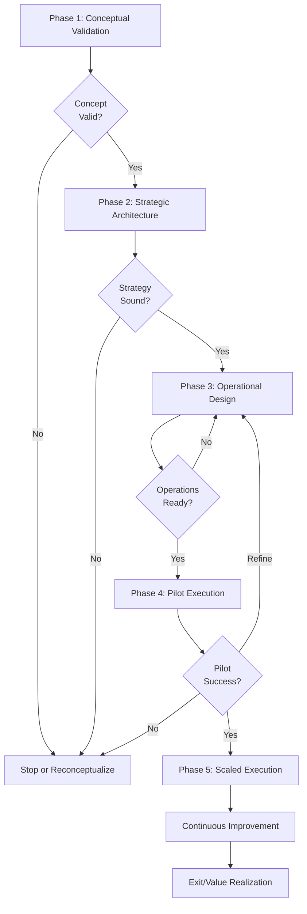

# Chanuka Platform Comprehensive Guide

## Table of Contents

1. [Platform Overview](#platform-overview)
2. [Implementation](#implementation)
3. [Strategic Elements](#strategic-elements)
4. [Legal Framework](#legal-framework)

---

## Platform Overview

### Mission and Vision

Chanuka is a comprehensive civic engagement platform designed to empower Kenyan citizens with transparent access to legislative processes, expert analysis, and community-driven insights. The platform serves as a digital commons where citizens can discover, analyze, and engage with legislation while building collective understanding of democratic processes.

### Core Architecture

The Chanuka platform is built on a domain-driven architecture with 12 specialized domains:

- **Client Application**: React-based frontend with progressive disclosure and accessibility features
- **Server Application**: Domain-driven backend with specialized modules
- **Shared Code**: Common utilities and type definitions
- **AI Models & Knowledge Base**: Constitutional and legal analysis capabilities
- **Deployment & Infrastructure**: Kubernetes-based scalable deployment

### Key Features

- **Constitutional Analysis**: AI-powered analysis of legislation against constitutional provisions
- **Real-time Engagement**: Live community participation and expert validation
- **Expert Verification**: Credibility scoring and professional validation system
- **Transparency Intelligence**: Conflict detection and financial disclosure analysis
- **Pretext Detection**: Democratic protection through pattern recognition
- **Universal Access**: USSD and ambassador programs for broad accessibility

### Philosophical Foundation

Chanuka draws on deep philosophical and scriptural traditions, particularly the biblical progression from singular leadership (Moses) through distributed systems (seventy elders) to universal participation (Pentecost). This foundation emphasizes that sustainable civic engagement requires distributing power and capacity throughout communities rather than concentrating it in singular leaders.

The platform's poetry collection, "Illuminations: Twenty Poems for a Fragile Republic," serves as both artistic expression and civic education, addressing themes of co-optation, confusion, vision, and resistance in contemporary Kenyan democracy.

### Strategic Messaging

The platform's messaging emphasizes:
- **Democratic Awakening**: Moving citizens from passive observers to active participants
- **Truth as Action**: Civic engagement as the antidote to democratic fragility
- **Distributed Leadership**: Power multiplied through community rather than concentrated in elites
- **Hope Through Action**: Practical steps for citizens to reclaim democratic agency

---

## Implementation

### Technology Stack

**Frontend:**
- React 18 with TypeScript in strict mode
- Vite for fast development and optimized builds
- Tailwind CSS with custom design system
- Redux Toolkit for state management
- React Router for navigation
- shadcn/ui for accessible components

**Backend:**
- Domain-driven architecture with 12 specialized domains
- Real-time capabilities via WebSocket integration
- AI-powered analysis engines
- Scalable microservices architecture

**Infrastructure:**
- Kubernetes-based deployment
- Progressive Web App capabilities
- Offline functionality for critical features

### Development Phases

#### Phase 1: Foundation (Weeks 1-4)
- Project setup and configuration
- Design system integration
- Application shell and routing
- State management setup

#### Phase 2: Discovery Features (Weeks 5-8)
- Bills dashboard implementation
- Advanced filtering system
- Bill detail pages with progressive disclosure

#### Phase 3: Detail & Analysis (Weeks 9-12)
- Constitutional analysis panel
- Expert verification system
- Community discussion threading

#### Phase 4: Community & Real-time (Weeks 13-16)
- Real-time engagement analytics
- Performance optimization
- Production readiness

### API Strategy

The platform implements a multi-API orchestration approach:

- **REST APIs**: Traditional RESTful endpoints for core functionality
- **GraphQL**: Flexible querying for complex data relationships
- **WebSocket APIs**: Real-time updates and live engagement features
- **AI APIs**: Constitutional analysis and pattern recognition

### Client Architecture Analysis

The current client implementation includes:
- Comprehensive component library with accessibility features
- Progressive disclosure navigation system
- Real-time engagement analytics dashboard
- Expert verification and credibility scoring
- Advanced conflict of interest visualization
- Mobile-optimized complex content navigation

### Automation Strategy

DevOps automation includes:
- CI/CD pipelines with comprehensive testing
- Infrastructure as Code for scalable deployment
- Monitoring and alerting systems
- Performance optimization and security automation

### UI/UX Implementation

Key UI patterns include:
- Progressive disclosure with complexity indicators
- Real-time engagement metrics and gamification
- Expert verification badges and credibility scoring
- Interactive conflict of interest mapping
- Mobile-first responsive design
- Accessibility-first development (WCAG 2.1 AA compliance)

---

## Strategic Elements

### Poetry and Cultural Integration

The platform integrates artistic and cultural elements to enhance civic engagement:

#### Core Poetry Collection
"Illuminations: Twenty Poems for a Fragile Republic" addresses four movements:
1. **Co-optation**: How democratic processes are subverted
2. **Confusion**: The disorienting nature of modern politics
3. **Vision**: Glimpses of democratic possibility
4. **Resistance**: Active citizenship and hope

#### Strategic Additions
Additional poems address contemporary challenges:
- Digital commons and algorithmic manipulation
- Civic toolkit poems teaching practical engagement skills
- Indigenous forms integrating traditional Kenyan oral traditions

### Progressive Disclosure Strategy

The platform implements sophisticated navigation patterns:
- **Complexity Indicators**: Reading time estimates (2-3 min, 5-8 min, 10+ min)
- **Reading Path Guidance**: Recommended exploration sequences
- **Context Navigation**: Current location awareness and quick jumps
- **Mobile Optimization**: Touch-friendly navigation for complex content

### Real-Time Engagement Features

Strategic engagement elements include:
- **Live Impact Metrics**: Real-time community approval and participation tracking
- **Personal Civic Scoring**: Individual contribution and engagement rankings
- **Expert Consensus Tracking**: Live credibility and validation indicators
- **Community Sentiment Analysis**: Real-time polling and discussion analytics

### Expert Verification System

Comprehensive credibility framework:
- **Multi-Tier Badges**: Official, domain-specific, and community-verified expert status
- **Dynamic Scoring**: Numerical credibility ratings with community validation
- **Professional Context**: Detailed backgrounds and institutional affiliations
- **Peer Review System**: Community validation of expert contributions

### Conflict Analysis Tools

Advanced transparency features:
- **Financial Exposure Tracking**: Detailed sponsor interest mapping
- **Network Visualization**: Interactive influence pathway mapping
- **Algorithmic Scoring**: Automated transparency and conflict assessments
- **Historical Pattern Analysis**: Voting correlation and industry alignment tracking

### Educational Framework

Contextual learning integration:
- **Plain Language Summaries**: Complex legal content made accessible
- **Constitutional Context**: Real-time constitutional analysis integration
- **Historical Precedents**: Similar legislation and outcomes references
- **Civic Action Guidance**: Specific engagement steps for citizens
- **Process Education**: Legislative procedure explanations

### Strategic Flow Template

The platform follows a validated strategic development approach:

### Missing Strategic Features

Critical gaps identified for implementation:
- **Server-Side Infrastructure**: Transparency processing engines, real-time analytics, expert verification backend
- **Advanced AI Features**: Constitutional analysis, pretext detection, pattern recognition
- **Scalable Architecture**: Microservices for engagement, gamification, and community features
- **Performance Optimization**: Real-time features requiring robust backend infrastructure

---

## Legal Framework

### Constitutional Analysis Integration

The platform includes comprehensive constitutional analysis capabilities:

- **Automated Constitutional Review**: AI-powered analysis of legislation against constitutional provisions
- **Legal Precedent Matching**: Historical case law and judicial interpretations
- **Rights Impact Assessment**: Analysis of how legislation affects constitutional rights
- **Expert Constitutional Flagging**: Legal expert identification of potential constitutional concerns

### Transparency and Disclosure Framework

Legal transparency features:

- **Financial Disclosure Processing**: Automated analysis of sponsor financial interests
- **Conflict Detection Algorithms**: Pattern recognition for potential conflicts of interest
- **Implementation Workaround Tracking**: Monitoring alternative implementation methods for rejected legislation
- **Court Challenge Integration**: Tracking legal challenges to legislation and executive actions

### Civic Participation Protections

Democratic safeguards:

- **Pretext Detection**: Identification of legislation that appears legitimate but serves ulterior motives
- **Community Alert Systems**: Crowdsourced identification of concerning legislative patterns
- **Legal Action Facilitation**: Tools to support citizen-initiated legal challenges
- **Advocacy Campaign Generation**: Structured support for collective legal action

### Data Privacy and Security

Legal compliance framework:

- **User Privacy Protection**: GDPR and Kenyan data protection law compliance
- **Source Verification**: Legal standards for information credibility and attribution
- **Audit Trails**: Complete tracking of transparency-related actions and disclosures
- **Access Controls**: Role-based permissions for sensitive legal and financial data

### Democratic Process Integration

Legal process support:

- **Legislative Tracking**: Real-time monitoring of bill progression and amendments
- **Public Participation Integration**: Tools for formal public input processes
- **Oversight Mechanism Support**: Facilitation of parliamentary and judicial oversight
- **Accountability Enforcement**: Tools to track and report on government transparency compliance

---

## Conclusion

The Chanuka platform represents a comprehensive approach to civic engagement technology, combining advanced technical implementation with deep philosophical foundations and strategic cultural integration. The platform's architecture supports both immediate user needs and long-term democratic strengthening through transparent, accessible, and participatory legislative processes.

The consolidated documentation ensures that all stakeholders understand the platform's full scope, from technical implementation details to strategic vision and legal frameworks. This comprehensive guide serves as both a roadmap for development and a reference for ongoing platform evolution and scaling.