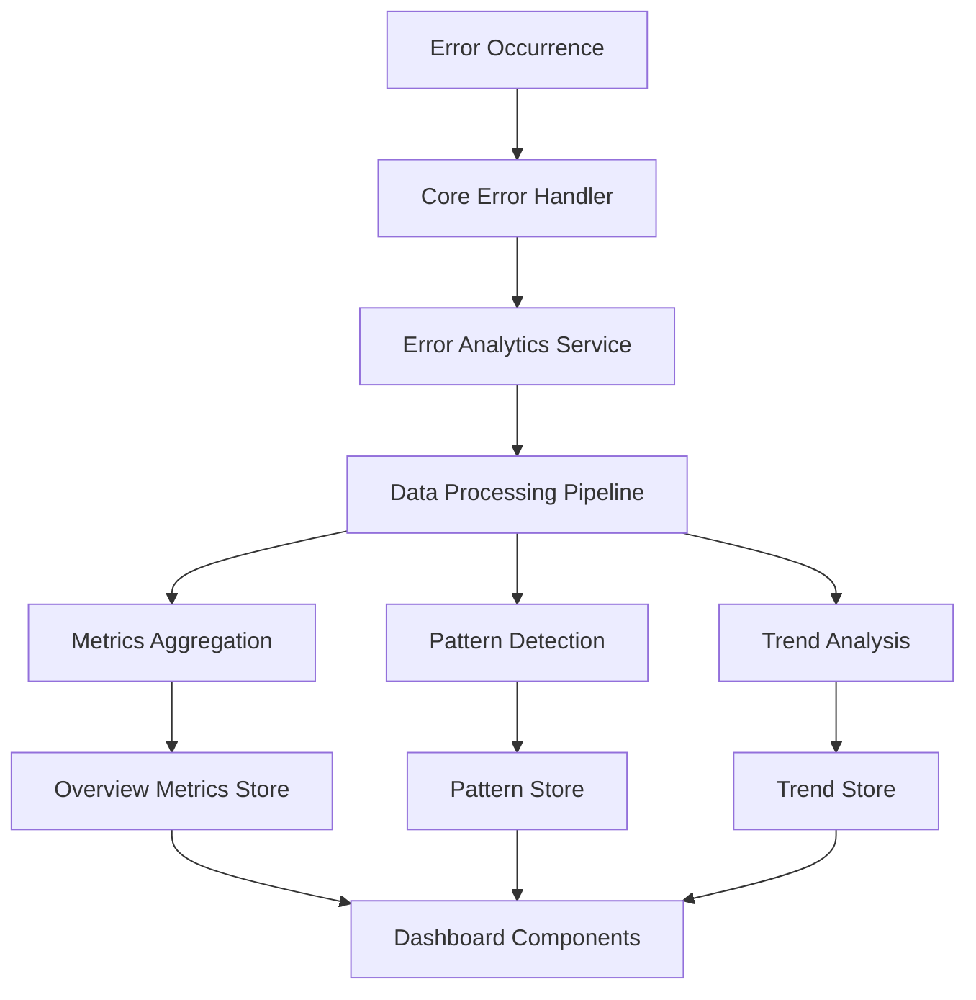
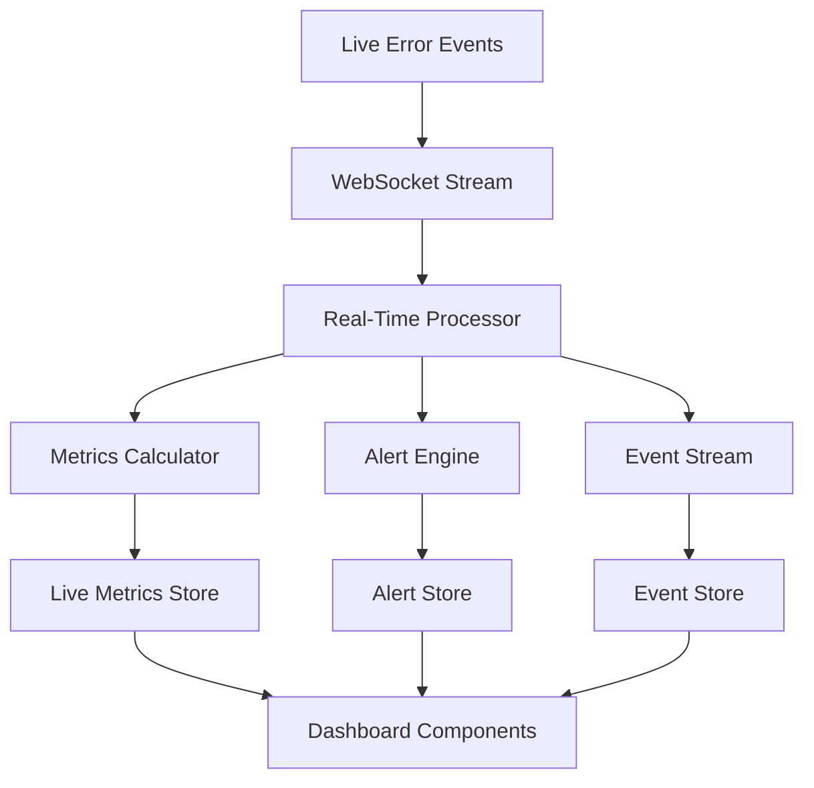

# Error Analytics Dashboard Architecture

## Component Structure and Integration Points

### Dashboard Component Hierarchy

```
ErrorAnalyticsDashboard
├── DashboardHeader
│   ├── TimeRangeSelector
│   ├── FilterPanel
│   │   ├── SeverityFilter
│   │   ├── DomainFilter
│   │   ├── ComponentFilter
│   │   └── UserFilter
│   ├── RefreshControls
│   └── ExportControls
├── DashboardGrid
│   ├── OverviewMetricsSection
│   │   ├── ErrorCountCard
│   │   ├── ErrorRateCard
│   │   ├── SeverityDistributionChart
│   │   ├── DomainDistributionChart
│   │   └── AffectedUsersCard
│   ├── TrendAnalysisSection
│   │   ├── ErrorTrendChart
│   │   ├── GrowthRateIndicator
│   │   ├── SeasonalityAnalysis
│   │   └── AnomalyDetection
│   ├── PatternDetectionSection
│   │   ├── ErrorPatternTable
│   │   ├── PatternDetailsModal
│   │   ├── PatternClustering
│   │   └── PatternRecommendations
│   ├── RecoveryAnalyticsSection
│   │   ├── RecoverySuccessRateChart
│   │   ├── StrategyEffectivenessTable
│   │   ├── RecoveryTimeDistribution
│   │   └── FailureAnalysis
│   └── RealTimeMonitoringSection
│       ├── LiveMetricsPanel
│       ├── ActiveAlertsList
│       ├── ErrorEventStream
│       └── SystemHealthStatus
└── DashboardFooter
    ├── DataSourceInfo
    ├── LastUpdatedTimestamp
    └── PerformanceMetrics
```

### Component Integration Points

#### 1. Data Layer Integration

```typescript
interface DashboardDataProvider {
  // Overview metrics
  getOverviewMetrics(filters: DashboardFilters): Observable<ErrorOverviewMetrics>;

  // Trend analysis
  getTrendData(period: TrendPeriod, filters: DashboardFilters): Observable<ErrorTrendData>;

  // Pattern detection
  getErrorPatterns(filters: DashboardFilters): Observable<ErrorPattern[]>;

  // Recovery analytics
  getRecoveryAnalytics(filters: DashboardFilters): Observable<RecoveryAnalytics>;

  // Real-time monitoring
  getRealTimeMetrics(): Observable<RealTimeMetrics>;
  subscribeToAlerts(): Observable<Alert>;
  subscribeToErrorEvents(): Observable<ErrorEvent>;
}
```

#### 2. State Management Integration

```typescript
interface DashboardState {
  // UI State
  layout: DashboardLayout;
  filters: DashboardFilters;
  selectedSection: string | null;
  loadingStates: Record<string, boolean>;

  // Data State
  overviewMetrics: ErrorOverviewMetrics | null;
  trendData: ErrorTrendData | null;
  patterns: ErrorPattern[];
  recoveryAnalytics: RecoveryAnalytics | null;
  realTimeMetrics: RealTimeMetrics | null;

  // Real-time subscriptions
  alertSubscription: Subscription | null;
  eventSubscription: Subscription | null;

  // Error handling
  errors: Record<string, string>;
}
```

#### 3. Core Error Handler Integration

```typescript
interface ErrorHandlerIntegration {
  // Data source methods
  getErrorStats(): ErrorStats;
  getRecentErrors(limit: number): AppError[];
  getErrorsByType(type: ErrorDomain, limit: number): AppError[];
  getErrorsBySeverity(severity: ErrorSeverity, limit: number): AppError[];

  // Analytics methods
  getAggregatedMetrics(timeRange: TimeRange): Promise<AggregatedMetrics>;
  getErrorPatterns(timeRange: TimeRange): Promise<ErrorPattern[]>;
  getRecoveryStats(timeRange: TimeRange): Promise<RecoveryStats>;

  // Real-time methods
  subscribeToErrors(callback: (error: AppError) => void): () => void;
  subscribeToRecoveryEvents(callback: (event: RecoveryEvent) => void): () => void;
}
```

### Data Flow Architecture

#### Data Ingestion Pipeline



#### Real-Time Data Flow



### Component Communication Patterns

#### 1. Parent-Child Communication

```typescript
// Dashboard container passes data and callbacks to child components
<OverviewMetricsSection
  data={overviewMetrics}
  loading={loadingStates.overview}
  onRefresh={() => refreshOverviewMetrics()}
  filters={filters}
/>
```

#### 2. Sibling Communication via Context

```typescript
const DashboardContext = createContext<DashboardContextValue>({
  filters,
  updateFilters,
  refreshData,
  realTimeEnabled,
  toggleRealTime,
});

// Components access shared state through context
const { filters, updateFilters } = useContext(DashboardContext);
```

#### 3. Event-Driven Updates

```typescript
// Components emit events for cross-cutting concerns
const eventEmitter = new EventEmitter();

eventEmitter.on('filterChanged', (newFilters) => {
  // Update all dependent components
  updateOverviewMetrics(newFilters);
  updateTrendData(newFilters);
  updatePatterns(newFilters);
});
```

### Integration with Existing Core Error Handler

#### Bridge Pattern Implementation

```typescript
class ErrorAnalyticsBridge {
  constructor(private coreErrorHandler: CoreErrorHandler) {}

  // Transform core error data to analytics format
  async getOverviewMetrics(filters: DashboardFilters): Promise<ErrorOverviewMetrics> {
    const coreStats = this.coreErrorHandler.getErrorStats();
    const recentErrors = this.coreErrorHandler.getRecentErrors(1000);

    return {
      totalErrors: coreStats.total,
      errorRate: this.calculateErrorRate(recentErrors, filters.timeRange),
      uniqueErrors: this.calculateUniqueErrors(recentErrors),
      affectedUsers: this.calculateAffectedUsers(recentErrors),
      averageResolutionTime: this.calculateAverageResolutionTime(recentErrors),
      severityDistribution: this.buildSeverityDistribution(coreStats),
      domainDistribution: this.buildDomainDistribution(coreStats),
      timeRange: filters.timeRange,
      lastUpdated: Date.now(),
    };
  }

  // Bridge recovery analytics
  async getRecoveryAnalytics(filters: DashboardFilters): Promise<RecoveryAnalytics> {
    // Implementation bridges core recovery data to analytics format
  }
}
```

#### Hook-Based Integration

```typescript
function useErrorAnalyticsBridge() {
  const coreHandler = useCoreErrorHandler();

  return useMemo(() => ({
    getOverviewMetrics: (filters: DashboardFilters) =>
      transformCoreStatsToOverviewMetrics(coreHandler.getErrorStats(), filters),

    getTrendData: (period: TrendPeriod, filters: DashboardFilters) =>
      transformCoreErrorsToTrendData(coreHandler.getRecentErrors(), period, filters),

    subscribeToRealTimeUpdates: (callback: (metrics: RealTimeMetrics) => void) => {
      return coreHandler.addErrorListener((error) => {
        const metrics = transformErrorToRealTimeMetrics(error);
        callback(metrics);
      });
    },
  }), [coreHandler]);
}
```

### Component Hierarchy and Data Relationships

#### Data Dependency Graph

```
DashboardFilters
├── OverviewMetricsSection
│   ├── ErrorCountCard (depends on totalErrors)
│   ├── ErrorRateCard (depends on errorRate)
│   ├── SeverityDistributionChart (depends on severityDistribution)
│   ├── DomainDistributionChart (depends on domainDistribution)
│   └── AffectedUsersCard (depends on affectedUsers)
├── TrendAnalysisSection
│   ├── ErrorTrendChart (depends on trendData.timeSeries)
│   ├── GrowthRateIndicator (depends on trendData.growthRate)
│   ├── SeasonalityAnalysis (depends on trendData.seasonality)
│   └── AnomalyDetection (depends on trendData.anomalies)
├── PatternDetectionSection
│   ├── ErrorPatternTable (depends on patterns)
│   ├── PatternDetailsModal (depends on selected pattern)
│   ├── PatternClustering (depends on patterns.cluster)
│   └── PatternRecommendations (depends on patterns.recommendations)
├── RecoveryAnalyticsSection
│   ├── RecoverySuccessRateChart (depends on recoveryAnalytics.overallSuccessRate)
│   ├── StrategyEffectivenessTable (depends on recoveryAnalytics.strategyEffectiveness)
│   ├── RecoveryTimeDistribution (depends on recoveryAnalytics.recoveryTimeDistribution)
│   └── FailureAnalysis (depends on recoveryAnalytics.failureAnalysis)
└── RealTimeMonitoringSection
    ├── LiveMetricsPanel (depends on realTimeMetrics)
    ├── ActiveAlertsList (depends on realTimeMetrics.activeAlerts)
    ├── ErrorEventStream (depends on realTimeMetrics.liveStream)
    └── SystemHealthStatus (depends on realTimeMetrics.systemHealth)
```

#### State Management Strategy

```typescript
interface DashboardStateManager {
  // Global state
  filters: DashboardFilters;
  layout: DashboardLayout;

  // Section-specific state
  overview: SectionState<ErrorOverviewMetrics>;
  trends: SectionState<ErrorTrendData>;
  patterns: SectionState<ErrorPattern[]>;
  recovery: SectionState<RecoveryAnalytics>;
  realtime: SectionState<RealTimeMetrics>;

  // Actions
  updateFilters(newFilters: Partial<DashboardFilters>): void;
  refreshSection(sectionId: string): Promise<void>;
  toggleRealTime(): void;
  saveLayout(layout: DashboardLayout): Promise<void>;
}

interface SectionState<T> {
  data: T | null;
  loading: boolean;
  error: string | null;
  lastUpdated: number;
  refresh: () => Promise<void>;
}
```

### Performance Optimization Strategies

#### 1. Data Virtualization

```typescript
// Virtualize large lists and tables
<VirtualizedTable
  items={errorPatterns}
  itemHeight={50}
  containerHeight={400}
  renderItem={(pattern) => <ErrorPatternRow pattern={pattern} />}
/>
```

#### 2. Memoization and Caching

```typescript
const memoizedOverviewMetrics = useMemo(() =>
  calculateOverviewMetrics(recentErrors, filters),
  [recentErrors, filters]
);

const cachedTrendData = useQuery({
  queryKey: ['trendData', period, filters],
  queryFn: () => fetchTrendData(period, filters),
  staleTime: 5 * 60 * 1000, // 5 minutes
});
```

#### 3. Lazy Loading

```typescript
const PatternDetectionSection = lazy(() =>
  import('./sections/PatternDetectionSection')
);

// Load section only when needed
<Suspense fallback={<SectionSkeleton />}>
  {activeSection === 'patterns' && <PatternDetectionSection />}
</Suspense>
```

#### 4. Debounced Updates

```typescript
const debouncedRefresh = useDebounce(() => {
  refreshDashboardData();
}, 500);

useEffect(() => {
  if (filtersChanged) {
    debouncedRefresh();
  }
}, [filters, debouncedRefresh]);
```

This architecture provides a scalable, maintainable foundation for the error analytics dashboard with clear separation of concerns, efficient data flow, and seamless integration with the existing core error handling system.