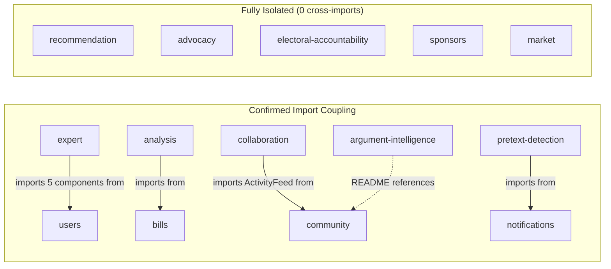

# Client Feature Consolidation Analysis

## Executive Summary

The client has **32 feature directories** producing **~40 routes**. Many features are **thin shells** (1–3 files, single-page) or **logically coupled** to adjacent features. Consolidating these into **8–10 strategic feature domains** would reduce import sprawl, simplify routing, and make the user journey more cohesive.

---

## Current Feature Inventory

| Feature | Files | Routes | Substance | Verdict |
|---|---|---|---|---|
| `bills` | 14+ | 5 | ⬛⬛⬛⬛⬛ Heavy | **Core — keep** |
| `community` | 6 dirs | 1 | ⬛⬛⬛⬛ Rich | **Core — keep** |
| [home](file:///c:/Users/Access%20Granted/Downloads/projects/SimpleTool/client/src/app/shell/AppRouter.tsx#630-631) | 9 pages | 7 | ⬛⬛⬛⬛ Rich | Over-stuffed with non-home pages |
| `users` | 7+ | 3 | ⬛⬛⬛⬛ Rich | **Core — keep** |
| `admin` | 7 pages | 5 | ⬛⬛⬛ Moderate | Absorbs other admin features |
| [search](file:///c:/Users/Access%20Granted/Downloads/projects/SimpleTool/client/src/app/shell/AppRouter.tsx#632-633) | 10+ | 1 | ⬛⬛⬛ Moderate | **Core — keep** |
| `analysis` | 6 dirs | 2 | ⬛⬛⬛ Moderate | Cluster head for analytical stack |
| `argument-intelligence` | 5 dirs, docs | 1 | ⬛⬛⬛ Moderate | Tightly coupled to `bills` |
| `pretext-detection` | 6 dirs, docs | 1 | ⬛⬛⬛ Moderate | Analysis sub-feature |
| `electoral-accountability` | 7+ | 2 | ⬛⬛⬛ Moderate | Closely related to `advocacy` |
| `government-data` | 4 dirs | 1 | ⬛⬛ Light | Could merge with `bills` pipeline |
| `analytics` | 4 dirs | 0 (admin only) | ⬛⬛ Light | Analytics infra, not a user feature |
| `legal` | 12 pages | 7 | ⬛⬛ Light (static pages) | Cluster head for compliance |
| `constitutional-intelligence` | 3 dirs | 0 | ⬛⬛ Light | Analysis sub-feature |
| `notifications` | 4 dirs | 0 | ⬛⬛ Light | Cross-cutting concern |
| `recommendation` | 4 dirs | 0 | ⬛⬛ Light | Cross-cutting concern |
| `auth` | 1 dir (7 pages) | 1 | ⬛⬛ Light | Includes misplaced privacy/security pages |
| `navigation` | 3 dirs | 0 | ⬛ Thin | Infra, not a feature |
| `market` | 2 files | 0 | ⬛ Thin | Single component ([SokoHaki.tsx](file:///c:/Users/Access%20Granted/Downloads/projects/SimpleTool/client/src/features/market/SokoHaki.tsx)) |
| `advocacy` | 4 dirs | 0 | ⬛ Thin | No cross-feature deps |
| `sponsors` | 4 dirs | 0 | ⬛ Thin | Isolated |
| `collaboration` | 3 dirs | 2 | ⬛ Thin | Imports from `community` |
| `expert` | 1 dir (2 pages) | 2 | ⬛ Thin | All UI from `users/ui/verification` |
| `onboarding` | 3 pages | 3 | ⬛ Thin | Absorbs `civic-education` |
| `monitoring` | Model only | 1 (admin) | ⬛ Thin | Admin sub-feature |
| `feature-flags` | 1 dir (2 pages) | 1 (admin) | ⬛ Thin | Admin sub-feature |
| `status` | 1 page | 1 | ⬛ Thin | Admin-adjacent |
| `sitemap` | 1 page | 1 | ⬛ Thin | Static utility page |
| `privacy` | 1 page | 1 | ⬛ Thin | Overlaps `legal`/`auth` |
| `security` | 4 dirs | 1 | ⬛ Thin | Overlaps `legal` |
| `design-system` | 1 page | 0 | ⬛ Thin | Dev-only test page |
| `api` | 4 dirs | 1 | ⬛ Thin | Dev docs page |

---

## Feature Expectation & Future Growth

It is crucial to structure features not just by their current file count, but by their *expected growth vectors*.

| Feature Domain | Growth Expectation | Consolidation Rationale |
|---|---|---|
| **Analysis Stack** | 📈 **High Expansion**. Will likely grow to include new AI models, bias detection, impact vectors, etc. | Grouping currently separate AI features into `analysis/` creates a massive, unified namespace that can support rapid future growth without cluttering the global feature root. |
| **Accountability** | 📈 **High Expansion**. Tracking MPs, funding, campaign promises, and advocacy campaigns is conceptually infinite. | Creating a dedicated `accountability/` domain allows sponsors and advocacy to grow from tiny sub-features into massive tools within their logical home. |
| **Community / Social** | 📈 **High Expansion**. Reputation systems, collaborative workspaces, and expert verification will continue to expand. | Consolidating `expert` and `collaboration` into `community/` establishes a robust "social graph" domain that can securely handle complex inner-dependencies. |
| **Admin** | 📈 **Steady Expansion**. Audit logs, advanced config, user management. | `feature-flags`, `monitoring`, and `status` would otherwise just sit as isolated root folders forever. Grouping them inside `admin/` provides a scalable foundation for back-office expansion. |
| **Legal / Compliance** | 📉 **Minimal Expansion**. Mostly static documents. | `privacy` and `sitemap` will likely always remain 1 or 2 files. Merging them into `legal/` permanently resolves global clutter. |
| **Market** (SokoHaki) | 🚀 **Wildcard Expansion**. Currently tiny (2 files), but conceptually massive (a marketplace). | **Leave isolated.** It is structurally thin today, but its conceptual breadth demands a top-level feature directory so it can expand into its own massive FSD structure when the time comes. |

**Verdict**: The consolidation plan aligns perfectly with growth vectors. It ensures domains with high expansion potential (Analysis, Accountability) are grouped logically to support massive internal FSD architectures, while permanently absorbing features that will naturally remain thin (Status, Privacy, Sitemap).

---

## Cross-Feature Dependency Map



---

## User Journey Map

```mermaid
graph TD
    A[Landing] --> B{Authenticated?}
    B -->|No| C[Auth / Register]
    B -->|Yes| D[Onboarding / Welcome Tour]
    
    C --> D
    D --> E[Home Dashboard]
    
    E --> F[Bills Portal]
    E --> G[Community Hub]
    E --> H[Search]
    E --> I[Analysis Tools]
    
    F --> F1[Bill Detail]
    F1 --> F2[Bill Analysis]
    F1 --> F3[Argument Intelligence]
    F1 --> F4[Pretext Detection]
    F --> F5[Bill Comparison]
    F --> F6[Collections]
    
    G --> G1[Expert Verification]
    G --> G2[Community Discussion]
    G --> G3[Collaboration/Workspaces]
    
    I --> I1[Analysis Tools]
    I --> I2[Electoral Accountability]
    
    E --> J[User Account/Dashboard]
    E --> K[Legal/Compliance Pages]
    E --> L[Admin Panel]
    
    L --> L1[Analytics Dashboard]
    L --> L2[Feature Flags]
    L --> L3[Monitoring]
    L --> L4[Performance]
    L --> L5[System Status]

    style F fill:#2d5016,stroke:#4ade80
    style G fill:#1e3a5f,stroke:#60a5fa
    style I fill:#5b2c6f,stroke:#c084fc
    style L fill:#7f1d1d,stroke:#f87171
```



> [!IMPORTANT]  
> Features that appear on the same journey branch and share data should be **merged**. Features on separate branches but sharing types/services should **share infrastructure, not be merged**.

---

## Consolidation Recommendations

### 🔀 Merge Group 1: **Analysis Stack** (4 → 1)
| Current | Proposed Home |
|---|---|
| `analysis/` | **`analysis/`** (expanded) |
| `argument-intelligence/` | `analysis/argument-intelligence/` |
| `pretext-detection/` | `analysis/pretext-detection/` |
| `constitutional-intelligence/` | `analysis/constitutional/` |

**Why**: These are all analytical lenses on the same underlying bill data. They sit on the same user journey branch (`/bills/:id/analysis`, `/analysis/pretext-detection`, `/bills/:billId/arguments`). `analysis` already imports from `bills`, and `argument-intelligence` is always accessed from a bill detail context.

**User journey benefit**: A unified "Analysis" module lets users flow between conflict-of-interest detection → pretext detection → argument mapping → constitutional review without context-switching between feature boundaries.

---

### 🔀 Merge Group 2: **Community + Collaboration + Expert** (3 → 1)
| Current | Proposed Home |
|---|---|
| `community/` | **`community/`** (expanded) |
| `collaboration/` | `community/collaboration/` |
| `expert/` | `community/expert/` |

**Why**: `collaboration` already imports `ActivityFeed` from `community`. `expert` is a pure shell — all 5 of its component imports come from `users/ui/verification`. Expert *verification* is a community activity (trust-building). Routes are already nested: `/community/expert-verification`.

**User journey benefit**: Workspaces, discussions, expert verification, and activity feeds form one cohesive social layer.

---

### 🔀 Merge Group 3: **Legal + Privacy + Sitemap** (3 → 1)
| Current | Proposed Home |
|---|---|
| `legal/` | **`legal/`** (expanded) |
| `privacy/` *(1 page)* | `legal/pages/privacy-center.tsx` |
| `sitemap/` *(1 page)* | `legal/pages/sitemap.tsx` |

**Why**: `legal` already has [privacy.tsx](file:///c:/Users/Access%20Granted/Downloads/projects/SimpleTool/client/src/features/legal/pages/privacy.tsx), [security.tsx](file:///c:/Users/Access%20Granted/Downloads/projects/SimpleTool/client/src/features/legal/pages/security.tsx), [accessibility-statement.tsx](file:///c:/Users/Access%20Granted/Downloads/projects/SimpleTool/client/src/features/legal/pages/accessibility-statement.tsx), and [cookie-policy.tsx](file:///c:/Users/Access%20Granted/Downloads/projects/SimpleTool/client/src/features/legal/pages/cookie-policy.tsx). The separate `privacy/` feature duplicates this with a [privacy-center.tsx](file:///c:/Users/Access%20Granted/Downloads/projects/SimpleTool/client/src/features/privacy/pages/privacy-center.tsx) page. `sitemap` is a static utility page that fits the same "informational/compliance" category.

**User journey benefit**: Users navigating legal/compliance information stay within one clear section. Reduces confusion about `privacy` existing in 3 different feature folders ([auth/pages/PrivacyPage.tsx](file:///c:/Users/Access%20Granted/Downloads/projects/SimpleTool/client/src/features/auth/pages/PrivacyPage.tsx), [privacy/pages/privacy-center.tsx](file:///c:/Users/Access%20Granted/Downloads/projects/SimpleTool/client/src/features/privacy/pages/privacy-center.tsx), [legal/pages/privacy.tsx](file:///c:/Users/Access%20Granted/Downloads/projects/SimpleTool/client/src/features/legal/pages/privacy.tsx)).

---

### 🔀 Merge Group 4: **Admin Consolidation** (4 → absorbed into `admin/`)
| Current | Proposed Home |
|---|---|
| `admin/` | **`admin/`** (keep) |
| `feature-flags/` | `admin/feature-flags/` |
| `monitoring/` | `admin/monitoring/` |
| `status/` *(1 page)* | `admin/pages/system-status.tsx` |

**Why**: All three thin features are already routed under `/admin/*`. `feature-flags` has 2 pages, `monitoring` has only a model directory, `status` has 1 page. These are admin-only surfaces with no public user touchpoint.

**User journey benefit**: Admins get a single, cohesive dashboard instead of fragmented mini-features.

---

### 🔀 Merge Group 5: **Accountability Stack** (3 → 1)
| Current | Proposed Home |
|---|---|
| `electoral-accountability/` | **`accountability/`** (renamed) |
| `advocacy/` | `accountability/advocacy/` |
| `sponsors/` | `accountability/sponsors/` |

**Why**: All three are isolated (zero cross-feature imports) but semantically form one domain: *political accountability*. Electoral accountability tracks MPs, advocacy pressures them, sponsors reveals who funds them. Users interested in one want all three.

**User journey benefit**: Creates a coherent "accountability" vertical that tells a complete story.

---

### 🔀 Merge Group 6: **Onboarding absorbs civic-education**
| Current | Proposed Home |
|---|---|
| `onboarding/` | **`onboarding/`** (keep) |
| Civic education page | already in [onboarding/pages/civic-education.tsx](file:///c:/Users/Access%20Granted/Downloads/projects/SimpleTool/client/src/features/onboarding/pages/civic-education.tsx) ✅ |

**Status**: Already done — civic education is already housed under onboarding. Just ensure routing makes this clear.

---

### ⬇️ Demote to Infrastructure (not user features)
| Current | Recommended Location |
|---|---|
| `navigation/` | `infrastructure/navigation/` (already partially there) |
| `design-system/` *(1 dev test page)* | `lib/design-system/` (already exists there) |
| `analytics/` *(tracking hooks/services)* | `infrastructure/analytics/` |
| `notifications/` | `infrastructure/notifications/` |
| `recommendation/` | `infrastructure/recommendation/` |
| `api/` *(dev docs page)* | `lib/api/` or `infrastructure/api/` |

**Why**: These are cross-cutting concerns consumed by multiple features. They don't own user-facing pages (or own exactly 1 developer-facing page). Living under `features/` inflates the feature count without representing user-visible product surface.

---

## Before / After Summary

| Metric | Before | After |
|---|---|---|
| Feature directories | 32 | ~12 |
| Features with 1 page or less | 11 | 0 |
| Isolated features (0 cross-deps) | 5 | 0 (all absorbed) |
| Duplicate privacy implementations | 3 | 1 |
| Admin sub-features scattered | 4 | 1 unified |

---

## Proposed Final Feature Map (12 domains)

```
features/
├── admin/              # Admin panel + flags + monitoring + status
├── analysis/           # All analytical tools (argument, pretext, constitutional, conflict)
├── accountability/     # Electoral accountability + advocacy + sponsors
├── auth/               # Authentication only (remove misplaced privacy/security pages)
├── bills/              # Bill lifecycle (browse, detail, compare, collections)
├── community/          # Hub + discussions + workspaces + expert verification
├── government-data/    # Government data pipeline
├── home/               # Landing + about + blog + careers + press + support + contact
├── legal/              # Terms, privacy, cookies, accessibility, security, sitemap
├── market/             # SokoHaki marketplace
├── onboarding/         # Welcome tour + civic education
├── search/             # Universal search
└── users/              # User profiles, accounts, settings, verification UI
```

> [!NOTE]
> [home](file:///c:/Users/Access%20Granted/Downloads/projects/SimpleTool/client/src/app/shell/AppRouter.tsx#630-631) remains a large catch-all for public marketing/info pages. If it grows further, consider splitting into `marketing/` (about, careers, press, blog) and [home/](file:///c:/Users/Access%20Granted/Downloads/projects/SimpleTool/client/src/app/shell/AppRouter.tsx#630-631) (landing, support, contact, dashboard).

---

## Priority Ordering

| Priority | Merge | Effort | Impact |
|---|---|---|---|
| **P0** | Admin consolidation | Low (move 3 thin dirs) | Immediate cleanup |
| **P0** | Legal + privacy + sitemap | Low (move 2 files) | Removes 3-way privacy duplication |
| **P1** | Community + collaboration + expert | Medium (re-export paths) | Cohesive social layer |
| **P1** | Demote infra features | Medium (move dirs) | Cleaner feature/infra boundary |
| **P2** | Analysis stack | Medium (4 dirs, shared types) | Unified analytical UX |
| **P2** | Accountability stack | Low (3 isolated dirs) | Product coherence |
