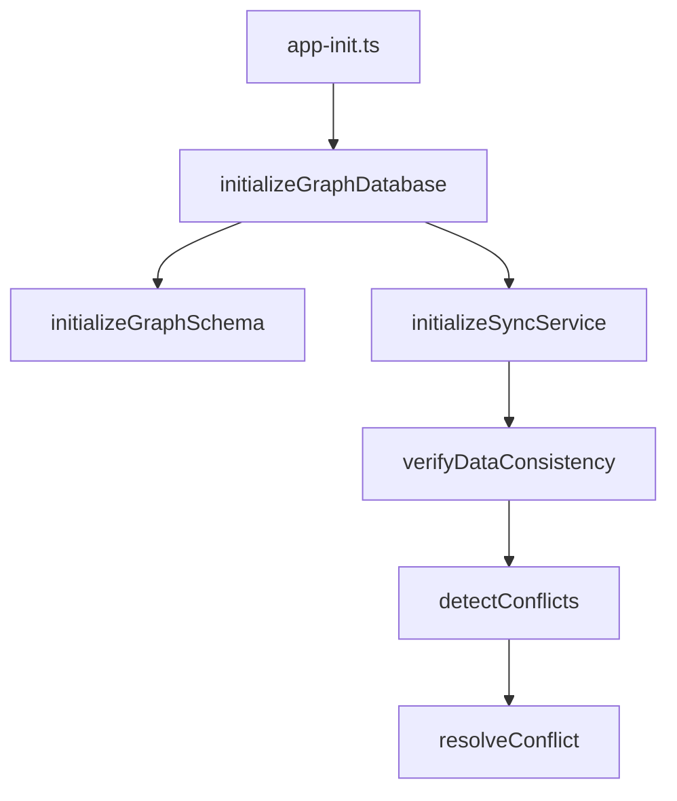
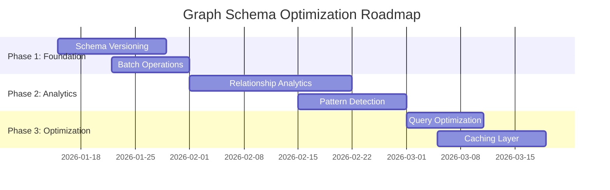

# Graph Schema Analysis and Integration Plan

## Executive Summary

This document provides a comprehensive analysis of the current graph schema and integration architecture, identifying underutilized strategic functionality, nuanced integration points, and actionable recommendations for optimization.

## 1. Underutilized Strategic Functionality

### 1.1 Schema Layer

#### High-Value Features Not Fully Leveraged

1. **Advanced Schema Verification**
   - The `verifyGraphSchema()` function in `shared/database/graph/core/schema.ts` provides comprehensive schema validation but is only used during initialization
   - **Recommendation**: Integrate schema verification into:
     - Periodic health checks
     - Pre-deployment validation
     - CI/CD pipeline
     - Monitoring dashboard

2. **Database Statistics Collection**
   - The `getDatabaseStats()` function collects detailed node/relationship statistics but is not used for:
     - Performance monitoring
     - Capacity planning
     - Anomaly detection
     - Query optimization
   - **Recommendation**: Create a monitoring service that:
     - Tracks statistics over time
     - Detects abnormal growth patterns
     - Provides predictive capacity alerts

3. **Schema Clearing Capability**
   - The `clearGraphSchema()` function exists but is not integrated into:
     - Development workflows
     - Testing environments
     - Schema migration processes
   - **Recommendation**: Create safe, controlled schema reset procedures for development/testing

#### Missing Strategic Capabilities

1. **Schema Versioning**
   - No mechanism to track schema versions or migrations
   - **Recommendation**: Implement schema versioning with migration scripts

2. **Constraint/Index Optimization**
   - No analysis of constraint/index usage patterns
   - **Recommendation**: Add performance monitoring for schema elements

### 1.2 Graph Layer

#### Underutilized Relationship Types

1. **Advanced Relationships**
   - Complex relationship types in `advanced-relationships.ts` are defined but not fully integrated:
     - `createPolicyInfluenceRelationship()` - Not used in policy analysis
     - `createMediaCoverageRelationship()` - Not connected to media monitoring
     - `createExpertOpinionRelationship()` - Not integrated with expert systems
   - **Recommendation**: Build higher-level services that leverage these relationships

2. **Conflict Resolution System**
   - Comprehensive conflict detection/resolution exists but is not:
     - Automatically triggered
     - Integrated with monitoring
     - Used for data quality reporting
   - **Recommendation**: Create automated conflict resolution workflows

#### Missing Graph Capabilities

1. **Relationship Analytics**
   - No analysis of relationship patterns and trends
   - **Recommendation**: Build relationship analytics dashboard

2. **Graph Visualization**
   - No built-in visualization capabilities
   - **Recommendation**: Integrate with graph visualization tools

## 2. Nuanced Integration Points

### 2.1 Schema-Graph Integration

#### Critical Integration Points

1. **Schema Initialization Flow**
   - `initializeGraphSchema()` → `createConstraints()` → `createIndexes()`
   - **Complexity**: Must handle partial failures gracefully
   - **Recommendation**: Add transactional integrity to schema operations

2. **Data Synchronization Pipeline**
   - PostgreSQL → Sync Service → Neo4j
   - **Complexity**: Conflict detection, retry logic, consistency verification
   - **Recommendation**: Enhance monitoring of sync pipeline health

3. **Entity Relationship Management**
   - Node creation → Relationship establishment → Data validation
   - **Complexity**: Maintaining referential integrity across databases
   - **Recommendation**: Add cross-database validation checks

### 2.2 Cross-Module Dependencies

#### Key Dependency Chains

#### Critical Path Analysis

1. **Startup Sequence**
   - Schema initialization must complete before sync service starts
   - **Risk**: Race conditions during startup
   - **Recommendation**: Add explicit dependency management

2. **Conflict Resolution Flow**
   - Detection → Analysis → Resolution → Re-sync
   - **Risk**: Incomplete resolution leading to data corruption
   - **Recommendation**: Add validation gates between steps

## 3. Potential Improvements and Optimizations

### 3.1 Strategic Recommendations

#### High-Impact Improvements

1. **Schema Evolution Framework**
   - Implement versioned schema migrations
   - Add schema change impact analysis
   - Create rollback procedures

2. **Graph Analytics Platform**
   - Build comprehensive relationship analytics
   - Implement pattern detection algorithms
   - Create anomaly detection system

3. **Automated Data Quality**
   - Continuous schema validation
   - Automated conflict resolution
   - Data consistency monitoring

### 3.2 Technical Optimizations

#### Performance Improvements

1. **Batch Operations**
   - Current: Individual node/relationship operations
   - Recommendation: Implement batch operations for bulk data loading

2. **Query Optimization**
   - Current: Basic Cypher queries
   - Recommendation: Add query plan analysis and optimization

3. **Caching Layer**
   - Current: Direct database access
   - Recommendation: Implement intelligent caching for frequent queries

#### Code Quality Improvements

1. **Error Handling Standardization**
   - Current: Inconsistent error handling patterns
   - Recommendation: Standardize error codes and handling

2. **Logging Enhancement**
   - Current: Basic logging
   - Recommendation: Structured logging with correlation IDs

3. **Testing Coverage**
   - Current: Limited test coverage
   - Recommendation: Comprehensive integration testing

### 3.3 Implementation Roadmap

## 4. Conclusion

The current graph schema and integration architecture provides a solid foundation but has significant untapped potential. By implementing the recommended improvements, the system can evolve into a comprehensive graph analytics platform with enhanced reliability, performance, and strategic value.

### Key Takeaways

1. **Leverage Existing Capabilities**: Many high-value features exist but are underutilized
2. **Enhance Integration**: Strengthen the connections between schema, graph, and application layers
3. **Build Analytics**: Transform raw graph data into actionable insights
4. **Optimize Performance**: Implement technical improvements for scalability
5. **Ensure Quality**: Strengthen data integrity and error handling

### Next Steps

1. Prioritize schema versioning and migration framework
2. Implement batch operations for performance
3. Build relationship analytics dashboard
4. Enhance monitoring and observability
5. Develop comprehensive testing strategy

This plan provides a clear path to unlock the full strategic potential of the graph database architecture while maintaining stability and reliability.
