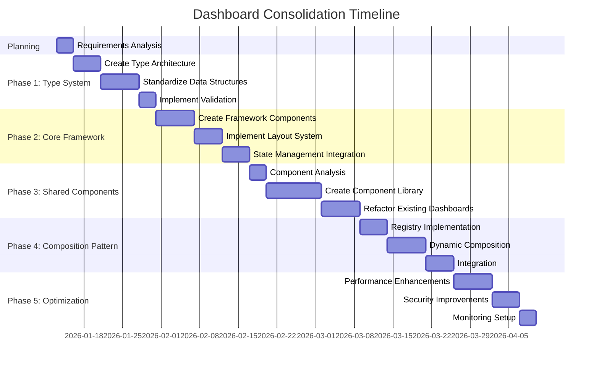

# Dashboard Consolidation Plan

## Overview
This plan outlines a comprehensive approach to consolidate dashboard implementations across the SimpleTool project. The goal is to create a unified, maintainable, and scalable dashboard system that addresses the current fragmentation and inconsistencies identified in the error analysis.

## Phase 1: Unify Type System

### Objective
Establish a comprehensive, consistent, and coherent type system for all dashboard components across the codebase.

### Technical Specification

#### 1. Create Unified Dashboard Type Architecture
- **Location**: `shared/types/dashboard/`
- **Files to Create**:
  - `dashboard-base.ts` - Core dashboard types and interfaces
  - `dashboard-metrics.ts` - Standardized metrics and statistics types
  - `dashboard-components.ts` - Type definitions for dashboard UI components
  - `dashboard-events.ts` - Event and interaction types
  - `index.ts` - Centralized exports

#### 2. Standardize Dashboard Data Structures
```typescript
// Example: shared/types/dashboard/dashboard-base.ts
interface DashboardBaseConfig {
  id: string;
  title: string;
  description?: string;
  layout: 'grid' | 'list' | 'custom';
  refreshInterval?: number;
  isMobileOptimized: boolean;
}

interface DashboardWidget<T = any> {
  id: string;
  type: string;
  title: string;
  data: T;
  position: { row: number; col: number; size: { width: number; height: number } };
  isResizable: boolean;
  isDraggable: boolean;
}

interface DashboardState {
  widgets: DashboardWidget[];
  filters: Record<string, any>;
  currentView: string;
  lastUpdated: Date;
}
```

#### 3. Implement Type Safety and Validation
- Create validation schemas for all dashboard types using the existing validation system
- Implement runtime type guards for dashboard data
- Add comprehensive JSDoc documentation for all types

#### 4. Migration Strategy
- Identify all existing dashboard-related types in:
  - `client/src/features/bills/ui/bills-dashboard.tsx`
  - `client/src/features/search/ui/interface/SearchAnalyticsDashboard.tsx`
  - `client/src/features/security/ui/dashboard/SecurityDashboard.tsx`
- Create migration scripts to update references to use the new unified types
- Ensure backward compatibility during transition

### Expected Outcomes
- Consistent type system across all dashboard implementations
- Improved type safety and developer experience
- Centralized location for all dashboard-related types
- Comprehensive documentation and validation

### Potential Challenges
- Ensuring backward compatibility with existing dashboard implementations
- Coordinating type changes across multiple feature teams
- Performance impact of additional type validation
- Maintaining consistency as new dashboard types are added

## Phase 2: Enhance Core Framework

### Objective
Develop a robust core framework for dashboard components with responsive layouts and consistent state management.

### Technical Specification

#### 1. Create Core Dashboard Framework
- **Location**: `client/src/lib/ui/dashboard/`
- **Files to Create/Update**:
  - `DashboardCore.tsx` - Core dashboard component with layout management
  - `DashboardProvider.tsx` - State management context
  - `useDashboard.ts` - Custom hook for dashboard functionality
  - `responsive-layout.ts` - Responsive layout utilities

#### 2. Implement Responsive Layout System
```typescript
// Example: responsive-layout.ts
interface ResponsiveLayoutConfig {
  breakpoints: {
    sm: number;
    md: number;
    lg: number;
    xl: number;
  };
  gridConfig: {
    columns: { sm: number; md: number; lg: number; xl: number };
    rowHeight: number;
    margin: { x: number; y: number };
  };
}

function calculateLayout(
  widgets: DashboardWidget[],
  containerWidth: number,
  config: ResponsiveLayoutConfig
): DashboardWidget[] {
  // Implementation for responsive widget positioning
}
```

#### 3. State Management Integration
- Implement centralized state management using Zustand or Redux
- Create dashboard-specific state slices for:
  - Widget management
  - Filter state
  - User preferences
  - Real-time data updates

#### 4. Performance Optimization
- Implement virtualization for large datasets
- Add memoization for expensive computations
- Create loading states and skeleton screens
- Implement data fetching optimization with React Query

### Expected Outcomes
- Consistent responsive behavior across all dashboards
- Centralized state management reducing prop drilling
- Improved performance for data-heavy dashboards
- Reusable layout components and utilities

### Potential Challenges
- Integrating with existing state management solutions
- Ensuring consistent behavior across different dashboard types
- Performance optimization without sacrificing functionality
- Maintaining backward compatibility with existing layouts

## Phase 3: Extract Shared Components

### Objective
Identify and extract common dashboard components to reduce duplication and improve consistency.

### Technical Specification

#### 1. Component Analysis and Extraction
- **Shared Components to Extract**:
  - Dashboard headers and toolbars
  - Filter panels and search controls
  - Data visualization components (charts, graphs)
  - Widget containers and cards
  - Loading and error states
  - Export functionality

#### 2. Create Shared Component Library
- **Location**: `client/src/lib/ui/dashboard/components/`
- **Components to Create**:
  - `DashboardHeader.tsx`
  - `DashboardToolbar.tsx`
  - `FilterPanel.tsx` (enhanced from bills dashboard)
  - `SearchControl.tsx`
  - `DataVisualization.tsx`
  - `WidgetContainer.tsx`
  - `LoadingState.tsx`
  - `ErrorBoundary.tsx`
  - `ExportMenu.tsx`

#### 3. Standardize Component APIs
```typescript
// Example: Standardized Filter Panel Interface
interface FilterPanelProps {
  filters: Record<string, any>;
  availableFilters: FilterDefinition[];
  onFilterChange: (filterId: string, value: any) => void;
  onReset: () => void;
  resultCount?: number;
  totalCount?: number;
  isMobile?: boolean;
}

interface FilterDefinition {
  id: string;
  label: string;
  type: 'select' | 'range' | 'toggle' | 'search';
  options?: { value: string; label: string }[];
  min?: number;
  max?: number;
}
```

#### 4. Refactor Feature-Specific Dashboards
- Update `bills-dashboard.tsx` to use shared components
- Update `SearchAnalyticsDashboard.tsx` to use shared components
- Update `SecurityDashboard.tsx` to use shared components
- Create adapter components for feature-specific requirements

### Expected Outcomes
- Significant reduction in code duplication
- Consistent look and feel across all dashboards
- Easier maintenance and updates
- Faster development of new dashboard features

### Potential Challenges
- Balancing standardization with feature-specific requirements
- Ensuring all dashboards maintain their unique functionality
- Coordinating changes across multiple teams
- Performance impact of additional abstraction layers

## Phase 4: Implement Dashboard Composition Pattern

### Objective
Create a flexible dashboard composition system with a registry pattern for dynamic dashboard assembly.

### Technical Specification

#### 1. Dashboard Registry System
- **Location**: `client/src/lib/ui/dashboard/registry/`
- **Files to Create**:
  - `DashboardRegistry.ts` - Core registry implementation
  - `WidgetRegistry.ts` - Widget registration and management
  - `DashboardComposer.tsx` - Dynamic dashboard composition component

#### 2. Registry Implementation
```typescript
// Example: DashboardRegistry.ts
class DashboardRegistry {
  private registries: Map<string, DashboardDefinition>;
  private widgetTypes: Map<string, WidgetFactory>;

  constructor() {
    this.registries = new Map();
    this.widgetTypes = new Map();
  }

  registerDashboard(id: string, definition: DashboardDefinition): void {
    this.registries.set(id, definition);
  }

  registerWidgetType(type: string, factory: WidgetFactory): void {
    this.widgetTypes.set(type, factory);
  }

  getDashboard(id: string): DashboardDefinition | undefined {
    return this.registries.get(id);
  }

  createWidget(type: string, config: any): React.ReactNode {
    const factory = this.widgetTypes.get(type);
    if (!factory) throw new Error(`Widget type ${type} not registered`);
    return factory(config);
  }
}

interface DashboardDefinition {
  id: string;
  title: string;
  description: string;
  defaultLayout: DashboardLayout;
  requiredPermissions?: string[];
  dataDependencies?: DataDependency[];
}

type WidgetFactory = (config: any) => React.ReactNode;
```

#### 3. Dynamic Dashboard Composition
- Create a composer component that can assemble dashboards from registry definitions
- Implement layout algorithms for automatic widget positioning
- Add support for user customization and personalization

#### 4. Integration with Existing Dashboards
- Register existing dashboards in the new system
- Create migration path for feature-specific dashboards
- Implement fallback mechanisms for unregistered components

### Expected Outcomes
- Flexible dashboard creation without code changes
- Dynamic loading and composition of dashboard elements
- Support for user customization and personalization
- Easier integration of third-party widgets and components

### Potential Challenges
- Performance overhead of dynamic composition
- Type safety in dynamically composed dashboards
- Backward compatibility with existing dashboard implementations
- Managing complex dependencies between widgets

## Phase 5: Performance Optimizations and Security Enhancements

### Objective
Implement performance optimizations and security enhancements across all dashboard implementations.

### Technical Specification

#### 1. Performance Optimization Strategy
- **Optimizations to Implement**:
  - Virtualization for large datasets (already partially implemented in bills dashboard)
  - Memoization for expensive computations
  - Debouncing for user input handlers
  - Efficient data fetching with React Query
  - Code splitting for dashboard components
  - Web Workers for heavy computations

#### 2. Security Enhancements
- **Security Measures to Implement**:
  - Input validation for all dashboard interactions
  - Secure data handling for sensitive information
  - Role-based access control for dashboard features
  - Audit logging for dashboard actions
  - Protection against common web vulnerabilities (XSS, CSRF)

#### 3. Monitoring and Analytics
- Implement comprehensive performance monitoring
- Add user behavior tracking (with privacy considerations)
- Create dashboard-specific analytics
- Set up alerting for performance degradation

#### 4. Implementation Plan
```typescript
// Example: Performance Monitoring Hook
function useDashboardPerformance(dashboardId: string) {
  const [metrics, setMetrics] = useState<DashboardPerformanceMetrics>();

  useEffect(() => {
    const startTime = performance.now();
    
    const trackMetric = (metric: string, value: number) => {
      // Send to analytics service
      analytics.track(`dashboard.${dashboardId}.${metric}`, value);
    };

    // Track initial load time
    const loadTime = performance.now() - startTime;
    trackMetric('load_time', loadTime);

    // Set up interaction tracking
    const handleInteraction = (event: Event) => {
      const target = event.target as HTMLElement;
      const interactionTime = performance.now();
      trackMetric('interaction', interactionTime);
    };

    document.addEventListener('click', handleInteraction);
    
    return () => {
      document.removeEventListener('click', handleInteraction);
    };
  }, [dashboardId]);

  return metrics;
}
```

### Expected Outcomes
- Improved performance across all dashboard implementations
- Enhanced security posture for dashboard components
- Better visibility into dashboard usage and performance
- Proactive identification and resolution of issues

### Potential Challenges
- Balancing performance optimizations with functionality
- Ensuring security measures don't impact user experience
- Coordinating monitoring across different dashboard types
- Maintaining performance as dashboards grow in complexity

## Implementation Timeline and Dependencies

### Phase Dependencies


### Cross-Phase Considerations
- **Type System Integration**: All phases depend on the unified type system from Phase 1
- **Framework Adoption**: Phases 3-5 require the core framework from Phase 2
- **Component Availability**: Phase 4 composition pattern depends on shared components from Phase 3
- **Performance Baseline**: Phase 5 optimizations should be measured against baselines established in earlier phases

## Success Metrics

### Quantitative Metrics
- **Code Reduction**: 40% reduction in duplicate dashboard code
- **Type Consistency**: 100% of dashboard components using unified type system
- **Performance Improvement**: 30% improvement in dashboard load times
- **Component Reuse**: 70% of dashboard UI elements using shared components
- **Error Reduction**: 50% reduction in dashboard-related runtime errors

### Qualitative Metrics
- **Developer Satisfaction**: Improved developer experience scores for dashboard work
- **Consistency**: Uniform look and feel across all dashboard implementations
- **Maintainability**: Easier to maintain and extend dashboard functionality
- **Flexibility**: Ability to create new dashboards with minimal custom code

## Risk Assessment and Mitigation

### High-Risk Areas
1. **Type System Migration**: Risk of breaking existing functionality during type migration
   - *Mitigation*: Comprehensive testing, gradual rollout, backward compatibility layers

2. **Performance Impact**: New abstraction layers could impact performance
   - *Mitigation*: Performance testing at each phase, optimization before production

3. **Team Coordination**: Multiple teams working on different dashboard features
   - *Mitigation*: Clear communication channels, regular sync meetings, shared documentation

4. **Backward Compatibility**: Ensuring existing dashboards continue to work
   - *Mitigation*: Deprecation warnings, migration guides, compatibility layers

### Monitoring and Contingency
- Establish performance baselines before changes
- Implement comprehensive test coverage
- Create rollback plans for critical components
- Monitor error rates and user feedback post-deployment

## Conclusion

This comprehensive plan addresses the dashboard consolidation requirements by systematically improving the type system, core framework, component architecture, composition pattern, and overall performance. By following this phased approach, we can transform the current fragmented dashboard implementations into a cohesive, maintainable, and scalable system that meets the needs of both developers and end-users.