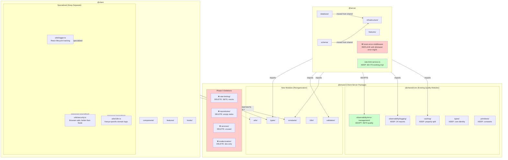

# Design: Shared Directory Reorganization

## Overview

**Problem**: The `shared/` directory contains a mix of high-quality production modules, abandoned templates, and server-only infrastructure. The client maintains specialized utilities while lacking access to truly shareable code. Server uses basic error formatting instead of comprehensive error management available in `@shared/core`.

**Solution**: 
1. **Phase 0**: Delete low-quality modules (rate-limiting, repositories, services, modernization)
2. **Core Reorganization**: Reorganize `shared/` to contain client-server shared code (types, validation, constants) while preserving high-quality `@shared/core` modules
3. **Infrastructure Relocation**: Move server-only code (database, schema) to `server/infrastructure/`
4. **Error-Management Adoption**: Migrate server from basic boom-error-middleware to comprehensive `@shared/core/observability/error-management`
5. **Selective Client Integration**: Share only browser-compatible modules; preserve specialized client utilities

**Goals**:
- Remove 4 abandoned/low-quality modules (zero risk, immediate cleanup)
- Adopt superior error-management system (46/70 vs 36/70 quality)
- Single source of truth for types, validation, and constants
- Type safety across client-server boundary
- Preserve specialized client utilities (React tracking, browser security, Kenya i18n)
- Clear separation between shared, server-only, and client-specialized concerns

## Architecture



## Component Specifications

### Shared Types Module

**Location**: `shared/src/types/`

**Purpose**: Centralized TypeScript type definitions for domain models and API contracts

**Exports**:
```typescript
// shared/src/types/bill.types.ts
export type BillId = string & { readonly __brand: 'BillId' };
export type BillStatus = 'draft' | 'proposed' | 'under_review' | 'passed' | 'rejected';
export interface Bill {
  id: BillId;
  title: string;
  content: string;
  status: BillStatus;
  created_at: Date;
  updated_at: Date;
}

// shared/src/types/user.types.ts
export type UserId = string & { readonly __brand: 'UserId' };
export type UserRole = 'citizen' | 'representative' | 'admin';
export interface User {
  id: UserId;
  email: string;
  role: UserRole;
}

// shared/src/types/argument.types.ts
export interface Argument {
  id: string;
  claim: string;
  evidence: string[];
  position: 'support' | 'oppose';
}

// shared/src/types/api.types.ts
export interface ApiResponse<T> {
  data: T;
  error?: string;
  meta?: Record<string, unknown>;
}

// shared/src/types/index.ts
export * from './bill.types';
export * from './user.types';
export * from './argument.types';
export * from './api.types';
```

**Usage**:
```typescript
// server/features/bills/bills.ts
import { Bill, BillId, BillStatus } from '@shared/types';

// client/src/features/bills/BillList.tsx
import { Bill, ApiResponse } from '@shared/types';
```

### Shared Validation Module

**Location**: `shared/src/validation/`

**Purpose**: Enterprise validation framework (88/100) that integrates with domain-specific Zod schemas (72/100)

**Architecture**: Framework + Domain Schemas (complementary, not competing)

**Framework Exports** (`@shared/core/validation`):
```typescript
// 880-line enterprise validation service
export class ValidationService {
  private schemaRegistry: Map<string, ZodSchema>;
  private cache: Map<string, ValidationResult>;
  
  // Schema registration and versioning
  registerSchema(name: string, schema: ZodSchema, version?: string): void;
  getSchema(name: string): ZodSchema | undefined;
  
  // Preprocessing pipeline
  preprocess(data: unknown, options?: PreprocessOptions): unknown;
  
  // Validation with caching
  validate<T>(schemaName: string, data: unknown): Promise<ValidationResult<T>>;
  validateBatch<T>(schemaName: string, items: unknown[]): Promise<BatchResult<T>>;
  
  // Metrics collection
  getMetrics(): ValidationMetrics;
  clearMetrics(): void;
}

export interface ValidationResult<T> {
  valid: boolean;
  data?: T;
  errors?: FieldError[];
  metadata: {
    schemaName: string;
    duration: number;
    cached: boolean;
  };
}

export interface PreprocessOptions {
  trim?: boolean;
  coerce?: boolean;
  normalize?: boolean;
}

export interface ValidationMetrics {
  totalValidations: number;
  cacheHitRate: number;
  averageDuration: number;
  errorsByField: Map<string, number>;
}
```

**Domain Schema Exports** (`shared/src/validation/`):
```typescript
// shared/src/validation/comment.validation.ts
import { z } from 'zod';

export const COMMENT_RULES = {
  MIN_LENGTH: 10,
  MAX_LENGTH: 5000,
  MIN_WORDS: 2,
} as const;

export const CommentSchema = z.object({
  content: z.string()
    .min(COMMENT_RULES.MIN_LENGTH, `Comment must be at least ${COMMENT_RULES.MIN_LENGTH} characters`)
    .max(COMMENT_RULES.MAX_LENGTH, `Comment cannot exceed ${COMMENT_RULES.MAX_LENGTH} characters`)
    .refine(text => text.split(/\s+/).length >= COMMENT_RULES.MIN_WORDS, {
      message: `Comment must contain at least ${COMMENT_RULES.MIN_WORDS} words`
    }),
  author_id: z.string().uuid(),
  parent_id: z.string().uuid().optional(),
});

export type Comment = z.infer<typeof CommentSchema>;

// shared/src/validation/bill.validation.ts
export const BILL_RULES = {
  TITLE_MIN: 10,
  TITLE_MAX: 200,
  CONTENT_MIN: 100,
  CONTENT_MAX: 50000,
} as const;

export const BillSchema = z.object({
  title: z.string().min(BILL_RULES.TITLE_MIN).max(BILL_RULES.TITLE_MAX),
  content: z.string().min(BILL_RULES.CONTENT_MIN).max(BILL_RULES.CONTENT_MAX),
  sponsor_id: z.string().uuid(),
  status: z.enum(['draft', 'proposed', 'under_review', 'passed', 'rejected']),
});

export type Bill = z.infer<typeof BillSchema>;

// shared/src/validation/index.ts
export * from './comment.validation';
export * from './bill.validation';
export * from './user.validation';
```

**Integration Usage**:
```typescript
// server/features/bills/bills.service.ts
import { ValidationService } from '@shared/core/validation';
import { BillSchema } from '@shared/validation';

const validationService = new ValidationService();

// Register domain schema in framework
validationService.registerSchema('bill', BillSchema, 'v1');

// Validate with caching and metrics
async function createBill(data: unknown) {
  const result = await validationService.validate('bill', data);
  
  if (!result.valid) {
    throw new ValidationError(result.errors);
  }
  
  return billRepository.create(result.data);
}

// client/src/features/bills/BillForm.tsx
import { BillSchema, BILL_RULES } from '@shared/validation';

function BillForm() {
  const handleSubmit = async (data: unknown) => {
    const result = BillSchema.safeParse(data);
    
    if (!result.success) {
      setErrors(result.error.flatten().fieldErrors);
      return;
    }
    
    await api.createBill(result.data);
  };
}
```

**Quality Scores**: Framework 88/100, Domain Schemas 72/100 (complementary)

### Error-Management System (NEW - ADOPT FROM @shared/core)

**Location**: `@shared/core/observability/error-management/`

**Purpose**: Comprehensive error lifecycle management (46/70) replacing basic boom-error-middleware (36/70)

**Exports**:
```typescript
// Base error class with metadata and cause chains
export class BaseError extends Error {
  constructor(
    message: string,
    public readonly domain: ErrorDomain,
    public readonly severity: ErrorSeverity,
    public readonly context?: ErrorContext,
    public readonly cause?: Error
  ) {
    super(message);
    this.name = this.constructor.name;
  }
}

export enum ErrorDomain {
  Validation = 'VALIDATION',
  Authentication = 'AUTHENTICATION',
  Authorization = 'AUTHORIZATION',
  Database = 'DATABASE',
  External = 'EXTERNAL',
  System = 'SYSTEM',
  Business = 'BUSINESS'
}

export enum ErrorSeverity {
  Critical = 'CRITICAL',
  High = 'HIGH',
  Medium = 'MEDIUM',
  Low = 'LOW',
  Info = 'INFO'
}

export interface ErrorContext {
  correlationId?: string;
  userId?: string;
  sessionId?: string;
  operation?: string;
  metadata?: Record<string, unknown>;
}

// Specific error types
export class ValidationError extends BaseError {
  constructor(
    message: string,
    public readonly fields: FieldError[],
    context?: ErrorContext
  ) {
    super(message, ErrorDomain.Validation, ErrorSeverity.Medium, context);
  }
}

export class AuthenticationError extends BaseError {
  constructor(message: string, context?: ErrorContext) {
    super(message, ErrorDomain.Authentication, ErrorSeverity.High, context);
  }
}

export class AuthorizationError extends BaseError {
  constructor(message: string, context?: ErrorContext) {
    super(message, ErrorDomain.Authorization, ErrorSeverity.High, context);
  }
}

// Error handler interface for recovery patterns
export interface ErrorHandler {
  canHandle(error: Error): boolean;
  handle(error: Error): Promise<ErrorHandlingResult>;
}

export interface ErrorHandlingResult {
  recovered: boolean;
  action: 'retry' | 'fallback' | 'propagate' | 'ignore';
  newError?: Error;
}

// Error reporter interface for multiple integrations
export interface ErrorReporter {
  report(error: BaseError, context?: ErrorContext): Promise<void>;
}

// Circuit breaker pattern for cascading failures
export class CircuitBreaker {
  constructor(
    private threshold: number,
    private timeout: number,
    private resetTimeout: number
  ) {}
  
  async execute<T>(fn: () => Promise<T>): Promise<T>;
  isOpen(): boolean;
  reset(): void;
}

// Retry pattern with exponential backoff
export interface RetryOptions {
  maxAttempts: number;
  initialDelay: number;
  maxDelay: number;
  backoffMultiplier: number;
}

export async function withRetry<T>(
  fn: () => Promise<T>,
  options: RetryOptions
): Promise<T>;

// Error analytics and metrics
export interface ErrorMetrics {
  totalErrors: number;
  errorsByDomain: Map<ErrorDomain, number>;
  errorsBySeverity: Map<ErrorSeverity, number>;
  errorRate: number;
  topErrors: Array<{ message: string; count: number }>;
}

export interface ErrorAggregation {
  timeWindow: number;
  errors: BaseError[];
  trends: Map<string, number[]>;
}
```

**Migration from boom-error-middleware**:
```typescript
// Before (server/middleware/boom-error-middleware.ts)
app.use((err, req, res, next) => {
  if (Boom.isBoom(err)) {
    return res.status(err.output.statusCode).json(err.output.payload);
  }
  
  if (err instanceof ZodError) {
    const boom = Boom.badRequest('Validation failed');
    boom.output.payload.validation = err.errors;
    return res.status(400).json(boom.output.payload);
  }
  
  // ... more error type checking
});

// After (using @shared/core/observability/error-management)
import { 
  BaseError, 
  ValidationError, 
  ErrorHandler, 
  SentryReporter,
  CircuitBreaker 
} from '@shared/core/observability/error-management';

// Error middleware using @shared error system
app.use(async (err, req, res, next) => {
  const context: ErrorContext = {
    correlationId: req.headers['x-correlation-id'] as string,
    userId: req.user?.id,
    operation: `${req.method} ${req.path}`,
  };
  
  // Convert to BaseError if needed
  const error = err instanceof BaseError 
    ? err 
    : new BaseError(err.message, ErrorDomain.System, ErrorSeverity.High, context, err);
  
  // Report to monitoring
  await sentryReporter.report(error, context);
  
  // Try error handlers (recovery patterns)
  for (const handler of errorHandlers) {
    if (handler.canHandle(error)) {
      const result = await handler.handle(error);
      if (result.recovered && result.action === 'retry') {
        return next(); // Retry the request
      }
    }
  }
  
  // Return user-facing error
  res.status(getStatusCode(error)).json({
    error: {
      message: error.message,
      domain: error.domain,
      severity: error.severity,
      correlationId: context.correlationId,
    }
  });
});
```

**Quality Improvement**: 36/70 → 46/70 (+28% improvement)  
**Features Gained**: Recovery patterns, error analytics, cause chains, multiple reporters, circuit breaker

### Shared Constants Module

**Location**: `shared/src/validation/`

### Shared Constants Module

**Location**: `shared/src/constants/`

**Purpose**: Centralized constants for error codes, limits, and feature flags

**Exports**:
```typescript
// shared/src/constants/error-codes.ts
export const ERROR_CODES = {
  UNAUTHORIZED: 'UNAUTHORIZED',
  VALIDATION_FAILED: 'VALIDATION_FAILED',
  RESOURCE_NOT_FOUND: 'RESOURCE_NOT_FOUND',
  RATE_LIMIT_EXCEEDED: 'RATE_LIMIT_EXCEEDED',
} as const;

export type ErrorCode = typeof ERROR_CODES[keyof typeof ERROR_CODES];

// shared/src/constants/limits.ts
export const LIMITS = {
  MAX_COMMENT_LENGTH: 5000,
  MAX_BILL_TITLE_LENGTH: 200,
  RATE_LIMIT_PER_HOUR: 100,
  SESSION_TIMEOUT_MS: 3600000,
} as const;

// shared/src/constants/feature-flags.ts
export const FEATURES = {
  AI_ARGUMENT_ANALYSIS: true,
  REAL_TIME_COLLABORATION: false,
  ADVANCED_SEARCH: true,
} as const;

// shared/src/constants/index.ts
export * from './error-codes';
export * from './limits';
export * from './feature-flags';
```

**Usage**:
```typescript
// server/features/auth/auth.ts
import { ERROR_CODES } from '@shared/constants';

// client/src/features/bills/BillForm.tsx
import { LIMITS } from '@shared/constants';
```

### Shared I18n Module

**Location**: `shared/src/i18n/`

**Purpose**: Centralized translations for multilingual support

**Exports**:
```typescript
// shared/src/i18n/en.ts
export const en = {
  errors: {
    UNAUTHORIZED: 'You are not authorized to perform this action',
    VALIDATION_FAILED: 'The provided data is invalid',
    RESOURCE_NOT_FOUND: 'The requested resource was not found',
  },
  common: {
    save: 'Save',
    cancel: 'Cancel',
    delete: 'Delete',
  },
} as const;

// shared/src/i18n/sw.ts
export const sw = {
  errors: {
    UNAUTHORIZED: 'Huna ruhusa ya kufanya kitendo hiki',
    VALIDATION_FAILED: 'Data uliyotoa si sahihi',
    RESOURCE_NOT_FOUND: 'Rasilimali uliyoomba haikupatikana',
  },
  common: {
    save: 'Hifadhi',
    cancel: 'Ghairi',
    delete: 'Futa',
  },
} as const;

// shared/src/i18n/index.ts
import { en } from './en';
import { sw } from './sw';

const translations = { en, sw };
let currentLang: keyof typeof translations = 'en';

export function setLanguage(lang: keyof typeof translations) {
  currentLang = lang;
}

export function t(key: string): string {
  const keys = key.split('.');
  let value: any = translations[currentLang];
  for (const k of keys) {
    value = value?.[k];
  }
  return value || key;
}
```

### Shared Utils Module

**Location**: `shared/src/utils/`

**Purpose**: Common utility functions for string, date, and async operations

**Exports**:
```typescript
// shared/src/utils/string.ts
export function slugify(text: string): string {
  return text.toLowerCase().replace(/[^\w\s-]/g, '').replace(/\s+/g, '-');
}

export function truncate(text: string, length: number): string {
  return text.length > length ? text.slice(0, length) + '...' : text;
}

// shared/src/utils/date.ts
export function formatDate(date: Date, locale = 'en'): string {
  return new Intl.DateTimeFormat(locale).format(date);
}

export function getRelativeTime(date: Date): string {
  const now = new Date();
  const diffMs = now.getTime() - date.getTime();
  const diffMins = Math.floor(diffMs / 60000);
  
  if (diffMins < 1) return 'just now';
  if (diffMins < 60) return `${diffMins}m ago`;
  if (diffMins < 1440) return `${Math.floor(diffMins / 60)}h ago`;
  return `${Math.floor(diffMins / 1440)}d ago`;
}

// shared/src/utils/index.ts
export * from './string';
export * from './date';
export * from './async';
export * from './format';
```

### Server Infrastructure Module

**Location**: `server/infrastructure/`

**Purpose**: Server-only database, schema, and middleware (moved from shared/)

**Structure**:
```
server/infrastructure/
├── database/
│   ├── connection-manager.ts
│   ├── pool.ts
│   ├── health-monitor.ts
│   └── index.ts
├── schema/
│   ├── argument_intelligence.ts
│   ├── constitutional_intelligence.ts
│   ├── foundation.ts
│   └── index.ts
├── services/
└── middleware/
```

**Rationale**: Database connections, ORM schemas, and server middleware are server-only concerns and should not be in `shared/`.

## Configuration

### shared/package.json
```json
{
  "name": "@shared",
  "version": "1.0.0",
  "type": "module",
  "exports": {
    "./types": "./src/types/index.ts",
    "./validation": "./src/validation/index.ts",
    "./constants": "./src/constants/index.ts",
    "./i18n": "./src/i18n/index.ts",
    "./utils": "./src/utils/index.ts"
  }
}
```

### shared/tsconfig.json
```json
{
  "compilerOptions": {
    "target": "ES2020",
    "module": "ES2020",
    "moduleResolution": "node",
    "esModuleInterop": true,
    "strict": true,
    "skipLibCheck": true,
    "declaration": true,
    "outDir": "./dist"
  },
  "include": ["src/**/*"]
}
```

### Root tsconfig.json (paths section)
```json
{
  "compilerOptions": {
    "paths": {
      "@shared/*": ["shared/src/*"],
      "@server/*": ["server/*"],
      "@client/*": ["client/src/*"]
    }
  }
}
```

## Error Handling Strategy

**Client-Side Validation Errors**:
- Import validation functions from `@shared/validation`
- Display errors using `ValidationResult.errors`
- Prevent form submission on validation failure

**Server-Side Validation Errors**:
- Import validation functions from `@shared/validation`
- Return 400 status with `{ errors: string[] }` on validation failure
- Use ERROR_CODES from `@shared/constants` for error types

**Type Safety Errors**:
- TypeScript compiler catches type mismatches at build time
- IDE provides autocomplete and type checking during development

## Testing Strategy

**Unit Tests**:
- Test validation functions in isolation
- Test utility functions with various inputs
- Verify constants are properly exported

**Integration Tests**:
- Verify client can import from `@shared/*`
- Verify server can import from `@shared/*`
- Test that validation produces identical results on client and server

**Type Tests**:
- Run `tsc --noEmit` in client, server, and shared workspaces
- Verify no type errors in any workspace
- Test that type changes propagate correctly

## Migration Strategy

### Phase 0: Quality-Based Cleanup (Day 0 - 4 hours)
**CRITICAL: Execute before other phases**

1. Verify zero imports for deletion candidates
```bash
grep -r '@shared/core/rate-limiting' server/ client/
grep -r '@shared/core/repositories' server/ client/
grep -r '@shared/core/services' server/ client/
grep -r '@shared/core/modernization' server/ client/
```

2. Delete abandoned/low-quality modules
```bash
rm -rf shared/core/rate-limiting/        # 38/70 quality, mocks only
rm -rf shared/core/repositories/         # Empty stubs
rm -rf shared/core/services/             # Unused interfaces
rm -rf shared/core/modernization/        # Dev-only tooling
```

3. Update documentation
- Document why each module was removed (quality scores)
- Note that server/rate-limit-service.ts (60+/70) is the working implementation
- Commit with clear message explaining quality-based decisions

**Risk**: 🟢 ZERO - All modules have 0 imports  
**Time**: 4 hours  
**Benefit**: Immediate codebase cleanup

### Phase 0A: Error-Management Adoption (Days 1-2)
**HIGH PRIORITY: 46/70 vs 36/70 quality improvement**

1. Audit current error middleware
- Review `server/middleware/boom-error-middleware.ts` (353 lines)
- Identify all error types being handled
- Document error response formats

2. Create error-management integration layer
- Import BaseError, ValidationError, etc. from `@shared/core/observability/error-management`
- Create ErrorHandler implementations for recovery patterns
- Configure ErrorReporter instances (Sentry, Console, API)
- Set up CircuitBreaker for external service calls

3. Migrate server error handling
- Replace boom error creation with BaseError subclasses
- Implement error context tracking (correlationId, userId, operation)
- Add error recovery patterns where appropriate
- Configure error metrics collection

4. Update feature error handling
- Replace throw new Error() with specific error types
- Add ErrorContext to all error throws
- Update error handling to use recovery patterns

5. Remove boom-error-middleware
- Delete `server/middleware/boom-error-middleware.ts`
- Remove Boom dependency from package.json
- Update middleware chain to use @shared error middleware

**Risk**: 🟡 MEDIUM - Requires careful migration  
**Time**: 2 days  
**Benefit**: Recovery patterns, analytics, better error tracking

### Phase 1: Setup Shared Structure (Day 3)
1. Create `shared/src/` subdirectories
2. Update `shared/package.json` with exports
3. Update `shared/tsconfig.json` configuration
4. Update root `tsconfig.json` with path mappings

### Phase 1: Setup Shared Structure (Day 3)
1. Create `shared/src/` subdirectories
2. Update `shared/package.json` with exports
3. Update `shared/tsconfig.json` configuration
4. Update root `tsconfig.json` with path mappings

### Phase 2: Types Migration (Days 4-5)
1. Create type files in `shared/src/types/`
2. Update server imports to use `@shared/types`
3. Update client imports to use `@shared/types`
4. Delete duplicate client types (if any exist)
5. Run type check: `tsc --noEmit`

### Phase 3: Validation Integration (Days 6-7)
**Note**: Integration approach, not replacement

1. Register domain Zod schemas in ValidationService
- Import BillSchema, CommentSchema, UserSchema
- Register with versioning: `validationService.registerSchema('bill', BillSchema, 'v1')`

2. Update server validation to use framework
- Replace direct Zod parse with ValidationService.validate()
- Enable caching for repeated validations
- Enable metrics collection

3. Update client validation
- Keep direct Zod usage (no framework needed client-side)
- Import schemas from `@shared/validation`
- Ensure consistent validation rules

4. Test validation consistency
- Verify server and client use identical schemas
- Verify preprocessing works correctly
- Check metrics collection

### Phase 4: Constants Migration (Day 8)
1. Create constants files in `shared/src/constants/`
2. Consolidate error codes and limits
3. Update server and client imports
4. Verify constants resolve correctly

### Phase 5: Infrastructure Relocation (Day 9)
1. Move `shared/database/` to `server/infrastructure/database/`
2. Move `shared/schema/` to `server/infrastructure/schema/`
3. Update all server imports
4. Test database queries

### Phase 6: Selective Client Integration (Day 10)
**CRITICAL: Do NOT share client specialized utilities**

1. Audit what can be safely shared
- ✅ Share: `@shared/types` (no Node deps)
- ✅ Share: `@shared/constants` (primitives only)
- ❌ DO NOT share: client/src/shared/utils/logger.ts (React-specific)
- ❌ DO NOT share: client/src/shared/utils/security.ts (browser-safe, better than Node)
- ❌ DO NOT share: client/src/shared/utils/i18n.ts (Kenya-specific domain logic)

2. Verify Node dependency-free modules only
```bash
# Check for Node/Express imports before sharing
grep -r "from 'express'" shared/src/
grep -r "from 'node:" shared/src/
grep -r "import.*crypto" shared/src/
```

3. Document client shareability
- Create client integration guide
- List browser-compatible modules
- List server-only modules (Express, Node deps)
- Explain specialized client utilities

### Phase 7: Cleanup & Documentation (Days 11-12)
1. Remove orphaned modules from `shared/`
2. Create `shared/README.md` with quality decisions
3. Document Phase 0 deletions and rationale
4. Document error-management adoption benefits
5. Final type checking and testing
6. Update project documentation

## Success Criteria

**Phase 0 Completion**:
- [ ] 4 low-quality modules deleted (rate-limiting, repositories, services, modernization)
- [ ] Zero import references verified for all deleted modules
- [ ] Deletion rationale documented with quality scores

**Error-Management Adoption**:
- [ ] Server uses BaseError and subclasses from @shared/core
- [ ] Error recovery patterns (circuit-breaker, retry) implemented
- [ ] Error reporters configured (Sentry, Console)
- [ ] boom-error-middleware removed
- [ ] Error metrics collection enabled
- [ ] Quality improvement: 36/70 → 46/70 achieved

**Validation Integration**:
- [ ] Domain Zod schemas registered in ValidationService
- [ ] Server uses ValidationService with caching enabled
- [ ] Client uses Zod schemas directly
- [ ] Validation consistency verified (server and client identical)
- [ ] Metrics collection enabled

**Type Centralization**:
- [ ] All types resolve from `@shared/types` in server
- [ ] Client imports types from `@shared/types`
- [ ] No duplicate type definitions remain

**Infrastructure Relocation**:
- [ ] Database and schema moved to `server/infrastructure/`
- [ ] All database operations function identically
- [ ] No client access to server-only modules

**Client Integration**:
- [ ] Client specialized utilities preserved (logger, security, i18n)
- [ ] Only browser-compatible modules shared with client
- [ ] Server-only modules (Node/Express deps) clearly documented
- [ ] Client builds successfully with selective @shared imports

**Overall**:
- [ ] All TypeScript compilation succeeds without errors
- [ ] All tests passing
- [ ] Documentation complete and clear
- [ ] Quality improvements documented (error-management: +28%)
