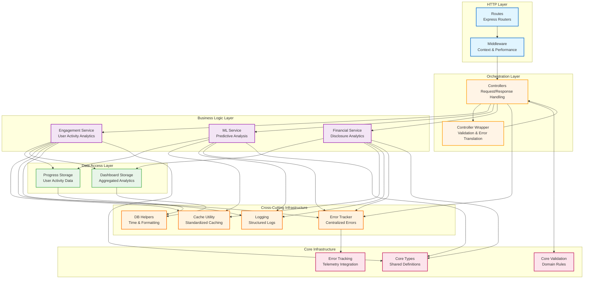
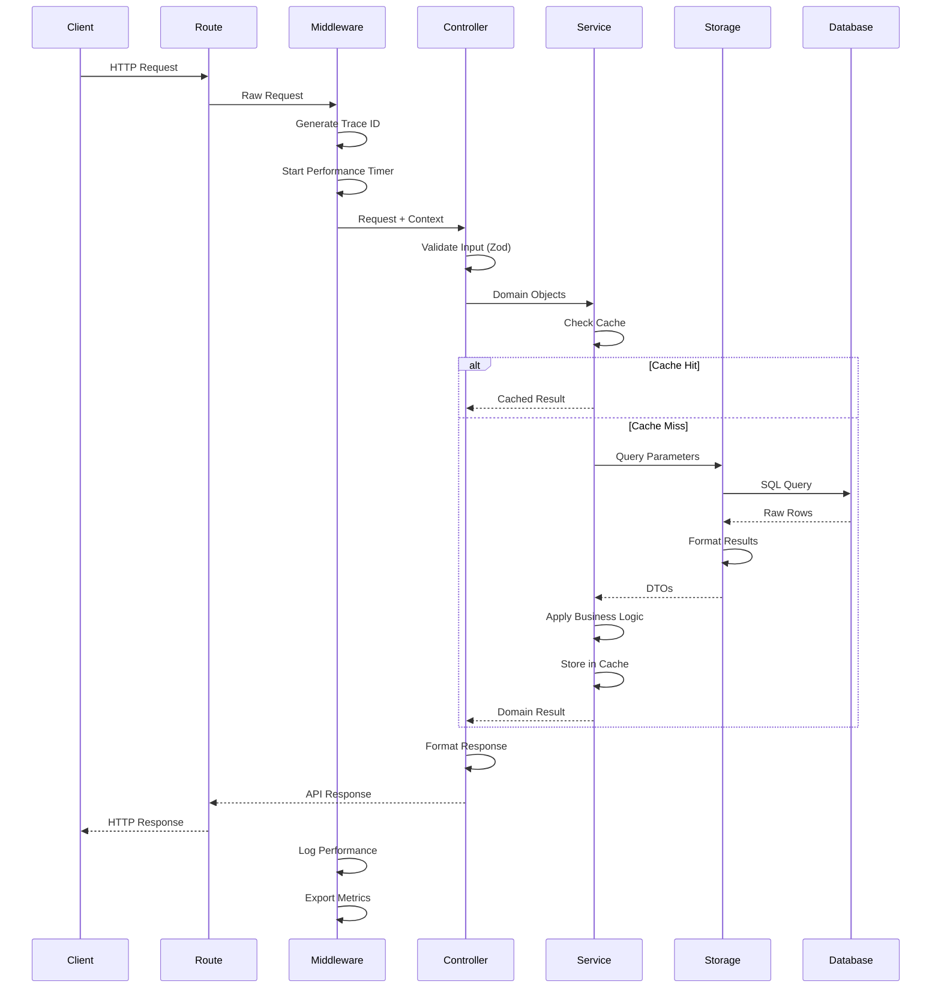
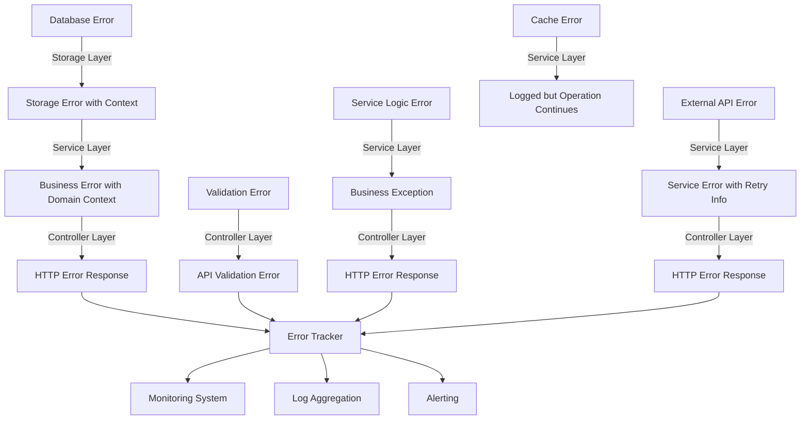
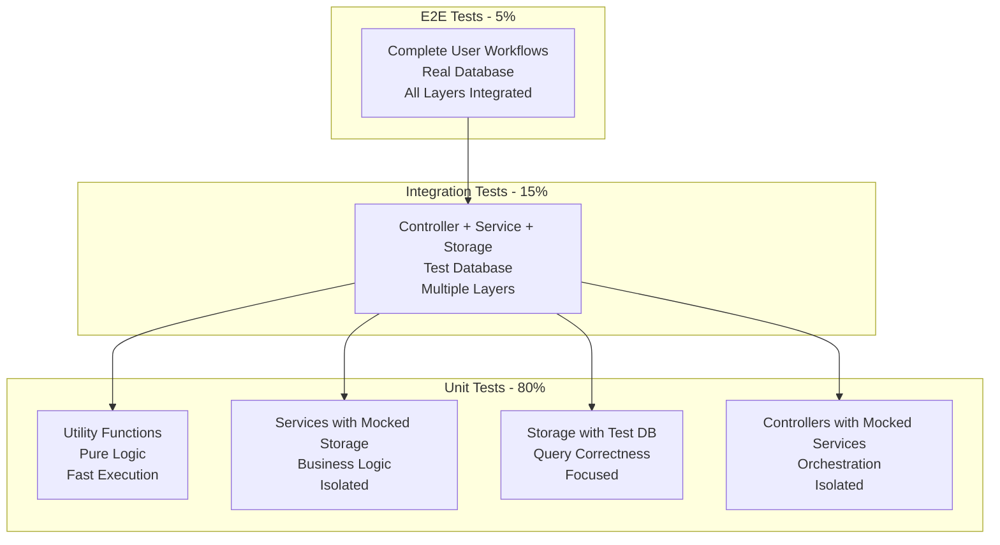

# Analytics Feature Refactoring - Design Document

## Executive Overview

### Problem Statement

The analytics feature module currently suffers from architectural deficiencies that significantly impede maintainability, increase bug risk, and limit the team's velocity when implementing new features. Validation logic, caching patterns, date calculations, and error handling are duplicated throughout the codebase, with each instance representing a potential point of inconsistency. The current flat structure obscures the intended architecture, making it difficult for developers to understand where different types of code should live and how components should interact.

When a pattern needs to evolve—such as improving cache error handling or fixing a timezone calculation bug—the change must be replicated across dozens of locations. Each replication represents an opportunity for mistakes, and inevitably some instances are missed, leading to inconsistent behavior across different endpoints. This duplication tax slows feature development, increases the cognitive burden on developers, and creates operational challenges when debugging production issues.

### Strategic Vision

This refactoring transforms the analytics feature into a well-architected system with clear separation of concerns, standardized patterns, and predictable organization. The vision is a codebase where:

- **Developers find what they need quickly** because code is organized by architectural role rather than arbitrary file names
- **Common patterns are implemented once** through well-tested utilities that handle edge cases comprehensively
- **Changes to patterns benefit all code automatically** because duplicate implementations are eliminated
- **New features follow established patterns naturally** because the patterns are obvious and well-documented
- **Production issues are diagnosed efficiently** because logging, error tracking, and monitoring follow consistent patterns
- **The architecture remains intact over time** because automated checks prevent violations

The refactored system achieves these goals while preserving complete API compatibility, ensuring that consumers of the analytics feature experience zero disruption during the transition.

### Architectural Principles

The design follows several core principles that guide all implementation decisions:

**Layered Architecture:** Code is organized into distinct layers—routes, controllers, services, storage—with clear responsibilities and dependencies flowing downward. Upper layers depend on lower layers but never vice versa.

**Single Responsibility:** Each component has one clear purpose. Routes handle HTTP concerns. Controllers orchestrate validation and response formatting. Services implement business logic. Storage encapsulates data access.

**Separation of Concerns:** HTTP concerns, business logic, and data access are strictly separated. Services remain unaware of HTTP, enabling them to be tested without mocking HTTP infrastructure and reused in non-HTTP contexts.

**Don't Repeat Yourself:** Common patterns are extracted into utilities that are tested once and reused everywhere. When a pattern appears in multiple places, it should be standardized.

**Integration over Invention:** Leverage existing infrastructure from `server/core` and `server/utils` rather than creating parallel systems. Analytics should feel like a natural part of the broader application.

**Progressive Enhancement:** The refactoring proceeds incrementally with each phase delivering value while maintaining system stability. The architecture improves continuously rather than through big-bang rewrites.

## High-Level System Architecture

The refactored analytics feature follows a layered architecture where each layer has clear responsibilities and well-defined integration points with adjacent layers.



### Data Flow Patterns

Understanding how data flows through the system helps clarify the role of each layer and the transformation that occurs at each boundary.



## Component Specifications

### Routes Layer

**Purpose:** Define HTTP endpoints and wire together middleware, controllers, and response handling without containing business logic.

**Key Features:**
- Declare RESTful endpoints with clear path structure
- Apply middleware for cross-cutting concerns
- Delegate all business logic to controllers
- Maintain thin handlers with minimal code

**TypeScript Interface Pattern:**
```typescript
// Each router focuses on a specific domain
export interface AnalyticsRouter {
  // Engagement tracking endpoints
  router: express.Router;
  basePath: string;
}

// Route handler structure (handled by wrapper)
type RouteHandler = (req: Request, res: Response) => Promise<void>;
```

**Integration Points:**
- **Imports from:** Controller layer, middleware layer
- **Exports to:** Main application router
- **Dependencies:** Express framework, controller wrapper utility

### Middleware Layer

**Purpose:** Provide cross-cutting functionality that applies to multiple endpoints without duplicating code in each handler.

**Key Features:**
- Generate and propagate trace IDs for request correlation
- Measure endpoint performance and log slow requests
- Add analytics-specific context to request objects
- Integrate with broader application middleware chain

**TypeScript Interface Pattern:**
```typescript
interface RequestContext {
  traceId: string;
  timestamp: Date;
  userId?: string;
  metadata: Record<string, any>;
}

// Middleware augments Express Request
declare global {
  namespace Express {
    interface Request {
      analyticsContext: RequestContext;
    }
  }
}

// Middleware functions follow Express pattern
type AnalyticsMiddleware = (
  req: Request,
  res: Response,
  next: NextFunction
) => void | Promise<void>;
```

**Integration Points:**
- **Imports from:** Logger utility, performance monitoring utility
- **Exports to:** Routes layer
- **Dependencies:** Express types, logging infrastructure

### Controller Layer

**Purpose:** Orchestrate the flow of data between HTTP layer and business logic, handling validation and response formatting consistently.

**Key Features:**
- Validate inputs using Zod schemas
- Translate HTTP requests into service calls with domain objects
- Format service results into HTTP responses
- Handle errors by translating exceptions into appropriate HTTP responses

**TypeScript Interface Pattern:**
```typescript
// Controller wrapper provides standardization
interface ControllerOptions<TInput> {
  bodySchema?: z.ZodSchema<any>;
  querySchema?: z.ZodSchema<any>;
  paramsSchema?: z.ZodSchema<any>;
}

type ControllerHandler<TInput, TOutput> = (
  input: TInput,
  req: Request
) => Promise<TOutput>;

function controllerWrapper<TInput, TOutput>(
  options: ControllerOptions<TInput>,
  handler: ControllerHandler<TInput, TOutput>
): RequestHandler;

// Example controller class structure
export class AnalyticsController {
  constructor(
    private engagementService: EngagementService,
    private mlService: MLService
  ) {}
  
  // Controller methods return handlers wrapped by controllerWrapper
  getEngagementMetrics(): RequestHandler {
    return controllerWrapper(
      { querySchema: EngagementMetricsSchema },
      async (input, req) => {
        return this.engagementService.getMetrics(
          input.timeframe,
          input.userId
        );
      }
    );
  }
}
```

**Integration Points:**
- **Imports from:** Service layer, validation schemas, controller wrapper utility
- **Exports to:** Routes layer
- **Dependencies:** Zod validation, API response utilities, core validation service

### Service Layer

**Purpose:** Implement all business logic for analytics operations, coordinating data access and applying business rules while remaining completely unaware of HTTP concerns.

**Key Features:**
- Accept and return domain objects never HTTP request or response objects
- Coordinate calls to storage layer for data retrieval and persistence
- Implement caching strategies using standardized cache utility
- Apply business logic like scoring, ranking, and aggregation
- Manage error contexts and use error tracker for logging

**TypeScript Interface Pattern:**
```typescript
// Services define clear interfaces with domain types
export interface EngagementService {
  getMetrics(
    timeframe: string,
    userId?: string
  ): Promise<EngagementMetrics>;
  
  trackEngagement(
    userId: string,
    action: EngagementAction
  ): Promise<void>;
  
  getEngagementTrends(
    startDate: Date,
    endDate: Date,
    groupBy: TimeGrouping
  ): Promise<EngagementTrend[]>;
}

// Domain types are clearly defined
interface EngagementMetrics {
  totalEngagements: number;
  uniqueUsers: number;
  averageEngagementsPerUser: number;
  topActions: ActionSummary[];
  timeSeriesData: TimeSeriesPoint[];
}

interface EngagementAction {
  type: 'view' | 'click' | 'share' | 'save';
  targetId: string;
  metadata?: Record<string, any>;
}

// Service implementation pattern
export class EngagementServiceImpl implements EngagementService {
  constructor(
    private progressStorage: ProgressStorage,
    private dashboardStorage: DashboardStorage
  ) {}
  
  async getMetrics(
    timeframe: string,
    userId?: string
  ): Promise<EngagementMetrics> {
    // Use cache utility for all caching
    return getOrSetCache(
      `engagement:metrics:${timeframe}:${userId || 'all'}`,
      CONFIG.cacheTTL.engagementMetrics,
      async () => {
        const threshold = buildTimeThreshold(timeframe);
        const rawData = await this.progressStorage.getEngagementData(
          threshold,
          userId
        );
        return this.calculateMetrics(rawData);
      }
    );
  }
  
  private calculateMetrics(
    rawData: EngagementDataRow[]
  ): EngagementMetrics {
    // Business logic implementation
  }
}
```

**Integration Points:**
- **Imports from:** Storage layer, domain types, cache utility, error tracker
- **Exports to:** Controller layer
- **Dependencies:** Storage interfaces, shared utilities, configuration

### Storage Layer

**Purpose:** Provide clean abstraction over database operations, isolating all ORM usage from business logic and enabling independent optimization of queries.

**Key Features:**
- Encapsulate all Drizzle ORM queries in focused methods
- Return raw database results or simple DTOs without business logic
- Handle database errors and provide meaningful failure information
- Use database helpers for consistent query patterns

**TypeScript Interface Pattern:**
```typescript
// Storage interfaces define clear contracts
export interface ProgressStorage {
  getEngagementData(
    startDate: Date,
    userId?: string
  ): Promise<EngagementDataRow[]>;
  
  recordEngagement(
    userId: string,
    action: string,
    targetId: string,
    metadata?: Record<string, any>
  ): Promise<void>;
  
  getUserProgress(
    userId: string
  ): Promise<UserProgressData | null>;
}

// DTOs returned by storage are simple data structures
interface EngagementDataRow {
  userId: string;
  actionType: string;
  targetId: string;
  timestamp: Date;
  metadata: Record<string, any> | null;
}

interface UserProgressData {
  userId: string;
  completedItems: string[];
  inProgressItems: string[];
  lastActivityDate: Date;
}

// Storage implementation pattern
export class ProgressStorageImpl implements ProgressStorage {
  constructor(private db: DrizzleDB) {}
  
  async getEngagementData(
    startDate: Date,
    userId?: string
  ): Promise<EngagementDataRow[]> {
    const query = this.db
      .select()
      .from(engagements)
      .where(gte(engagements.createdAt, startDate));
    
    if (userId) {
      query.where(eq(engagements.userId, userId));
    }
    
    const rows = await query.orderBy(desc(engagements.createdAt));
    return normalizeRowNumbers(rows);
  }
  
  async recordEngagement(
    userId: string,
    action: string,
    targetId: string,
    metadata?: Record<string, any>
  ): Promise<void> {
    await this.db.insert(engagements).values({
      userId,
      actionType: action,
      targetId,
      metadata,
      createdAt: new Date()
    });
  }
}
```

**Integration Points:**
- **Imports from:** Drizzle schema, database helpers, core storage types
- **Exports to:** Service layer
- **Dependencies:** Drizzle ORM, database connection, utility functions

### Cross-Cutting Utilities

**Purpose:** Provide focused, well-tested functionality that can be composed across layers, eliminating duplication and ensuring consistency.

#### Cache Utility

**TypeScript Interface:**
```typescript
// Extended functionality in server/utils/cache.ts
export async function getOrSetCache<T>(
  key: string,
  ttlSeconds: number,
  fn: () => Promise<T>
): Promise<T>;

// Metrics tracking
export interface CacheMetrics {
  hits: number;
  misses: number;
  hitRate: number;
  lastUpdated: Date;
}

export function getCacheMetrics(keyPrefix?: string): CacheMetrics;
```

**Behavior:**
- Checks cache for key, returns value immediately on hit
- Executes computation function on miss
- Stores result in cache before returning
- Handles cache failures gracefully without blocking computation
- Tracks hit/miss metrics per key prefix
- Logs cache operations at appropriate levels

#### Database Helpers

**TypeScript Interface:**
```typescript
// New functionality in server/utils/db-helpers.ts
export function buildTimeThreshold(timeframe: string): Date;

export function normalizeRowNumbers(
  rows: any[]
): any[];

export type TimeGrouping = 'hour' | 'day' | 'week' | 'month';

export function groupByTime<T>(
  data: T[],
  dateExtractor: (item: T) => Date,
  grouping: TimeGrouping
): Map<string, T[]>;
```

**Behavior:**
- Parses timeframe strings consistently ("7d", "30d", "1h")
- Handles special values ("month-start", "week-start")
- Works in UTC to avoid timezone issues
- Handles edge cases (month boundaries, leap years, DST)
- Provides clear errors for invalid inputs

#### Controller Wrapper

**TypeScript Interface:**
```typescript
// New functionality in server/utils/analytics-controller-wrapper.ts
export interface ControllerWrapperOptions<TInput> {
  bodySchema?: z.ZodSchema<any>;
  querySchema?: z.ZodSchema<any>;
  paramsSchema?: z.ZodSchema<any>;
}

export type ControllerHandler<TInput, TOutput> = (
  input: TInput,
  req: Request
) => Promise<TOutput>;

export function controllerWrapper<TInput, TOutput>(
  options: ControllerWrapperOptions<TInput>,
  handler: ControllerHandler<TInput, TOutput>
): RequestHandler;
```

**Behavior:**
- Validates inputs using provided Zod schemas
- Merges body, query, and params into single input object
- Catches ZodError and returns ApiValidationError
- Catches handler exceptions and returns ApiError
- Integrates with core validation for domain rules
- Wraps successful results in ApiSuccess
- Propagates request context through handler

## Data Models

### Core Domain Types

The analytics domain centers around tracking user engagement and generating insights. The type hierarchy reflects this focus:

```typescript
// Base types in types/common.ts
export interface TimeSeriesDataPoint {
  value: number;
  timestamp: Date;
  userId: string;
  metadata?: Record<string, any>;
}

export interface DateRange {
  startDate: Date;
  endDate: Date;
}

export interface PaginationParams {
  page: number;
  pageSize: number;
}

export interface PaginatedResult<T> {
  items: T[];
  total: number;
  page: number;
  pageSize: number;
  hasMore: boolean;
}

// Engagement types in types/engagement.ts
export interface EngagementMetrics {
  totalEngagements: number;
  uniqueUsers: number;
  averageEngagementsPerUser: number;
  topActions: ActionSummary[];
  timeSeriesData: TimeSeriesPoint[];
  period: DateRange;
}

export interface ActionSummary {
  actionType: string;
  count: number;
  percentage: number;
  trend: 'up' | 'down' | 'stable';
}

export interface EngagementTrend {
  date: Date;
  engagementCount: number;
  uniqueUsers: number;
  topAction: string;
}

export interface UserEngagementProfile {
  userId: string;
  totalEngagements: number;
  firstEngagement: Date;
  lastEngagement: Date;
  favoriteActions: string[];
  engagementScore: number;
}

// ML types in types/ml.ts
export interface MLAnalysisResult extends TimeSeriesDataPoint {
  confidence: number;
  modelVersion: string;
  prediction: string;
  factors: PredictionFactor[];
}

export interface PredictionFactor {
  name: string;
  importance: number;
  contribution: number;
}

export interface ModelPerformanceMetrics {
  accuracy: number;
  precision: number;
  recall: number;
  f1Score: number;
  lastEvaluated: Date;
}

// Financial types in types/financial-disclosure.ts
export interface FinancialMetric extends TimeSeriesDataPoint {
  disclosureType: string;
  amount: number;
  verified: boolean;
  source: string;
}

export interface DisclosureAggregation {
  period: DateRange;
  totalAmount: number;
  averageAmount: number;
  disclosureCount: number;
  verifiedPercentage: number;
  byType: TypeBreakdown[];
}

export interface TypeBreakdown {
  type: string;
  amount: number;
  percentage: number;
  count: number;
}
```

### Database Schema Mapping

The storage layer interfaces with Drizzle schemas that map to database tables. These schemas are defined separately but referenced through storage interfaces:

```typescript
// Storage returns DTOs that map from database schemas
export interface EngagementDataRow {
  id: string;
  userId: string;
  actionType: string;
  targetId: string;
  timestamp: Date;
  metadata: Record<string, any> | null;
  createdAt: Date;
  updatedAt: Date;
}

export interface UserProgressDataRow {
  userId: string;
  itemId: string;
  status: 'completed' | 'in_progress' | 'not_started';
  progressPercentage: number;
  lastActivityDate: Date;
  metadata: Record<string, any> | null;
}

export interface DashboardAggregateRow {
  aggregateKey: string;
  aggregateValue: number;
  calculatedAt: Date;
  expiresAt: Date;
}
```

## Error Handling Strategy

### Hierarchical Error Handling

The system implements a layered error handling approach where each layer adds context and translates errors appropriately for its consuming layer.



### Error Types and Recovery Mechanisms

**Storage Layer Errors:**
```typescript
class StorageError extends Error {
  constructor(
    message: string,
    public readonly operation: string,
    public readonly cause?: Error
  ) {
    super(message);
    this.name = 'StorageError';
  }
}

// Storage methods throw StorageError with context
async getUserProgress(userId: string): Promise<UserProgressData | null> {
  try {
    const result = await this.db.query.progress.findFirst({
      where: eq(progress.userId, userId)
    });
    return result || null;
  } catch (error) {
    throw new StorageError(
      `Failed to retrieve user progress for user ${userId}`,
      'getUserProgress',
      error as Error
    );
  }
}
```

**Service Layer Errors:**
```typescript
class BusinessError extends Error {
  constructor(
    message: string,
    public readonly code: string,
    public readonly context?: Record<string, any>
  ) {
    super(message);
    this.name = 'BusinessError';
  }
}

// Services catch storage errors and add business context
async getMetrics(timeframe: string, userId?: string): Promise<EngagementMetrics> {
  try {
    const threshold = buildTimeThreshold(timeframe);
    const data = await this.progressStorage.getEngagementData(threshold, userId);
    return this.calculateMetrics(data);
  } catch (error) {
    if (error instanceof StorageError) {
      errorTracker.capture(error, {
        component: 'analytics',
        operation: 'getEngagementMetrics',
        timeframe,
        userId
      });
      throw new BusinessError(
        'Unable to retrieve engagement metrics',
        'METRICS_RETRIEVAL_FAILED',
        { timeframe, userId, originalError: error.message }
      );
    }
    throw error;
  }
}
```

**Controller Layer Error Translation:**
```typescript
// Controller wrapper automatically translates errors
function controllerWrapper<TInput, TOutput>(
  options: ControllerWrapperOptions<TInput>,
  handler: ControllerHandler<TInput, TOutput>
): RequestHandler {
  return async (req: Request, res: Response) => {
    try {
      // Validation and handler execution
      const result = await handler(validatedInput, req);
      return ApiSuccess(res, result);
    } catch (error) {
      if (error instanceof z.ZodError) {
        return ApiValidationError(res, error);
      }
      if (error instanceof BusinessError) {
        return ApiError(res, error.message, 400, error.code);
      }
      
      errorTracker.capture(error, {
        component: 'analytics',
        operation: 'controller',
        path: req.path,
        traceId: req.analyticsContext?.traceId
      });
      
      return ApiError(res, 'An unexpected error occurred', 500);
    }
  };
}
```

**Cache Error Handling:**
```typescript
// Cache errors are logged but don't fail operations
async function getOrSetCache<T>(
  key: string,
  ttlSeconds: number,
  fn: () => Promise<T>
): Promise<T> {
  try {
    const cached = await cache.get(key);
    if (cached) {
      cacheMetrics.recordHit(key);
      return JSON.parse(cached);
    }
  } catch (error) {
    logger.warn('Cache get failed, proceeding to computation', {
      key,
      error: error.message
    });
  }
  
  cacheMetrics.recordMiss(key);
  const result = await fn();
  
  try {
    await cache.set(key, JSON.stringify(result), ttlSeconds);
  } catch (error) {
    logger.warn('Cache set failed, returning computed result', {
      key,
      error: error.message
    });
  }
  
  return result;
}
```

### Error Recovery Patterns

**Transient Errors:** Operations that might succeed on retry (database connection issues, external API timeouts) should include retry logic with exponential backoff at the service layer.

**Permanent Errors:** Errors that won't resolve on retry (validation failures, authorization errors, missing data) should fail fast and return clear error messages.

**Partial Failures:** When aggregating data from multiple sources, consider returning partial results with indicators of what failed rather than failing entirely.

**Graceful Degradation:** When non-critical features fail (analytics, recommendations), the system should continue functioning with reduced capability rather than failing completely.

## Testing Strategy

### Test Pyramid Structure

The testing strategy follows the classic test pyramid with emphasis on fast, focused unit tests at the base and fewer, more comprehensive integration tests higher up.



### Layer-Specific Testing Approaches

**Utility Testing:**
```typescript
describe('getOrSetCache', () => {
  it('returns cached value on cache hit', async () => {
    const fn = jest.fn().mockResolvedValue({ data: 'test' });
    cache.get = jest.fn().mockResolvedValue('{"data":"test"}');
    
    const result = await getOrSetCache('test-key', 300, fn);
    
    expect(result).toEqual({ data: 'test' });
    expect(fn).not.toHaveBeenCalled();
    expect(cache.get).toHaveBeenCalledWith('test-key');
  });
  
  it('executes function and caches result on cache miss', async () => {
    const fn = jest.fn().mockResolvedValue({ data: 'test' });
    cache.get = jest.fn().mockResolvedValue(null);
    cache.set = jest.fn().mockResolvedValue(undefined);
    
    const result = await getOrSetCache('test-key', 300, fn);
    
    expect(result).toEqual({ data: 'test' });
    expect(fn).toHaveBeenCalled();
    expect(cache.set).toHaveBeenCalledWith(
      'test-key',
      '{"data":"test"}',
      300
    );
  });
  
  it('continues on cache get failure', async () => {
    const fn = jest.fn().mockResolvedValue({ data: 'test' });
    cache.get = jest.fn().mockRejectedValue(new Error('Cache unavailable'));
    
    const result = await getOrSetCache('test-key', 300, fn);
    
    expect(result).toEqual({ data: 'test' });
    expect(fn).toHaveBeenCalled();
  });
});

describe('buildTimeThreshold', () => {
  beforeEach(() => {
    jest.useFakeTimers();
    jest.setSystemTime(new Date('2025-10-11T12:00:00Z'));
  });
  
  afterEach(() => {
    jest.useRealTimers();
  });
  
  it('calculates threshold for days correctly', () => {
    const threshold = buildTimeThreshold('7d');
    expect(threshold).toEqual(new Date('2025-10-04T12:00:00Z'));
  });
  
  it('handles month-start correctly', () => {
    const threshold = buildTimeThreshold('month-start');
    expect(threshold).toEqual(new Date('2025-10-01T00:00:00Z'));
  });
  
  it('throws error for invalid format', () => {
    expect(() => buildTimeThreshold('invalid')).toThrow(
      'Invalid timeframe format'
    );
  });
});
```

**Service Testing:**
```typescript
describe('EngagementService', () => {
  let service: EngagementService;
  let mockProgressStorage: jest.Mocked<ProgressStorage>;
  let mockDashboardStorage: jest.Mocked<DashboardStorage>;
  
  beforeEach(() => {
    mockProgressStorage = {
      getEngagementData: jest.fn(),
      recordEngagement: jest.fn(),
    } as any;
    
    mockDashboardStorage = {
      getAggregates: jest.fn(),
    } as any;
    
    service = new EngagementServiceImpl(
      mockProgressStorage,
      mockDashboardStorage
    );
  });
  
  describe('getMetrics', () => {
    it('returns calculated metrics from storage data', async () => {
      const mockData: EngagementDataRow[] = [
        {
          userId: 'user1',
          actionType: 'view',
          targetId: 'item1',
          timestamp: new Date('2025-10-10'),
          metadata: null,
        },
        {
          userId: 'user1',
          actionType: 'click',
          targetId: 'item1',
          timestamp: new Date('2025-10-10'),
          metadata: null,
        },
      ];
      
      mockProgressStorage.getEngagementData.mockResolvedValue(mockData);
      
      const result = await service.getMetrics('7d');
      
      expect(result.totalEngagements).toBe(2);
      expect(result.uniqueUsers).toBe(1);
      expect(mockProgressStorage.getEngagementData).toHaveBeenCalledWith(
        expect.any(Date),
        undefined
      );
    });
    
    it('uses cache for repeated calls', async () => {
      mockProgressStorage.getEngagementData.mockResolvedValue([]);
      
      await service.getMetrics('7d');
      await service.getMetrics('7d');
      
      expect(mockProgressStorage.getEngagementData).toHaveBeenCalledTimes(1);
    });
    
    it('handles storage errors gracefully', async () => {
      mockProgressStorage.getEngagementData.mockRejectedValue(
        new StorageError('DB connection failed', 'getEngagementData')
      );
      
      await expect(service.getMetrics('7d')).rejects.toThrow(BusinessError);
    });
  });
});
```

**Storage Testing:**
```typescript
describe('ProgressStorage', () => {
  let storage: ProgressStorage;
  let testDb: TestDatabase;
  
  beforeEach(async () => {
    testDb = await setupTestDatabase();
    storage = new ProgressStorageImpl(testDb.db);
  });
  
  afterEach(async () => {
    await testDb.cleanup();
  });
  
  describe('getEngagementData', () => {
    it('retrieves engagements after threshold', async () => {
      await testDb.seed([
        {
          userId: 'user1',
          actionType: 'view',
          targetId: 'item1',
          createdAt: new Date('2025-10-10'),
        },
        {
          userId: 'user2',
          actionType: 'click',
          targetId: 'item2',
          createdAt: new Date('2025-10-01'),
        },
      ]);
      
      const result = await storage.getEngagementData(
        new Date('2025-10-05')
      );
      
      expect(result).toHaveLength(1);
      expect(result[0].userId).toBe('user1');
    });
    
    it('filters by userId when provided', async () => {
      await testDb.seed([
        {
          userId: 'user1',
          actionType: 'view',
          targetId: 'item1',
          createdAt: new Date('2025-10-10'),
        },
        {
          userId: 'user2',
          actionType: 'click',
          targetId: 'item2',
          createdAt: new Date('2025-10-10'),
        },
      ]);
      
      const result = await storage.getEngagementData(
        new Date('2025-10-01'),
        'user1'
      );
      
      expect(result).toHaveLength(1);
      expect(result[0].userId).toBe('user1');
    });
  });
});
```

**Controller Testing:**
```typescript
describe('AnalyticsController', () => {
  let controller: AnalyticsController;
  let mockEngagementService: jest.Mocked<EngagementService>;
  
  beforeEach(() => {
    mockEngagementService = {
      getMetrics: jest.fn(),
      trackEngagement: jest.fn(),
    } as any;
    
    controller = new AnalyticsController(mockEngagementService);
  });
  
  describe('getEngagementMetrics', () => {
    it('returns metrics from service', async () => {
      const mockMetrics: EngagementMetrics = {
        totalEngagements: 100,
        uniqueUsers: 50,
        averageEngagementsPerUser: 2,
        topActions: [],
        timeSeriesData: [],
        period: {
          startDate: new Date('2025-10-04'),
          endDate: new Date('2025-10-11'),
        },
      };
      
      mockEngagementService.getMetrics.mockResolvedValue(mockMetrics);
      
      const req = {
        query: { timeframe: '7d' },
        analyticsContext: { traceId: 'test-trace' },
      } as any;
      const res = mockResponse();
      
      const handler = controller.getEngagementMetrics();
      await handler(req, res, jest.fn());
      
      expect(res.json).toHaveBeenCalledWith(
        expect.objectContaining({
          success: true,
          data: mockMetrics,
        })
      );
    });
  });
});
```

**Integration Testing:**
```typescript
describe('Analytics API Integration', () => {
  let app: Express;
  let testDb: TestDatabase;
  
  beforeAll(async () => {
    testDb = await setupTestDatabase();
    app = createTestApp(testDb.db);
  });
  
  afterAll(async () => {
    await testDb.cleanup();
  });
  
  describe('GET /analytics/engagement/metrics', () => {
    it('returns engagement metrics for valid request', async () => {
      await testDb.seed([
        {
          userId: 'user1',
          actionType: 'view',
          targetId: 'item1',
          createdAt: new Date('2025-10-10'),
        },
      ]);
      
      const response = await request(app)
        .get('/analytics/engagement/metrics')
        .query({ timeframe: '7d' })
        .expect(200);
      
      expect(response.body.success).toBe(true);
      expect(response.body.data.totalEngagements).toBeGreaterThan(0);
    });
    
    it('returns validation error for invalid timeframe', async () => {
      const response = await request(app)
        .get('/analytics/engagement/metrics')
        .query({ timeframe: 'invalid' })
        .expect(400);
      
      expect(response.body.success).toBe(false);
      expect(response.body.error).toContain('validation');
    });
  });
});
```

### Performance Testing

Critical endpoints should have performance benchmarks that verify they meet latency requirements:

```typescript
describe('Performance Tests', () => {
  it('getEngagementMetrics completes within 500ms', async () => {
    const startTime = Date.now();
    
    await request(app)
      .get('/analytics/engagement/metrics')
      .query({ timeframe: '30d' })
      .expect(200);
    
    const duration = Date.now() - startTime;
    expect(duration).toBeLessThan(500);
  });
  
  it('handles 100 concurrent requests without degradation', async () => {
    const requests = Array(100).fill(null).map(() =>
      request(app)
        .get('/analytics/engagement/metrics')
        .query({ timeframe: '7d' })
    );
    
    const startTime = Date.now();
    await Promise.all(requests);
    const duration = Date.now() - startTime;
    
    const avgLatency = duration / 100;
    expect(avgLatency).toBeLessThan(200);
  });
});
```

## Implementation Phases and Success Criteria

### Phase A: Foundation (2-3 hours)

**Deliverables:**
- Types folder with consolidated domain types
- Enhanced cache utility with metrics
- Configuration management infrastructure
- Core error tracking integration

**Success Criteria:**
- All types compile with zero duplication
- Cache utility has 90%+ test coverage
- Configuration validates at startup
- At least 2 services use error tracker

**Verification:**
- `npm run type-check` passes
- `npm test -- cache.test` passes all tests
- Application fails to start with invalid config
- Error tracker logs appear in monitoring

### Phase B: Request Handling (2-3 hours)

**Deliverables:**
- Controller wrapper utility
- Request context middleware
- Performance tracking middleware
- 2 refactored example routes

**Success Criteria:**
- Controller wrapper has 90%+ test coverage
- Middleware properly propagates context
- Example routes reduce code by 60%+
- All tests pass

**Verification:**
- `npm test -- controller-wrapper.test` passes
- Trace IDs appear in all logs for test requests
- Slow request logging triggers for delayed responses
- Example route tests pass without modification

### Phase C: Reorganization (4-6 hours)

**Deliverables:**
- All services moved to services folder
- All storage moved to storage folder
- All imports updated and verified
- Migration checklist completed

**Success Criteria:**
- TypeScript compilation succeeds
- All existing tests pass without modification
- No broken imports remain
- Folder structure matches target architecture

**Verification:**
- `npm run build` succeeds
- `npm test` passes all tests
- Search for old import paths returns no results
- Folder structure review confirms organization

### Phase D: Standardization (2-3 hours)

**Deliverables:**
- Database helpers implemented and adopted
- Cache operations standardized throughout
- Logging standardized with context helpers
- Duplication eliminated

**Success Criteria:**
- 90%+ cache operations use utility
- Date calculations use helpers
- Logging follows consistent patterns
- Code duplication metrics improve significantly

**Verification:**
- Code audit shows standardization
- Pattern search confirms adoption
- Metrics show duplication reduction
- Tests verify behavior preservation

### Phase E: Finalization (2-3 hours)

**Deliverables:**
- Comprehensive README with examples
- OpenAPI documentation
- Monitoring dashboards
- Code review checklist
- Automated boundary checks

**Success Criteria:**
- Documentation covers all common tasks
- API docs generated from schemas
- Dashboards show key metrics
- Automated checks enforce architecture
- 80%+ overall test coverage

**Verification:**
- Documentation review confirms completeness
- OpenAPI spec validates against schema
- Dashboards display metrics correctly
- CI enforces architectural rules
- Coverage report meets threshold

## Migration Strategy and Backward Compatibility

### API Contract Preservation

**Immutable Contracts:**
All existing HTTP endpoints maintain exact compatibility:
- Request paths remain unchanged
- Request parameter names and types unchanged
- Response structures unchanged
- Error response formats unchanged
- HTTP status codes unchanged

**Validation:**
```typescript
// Before and after integration tests verify compatibility
describe('API Compatibility', () => {
  it('maintains response structure for GET /engagement/metrics', async () => {
    const response = await request(app)
      .get('/analytics/engagement/metrics')
      .query({ timeframe: '7d' });
    
    expect(response.body).toMatchObject({
      success: expect.any(Boolean),
      data: {
        totalEngagements: expect.any(Number),
        uniqueUsers: expect.any(Number),
        averageEngagementsPerUser: expect.any(Number),
        topActions: expect.any(Array),
        timeSeriesData: expect.any(Array),
      },
    });
  });
});
```

### Rollback Procedures

Each phase has a clear rollback path:

**Phase A:** Remove new utilities, restore original code
**Phase B:** Revert route changes, remove wrapper
**Phase C:** Restore file locations, update imports
**Phase D:** Restore original implementations
**Phase E:** Remove documentation additions

All rollbacks verified through:
- Git revert of specific commits
- Test suite validation
- Deployment to staging for verification

### Gradual Rollout Strategy

**Feature Flags:**
```typescript
// Configuration controls feature adoption
export const analyticsConfig = {
  useRefactoredEndpoints: env.ANALYTICS_REFACTORED_ENABLED === 'true',
  refactoredEndpointPercentage: parseInt(
    env.ANALYTICS_REFACTORED_PERCENTAGE || '0'
  ),
};

// Routes can conditionally use old or new implementation
router.get('/metrics', (req, res, next) => {
  if (shouldUseRefactored(req)) {
    return refactoredHandler(req, res, next);
  }
  return legacyHandler(req, res, next);
});
```

## Operational Considerations

### Monitoring and Observability

**Key Metrics:**
- Endpoint latency (p50, p95, p99)
- Error rate by endpoint and error type
- Cache hit rate by key prefix
- Database query duration
- Request volume and patterns

**Dashboards:**
```typescript
// Metrics exported to monitoring system
export const analyticsMetrics = {
  endpointLatency: new Histogram({
    name: 'analytics_endpoint_latency_ms',
    help: 'Analytics endpoint latency in milliseconds',
    labelNames: ['endpoint', 'method'],
  }),
  
  cacheHitRate: new Gauge({
    name: 'analytics_cache_hit_rate',
    help: 'Cache hit rate by key prefix',
    labelNames: ['prefix'],
  }),
  
  errorRate: new Counter({
    name: 'analytics_errors_total',
    help: 'Total analytics errors by type',
    labelNames: ['errorType', 'endpoint'],
  }),
};
```

### Performance Expectations

**Target Latencies:**
- Simple metrics endpoints: < 200ms (p95)
- Complex aggregation endpoints: < 500ms (p95)
- Data recording endpoints: < 100ms (p95)

**Cache Performance:**
- Cache hit rate: > 70% for frequently accessed data
- Cache operation latency: < 5ms

**Database Performance:**
- Simple queries: < 50ms
- Complex aggregations: < 200ms
- Write operations: < 30ms

### Capacity Planning

**Resource Utilization:**
- CPU: Metrics calculation and aggregation
- Memory: Cache storage and query result processing
- Database: Query load and connection pool
- Network: API response sizes

**Scaling Considerations:**
- Horizontal scaling through stateless services
- Cache layer scales independently
- Database read replicas for analytics queries
- Rate limiting prevents resource exhaustion

## Conclusion

This design document establishes a comprehensive architectural vision for the analytics feature refactoring. The layered architecture with clear separation of concerns, standardized utilities, and integration with core infrastructure creates a foundation for sustainable development and reliable operations.

The design balances architectural purity with pragmatic reuse of existing infrastructure, ensuring that the analytics feature integrates seamlessly with the broader application while maintaining clear boundaries and responsibilities. The incremental implementation approach allows the team to deliver value continuously while managing risk through careful verification at each phase.

Success in this refactoring will be measured not just by the technical improvements in code organization and test coverage, but by the team's increased velocity in implementing new analytics features, the reduction in production issues, and the confidence that developers have in modifying the system. The architecture should feel obvious and natural, guiding developers toward correct patterns rather than requiring constant vigilance against violations.